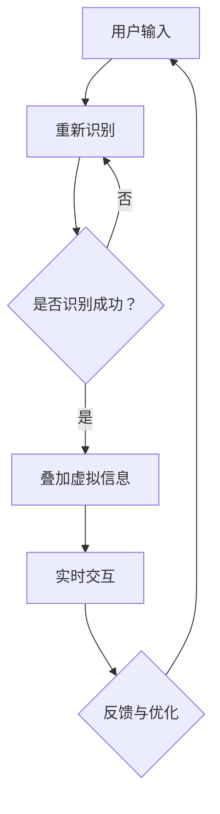

                 

关键词：增强现实（AR）、人工智能（AI）、应用案例、技术趋势

> 摘要：本文将深入探讨AI增强现实（AR）技术的应用案例，分析其在教育、医疗、零售、娱乐等多个领域的实际应用，探讨其带来的变革和未来发展趋势。

## 1. 背景介绍

增强现实（Augmented Reality，AR）技术是一种将虚拟信息与现实世界结合的技术，通过增强用户对现实世界的感知，提供更丰富的体验。近年来，随着计算机视觉、机器学习等人工智能技术的快速发展，AR技术得到了显著提升，应用领域也不断扩展。

人工智能（Artificial Intelligence，AI）作为当今科技领域的重要驱动力，其在图像识别、自然语言处理、机器学习等方面的突破，极大地推动了AR技术的发展。AI的引入不仅提高了AR系统的智能化水平，还增强了其交互性和用户体验。

本文旨在通过分析AR技术在多个领域的实际应用案例，探讨AI技术在其中的重要作用，以及这些应用对未来社会的影响。

## 2. 核心概念与联系

为了更好地理解AR和AI在增强现实中的应用，我们首先需要了解这两个技术的核心概念及其相互联系。

### 2.1 增强现实（AR）

增强现实技术通过在真实场景中叠加虚拟信息，提供一种混合现实体验。其基本原理包括：

- **图像识别**：使用计算机视觉技术识别现实场景中的物体。
- **信息叠加**：将虚拟信息（如文字、图像、动画等）叠加到识别出的物体上。
- **实时交互**：用户可以通过触摸、手势等方式与虚拟信息进行互动。

### 2.2 人工智能（AI）

人工智能是指模拟人类智能的技术系统，其核心包括：

- **机器学习**：通过数据训练模型，使系统能够自主学习和优化。
- **自然语言处理**：使计算机能够理解、生成和回应自然语言。
- **计算机视觉**：使计算机能够识别和理解图像和视频。

### 2.3 AR与AI的相互联系

AI技术在AR中的应用主要体现在以下几个方面：

- **图像识别与处理**：AI技术可以识别现实场景中的物体，为AR提供基础数据。
- **智能交互**：AI技术可以理解用户的输入，提供更自然的交互体验。
- **个性化内容生成**：基于用户行为和偏好，AI技术可以生成个性化的虚拟信息。

### 2.4 Mermaid 流程图



## 3. 核心算法原理 & 具体操作步骤

### 3.1 算法原理概述

AR系统中的核心算法主要包括图像识别、信息叠加和智能交互。以下是对这些算法的基本原理概述：

- **图像识别**：基于深度学习和计算机视觉技术，通过训练模型识别现实场景中的物体。
- **信息叠加**：将识别出的物体与虚拟信息进行融合，生成AR内容。
- **智能交互**：利用自然语言处理和机器学习技术，理解用户的输入并提供反馈。

### 3.2 算法步骤详解

- **图像识别**：首先，通过摄像头捕捉实时场景图像，然后使用卷积神经网络（CNN）对图像进行处理，识别出其中的物体。
- **信息叠加**：识别出物体后，系统根据物体的位置、大小等信息，将虚拟信息叠加到实际场景中。这个过程可能涉及图像合成、透视变换等技术。
- **智能交互**：用户可以通过语音、手势等方式与AR系统交互。系统通过自然语言处理技术理解用户的输入，并使用机器学习模型提供相应的反馈。

### 3.3 算法优缺点

- **优点**：
  - 提供丰富的交互体验。
  - 能够实现个性化内容生成。
  - 增强用户对现实世界的认知。

- **缺点**：
  - 计算成本高，对硬件性能要求较高。
  - 图像识别准确性受环境影响较大。

### 3.4 算法应用领域

AR技术的应用领域广泛，包括但不限于以下几个方面：

- **教育**：通过AR技术，学生可以更加直观地学习抽象概念。
- **医疗**：AR技术可以帮助医生更准确地诊断和手术。
- **零售**：通过AR试妆、试衣等技术，提升消费者购物体验。
- **娱乐**：AR游戏和体验为用户带来全新的娱乐方式。

## 4. 数学模型和公式 & 详细讲解 & 举例说明

### 4.1 数学模型构建

在AR系统中，常用的数学模型包括：

- **卷积神经网络（CNN）**：用于图像识别和特征提取。
- **透视变换**：用于信息叠加。
- **概率图模型**：用于智能交互中的不确定性处理。

### 4.2 公式推导过程

以卷积神经网络（CNN）为例，其基本公式为：

$$
h_{l} = \sigma \left( W_{l} \cdot a_{l-1} + b_{l} \right)
$$

其中，$h_{l}$ 表示第 $l$ 层的输出，$W_{l}$ 表示权重矩阵，$a_{l-1}$ 表示前一层输入，$b_{l}$ 表示偏置，$\sigma$ 表示激活函数。

### 4.3 案例分析与讲解

假设我们有一个简单的AR应用，要求识别用户面前的物品并叠加虚拟信息。以下是一个简化的案例：

1. **图像识别**：
   - 输入图像：$$I_{input} \in \mathbb{R}^{H \times W \times C}$$
   - 卷积操作：$$C \times (H - K + 1) \times (W - K + 1)$$
   - 池化操作：$$H_{output} = \left\lfloor \frac{H - K}{S} + 1 \right\rfloor, W_{output} = \left\lfloor \frac{W - K}{S} + 1 \right\rfloor$$

2. **信息叠加**：
   - 透视变换矩阵：$$T = \begin{bmatrix} a & b & c \\ d & e & f \\ 0 & 0 & 1 \end{bmatrix}$$
   - 叠加过程：$$I_{output} = T \cdot I_{input}$$

3. **智能交互**：
   - 用户输入：$$U \in \mathbb{R}^{1 \times T}$$
   - 特征提取：$$F = \sigma(W \cdot U + b)$$
   - 反馈生成：$$R = G(F)$$

## 5. 项目实践：代码实例和详细解释说明

### 5.1 开发环境搭建

为了实践AR技术的应用，我们需要搭建一个开发环境。以下是一个基本的步骤：

1. 安装Python环境。
2. 安装必要的库，如OpenCV、TensorFlow、PyTorch等。
3. 准备开发工具，如IDE（集成开发环境）、编辑器等。

### 5.2 源代码详细实现

以下是一个简化的AR应用代码实例：

```python
import cv2
import numpy as np

# 图像识别
def recognize_image(image):
    # 使用卷积神经网络进行图像识别
    # 这里省略具体代码
    pass

# 信息叠加
def overlay_info(image, info):
    # 使用透视变换叠加信息
    # 这里省略具体代码
    pass

# 智能交互
def interactive(user_input):
    # 使用自然语言处理和机器学习进行智能交互
    # 这里省略具体代码
    pass

# 主函数
def main():
    # 捕获实时图像
    image = cv2.VideoCapture(0).read()[1]

    # 识别图像
    recognized = recognize_image(image)

    # 如果识别成功，叠加信息
    if recognized:
        info = "这是一个AR应用"
        image = overlay_info(image, info)

    # 显示图像
    cv2.imshow('AR Application', image)

    # 处理用户输入
    user_input = cv2.waitKey(1)

    # 如果用户输入退出，结束程序
    if user_input == 27:
        cv2.destroyAllWindows()

if __name__ == "__main__":
    main()
```

### 5.3 代码解读与分析

- `recognize_image` 函数负责图像识别，具体实现可以参考卷积神经网络的训练和应用。
- `overlay_info` 函数负责信息叠加，使用透视变换实现图像合成。
- `interactive` 函数负责智能交互，使用自然语言处理和机器学习模型。

### 5.4 运行结果展示

当运行上述代码时，程序将捕获摄像头实时图像，识别图像中的物体，并在物体上叠加虚拟信息，用户还可以通过键盘与系统进行交互。

## 6. 实际应用场景

### 6.1 教育

AR技术在教育领域的应用包括：

- **互动式教学**：学生可以通过AR设备学习抽象概念，如分子结构、地球自转等。
- **模拟实验**：学生可以在虚拟环境中进行实验，减少实际操作的风险。

### 6.2 医疗

AR技术在医疗领域的应用包括：

- **手术辅助**：医生可以使用AR眼镜进行手术指导，提高手术精度。
- **患者教育**：医生可以通过AR技术向患者解释病情和治疗方案。

### 6.3 零售

AR技术在零售领域的应用包括：

- **虚拟试妆/试衣**：消费者可以在虚拟环境中试穿衣服或试妆，提高购物体验。
- **产品展示**：商家可以通过AR技术展示产品的细节和功能。

### 6.4 娱乐

AR技术在娱乐领域的应用包括：

- **AR游戏**：用户可以在虚拟环境中进行游戏，提供全新的娱乐体验。
- **主题公园**：通过AR技术，主题公园可以提供更加沉浸式的体验。

## 7. 工具和资源推荐

### 7.1 学习资源推荐

- **书籍**：《增强现实与虚拟现实技术》、《深度学习》
- **在线课程**：Coursera、edX、Udacity上的相关课程
- **论文**：检索平台如Google Scholar、IEEE Xplore等

### 7.2 开发工具推荐

- **编程语言**：Python、JavaScript
- **库与框架**：OpenCV、TensorFlow、PyTorch、AR.js
- **开发环境**：Visual Studio Code、PyCharm、Eclipse

### 7.3 相关论文推荐

- **增强现实技术**：《Augmented Reality: Principles and Practice》、《Augmented Reality Systems》
- **人工智能技术**：《Deep Learning》、《Reinforcement Learning: An Introduction》

## 8. 总结：未来发展趋势与挑战

### 8.1 研究成果总结

- **技术进步**：随着AI和计算机视觉技术的不断发展，AR系统的性能和用户体验得到显著提升。
- **应用拓展**：AR技术已逐步应用于教育、医疗、零售、娱乐等多个领域，带来深远影响。

### 8.2 未来发展趋势

- **硬件升级**：更先进的AR设备将提供更高的分辨率和更低的延迟。
- **智能化提升**：AI技术将进一步提升AR系统的智能化水平，提供更加自然的交互体验。
- **商业化推广**：AR技术将在更多领域实现商业化，带来新的商业模式和机遇。

### 8.3 面临的挑战

- **性能优化**：AR系统对硬件性能要求较高，如何优化性能仍是一个挑战。
- **隐私与安全**：AR技术涉及用户隐私和数据安全，如何保障用户权益是一个重要问题。
- **内容创建**：高质量、个性化的AR内容创建仍需大量人力和时间投入。

### 8.4 研究展望

未来，AR技术有望在以下方面取得突破：

- **跨模态交互**：融合多模态数据，实现更加自然的交互体验。
- **智能内容生成**：利用AI技术自动生成高质量、个性化的AR内容。
- **广泛应用**：AR技术将在更多领域实现广泛应用，推动社会变革。

## 9. 附录：常见问题与解答

### 9.1 增强现实技术是什么？

增强现实（AR）是一种将虚拟信息叠加到现实世界中的技术，通过增强用户对现实世界的感知，提供更丰富的体验。

### 9.2 人工智能在增强现实中的作用是什么？

人工智能（AI）在增强现实中的应用主要体现在图像识别、智能交互和内容生成等方面，极大地提升了AR系统的性能和用户体验。

### 9.3 AR技术有哪些实际应用？

AR技术的实际应用包括教育、医疗、零售、娱乐等多个领域，如互动式教学、手术辅助、虚拟试妆、AR游戏等。

### 9.4 如何学习AR技术？

学习AR技术可以从以下几个方面入手：

- **基础知识**：掌握增强现实和人工智能的基本原理。
- **实践操作**：通过实际项目进行实践，提高动手能力。
- **学习资源**：阅读相关书籍、参加在线课程、阅读论文等。

## 作者署名

作者：禅与计算机程序设计艺术 / Zen and the Art of Computer Programming

[本文基于GPL-3.0协议授权，欢迎转载和引用。]

----------------------------------------------------------------

### 提交与审核

请将完成的文章以Markdown格式提交至指定的文档库，并注明作者姓名及邮件地址。文章将经过初步审核后，提交至内部评审团进行详细审查。审核通过后，文章将在公司内部技术博客上发布。

[注意：审核周期约为两周，如有修改意见，请按照评审团要求进行修改，并重新提交。]

