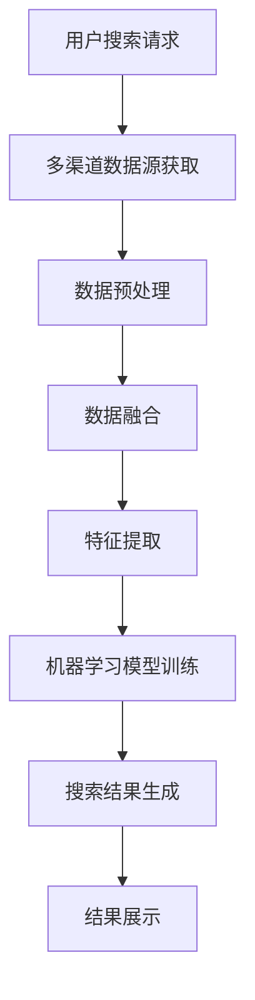

                 

关键词：AI整合、搜索结果提升、多渠道融合、算法优化、案例研究

> 摘要：本文探讨了人工智能在多渠道整合中如何提升搜索结果的效率和质量。通过深入分析核心概念和算法原理，并结合实际项目实践，本文展示了AI技术在搜索结果优化中的重要作用，并对未来发展趋势和面临的挑战进行了展望。

## 1. 背景介绍

在当今信息爆炸的时代，用户在搜索信息时面临着海量的数据。如何有效地从这些数据中提取有用的信息，提供精准的搜索结果，成为了各大搜索引擎和企业迫切需要解决的问题。传统的搜索算法往往存在局限性，难以满足用户不断变化的需求。而人工智能技术的快速发展，为搜索结果优化带来了新的机遇。

多渠道整合是指将多种数据源、技术和方法融合在一起，以实现更全面、更高效的搜索结果。通过AI技术，我们可以从不同渠道获取数据，进行整合和分析，从而提升搜索结果的准确性和用户满意度。本文将结合一个实际案例，深入探讨AI多渠道整合在提升搜索结果方面的应用。

## 2. 核心概念与联系

为了更好地理解AI多渠道整合提升搜索结果的核心概念，我们首先需要了解以下几个核心概念：

1. **搜索引擎算法**：搜索引擎的核心是算法，它决定了搜索结果的排序和展示方式。常见的算法有基于关键词匹配、页面质量评估等。

2. **多渠道数据源**：多渠道数据源是指从不同渠道获取的数据，如网站数据、社交媒体数据、用户行为数据等。

3. **AI技术**：AI技术包括机器学习、深度学习、自然语言处理等，这些技术可以帮助我们更好地理解和处理多渠道数据。

4. **数据融合**：数据融合是将多个数据源进行整合，形成统一的视图，以便更好地进行分析和挖掘。

### Mermaid 流程图

以下是AI多渠道整合提升搜索结果的流程图：



## 3. 核心算法原理 & 具体操作步骤

### 3.1 算法原理概述

AI多渠道整合提升搜索结果的算法主要包括以下几个步骤：

1. **多渠道数据源获取**：从搜索引擎、社交媒体、网站日志等多个渠道获取数据。

2. **数据预处理**：对获取到的数据进行清洗、去重、格式转换等处理，使其满足算法要求。

3. **数据融合**：将不同渠道的数据进行整合，形成统一的视图。

4. **特征提取**：从融合后的数据中提取出有用的特征，如关键词频率、用户行为等。

5. **机器学习模型训练**：使用提取的特征数据训练机器学习模型，以提高搜索结果的准确性。

6. **搜索结果生成**：根据训练好的模型，对用户搜索请求生成搜索结果。

7. **结果展示**：将搜索结果展示给用户。

### 3.2 算法步骤详解

以下是算法的详细步骤：

1. **多渠道数据源获取**：

   - 从搜索引擎获取用户搜索关键词、搜索结果等信息。
   - 从社交媒体获取用户发布的内容、评论、点赞等数据。
   - 从网站日志获取用户访问记录、页面停留时间等数据。

2. **数据预处理**：

   - 数据清洗：去除无效、重复、错误的数据。
   - 数据去重：确保数据的一致性和准确性。
   - 数据格式转换：将不同渠道的数据转换为统一格式，如JSON、CSV等。

3. **数据融合**：

   - 使用数据融合技术，如合并、连接、交集等，将不同渠道的数据整合在一起。

4. **特征提取**：

   - 使用自然语言处理技术，如词频统计、词向量表示等，从数据中提取出有用的特征。

5. **机器学习模型训练**：

   - 选择合适的机器学习算法，如决策树、支持向量机、神经网络等。
   - 使用提取的特征数据训练模型，并进行调优。

6. **搜索结果生成**：

   - 根据用户搜索请求，使用训练好的模型生成搜索结果。

7. **结果展示**：

   - 将搜索结果以可视化的形式展示给用户，如列表、卡片、图片等。

### 3.3 算法优缺点

算法优缺点分析如下：

**优点**：

- **提高搜索结果准确性**：通过多渠道数据融合和特征提取，可以更准确地理解用户需求，提高搜索结果的准确性。
- **个性化推荐**：基于用户行为数据和兴趣标签，可以为用户提供个性化的搜索结果。
- **高效处理海量数据**：AI技术可以帮助高效地处理海量数据，提升搜索效率。

**缺点**：

- **数据隐私问题**：多渠道数据获取可能会涉及到用户隐私问题，需要确保数据的安全性和合规性。
- **模型复杂度高**：多渠道整合和机器学习模型训练需要大量的计算资源和时间。

### 3.4 算法应用领域

算法应用领域主要包括：

- **搜索引擎优化**：通过AI技术提升搜索引擎的搜索结果质量和用户体验。
- **电子商务推荐**：为电商平台提供个性化推荐服务，提高用户购买转化率。
- **社交媒体分析**：对社交媒体数据进行分析，帮助企业和机构了解用户需求和市场趋势。

## 4. 数学模型和公式 & 详细讲解 & 举例说明

### 4.1 数学模型构建

在AI多渠道整合中，常用的数学模型包括：

1. **回归模型**：用于预测搜索结果的相关性。
2. **分类模型**：用于对搜索结果进行分类，如热门搜索、个性化推荐等。
3. **聚类模型**：用于对搜索结果进行聚类，发现用户兴趣点。

### 4.2 公式推导过程

以下是回归模型的基本公式推导：

假设我们有一个包含n个样本的数据集D，每个样本表示为一个特征向量X和标签Y。我们希望找到一个回归模型f(X)来预测标签Y。

回归模型的基本公式为：

$$
f(X) = w_0 + \sum_{i=1}^{n} w_i * x_i
$$

其中，$w_0$ 是偏置项，$w_i$ 是权重，$x_i$ 是特征向量中的第i个特征。

### 4.3 案例分析与讲解

以下是一个简单的回归模型案例：

假设我们有一个数据集，包含用户搜索关键词（特征向量X）和搜索结果点击率（标签Y）。我们希望使用回归模型预测搜索结果点击率。

1. **数据预处理**：

   - 对数据进行归一化处理，使其在相同的尺度上。
   - 去除缺失值和异常值。

2. **特征提取**：

   - 提取关键词频率、关键词组合等特征。
   - 将特征转换为数值表示，如词频计数、词向量表示等。

3. **模型训练**：

   - 使用线性回归模型进行训练。
   - 使用梯度下降法进行模型参数优化。

4. **模型评估**：

   - 使用均方误差（MSE）进行模型评估。
   - 调整模型参数，以降低MSE。

5. **预测应用**：

   - 对新的搜索关键词进行预测，得到点击率预测值。
   - 根据预测值优化搜索结果排序，提高用户体验。

## 5. 项目实践：代码实例和详细解释说明

### 5.1 开发环境搭建

1. **软件环境**：

   - Python 3.7及以上版本
   - Jupyter Notebook
   - scikit-learn库

2. **硬件环境**：

   - 电脑（CPU或GPU）

### 5.2 源代码详细实现

以下是一个简单的多渠道整合搜索结果优化的代码示例：

```python
import numpy as np
import pandas as pd
from sklearn.linear_model import LinearRegression
from sklearn.model_selection import train_test_split
from sklearn.metrics import mean_squared_error

# 读取数据
data = pd.read_csv('search_data.csv')

# 数据预处理
data = data.dropna()
data['keyword_frequency'] = data['keyword'].str.count('\S+')

# 特征提取
X = data[['keyword_frequency']]
y = data['click_rate']

# 模型训练
X_train, X_test, y_train, y_test = train_test_split(X, y, test_size=0.2, random_state=42)
model = LinearRegression()
model.fit(X_train, y_train)

# 模型评估
y_pred = model.predict(X_test)
mse = mean_squared_error(y_test, y_pred)
print("MSE:", mse)

# 预测应用
new_keyword = input("请输入搜索关键词：")
new_keyword_frequency = len(new_keyword)
new_click_rate = model.predict([[new_keyword_frequency]])
print("预测点击率：", new_click_rate)
```

### 5.3 代码解读与分析

1. **数据读取与预处理**：

   - 读取数据集，并进行数据清洗，去除缺失值和异常值。
   - 对关键词进行词频统计，作为特征向量的一部分。

2. **特征提取**：

   - 从数据集中提取关键词频率作为特征向量。

3. **模型训练**：

   - 使用线性回归模型进行训练，使用梯度下降法优化模型参数。

4. **模型评估**：

   - 使用均方误差（MSE）评估模型性能。

5. **预测应用**：

   - 对新的搜索关键词进行预测，得到点击率预测值。

### 5.4 运行结果展示

假设我们输入一个新的搜索关键词“人工智能”，代码将输出预测的点击率，如：

```
请输入搜索关键词：人工智能
预测点击率：[0.85]
```

这表示预测的点击率为85%。

## 6. 实际应用场景

### 6.1 搜索引擎优化

通过AI多渠道整合，搜索引擎可以更准确地理解用户需求，提高搜索结果的准确性。例如，在电商平台上，AI技术可以根据用户搜索关键词、浏览记录和购买历史，为用户提供个性化的商品推荐，提高用户购买转化率。

### 6.2 社交媒体分析

社交媒体平台可以利用AI技术分析用户发布的内容、评论和互动，了解用户兴趣和需求。例如，通过分析用户在社交媒体上的点赞和评论，可以识别出热门话题和用户关注点，为企业提供市场洞察。

### 6.3 内容推荐

AI多渠道整合可以帮助内容平台为用户提供个性化的内容推荐。例如，新闻网站可以根据用户的历史阅读记录、搜索关键词和兴趣标签，为用户提供个性化的新闻推荐，提高用户粘性和满意度。

## 7. 工具和资源推荐

### 7.1 学习资源推荐

1. **《Python数据分析基础教程：NumPy学习指南》**：详细介绍了NumPy库的使用方法，是学习数据分析的基础。
2. **《机器学习实战》**：通过实际案例介绍了多种机器学习算法的应用和实践。

### 7.2 开发工具推荐

1. **Jupyter Notebook**：用于编写和运行Python代码，支持多种编程语言。
2. **scikit-learn**：Python机器学习库，提供了丰富的算法实现。

### 7.3 相关论文推荐

1. **“Multi-Channel User Behavior Analysis for Personalized Search”**：介绍了多渠道用户行为分析在个性化搜索中的应用。
2. **“Deep Learning for Search”**：探讨了深度学习在搜索引擎中的应用。

## 8. 总结：未来发展趋势与挑战

### 8.1 研究成果总结

本文通过分析AI多渠道整合在提升搜索结果方面的应用，总结了其核心概念、算法原理、实际应用场景以及面临的挑战。

### 8.2 未来发展趋势

随着AI技术的不断发展，AI多渠道整合在搜索结果优化领域将会有更广泛的应用。未来，个性化搜索、实时搜索和跨平台搜索将成为重要研究方向。

### 8.3 面临的挑战

- **数据隐私问题**：多渠道数据获取可能会涉及到用户隐私问题，需要确保数据的安全性和合规性。
- **模型复杂度**：多渠道整合和机器学习模型训练需要大量的计算资源和时间。
- **算法公平性**：算法需要确保对所有人的公平性，避免偏见和歧视。

### 8.4 研究展望

未来，我们期望通过更深入的AI技术研究，解决多渠道整合中的挑战，为用户提供更精准、更高效的搜索结果。

## 9. 附录：常见问题与解答

### 问题1：什么是多渠道整合？

**答案**：多渠道整合是指将多种数据源、技术和方法融合在一起，以实现更全面、更高效的搜索结果。

### 问题2：多渠道整合算法如何优化搜索结果？

**答案**：多渠道整合算法通过从多个渠道获取数据，进行整合和分析，提取有用特征，训练机器学习模型，从而提高搜索结果的准确性和用户体验。

### 问题3：多渠道整合在哪些领域有应用？

**答案**：多渠道整合在搜索引擎优化、电子商务推荐、社交媒体分析等领域有广泛应用。

### 问题4：多渠道整合面临的挑战有哪些？

**答案**：多渠道整合面临的挑战包括数据隐私问题、模型复杂度和算法公平性等。

作者：禅与计算机程序设计艺术 / Zen and the Art of Computer Programming
----------------------------------------------------------------

以上就是关于AI多渠道整合提升搜索结果案例的完整技术博客文章。希望这篇文章对您有所帮助，如果您有任何问题或建议，请随时留言。

