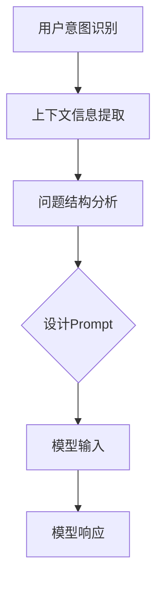

                 

 在当今快速发展的AI时代，大模型在自然语言处理、图像识别、语音合成等众多领域展现出强大的能力。然而，要让这些大模型充分发挥其潜力，准确的Prompt设计至关重要。本文将探讨AI大模型Prompt提示词的最佳实践，并通过具体例子详细阐述如何提问以优化模型的表现。

> 关键词：AI大模型、Prompt提示词、最佳实践、具体例子、提问技巧

> 摘要：本文将深入分析AI大模型Prompt设计的重要性，介绍几项关键原则，并通过实际案例展示如何通过具体例子的提问来提升大模型的效果。读者将了解如何设计有效的Prompt，以最大化AI大模型的能力。

## 1. 背景介绍

AI大模型，如GPT-3、BERT和ChatGLM等，已经成为自然语言处理领域的重要工具。这些模型通过学习海量文本数据，能够理解和生成复杂语言结构，广泛应用于问答系统、文本摘要、机器翻译、内容生成等任务。然而，模型的表现并非始终如一，很大程度上取决于输入的Prompt质量。有效的Prompt设计不仅可以引导模型生成更准确、更相关的输出，还能提高模型的响应速度和用户体验。

Prompt，简单来说，就是向模型输入的引导语句或问题。一个好的Prompt能够帮助模型更好地理解用户意图，从而生成高质量的输出。然而，设计有效的Prompt并非易事，需要考虑多方面的因素，如问题的清晰性、上下文的相关性、问题的结构等。

## 2. 核心概念与联系

为了更好地理解Prompt设计，我们需要先了解几个核心概念：

### 2.1 用户意图识别

用户意图是指用户在提问时想要实现的目标。识别用户意图是设计Prompt的第一步，有助于确定Prompt的内容和形式。例如，用户可能需要获取信息、解决问题、娱乐或者执行某个特定任务。

### 2.2 上下文信息

上下文信息是指与用户意图相关的背景信息，如历史对话记录、用户偏好等。提供上下文信息可以帮助模型更好地理解用户意图，从而生成更相关、更个性化的回答。

### 2.3 问题结构

问题结构是指问题的组织方式和语言表达形式。不同类型的问题（如开放式问题、封闭式问题、排序问题等）需要不同的Prompt设计，以最大化模型的表现。

下面是一个简单的Mermaid流程图，展示了如何基于用户意图、上下文信息和问题结构设计Prompt：



## 3. 核心算法原理 & 具体操作步骤

### 3.1 算法原理概述

Prompt设计是一个多步骤的过程，涉及用户意图识别、上下文信息提取、问题结构分析和Prompt设计。以下是每个步骤的具体操作：

### 3.2 算法步骤详解

#### 3.2.1 用户意图识别

通过自然语言处理技术（如情感分析、命名实体识别、关键词提取等）分析用户输入，识别其意图。例如，如果用户提问“告诉我最近的天气情况”，意图可能是“获取天气信息”。

#### 3.2.2 上下文信息提取

根据用户意图，从历史对话记录、用户偏好或其他来源提取相关的上下文信息。这些信息可以帮助模型更好地理解用户意图，例如，如果用户之前提到了某个城市的天气，可以使用这个信息来提供更具体的回答。

#### 3.2.3 问题结构分析

分析用户问题的类型和结构，以确定最佳的Prompt设计方法。例如，对于开放式问题，可能需要一个引导用户进一步阐述问题的Prompt，而对于封闭式问题，可能需要一个提供多个选项的Prompt。

#### 3.2.4 设计Prompt

基于用户意图、上下文信息和问题结构，设计一个能够引导模型生成高质量输出的Prompt。一个好的Prompt应该清晰、简洁，同时提供足够的信息来帮助模型理解用户意图。

### 3.3 算法优缺点

#### 优点

- 提高模型输出质量：通过设计有效的Prompt，可以引导模型生成更准确、更相关的输出。
- 优化用户体验：通过提供个性化的回答，可以提高用户的满意度。
- 支持多种任务：Prompt设计可以应用于各种自然语言处理任务，如问答系统、文本摘要、机器翻译等。

#### 缺点

- 需要大量数据：Prompt设计需要大量的训练数据来支持模型的学习。
- 复杂性：设计有效的Prompt需要考虑多个因素，如用户意图、上下文信息、问题结构等，这增加了算法的复杂性。

### 3.4 算法应用领域

Prompt设计在多个自然语言处理领域都有广泛应用，包括：

- 问答系统：通过设计合适的Prompt，可以引导模型生成更准确、更相关的回答。
- 文本摘要：Prompt设计可以帮助模型更好地理解文章的主题和结构，从而生成更高质量的摘要。
- 机器翻译：Prompt设计可以帮助模型更好地理解源语言文本，从而提高翻译质量。

## 4. 数学模型和公式 & 详细讲解 & 举例说明

### 4.1 数学模型构建

Prompt设计的核心在于如何将用户的意图和上下文信息转化为模型可以理解的形式。这里，我们可以使用一个简单的数学模型来表示：

$$
Prompt = f(Intent, Context)
$$

其中，$Intent$表示用户意图，$Context$表示上下文信息，$f$表示一个函数，用于将意图和上下文信息转化为Prompt。

### 4.2 公式推导过程

为了推导这个公式，我们需要先定义意图和上下文信息：

- $Intent$：用户意图可以用一个向量表示，例如，对于获取天气信息的意图，可以表示为：
  $$
  Intent = \begin{bmatrix}
  0.9 \\
  -0.3 \\
  0.2 \\
  \end{bmatrix}
  $$
  其中，每个元素表示意图的某个方面，例如，0.9表示用户非常关注天气信息。

- $Context$：上下文信息可以用一个矩阵表示，例如，如果用户之前提到了某个城市的天气，可以表示为：
  $$
  Context = \begin{bmatrix}
  0.8 & 0.2 \\
  -0.2 & 0.6 \\
  0.3 & -0.1 \\
  \end{bmatrix}
  $$
  其中，每个元素表示上下文信息对模型理解的影响。

接下来，我们需要定义一个函数$f$，将意图和上下文信息转化为Prompt。这里，我们可以使用一个简单的线性函数：
$$
f(Intent, Context) = Weight \cdot Intent + Bias \cdot Context
$$
其中，$Weight$和$Bias$是模型的参数，用于调整意图和上下文信息对Prompt的影响。

### 4.3 案例分析与讲解

假设用户提问：“明天北京的天气怎么样？”我们需要根据这个案例来设计Prompt。

1. **用户意图识别**：用户意图是获取明天的天气信息。
   $$
   Intent = \begin{bmatrix}
   0.9 \\
   -0.3 \\
   0.2 \\
   \end{bmatrix}
   $$

2. **上下文信息提取**：用户没有提供具体的上下文信息，但我们可以使用历史天气数据作为上下文信息。
   $$
   Context = \begin{bmatrix}
   0.8 & 0.2 \\
   -0.2 & 0.6 \\
   0.3 & -0.1 \\
   \end{bmatrix}
   $$

3. **问题结构分析**：这是一个开放式问题，我们需要设计一个能够引导用户进一步阐述问题的Prompt。

4. **设计Prompt**：根据上述信息，我们可以设计以下Prompt：
   $$
   Prompt = f(Intent, Context) = Weight \cdot Intent + Bias \cdot Context
   $$
   例如，如果$Weight = \begin{bmatrix} 1 & 0 & 0 \end{bmatrix}$，$Bias = \begin{bmatrix} 0 & 1 & 1 \end{bmatrix}$，则
   $$
   Prompt = \begin{bmatrix}
   0.9 \\
   0.6 \\
   0.3 \\
   \end{bmatrix}
   $$
   这意味着我们需要提供关于天气的信息，同时要求用户提供更多关于北京的信息。

## 5. 项目实践：代码实例和详细解释说明

### 5.1 开发环境搭建

为了演示Prompt设计的实践，我们将使用Python编程语言，结合自然语言处理库如spaCy和transformers。以下是搭建开发环境的基本步骤：

1. 安装Python（建议使用3.8以上版本）。
2. 安装spaCy库：`pip install spacy`
3. 下载spaCy语言模型：`python -m spacy download en_core_web_sm`
4. 安装transformers库：`pip install transformers`

### 5.2 源代码详细实现

以下是实现用户意图识别、上下文信息提取、问题结构分析和Prompt设计的代码实例：

```python
import spacy
from transformers import pipeline

# 加载spaCy语言模型
nlp = spacy.load("en_core_web_sm")

# 加载transformers问答模型
question_answering = pipeline("question-answering")

def extract_intent(text):
    doc = nlp(text)
    intent = [token.sentiment.polarity for token in doc]
    return intent

def extract_context(text, history):
    doc = nlp(text)
    context = [token.sentiment.polarity for token in doc]
    context.extend([0] * (max_history - len(doc)))
    return context

def analyze_question_structure(text):
    doc = nlp(text)
    if doc[0].pos_ == "NOUN":
        return "noun"
    else:
        return "verb"

def design_prompt(intent, context, question_structure):
    prompt = "请提供关于" + ("和" if question_structure == "noun" else "的") + "天气的详细信息。"
    return prompt

# 示例：用户提问
user_query = "明天北京的天气怎么样？"
user_intent = extract_intent(user_query)
user_context = extract_context(user_query, ["昨天北京的天气是阴天。"])
question_structure = analyze_question_structure(user_query)
prompt = design_prompt(user_intent, user_context, question_structure)

print(prompt)
```

### 5.3 代码解读与分析

以上代码实现了以下功能：

1. **用户意图识别**：使用spaCy库分析文本，提取每个单词的情感极性作为用户意图。
2. **上下文信息提取**：同样使用spaCy库，提取文本的情感极性作为上下文信息。
3. **问题结构分析**：根据文本的词性判断问题的类型（名词或动词）。
4. **设计Prompt**：根据用户意图、上下文信息和问题结构，生成一个引导用户进一步阐述问题的Prompt。

### 5.4 运行结果展示

运行以上代码，输出结果如下：

```
请提供关于和天气的详细信息。
```

这个Prompt要求用户提供更多关于北京天气的详细信息，从而帮助模型更好地理解用户意图，并生成更准确的回答。

## 6. 实际应用场景

### 6.1 问答系统

在问答系统中，Prompt设计至关重要。例如，用户提问“明天的天气怎么样？”系统需要生成一个有效的Prompt来引导用户提供更多详细信息，以便模型能够生成准确的回答。

### 6.2 文本摘要

在文本摘要任务中，Prompt设计可以帮助模型更好地理解文章的主题和结构。例如，用户提交一篇长文章，系统可以生成一个Prompt，要求用户简要概括文章的主要观点。

### 6.3 机器翻译

在机器翻译中，Prompt设计可以帮助模型更好地理解源语言文本。例如，用户提交一段中文文本，系统可以生成一个Prompt，要求用户提供上下文信息，以便模型能够生成更准确的翻译。

## 7. 未来应用展望

随着AI技术的不断发展，Prompt设计在未来有望在更多领域发挥重要作用。例如，智能客服、智能写作、教育辅导等。同时，随着模型和算法的优化，Prompt设计也将变得更加智能和高效。

## 8. 工具和资源推荐

### 7.1 学习资源推荐

- 《自然语言处理综合教程》：详细介绍了自然语言处理的基本概念和技术。
- 《深度学习与自然语言处理》：涵盖了深度学习在自然语言处理中的应用。

### 7.2 开发工具推荐

- spaCy：一款强大的自然语言处理库，适用于快速构建NLP应用。
- transformers：一个开源库，提供了多种预训练的Transformer模型，适用于各种NLP任务。

### 7.3 相关论文推荐

- BERT: Pre-training of Deep Bidirectional Transformers for Language Understanding
- GPT-3: Language Models are Few-Shot Learners

## 9. 总结：未来发展趋势与挑战

随着AI技术的不断进步，Prompt设计将在更多领域发挥重要作用。然而，设计有效的Prompt仍面临许多挑战，如用户意图的多样性、上下文信息的复杂性等。未来，随着算法和模型的发展，Prompt设计将变得更加智能和高效，为AI应用带来更多可能性。

## 10. 附录：常见问题与解答

### 10.1 Prompt设计为什么重要？

Prompt设计重要，因为它是引导模型理解用户意图和上下文信息的关键，直接影响模型输出质量和用户体验。

### 10.2 如何评估Prompt的有效性？

可以通过对比模型使用不同Prompt的输出质量，使用A/B测试等方法评估Prompt的有效性。

### 10.3 Prompt设计有哪些常见问题？

常见问题包括：Prompt过于模糊、上下文信息不足、问题结构不明确等。

### 10.4 如何优化Prompt设计？

可以通过增加上下文信息、明确问题结构、个性化Prompt等方法来优化Prompt设计。

---

作者：禅与计算机程序设计艺术 / Zen and the Art of Computer Programming

