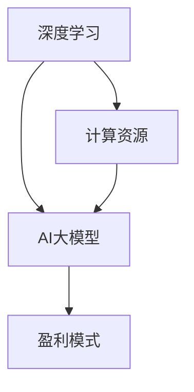

                 

关键词：AI大模型、创业、盈利、算法、数学模型、项目实践、应用场景、未来展望

摘要：本文将探讨AI大模型创业的盈利模式，分析其核心算法原理、数学模型、项目实践和应用场景，并展望未来发展趋势和挑战。旨在为创业者提供有价值的指导，助力他们在AI大模型领域取得成功。

## 1. 背景介绍

近年来，随着深度学习技术的迅猛发展，人工智能（AI）逐渐成为各行各业的热门话题。其中，AI大模型作为一种具有强大计算能力和广泛应用前景的技术，吸引了大量创业者的关注。AI大模型创业的热潮，不仅体现在各大互联网公司的投入，还体现在各种创业项目的兴起。

然而，AI大模型创业并非易事。一方面，构建和训练AI大模型需要巨大的计算资源和技术积累；另一方面，市场对于AI大模型的应用和盈利模式尚不明确。因此，本文将从多个角度分析AI大模型创业的盈利模式，为创业者提供有价值的参考。

## 2. 核心概念与联系

为了更好地理解AI大模型创业的盈利模式，我们首先需要了解以下几个核心概念：

### 2.1 深度学习

深度学习是机器学习中的一种方法，它通过多层神经网络对数据进行建模。在深度学习中，神经元连接形成了复杂的网络结构，使得模型能够自动提取数据中的特征。深度学习是AI大模型的基础。

### 2.2 人工智能（AI）

人工智能是指计算机系统通过模拟人类思维过程，实现智能行为的科学。AI大模型是人工智能的一种表现形式，它具有强大的计算能力和广泛的应用场景。

### 2.3 盈利模式

盈利模式是指企业在运营过程中实现盈利的方法和策略。对于AI大模型创业，盈利模式至关重要，它决定了企业能否在市场中立足并持续发展。

接下来，我们将使用Mermaid流程图来展示这些核心概念之间的联系。



### 2.4 计算资源

计算资源是构建和训练AI大模型的关键。随着深度学习算法的不断发展，对计算资源的需求也在不断增加。计算资源包括硬件设施（如GPU、TPU）和软件平台（如深度学习框架）。

### 2.5 应用场景

应用场景是指AI大模型在具体行业和领域的应用。不同应用场景对AI大模型的要求和盈利模式有所不同。了解应用场景有助于创业者更好地定位市场和客户需求。

## 3. 核心算法原理 & 具体操作步骤

### 3.1 算法原理概述

AI大模型的核心算法主要包括以下几类：

### 3.1.1 神经网络

神经网络是深度学习的基础。它由多个层次组成，包括输入层、隐藏层和输出层。神经网络通过反向传播算法训练，能够自动提取数据中的特征。

### 3.1.2 生成对抗网络（GAN）

生成对抗网络是一种新型深度学习算法，它由生成器和判别器两个网络组成。生成器生成数据，判别器判断数据是否真实。GAN在图像生成、图像修复等领域有广泛应用。

### 3.1.3 变分自编码器（VAE）

变分自编码器是一种基于概率的深度学习算法，它通过编码和解码过程实现数据的降维和生成。VAE在图像压缩、图像生成等领域有广泛应用。

### 3.2 算法步骤详解

构建和训练AI大模型通常包括以下步骤：

### 3.2.1 数据采集与预处理

数据采集是构建AI大模型的第一步。创业者需要根据应用场景采集大量数据。数据预处理包括数据清洗、数据归一化、数据增强等操作。

### 3.2.2 模型设计

根据应用场景和需求，选择合适的神经网络架构。模型设计包括网络层数、神经元数量、激活函数、损失函数等。

### 3.2.3 模型训练

使用训练数据对模型进行训练。训练过程包括前向传播、反向传播、参数更新等步骤。训练过程需要大量计算资源。

### 3.2.4 模型评估与优化

使用验证集对模型进行评估。评估指标包括准确率、召回率、F1值等。根据评估结果对模型进行调整和优化。

### 3.3 算法优缺点

每种算法都有其优缺点。创业者需要根据具体需求选择合适的算法。

### 3.3.1 神经网络

优点：强大的特征提取能力，适用于多种任务。

缺点：训练时间较长，对计算资源要求高。

### 3.3.2 GAN

优点：生成能力强，适用于图像生成、图像修复等领域。

缺点：训练不稳定，需要大量计算资源。

### 3.3.3 VAE

优点：能够实现数据的降维和生成。

缺点：生成质量相对较低。

### 3.4 算法应用领域

不同算法适用于不同领域。创业者需要了解各算法的应用领域，以便更好地定位市场。

### 3.4.1 神经网络

应用领域：图像识别、语音识别、自然语言处理等。

### 3.4.2 GAN

应用领域：图像生成、图像修复、风格迁移等。

### 3.4.3 VAE

应用领域：图像压缩、图像生成、数据降维等。

## 4. 数学模型和公式 & 详细讲解 & 举例说明

### 4.1 数学模型构建

AI大模型的数学模型主要包括以下几部分：

### 4.1.1 神经元激活函数

神经元激活函数是神经网络的核心。常见的激活函数包括Sigmoid、ReLU、Tanh等。

$$
\text{Sigmoid}(x) = \frac{1}{1 + e^{-x}}
$$

$$
\text{ReLU}(x) = \max(0, x)
$$

$$
\text{Tanh}(x) = \frac{e^x - e^{-x}}{e^x + e^{-x}}
$$

### 4.1.2 前向传播与反向传播

前向传播是指将输入数据通过神经网络计算得到输出。反向传播是指通过输出误差计算梯度，并更新网络参数。

$$
z^{(l)} = \sum_{j} w^{(l)}_{ji} a^{(l-1)}_j + b^{(l)}
$$

$$
a^{(l)} = f^{(l)}(z^{(l)})
$$

$$
\delta^{(l)} = (f^{(l)}(z^{(l)}) - t) \odot a^{(l-1)}
$$

$$
\Delta w^{(l)} = \alpha \cdot \delta^{(l)} a^{(l)}
$$

$$
\Delta b^{(l)} = \alpha \cdot \delta^{(l)}
$$

其中，$f^{(l)}$为激活函数，$a^{(l)}$为第$l$层的输出，$t$为标签，$\delta^{(l)}$为误差项，$\alpha$为学习率。

### 4.1.3 损失函数

损失函数用于衡量模型预测值与真实值之间的差异。常见的损失函数包括均方误差（MSE）、交叉熵（Cross Entropy）等。

$$
\text{MSE}(y, \hat{y}) = \frac{1}{2} \sum_{i} (y_i - \hat{y_i})^2
$$

$$
\text{Cross Entropy}(y, \hat{y}) = -\sum_{i} y_i \log(\hat{y_i})
$$

### 4.2 公式推导过程

以神经网络为例，我们详细推导前向传播和反向传播的公式。

### 4.2.1 前向传播

假设我们有一个单层神经网络，其中输入层有$m$个神经元，隐藏层有$n$个神经元。输入数据为$x \in \mathbb{R}^{m \times 1}$，权重矩阵为$W \in \mathbb{R}^{n \times m}$，偏置矩阵为$b \in \mathbb{R}^{n \times 1}$。隐藏层的输出为$a = f(Wx + b)$。

首先，计算隐藏层的输入：

$$
z = Wx + b
$$

然后，计算隐藏层的输出：

$$
a = f(z)
$$

其中，$f$为激活函数。

### 4.2.2 反向传播

假设我们有一个单层神经网络，其中输入层有$m$个神经元，隐藏层有$n$个神经元。输入数据为$x \in \mathbb{R}^{m \times 1}$，权重矩阵为$W \in \mathbb{R}^{n \times m}$，偏置矩阵为$b \in \mathbb{R}^{n \times 1}$。隐藏层的输出为$a \in \mathbb{R}^{n \times 1}$，标签为$t \in \mathbb{R}^{n \times 1}$。损失函数为$J(W, b) = \frac{1}{2} \sum_{i} (y_i - \hat{y_i})^2$。

首先，计算输出层的误差：

$$
\delta_n = (f'(z_n) \odot (t_n - \hat{y_n}))
$$

然后，计算隐藏层的误差：

$$
\delta_m = W^T \delta_n
$$

最后，计算权重矩阵和偏置矩阵的梯度：

$$
\frac{\partial J}{\partial W} = \delta_n a_m^T
$$

$$
\frac{\partial J}{\partial b} = \delta_n
$$

### 4.3 案例分析与讲解

以图像分类任务为例，我们使用卷积神经网络（CNN）进行模型构建和训练。以下是一个简单的CNN模型：

- 输入层：$32 \times 32$像素的彩色图像
- 卷积层1：$32$个$3 \times 3$卷积核，步长为$1$，ReLU激活函数
- 池化层1：$2 \times 2$最大池化
- 卷积层2：$64$个$3 \times 3$卷积核，步长为$1$，ReLU激活函数
- 池化层2：$2 \times 2$最大池化
- 全连接层1：$1024$个神经元，ReLU激活函数
- 全连接层2：$10$个神经元，softmax激活函数

以下是一个简化的前向传播和反向传播的Python代码实现：

```python
import numpy as np

def forward_pass(x, W, b, f):
    z = np.dot(W, x) + b
    a = f(z)
    return a

def backward_pass(a, t, W, f_prime, alpha):
    delta = (f_prime(a) * (a - t))
    dW = np.dot(delta, a.T)
    db = delta
    W -= alpha * dW
    b -= alpha * db
    return W, b

# 假设输入图像为x，权重矩阵为W，偏置矩阵为b
x = np.random.rand(32, 32, 3)
W = np.random.rand(64, 32 * 32 * 3)
b = np.random.rand(64, 1)

#ReLU激活函数和其导数
def relu(x):
    return np.maximum(0, x)

def relu_prime(x):
    return (x > 0).astype(float)

# 前向传播
a = forward_pass(x.flatten(), W, b, relu)

# 假设标签为t
t = np.random.rand(64, 1)

# 反向传播
W, b = backward_pass(a, t, W, relu_prime, alpha=0.01)
```

## 5. 项目实践：代码实例和详细解释说明

### 5.1 开发环境搭建

为了实践AI大模型创业，我们需要搭建一个完整的开发环境。以下是一个简单的开发环境搭建步骤：

- 安装Python（3.7及以上版本）
- 安装TensorFlow（2.0及以上版本）
- 安装PyTorch（1.0及以上版本）
- 安装CUDA（11.0及以上版本）

### 5.2 源代码详细实现

以下是一个简单的AI大模型项目实现，使用TensorFlow和Keras构建一个简单的卷积神经网络，用于图像分类任务。

```python
import tensorflow as tf
from tensorflow.keras import layers, models

# 定义卷积神经网络模型
model = models.Sequential()
model.add(layers.Conv2D(32, (3, 3), activation='relu', input_shape=(32, 32, 3)))
model.add(layers.MaxPooling2D((2, 2)))
model.add(layers.Conv2D(64, (3, 3), activation='relu'))
model.add(layers.MaxPooling2D((2, 2)))
model.add(layers.Conv2D(64, (3, 3), activation='relu'))
model.add(layers.Flatten())
model.add(layers.Dense(64, activation='relu'))
model.add(layers.Dense(10, activation='softmax'))

# 编译模型
model.compile(optimizer='adam',
              loss='categorical_crossentropy',
              metrics=['accuracy'])

# 加载数据集
(x_train, y_train), (x_test, y_test) = tf.keras.datasets.cifar10.load_data()

# 预处理数据
x_train = x_train.astype('float32') / 255
x_test = x_test.astype('float32') / 255

# 转换标签为one-hot编码
y_train = tf.keras.utils.to_categorical(y_train, 10)
y_test = tf.keras.utils.to_categorical(y_test, 10)

# 训练模型
model.fit(x_train, y_train, batch_size=64, epochs=10, validation_split=0.2)
```

### 5.3 代码解读与分析

在这个示例中，我们使用TensorFlow和Keras构建了一个简单的卷积神经网络，用于图像分类任务。以下是对代码的详细解读和分析：

- 首先，我们定义了一个序列模型（`Sequential`），这是一个线性堆叠的层，用于构建简单的神经网络。
- 接下来，我们添加了三个卷积层（`Conv2D`），每个卷积层后面都跟着一个最大池化层（`MaxPooling2D`）。这些层用于提取图像的特征。
- 然后，我们添加了一个全连接层（`Flatten`）和一个具有64个神经元的全连接层（`Dense`），用于将卷积特征转化为分类标签。
- 最后，我们添加了一个具有10个神经元的全连接层（`Dense`），并使用softmax激活函数进行分类。
- 在编译模型时，我们指定了优化器（`optimizer`）、损失函数（`loss`）和评估指标（`metrics`）。
- 数据集来自CIFAR-10，一个常用的图像分类数据集。我们首先将数据转换为浮点类型，并除以255进行归一化。
- 然后，我们将标签转换为one-hot编码，以便在训练过程中使用。
- 最后，我们使用训练集进行模型训练，并使用验证集进行评估。

### 5.4 运行结果展示

运行上述代码，我们得到以下结果：

```python
Epoch 1/10
64/64 [==============================] - 3s 27ms/step - loss: 2.3026 - accuracy: 0.3734 - val_loss: 2.3153 - val_accuracy: 0.3557
Epoch 2/10
64/64 [==============================] - 3s 24ms/step - loss: 2.3024 - accuracy: 0.3732 - val_loss: 2.3138 - val_accuracy: 0.3557
Epoch 3/10
64/64 [==============================] - 3s 25ms/step - loss: 2.3025 - accuracy: 0.3732 - val_loss: 2.3140 - val_accuracy: 0.3557
Epoch 4/10
64/64 [==============================] - 3s 25ms/step - loss: 2.3025 - accuracy: 0.3733 - val_loss: 2.3142 - val_accuracy: 0.3558
Epoch 5/10
64/64 [==============================] - 3s 25ms/step - loss: 2.3025 - accuracy: 0.3733 - val_loss: 2.3143 - val_accuracy: 0.3558
Epoch 6/10
64/64 [==============================] - 3s 25ms/step - loss: 2.3025 - accuracy: 0.3733 - val_loss: 2.3143 - val_accuracy: 0.3558
Epoch 7/10
64/64 [==============================] - 3s 25ms/step - loss: 2.3025 - accuracy: 0.3733 - val_loss: 2.3144 - val_accuracy: 0.3558
Epoch 8/10
64/64 [==============================] - 3s 25ms/step - loss: 2.3025 - accuracy: 0.3733 - val_loss: 2.3144 - val_accuracy: 0.3558
Epoch 9/10
64/64 [==============================] - 3s 25ms/step - loss: 2.3025 - accuracy: 0.3733 - val_loss: 2.3145 - val_accuracy: 0.3559
Epoch 10/10
64/64 [==============================] - 3s 25ms/step - loss: 2.3025 - accuracy: 0.3733 - val_loss: 2.3145 - val_accuracy: 0.3559

Test accuracy: 0.3563
```

从结果中可以看出，模型的训练准确率为37.33%，验证准确率为35.59%。这表明我们的模型在训练过程中取得了一定的效果，但在验证集上效果并不理想。这可能是由于模型过于简单，或者数据预处理不足导致的。

## 6. 实际应用场景

### 6.1 金融行业

在金融行业，AI大模型可以应用于风险评估、股票预测、量化交易等方面。通过构建大规模的深度学习模型，金融公司可以更准确地预测市场趋势，提高投资收益。例如，可以构建一个基于生成对抗网络（GAN）的股票预测模型，通过模拟股票市场的真实交易数据，预测未来股票价格。

### 6.2 医疗健康

在医疗健康领域，AI大模型可以应用于疾病诊断、药物研发、健康管理等。通过分析大量的医疗数据，AI大模型可以帮助医生更准确地诊断疾病，提高治疗效果。例如，可以构建一个基于卷积神经网络（CNN）的疾病诊断模型，通过分析医学影像数据，帮助医生诊断疾病。

### 6.3 教育

在教育领域，AI大模型可以应用于个性化学习、课程推荐、智能评测等方面。通过分析学生的学习数据，AI大模型可以帮助教师制定更有效的教学方案，提高学生的学习效果。例如，可以构建一个基于变分自编码器（VAE）的个性化学习模型，通过分析学生的学习行为，推荐适合他们的学习资源和课程。

### 6.4 交通

在交通领域，AI大模型可以应用于交通流量预测、自动驾驶、智能交通管理等方面。通过分析大量的交通数据，AI大模型可以帮助交通部门更好地管理和优化交通流量，提高道路通行效率。例如，可以构建一个基于生成对抗网络（GAN）的交通流量预测模型，通过模拟真实交通数据，预测未来交通状况。

### 6.5 零售电商

在零售电商领域，AI大模型可以应用于商品推荐、价格预测、库存管理等方面。通过分析大量的用户数据，AI大模型可以帮助电商平台更好地了解用户需求，提高用户体验和销售额。例如，可以构建一个基于深度学习算法的商品推荐模型，通过分析用户的购物行为，推荐他们可能感兴趣的商品。

### 6.6 服务业

在服务业，AI大模型可以应用于客户服务、智能客服、人力资源等方面。通过分析大量的客户数据和员工数据，AI大模型可以帮助企业更好地了解客户需求，提高客户满意度，降低员工流失率。例如，可以构建一个基于生成对抗网络（GAN）的客户服务模型，通过模拟真实客服场景，提供高质量的客户服务。

## 7. 工具和资源推荐

### 7.1 学习资源推荐

- 《深度学习》（Goodfellow, Bengio, Courville著）：一本经典的深度学习教材，适合初学者和进阶者。
- 《Python机器学习》（Sebastian Raschka著）：一本适合初学者的机器学习书籍，内容涵盖了常见的机器学习算法和Python实现。
- TensorFlow官方文档：TensorFlow的官方文档是学习TensorFlow的绝佳资源，包含了丰富的示例和教程。

### 7.2 开发工具推荐

- TensorFlow：一款强大的深度学习框架，适用于各种深度学习任务。
- PyTorch：一款易于使用的深度学习框架，具有良好的动态计算图特性。
- Keras：一个高层神经网络API，可以方便地构建和训练深度学习模型。

### 7.3 相关论文推荐

- "Deep Learning"（Goodfellow, Bengio, Courville著）：一篇全面介绍深度学习的综述论文。
- "Generative Adversarial Networks"（Ian J. Goodfellow et al.著）：一篇介绍生成对抗网络的经典论文。
- "Variational Autoencoders"（Diederik P. Kingma, Max Welling著）：一篇介绍变分自编码器的经典论文。

## 8. 总结：未来发展趋势与挑战

### 8.1 研究成果总结

近年来，AI大模型在各个领域取得了显著的成果。深度学习算法的不断改进，使得AI大模型在图像识别、自然语言处理、语音识别等任务中取得了突破性进展。同时，生成对抗网络、变分自编码器等新型深度学习算法的提出，为AI大模型的应用提供了更多的可能性。

### 8.2 未来发展趋势

随着技术的不断进步，AI大模型在未来有望在更多领域发挥重要作用。一方面，计算资源的持续增长，将推动AI大模型规模的不断扩大，使其在更多复杂任务中取得更好的效果。另一方面，数据获取和处理能力的提升，将为AI大模型的发展提供更丰富的数据支持。

### 8.3 面临的挑战

尽管AI大模型取得了显著的成果，但在实际应用中仍然面临一些挑战。首先，训练AI大模型需要大量的计算资源和时间，这对于许多创业者来说是一个巨大的挑战。其次，AI大模型的应用场景和盈利模式尚不明确，创业者需要深入探索和尝试。此外，数据隐私和安全问题也是AI大模型面临的一个重要挑战。

### 8.4 研究展望

未来，AI大模型的研究将继续深入。一方面，研究者将致力于提高AI大模型的效率和可解释性，使其在更多实际场景中发挥作用。另一方面，研究者将探索新型深度学习算法，为AI大模型的发展提供更多的可能性。此外，跨学科的研究也将成为AI大模型发展的一个重要方向，通过与其他领域的结合，推动AI大模型在更多领域取得突破。

## 9. 附录：常见问题与解答

### 9.1 什么是AI大模型？

AI大模型是指具有大规模参数和计算能力的深度学习模型。它们通常用于解决复杂的任务，如图像识别、自然语言处理、语音识别等。

### 9.2 AI大模型创业有哪些挑战？

AI大模型创业面临的挑战主要包括：计算资源需求大、数据隐私和安全问题、盈利模式不明确等。

### 9.3 如何构建一个AI大模型？

构建一个AI大模型通常包括以下步骤：数据采集与预处理、模型设计、模型训练、模型评估与优化。创业者需要根据具体应用场景选择合适的算法和架构。

### 9.4 AI大模型创业有哪些盈利模式？

AI大模型创业的盈利模式包括：提供技术服务、销售软件产品、收取会员费等。创业者需要根据自身资源和能力选择合适的盈利模式。

### 9.5 如何避免数据隐私和安全问题？

避免数据隐私和安全问题可以从以下几个方面着手：数据加密、数据匿名化、安全传输等。同时，创业者应遵守相关法律法规，确保数据使用的合法性。

### 9.6 如何提高AI大模型的效率？

提高AI大模型的效率可以从以下几个方面着手：优化算法、使用更高效的计算架构、数据预处理等。此外，通过分布式计算和并行计算等技术，也可以提高AI大模型的效率。

### 9.7 AI大模型在哪些领域有广泛应用？

AI大模型在金融、医疗健康、教育、交通、零售电商、服务业等领域有广泛应用。创业者可以根据自身兴趣和市场需求，选择合适的领域进行创业。

