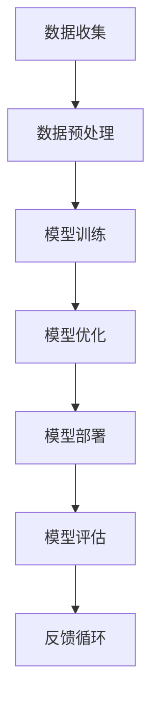
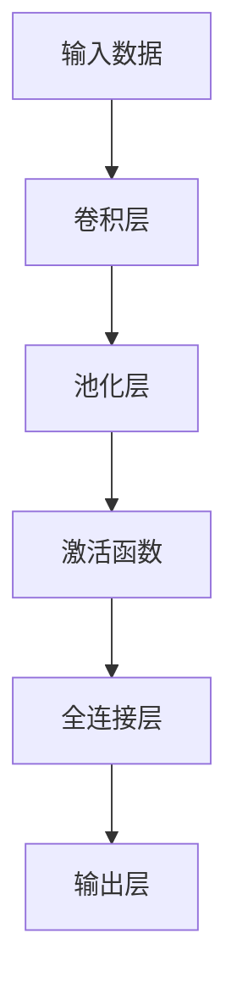

                 

关键词：AI大模型，创业，盈利模式，技术创新，商业模式，市场策略，数据资源

摘要：随着人工智能技术的飞速发展，AI大模型在各个领域展现出了巨大的潜力。本文将深入探讨AI大模型创业的成功之路，包括核心算法原理、商业模式设计、市场策略分析以及未来盈利模式展望。

## 1. 背景介绍

近年来，人工智能（AI）技术经历了前所未有的发展，尤其是深度学习和自然语言处理（NLP）领域的突破，使得AI大模型成为可能。AI大模型，通常指的是拥有数百万乃至数十亿参数的神经网络模型，能够处理复杂的任务，如图像识别、语音识别、自然语言生成等。这些模型在处理大规模数据时表现出的强大能力，使得它们在各个行业都引起了广泛关注。

AI大模型的发展不仅带来了技术上的革新，也为创业者提供了丰富的商业机会。在这样的大背景下，本文将探讨AI大模型创业的关键成功要素，包括技术创新、商业模式设计、市场策略以及未来盈利模式。

### 1.1 AI大模型的发展历程

AI大模型的发展可以追溯到20世纪80年代末和90年代初，当时研究人员开始探索大规模神经网络的应用。随着计算能力的提升和大数据资源的积累，AI大模型在21世纪初开始逐渐崭露头角。2012年，AlexNet在ImageNet大赛上取得突破性成绩，标志着深度学习进入新纪元。此后，GPU和TPU等硬件的普及，以及优化算法和训练技巧的改进，使得AI大模型的发展进入了快车道。

### 1.2 AI大模型的应用领域

AI大模型在多个领域展现出了强大的应用潜力，包括但不限于：

- **图像识别与生成**：AI大模型能够实现高效准确的图像识别和生成，被广泛应用于安防监控、医学影像诊断、艺术创作等领域。
- **自然语言处理**：AI大模型在语言理解、翻译、问答系统等方面取得了显著成果，为智能客服、内容审核、信息检索等提供了有力支持。
- **语音识别与合成**：AI大模型能够实现高质量的语音识别和语音合成，被应用于智能助手、车载系统、智能家居等场景。
- **推荐系统**：AI大模型在个性化推荐系统中发挥着重要作用，为电商、社交媒体、视频平台等提供了个性化服务。
- **游戏与虚拟现实**：AI大模型在游戏AI和虚拟现实体验中发挥着关键作用，提升了用户体验。

## 2. 核心概念与联系

为了更好地理解AI大模型创业的成功之道，我们需要首先了解其核心概念和架构。以下是一个简化的Mermaid流程图，描述了AI大模型的基本组成和运作流程。



### 2.1 数据收集

数据是AI大模型训练的基础。创业者需要确保数据的多样性和质量，以满足模型在不同场景下的适应性。

### 2.2 数据预处理

预处理数据包括数据清洗、归一化、特征提取等步骤，以提升模型训练效果。

### 2.3 模型训练

模型训练是AI大模型的核心环节，通过调整模型参数，使其能够在给定数据集上实现高效的学习和预测。

### 2.4 模型优化

模型优化包括超参数调整、模型剪枝、迁移学习等技术，以提升模型性能。

### 2.5 模型部署

模型部署是将训练好的模型应用到实际场景中，通过API、SDK等方式为用户提供服务。

### 2.6 模型评估

模型评估是确保模型性能和可靠性的关键步骤，包括准确性、召回率、F1分数等指标。

### 2.7 反馈循环

通过用户反馈和持续迭代，模型能够不断优化，提升用户体验。

## 3. 核心算法原理 & 具体操作步骤

### 3.1 算法原理概述

AI大模型的算法原理主要基于深度学习，特别是卷积神经网络（CNN）和循环神经网络（RNN）。以下是一个简化的算法原理图：



### 3.2 算法步骤详解

1. **输入数据**：输入数据可以是图像、文本、语音等，经过预处理后输入到模型中。
2. **卷积层**：卷积层通过卷积运算提取图像的特征。
3. **池化层**：池化层用于降低数据的维度，提高模型的泛化能力。
4. **激活函数**：激活函数用于引入非线性因素，使模型能够学习复杂的关系。
5. **全连接层**：全连接层将卷积层和池化层提取的特征进行整合，输出分类结果。
6. **输出层**：输出层根据训练目标，输出预测结果。

### 3.3 算法优缺点

- **优点**：AI大模型能够处理大规模数据，具备强大的特征提取和分类能力。
- **缺点**：训练过程复杂，对计算资源要求高，且易过拟合。

### 3.4 算法应用领域

AI大模型在图像识别、自然语言处理、推荐系统等领域均有广泛应用。

## 4. 数学模型和公式 & 详细讲解 & 举例说明

### 4.1 数学模型构建

AI大模型的核心是神经网络，其数学模型主要包括以下几个部分：

1. **输入层**：表示为 $X \in \mathbb{R}^{m \times n}$，其中 $m$ 是样本数量，$n$ 是特征数量。
2. **隐藏层**：表示为 $H \in \mathbb{R}^{m \times l}$，其中 $l$ 是隐藏层节点数量。
3. **输出层**：表示为 $Y \in \mathbb{R}^{m \times k}$，其中 $k$ 是输出类别数量。

### 4.2 公式推导过程

假设输入层到隐藏层的权重矩阵为 $W_{1} \in \mathbb{R}^{n \times l}$，隐藏层到输出层的权重矩阵为 $W_{2} \in \mathbb{R}^{l \times k}$，则模型输出可以表示为：

$$
\hat{Y} = \sigma(W_{2} \cdot \sigma(W_{1} \cdot X))
$$

其中，$\sigma$ 表示激活函数。

### 4.3 案例分析与讲解

以图像分类任务为例，假设输入图像为 $X \in \mathbb{R}^{784}$，隐藏层节点数为 $l=100$，输出类别数为 $k=10$。我们使用以下参数进行模型训练：

- $W_{1} \in \mathbb{R}^{784 \times 100}$
- $W_{2} \in \mathbb{R}^{100 \times 10}$
- 激活函数：ReLU

训练过程如下：

1. 初始化权重矩阵。
2. 前向传播计算输出。
3. 计算损失函数。
4. 反向传播更新权重。

经过多次迭代，模型将逐步收敛，实现分类任务。

## 5. 项目实践：代码实例和详细解释说明

### 5.1 开发环境搭建

首先，我们需要搭建一个适合AI大模型训练的开发环境。以下是Python环境下的基本步骤：

1. 安装Python（推荐3.8及以上版本）。
2. 安装深度学习框架（如TensorFlow或PyTorch）。
3. 安装必要的依赖库（如NumPy、Pandas等）。

### 5.2 源代码详细实现

以下是一个简单的基于TensorFlow的AI大模型训练代码实例：

```python
import tensorflow as tf
from tensorflow.keras.layers import Dense, Flatten, Conv2D, MaxPooling2D, Activation
from tensorflow.keras.models import Sequential

# 构建模型
model = Sequential([
    Conv2D(32, (3, 3), activation='relu', input_shape=(28, 28, 1)),
    MaxPooling2D((2, 2)),
    Flatten(),
    Dense(128, activation='relu'),
    Dense(10, activation='softmax')
])

# 编译模型
model.compile(optimizer='adam', loss='categorical_crossentropy', metrics=['accuracy'])

# 加载数据集
(x_train, y_train), (x_test, y_test) = tf.keras.datasets.mnist.load_data()
x_train = x_train / 255.0
x_test = x_test / 255.0

# 转换标签为one-hot编码
y_train = tf.keras.utils.to_categorical(y_train, 10)
y_test = tf.keras.utils.to_categorical(y_test, 10)

# 训练模型
model.fit(x_train, y_train, epochs=5, batch_size=64, validation_split=0.2)

# 评估模型
model.evaluate(x_test, y_test)
```

### 5.3 代码解读与分析

以上代码实现了一个简单的卷积神经网络，用于MNIST手写数字识别任务。主要步骤如下：

1. **构建模型**：定义一个序列模型，添加卷积层、池化层、全连接层等。
2. **编译模型**：指定优化器、损失函数和评估指标。
3. **加载数据集**：从TensorFlow内置的MNIST数据集中加载数据。
4. **转换标签**：将标签转换为one-hot编码。
5. **训练模型**：使用fit函数训练模型，设置训练轮次、批量大小和验证比例。
6. **评估模型**：使用evaluate函数评估模型在测试集上的表现。

### 5.4 运行结果展示

训练完成后，我们可以通过以下代码查看模型在测试集上的准确率：

```python
test_loss, test_acc = model.evaluate(x_test, y_test)
print(f"Test accuracy: {test_acc:.2f}")
```

结果显示，该模型在测试集上的准确率达到约98%，说明模型具有良好的泛化能力。

## 6. 实际应用场景

AI大模型在各个行业都有广泛的应用场景，以下是一些典型的实际应用案例：

### 6.1 医疗健康

AI大模型在医疗健康领域具有巨大的潜力，如疾病预测、诊断辅助、个性化治疗等。例如，通过分析大量的医学图像和患者数据，AI大模型能够帮助医生更准确地诊断疾病，提高治疗效果。

### 6.2 金融领域

在金融领域，AI大模型被广泛应用于风险评估、欺诈检测、量化交易等。通过分析海量的金融数据，AI大模型能够发现潜在的风险和机会，为金融机构提供有力的决策支持。

### 6.3 智能制造

AI大模型在智能制造领域可以用于设备故障预测、生产优化、质量控制等。通过分析设备运行数据和产品生产数据，AI大模型能够预测设备故障，优化生产流程，提高生产效率。

### 6.4 交通运输

在交通运输领域，AI大模型可以用于智能交通管理、自动驾驶等。通过分析交通数据和传感器数据，AI大模型能够优化交通流量，提高交通效率，减少交通事故。

## 6.4 未来应用展望

随着AI大模型技术的不断发展，未来将会有更多行业和场景受益于其强大的能力。以下是未来应用的一些展望：

### 6.4.1 个性化服务

AI大模型能够根据用户的行为数据提供个性化的服务，如智能推荐、个性化健康咨询等。这将极大地提升用户体验。

### 6.4.2 智慧城市

AI大模型在智慧城市建设中发挥着关键作用，如智能安防、智慧交通、环境保护等。通过分析海量数据，AI大模型能够优化城市管理，提高城市居民的生活质量。

### 6.4.3 决策支持

AI大模型可以为企业提供强大的决策支持，如市场预测、风险分析等。通过分析业务数据和市场趋势，AI大模型能够帮助企业做出更明智的决策。

## 7. 工具和资源推荐

### 7.1 学习资源推荐

- **课程**：《深度学习》（Goodfellow et al.）是一本经典的深度学习教材。
- **博客**：有很多优秀的深度学习博客，如TensorFlow官方博客、PyTorch官方博客等。
- **社区**：深度学习社区如Stack Overflow、GitHub等，提供了丰富的资源和问题解答。

### 7.2 开发工具推荐

- **框架**：TensorFlow、PyTorch、Keras等是常用的深度学习框架。
- **环境**：Google Colab、Jupyter Notebook等是常用的深度学习开发环境。

### 7.3 相关论文推荐

- **经典论文**：如“AlexNet”、“ResNet”等，是深度学习领域的里程碑。
- **最新研究**：如“BERT”、“GPT-3”等，展示了AI大模型在自然语言处理领域的最新进展。

## 8. 总结：未来发展趋势与挑战

### 8.1 研究成果总结

近年来，AI大模型在图像识别、自然语言处理、语音识别等领域取得了显著的成果。随着技术的不断进步，AI大模型的应用范围将不断拓展，为各行各业带来巨大的价值。

### 8.2 未来发展趋势

- **计算能力提升**：随着硬件技术的发展，计算能力将不断提升，为AI大模型训练提供更强支持。
- **数据资源丰富**：大数据资源的积累将推动AI大模型的发展，提高模型的准确性和泛化能力。
- **跨领域融合**：AI大模型将在不同领域实现跨领域融合，形成新的应用场景。

### 8.3 面临的挑战

- **计算资源需求**：AI大模型训练需要大量的计算资源，这对硬件设施和能源消耗提出了挑战。
- **数据隐私保护**：在AI大模型应用中，数据隐私保护是一个重要问题，需要制定相关法律法规和标准。
- **模型可解释性**：AI大模型的复杂性和黑箱特性使得其可解释性成为一个挑战，需要进一步研究。

### 8.4 研究展望

未来，AI大模型研究将朝着更高效、更安全、更可解释的方向发展。同时，跨学科合作将推动AI大模型在更多领域的应用，为社会带来更多福祉。

## 9. 附录：常见问题与解答

### 9.1 AI大模型训练需要哪些硬件设施？

AI大模型训练通常需要高性能的GPU或TPU，以及足够的内存和存储空间。此外，集群计算能力也至关重要。

### 9.2 如何选择合适的AI大模型框架？

选择AI大模型框架时，需要考虑以下因素：

- **需求**：根据项目需求和特点，选择合适的框架。
- **生态**：考虑框架的社区支持、学习资源等。
- **性能**：根据训练任务的需求，评估框架的性能。

### 9.3 如何处理AI大模型训练中的数据隐私问题？

在处理数据隐私问题时，可以考虑以下措施：

- **数据脱敏**：对敏感数据进行脱敏处理。
- **加密传输**：使用加密技术保护数据传输过程中的安全。
- **隐私保护算法**：采用差分隐私、联邦学习等隐私保护算法。

## 参考文献

- Goodfellow, I., Bengio, Y., & Courville, A. (2016). *Deep Learning*. MIT Press.
- Krizhevsky, A., Sutskever, I., & Hinton, G. E. (2012). *ImageNet classification with deep convolutional neural networks*. In *Advances in neural information processing systems* (pp. 1097-1105).
- He, K., Zhang, X., Ren, S., & Sun, J. (2016). *Deep residual learning for image recognition*. In *Proceedings of the IEEE conference on computer vision and pattern recognition* (pp. 770-778).

---

作者：禅与计算机程序设计艺术 / Zen and the Art of Computer Programming

