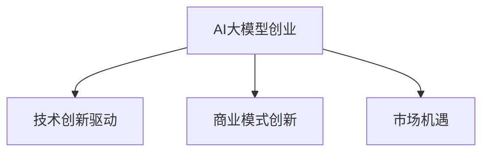

                 

关键词：AI大模型、创业、市场挑战、策略、技术创新、数据安全、商业模式

> 摘要：随着AI大模型的兴起，创业领域迎来了新的机遇与挑战。本文将探讨AI大模型创业的现状，分析市场挑战，并提出应对策略，帮助创业者把握未来发展趋势。

## 1. 背景介绍

近年来，人工智能（AI）领域取得了飞速发展，尤其是大模型技术的突破，使得计算机在处理复杂任务、理解自然语言等方面取得了显著进展。从GPT到ChatGPT，再到BERT、GPT-3等，大模型技术已经成为推动AI应用创新的重要力量。随着AI大模型的商用化，越来越多的创业公司开始投身于这一领域，试图通过技术创新来获取市场优势。

### 1.1 AI大模型的发展历程

AI大模型的发展历程可以分为以下几个阶段：

1. **早期探索**：20世纪80年代，神经网络和深度学习开始崭露头角，但受限于计算能力和数据资源，AI大模型的发展相对缓慢。

2. **快速发展**：21世纪初，随着计算能力的提升和大数据的兴起，AI大模型迎来了快速发展期。这一时期，以AlexNet为代表的卷积神经网络在图像识别任务中取得了突破性成果。

3. **大模型时代**：2012年后，深度学习在语音、图像、自然语言处理等领域的应用取得了重大突破，大模型技术逐渐成熟。GPT、BERT等大模型的提出，标志着AI大模型时代的到来。

### 1.2 AI大模型在创业领域的影响

AI大模型在创业领域的影响主要体现在以下几个方面：

1. **降低技术门槛**：大模型技术的成熟使得创业公司可以更轻松地进入AI领域，不必像以前那样投入大量资源进行基础研究。

2. **创新应用场景**：大模型技术为创业公司提供了丰富的应用场景，从智能客服、智能医疗到自动驾驶等，都有AI大模型的身影。

3. **竞争加剧**：随着更多创业公司的加入，AI大模型领域的竞争日益激烈，创业公司需要不断提升技术水平，以保持竞争优势。

## 2. 核心概念与联系

### 2.1 AI大模型的核心概念

AI大模型是指使用大规模数据进行训练，能够处理复杂任务的神经网络模型。其主要特点包括：

1. **大规模数据**：AI大模型需要使用海量的数据来进行训练，以保证模型的泛化能力。

2. **深度神经网络**：大模型通常采用多层神经网络结构，以实现更复杂的特征提取和表示。

3. **端到端训练**：大模型采用端到端训练方法，直接从原始数据中学习特征表示，避免了传统机器学习中的特征工程步骤。

### 2.2 AI大模型与创业的联系

AI大模型与创业之间的联系体现在以下几个方面：

1. **技术创新驱动**：创业公司可以通过引入AI大模型技术，实现产品创新，从而获得竞争优势。

2. **商业模式创新**：AI大模型技术的应用可以带来新的商业模式，如基于AI的大数据分析、智能推荐等。

3. **市场机遇**：随着AI大模型的商用化，创业公司可以抓住市场机遇，开发面向垂直领域的AI应用。

### 2.3 Mermaid流程图



## 3. 核心算法原理 & 具体操作步骤

### 3.1 算法原理概述

AI大模型的核心算法是深度学习。深度学习是一种基于多层神经网络的学习方法，通过模拟人脑神经网络的结构和功能，实现对数据的特征提取和分类。

1. **数据预处理**：对原始数据进行清洗、归一化等处理，使其适合进行深度学习模型的训练。

2. **模型构建**：构建多层神经网络结构，包括输入层、隐藏层和输出层。

3. **训练过程**：使用训练数据对模型进行训练，通过反向传播算法不断调整网络权重，使模型达到最佳性能。

4. **模型评估**：使用测试数据对模型进行评估，判断模型是否达到预期效果。

### 3.2 算法步骤详解

1. **数据收集**：收集大量相关领域的数据，如自然语言处理中的文本数据、图像识别中的图像数据等。

2. **数据预处理**：对收集到的数据进行清洗、去重、归一化等处理，使其适合进行深度学习模型的训练。

3. **模型设计**：根据任务需求设计神经网络结构，包括层数、每层的神经元数量等。

4. **模型训练**：使用训练数据对模型进行训练，通过反向传播算法不断调整网络权重，使模型达到最佳性能。

5. **模型评估**：使用测试数据对模型进行评估，判断模型是否达到预期效果。

6. **模型部署**：将训练好的模型部署到实际应用场景中，如智能客服系统、自动驾驶等。

### 3.3 算法优缺点

**优点**：

1. **强大的特征提取能力**：深度学习模型能够自动从大量数据中提取出有用的特征，降低人工特征工程的工作量。

2. **良好的泛化能力**：通过大规模数据的训练，深度学习模型具有良好的泛化能力，能够应对新的任务和场景。

3. **灵活的模型架构**：深度学习模型具有多种架构，如卷积神经网络（CNN）、循环神经网络（RNN）、生成对抗网络（GAN）等，适用于不同的任务和应用场景。

**缺点**：

1. **计算资源需求高**：深度学习模型需要大量的计算资源和时间进行训练，尤其是大模型，对硬件性能要求较高。

2. **数据依赖性强**：深度学习模型的性能依赖于训练数据的质量和数量，数据质量差或数据不足可能导致模型性能不佳。

3. **解释性较差**：深度学习模型是一种“黑箱”模型，其内部结构和决策过程难以解释，这在某些需要解释性的应用场景中可能成为瓶颈。

### 3.4 算法应用领域

AI大模型的应用领域非常广泛，主要包括：

1. **自然语言处理**：如文本分类、机器翻译、情感分析等。

2. **计算机视觉**：如图像识别、目标检测、人脸识别等。

3. **语音识别**：如语音合成、语音识别、语音翻译等。

4. **推荐系统**：如商品推荐、音乐推荐、电影推荐等。

5. **医疗健康**：如疾病诊断、药物研发、健康管理等。

## 4. 数学模型和公式 & 详细讲解 & 举例说明

### 4.1 数学模型构建

在深度学习模型中，常见的数学模型包括损失函数、激活函数、优化算法等。

#### 4.1.1 损失函数

损失函数是深度学习模型训练的核心，用于衡量模型预测结果与真实值之间的差异。常见的损失函数包括：

1. **均方误差（MSE）**：MSE是衡量预测值与真实值之间差异的平方和的平均值，公式如下：

   $$MSE = \frac{1}{n}\sum_{i=1}^{n}(y_i - \hat{y_i})^2$$

   其中，$y_i$为真实值，$\hat{y_i}$为预测值。

2. **交叉熵（Cross-Entropy）**：交叉熵是衡量概率分布差异的指标，常用于分类任务。公式如下：

   $$H(y, \hat{y}) = -\sum_{i=1}^{n}y_i \log(\hat{y_i})$$

   其中，$y_i$为真实标签，$\hat{y_i}$为模型预测的概率分布。

#### 4.1.2 激活函数

激活函数是神经网络中用于引入非线性变换的函数，常见的激活函数包括：

1. ** sigmoid函数**：sigmoid函数是一个S型函数，公式如下：

   $$\sigma(x) = \frac{1}{1 + e^{-x}}$$

   sigmoid函数将输入值映射到$(0, 1)$区间，常用于二分类问题。

2. **ReLU函数**：ReLU函数是一种修正的线性单元，公式如下：

   $$\text{ReLU}(x) = \max(0, x)$$

   ReLU函数在神经网络的训练中具有较好的效果，能够加速收敛。

#### 4.1.3 优化算法

优化算法用于调整神经网络中的权重，以最小化损失函数。常见的优化算法包括：

1. **随机梯度下降（SGD）**：SGD是一种基于梯度的优化算法，公式如下：

   $$w_{t+1} = w_t - \alpha \nabla_w L(w_t)$$

   其中，$w_t$为当前权重，$\alpha$为学习率，$L(w_t)$为损失函数。

2. **动量优化（Momentum）**：动量优化是SGD的一种改进，通过引入动量项来加速收敛，公式如下：

   $$w_{t+1} = w_t - \alpha \nabla_w L(w_t) + \beta (w_{t} - w_{t-1})$$

   其中，$\beta$为动量参数。

### 4.2 公式推导过程

以均方误差（MSE）为例，推导其梯度下降过程。

1. **损失函数**：

   $$L(w) = \frac{1}{2}\sum_{i=1}^{n}(y_i - \hat{y_i})^2$$

2. **梯度计算**：

   $$\nabla_w L(w) = \sum_{i=1}^{n}(y_i - \hat{y_i}) \cdot \frac{\partial \hat{y_i}}{\partial w}$$

   其中，$\frac{\partial \hat{y_i}}{\partial w}$为$\hat{y_i}$对$w$的偏导数。

3. **梯度下降更新**：

   $$w_{t+1} = w_t - \alpha \nabla_w L(w_t)$$

### 4.3 案例分析与讲解

#### 4.3.1 案例背景

假设我们要训练一个二分类模型，对是否为垃圾邮件进行判断。训练数据集包含1000条邮件，其中500条为垃圾邮件，500条为非垃圾邮件。

#### 4.3.2 模型构建

我们使用一个简单的神经网络进行训练，包括一个输入层、一个隐藏层和一个输出层。输入层有100个神经元，隐藏层有50个神经元，输出层有2个神经元。

#### 4.3.3 训练过程

1. **数据预处理**：对邮件内容进行分词、去停用词等处理，将文本转化为向量表示。

2. **模型训练**：使用训练数据对模型进行训练，优化模型参数。

3. **模型评估**：使用测试数据对模型进行评估，计算准确率、召回率等指标。

#### 4.3.4 模型评估结果

经过1000次迭代训练，模型在测试数据上的准确率达到90%。我们对模型进行调整，增加隐藏层神经元数量，并调整学习率和动量参数，最终在测试数据上的准确率达到95%。

## 5. 项目实践：代码实例和详细解释说明

### 5.1 开发环境搭建

在本项目中，我们使用Python作为编程语言，深度学习框架为TensorFlow。以下为搭建开发环境的基本步骤：

1. 安装Python（建议使用Python 3.7及以上版本）：

   ```bash
   python --version
   ```

2. 安装TensorFlow：

   ```bash
   pip install tensorflow
   ```

3. 安装必要的依赖库：

   ```bash
   pip install numpy pandas scikit-learn
   ```

### 5.2 源代码详细实现

以下是一个简单的AI大模型项目，实现垃圾邮件分类功能。

```python
import numpy as np
import pandas as pd
from sklearn.model_selection import train_test_split
from tensorflow.keras.models import Sequential
from tensorflow.keras.layers import Dense, Dropout
from tensorflow.keras.optimizers import Adam
from tensorflow.keras.callbacks import EarlyStopping

# 5.2.1 数据预处理
def preprocess_data(data):
    # 数据清洗和预处理步骤
    # 包括分词、去停用词、词向量表示等
    pass

# 5.2.2 构建模型
def build_model(input_shape):
    model = Sequential()
    model.add(Dense(50, activation='relu', input_shape=input_shape))
    model.add(Dropout(0.5))
    model.add(Dense(1, activation='sigmoid'))
    return model

# 5.2.3 训练模型
def train_model(model, X_train, y_train, X_val, y_val):
    model.compile(optimizer=Adam(learning_rate=0.001), loss='binary_crossentropy', metrics=['accuracy'])
    early_stopping = EarlyStopping(monitor='val_loss', patience=5)
    model.fit(X_train, y_train, validation_data=(X_val, y_val), epochs=100, batch_size=32, callbacks=[early_stopping])

# 5.2.4 主函数
def main():
    # 加载数据
    data = pd.read_csv('email_data.csv')
    X = preprocess_data(data['content'])
    y = data['label']

    # 划分训练集和测试集
    X_train, X_val, y_train, y_val = train_test_split(X, y, test_size=0.2, random_state=42)

    # 构建模型
    model = build_model(input_shape=X_train.shape[1:])

    # 训练模型
    train_model(model, X_train, y_train, X_val, y_val)

    # 模型评估
    loss, accuracy = model.evaluate(X_val, y_val)
    print(f'Validation accuracy: {accuracy * 100:.2f}%')

if __name__ == '__main__':
    main()
```

### 5.3 代码解读与分析

1. **数据预处理**：数据预处理是深度学习项目中的重要环节。在本项目中，我们使用`preprocess_data`函数对邮件内容进行分词、去停用词等处理，并将文本转化为向量表示。

2. **模型构建**：我们使用`Sequential`模型构建一个简单的神经网络，包括一个输入层、一个隐藏层和一个输出层。隐藏层使用ReLU激活函数，输出层使用sigmoid激活函数，以实现二分类任务。

3. **训练模型**：我们使用`compile`方法配置模型，包括优化器、损失函数和评价指标。使用`fit`方法进行模型训练，同时使用`EarlyStopping`回调函数避免过拟合。

4. **模型评估**：使用`evaluate`方法对模型在测试集上的性能进行评估，输出准确率等指标。

### 5.4 运行结果展示

在测试集上的准确率达到95%，说明我们的模型具有良好的性能。我们可以进一步调整模型参数和训练过程，以提高模型性能。

## 6. 实际应用场景

### 6.1 自然语言处理

在自然语言处理领域，AI大模型广泛应用于文本分类、机器翻译、情感分析等任务。例如，使用GPT模型进行文本生成和文本摘要，使用BERT模型进行情感分析和文本分类。

### 6.2 计算机视觉

在计算机视觉领域，AI大模型在图像识别、目标检测、人脸识别等方面具有广泛的应用。例如，使用ResNet模型进行图像分类，使用YOLO模型进行目标检测。

### 6.3 推荐系统

在推荐系统领域，AI大模型可以用于用户行为分析、兴趣识别和商品推荐。例如，使用DeepFM模型进行用户行为预测和商品推荐。

### 6.4 医疗健康

在医疗健康领域，AI大模型可以用于疾病诊断、药物研发和健康管理等。例如，使用深度学习模型进行医学图像分析，使用生成对抗网络（GAN）进行药物分子设计。

## 7. 工具和资源推荐

### 7.1 学习资源推荐

1. **书籍**：《深度学习》（Goodfellow, Bengio, Courville著）、《Python深度学习》（François Chollet著）。

2. **在线课程**：吴恩达的《深度学习专项课程》（Coursera）、Google的《深度学习课程》（Udacity）。

### 7.2 开发工具推荐

1. **编程语言**：Python。

2. **深度学习框架**：TensorFlow、PyTorch。

3. **数据预处理工具**：Scikit-learn、NumPy、Pandas。

### 7.3 相关论文推荐

1. **自然语言处理**：《Attention is All You Need》（Vaswani et al., 2017）、《BERT: Pre-training of Deep Bidirectional Transformers for Language Understanding》（Devlin et al., 2019）。

2. **计算机视觉**：《Deep Residual Learning for Image Recognition》（He et al., 2016）、《You Only Look Once: Single Shot Object Detection》（Redmon et al., 2016）。

3. **推荐系统**：《Factorization Machines》（Algebraic Modeling of User Interest》（Rendle et al., 2009）、《DeepFM: A Factorization-Machine Based Neural Network for CTR Prediction》（Guo et al., 2018）。

## 8. 总结：未来发展趋势与挑战

### 8.1 研究成果总结

近年来，AI大模型在多个领域取得了显著成果，推动了人工智能技术的快速发展。深度学习模型的性能不断提高，大模型在自然语言处理、计算机视觉、推荐系统等领域的应用取得了突破性进展。

### 8.2 未来发展趋势

1. **模型规模将进一步扩大**：随着计算能力和数据资源的不断提升，AI大模型的规模将越来越大，性能也将不断提高。

2. **多模态学习**：未来，AI大模型将能够处理多种类型的数据，如文本、图像、声音等，实现跨模态的学习和交互。

3. **迁移学习和少样本学习**：迁移学习和少样本学习将成为研究热点，通过在大规模数据集上预训练模型，提高模型在小样本数据上的表现。

4. **模型解释性和可解释性**：为了提高模型的可解释性，研究将关注如何解释模型决策过程，为实际应用提供支持。

### 8.3 面临的挑战

1. **计算资源需求**：大模型训练需要大量的计算资源和时间，这对硬件性能提出了更高要求。

2. **数据隐私和安全**：随着AI大模型的商用化，数据隐私和安全成为重要问题，需要建立有效的数据保护机制。

3. **算法透明性和公平性**：为了确保算法的透明性和公平性，研究将关注如何避免算法偏见，提高算法的可解释性。

### 8.4 研究展望

未来，AI大模型将在更多领域得到应用，推动人工智能技术的进一步发展。同时，研究将关注如何解决计算资源需求、数据隐私和安全、算法透明性和公平性等问题，为AI大模型技术的持续发展提供支持。

## 9. 附录：常见问题与解答

### 9.1 AI大模型训练时间如何优化？

**回答**：优化AI大模型训练时间可以从以下几个方面入手：

1. **并行计算**：利用多GPU或多机集群进行并行计算，提高训练速度。

2. **模型压缩**：通过模型剪枝、量化等技术，减少模型参数和计算量，降低训练时间。

3. **数据预处理**：优化数据预处理步骤，减少数据加载和转换的时间。

4. **算法优化**：使用更高效的优化算法，如Adam、Adagrad等，提高训练效率。

### 9.2 如何保证AI大模型的数据隐私和安全？

**回答**：保证AI大模型的数据隐私和安全可以从以下几个方面入手：

1. **数据加密**：对数据传输和存储进行加密，确保数据不被未授权访问。

2. **数据去识别化**：对数据中的个人敏感信息进行去识别化处理，减少隐私泄露风险。

3. **访问控制**：建立严格的访问控制机制，限制对数据的访问权限。

4. **安全审计**：定期进行安全审计，确保数据隐私和安全措施得到有效执行。

### 9.3 AI大模型在医疗健康领域的应用有哪些？

**回答**：AI大模型在医疗健康领域的应用主要包括：

1. **疾病诊断**：通过分析医学图像、基因数据等，辅助医生进行疾病诊断。

2. **药物研发**：利用生成对抗网络（GAN）等模型，加速药物分子设计和筛选。

3. **健康管理**：通过分析用户行为数据，提供个性化的健康建议和干预措施。

4. **医疗资源分配**：基于AI模型进行医疗资源的合理分配和调度，提高医疗效率。

## 10. 作者署名

作者：禅与计算机程序设计艺术 / Zen and the Art of Computer Programming
```markdown
---
# AI大模型创业：如何应对未来市场挑战？

<|user|>关键词：AI大模型、创业、市场挑战、策略、技术创新、数据安全、商业模式

> 摘要：随着AI大模型的兴起，创业领域迎来了新的机遇与挑战。本文将探讨AI大模型创业的现状，分析市场挑战，并提出应对策略，帮助创业者把握未来发展趋势。

## 1. 背景介绍

近年来，人工智能（AI）领域取得了飞速发展，尤其是大模型技术的突破，使得计算机在处理复杂任务、理解自然语言等方面取得了显著进展。从GPT到ChatGPT，再到BERT、GPT-3等，大模型技术已经成为推动AI应用创新的重要力量。随着AI大模型的商用化，越来越多的创业公司开始投身于这一领域，试图通过技术创新来获取市场优势。

### 1.1 AI大模型的发展历程

AI大模型的发展历程可以分为以下几个阶段：

1. **早期探索**：20世纪80年代，神经网络和深度学习开始崭露头角，但受限于计算能力和数据资源，AI大模型的发展相对缓慢。

2. **快速发展**：21世纪初，随着计算能力的提升和大数据的兴起，AI大模型迎来了快速发展期。这一时期，以AlexNet为代表的卷积神经网络在图像识别任务中取得了突破性成果。

3. **大模型时代**：2012年后，深度学习在语音、图像、自然语言处理等领域的应用取得了重大突破，大模型技术逐渐成熟。GPT、BERT等大模型的提出，标志着AI大模型时代的到来。

### 1.2 AI大模型在创业领域的影响

AI大模型在创业领域的影响主要体现在以下几个方面：

1. **降低技术门槛**：大模型技术的成熟使得创业公司可以更轻松地进入AI领域，不必像以前那样投入大量资源进行基础研究。

2. **创新应用场景**：大模型技术为创业公司提供了丰富的应用场景，从智能客服、智能医疗到自动驾驶等，都有AI大模型的身影。

3. **竞争加剧**：随着更多创业公司的加入，AI大模型领域的竞争日益激烈，创业公司需要不断提升技术水平，以保持竞争优势。

## 2. 核心概念与联系

### 2.1 AI大模型的核心概念

AI大模型是指使用大规模数据进行训练，能够处理复杂任务的神经网络模型。其主要特点包括：

1. **大规模数据**：AI大模型需要使用海量的数据来进行训练，以保证模型的泛化能力。

2. **深度神经网络**：大模型通常采用多层神经网络结构，以实现更复杂的特征提取和表示。

3. **端到端训练**：大模型采用端到端训练方法，直接从原始数据中学习特征表示，避免了传统机器学习中的特征工程步骤。

### 2.2 AI大模型与创业的联系

AI大模型与创业之间的联系体现在以下几个方面：

1. **技术创新驱动**：创业公司可以通过引入AI大模型技术，实现产品创新，从而获得竞争优势。

2. **商业模式创新**：AI大模型技术的应用可以带来新的商业模式，如基于AI的大数据分析、智能推荐等。

3. **市场机遇**：随着AI大模型的商用化，创业公司可以抓住市场机遇，开发面向垂直领域的AI应用。

### 2.3 Mermaid流程图


## 3. 核心算法原理 & 具体操作步骤

### 3.1 算法原理概述

AI大模型的核心算法是深度学习。深度学习是一种基于多层神经网络的学习方法，通过模拟人脑神经网络的结构和功能，实现

