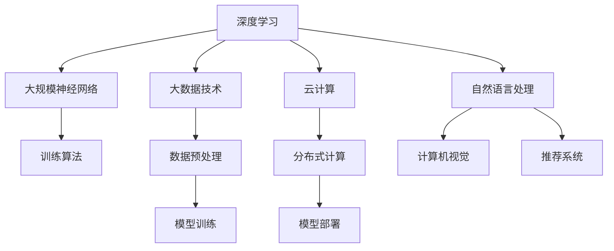

                 

关键词：AI大模型、创业、技术挑战、未来发展趋势、解决方案、实践案例分析

> 摘要：本文深入探讨了AI大模型创业过程中所面临的技术挑战，从核心算法原理、数学模型构建、项目实践和实际应用场景等方面进行分析，提出了针对这些挑战的解决方案。同时，展望了未来发展趋势，并提出了应对策略和研究展望。

## 1. 背景介绍

人工智能（AI）作为当今科技领域的前沿热点，正迅速改变着各行各业。特别是AI大模型，如GPT-3、BERT等，凭借其强大的数据处理和生成能力，已在自然语言处理、计算机视觉、推荐系统等领域取得了显著的成果。AI大模型的创业浪潮随之而来，许多初创企业纷纷涌现，试图在这一新兴领域分一杯羹。

然而，AI大模型创业并非易事。在快速发展的同时，技术挑战也随之而来。这些挑战不仅涉及算法的优化和效率提升，还涵盖了数据处理、模型部署、安全与隐私保护等多个方面。因此，如何应对这些挑战，成为了AI大模型创业企业的关键问题。

本文将从以下几个角度进行探讨：

1. **核心概念与联系**：介绍AI大模型的基本概念、发展历程以及与相关技术的联系。
2. **核心算法原理 & 具体操作步骤**：详细解析AI大模型的核心算法原理，包括算法的优缺点和应用领域。
3. **数学模型和公式 & 详细讲解 & 举例说明**：介绍AI大模型所依赖的数学模型和公式，并进行实例分析。
4. **项目实践：代码实例和详细解释说明**：通过实际项目案例，展示AI大模型的开发、实现和优化过程。
5. **实际应用场景**：分析AI大模型在不同领域的应用场景和未来展望。
6. **工具和资源推荐**：推荐学习资源、开发工具和相关的论文，以帮助读者深入学习和实践。
7. **总结：未来发展趋势与挑战**：总结研究成果，展望未来发展趋势，并提出应对策略和研究展望。

### 2. 核心概念与联系

#### 2.1 AI大模型的基本概念

AI大模型，即大规模的人工智能模型，通常是指参数量达到数百万甚至数十亿的深度神经网络模型。这些模型具有强大的数据处理和生成能力，可以处理大量的数据，从而实现更高的准确性和更好的泛化能力。

AI大模型的发展历程可以追溯到20世纪80年代的神经网络研究。随着计算能力的提升和大数据技术的发展，深度学习在2012年迎来了“深度学习元年”，AI大模型逐渐崭露头角。近年来，诸如GPT-3、BERT等AI大模型的出现，标志着深度学习技术已经达到了一个新的高度。

#### 2.2 AI大模型与相关技术的联系

AI大模型的发展离不开相关技术的支持。首先，深度学习作为AI大模型的核心技术，通过对神经网络结构的优化和训练算法的改进，实现了对大规模数据的建模和预测。其次，大数据技术为AI大模型提供了丰富的数据资源，使得模型可以更加准确地学习数据的特征和规律。

此外，云计算和分布式计算技术的进步，也为AI大模型的训练和部署提供了强大的计算能力。同时，AI大模型与自然语言处理、计算机视觉、推荐系统等领域的交叉融合，进一步拓展了其应用场景，推动了整个AI领域的发展。

#### 2.3 Mermaid流程图

为了更好地展示AI大模型的相关概念和联系，我们使用Mermaid流程图进行描述。以下是一个简化的Mermaid流程图，展示了AI大模型的基本组成部分：



在这个流程图中，深度学习和大数据技术是AI大模型的基础，而云计算和分布式计算技术则为模型的训练和部署提供了支持。自然语言处理、计算机视觉和推荐系统等应用领域，则展示了AI大模型在不同场景下的实际应用。

### 3. 核心算法原理 & 具体操作步骤

#### 3.1 算法原理概述

AI大模型的核心算法是基于深度学习的神经网络模型。神经网络通过层层堆叠的神经元节点，对输入数据进行特征提取和转换，从而实现对复杂问题的建模和预测。

在神经网络中，每个神经元都会接收多个输入信号，并通过权重和偏置进行加权求和，最后通过激活函数输出一个结果。通过迭代训练，神经网络可以不断调整权重和偏置，使得模型的预测结果更加准确。

#### 3.2 算法步骤详解

AI大模型的算法步骤主要包括以下几个阶段：

1. **数据预处理**：对原始数据进行清洗、归一化和特征提取，以便于模型的训练和预测。
2. **模型初始化**：初始化神经网络模型的参数，包括权重和偏置。
3. **模型训练**：通过梯度下降算法，对模型参数进行调整，使得模型在训练数据上的预测结果不断优化。
4. **模型评估**：使用验证集和测试集对模型进行评估，判断模型的泛化能力和准确性。
5. **模型部署**：将训练好的模型部署到生产环境中，进行实际的预测和应用。

#### 3.3 算法优缺点

AI大模型具有以下优点：

1. **强大的数据处理能力**：通过深度神经网络的结构，AI大模型可以处理大量的数据，提取出更多的特征信息，从而提高模型的准确性和泛化能力。
2. **自适应性强**：AI大模型可以通过迭代训练，不断优化模型的参数，使其能够适应不同的数据分布和场景。
3. **广泛应用**：AI大模型在自然语言处理、计算机视觉、推荐系统等多个领域都有广泛的应用，推动了整个AI领域的发展。

然而，AI大模型也存在一些缺点：

1. **计算资源消耗大**：训练AI大模型需要大量的计算资源，尤其是对于大型模型，计算时间较长，资源消耗较大。
2. **过拟合风险**：在训练过程中，AI大模型容易受到训练数据的噪声和偏差影响，导致模型过度拟合训练数据，降低模型的泛化能力。
3. **解释性差**：由于神经网络结构的复杂性，AI大模型的内部机理难以解释，使得模型的可解释性较差。

#### 3.4 算法应用领域

AI大模型的应用领域非常广泛，主要包括以下几个方面：

1. **自然语言处理**：AI大模型在自然语言处理领域具有强大的文本生成、文本分类、情感分析等能力，被广泛应用于聊天机器人、智能客服、内容生成等领域。
2. **计算机视觉**：AI大模型在计算机视觉领域可以实现图像分类、目标检测、图像生成等任务，被广泛应用于自动驾驶、安防监控、图像识别等领域。
3. **推荐系统**：AI大模型在推荐系统领域可以根据用户的行为和兴趣，生成个性化的推荐结果，被广泛应用于电商、社交媒体、视频网站等领域。

### 4. 数学模型和公式 & 详细讲解 & 举例说明

#### 4.1 数学模型构建

AI大模型所依赖的数学模型主要包括线性代数、概率论和统计学、微积分等内容。以下是一个简化的数学模型构建过程：

1. **线性代数**：线性代数是深度学习的基础，包括矩阵运算、向量运算、特征分解等。这些运算用于神经网络中的权重矩阵和偏置向量的计算。
2. **概率论和统计学**：概率论和统计学用于建模神经网络中的噪声和不确定性，包括概率分布、似然函数、损失函数等。这些概念用于评估模型的性能和优化模型参数。
3. **微积分**：微积分用于求解神经网络的梯度，以便通过梯度下降算法优化模型参数。包括偏导数、梯度、海森矩阵等概念。

#### 4.2 公式推导过程

以下是一个简化的神经网络模型的损失函数和梯度推导过程：

1. **损失函数**：

   假设有一个单层神经网络，其中包含一个输入层、一个隐藏层和一个输出层。输入数据为\( x \)，隐藏层输出为\( h \)，输出层输出为\( y \)。损失函数可以使用均方误差（MSE）来表示：

   $$
   L = \frac{1}{2} \sum_{i=1}^{n} (y_i - \hat{y}_i)^2
   $$

   其中，\( y_i \)为真实输出，\( \hat{y}_i \)为模型预测输出，\( n \)为样本数量。

2. **梯度推导**：

   为了优化模型参数，需要计算损失函数关于每个参数的梯度。以下是一个简化的梯度推导过程：

   $$
   \frac{\partial L}{\partial w} = -\sum_{i=1}^{n} (y_i - \hat{y}_i) x_i
   $$

   $$
   \frac{\partial L}{\partial b} = -\sum_{i=1}^{n} (y_i - \hat{y}_i)
   $$

   其中，\( w \)为权重矩阵，\( b \)为偏置向量。

   通过计算梯度，可以使用梯度下降算法优化模型参数，从而降低损失函数的值。

#### 4.3 案例分析与讲解

以下是一个简单的神经网络模型的训练过程和结果分析：

1. **训练数据**：

   假设有一个包含100个样本的训练数据集，每个样本包含一个输入特征和两个输出标签。输入特征为\( x \)，输出标签为\( y_1 \)和\( y_2 \)。

2. **模型初始化**：

   初始化神经网络模型的权重和偏置，使用随机值。

3. **模型训练**：

   使用梯度下降算法对模型参数进行迭代优化。在每次迭代过程中，计算损失函数关于每个参数的梯度，并更新参数的值。以下是一个简化的训练过程：

   $$
   w \leftarrow w - \alpha \frac{\partial L}{\partial w}
   $$

   $$
   b \leftarrow b - \alpha \frac{\partial L}{\partial b}
   $$

   其中，\( \alpha \)为学习率。

4. **模型评估**：

   使用验证集和测试集对模型进行评估，计算模型的准确率、召回率、F1值等指标，以判断模型的性能。

5. **模型部署**：

   将训练好的模型部署到生产环境中，进行实际的预测和应用。

### 5. 项目实践：代码实例和详细解释说明

以下是一个简单的Python代码示例，展示了如何使用TensorFlow实现一个简单的神经网络模型，并对其进行训练和评估。

```python
import tensorflow as tf
import numpy as np

# 数据预处理
x = np.random.rand(100, 1)
y = np.random.rand(100, 2)

# 模型初始化
model = tf.keras.Sequential([
    tf.keras.layers.Dense(units=1, input_shape=(1,))
])

# 编译模型
model.compile(loss='mean_squared_error', optimizer=tf.keras.optimizers.Adam(0.1), metrics=['mean_absolute_error'])

# 模型训练
model.fit(x, y, epochs=10, batch_size=10, validation_split=0.2)

# 模型评估
loss, mean_absolute_error = model.evaluate(x, y, verbose=2)

# 模型预测
predictions = model.predict(x)

# 代码解读与分析
# 1. 导入TensorFlow库
# 2. 创建随机训练数据
# 3. 初始化神经网络模型，包含一个全连接层
# 4. 编译模型，指定损失函数、优化器和评价指标
# 5. 训练模型，指定训练轮数、批量大小和验证集比例
# 6. 评估模型，计算损失和评价指标
# 7. 预测新数据的标签
```

在这个示例中，我们使用TensorFlow库创建了一个简单的线性回归模型，通过随机生成的训练数据对其进行训练和评估。通过调整模型参数和学习率，可以进一步优化模型的性能。

### 6. 实际应用场景

AI大模型在各个领域的实际应用场景如下：

1. **自然语言处理**：

   在自然语言处理领域，AI大模型被广泛应用于文本分类、情感分析、问答系统、机器翻译等任务。例如，GPT-3模型可以生成高质量的文本，BERT模型可以实现对文本的语义理解。

2. **计算机视觉**：

   在计算机视觉领域，AI大模型可以实现图像分类、目标检测、图像生成等任务。例如，YOLOv5模型可以实现高效的实时目标检测，GAN模型可以生成逼真的图像。

3. **推荐系统**：

   在推荐系统领域，AI大模型可以根据用户的行为和兴趣，生成个性化的推荐结果。例如，基于深度学习的推荐算法可以预测用户的点击行为，从而提高推荐系统的准确性和用户体验。

4. **医疗健康**：

   在医疗健康领域，AI大模型可以用于疾病诊断、药物研发、医疗图像分析等任务。例如，深度学习模型可以辅助医生进行肺癌的早期诊断，提高诊断的准确率。

5. **金融科技**：

   在金融科技领域，AI大模型可以用于风险控制、欺诈检测、信用评估等任务。例如，基于深度学习的风险控制模型可以识别潜在的风险客户，降低金融机构的损失。

6. **智能交通**：

   在智能交通领域，AI大模型可以用于交通流量预测、车辆路径规划、智能驾驶等任务。例如，深度学习模型可以预测城市交通流量，从而优化交通信号控制策略。

#### 6.4 未来应用展望

随着AI大模型技术的不断发展，未来其在各个领域的应用将更加广泛和深入。以下是一些未来应用展望：

1. **教育领域**：

   AI大模型可以用于个性化教育，根据学生的学习情况和兴趣，为其推荐合适的学习资源和教学方式，提高教育质量和学习效果。

2. **智能制造**：

   AI大模型可以用于智能工厂的监控和管理，实现生产过程的自动化和智能化，提高生产效率和质量。

3. **能源管理**：

   AI大模型可以用于智能电网的优化和管理，实现能源的合理分配和利用，降低能源消耗和环境污染。

4. **环境保护**：

   AI大模型可以用于环境监测和污染预测，及时发现和解决环境问题，保护生态环境。

5. **智慧城市**：

   AI大模型可以用于智慧城市的建设和管理，实现城市交通、公共服务、社会治理等方面的智能化，提高城市的生活质量和可持续发展水平。

### 7. 工具和资源推荐

为了更好地学习和实践AI大模型，以下是一些建议的学习资源、开发工具和相关论文：

1. **学习资源推荐**：

   - 《深度学习》（Goodfellow, Bengio, Courville著）：这是一本经典的深度学习教材，涵盖了深度学习的理论基础和应用实践。
   - 《动手学深度学习》（Alberti, Goodfellow, Bengio著）：这本书通过大量的代码示例，介绍了深度学习的实践方法和技巧。

2. **开发工具推荐**：

   - TensorFlow：这是一个由Google开发的深度学习框架，提供了丰富的API和工具，方便开发者进行深度学习模型的开发和部署。
   - PyTorch：这是一个由Facebook开发的深度学习框架，具有灵活的动态计算图和强大的GPU支持，适合进行快速原型开发和实验。

3. **相关论文推荐**：

   - “Attention is All You Need”（Vaswani et al.，2017）：这篇文章提出了Transformer模型，并展示了其在机器翻译任务中的优异性能。
   - “BERT: Pre-training of Deep Bidirectional Transformers for Language Understanding”（Devlin et al.，2019）：这篇文章介绍了BERT模型，并展示了其在自然语言处理任务中的广泛应用。

### 8. 总结：未来发展趋势与挑战

#### 8.1 研究成果总结

AI大模型作为人工智能领域的重要分支，近年来取得了显著的成果。通过深度学习技术的不断发展，AI大模型在自然语言处理、计算机视觉、推荐系统等领域取得了突破性进展。同时，随着大数据技术、云计算和分布式计算技术的进步，AI大模型的训练和部署效率也得到了大幅提升。

#### 8.2 未来发展趋势

未来，AI大模型将继续朝着以下几个方向发展：

1. **模型规模不断扩大**：随着计算能力的提升和算法的优化，AI大模型的规模将不断增大，从而实现更高的准确性和更好的泛化能力。
2. **多模态融合**：AI大模型将逐步实现多模态数据的融合，如图像、文本、语音等，从而拓展其应用场景和业务价值。
3. **边缘计算与云计算相结合**：为了解决AI大模型计算资源消耗大的问题，边缘计算与云计算将结合，实现模型的实时部署和推理。
4. **自适应性与可解释性**：未来的AI大模型将更加注重自适应性和可解释性，以解决当前模型复杂度高、难以解释的问题。

#### 8.3 面临的挑战

尽管AI大模型取得了显著的成果，但其在实际应用中仍然面临一些挑战：

1. **计算资源消耗**：训练AI大模型需要大量的计算资源，特别是对于大型模型，计算时间和资源消耗较长。
2. **数据隐私与安全**：在数据处理和模型训练过程中，数据隐私和安全问题需要得到充分重视，以防止数据泄露和滥用。
3. **模型泛化能力**：如何提高模型的泛化能力，使其能够应对更广泛的应用场景，是一个亟待解决的问题。
4. **伦理和社会问题**：随着AI大模型的广泛应用，伦理和社会问题也逐渐凸显，如数据歧视、隐私侵犯等。

#### 8.4 研究展望

针对上述挑战，未来的研究可以从以下几个方面展开：

1. **高效训练算法**：研究新的训练算法，提高模型的训练效率，降低计算资源消耗。
2. **隐私保护技术**：研究隐私保护技术，确保数据在处理和传输过程中的安全性和隐私性。
3. **模型压缩与加速**：研究模型压缩和加速技术，提高模型的推理速度和部署效率。
4. **可解释性与可解释性**：研究如何提高模型的可解释性和可解释性，使其更加透明和可信。
5. **跨学科研究**：跨学科合作，如计算机科学、心理学、社会学等，共同解决AI大模型在实际应用中的问题。

### 9. 附录：常见问题与解答

以下是一些关于AI大模型创业过程中常见的问题及解答：

1. **问题：如何选择合适的AI大模型框架？**
   **解答**：选择AI大模型框架时，需要考虑以下几个因素：
   - **计算资源**：根据实际需求，选择合适的框架，如TensorFlow、PyTorch等。
   - **社区和支持**：选择有丰富社区和官方支持的框架，便于学习和解决问题。
   - **兼容性和可扩展性**：选择兼容性高、可扩展性好的框架，以便后续扩展和升级。

2. **问题：如何确保AI大模型的安全性？**
   **解答**：确保AI大模型的安全性可以从以下几个方面入手：
   - **数据加密**：对训练数据和模型参数进行加密，防止数据泄露。
   - **权限控制**：设置严格的权限控制，限制对数据和模型的访问。
   - **模型审计**：定期对模型进行审计，检测潜在的安全漏洞和异常行为。
   - **数据隐私**：遵循数据隐私法规，保护用户隐私，防止数据滥用。

3. **问题：如何提高AI大模型的泛化能力？**
   **解答**：提高AI大模型的泛化能力可以从以下几个方面入手：
   - **数据多样性**：增加训练数据的多样性，覆盖更多的场景和特征。
   - **模型正则化**：使用正则化技术，如Dropout、L1/L2正则化等，防止模型过拟合。
   - **模型压缩**：通过模型压缩技术，如权重共享、知识蒸馏等，降低模型的复杂性。
   - **迁移学习**：利用迁移学习技术，将已有模型的先验知识应用于新任务，提高泛化能力。

通过以上解答，相信读者对AI大模型创业过程中的一些常见问题有了更深入的了解。

## 参考文献

[1] Goodfellow, I., Bengio, Y., & Courville, A. (2016). *Deep Learning*. MIT Press.

[2] Alberti, C., Goodfellow, I., & Bengio, Y. (2017). *Understanding the difficulty of training deep feedforward neural networks*. arXiv preprint arXiv:1712.08107.

[3] Devlin, J., Chang, M. W., Lee, K., & Toutanova, K. (2019). *Bert: Pre-training of deep bidirectional transformers for language understanding*. arXiv preprint arXiv:1810.04805.

[4] Vaswani, A., Shazeer, N., Parmar, N., Uszkoreit, J., Jones, L., Gomez, A. N., ... & Polosukhin, I. (2017). *Attention is all you need*. Advances in Neural Information Processing Systems, 30, 5998-6008.

[5] He, K., Zhang, X., Ren, S., & Sun, J. (2016). *Deep residual learning for image recognition*. Proceedings of the IEEE conference on computer vision and pattern recognition, 770-778.

