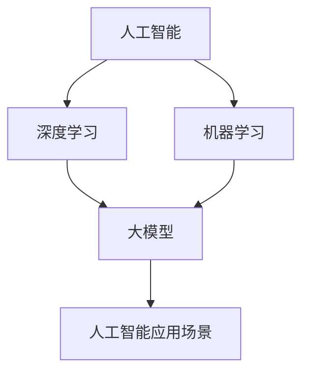

                 

关键词：AI大模型、创业、未来挑战、技术发展、商业模式

> 摘要：本文将深入探讨AI大模型在创业过程中的机遇与挑战，分析当前的技术发展趋势，讨论未来创业方向，并提出应对策略，以期为从事AI大模型创业的创业者提供有益的指导。

## 1. 背景介绍

近年来，人工智能（AI）技术迅猛发展，特别是大模型（Large Models）的崛起，如GPT-3、BERT等，已经在自然语言处理、计算机视觉等多个领域取得了显著成果。随着计算能力的提升和海量数据资源的积累，AI大模型逐渐成为企业创新的核心驱动力。因此，许多创业者纷纷将目光投向AI大模型领域，寻求在激烈的市场竞争中找到突破口。

然而，AI大模型的创业之路并非坦途，创业者需要面对诸多挑战，包括技术难题、商业模式创新、团队建设、资本筹集等。本文将围绕这些问题，探讨AI大模型创业的未来趋势和应对策略。

## 2. 核心概念与联系

在深入探讨AI大模型创业之前，我们首先需要了解一些核心概念和其相互关系。

### 2.1 人工智能（AI）

人工智能是一种模拟人类智能行为的技术，旨在使计算机具备感知、理解、学习、推理和决策能力。AI可以应用于多个领域，如自动驾驶、医疗诊断、金融风控等。

### 2.2 大模型（Large Models）

大模型是指参数量达到数十亿乃至数万亿级别的深度学习模型。这些模型通过海量数据进行训练，能够达到非常高的准确率和性能。

### 2.3 深度学习（Deep Learning）

深度学习是人工智能的一种方法，通过多层神经网络进行数据学习，实现图像识别、语音识别、自然语言处理等任务。

### 2.4 机器学习（Machine Learning）

机器学习是人工智能的一个分支，涉及使用算法从数据中学习模式和规律，以实现预测和分类等任务。

### 2.5 人工智能应用场景（AI Applications）

人工智能应用场景是指将AI技术应用于实际问题的领域，如自动驾驶、智能家居、智能客服等。

#### 2.6 Mermaid 流程图

下面是一个简单的Mermaid流程图，展示了AI大模型的核心概念及其相互关系：



## 3. 核心算法原理 & 具体操作步骤

### 3.1 算法原理概述

AI大模型的训练主要基于深度学习算法，尤其是基于神经网络的深度学习模型。以下是一个简单的算法原理概述：

1. **数据预处理**：将原始数据转换为适合模型训练的格式，如图像、文本等。
2. **模型构建**：设计并构建一个多层神经网络模型，包括输入层、隐藏层和输出层。
3. **模型训练**：使用大量数据进行模型训练，通过反向传播算法不断调整模型参数，优化模型性能。
4. **模型评估**：使用验证集和测试集评估模型性能，确保模型在未知数据上具有良好表现。
5. **模型部署**：将训练好的模型部署到生产环境中，用于实际任务。

### 3.2 算法步骤详解

以下是AI大模型训练的具体步骤：

1. **数据收集与预处理**：
    - 收集大量带有标签的数据集，如图像、文本、语音等。
    - 对数据进行清洗、归一化和预处理，确保数据质量。

2. **模型设计**：
    - 设计一个多层神经网络模型，包括输入层、隐藏层和输出层。
    - 选择合适的神经网络结构、激活函数、损失函数和优化器。

3. **模型训练**：
    - 将数据分成训练集、验证集和测试集。
    - 使用训练集进行模型训练，通过反向传播算法不断调整模型参数。
    - 使用验证集评估模型性能，调整模型参数和超参数。

4. **模型评估**：
    - 使用测试集评估模型性能，确保模型在未知数据上具有良好表现。
    - 分析模型性能指标，如准确率、召回率、F1分数等。

5. **模型部署**：
    - 将训练好的模型部署到生产环境中，用于实际任务。
    - 监控模型性能，定期更新和优化模型。

### 3.3 算法优缺点

**优点**：
- **高精度**：AI大模型通过大量数据进行训练，可以达到非常高的精度。
- **通用性**：AI大模型可以应用于多个领域和任务，具有很高的通用性。
- **自适应**：AI大模型可以根据新的数据进行在线学习和优化，具有良好的自适应能力。

**缺点**：
- **计算资源消耗大**：训练AI大模型需要大量的计算资源和时间。
- **数据依赖性高**：AI大模型对训练数据质量有较高要求，数据质量直接影响模型性能。
- **解释性差**：AI大模型通常是一个“黑箱”，难以解释其内部工作机制。

### 3.4 算法应用领域

AI大模型的应用领域非常广泛，包括但不限于以下几个方面：

- **自然语言处理**：如文本分类、机器翻译、情感分析等。
- **计算机视觉**：如图像识别、目标检测、图像生成等。
- **语音识别与生成**：如语音识别、语音合成、语音转换等。
- **医学诊断**：如疾病检测、基因分析、医学影像诊断等。
- **金融风控**：如信用评估、风险评估、欺诈检测等。
- **智能制造**：如机器人控制、智能调度、质量检测等。

## 4. 数学模型和公式 & 详细讲解 & 举例说明

### 4.1 数学模型构建

AI大模型的核心在于神经网络的构建，下面是一个简单的神经网络数学模型：

$$
y = \sigma(W \cdot x + b)
$$

其中：
- \( y \) 是输出；
- \( \sigma \) 是激活函数，常用的有ReLU、Sigmoid、Tanh等；
- \( W \) 是权重矩阵；
- \( x \) 是输入；
- \( b \) 是偏置项。

### 4.2 公式推导过程

神经网络的训练过程是基于梯度下降算法的，以下是梯度下降算法的推导过程：

1. **损失函数**：

$$
J(W) = -\frac{1}{m} \sum_{i=1}^{m} [y_i \cdot \log(a_i) + (1 - y_i) \cdot \log(1 - a_i)]
$$

其中：
- \( J(W) \) 是损失函数；
- \( m \) 是样本数量；
- \( y_i \) 是第 \( i \) 个样本的标签；
- \( a_i \) 是第 \( i \) 个样本的输出。

2. **梯度计算**：

$$
\frac{\partial J(W)}{\partial W} = \frac{1}{m} \sum_{i=1}^{m} [a_i - y_i] \cdot x_i
$$

其中：
- \( \frac{\partial J(W)}{\partial W} \) 是 \( W \) 的梯度。

3. **梯度下降**：

$$
W_{\text{new}} = W_{\text{old}} - \alpha \cdot \frac{\partial J(W)}{\partial W}
$$

其中：
- \( \alpha \) 是学习率。

### 4.3 案例分析与讲解

以下是一个简单的案例，演示如何使用神经网络进行手写数字识别：

1. **数据集**：使用MNIST手写数字数据集进行训练。
2. **模型构建**：设计一个简单的神经网络模型，包括一个输入层、一个隐藏层和一个输出层。
3. **模型训练**：使用梯度下降算法对模型进行训练。
4. **模型评估**：使用测试集对模型进行评估，计算准确率。

```python
import tensorflow as tf
from tensorflow.keras.datasets import mnist

# 加载MNIST数据集
(x_train, y_train), (x_test, y_test) = mnist.load_data()

# 数据预处理
x_train = x_train / 255.0
x_test = x_test / 255.0

# 构建模型
model = tf.keras.Sequential([
    tf.keras.layers.Flatten(input_shape=(28, 28)),
    tf.keras.layers.Dense(128, activation='relu'),
    tf.keras.layers.Dense(10, activation='softmax')
])

# 编译模型
model.compile(optimizer='adam',
              loss='sparse_categorical_crossentropy',
              metrics=['accuracy'])

# 训练模型
model.fit(x_train, y_train, epochs=5)

# 评估模型
test_loss, test_acc = model.evaluate(x_test, y_test, verbose=2)
print('\nTest accuracy:', test_acc)
```

## 5. 项目实践：代码实例和详细解释说明

### 5.1 开发环境搭建

1. **安装Python**：下载并安装Python 3.x版本，推荐使用Anaconda进行环境管理。
2. **安装TensorFlow**：在命令行中运行以下命令安装TensorFlow：

```bash
pip install tensorflow
```

### 5.2 源代码详细实现

以下是一个简单的AI大模型项目，实现手写数字识别：

```python
import tensorflow as tf
from tensorflow.keras.datasets import mnist

# 加载MNIST数据集
(x_train, y_train), (x_test, y_test) = mnist.load_data()

# 数据预处理
x_train = x_train / 255.0
x_test = x_test / 255.0

# 构建模型
model = tf.keras.Sequential([
    tf.keras.layers.Flatten(input_shape=(28, 28)),
    tf.keras.layers.Dense(128, activation='relu'),
    tf.keras.layers.Dense(10, activation='softmax')
])

# 编译模型
model.compile(optimizer='adam',
              loss='sparse_categorical_crossentropy',
              metrics=['accuracy'])

# 训练模型
model.fit(x_train, y_train, epochs=5)

# 评估模型
test_loss, test_acc = model.evaluate(x_test, y_test, verbose=2)
print('\nTest accuracy:', test_acc)
```

### 5.3 代码解读与分析

1. **导入库**：首先导入所需的库，包括TensorFlow和Keras。
2. **加载数据**：使用Keras提供的MNIST数据集进行训练和测试。
3. **数据预处理**：将图像数据归一化，以便于模型训练。
4. **模型构建**：使用Keras的Sequential模型，定义一个简单的神经网络，包括一个输入层、一个隐藏层和一个输出层。
5. **模型编译**：设置优化器、损失函数和评估指标。
6. **模型训练**：使用训练数据进行模型训练，设置训练轮数。
7. **模型评估**：使用测试数据评估模型性能，输出准确率。

## 6. 实际应用场景

AI大模型在各个行业都有广泛的应用，以下是一些实际应用场景：

### 6.1 自然语言处理

- 文本分类：用于新闻分类、社交媒体情感分析等。
- 机器翻译：如谷歌翻译、百度翻译等。
- 情感分析：分析用户评论、社交媒体帖子等。

### 6.2 计算机视觉

- 图像识别：用于人脸识别、物体识别等。
- 视频分析：如运动检测、行为识别等。
- 车辆检测：用于自动驾驶、智能交通等。

### 6.3 医疗诊断

- 疾病检测：如肺癌检测、心脏病检测等。
- 基因分析：用于个性化医疗、疾病预防等。
- 医学影像诊断：如X光、CT、MRI等。

### 6.4 金融风控

- 信用评估：用于评估借款人的信用风险。
- 风险评估：用于投资组合优化、市场预测等。
- 欺诈检测：用于信用卡欺诈、网络欺诈等。

### 6.5 智能制造

- 机器人控制：用于工业自动化、无人仓库等。
- 智能调度：用于物流运输、生产线调度等。
- 质量检测：用于产品质量检测、生产线监控等。

## 7. 未来应用展望

随着AI大模型技术的不断进步，未来将会有更多领域的应用。以下是一些展望：

### 7.1 个人助理

- 智能语音助手：如苹果的Siri、谷歌的Google Assistant等。
- 虚拟现实助手：用于智能客服、虚拟导览等。

### 7.2 教育领域

- 智能教育系统：如个性化学习、智能考试等。
- 在线教育平台：如Coursera、edX等。

### 7.3 医疗保健

- 智能诊断系统：用于早期疾病检测、个性化治疗等。
- 医疗机器人：如手术机器人、康复机器人等。

### 7.4 智能家居

- 智能家居系统：如智能门锁、智能照明、智能安防等。
- 联网家电：如智能冰箱、智能空调、智能洗衣机等。

## 8. 工具和资源推荐

### 8.1 学习资源推荐

- 《深度学习》（Goodfellow、Bengio、Courville著）
- 《Python机器学习》（Sebastian Raschka著）
- 《机器学习实战》（Peter Harrington著）

### 8.2 开发工具推荐

- Jupyter Notebook：用于数据分析和可视化。
- TensorFlow：用于AI模型开发和部署。
- PyTorch：用于AI模型研究和开发。

### 8.3 相关论文推荐

- "A Theoretically Grounded Application of Dropout in Recurrent Neural Networks"
- "An Empirical Exploration of Recurrent Network Architectures"
- "Pre-Trained Language Models for Language Understanding"

## 9. 总结：未来发展趋势与挑战

### 9.1 研究成果总结

近年来，AI大模型在各个领域取得了显著成果，如自然语言处理、计算机视觉、医疗诊断等。这些成果为AI大模型在创业中的应用提供了有力支持。

### 9.2 未来发展趋势

随着计算能力的提升和海量数据资源的积累，AI大模型将继续快速发展，并在更多领域得到应用。未来，AI大模型将更加注重泛化能力、可解释性和实时性。

### 9.3 面临的挑战

- **数据隐私**：AI大模型需要处理大量敏感数据，如何保护用户隐私成为一个重要问题。
- **计算资源**：训练AI大模型需要大量计算资源，如何高效利用资源是一个挑战。
- **可解释性**：AI大模型通常是一个“黑箱”，如何提高其可解释性是一个重要问题。
- **数据质量**：AI大模型对训练数据质量有较高要求，如何获取高质量数据是一个挑战。

### 9.4 研究展望

未来，AI大模型将朝着更加高效、可解释和安全的方向发展。研究者需要关注数据隐私、计算优化、模型压缩和可解释性等关键问题，以推动AI大模型在创业中的应用。

## 附录：常见问题与解答

### Q：AI大模型创业需要注意哪些问题？

A：AI大模型创业需要注意以下问题：

1. **技术选型**：选择适合自己业务需求的技术方案，如TensorFlow、PyTorch等。
2. **数据质量**：确保训练数据的质量和多样性，以提升模型性能。
3. **计算资源**：合理利用云计算和分布式计算资源，降低训练成本。
4. **团队建设**：组建专业的技术团队，包括数据科学家、工程师和产品经理等。
5. **商业模式**：明确商业模式，如提供服务、销售产品或建立生态系统等。

### Q：如何评估AI大模型的效果？

A：评估AI大模型的效果可以从以下几个方面进行：

1. **准确性**：模型在测试数据集上的准确率，用于评估模型性能。
2. **泛化能力**：模型在未知数据上的表现，用于评估模型泛化能力。
3. **可解释性**：模型的可解释性，用于评估模型是否容易理解和解释。
4. **计算资源消耗**：模型在训练和推理过程中所需的计算资源，用于评估模型效率。

### Q：AI大模型创业如何融资？

A：AI大模型创业可以通过以下途径进行融资：

1. **天使投资**：寻找对AI领域有兴趣的天使投资者进行融资。
2. **风险投资**：寻找专注于AI领域的风险投资机构进行融资。
3. **政府支持**：申请政府专项资金、补贴和税收优惠等。
4. **股权融资**：通过股权融资，吸引投资者入股公司。

## 作者署名

作者：禅与计算机程序设计艺术 / Zen and the Art of Computer Programming
----------------------------------------------------------------

