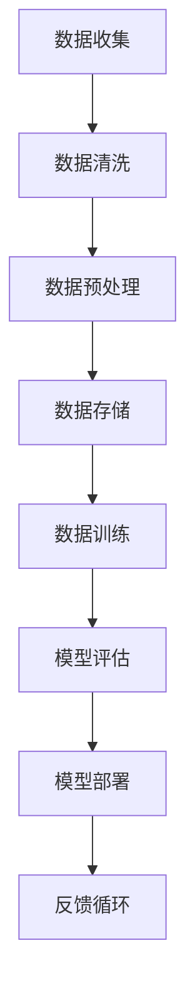

                 

关键词：AI大模型、创业、数据挑战、数据处理、算法优化、数学模型、应用场景、未来展望

> 摘要：随着人工智能技术的发展，大模型在各个领域展现出了巨大的潜力和价值。然而，伴随着大模型的普及，数据挑战也日益凸显。本文将深入探讨AI大模型创业过程中可能面临的数据挑战，并提出相应的解决方案和优化策略，以期为创业者提供有价值的参考。

## 1. 背景介绍

近年来，人工智能（AI）技术取得了飞速发展，尤其在深度学习领域，大模型的应用已经成为了行业趋势。大模型，即参数规模巨大、计算复杂度极高的神经网络模型，如GPT-3、BERT等，它们在自然语言处理、图像识别、语音识别等领域展现出了前所未有的效果。

### 大模型的应用价值

大模型具有以下几方面的显著优势：

1. **强大的通用性**：大模型通常具有较强的通用能力，可以适应多种任务和领域，无需针对每个具体任务进行微调。
2. **高效的学习能力**：大模型通过大量的数据进行训练，能够快速收敛并达到较高的准确率。
3. **多样化的应用场景**：大模型可以应用于自然语言处理、计算机视觉、语音识别、医疗诊断等多种领域，为各行各业提供智能解决方案。

### 大模型带来的数据挑战

尽管大模型在多个领域展示了其强大的能力，但它们也带来了新的数据挑战：

1. **数据质量**：大模型对数据质量的要求较高，需要大量的高质量标注数据。
2. **数据隐私**：大规模数据处理可能涉及用户隐私，如何保障数据隐私是一个亟待解决的问题。
3. **数据可用性**：获取和处理大规模数据需要强大的计算资源和存储能力，这对许多创业公司来说是一个不小的挑战。
4. **数据多样性**：大模型需要多样化的数据进行训练，以避免模型过拟合。

## 2. 核心概念与联系

### 数据处理流程


### 数据处理架构



## 3. 核心算法原理 & 具体操作步骤

### 3.1 算法原理概述

大模型通常基于深度神经网络（DNN）构建，通过多层神经网络对数据进行特征提取和模式识别。以下是一些核心算法原理：

1. **反向传播算法**：用于计算神经网络模型参数的梯度，以优化模型参数。
2. **优化算法**：如随机梯度下降（SGD）、Adam优化器等，用于调整模型参数。
3. **正则化技术**：如L1正则化、L2正则化等，用于防止模型过拟合。

### 3.2 算法步骤详解

1. **数据收集**：从各种数据源收集原始数据。
2. **数据清洗**：去除噪声数据和异常值。
3. **数据预处理**：将原始数据转换为适合模型训练的格式。
4. **模型训练**：使用预处理后的数据训练神经网络模型。
5. **模型评估**：使用验证集对模型进行评估。
6. **模型部署**：将训练好的模型部署到实际应用场景。

### 3.3 算法优缺点

#### 优点

1. **强大的模型性能**：大模型通过多层神经网络可以提取出更复杂、更高级的特征。
2. **高效的学习能力**：大模型可以快速从大量数据中学习到有用的知识。

#### 缺点

1. **计算资源消耗大**：大模型需要大量的计算资源和存储空间。
2. **训练时间较长**：大模型训练时间较长，且容易出现过拟合问题。

### 3.4 算法应用领域

大模型在以下领域具有广泛的应用：

1. **自然语言处理**：如文本分类、机器翻译、情感分析等。
2. **计算机视觉**：如图像分类、目标检测、人脸识别等。
3. **语音识别**：如语音识别、语音合成等。

## 4. 数学模型和公式 & 详细讲解 & 举例说明

### 4.1 数学模型构建

大模型通常基于以下数学模型：

1. **神经网络模型**：包括输入层、隐藏层和输出层。
2. **损失函数**：如交叉熵损失函数、均方误差损失函数等。
3. **优化算法**：如梯度下降、Adam等。

### 4.2 公式推导过程

以神经网络模型为例，假设有一个包含 $L$ 层的神经网络，其输入为 $x$，输出为 $y$，则：

$$
z_l = W_l \cdot a_{l-1} + b_l
$$

$$
a_l = \sigma(z_l)
$$

其中，$W_l$ 和 $b_l$ 分别为第 $l$ 层的权重和偏置，$\sigma$ 为激活函数。

### 4.3 案例分析与讲解

以文本分类任务为例，我们使用一个包含10万个类别的数据集进行训练。数据集包含文本和对应的标签。我们首先对文本进行预处理，如分词、去停用词等，然后将其转换为向量表示。接下来，我们使用神经网络模型进行训练，并使用交叉熵损失函数进行优化。最后，我们对训练好的模型进行评估，计算准确率。

## 5. 项目实践：代码实例和详细解释说明

### 5.1 开发环境搭建

1. 安装Python环境
2. 安装TensorFlow库

### 5.2 源代码详细实现

```python
import tensorflow as tf

# 定义神经网络模型
model = tf.keras.Sequential([
    tf.keras.layers.Embedding(input_dim=10000, output_dim=64),
    tf.keras.layers.GlobalAveragePooling1D(),
    tf.keras.layers.Dense(units=10, activation='softmax')
])

# 编译模型
model.compile(optimizer='adam', loss='sparse_categorical_crossentropy', metrics=['accuracy'])

# 加载数据集
(x_train, y_train), (x_test, y_test) = tf.keras.datasets.imdb.load_data()

# 预处理数据集
x_train = x_train[:1000]
y_train = y_train[:1000]

# 训练模型
model.fit(x_train, y_train, epochs=5)

# 评估模型
model.evaluate(x_test, y_test)
```

### 5.3 代码解读与分析

这段代码首先导入了TensorFlow库，并定义了一个包含一个嵌入层、一个全局平均池化层和一个全连接层的神经网络模型。接下来，我们编译了模型，并加载了IMDb电影评论数据集。然后，我们对数据集进行了预处理，并使用训练集对模型进行了训练。最后，我们使用测试集对模型进行了评估。

## 6. 实际应用场景

### 6.1 金融领域

在金融领域，大模型可以应用于股票预测、风险管理、信用评分等多个方面。例如，通过分析大量历史股票交易数据和公司财报，大模型可以预测股票价格走势，帮助投资者做出更明智的决策。

### 6.2 医疗领域

在医疗领域，大模型可以用于医学图像分析、疾病诊断、药物研发等。例如，通过分析大量的医学图像数据，大模型可以识别出早期病变，帮助医生更早地进行干预。

### 6.3 教育领域

在教育领域，大模型可以用于个性化学习推荐、智能问答系统等。例如，通过分析学生的学习行为和数据，大模型可以为每个学生提供个性化的学习方案，提高学习效果。

## 7. 工具和资源推荐

### 7.1 学习资源推荐

1. 《深度学习》（Ian Goodfellow、Yoshua Bengio、Aaron Courville著）
2. 《Python深度学习》（François Chollet著）

### 7.2 开发工具推荐

1. TensorFlow
2. PyTorch

### 7.3 相关论文推荐

1. "Attention Is All You Need"（Vaswani et al., 2017）
2. "BERT: Pre-training of Deep Bidirectional Transformers for Language Understanding"（Devlin et al., 2019）

## 8. 总结：未来发展趋势与挑战

### 8.1 研究成果总结

大模型在各个领域展现出了强大的能力和广泛的应用前景。然而，伴随着大模型的普及，数据挑战、计算资源消耗、模型解释性等问题亟待解决。

### 8.2 未来发展趋势

未来，大模型将在更多领域得到应用，如自动驾驶、智能家居、虚拟现实等。同时，大模型训练和优化技术也将不断发展，以降低计算成本和提高模型性能。

### 8.3 面临的挑战

1. **数据隐私与安全**：如何在保证数据隐私的前提下进行大规模数据处理是一个重要挑战。
2. **计算资源消耗**：大模型的训练和部署需要大量的计算资源，这对创业公司来说是一个不小的挑战。
3. **模型解释性**：如何解释和理解大模型的行为是一个亟待解决的问题。

### 8.4 研究展望

未来，研究人员将继续探索如何优化大模型的训练和优化技术，降低计算成本，提高模型性能。同时，还将研究如何提高模型的解释性和透明性，以更好地理解和应用大模型。

## 9. 附录：常见问题与解答

### 问题1：大模型为什么需要大量的数据？

解答：大模型通过大量数据进行训练，可以从数据中学习到更多的模式和规律，从而提高模型的泛化能力和性能。

### 问题2：大模型的计算资源消耗如何优化？

解答：可以通过以下几种方式来优化大模型的计算资源消耗：

1. **模型压缩**：如剪枝、量化等技术，可以降低模型的参数规模和计算复杂度。
2. **分布式训练**：通过分布式计算技术，可以将模型训练任务分布到多个节点上，降低单个节点的计算压力。
3. **优化算法**：如异步梯度下降、Adam优化器等，可以提高训练效率。

### 问题3：大模型如何避免过拟合？

解答：可以通过以下几种方法来避免大模型过拟合：

1. **数据增强**：通过增加数据的多样性，可以提高模型的泛化能力。
2. **正则化技术**：如L1正则化、L2正则化等，可以在训练过程中抑制模型参数的增长。
3. **交叉验证**：通过交叉验证方法，可以评估模型的泛化能力，并及时调整模型参数。

---

本文由禅与计算机程序设计艺术 / Zen and the Art of Computer Programming撰写，旨在为AI大模型创业提供数据挑战的解决方案和优化策略。随着人工智能技术的不断进步，大模型将在更多领域发挥重要作用，但同时也面临着数据、计算和模型解释性等挑战。希望本文能为创业者提供有价值的参考和启示。

