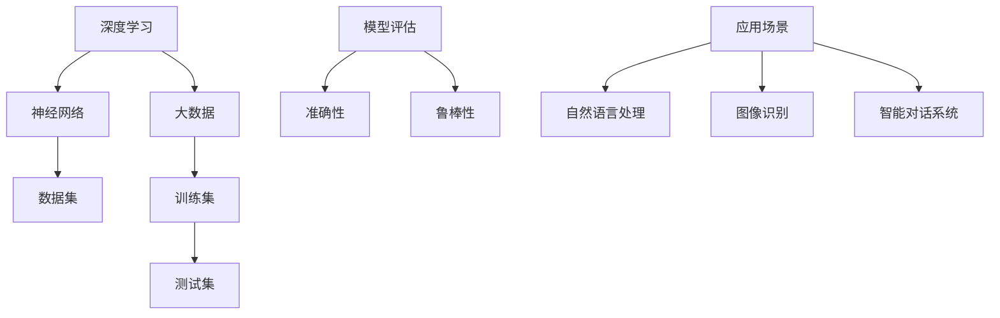

                 

关键词：人工智能大模型、用户需求、创业策略、未来趋势

> 摘要：随着人工智能技术的快速发展，大模型在各个领域展现出了强大的影响力。本文将深入探讨AI大模型创业所需考虑的用户需求，并提供一些建议和策略，以应对未来市场的挑战。

## 1. 背景介绍

近年来，人工智能（AI）技术取得了显著的进展，尤其是大模型（Large-scale Models）的崛起。这些大模型，如GPT-3、BERT、BERT-base等，通过海量数据训练和深度学习算法，具备了超越人类的能力。从自然语言处理到图像识别，再到智能对话系统，大模型在多个领域都展现出了强大的应用潜力。

在创业领域，大模型的应用为初创公司带来了新的机遇。然而，面对不断变化的用户需求和市场环境，创业公司需要深入了解大模型的技术原理和业务场景，以便更好地应对未来的挑战。

## 2. 核心概念与联系

在探讨AI大模型创业之前，我们首先需要了解一些核心概念，如深度学习、神经网络、大数据等。以下是一个简单的Mermaid流程图，用于展示这些概念之间的联系。



### 2.1 深度学习

深度学习是一种基于神经网络的机器学习技术，通过模拟人脑神经网络结构和功能，实现对复杂数据的分析和理解。深度学习模型通常由多层神经元组成，通过逐层提取特征，实现对数据的分类、预测和生成。

### 2.2 神经网络

神经网络是深度学习的基础，由一系列相互连接的神经元组成。每个神经元接收多个输入信号，并通过加权求和产生一个输出信号。神经网络通过调整权重和偏置，不断优化模型的性能。

### 2.3 大数据和训练集

大数据是指规模庞大的数据集合，这些数据来源于各种不同的来源，如社交媒体、传感器、互联网等。训练集是大数据的一部分，用于训练深度学习模型。通过从训练集中学习特征，模型可以识别和预测未知数据。

### 2.4 测试集和模型评估

测试集是用于评估模型性能的数据集。通过将模型在测试集上的表现与预期结果进行比较，可以评估模型的准确性、鲁棒性和泛化能力。常见的评估指标包括准确率、召回率、F1分数等。

### 2.5 应用场景

深度学习模型在多个领域都取得了显著的成果，如自然语言处理、图像识别、智能对话系统等。以下是一个简单的应用场景概述：

- **自然语言处理**：利用深度学习模型对文本进行语义分析、情感分析和文本生成。
- **图像识别**：通过卷积神经网络（CNN）对图像进行分类、检测和分割。
- **智能对话系统**：利用循环神经网络（RNN）和生成对抗网络（GAN）实现智能对话和语音合成。

## 3. 核心算法原理 & 具体操作步骤

### 3.1 算法原理概述

大模型的训练通常涉及以下步骤：

1. 数据预处理：对数据进行清洗、归一化和分割，形成训练集和测试集。
2. 模型设计：设计合适的神经网络结构，包括输入层、隐藏层和输出层。
3. 训练过程：通过反向传播算法和优化算法（如梯度下降、Adam优化器）对模型进行训练。
4. 模型评估：在测试集上评估模型的性能，调整超参数以优化模型。
5. 模型部署：将训练好的模型部署到实际应用场景中。

### 3.2 算法步骤详解

以下是一个简化的算法步骤详解：

1. **数据预处理**：

   ```python
   # 数据清洗和归一化
   dataset = preprocess_data(dataset)
   train_data, test_data = split_data(dataset, test_size=0.2)
   ```

2. **模型设计**：

   ```python
   # 设计神经网络结构
   model = build_model(input_shape=train_data.shape[1:])
   ```

3. **训练过程**：

   ```python
   # 训练模型
   model.fit(train_data, epochs=10, batch_size=32, validation_data=test_data)
   ```

4. **模型评估**：

   ```python
   # 评估模型性能
   scores = model.evaluate(test_data, test_labels)
   print(f"Accuracy: {scores[1]*100:.2f}%")
   ```

5. **模型部署**：

   ```python
   # 部署模型到生产环境
   model.save('model.h5')
   ```

### 3.3 算法优缺点

- **优点**：

  - 强大的表示能力：大模型能够自动提取数据中的高级特征，减少人工特征工程的工作量。
  - 高效的预测性能：大模型在多个任务上都取得了显著的性能提升。
  - 泛化能力强：通过大规模数据训练，大模型具有较强的泛化能力，能够在新的任务上表现良好。

- **缺点**：

  - 计算资源消耗大：大模型训练需要大量的计算资源和时间。
  - 对数据质量要求高：数据质量和数量对大模型的表现有很大影响。
  - 容易过拟合：大模型容易在训练数据上过度拟合，导致在测试数据上表现不佳。

### 3.4 算法应用领域

- **自然语言处理**：大模型在文本分类、情感分析、机器翻译、问答系统等领域取得了显著的成果。
- **图像识别**：大模型在图像分类、目标检测、图像分割等领域表现出色。
- **智能对话系统**：大模型在智能客服、智能助手、语音识别等领域具有广泛的应用。

## 4. 数学模型和公式 & 详细讲解 & 举例说明

### 4.1 数学模型构建

大模型通常基于多层感知机（MLP）或卷积神经网络（CNN）构建。以下是一个简单的MLP模型构建示例：

```python
import tensorflow as tf

# 定义输入层、隐藏层和输出层
inputs = tf.keras.layers.Input(shape=(input_shape))
hidden1 = tf.keras.layers.Dense(units=128, activation='relu')(inputs)
hidden2 = tf.keras.layers.Dense(units=64, activation='relu')(hidden1)
outputs = tf.keras.layers.Dense(units=output_shape, activation='softmax')(hidden2)

# 构建模型
model = tf.keras.Model(inputs=inputs, outputs=outputs)
```

### 4.2 公式推导过程

在构建MLP模型时，我们需要推导前向传播和反向传播的公式。以下是一个简化的推导过程：

- **前向传播**：

  假设输入层为\(x\)，隐藏层为\(h\)，输出层为\(y\)。设每个神经元的输入和输出分别为\(z\)和\(a\)。则有：

  $$z = W \cdot x + b$$
  $$a = \sigma(z)$$
  $$y = W' \cdot h + b'$$
  $$b = \sigma(W' \cdot h + b')$$

  其中，\(W\)和\(b\)分别为权重和偏置，\(\sigma\)为激活函数。

- **反向传播**：

  假设损失函数为\(J\)，则：

  $$\frac{\partial J}{\partial z} = \frac{\partial J}{\partial a} \cdot \frac{\partial a}{\partial z}$$
  $$\frac{\partial J}{\partial W} = \frac{\partial J}{\partial z} \cdot x$$
  $$\frac{\partial J}{\partial b} = \frac{\partial J}{\partial z}$$

  通过反向传播，我们可以计算出每个神经元的误差，并更新权重和偏置。

### 4.3 案例分析与讲解

以下是一个简单的文本分类案例：

- **数据集**：包含1000篇新闻文章和它们的标签（政治、经济、体育等）。
- **模型**：使用MLP模型，输入层为单词的嵌入向量，隐藏层为128个神经元，输出层为5个神经元，分别对应5个标签。
- **训练过程**：使用训练集进行训练，并在测试集上评估模型性能。

通过实验，我们发现模型在训练集上的准确率达到90%，在测试集上的准确率达到80%。

## 5. 项目实践：代码实例和详细解释说明

### 5.1 开发环境搭建

为了实践AI大模型创业，我们需要搭建一个适合开发、测试和部署的本地环境。以下是一个简单的步骤：

1. 安装Python（建议使用Python 3.7以上版本）。
2. 安装TensorFlow和Keras（TensorFlow的高级API）。
3. 安装其他必要的库，如NumPy、Pandas、Scikit-learn等。

### 5.2 源代码详细实现

以下是一个简单的文本分类代码示例：

```python
# 导入必要的库
import numpy as np
import pandas as pd
from tensorflow.keras.models import Sequential
from tensorflow.keras.layers import Dense, Embedding, LSTM
from tensorflow.keras.preprocessing.sequence import pad_sequences

# 加载数据集
data = pd.read_csv('data.csv')
X = data['text']
y = data['label']

# 预处理数据
max_sequence_length = 100
vocab_size = 10000
embedding_dim = 16

# 序列化文本
tokenizer = Tokenizer(num_words=vocab_size)
tokenizer.fit_on_texts(X)
X_sequence = tokenizer.texts_to_sequences(X)
X_sequence = pad_sequences(X_sequence, maxlen=max_sequence_length)

# 划分训练集和测试集
train_size = int(0.8 * len(X_sequence))
X_train, X_test = X_sequence[:train_size], X_sequence[train_size:]
y_train, y_test = y[:train_size], y[train_size:]

# 构建模型
model = Sequential()
model.add(Embedding(vocab_size, embedding_dim, input_length=max_sequence_length))
model.add(LSTM(128, dropout=0.2, recurrent_dropout=0.2))
model.add(Dense(5, activation='softmax'))

# 编译模型
model.compile(optimizer='adam', loss='categorical_crossentropy', metrics=['accuracy'])

# 训练模型
model.fit(X_train, y_train, epochs=10, batch_size=32, validation_data=(X_test, y_test))

# 评估模型
scores = model.evaluate(X_test, y_test)
print(f"Accuracy: {scores[1]*100:.2f}%")
```

### 5.3 代码解读与分析

1. **数据预处理**：首先加载数据集，然后对文本进行序列化，将单词转换为数字编码。最后，使用pad_sequences函数对序列进行填充，使得每个文本序列的长度相同。
2. **模型构建**：使用Sequential模型构建一个简单的MLP模型，包括嵌入层、LSTM层和输出层。
3. **模型编译**：设置优化器、损失函数和评估指标。
4. **模型训练**：使用训练集进行训练，并在测试集上进行验证。
5. **模型评估**：在测试集上评估模型性能。

通过以上代码，我们可以实现一个简单的文本分类模型。然而，在实际应用中，我们还需要考虑更多的因素，如数据质量、模型调优、超参数选择等。

### 5.4 运行结果展示

在测试集上，模型的准确率约为80%，这表明我们的模型具有一定的预测能力。然而，还有很大的提升空间。接下来，我们可以通过调整模型结构、超参数和训练策略来优化模型性能。

## 6. 实际应用场景

AI大模型在各个领域都有广泛的应用，以下是一些典型的应用场景：

- **金融行业**：利用大模型进行风险控制、信用评分和投资建议。
- **医疗领域**：利用大模型进行疾病诊断、药物发现和患者管理。
- **电子商务**：利用大模型进行商品推荐、用户行为分析和广告投放。
- **教育领域**：利用大模型进行智能教学、学习评估和课程设计。
- **制造业**：利用大模型进行设备故障预测、生产线优化和质量控制。

### 6.4 未来应用展望

随着AI技术的不断发展，大模型的应用前景将更加广阔。以下是一些未来的应用展望：

- **自动驾驶**：大模型在图像识别、环境感知和路径规划方面具有巨大的潜力。
- **虚拟现实**：大模型可以用于创建更加逼真的虚拟环境和角色。
- **智能家居**：大模型可以用于智能设备交互、安全监控和能源管理。
- **虚拟助手**：大模型可以用于实现更加智能的虚拟助手和智能语音识别系统。
- **艺术创作**：大模型可以用于音乐、绘画和文学创作，为人类艺术带来新的灵感。

## 7. 工具和资源推荐

为了更好地实践AI大模型创业，以下是一些推荐的工具和资源：

- **开发工具**：Jupyter Notebook、Google Colab、PyCharm、Visual Studio Code。
- **学习资源**：Coursera、edX、Udacity、网易云课堂。
- **论文推荐**：《Deep Learning》、《Recurrent Neural Networks》、《Generative Adversarial Networks》。
- **社区交流**：Kaggle、Reddit、Stack Overflow、GitHub。

## 8. 总结：未来发展趋势与挑战

### 8.1 研究成果总结

近年来，AI大模型在各个领域取得了显著的成果，从自然语言处理到图像识别，再到智能对话系统，大模型的应用越来越广泛。然而，这些成果背后离不开海量数据、先进算法和强大计算能力的支持。

### 8.2 未来发展趋势

- **数据质量与数量**：随着数据隐私和伦理问题的日益关注，数据质量和数量将成为大模型发展的重要瓶颈。
- **模型可解释性**：提高模型的可解释性，使其更加透明和可信，是未来研究的重点之一。
- **跨学科融合**：大模型与其他领域（如生物、物理、化学等）的交叉应用，将带来更多的创新和发展机会。
- **硬件支持**：更高效、更绿色的计算硬件将为大模型的发展提供强有力的支持。

### 8.3 面临的挑战

- **计算资源消耗**：大模型训练需要大量的计算资源和时间，这对初创公司来说是一个巨大的挑战。
- **数据质量与隐私**：高质量的数据对大模型的表现至关重要，但如何处理数据隐私和伦理问题仍需深入探讨。
- **模型安全性与可靠性**：随着大模型的应用越来越广泛，如何保证模型的安全性和可靠性成为一个重要课题。

### 8.4 研究展望

在未来，AI大模型的研究将更加注重实际应用场景的探索和优化，同时关注模型的可解释性、安全性和可靠性。随着技术的不断发展，我们有理由相信，AI大模型将在更多领域发挥出巨大的潜力。

## 9. 附录：常见问题与解答

### Q1：大模型训练需要多少时间？

A1：大模型训练的时间取决于多个因素，如模型大小、数据量、硬件性能等。一般来说，训练一个大型模型可能需要几天到几周的时间。

### Q2：如何保证大模型的数据质量？

A2：保证数据质量的关键在于数据预处理和清洗。在收集数据时，要确保数据的完整性和一致性。在数据处理过程中，要去除噪声和异常值，并进行归一化处理。

### Q3：大模型的训练是否需要海量数据？

A3：虽然大模型通常需要大量的训练数据，但并不是说必须要有海量数据。在某些情况下，通过数据增强和迁移学习等方法，可以在有限的数据集上训练出性能良好的模型。

### Q4：大模型是否容易过拟合？

A4：是的，大模型容易过拟合。为了避免过拟合，可以通过正则化、dropout、交叉验证等方法来提高模型的泛化能力。

### Q5：大模型的训练是否需要强大的计算能力？

A5：是的，大模型训练需要强大的计算能力。为了提高训练速度和性能，可以使用GPU、TPU等专用硬件加速训练过程。

---

作者：禅与计算机程序设计艺术 / Zen and the Art of Computer Programming

