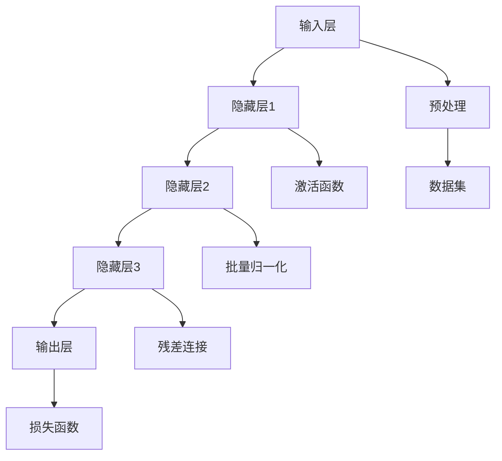

                 

关键词：AI大模型、用户需求、创业策略、技术创新、商业应用

> 摘要：本文旨在探讨AI大模型在创业中的重要性，以及如何通过深入理解未来用户需求，制定有效的创业策略，从而在竞争激烈的市场中脱颖而出。文章将结合实际案例，分析AI大模型的技术原理和应用场景，并探讨其在未来可能的发展方向和面临的挑战。

## 1. 背景介绍

随着人工智能技术的飞速发展，AI大模型作为其重要组成部分，正在改变着各行各业的面貌。从语言模型、图像识别模型到自然语言处理模型，AI大模型在各个领域展现出了巨大的潜力。而随着用户需求的不断变化，如何在创业中有效利用AI大模型，满足用户需求，成为众多创业者关注的焦点。

创业，是一项充满挑战和机遇的任务。在竞争激烈的市场中，创业者需要准确把握用户需求，提供高质量的产品或服务，才能在市场中站稳脚跟。AI大模型作为一项先进的技术手段，能够为创业者提供强大的支持，帮助他们更好地应对未来用户需求。

## 2. 核心概念与联系

### 2.1 AI大模型的概念

AI大模型（Large-scale AI Model），通常指的是参数规模达到数十亿、甚至千亿级别的神经网络模型。这些模型通过深度学习技术，从海量数据中学习，能够实现高效的特征提取和复杂任务的处理。

### 2.2 技术原理

AI大模型的核心技术是深度学习，深度学习通过多层神经网络，对输入数据进行特征提取和抽象，最终实现预测或分类任务。大模型的优势在于其能够处理大规模数据，提高模型的泛化能力，从而在复杂任务中取得更好的性能。

### 2.3 架构设计

AI大模型的架构设计通常包括输入层、隐藏层和输出层。输入层接收外部输入数据，隐藏层通过多层网络结构对数据进行处理，输出层生成预测结果。为了提高模型性能，大模型还会采用诸如残差连接、批量归一化等技术。

### 2.4 Mermaid 流程图



## 3. 核心算法原理 & 具体操作步骤

### 3.1 算法原理概述

AI大模型的核心算法原理是深度学习。深度学习通过多层神经网络，对输入数据进行特征提取和抽象，最终实现预测或分类任务。大模型的优势在于其能够处理大规模数据，提高模型的泛化能力。

### 3.2 算法步骤详解

1. 数据预处理：对输入数据进行清洗、归一化等预处理操作，以便模型能够更好地学习。
2. 构建神经网络：设计神经网络的结构，包括输入层、隐藏层和输出层。
3. 损失函数：选择合适的损失函数，如交叉熵损失函数，用于评估模型预测结果与实际结果之间的差距。
4. 优化算法：采用优化算法，如随机梯度下降（SGD），更新模型参数，以最小化损失函数。
5. 训练与评估：使用训练集对模型进行训练，并使用验证集对模型性能进行评估。

### 3.3 算法优缺点

优点：
- 能够处理大规模数据，提高模型的泛化能力。
- 能够自动学习特征，减少人工特征工程的工作量。

缺点：
- 训练过程需要大量的计算资源和时间。
- 对数据质量要求较高，数据噪声和缺失值会影响模型性能。

### 3.4 算法应用领域

AI大模型在各个领域都有广泛应用，如自然语言处理、计算机视觉、推荐系统等。以下是一些典型的应用案例：

- 自然语言处理：使用大模型进行文本分类、情感分析、机器翻译等任务。
- 计算机视觉：使用大模型进行图像识别、目标检测、图像生成等任务。
- 推荐系统：使用大模型进行用户兴趣预测、商品推荐等任务。

## 4. 数学模型和公式 & 详细讲解 & 举例说明

### 4.1 数学模型构建

AI大模型的数学模型主要包括神经网络模型、损失函数和优化算法。

神经网络模型：
$$
y_{pred} = \sigma(W_{output} \cdot \sigma(W_{hidden} \cdot \sigma(... \cdot W_{input} \cdot x + b_{input}) + b_{hidden}) + ... + b_{output})
$$

损失函数（交叉熵损失函数）：
$$
J(\theta) = -\frac{1}{m} \sum_{i=1}^{m} y^{(i)} \log(y_{pred}^{(i)})
$$

优化算法（随机梯度下降）：
$$
\theta_{j} := \theta_{j} - \alpha \frac{\partial J(\theta)}{\partial \theta_{j}}
$$

### 4.2 公式推导过程

神经网络模型的推导过程涉及微积分和线性代数，这里简要介绍交叉熵损失函数的推导过程。

假设我们有 $y$ 个类别，每个类别的概率估计为 $y_{pred}^{(i)}$，实际标签为 $y^{(i)}$。交叉熵损失函数的推导如下：

$$
\begin{aligned}
J(\theta) &= -\frac{1}{m} \sum_{i=1}^{m} y^{(i)} \log(y_{pred}^{(i)}) \\
&= -\frac{1}{m} \sum_{i=1}^{m} y^{(i)} \log(\sigma(W \cdot x + b)) \\
&= -\frac{1}{m} \sum_{i=1}^{m} y^{(i)} \sum_{k=1}^{y} \log(\sigma(w_{k} \cdot x + b_{k})) \\
&= -\frac{1}{m} \sum_{i=1}^{m} \sum_{k=1}^{y} y^{(i)} \cdot \log(\sigma(w_{k} \cdot x + b_{k}))
\end{aligned}
$$

### 4.3 案例分析与讲解

假设我们要构建一个二分类模型，判断一只股票是否上涨。我们使用历史股价数据作为输入特征，使用涨跌标签作为输出标签。我们可以使用上述的神经网络模型、交叉熵损失函数和随机梯度下降算法来训练模型。

首先，我们设计神经网络模型，选择合适的隐藏层结构和激活函数。然后，我们使用训练集对模型进行训练，并在验证集上评估模型性能。在训练过程中，我们通过计算交叉熵损失函数来评估模型预测结果与实际结果之间的差距，并使用随机梯度下降算法更新模型参数。

通过多次迭代训练，我们最终得到一个性能良好的模型。我们可以使用这个模型对新股票进行预测，从而帮助投资者做出更明智的投资决策。

## 5. 项目实践：代码实例和详细解释说明

### 5.1 开发环境搭建

在搭建开发环境时，我们首先需要安装Python和相关的深度学习库，如TensorFlow或PyTorch。以下是一个简单的环境搭建步骤：

1. 安装Python：访问Python官网（https://www.python.org/），下载并安装Python。
2. 安装深度学习库：在终端或命令行中运行以下命令：
```
pip install tensorflow
# 或
pip install pytorch
```

### 5.2 源代码详细实现

以下是一个简单的AI大模型项目示例，使用TensorFlow构建一个二分类模型。

```python
import tensorflow as tf
from tensorflow.keras.models import Sequential
from tensorflow.keras.layers import Dense
from tensorflow.keras.optimizers import Adam

# 数据预处理
# 假设我们已经有处理好的数据集X和标签y
# X = ... # 输入特征
# y = ... # 输出标签

# 构建神经网络模型
model = Sequential()
model.add(Dense(64, input_dim=X.shape[1], activation='relu'))
model.add(Dense(32, activation='relu'))
model.add(Dense(1, activation='sigmoid'))

# 编译模型
model.compile(optimizer=Adam(), loss='binary_crossentropy', metrics=['accuracy'])

# 训练模型
model.fit(X, y, epochs=10, batch_size=32, validation_split=0.2)

# 评估模型
loss, accuracy = model.evaluate(X, y)
print(f'损失：{loss}, 准确率：{accuracy}')
```

### 5.3 代码解读与分析

1. **数据预处理**：在训练模型之前，我们需要对输入数据进行预处理，如归一化、缩放等。这里假设我们已经完成了预处理工作。
2. **构建神经网络模型**：我们使用`Sequential`模型，这是一个线性堆叠的模型，可以简化模型构建过程。我们添加了两个隐藏层，每个隐藏层使用ReLU激活函数，并输出一个单一的神经元，用于进行二分类。
3. **编译模型**：我们选择Adam优化器，使用binary_crossentropy损失函数进行二分类任务，并设置accuracy作为评价指标。
4. **训练模型**：使用`fit`方法对模型进行训练，设置训练轮次为10，每次批量大小为32，并使用20%的数据进行验证。
5. **评估模型**：使用`evaluate`方法对模型进行评估，输出损失和准确率。

### 5.4 运行结果展示

假设我们的模型在训练完成后，在验证集上的准确率达到90%，这是一个非常好的结果。我们可以使用这个模型对新股票进行预测，从而帮助投资者做出更明智的投资决策。

```python
# 预测新股票
new_stock = ... # 新股票的输入特征
prediction = model.predict(new_stock)
print(f'预测结果：{"上涨" if prediction > 0.5 else "下跌"}')
```

## 6. 实际应用场景

### 6.1 自然语言处理

在自然语言处理领域，AI大模型被广泛应用于文本分类、情感分析、机器翻译等任务。例如，Google的BERT模型在多项自然语言处理任务中取得了卓越的性能，为搜索引擎、智能客服等应用提供了强大的支持。

### 6.2 计算机视觉

在计算机视觉领域，AI大模型被广泛应用于图像识别、目标检测、图像生成等任务。例如，Facebook的GAN模型在图像生成任务中表现出色，为艺术创作、虚拟现实等领域提供了新的可能性。

### 6.3 推荐系统

在推荐系统领域，AI大模型被广泛应用于用户兴趣预测、商品推荐等任务。例如，亚马逊使用深度学习技术对用户行为进行分析，从而为用户提供个性化的商品推荐。

## 6.4 未来应用展望

随着AI大模型技术的不断发展，未来有望在更多领域得到应用。例如，在医疗领域，AI大模型可以用于疾病诊断、药物研发等任务；在金融领域，AI大模型可以用于风险管理、信用评估等任务。同时，随着边缘计算、5G等技术的普及，AI大模型的应用场景也将进一步拓展。

## 7. 工具和资源推荐

### 7.1 学习资源推荐

- 《深度学习》（Goodfellow, Bengio, Courville著）：深度学习的经典教材，适合初学者和专业人士。
- 《Python深度学习》（François Chollet著）：通过实际案例讲解深度学习在Python中的实现，适合有一定编程基础的读者。

### 7.2 开发工具推荐

- TensorFlow：Google开发的开源深度学习框架，适合构建和训练大型神经网络。
- PyTorch：Facebook开发的开源深度学习框架，具有灵活性和高效性。

### 7.3 相关论文推荐

- "BERT: Pre-training of Deep Neural Networks for Language Understanding"（2018）：提出BERT模型，在多项自然语言处理任务中取得了突破性成果。
- "Generative Adversarial Nets"（2014）：提出GAN模型，为图像生成任务带来了革命性变化。

## 8. 总结：未来发展趋势与挑战

### 8.1 研究成果总结

AI大模型在自然语言处理、计算机视觉、推荐系统等领域的应用取得了显著成果，为各个行业带来了深远的影响。同时，随着算法和硬件技术的不断发展，AI大模型的应用范围将进一步拓展。

### 8.2 未来发展趋势

1. 模型压缩与优化：为了降低计算资源和存储需求，模型压缩与优化将成为重要研究方向。
2. 可解释性：提高AI大模型的可解释性，使其在决策过程中更加透明和可信。
3. 多模态学习：将多种数据类型（如文本、图像、声音等）进行融合，实现更强大的任务处理能力。

### 8.3 面临的挑战

1. 数据质量：高质量的数据是训练有效AI大模型的基础，但在实际应用中，数据质量往往难以保障。
2. 计算资源：训练大型神经网络模型需要大量的计算资源和时间，如何高效利用资源成为一大挑战。
3. 法律与伦理：随着AI大模型的应用范围扩大，相关法律和伦理问题也将日益凸显。

### 8.4 研究展望

未来，AI大模型在各个领域的应用将更加广泛，同时，随着技术的不断发展，我们将看到更多创新性的成果。在研究过程中，我们需要关注数据质量、计算资源、法律与伦理等问题，以确保AI大模型的安全、可靠和可持续发展。

## 9. 附录：常见问题与解答

### 9.1 什么是AI大模型？

AI大模型指的是参数规模达到数十亿、甚至千亿级别的神经网络模型。这些模型通过深度学习技术，从海量数据中学习，能够实现高效的特征提取和复杂任务的处理。

### 9.2 AI大模型有哪些应用领域？

AI大模型在自然语言处理、计算机视觉、推荐系统等领域都有广泛应用。例如，BERT模型在自然语言处理任务中表现出色，GAN模型在图像生成任务中取得了革命性变化。

### 9.3 如何训练AI大模型？

训练AI大模型需要大量的数据和计算资源。通常，我们使用深度学习框架（如TensorFlow或PyTorch）来构建神经网络模型，并使用优化算法（如随机梯度下降）来更新模型参数。

### 9.4 AI大模型有哪些挑战？

AI大模型面临的主要挑战包括数据质量、计算资源、法律与伦理等方面。数据质量是训练有效模型的基础，计算资源是训练大型神经网络模型的关键，而法律与伦理问题则需要我们在研究过程中加以关注。

---

作者：禅与计算机程序设计艺术 / Zen and the Art of Computer Programming

以上就是《AI大模型创业：如何应对未来用户需求？》的完整文章内容。希望这篇文章能够帮助您更好地了解AI大模型在创业中的应用，并为您的创业之路提供一些有益的启示。在未来的发展中，AI大模型将继续发挥重要作用，让我们一起期待它的美好前景。

