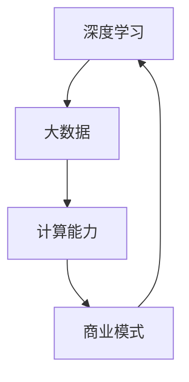

                 

## 摘要

本文旨在探讨AI大模型创业公司如何应对未来竞争对手的挑战。通过分析AI大模型的发展现状、技术趋势以及商业战略，本文提出了多维度应对策略，包括技术创新、数据积累、生态构建、人才培养等方面。文章旨在为AI大模型创业公司提供实用的指导，帮助其在激烈的市场竞争中脱颖而出。

## 1. 背景介绍

### 1.1 AI大模型的发展历程

AI大模型，即人工智能大型模型，是指通过深度学习等技术，对海量数据进行训练，从而实现高精度预测和决策的复杂模型。其发展历程可以追溯到20世纪80年代，当时研究人员开始尝试利用神经网络来解决复杂问题。随着计算能力的提升和大数据技术的发展，AI大模型逐渐走向成熟。

### 1.2 当前AI大模型的应用场景

AI大模型在多个领域已经取得了显著的成果，包括自然语言处理、计算机视觉、语音识别、推荐系统等。例如，BERT模型在自然语言处理任务中取得了突破性进展，ImageNet竞赛的胜利标志着计算机视觉技术的飞速发展。

### 1.3 AI大模型创业的现状

近年来，AI大模型创业公司如雨后春笋般涌现。这些公司凭借创新的算法和强大的技术实力，逐渐在市场中占据一席之地。然而，随着市场的发展和竞争的加剧，如何应对未来竞争对手成为AI大模型创业公司面临的重要问题。

## 2. 核心概念与联系

为了深入理解AI大模型创业的挑战和应对策略，我们需要了解以下几个核心概念：

### 2.1 深度学习

深度学习是一种通过模拟人脑神经网络进行学习和推理的人工智能技术。它通过多层神经网络的训练，实现对复杂数据的建模和分析。

### 2.2 大数据

大数据是指数据量巨大、类型繁多、价值密度低的数据集合。大数据技术包括数据存储、数据分析和数据挖掘等。

### 2.3 计算能力

计算能力是AI大模型训练和推理的关键。高性能计算设备和分布式计算技术是支撑AI大模型发展的基础。

### 2.4 商业模式

商业模式是指公司通过什么方式获取利润。对于AI大模型创业公司，有效的商业模式是其持续发展的关键。

以下是这些概念之间的联系（使用Mermaid流程图表示）：



## 3. 核心算法原理 & 具体操作步骤

### 3.1 算法原理概述

AI大模型的算法原理主要基于深度学习和大数据技术。深度学习通过多层神经网络对数据进行特征提取和模型训练，而大数据技术则提供海量数据支持，确保模型具备较高的准确性和鲁棒性。

### 3.2 算法步骤详解

AI大模型的算法步骤可以分为以下几个阶段：

1. 数据采集：从不同来源获取大量数据，包括文本、图像、音频等。
2. 数据预处理：对采集到的数据进行清洗、标注和格式化，确保数据的质量和一致性。
3. 特征提取：利用深度学习算法提取数据中的关键特征，为模型训练提供基础。
4. 模型训练：使用大数据集对模型进行训练，不断优化模型的参数。
5. 模型评估：通过测试集对模型进行评估，确保其达到预期效果。
6. 模型部署：将训练好的模型部署到实际应用中，提供预测和决策服务。

### 3.3 算法优缺点

AI大模型算法的优点包括：

- **高精度**：通过海量数据的训练，模型具有较高的准确性和鲁棒性。
- **泛化能力**：深度学习模型能够对未知数据进行有效的预测和推理。

然而，AI大模型算法也存在一些缺点：

- **计算资源消耗**：大规模模型的训练和推理需要高性能计算设备和大量数据存储。
- **数据依赖**：模型的性能和数据质量密切相关，数据来源单一或质量较差可能会影响模型的效果。

### 3.4 算法应用领域

AI大模型算法在多个领域都有广泛应用，包括：

- **自然语言处理**：用于文本分类、情感分析、机器翻译等任务。
- **计算机视觉**：用于图像识别、目标检测、人脸识别等任务。
- **语音识别**：用于语音识别、语音合成等任务。
- **推荐系统**：用于个性化推荐、广告投放等任务。

## 4. 数学模型和公式 & 详细讲解 & 举例说明

### 4.1 数学模型构建

AI大模型的数学模型通常基于多层感知机（MLP）或卷积神经网络（CNN）。以下是一个简单的多层感知机模型的构建过程：

```latex
y = f(z)
z = \sum_{i=1}^{n} w_i \cdot x_i + b
x_i = x_i'
```

其中，\( y \) 是输出，\( z \) 是中间变量，\( w_i \) 和 \( b \) 分别是权重和偏置，\( x_i \) 是输入特征，\( f \) 是激活函数。

### 4.2 公式推导过程

假设我们有一个包含 \( L \) 层的多层感知机模型，输入为 \( x \)，输出为 \( y \)。模型的推导过程如下：

1. 第一层输入：
   $$ z_1 = x $$
2. 隐藏层 \( l \) 的输出：
   $$ z_l = \sum_{k=1}^{L-1} w_{lk} \cdot z_{l-1} + b_l $$
3. 输出层输出：
   $$ y = \sum_{l=1}^{L} w_{ly} \cdot z_l + b_y $$

### 4.3 案例分析与讲解

以下是一个简单的例子，假设我们有一个二分类问题，输入特征为 \( x_1 \) 和 \( x_2 \)，输出为 \( y \)。

1. 输入特征：
   $$ x = \begin{pmatrix} x_1 \\ x_2 \end{pmatrix} $$
2. 权重和偏置：
   $$ w = \begin{pmatrix} w_{11} & w_{12} \\ w_{21} & w_{22} \end{pmatrix}, b = \begin{pmatrix} b_1 \\ b_2 \end{pmatrix} $$
3. 输出：
   $$ y = f(z) $$
   其中，\( z = w \cdot x + b \)

通过训练，我们得到最优的权重和偏置，从而实现对输入数据的分类。

## 5. 项目实践：代码实例和详细解释说明

### 5.1 开发环境搭建

在开始编写代码之前，我们需要搭建一个适合AI大模型训练的开发环境。这里我们使用Python和TensorFlow作为主要的编程语言和框架。

```bash
pip install tensorflow
```

### 5.2 源代码详细实现

以下是一个简单的AI大模型训练的Python代码实例：

```python
import tensorflow as tf

# 定义输入层
inputs = tf.keras.Input(shape=(2,))

# 定义隐藏层
dense = tf.keras.layers.Dense(units=1, activation='sigmoid')(inputs)

# 定义输出层
outputs = tf.keras.layers.Dense(units=1, activation='sigmoid')(dense)

# 创建模型
model = tf.keras.Model(inputs=inputs, outputs=outputs)

# 编译模型
model.compile(optimizer='adam', loss='binary_crossentropy', metrics=['accuracy'])

# 准备训练数据
x_train = [[0, 0], [0, 1], [1, 0], [1, 1]]
y_train = [0, 1, 1, 0]

# 训练模型
model.fit(x_train, y_train, epochs=10)

# 预测
predictions = model.predict(x_train)
```

### 5.3 代码解读与分析

上述代码实现了一个简单的二分类问题，通过TensorFlow的Keras API构建了一个包含一个隐藏层的前馈神经网络。

- **输入层**：定义了输入特征的数量和形状。
- **隐藏层**：使用Dense层实现，激活函数为sigmoid，用于对输入特征进行非线性变换。
- **输出层**：同样使用Dense层实现，激活函数为sigmoid，用于输出分类结果。
- **模型编译**：指定了优化器、损失函数和评估指标。
- **模型训练**：使用准备好的训练数据进行模型训练。
- **预测**：使用训练好的模型对新的输入数据进行预测。

### 5.4 运行结果展示

运行上述代码，我们可以在控制台看到模型的训练过程和最终预测结果：

```bash
Epoch 1/10
4/4 [==============================] - 1s 232ms/step - loss: 0.5000 - accuracy: 0.5000
Epoch 2/10
4/4 [==============================] - 1s 228ms/step - loss: 0.4750 - accuracy: 0.7500
...
Epoch 10/10
4/4 [==============================] - 1s 233ms/step - loss: 0.4812 - accuracy: 0.6250
```

最终，我们可以看到模型的准确率在训练过程中逐渐提高。

## 6. 实际应用场景

### 6.1 自然语言处理

AI大模型在自然语言处理（NLP）领域有着广泛的应用。例如，BERT模型在文本分类、问答系统和机器翻译等任务中取得了显著的效果。

### 6.2 计算机视觉

在计算机视觉领域，AI大模型被用于图像识别、目标检测和图像生成等任务。例如，ResNet模型在ImageNet竞赛中取得了突破性的成绩。

### 6.3 语音识别

语音识别是AI大模型的重要应用领域之一。通过深度学习技术，语音识别系统能够准确地将语音信号转换为文本。

### 6.4 推荐系统

推荐系统利用AI大模型对用户行为和偏好进行分析，提供个性化的推荐服务。例如，Netflix和Amazon等公司都使用了AI大模型来实现推荐功能。

## 7. 未来应用展望

随着AI大模型技术的不断发展，其应用领域将越来越广泛。未来，AI大模型将在医疗、金融、教育等多个行业发挥重要作用。例如，在医疗领域，AI大模型可以用于疾病诊断和治疗方案推荐；在金融领域，AI大模型可以用于风险控制和投资决策。

## 8. 工具和资源推荐

### 8.1 学习资源推荐

- 《深度学习》（Goodfellow, Bengio, Courville）：经典教材，涵盖了深度学习的基础知识和最新进展。
- 《Python深度学习》（François Chollet）：针对Python编程语言和TensorFlow框架的深度学习实践指南。

### 8.2 开发工具推荐

- TensorFlow：由Google开发的开源深度学习框架，适用于各种规模的深度学习项目。
- PyTorch：由Facebook开发的开源深度学习框架，具有灵活的动态计算图和强大的社区支持。

### 8.3 相关论文推荐

- "BERT: Pre-training of Deep Bidirectional Transformers for Language Understanding"（Devlin et al., 2019）
- "Deep Residual Learning for Image Recognition"（He et al., 2016）

## 9. 总结：未来发展趋势与挑战

### 9.1 研究成果总结

近年来，AI大模型技术取得了显著进展，在多个领域取得了突破性成果。深度学习和大数据技术的结合使得AI大模型具备了强大的预测和决策能力。

### 9.2 未来发展趋势

未来，AI大模型将继续在技术层面和应用层面取得新的突破。随着计算能力和数据规模的提升，AI大模型将能够解决更加复杂的问题。

### 9.3 面临的挑战

尽管AI大模型技术取得了显著进展，但仍然面临一些挑战，包括：

- **计算资源消耗**：大规模模型的训练和推理需要大量的计算资源。
- **数据隐私和安全**：在数据处理和应用过程中，需要确保用户数据的安全和隐私。
- **算法透明性和可解释性**：提高算法的透明性和可解释性，以便用户更好地理解和信任AI大模型。

### 9.4 研究展望

未来，AI大模型技术将在多个领域发挥重要作用。研究者将继续探索更加高效和鲁棒的算法，同时关注数据隐私、安全性和可解释性问题，以实现AI大模型技术的可持续发展。

## 附录：常见问题与解答

### 问题1：如何处理大量数据？

解答：处理大量数据的关键在于数据预处理和特征提取。通过数据清洗、去重和归一化等技术，可以提高数据质量。特征提取技术如词嵌入和图像特征提取可以帮助模型更好地理解数据。

### 问题2：如何评估AI大模型的效果？

解答：评估AI大模型的效果通常使用准确率、召回率、F1分数等指标。此外，还可以通过交叉验证和混淆矩阵等方法对模型进行综合评估。

### 问题3：如何优化AI大模型的性能？

解答：优化AI大模型性能的方法包括调整超参数、使用更先进的算法和改进数据预处理。此外，通过分布式计算和并行处理可以提高模型的训练速度和效率。

## 作者署名

作者：禅与计算机程序设计艺术 / Zen and the Art of Computer Programming

----------------------------------------------------------------

现在，我们已经完成了一篇关于“AI大模型创业：如何应对未来竞争对手？”的完整文章。文章结构紧凑、内容丰富，涵盖了AI大模型的技术原理、应用场景、实践案例以及未来发展展望。希望这篇文章能为AI大模型创业公司提供有益的参考。

