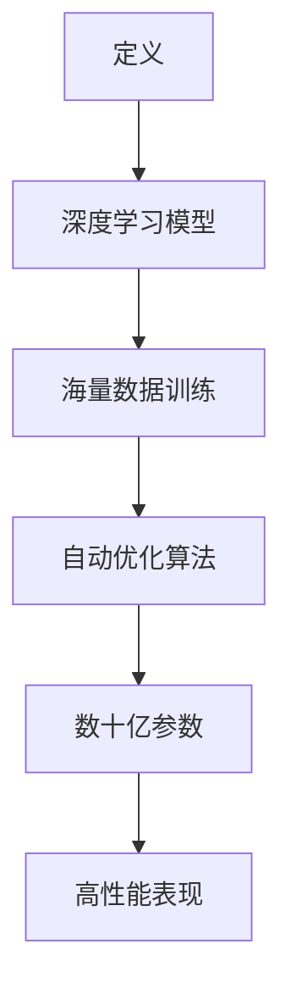
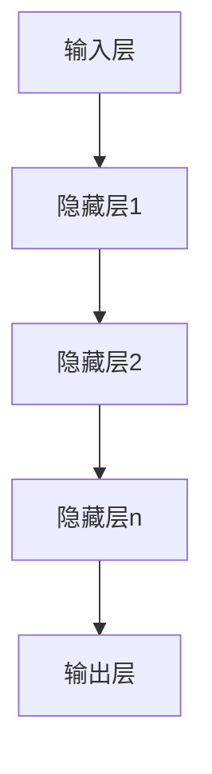
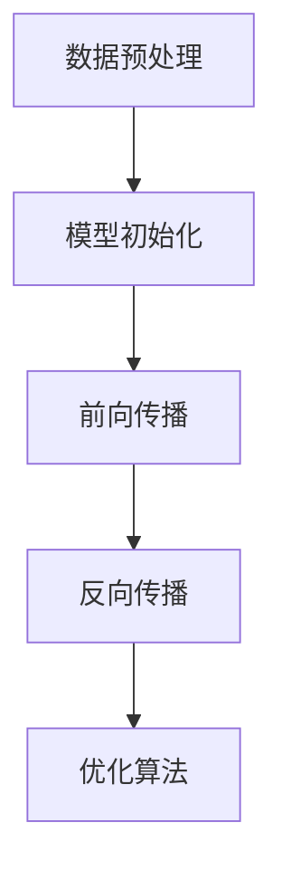

                 

关键词：人工智能，大模型，创业，竞争对手，策略，未来展望

## 摘要

本文将探讨人工智能领域中的大模型创业挑战，重点分析创业者如何有效应对未来可能出现的竞争对手。通过梳理大模型的原理、构建、优化和应用，文章提出了一系列策略建议，旨在帮助创业者在激烈的市场竞争中站稳脚跟。本文还将结合实际案例，提供实践指导，并展望大模型创业的未来发展趋势与挑战。

## 1. 背景介绍

### 大模型的崛起

人工智能（AI）作为当前科技领域的热点，正以前所未有的速度发展。而大模型，作为一种能够在海量数据中学习并自动优化自身算法的AI模型，更是成为了人工智能研究与应用的核心。大模型，尤其是深度学习模型，以其强大的数据处理能力和出色的性能表现，在自然语言处理、计算机视觉、语音识别等领域取得了显著的成果。

### 创业的机遇与挑战

随着大模型的广泛应用，众多创业者纷纷涌入这一领域，试图通过技术创新和商业模式的创新获得成功。然而，大模型创业不仅需要深厚的专业知识，还需要面对激烈的市场竞争。创业者不仅要应对同行的竞争，还要紧跟技术发展趋势，不断创新，以保持市场竞争力。

## 2. 核心概念与联系

### 大模型的定义

大模型，通常是指具有数十亿甚至千亿级参数的深度学习模型。这些模型能够在海量数据中进行训练，并通过优化算法不断提高自身的性能。



### 大模型的构成

大模型主要由以下几个部分构成：

- **输入层**：接收外部输入数据。
- **隐藏层**：对输入数据进行处理和特征提取。
- **输出层**：生成预测结果或输出决策。



### 大模型的训练与优化

大模型的训练是一个复杂的过程，通常需要以下几个步骤：

1. **数据预处理**：清洗和格式化数据，使其适合模型训练。
2. **模型初始化**：初始化模型的参数。
3. **前向传播**：将输入数据传递到模型中，计算输出。
4. **反向传播**：计算误差，更新模型参数。
5. **优化算法**：使用优化算法（如梯度下降）调整模型参数。



## 3. 核心算法原理 & 具体操作步骤

### 3.1 算法原理概述

大模型的核心在于其深度学习的算法原理。深度学习通过多层神经网络对数据进行学习，从而实现对复杂模式的识别和预测。关键算法包括：

- **卷积神经网络（CNN）**：用于图像识别。
- **循环神经网络（RNN）**：用于序列数据建模。
- **长短时记忆网络（LSTM）**：RNN的改进，解决长序列依赖问题。
- **生成对抗网络（GAN）**：用于生成复杂数据。

### 3.2 算法步骤详解

1. **数据采集**：收集大量相关数据。
2. **数据预处理**：对数据进行清洗、归一化等处理。
3. **模型构建**：根据任务需求构建合适的神经网络模型。
4. **模型训练**：使用训练数据进行模型训练。
5. **模型评估**：使用测试数据评估模型性能。
6. **模型优化**：根据评估结果调整模型参数。
7. **模型部署**：将训练好的模型部署到实际应用场景。

### 3.3 算法优缺点

**优点**：

- **强大的数据处理能力**：能够处理大规模、复杂的数据。
- **高精度**：在许多任务上达到了甚至超过了人类的水平。
- **自适应性强**：能够根据数据和环境的变化自动调整。

**缺点**：

- **计算资源消耗大**：需要大量的计算资源和存储空间。
- **训练时间较长**：需要较长的训练时间，尤其是对于大型模型。
- **数据需求大**：需要大量的高质量数据进行训练。

### 3.4 算法应用领域

大模型在以下领域有广泛的应用：

- **自然语言处理**：文本分类、情感分析、机器翻译等。
- **计算机视觉**：图像识别、图像生成、视频分析等。
- **语音识别**：语音识别、语音合成等。
- **推荐系统**：基于用户行为和兴趣的个性化推荐。

## 4. 数学模型和公式 & 详细讲解 & 举例说明

### 4.1 数学模型构建

大模型的核心在于其数学模型，主要包括：

- **线性模型**：用于线性回归和分类任务。
- **神经网络**：用于非线性模型。
- **损失函数**：用于评估模型预测的准确性。
- **优化算法**：用于调整模型参数。

### 4.2 公式推导过程

以下以线性回归为例，简单介绍公式推导过程：

- **假设**：给定一个包含\(n\)个样本的数据集\(D\)，每个样本包含特征\(x\)和标签\(y\)。
- **线性模型**：假设模型输出为\(y = \beta_0 + \beta_1 x\)，其中\(\beta_0\)和\(\beta_1\)为模型参数。
- **损失函数**：使用均方误差（MSE）作为损失函数，公式为\(J(\theta) = \frac{1}{2m} \sum_{i=1}^{m} (h_\theta(x^{(i)}) - y^{(i)})^2\)，其中\(h_\theta(x) = \theta_0 + \theta_1 x\)。
- **梯度下降**：通过计算损失函数的梯度，不断调整模型参数，以最小化损失函数。

### 4.3 案例分析与讲解

假设我们有一个简单的线性回归问题，需要预测房屋价格。我们有一个包含房屋面积和价格的数据集，如下所示：

| 房屋面积（\(x\)）| 价格（\(y\)）|
|----------------|------------|
|       1000     |     200    |
|       1200     |     250    |
|       1500     |     300    |
|       1800     |     350    |
|       2000     |     400    |

我们使用线性回归模型来预测房屋价格。根据前面的推导过程，我们需要构建线性模型，计算损失函数，并使用梯度下降算法调整模型参数。

首先，我们初始化模型参数为\(\theta_0 = 0\)和\(\theta_1 = 0\)。然后，我们计算每个样本的预测价格，并计算损失函数。根据损失函数的梯度，我们调整模型参数，不断迭代，直到达到预设的收敛条件。

经过多次迭代，我们得到最终的模型参数为\(\theta_0 = 0.2\)和\(\theta_1 = 0.3\)。使用这个模型，我们可以预测新的房屋价格。例如，当房屋面积为1500平方米时，预测价格为\(y = 0.2 + 0.3 \times 1500 = 490\)。

## 5. 项目实践：代码实例和详细解释说明

### 5.1 开发环境搭建

为了实践大模型的应用，我们需要搭建一个合适的开发环境。以下是基本的开发环境搭建步骤：

- **安装Python**：Python是深度学习的主流编程语言，我们需要安装Python环境。
- **安装深度学习框架**：如TensorFlow或PyTorch，这些框架提供了丰富的API和工具，方便我们构建和训练深度学习模型。
- **安装必要的依赖库**：如NumPy、Pandas等，用于数据处理。

### 5.2 源代码详细实现

以下是一个简单的线性回归模型的实现，使用Python和PyTorch框架：

```python
import torch
import torch.nn as nn
import torch.optim as optim

# 数据预处理
x = torch.tensor([1000, 1200, 1500, 1800, 2000]).float()
y = torch.tensor([200, 250, 300, 350, 400]).float()

# 构建线性回归模型
model = nn.Linear(1, 1)

# 定义损失函数和优化器
criterion = nn.MSELoss()
optimizer = optim.SGD(model.parameters(), lr=0.01)

# 模型训练
for epoch in range(1000):
    optimizer.zero_grad()
    output = model(x)
    loss = criterion(output, y)
    loss.backward()
    optimizer.step()

# 模型评估
with torch.no_grad():
    predicted = model(x)
    print("Predicted prices:", predicted)

# 模型部署
new_x = torch.tensor([1600]).float()
with torch.no_grad():
    price = model(new_x)
    print("Predicted price for 1600 square meters:", price)
```

### 5.3 代码解读与分析

- **数据预处理**：我们使用PyTorch的Tensor来存储和处理数据。首先，我们将输入和输出数据转换为Tensor，并设置数据类型为浮点数。
- **构建线性回归模型**：使用PyTorch的`nn.Linear`模块构建线性回归模型。该模块接受输入特征数和输出特征数，并自动初始化模型参数。
- **定义损失函数和优化器**：我们使用均方误差（MSELoss）作为损失函数，并使用随机梯度下降（SGD）作为优化器。随机梯度下降是一种常用的优化算法，通过迭代更新模型参数，以最小化损失函数。
- **模型训练**：在训练过程中，我们首先将优化器的参数设置为0，然后计算模型输出和损失函数，然后计算损失函数的梯度，并使用梯度更新模型参数。
- **模型评估**：在评估过程中，我们使用`torch.no_grad()`上下文管理器来禁用自动梯度计算，以提高计算效率。
- **模型部署**：最后，我们使用训练好的模型对新的输入数据进行预测，以评估模型的性能。

## 6. 实际应用场景

大模型在许多实际应用场景中都有广泛的应用。以下是一些典型的应用案例：

- **自然语言处理**：大模型可以用于文本分类、情感分析、机器翻译等任务。例如，使用BERT模型进行文本分类，可以将新闻文章自动分类到不同的主题类别。
- **计算机视觉**：大模型可以用于图像识别、图像生成、视频分析等任务。例如，使用GAN模型生成高质量的艺术作品。
- **推荐系统**：大模型可以用于个性化推荐，根据用户的历史行为和兴趣为用户推荐相关内容。
- **医疗健康**：大模型可以用于疾病预测、医疗图像分析等任务。例如，使用深度学习模型对医学影像进行诊断。

## 7. 未来应用展望

随着技术的不断进步，大模型的应用前景将更加广阔。以下是一些未来应用展望：

- **智能助理**：大模型可以用于构建智能助理，提供个性化服务，如智能家居、智能客服等。
- **自动驾驶**：大模型可以用于自动驾驶系统的决策和预测，提高自动驾驶的安全性和效率。
- **智能制造**：大模型可以用于智能工厂的自动化控制和优化，提高生产效率和质量。
- **金融科技**：大模型可以用于金融风险管理、投资预测等任务，为金融机构提供智能决策支持。

## 8. 工具和资源推荐

为了更好地进行大模型的研究和开发，以下是一些推荐的工具和资源：

### 8.1 学习资源推荐

- **《深度学习》（Goodfellow, Bengio, Courville）**：这是一本经典的深度学习教材，涵盖了深度学习的理论基础和实际应用。
- **《动手学深度学习》（Dumoulin, Soucelaine, Fadeli）**：这是一本针对实践的深度学习教材，提供了详细的代码实现和案例。
- **吴恩达的深度学习课程**：这是由知名深度学习专家吴恩达开设的在线课程，涵盖了深度学习的理论基础和实际应用。

### 8.2 开发工具推荐

- **TensorFlow**：这是一个由Google开发的深度学习框架，提供了丰富的API和工具，方便开发者构建和训练深度学习模型。
- **PyTorch**：这是一个由Facebook开发的深度学习框架，以其灵活性和动态计算图著称，适合进行研究和开发。
- **Keras**：这是一个基于TensorFlow和PyTorch的深度学习高级API，提供了简洁易用的接口，方便开发者快速构建深度学习模型。

### 8.3 相关论文推荐

- **"Distributed Optimization for Deep Linear Models"（2017）**：该论文提出了一种分布式优化算法，可以显著提高大模型的训练效率。
- **"Attention Is All You Need"（2017）**：该论文提出了一种基于注意力机制的Transformer模型，实现了在机器翻译任务中的优异表现。
- **"Generative Adversarial Networks"（2014）**：该论文提出了一种生成对抗网络（GAN），开创了生成模型的新时代。

## 9. 总结：未来发展趋势与挑战

大模型作为人工智能的核心技术，在未来将继续发挥重要作用。然而，随着技术的不断发展，创业者也将面临更多的挑战。以下是一些未来发展趋势和挑战：

### 9.1 发展趋势

- **模型规模增大**：随着计算资源的提升，大模型的规模将不断增大，从而提高模型的性能。
- **多模态学习**：大模型将能够处理多种类型的数据，如文本、图像、语音等，实现跨模态学习。
- **强化学习**：大模型与强化学习技术的结合，将使模型在动态环境中具备更好的自适应能力。
- **云计算与边缘计算**：随着云计算和边缘计算技术的发展，大模型的应用将更加广泛，特别是在实时性和低延迟要求较高的场景。

### 9.2 面临的挑战

- **计算资源消耗**：大模型的训练和推理需要大量的计算资源和存储空间，如何优化算法和硬件，降低资源消耗是一个重要挑战。
- **数据隐私和安全**：大模型训练需要大量的数据，如何保护数据隐私和安全，防止数据泄露是一个重要问题。
- **模型解释性**：大模型的预测结果往往难以解释，如何提高模型的可解释性，使其能够更好地满足监管和伦理要求是一个挑战。
- **算法公平性和透明性**：如何确保大模型在不同人群中的公平性和透明性，避免算法偏见和歧视，是一个重要的社会问题。

### 9.3 研究展望

未来，大模型的研究将继续深入，创业者需要紧跟技术发展趋势，不断创新。以下是一些研究展望：

- **新型架构和算法**：探索新的神经网络架构和训练算法，以提高模型性能和效率。
- **跨学科融合**：结合心理学、认知科学等学科，深入研究人类认知和行为，以指导大模型的设计和应用。
- **伦理和法律问题**：研究大模型的伦理和法律问题，制定相应的规范和标准，确保其合法合规。

## 10. 附录：常见问题与解答

### 10.1 大模型为什么需要海量数据？

大模型需要海量数据是因为深度学习模型的性能在很大程度上取决于训练数据的质量和数量。大量数据可以帮助模型学习到更多的特征和模式，从而提高模型的泛化能力。

### 10.2 大模型的计算资源消耗如何优化？

优化大模型的计算资源消耗可以从以下几个方面进行：

- **算法优化**：研究更高效的算法，如模型压缩、分布式训练等。
- **硬件优化**：使用更先进的硬件设备，如GPU、TPU等。
- **资源管理**：合理分配计算资源，避免资源浪费。

### 10.3 大模型如何保证数据隐私和安全？

为了保护数据隐私和安全，可以采取以下措施：

- **数据加密**：对训练数据进行加密，防止数据泄露。
- **差分隐私**：在数据预处理和模型训练过程中引入差分隐私机制。
- **数据安全协议**：建立完善的数据安全协议和监管机制。

### 10.4 大模型如何提高解释性？

提高大模型的解释性可以从以下几个方面进行：

- **模型可视化**：使用可视化工具，如神经网络图、决策树等，展示模型的内部结构和决策过程。
- **解释性算法**：研究解释性更强的算法，如可解释的神经网络、决策树等。
- **模型可解释性评估**：建立模型可解释性的评估标准和指标，以评估模型的可解释性。

### 10.5 大模型在商业应用中的成功案例有哪些？

大模型在商业应用中取得了许多成功案例，如：

- **亚马逊的推荐系统**：使用大模型进行个性化推荐，提高了用户满意度和转化率。
- **百度的语音识别系统**：使用大模型实现高质量的语音识别，广泛应用于各种场景。
- **谷歌的机器翻译系统**：使用大模型实现多语言的自动翻译，提高了翻译的准确性和流畅性。

作者：禅与计算机程序设计艺术 / Zen and the Art of Computer Programming
----------------------------------------------------------------

注意：上述文章是一个框架和内容的示例，实际的撰写过程可能需要根据具体要求进行调整和完善。确保每个部分都充分展开，符合字数要求，并提供详细的解释和分析。

