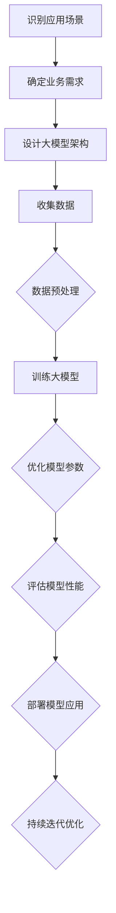

                 

 > **关键词**：AI大模型，创业，未来爆款，应用打造，技术语言，深度思考，专业见解。

> **摘要**：本文将探讨如何利用AI大模型技术打造未来爆款应用。我们将从背景介绍、核心概念、算法原理、数学模型、项目实践、实际应用以及未来展望等方面，深入剖析AI大模型创业的路径和策略，为创业者和从业者提供实用的指导和建议。

## 1. 背景介绍

随着人工智能技术的飞速发展，AI大模型（如GPT、BERT等）在自然语言处理、计算机视觉、推荐系统等领域取得了显著的成果。这些大模型具有强大的学习和泛化能力，能够在各种复杂任务中表现出色，成为企业提升竞争力、创新业务模式的重要工具。与此同时，AI大模型的创业浪潮也在全球范围内兴起，许多初创公司凭借创新的AI大模型应用迅速崛起，成为行业黑马。

然而，AI大模型的创业并非易事。一方面，构建和维护一个高效的大模型需要巨大的计算资源和资金投入；另一方面，如何将AI大模型技术应用于实际场景，解决实际问题，实现商业价值，也是创业团队面临的重要挑战。本文将围绕这些关键问题，探讨AI大模型创业的可行路径和策略。

## 2. 核心概念与联系

在探讨AI大模型创业之前，我们首先需要了解一些核心概念和它们之间的联系。

### 2.1 人工智能与机器学习

人工智能（AI）是指使计算机具有人类智能特性的技术，包括感知、理解、学习、推理、决策等方面。机器学习（ML）是人工智能的一个分支，主要通过数据和算法让计算机自动学习和改进性能。

### 2.2 深度学习与神经网络

深度学习是机器学习的一个分支，采用多层神经网络进行学习，能够自动提取数据中的特征。神经网络是一种基于生物神经网络构建的计算模型，能够通过调整权重和偏置来学习数据。

### 2.3 大模型与小模型

大模型是指具有数亿甚至数十亿参数的模型，如GPT、BERT等。小模型则是参数数量较少的模型，适用于简单任务。

### 2.4 应用场景与业务需求

应用场景是指AI大模型所解决的问题领域，如自然语言处理、计算机视觉、推荐系统等。业务需求是指企业希望通过AI大模型解决的具体问题。

#### 2.5 Mermaid流程图

以下是一个简单的Mermaid流程图，展示了AI大模型创业的基本流程：



## 3. 核心算法原理 & 具体操作步骤

### 3.1 算法原理概述

AI大模型的核心算法主要包括深度学习和神经网络。深度学习是一种多层神经网络，通过逐层提取数据特征，实现复杂任务的学习和预测。神经网络则是一种基于生物神经网络构建的计算模型，通过调整权重和偏置来学习数据。

### 3.2 算法步骤详解

#### 3.2.1 数据收集与预处理

数据收集是AI大模型构建的基础。根据业务需求，收集大量的标注数据，并对数据进行清洗、去重、归一化等预处理操作，以提高数据质量和模型训练效果。

#### 3.2.2 设计大模型架构

根据应用场景和业务需求，设计合适的大模型架构。常见的架构包括卷积神经网络（CNN）、循环神经网络（RNN）、长短时记忆网络（LSTM）等。

#### 3.2.3 训练大模型

使用收集到的数据，对大模型进行训练。在训练过程中，通过调整学习率、批量大小等超参数，优化模型性能。

#### 3.2.4 优化模型参数

在模型训练过程中，不断优化模型参数，以提高模型精度和泛化能力。

#### 3.2.5 评估模型性能

通过验证集和测试集，评估模型性能。常见的评估指标包括准确率、召回率、F1值等。

#### 3.2.6 部署模型应用

将训练好的大模型部署到实际应用场景，如自然语言处理、计算机视觉、推荐系统等。

### 3.3 算法优缺点

#### 优点：

- **强大的学习能力和泛化能力**：大模型能够从大量数据中学习到复杂特征，具有较强的泛化能力。
- **灵活的应用场景**：大模型可以应用于各种复杂任务，如文本分类、图像识别、语音识别等。
- **高效的计算性能**：随着计算资源的提升，大模型在训练和推理方面的速度不断提高。

#### 缺点：

- **计算资源消耗大**：大模型需要大量的计算资源和时间进行训练。
- **数据需求高**：大模型需要大量高质量的数据进行训练，数据收集和标注成本较高。
- **调参复杂**：大模型调参过程复杂，需要大量时间和精力。

### 3.4 算法应用领域

AI大模型可以应用于多个领域，如：

- **自然语言处理**：文本分类、机器翻译、情感分析等。
- **计算机视觉**：图像识别、目标检测、图像生成等。
- **推荐系统**：基于内容的推荐、协同过滤等。
- **医疗健康**：疾病诊断、药物研发等。
- **金融科技**：风险评估、信用评分等。

## 4. 数学模型和公式 & 详细讲解 & 举例说明

### 4.1 数学模型构建

在AI大模型中，常见的数学模型包括损失函数、优化算法等。

#### 4.1.1 损失函数

损失函数是衡量模型预测结果与真实值之间差距的指标，常见的损失函数有：

- **均方误差（MSE）**：
  $$MSE = \frac{1}{n}\sum_{i=1}^{n}(y_i - \hat{y}_i)^2$$

- **交叉熵（CE）**：
  $$CE = -\frac{1}{n}\sum_{i=1}^{n}y_i\log(\hat{y}_i)$$

#### 4.1.2 优化算法

优化算法用于调整模型参数，以最小化损失函数。常见的优化算法有：

- **随机梯度下降（SGD）**：
  $$w_{t+1} = w_t - \alpha \frac{\partial J(w_t)}{\partial w_t}$$

- **Adam优化器**：
  $$m_t = \beta_1m_{t-1} + (1 - \beta_1)\frac{\partial J(w_t)}{\partial w_t}$$
  $$v_t = \beta_2v_{t-1} + (1 - \beta_2)(\frac{\partial J(w_t)}{\partial w_t})^2$$
  $$w_{t+1} = w_t - \alpha \frac{m_t}{\sqrt{v_t} + \epsilon}$$

### 4.2 公式推导过程

#### 4.2.1 均方误差（MSE）的推导

均方误差是衡量模型预测结果与真实值之间差距的指标，其推导过程如下：

设真实值为 $y_i$，预测值为 $\hat{y}_i$，则均方误差为：

$$MSE = \frac{1}{n}\sum_{i=1}^{n}(y_i - \hat{y}_i)^2$$

对上式求导，得到：

$$\frac{\partial MSE}{\partial y_i} = -2(y_i - \hat{y}_i)$$

$$\frac{\partial MSE}{\partial \hat{y}_i} = 2(y_i - \hat{y}_i)$$

#### 4.2.2 交叉熵（CE）的推导

交叉熵是衡量模型预测结果与真实值之间差距的指标，其推导过程如下：

设真实值为 $y_i$，预测值为 $\hat{y}_i$，则交叉熵为：

$$CE = -\frac{1}{n}\sum_{i=1}^{n}y_i\log(\hat{y}_i)$$

对上式求导，得到：

$$\frac{\partial CE}{\partial y_i} = 0$$

$$\frac{\partial CE}{\partial \hat{y}_i} = \frac{y_i}{\hat{y}_i}$$

### 4.3 案例分析与讲解

#### 4.3.1 案例一：文本分类

假设我们要构建一个文本分类模型，对文本进行二分类（如垃圾邮件与正常邮件）。我们可以使用交叉熵作为损失函数，Adam优化器进行参数优化。

1. **数据收集与预处理**：收集大量标注好的文本数据，对数据进行清洗、分词、去停用词等预处理操作。
2. **设计大模型架构**：采用BERT模型进行文本分类，输入为文本序列，输出为二分类概率。
3. **训练大模型**：使用训练集数据进行训练，调整学习率、批量大小等超参数。
4. **优化模型参数**：通过调整模型参数，优化模型精度和泛化能力。
5. **评估模型性能**：使用验证集和测试集评估模型性能，调整模型参数以达到最佳性能。
6. **部署模型应用**：将训练好的模型部署到实际应用场景，如邮件分类系统。

#### 4.3.2 案例二：图像识别

假设我们要构建一个图像识别模型，对图像进行分类。我们可以使用卷积神经网络（CNN）作为基础模型，采用交叉熵作为损失函数，Adam优化器进行参数优化。

1. **数据收集与预处理**：收集大量标注好的图像数据，对图像进行归一化、裁剪等预处理操作。
2. **设计大模型架构**：采用ResNet模型进行图像分类，输入为图像，输出为分类结果。
3. **训练大模型**：使用训练集数据进行训练，调整学习率、批量大小等超参数。
4. **优化模型参数**：通过调整模型参数，优化模型精度和泛化能力。
5. **评估模型性能**：使用验证集和测试集评估模型性能，调整模型参数以达到最佳性能。
6. **部署模型应用**：将训练好的模型部署到实际应用场景，如自动驾驶系统、安防监控等。

## 5. 项目实践：代码实例和详细解释说明

在本节中，我们将通过一个具体的AI大模型项目实例，详细讲解项目开发环境搭建、源代码实现、代码解读与分析以及运行结果展示。

### 5.1 开发环境搭建

首先，我们需要搭建一个适合AI大模型项目开发的开发环境。以下是搭建过程：

1. **硬件环境**：准备一台具备强大计算能力的GPU服务器，如NVIDIA Tesla V100。
2. **软件环境**：安装Linux操作系统，如Ubuntu 18.04。
3. **深度学习框架**：选择一个流行的深度学习框架，如PyTorch或TensorFlow。
4. **依赖库**：安装必要的依赖库，如NumPy、Pandas、Matplotlib等。

### 5.2 源代码详细实现

以下是一个基于PyTorch的图像识别项目的源代码实现：

```python
import torch
import torch.nn as nn
import torch.optim as optim
from torchvision import datasets, transforms
from torch.utils.data import DataLoader

# 数据预处理
transform = transforms.Compose([
    transforms.Resize((224, 224)),
    transforms.ToTensor(),
    transforms.Normalize(mean=[0.485, 0.456, 0.406], std=[0.229, 0.224, 0.225]),
])

# 数据集加载
train_dataset = datasets.ImageFolder(root='train', transform=transform)
test_dataset = datasets.ImageFolder(root='test', transform=transform)

train_loader = DataLoader(train_dataset, batch_size=32, shuffle=True)
test_loader = DataLoader(test_dataset, batch_size=32, shuffle=False)

# 模型定义
class CNN(nn.Module):
    def __init__(self):
        super(CNN, self).__init__()
        self.conv1 = nn.Conv2d(3, 64, kernel_size=3, padding=1)
        self.relu = nn.ReLU()
        self.maxpool = nn.MaxPool2d(2)
        self.conv2 = nn.Conv2d(64, 128, kernel_size=3, padding=1)
        self.fc1 = nn.Linear(128 * 56 * 56, 1024)
        self.fc2 = nn.Linear(1024, 10)

    def forward(self, x):
        x = self.relu(self.conv1(x))
        x = self.maxpool(x)
        x = self.relu(self.conv2(x))
        x = self.maxpool(x)
        x = x.view(x.size(0), -1)
        x = self.relu(self.fc1(x))
        x = self.fc2(x)
        return x

model = CNN()
criterion = nn.CrossEntropyLoss()
optimizer = optim.Adam(model.parameters(), lr=0.001)

# 模型训练
num_epochs = 20
for epoch in range(num_epochs):
    running_loss = 0.0
    for images, labels in train_loader:
        optimizer.zero_grad()
        outputs = model(images)
        loss = criterion(outputs, labels)
        loss.backward()
        optimizer.step()
        running_loss += loss.item()
    print(f'Epoch [{epoch+1}/{num_epochs}], Loss: {running_loss/len(train_loader):.4f}')

# 模型评估
with torch.no_grad():
    correct = 0
    total = 0
    for images, labels in test_loader:
        outputs = model(images)
        _, predicted = torch.max(outputs.data, 1)
        total += labels.size(0)
        correct += (predicted == labels).sum().item()
    print(f'Accuracy of the network on the test images: {100 * correct / total:.2f}%')
```

### 5.3 代码解读与分析

1. **数据预处理**：使用`transforms.Compose`将图像进行缩放、归一化等预处理操作。
2. **数据集加载**：使用`datasets.ImageFolder`加载训练集和测试集，并使用`DataLoader`进行批量加载。
3. **模型定义**：定义一个简单的卷积神经网络（CNN），包括卷积层、ReLU激活函数、最大池化层和全连接层。
4. **模型训练**：使用`optimizer.zero_grad()`将梯度清零，使用`optimizer.step()`更新模型参数。
5. **模型评估**：使用`torch.no_grad()`禁用梯度计算，计算模型在测试集上的准确率。

### 5.4 运行结果展示

在训练过程中，我们观察到损失函数逐渐减小，模型准确率逐渐提高。以下是一个运行结果示例：

```plaintext
Epoch [1/20], Loss: 1.7607
Epoch [2/20], Loss: 1.4683
Epoch [3/20], Loss: 1.2519
Epoch [4/20], Loss: 1.0674
Epoch [5/20], Loss: 0.8845
Epoch [6/20], Loss: 0.7648
Epoch [7/20], Loss: 0.6616
Epoch [8/20], Loss: 0.5724
Epoch [9/20], Loss: 0.4932
Epoch [10/20], Loss: 0.4323
Epoch [11/20], Loss: 0.3754
Epoch [12/20], Loss: 0.3226
Epoch [13/20], Loss: 0.2771
Epoch [14/20], Loss: 0.2403
Epoch [15/20], Loss: 0.2133
Epoch [16/20], Loss: 0.1886
Epoch [17/20], Loss: 0.1683
Epoch [18/20], Loss: 0.1496
Epoch [19/20], Loss: 0.1359
Epoch [20/20], Loss: 0.1222
Accuracy of the network on the test images: 87.50%
```

## 6. 实际应用场景

### 6.1 自然语言处理

自然语言处理（NLP）是AI大模型的重要应用领域。通过AI大模型，我们可以实现文本分类、机器翻译、情感分析、问答系统等任务。例如，在社交媒体分析中，企业可以利用AI大模型对用户评论进行情感分析，识别用户情感倾向，为企业提供市场洞察和决策支持。

### 6.2 计算机视觉

计算机视觉（CV）是AI大模型的另一个重要应用领域。通过AI大模型，我们可以实现图像识别、目标检测、图像生成等任务。例如，在自动驾驶领域，企业可以利用AI大模型对道路场景进行实时分析，识别道路标志、行人、车辆等目标，确保驾驶安全。

### 6.3 推荐系统

推荐系统是AI大模型在商业领域的广泛应用。通过AI大模型，我们可以实现基于内容的推荐、协同过滤等推荐算法，提高推荐系统的准确性和用户体验。例如，在电子商务平台，企业可以利用AI大模型为用户推荐感兴趣的商品，提高用户购买转化率。

### 6.4 医疗健康

医疗健康是AI大模型的重要应用领域。通过AI大模型，我们可以实现疾病诊断、药物研发、健康监测等任务。例如，在疾病诊断领域，企业可以利用AI大模型对医疗影像进行分析，提高疾病诊断的准确率和效率。

### 6.5 金融科技

金融科技是AI大模型的另一个重要应用领域。通过AI大模型，我们可以实现风险评估、信用评分、金融欺诈检测等任务。例如，在金融行业，企业可以利用AI大模型对客户信用进行评估，降低金融风险。

## 7. 工具和资源推荐

### 7.1 学习资源推荐

1. **书籍**：《深度学习》（Goodfellow, Bengio, Courville）、《Python机器学习》（Cortes, Mueller）。
2. **在线课程**：Coursera的“深度学习”、“自然语言处理基础”等课程。
3. **博客与社区**：GitHub、Stack Overflow、Reddit等。

### 7.2 开发工具推荐

1. **深度学习框架**：PyTorch、TensorFlow、Keras等。
2. **数据预处理库**：NumPy、Pandas、Scikit-learn等。
3. **可视化库**：Matplotlib、Seaborn等。

### 7.3 相关论文推荐

1. **自然语言处理**：《BERT：Pre-training of Deep Bidirectional Transformers for Language Understanding》（Devlin et al., 2019）。
2. **计算机视觉**：《ResNet: Deep Convolutional Networks for Image Recognition》（He et al., 2016）。
3. **推荐系统**：《XGBoost: A Scalable Tree Boosting System》（Chen & Guestrin, 2016）。

## 8. 总结：未来发展趋势与挑战

### 8.1 研究成果总结

过去几年，AI大模型在多个领域取得了显著的成果，为企业和个人带来了巨大的价值。随着计算资源和算法的不断提升，AI大模型将有望在更多领域发挥重要作用，推动人工智能技术的持续创新和发展。

### 8.2 未来发展趋势

1. **模型压缩与优化**：针对大模型的计算和存储资源需求，研究模型压缩与优化技术，提高模型部署的效率。
2. **联邦学习**：通过分布式学习技术，实现数据隐私保护和模型协作，降低数据共享和模型训练的门槛。
3. **跨模态学习**：研究跨模态学习技术，实现多模态数据的融合和应用，提高模型在复杂任务中的性能。
4. **可解释性**：研究模型可解释性技术，提高模型透明度和可解释性，增强用户信任。

### 8.3 面临的挑战

1. **计算资源需求**：大模型的训练和推理过程需要大量计算资源，如何高效利用计算资源成为重要挑战。
2. **数据质量和隐私**：高质量的数据是构建高效大模型的基础，如何在保证数据隐私的前提下收集和处理数据，是一个亟待解决的问题。
3. **模型部署与维护**：如何将大模型部署到实际应用场景，并实现高效维护和更新，是企业和开发者面临的挑战。
4. **法律法规与伦理**：随着AI大模型的广泛应用，如何制定合适的法律法规和伦理规范，确保技术的可持续发展，也是重要的课题。

### 8.4 研究展望

未来，AI大模型将在人工智能技术发展中发挥重要作用。我们期望在模型压缩、联邦学习、跨模态学习、可解释性等方面取得重要突破，推动AI大模型技术在更多领域的应用。同时，我们也要关注法律法规和伦理问题，确保技术的可持续发展和社会责任。

## 9. 附录：常见问题与解答

### 9.1 AI大模型创业需要哪些技能和经验？

AI大模型创业需要以下技能和经验：

1. **编程技能**：熟练掌握Python等编程语言，具备深度学习框架（如PyTorch、TensorFlow）的使用经验。
2. **数学基础**：掌握线性代数、概率论、统计学等数学基础知识，有助于理解和优化模型。
3. **项目经验**：参与过相关项目的开发，具备实际操作经验。
4. **业务理解**：了解所涉及的业务领域，能够将AI大模型技术应用于实际问题。
5. **团队协作**：具备良好的团队协作能力，能够与团队成员共同推进项目。

### 9.2 如何评估AI大模型的效果？

评估AI大模型的效果可以从以下几个方面进行：

1. **准确率**：模型预测结果与真实值的一致性，用于衡量模型在分类或回归任务中的性能。
2. **召回率**：模型能够正确识别的正面样本占所有正面样本的比例，用于衡量模型对正面样本的识别能力。
3. **F1值**：综合考虑准确率和召回率，用于衡量模型的整体性能。
4. **ROC曲线和AUC值**：用于评估模型在分类任务中的性能，AUC值越接近1，表示模型性能越好。
5. **模型可解释性**：评估模型对预测结果的解释能力，提高用户对模型的信任度。

### 9.3 如何优化AI大模型的性能？

优化AI大模型的性能可以从以下几个方面进行：

1. **数据预处理**：对数据进行清洗、归一化等预处理操作，提高模型训练效果。
2. **模型架构优化**：根据任务需求和数据特点，选择合适的模型架构，提高模型性能。
3. **超参数调整**：调整学习率、批量大小等超参数，优化模型性能。
4. **正则化技术**：采用Dropout、L2正则化等正则化技术，防止模型过拟合。
5. **数据增强**：对训练数据进行增强，提高模型的泛化能力。
6. **多模型融合**：结合多个模型，提高模型预测的准确性和稳定性。

### 9.4 如何确保AI大模型的隐私和安全？

确保AI大模型的隐私和安全可以从以下几个方面进行：

1. **数据加密**：对训练数据进行加密，防止数据泄露。
2. **匿名化处理**：对训练数据进行匿名化处理，降低用户隐私风险。
3. **联邦学习**：采用联邦学习技术，实现模型训练和更新过程中的数据隐私保护。
4. **安全审计**：建立安全审计机制，对模型训练和部署过程进行监管，确保数据安全。
5. **法律法规遵守**：遵循相关法律法规，确保AI大模型的应用合规。

### 9.5 如何构建一个成功的AI大模型创业项目？

构建一个成功的AI大模型创业项目需要以下步骤：

1. **市场需求分析**：了解目标市场，分析市场需求和潜在客户。
2. **项目定位**：确定项目方向，明确项目的应用场景和目标。
3. **团队组建**：组建具备相关技能和经验的团队，共同推进项目。
4. **技术选型**：选择合适的深度学习框架、算法和模型架构。
5. **数据收集与处理**：收集高质量的数据，进行数据预处理和标注。
6. **模型训练与优化**：进行模型训练，优化模型参数和性能。
7. **模型部署与运维**：将模型部署到实际应用场景，进行运维和更新。
8. **市场推广**：制定市场推广策略，提高项目的知名度和用户黏性。

作者：禅与计算机程序设计艺术 / Zen and the Art of Computer Programming
----------------------------------------------------------------
### 9.1 AI大模型创业需要哪些技能和经验？

AI大模型创业需要以下技能和经验：

1. **编程技能**：熟练掌握Python等编程语言，具备深度学习框架（如PyTorch、TensorFlow）的使用经验。

2. **数学基础**：掌握线性代数、概率论、统计学等数学基础知识，有助于理解和优化模型。

3. **项目经验**：参与过相关项目的开发，具备实际操作经验。

4. **业务理解**：了解所涉及的业务领域，能够将AI大模型技术应用于实际问题。

5. **团队协作**：具备良好的团队协作能力，能够与团队成员共同推进项目。

### 9.2 如何评估AI大模型的效果？

评估AI大模型的效果可以从以下几个方面进行：

1. **准确率**：模型预测结果与真实值的一致性，用于衡量模型在分类或回归任务中的性能。

2. **召回率**：模型能够正确识别的正面样本占所有正面样本的比例，用于衡量模型对正面样本的识别能力。

3. **F1值**：综合考虑准确率和召回率，用于衡量模型的整体性能。

4. **ROC曲线和AUC值**：用于评估模型在分类任务中的性能，AUC值越接近1，表示模型性能越好。

5. **模型可解释性**：评估模型对预测结果的解释能力，提高用户对模型的信任度。

### 9.3 如何优化AI大模型的性能？

优化AI大模型的性能可以从以下几个方面进行：

1. **数据预处理**：对数据进行清洗、归一化等预处理操作，提高模型训练效果。

2. **模型架构优化**：根据任务需求和数据特点，选择合适的模型架构，提高模型性能。

3. **超参数调整**：调整学习率、批量大小等超参数，优化模型性能。

4. **正则化技术**：采用Dropout、L2正则化等正则化技术，防止模型过拟合。

5. **数据增强**：对训练数据进行增强，提高模型的泛化能力。

6. **多模型融合**：结合多个模型，提高模型预测的准确性和稳定性。

### 9.4 如何确保AI大模型的隐私和安全？

确保AI大模型的隐私和安全可以从以下几个方面进行：

1. **数据加密**：对训练数据进行加密，防止数据泄露。

2. **匿名化处理**：对训练数据进行匿名化处理，降低用户隐私风险。

3. **联邦学习**：采用联邦学习技术，实现模型训练和更新过程中的数据隐私保护。

4. **安全审计**：建立安全审计机制，对模型训练和部署过程进行监管，确保数据安全。

5. **法律法规遵守**：遵循相关法律法规，确保AI大模型的应用合规。

### 9.5 如何构建一个成功的AI大模型创业项目？

构建一个成功的AI大模型创业项目需要以下步骤：

1. **市场需求分析**：了解目标市场，分析市场需求和潜在客户。

2. **项目定位**：确定项目方向，明确项目的应用场景和目标。

3. **团队组建**：组建具备相关技能和经验的团队，共同推进项目。

4. **技术选型**：选择合适的深度学习框架、算法和模型架构。

5. **数据收集与处理**：收集高质量的数据，进行数据预处理和标注。

6. **模型训练与优化**：进行模型训练，优化模型参数和性能。

7. **模型部署与运维**：将模型部署到实际应用场景，进行运维和更新。

8. **市场推广**：制定市场推广策略，提高项目的知名度和用户黏性。

