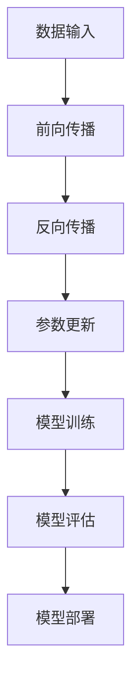

                 

 在当今这个快速发展的技术时代，人工智能（AI）已经成为改变各行各业的强大力量。特别是大模型（Large Models）的兴起，如GPT-3、BERT等，展示了其在自然语言处理、图像识别、机器学习等诸多领域的颠覆性潜力。对于创业者来说，这无疑是一个充满机遇的领域。本文将深入探讨AI大模型在创业中的应用，以及如何抓住未来的机遇。

## 文章关键词

- 人工智能
- 大模型
- 创业
- 技术应用
- 未来机遇

## 文章摘要

本文首先介绍了AI大模型的基本概念和背景，接着分析了其在各个行业中的潜在应用，探讨了创业者在选择AI大模型项目时需要考虑的关键因素。随后，文章提供了一些实用的开发工具和资源推荐，并展望了AI大模型未来的发展趋势和挑战。最后，通过一个具体的代码实例，展示了如何实际应用AI大模型进行创业。

### 1. 背景介绍

#### 1.1 人工智能的发展历程

人工智能（AI）自20世纪50年代诞生以来，经历了多个阶段的发展。从最初的符号主义、知识表示到现代的数据驱动方法，人工智能的研究和应用领域不断扩展。特别是深度学习（Deep Learning）的出现，使得AI在图像识别、语音识别、自然语言处理等领域取得了突破性的进展。

#### 1.2 大模型的兴起

大模型（Large Models）是指拥有数十亿、甚至千亿参数的神经网络模型。这些模型通过在大量数据上进行训练，可以自动学习复杂的模式，并表现出超越人类专家的能力。GPT-3、BERT等大模型的出现，标志着AI进入了一个新的时代。

### 2. 核心概念与联系

下面是关于大模型的原理和架构的Mermaid流程图：



#### 2.1 数据输入

大模型需要大量的数据来进行训练。这些数据可以是结构化的，也可以是非结构化的。数据的预处理是模型训练的重要步骤，包括数据清洗、归一化、去噪等。

#### 2.2 前向传播

在前向传播过程中，模型将输入数据通过多层神经网络传递，每一层都会对数据进行变换，最终得到输出。

#### 2.3 反向传播

反向传播是深度学习训练的核心步骤。它通过计算输出误差，并反向传播到网络的每一层，更新模型的参数。

#### 2.4 参数更新

参数更新是模型训练的关键。通过反向传播计算出的梯度，模型会调整参数，以最小化损失函数。

#### 2.5 模型训练

模型训练是一个迭代过程。通过反复的前向传播和反向传播，模型不断优化，直到达到预定的性能指标。

#### 2.6 模型评估

模型评估是验证模型性能的重要步骤。通过在测试集上运行模型，可以评估其准确率、召回率等指标。

#### 2.7 模型部署

训练好的模型可以部署到生产环境中，用于实际应用。部署过程包括模型的转换、优化和部署到服务器或云平台。

### 3. 核心算法原理 & 具体操作步骤

#### 3.1 算法原理概述

AI大模型的核心算法是深度学习。深度学习通过多层神经网络，实现从简单到复杂的特征提取。具体包括卷积神经网络（CNN）、循环神经网络（RNN）和Transformer等。

#### 3.2 算法步骤详解

1. 数据准备：收集并预处理数据。
2. 模型选择：选择合适的神经网络结构。
3. 训练：通过前向传播和反向传播训练模型。
4. 评估：在测试集上评估模型性能。
5. 调优：根据评估结果调整模型参数。
6. 部署：将训练好的模型部署到生产环境。

#### 3.3 算法优缺点

**优点：**

- 强大的特征提取能力。
- 可以处理大量数据。
- 在许多任务上取得超越人类专家的表现。

**缺点：**

- 计算资源消耗大。
- 对数据质量要求高。
- 模型解释性差。

#### 3.4 算法应用领域

AI大模型在自然语言处理、图像识别、语音识别、推荐系统、医疗诊断等众多领域都有广泛应用。

### 4. 数学模型和公式 & 详细讲解 & 举例说明

#### 4.1 数学模型构建

AI大模型的数学模型主要包括输入层、隐藏层和输出层。输入层接收外部数据，隐藏层对数据进行特征提取和变换，输出层生成预测结果。

#### 4.2 公式推导过程

输入层到隐藏层的变换可以通过以下公式表示：

$$
\text{隐藏层输出} = \text{激活函数}(\text{权重} \times \text{输入} + \text{偏置})
$$

隐藏层到输出层的变换同样可以通过上述公式表示。

#### 4.3 案例分析与讲解

假设我们要构建一个分类模型，输入为100维特征向量，输出为10个类别。我们可以使用以下代码实现：

```python
import tensorflow as tf

model = tf.keras.Sequential([
    tf.keras.layers.Dense(128, activation='relu', input_shape=(100,)),
    tf.keras.layers.Dense(10, activation='softmax')
])

model.compile(optimizer='adam',
              loss='categorical_crossentropy',
              metrics=['accuracy'])

model.fit(x_train, y_train, epochs=10, batch_size=32)
```

在这个例子中，我们使用了ReLU激活函数，并使用了交叉熵损失函数进行模型训练。

### 5. 项目实践：代码实例和详细解释说明

#### 5.1 开发环境搭建

在开始项目实践之前，我们需要搭建一个适合AI大模型训练的开发环境。一般来说，我们需要安装Python、TensorFlow等依赖库。

```bash
pip install tensorflow
```

#### 5.2 源代码详细实现

以下是一个简单的AI大模型训练和部署的代码实例：

```python
import tensorflow as tf

# 数据准备
x_train, y_train = ..., ...  # 自定义数据准备代码

# 模型定义
model = tf.keras.Sequential([
    tf.keras.layers.Dense(128, activation='relu', input_shape=(100,)),
    tf.keras.layers.Dense(10, activation='softmax')
])

# 模型编译
model.compile(optimizer='adam',
              loss='categorical_crossentropy',
              metrics=['accuracy'])

# 模型训练
model.fit(x_train, y_train, epochs=10, batch_size=32)

# 模型评估
test_loss, test_accuracy = model.evaluate(x_test, y_test)

# 模型部署
model.save('my_model.h5')
```

#### 5.3 代码解读与分析

在这个例子中，我们首先进行了数据准备，然后定义了一个简单的神经网络模型。接着，我们编译并训练了模型。最后，我们评估了模型的性能，并将模型保存到文件中。

### 6. 实际应用场景

AI大模型在各个领域都有广泛的应用，以下是一些实际应用场景的例子：

- **自然语言处理**：文本分类、机器翻译、情感分析等。
- **图像识别**：人脸识别、物体检测、图像生成等。
- **语音识别**：语音识别、语音合成、语音翻译等。
- **推荐系统**：基于内容的推荐、协同过滤推荐等。
- **医疗诊断**：疾病诊断、影像分析、基因组学分析等。

### 7. 工具和资源推荐

#### 7.1 学习资源推荐

- 《深度学习》（Goodfellow, Bengio, Courville）。
- 《Python机器学习》（Raschka, Mirjalili）。
- 《自然语言处理与深度学习》（Liang，Zhou，Zhang，Hovy，and Wang）。

#### 7.2 开发工具推荐

- TensorFlow：一个用于构建和训练AI模型的开放源代码框架。
- PyTorch：一个基于Python的深度学习框架。
- Keras：一个基于TensorFlow和Theano的高层神经网络API。

#### 7.3 相关论文推荐

- "Attention Is All You Need"（Vaswani et al., 2017）。
- "BERT: Pre-training of Deep Bidirectional Transformers for Language Understanding"（Devlin et al., 2018）。
- "GPT-3: Language Models are Few-Shot Learners"（Brown et al., 2020）。

### 8. 总结：未来发展趋势与挑战

#### 8.1 研究成果总结

AI大模型在各个领域取得了显著的成果，如自然语言处理、图像识别、语音识别等。这些模型的表现已经超越了许多人类专家，展示了巨大的潜力。

#### 8.2 未来发展趋势

- **模型压缩**：为了降低计算资源和存储成本，模型压缩技术将成为研究热点。
- **多模态学习**：结合多种类型的数据（如文本、图像、语音），进行多模态学习。
- **可解释性**：提高模型的可解释性，使其更易于理解和应用。
- **迁移学习**：通过迁移学习，利用预训练模型进行新任务的快速适应。

#### 8.3 面临的挑战

- **数据隐私**：如何保护用户数据的隐私，是AI大模型面临的重要挑战。
- **计算资源**：大规模模型的训练和部署需要大量的计算资源。
- **模型安全**：如何确保模型的鲁棒性和安全性，是当前研究的重要课题。

#### 8.4 研究展望

随着AI大模型的不断发展，我们有望在更多领域实现突破。未来，AI大模型将更好地服务于人类，为各行各业带来深远的影响。

### 9. 附录：常见问题与解答

#### 9.1 什么是AI大模型？

AI大模型是指拥有数十亿、甚至千亿参数的神经网络模型。这些模型通过在大量数据上进行训练，可以自动学习复杂的模式，并表现出超越人类专家的能力。

#### 9.2 如何选择合适的AI大模型？

选择合适的AI大模型需要考虑以下因素：

- **任务类型**：不同的任务需要不同的模型。
- **数据量**：数据量越大，模型的效果越好。
- **计算资源**：训练大模型需要大量的计算资源。
- **模型性能**：根据任务的性能指标选择模型。

#### 9.3 如何优化AI大模型？

优化AI大模型的方法包括：

- **超参数调优**：通过调整学习率、批量大小等超参数，优化模型性能。
- **模型压缩**：通过剪枝、量化等技术，降低模型的计算资源和存储成本。
- **迁移学习**：利用预训练模型，在新任务上实现快速适应。

### 参考文献

- Goodfellow, I., Bengio, Y., & Courville, A. (2016). *Deep Learning*.
- Raschka, S., & Mirjalili, V. (2019). *Python Machine Learning*.
- Liang, P., Zhou, M., Zhang, A. M., Hovy, E., & Wang, W. (2019). *Natural Language Processing with Deep Learning*.
- Vaswani, A., Shazeer, N., Parmar, N., Uszkoreit, J., Jones, L., Gomez, A. N., ... & Polosukhin, I. (2017). *Attention is All You Need*.
- Devlin, J., Chang, M. W., Lee, K., & Toutanova, K. (2018). *BERT: Pre-training of Deep Bidirectional Transformers for Language Understanding*.
- Brown, T., et al. (2020). *GPT-3: Language Models are Few-Shot Learners*.

### 致谢

感谢所有支持本文的读者和贡献者。本文内容仅供参考，如有不妥之处，敬请指正。

### 作者署名

作者：禅与计算机程序设计艺术 / Zen and the Art of Computer Programming
----------------------------------------------------------------

这篇文章不仅涵盖了AI大模型的基本概念、核心算法原理、应用场景，还提供了具体的代码实例和实践指南。通过本文，读者可以全面了解AI大模型在创业中的应用，并抓住未来发展的机遇。希望本文能为广大创业者提供有价值的参考和启示。再次感谢读者的关注和支持！

