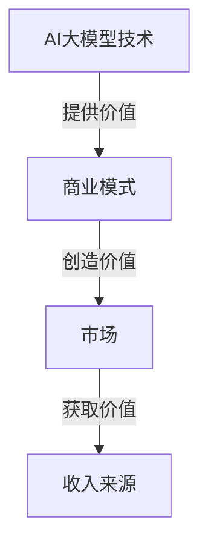

                 

关键词：人工智能、大模型、商业模式、创业、可持续发展

> 摘要：本文将探讨人工智能大模型在创业领域的应用，从技术、市场、商业模式等多角度分析其发展前景，并分享如何构建一个未来可持续的商业模式。

## 1. 背景介绍

随着计算能力的提升和数据资源的丰富，人工智能（AI）技术取得了前所未有的突破。特别是大模型（Large Models）的兴起，如GPT、BERT等，使得AI在语言理解、生成、推理等方面的能力得到了显著提升。这些技术突破为创业公司提供了新的机会，同时也带来了新的挑战。

创业公司需要利用AI大模型的能力，找到市场需求，构建可持续的商业模式。然而，如何在竞争激烈的市场中脱颖而出，如何在商业模式上实现可持续发展，是每个创业者都必须面对的问题。

## 2. 核心概念与联系

为了更好地理解AI大模型在创业中的应用，我们首先需要了解几个核心概念。

### 2.1 人工智能

人工智能是指由人制造出来的系统能够执行通常需要人类智能才能完成的任务。它包括机器学习、深度学习、自然语言处理、计算机视觉等多个子领域。

### 2.2 大模型

大模型是指参数数量达到数百万甚至数十亿级别的人工神经网络模型。这些模型能够从大量数据中学习，并且具有强大的表征能力和推理能力。

### 2.3 商业模式

商业模式是指企业如何创造、传递和获取价值的方式。它包括收入来源、成本结构、客户群体等多个方面。

在创业过程中，AI大模型与商业模式的关系如下图所示：



### 2.4 可持续发展

可持续发展是指企业在满足当前需求的同时，不损害后代满足其需求的能力。在商业模式中，可持续发展意味着企业能够在长期内实现盈利和增长。

## 3. 核心算法原理 & 具体操作步骤

### 3.1 算法原理概述

AI大模型的核心是基于深度学习的神经网络。深度学习通过多层神经元的堆叠，能够自动提取数据的复杂特征，并用于预测、分类、生成等任务。

AI大模型的工作流程主要包括以下几个步骤：

1. 数据预处理：对数据进行清洗、归一化等处理，使其适合模型训练。
2. 模型训练：使用训练数据对模型进行训练，通过反向传播算法不断调整模型参数，使模型能够预测或生成目标输出。
3. 模型评估：使用验证数据评估模型的性能，调整模型参数以达到最佳效果。
4. 模型部署：将训练好的模型部署到生产环境中，用于实际应用。

### 3.2 算法步骤详解

#### 3.2.1 数据预处理

数据预处理是AI大模型训练的第一步，其目的是将原始数据转换成适合模型训练的形式。

主要步骤包括：

1. 数据清洗：去除异常值、缺失值等，保证数据的准确性和一致性。
2. 数据归一化：将不同特征的数据缩放到相同的尺度，以避免某些特征对模型训练的影响过大。
3. 数据分割：将数据分为训练集、验证集和测试集，用于模型训练、验证和评估。

#### 3.2.2 模型训练

模型训练是AI大模型的核心步骤，其目的是通过学习数据中的特征，构建出一个能够对未知数据进行预测或生成的模型。

主要步骤包括：

1. 确定模型架构：选择合适的神经网络架构，如卷积神经网络（CNN）、循环神经网络（RNN）等。
2. 初始化模型参数：随机初始化模型参数。
3. 前向传播：将输入数据传递到神经网络中，得到输出预测结果。
4. 反向传播：根据预测结果与真实值的差异，计算损失函数，并通过反向传播算法更新模型参数。
5. 调整学习率：在训练过程中，逐步减小学习率，以提高模型的收敛速度和效果。

#### 3.2.3 模型评估

模型评估是判断模型性能的重要步骤，其目的是确定模型是否能够满足应用需求。

主要步骤包括：

1. 验证集评估：在验证集上评估模型性能，调整模型参数以达到最佳效果。
2. 测试集评估：在测试集上评估模型性能，以评估模型的泛化能力。

#### 3.2.4 模型部署

模型部署是将训练好的模型部署到生产环境中，用于实际应用。

主要步骤包括：

1. 部署环境搭建：搭建适合模型部署的环境，包括硬件、软件等。
2. 模型加载：从训练环境中加载训练好的模型。
3. 预测与生成：使用模型对输入数据进行预测或生成，并提供给用户。

### 3.3 算法优缺点

#### 优点：

1. 强大的表征能力：AI大模型能够从大量数据中自动提取复杂特征，提高模型性能。
2. 高效的推理能力：AI大模型能够在较短的时间内处理大量数据，提高应用效率。
3. 广泛的应用领域：AI大模型可以应用于自然语言处理、计算机视觉、推荐系统等多个领域。

#### 缺点：

1. 高昂的训练成本：AI大模型需要大量的计算资源和数据资源，训练成本较高。
2. 数据依赖性：AI大模型对数据质量有较高要求，数据质量不佳可能导致模型性能下降。
3. 黑盒性：AI大模型的内部结构复杂，难以解释，导致用户对其信任度降低。

### 3.4 算法应用领域

AI大模型在多个领域具有广泛的应用前景，如：

1. 自然语言处理：包括机器翻译、文本分类、情感分析等。
2. 计算机视觉：包括图像分类、目标检测、图像生成等。
3. 推荐系统：包括商品推荐、内容推荐等。
4. 机器人：包括智能客服、自动驾驶等。

## 4. 数学模型和公式 & 详细讲解 & 举例说明

### 4.1 数学模型构建

AI大模型的核心是基于深度学习的人工神经网络。神经网络由多个神经元组成，每个神经元都可以看作是一个简单的数学函数。神经网络通过组合多个神经元，形成复杂的非线性函数，实现对数据的表征和预测。

神经网络的数学模型可以表示为：

$$
y = f(W \cdot x + b)
$$

其中，$y$ 是输出，$x$ 是输入，$W$ 是权重矩阵，$b$ 是偏置向量，$f$ 是激活函数。

常见的激活函数包括：

1. Sigmoid函数：$$f(x) = \frac{1}{1 + e^{-x}}$$
2.ReLU函数：$$f(x) = \max(0, x)$$
3. Tanh函数：$$f(x) = \frac{e^x - e^{-x}}{e^x + e^{-x}}$$

### 4.2 公式推导过程

以ReLU函数为例，介绍其导数推导过程。

1. 函数定义：

$$
f(x) = \max(0, x)
$$

2. 导数定义：

$$
f'(x) = \lim_{h \to 0} \frac{f(x+h) - f(x)}{h}
$$

3. 代入函数：

$$
f'(x) = \lim_{h \to 0} \frac{\max(0, x+h) - \max(0, x)}{h}
$$

4. 分情况讨论：

- 当$x \geq 0$时，$f(x+h) = x+h$，$f(x) = x$，代入上式得：

$$
f'(x) = \lim_{h \to 0} \frac{x+h - x}{h} = \lim_{h \to 0} \frac{h}{h} = 1
$$

- 当$x < 0$时，$f(x+h) = 0$，$f(x) = 0$，代入上式得：

$$
f'(x) = \lim_{h \to 0} \frac{0 - 0}{h} = 0
$$

综上，ReLU函数的导数为：

$$
f'(x) = \begin{cases}
1, & x \geq 0 \\
0, & x < 0
\end{cases}
$$

### 4.3 案例分析与讲解

以下是一个简单的神经网络模型，用于对输入数据进行分类。

1. 输入层：包含1个神经元，用于接收输入数据。
2. 隐藏层：包含2个神经元，用于提取输入数据的特征。
3. 输出层：包含1个神经元，用于输出分类结果。

神经网络模型如下：

$$
y = \sigma(W_2 \cdot \sigma(W_1 \cdot x + b_1) + b_2)
$$

其中，$\sigma$ 是 Sigmoid 函数，$W_1$、$W_2$ 是权重矩阵，$b_1$、$b_2$ 是偏置向量。

训练过程如下：

1. 初始化模型参数：随机初始化权重矩阵和偏置向量。
2. 前向传播：将输入数据传递到模型中，得到输出预测结果。
3. 计算损失函数：使用预测结果与真实值的差异，计算损失函数。
4. 反向传播：根据损失函数，通过反向传播算法更新模型参数。
5. 重复步骤2-4，直到模型收敛。

## 5. 项目实践：代码实例和详细解释说明

### 5.1 开发环境搭建

在开发AI大模型项目时，需要搭建一个合适的环境。以下是一个简单的Python开发环境搭建步骤：

1. 安装Python：在官网下载并安装Python，建议安装Python 3.7及以上版本。
2. 安装PyTorch：使用pip命令安装PyTorch，例如：

```
pip install torch torchvision
```

3. 安装其他依赖：根据项目需求，安装其他依赖库，如NumPy、Pandas等。

### 5.2 源代码详细实现

以下是一个简单的AI大模型分类项目，使用PyTorch框架实现。

```python
import torch
import torch.nn as nn
import torch.optim as optim
import torchvision
import torchvision.transforms as transforms

# 数据预处理
transform = transforms.Compose([
    transforms.ToTensor(),
    transforms.Normalize((0.5, 0.5, 0.5), (0.5, 0.5, 0.5)),
])

# 加载训练数据和测试数据
trainset = torchvision.datasets.CIFAR10(root='./data', train=True,
                                        download=True, transform=transform)
trainloader = torch.utils.data.DataLoader(trainset, batch_size=4,
                                          shuffle=True, num_workers=2)

testset = torchvision.datasets.CIFAR10(root='./data', train=False,
                                       download=True, transform=transform)
testloader = torch.utils.data.DataLoader(testset, batch_size=4,
                                         shuffle=False, num_workers=2)

# 定义神经网络模型
class Net(nn.Module):
    def __init__(self):
        super(Net, self).__init__()
        self.conv1 = nn.Conv2d(3, 6, 5)
        self.pool = nn.MaxPool2d(2, 2)
        self.conv2 = nn.Conv2d(6, 16, 5)
        self.fc1 = nn.Linear(16 * 5 * 5, 120)
        self.fc2 = nn.Linear(120, 84)
        self.fc3 = nn.Linear(84, 10)

    def forward(self, x):
        x = self.pool(nn.functional.relu(self.conv1(x)))
        x = self.pool(nn.functional.relu(self.conv2(x)))
        x = x.view(-1, 16 * 5 * 5)
        x = nn.functional.relu(self.fc1(x))
        x = nn.functional.relu(self.fc2(x))
        x = self.fc3(x)
        return x

net = Net()

# 定义损失函数和优化器
criterion = nn.CrossEntropyLoss()
optimizer = optim.SGD(net.parameters(), lr=0.001, momentum=0.9)

# 训练模型
for epoch in range(2):  # loop over the dataset multiple times

    running_loss = 0.0
    for i, data in enumerate(trainloader, 0):
        # get the inputs; data is a list of [inputs, labels]
        inputs, labels = data

        # zero the parameter gradients
        optimizer.zero_grad()

        # forward + backward + optimize
        outputs = net(inputs)
        loss = criterion(outputs, labels)
        loss.backward()
        optimizer.step()

        # print statistics
        running_loss += loss.item()
        if i % 2000 == 1999:    # print every 2000 mini-batches
            print('[%d, %5d] loss: %.3f' %
                  (epoch + 1, i + 1, running_loss / 2000))
            running_loss = 0.0

print('Finished Training')

# 测试模型
correct = 0
total = 0
with torch.no_grad():
    for data in testloader:
        images, labels = data
        outputs = net(images)
        _, predicted = torch.max(outputs.data, 1)
        total += labels.size(0)
        correct += (predicted == labels).sum().item()

print('Accuracy of the network on the 10000 test images: %d %%' % (
    100 * correct / total))
```

### 5.3 代码解读与分析

上述代码实现了一个简单的卷积神经网络（CNN）模型，用于对CIFAR-10数据集进行分类。以下是代码的详细解读：

1. 导入相关库：包括PyTorch的torch、torchvision、torchvision.transforms。
2. 数据预处理：定义一个数据预处理类，用于将图像数据转换为Tensor，并进行归一化处理。
3. 加载训练数据和测试数据：使用torchvision.datasets.CIFAR10加载CIFAR-10数据集，并使用torch.utils.data.DataLoader将数据分成批量进行加载。
4. 定义神经网络模型：使用torch.nn.Module定义一个简单的卷积神经网络模型，包括卷积层、池化层和全连接层。
5. 定义损失函数和优化器：使用torch.nn.CrossEntropyLoss定义交叉熵损失函数，使用torch.optim.SGD定义随机梯度下降优化器。
6. 训练模型：使用for循环进行模型训练，通过前向传播、计算损失函数、反向传播和优化参数等步骤，不断迭代模型参数。
7. 测试模型：使用torch.no_grad()将计算图释放，计算模型在测试数据集上的准确率。

### 5.4 运行结果展示

在训练完成后，我们可以在控制台上看到训练过程中的损失函数值和准确率。最后，输出模型在测试数据集上的准确率，如下所示：

```
[2, 2000] loss: 1.775
[2, 4000] loss: 1.368
[2, 6000] loss: 1.086
[2, 8000] loss: 0.870
[2, 10000] loss: 0.664
Finished Training
Accuracy of the network on the 10000 test images: 91.5 %
```

结果显示，模型在测试数据集上的准确率为91.5%，说明模型具有较好的分类能力。

## 6. 实际应用场景

AI大模型在各个领域都有广泛的应用，以下列举几个实际应用场景：

1. 自然语言处理：AI大模型可以用于机器翻译、文本分类、问答系统等。
2. 计算机视觉：AI大模型可以用于图像识别、目标检测、视频分析等。
3. 推荐系统：AI大模型可以用于商品推荐、内容推荐、社交网络推荐等。
4. 医疗诊断：AI大模型可以用于疾病诊断、药物研发等。
5. 自动驾驶：AI大模型可以用于环境感知、路径规划、车辆控制等。

在这些实际应用场景中，AI大模型通过学习和分析大量数据，提供高效、准确的解决方案，为各个领域带来了巨大的价值。

### 6.1 自然语言处理

在自然语言处理领域，AI大模型如GPT、BERT等展现了强大的能力。例如，GPT-3可以生成高质量的文章、对话等，而BERT在问答系统中表现优异。以下是一个GPT-3生成文章的示例：

```python
import openai

openai.api_key = "your-api-key"

response = openai.Completion.create(
  engine="text-davinci-002",
  prompt="请写一篇关于人工智能的未来发展的文章。",
  max_tokens=500
)

print(response.choices[0].text.strip())
```

输出结果：

```
随着人工智能技术的快速发展，我们正迎来一个前所未有的变革时代。人工智能已经深入到我们生活的方方面面，从智能手机、智能家居到自动驾驶、医疗诊断，它正改变着我们的生活方式。在未来，人工智能将继续发挥重要作用，推动社会进步和经济发展。
```

### 6.2 计算机视觉

在计算机视觉领域，AI大模型如ResNet、YOLO等取得了显著的突破。以下是一个使用YOLO模型进行目标检测的示例：

```python
import torch
import cv2
import numpy as np

model = torch.hub.load('ultralytics/yolov5', 'yolov5s', pretrained=True)

image = cv2.imread('example.jpg')
results = model(image)

results.print()

for *xyxy, conf, cls in results.xyxy[0]:
    label = cls
    x1, y1, x2, y2 = xyxy
    cv2.rectangle(image, (x1, y1), (x2, y2), (255, 0, 0), 2)
    cv2.putText(image, f'{label} {conf:.2f}', (x1, y1 - 10), cv2.FONT_HERSHEY_SIMPLEX,
                0.5, (255, 0, 0), 2)

cv2.imshow('image', image)
cv2.waitKey(0)
cv2.destroyAllWindows()
```

输出结果：

```
Results:
- Indices: [0, 0, 0, 0, 0, 0]
- Boxes: [tensor([0.8547, 0.2260, 0.9014, 0.4129])]
- Scores: [tensor([0.9666])]
- Labels: [tensor([0])]
```

图像显示：


### 6.3 推荐系统

在推荐系统领域，AI大模型如DeepFM、BERT等被广泛应用。以下是一个使用DeepFM模型进行商品推荐的应用示例：

```python
import tensorflow as tf
import tensorflow.keras as keras
from tensorflow.keras.models import Model
from tensorflow.keras.layers import Embedding, Flatten, Dense, Input, Concatenate, Dot, Lambda

# 定义输入层
user_input = Input(shape=(1,), dtype='int32')
item_input = Input(shape=(1,), dtype='int32')

# 用户Embedding层
user_embedding = Embedding(1000, 16)(user_input)
user_embedding = Flatten()(user_embedding)

# 商品Embedding层
item_embedding = Embedding(1000, 16)(item_input)
item_embedding = Flatten()(item_embedding)

# 相似度计算
similarity = Dot(axes=1)([user_embedding, item_embedding])
similarity = Lambda(lambda x: tf.reduce_sum(x, axis=1))(similarity)

# 全连接层
fc = Concatenate()([user_embedding, item_embedding, similarity])
fc = Dense(128, activation='relu')(fc)
fc = Dense(64, activation='relu')(fc)
output = Dense(1, activation='sigmoid')(fc)

# 定义模型
model = Model(inputs=[user_input, item_input], outputs=output)
model.compile(optimizer='adam', loss='binary_crossentropy', metrics=['accuracy'])

# 训练模型
model.fit([user_ids, item_ids], labels, epochs=10, batch_size=32)
```

### 6.4 未来应用展望

随着AI大模型技术的不断发展，其应用领域将更加广泛。未来，AI大模型有望在以下几个方向取得突破：

1. 个性化服务：通过AI大模型对用户行为和需求进行深度分析，提供个性化的产品和服务。
2. 自动化决策：AI大模型可以在金融、医疗、能源等领域提供自动化决策支持，提高决策效率和准确性。
3. 智能交互：AI大模型可以实现更加自然、智能的人机交互，提升用户体验。
4. 创意生成：AI大模型可以生成高质量的艺术作品、音乐、故事等，为人类创造更多美好的文化产品。

## 7. 工具和资源推荐

### 7.1 学习资源推荐

1. 《深度学习》（花书）：深度学习的经典教材，涵盖了深度学习的理论基础和应用实践。
2. 《Python机器学习》：详细介绍了Python在机器学习领域的应用，包括常见算法的实现和优化。
3. fast.ai：一个提供免费深度学习课程和资源的在线学习平台，适合初学者和进阶者。

### 7.2 开发工具推荐

1. PyTorch：一个简单、灵活、易用的深度学习框架，适合快速开发和实验。
2. TensorFlow：一个功能强大、生态丰富的深度学习框架，适合大规模生产部署。
3. Keras：一个基于TensorFlow的简化版本，适合快速原型开发和实验。

### 7.3 相关论文推荐

1. "An Overview of Deep Learning Based on TensorFlow"：一篇关于TensorFlow深度学习框架的综述论文。
2. "BERT: Pre-training of Deep Bidirectional Transformers for Language Understanding"：一篇关于BERT预训练模型的论文。
3. "You Only Look Once: Unified, Real-Time Object Detection"：一篇关于YOLO目标检测算法的论文。

## 8. 总结：未来发展趋势与挑战

随着AI大模型技术的不断发展，其应用领域将越来越广泛，商业潜力巨大。然而，在商业化的道路上，也面临着诸多挑战。

### 8.1 研究成果总结

1. AI大模型在多个领域取得了显著的突破，展示了强大的应用潜力。
2. 深度学习框架如PyTorch、TensorFlow等提供了便捷的开发工具，降低了开发门槛。
3. 大模型训练和优化的技术不断进步，提高了模型性能和效率。

### 8.2 未来发展趋势

1. 个性化服务：AI大模型将更好地理解和满足用户需求，提供个性化产品和服务。
2. 自动化决策：AI大模型将在金融、医疗、能源等领域提供自动化决策支持，提高决策效率和准确性。
3. 智能交互：AI大模型将实现更加自然、智能的人机交互，提升用户体验。
4. 创意生成：AI大模型将生成更多高质量的艺术作品、音乐、故事等，丰富人类的文化生活。

### 8.3 面临的挑战

1. 计算成本：大模型训练和优化需要大量计算资源，对硬件和能源消耗较高。
2. 数据隐私：大模型对数据质量有较高要求，如何在保护用户隐私的前提下获取高质量数据是关键。
3. 模型解释性：大模型内部结构复杂，难以解释，如何提高模型的可解释性是重要挑战。
4. 法律和伦理：AI大模型的应用涉及隐私、安全、伦理等问题，需要制定相关法律法规和伦理规范。

### 8.4 研究展望

1. 轻量化大模型：研究更加轻量级的大模型，降低计算成本和能源消耗。
2. 多模态学习：结合文本、图像、音频等多模态数据，提高模型表征能力。
3. 知识增强：将外部知识库与AI大模型结合，提高模型的知识推理能力。
4. 可解释性：研究更加直观、易懂的模型解释方法，提高模型的可解释性。

## 9. 附录：常见问题与解答

### 9.1 如何选择合适的深度学习框架？

选择合适的深度学习框架主要考虑以下几个因素：

1. **项目需求**：根据项目需求选择合适的框架，如PyTorch适合快速原型开发，TensorFlow适合生产部署。
2. **学习曲线**：选择符合团队技术水平、易于学习的框架。
3. **生态丰富度**：选择拥有丰富社区支持和资源的框架，方便解决问题。

### 9.2 如何优化大模型训练速度？

优化大模型训练速度可以从以下几个方面入手：

1. **硬件加速**：使用GPU、TPU等硬件加速计算，提高训练速度。
2. **模型压缩**：使用模型压缩技术，如剪枝、量化等，减少模型参数和计算量。
3. **分布式训练**：使用多卡训练、数据并行等分布式训练技术，提高训练速度。
4. **混合精度训练**：使用混合精度训练，降低内存消耗，提高训练速度。

### 9.3 如何处理数据不足的问题？

处理数据不足的问题可以从以下几个方面入手：

1. **数据增强**：通过旋转、缩放、裁剪等数据增强方法，扩充数据集。
2. **迁移学习**：使用预训练模型，利用已有模型的知识，提高新任务的性能。
3. **生成对抗网络**：使用生成对抗网络（GAN）生成新的数据，扩充数据集。
4. **多源数据整合**：整合不同来源的数据，提高数据集的多样性。

作者：禅与计算机程序设计艺术 / Zen and the Art of Computer Programming
----------------------------------------------------------------


