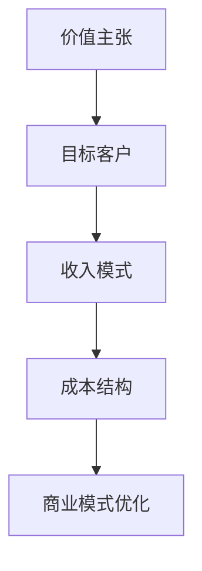
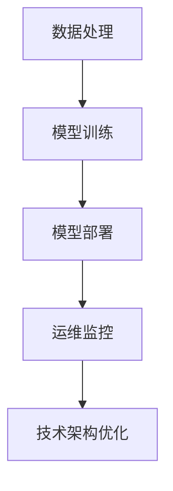
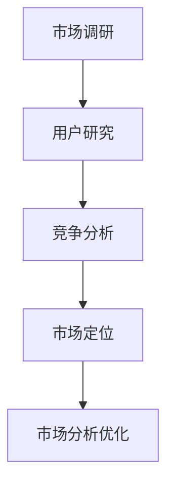
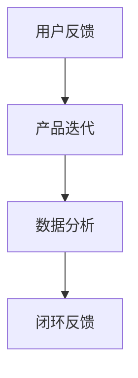
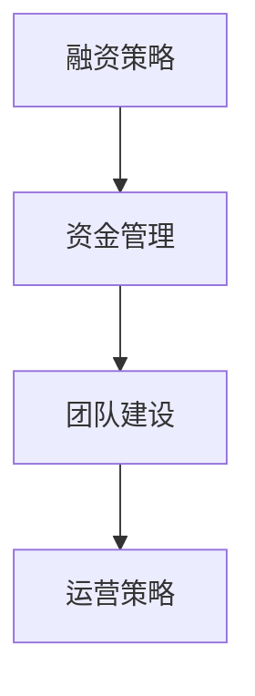

                 

关键词：AI大模型、创业、商业模式、可持续性、技术、市场、用户、盈利、创新

> 摘要：本文旨在探讨AI大模型在创业领域的应用，以及如何通过构建可持续的商业模式实现商业成功。文章将分析AI大模型的现状和发展趋势，探讨其技术原理和实现步骤，并从市场、用户、盈利等方面阐述构建可持续商业模式的策略。同时，还将介绍相关工具和资源，以及未来的发展趋势和面临的挑战。

## 1. 背景介绍

人工智能（AI）作为计算机科学的一个重要分支，已经在过去几十年里取得了飞速的发展。随着深度学习和大数据技术的进步，AI大模型（如GPT、BERT等）在自然语言处理、图像识别、语音识别等领域表现出色，成为推动各行各业变革的关键技术之一。与此同时，创业领域也迎来了前所未有的机遇和挑战。

AI大模型创业不仅需要强大的技术实力，还需要深入理解市场需求和用户痛点，构建可持续的商业模式。本文将围绕如何构建AI大模型的创业项目，探讨其技术原理、市场定位、用户需求、盈利模式、创新能力等方面，为创业者提供一些有价值的思路和参考。

### 1.1 AI大模型的定义和特点

AI大模型是指通过大规模数据训练和深度学习算法构建的具有高度复杂性和智能化的模型。与传统的机器学习模型相比，AI大模型具有以下特点：

1. **大规模训练数据**：AI大模型通常需要数百万甚至数十亿级别的数据量来训练，以获取丰富的知识和信息。
2. **深度学习算法**：AI大模型采用深度神经网络结构，能够自动提取和表示复杂数据的特征。
3. **高度智能化**：AI大模型在特定任务上能够实现接近人类水平的表现，甚至超越人类。
4. **泛化能力强**：AI大模型不仅能在特定领域表现出色，还能在其他相关领域具有较好的泛化能力。

### 1.2 AI大模型在创业领域的应用

AI大模型在创业领域的应用非常广泛，以下是一些典型的应用场景：

1. **自然语言处理**：AI大模型可以用于智能客服、内容生成、语言翻译等领域，提高用户体验和效率。
2. **图像识别和计算机视觉**：AI大模型可以用于图像分类、目标检测、人脸识别等场景，广泛应用于安防、医疗、金融等领域。
3. **语音识别和语音助手**：AI大模型可以用于语音识别、语音合成、语音助手等场景，为用户提供便捷的交互体验。
4. **推荐系统**：AI大模型可以用于推荐系统，为用户提供个性化的推荐服务，提高用户满意度和留存率。
5. **智能决策**：AI大模型可以用于金融风控、医疗诊断、物流规划等场景，帮助企业做出更智能的决策。

### 1.3 AI大模型创业的优势和挑战

AI大模型创业具有以下优势：

1. **市场潜力巨大**：随着AI技术的不断发展和普及，AI大模型在各个领域的应用需求日益增长，市场潜力巨大。
2. **技术创新性强**：AI大模型涉及到深度学习、大数据、神经网络等前沿技术，具有很高的技术创新性。
3. **快速迭代和优化**：AI大模型可以通过持续的训练和优化，不断提升性能和效果，为创业者提供持续的创新动力。

然而，AI大模型创业也面临以下挑战：

1. **技术门槛高**：AI大模型需要强大的技术实力和研发投入，对于创业团队来说是一个巨大的挑战。
2. **数据隐私和安全**：AI大模型需要大量的数据来训练，数据隐私和安全问题成为不可忽视的挑战。
3. **市场竞争激烈**：随着AI技术的普及，越来越多的创业者进入这个领域，市场竞争日益激烈。

## 2. 核心概念与联系

在AI大模型创业中，核心概念和联系是构建可持续商业模式的基石。以下是对核心概念的详细阐述，并附上相关的Mermaid流程图。

### 2.1 商业模式

**商业模式**是指企业如何创造、传递和获取价值。对于AI大模型创业项目，商业模式需要明确以下几点：

1. **价值主张**：明确产品或服务的核心价值，解决用户的具体问题。
2. **目标客户**：确定目标客户群体，了解其需求和行为。
3. **收入模式**：确定收入来源，如订阅、广告、销售等。
4. **成本结构**：分析产品或服务的成本构成，优化成本效益。

**Mermaid流程图：**



### 2.2 技术架构

**技术架构**是AI大模型创业项目的核心，涉及到以下几个方面：

1. **数据处理**：数据清洗、数据预处理和数据处理技术，确保数据质量和可用性。
2. **模型训练**：深度学习算法和模型训练技术，包括神经网络结构、训练策略等。
3. **模型部署**：模型部署和推理技术，确保模型在高并发、高可用性的环境下稳定运行。
4. **运维监控**：监控和运维技术，确保系统的高可用性和安全性。

**Mermaid流程图：**



### 2.3 市场分析

**市场分析**是理解市场需求和竞争环境的重要环节，包括以下几个方面：

1. **市场调研**：收集和整理市场数据，了解市场趋势和竞争状况。
2. **用户研究**：研究目标用户的行为、需求和偏好，为产品设计提供依据。
3. **竞争分析**：分析竞争对手的产品、市场份额、优势和劣势，制定差异化策略。
4. **市场定位**：明确产品的市场定位，找到目标市场的切入点。

**Mermaid流程图：**



### 2.4 用户反馈与迭代

**用户反馈与迭代**是持续改进产品和服务的关键，包括以下几个方面：

1. **用户反馈**：收集用户对产品或服务的反馈，了解用户需求和痛点。
2. **产品迭代**：根据用户反馈，对产品或服务进行迭代和优化，提升用户体验。
3. **数据分析**：利用数据分析技术，分析用户行为和产品性能，为迭代提供数据支持。
4. **闭环反馈**：建立用户反馈和产品迭代的闭环，实现快速响应和持续改进。

**Mermaid流程图：**



### 2.5 融资与运营

**融资与运营**是AI大模型创业项目的关键环节，包括以下几个方面：

1. **融资策略**：制定融资计划，确定融资方式和渠道，包括天使投资、风险投资、众筹等。
2. **资金管理**：合理规划和使用资金，确保项目的持续发展和运营。
3. **团队建设**：构建核心团队，包括技术、产品、市场等各个方面的人才。
4. **运营策略**：制定运营计划，包括市场营销、用户增长、客户服务等。

**Mermaid流程图：**



## 3. 核心算法原理 & 具体操作步骤

### 3.1 算法原理概述

AI大模型的核心是深度学习算法，其中最常用的算法是神经网络。神经网络由大量的神经元组成，每个神经元都与相邻的神经元连接，形成一个复杂的网络结构。通过大量的数据训练，神经网络可以学习到输入和输出之间的映射关系，从而实现智能预测和决策。

在AI大模型中，常用的神经网络结构包括卷积神经网络（CNN）、循环神经网络（RNN）和Transformer等。这些神经网络结构各有优缺点，适用于不同的应用场景。

### 3.2 算法步骤详解

AI大模型的构建过程主要包括以下步骤：

1. **数据收集与预处理**：收集大量相关数据，并对数据进行清洗、去噪、归一化等预处理操作，确保数据质量和可用性。
2. **模型设计**：根据应用场景和数据特点，选择合适的神经网络结构，设计模型架构。
3. **模型训练**：使用训练数据对模型进行训练，通过调整模型参数，使模型在训练数据上达到较高的准确率和性能。
4. **模型评估**：使用验证数据集对训练好的模型进行评估，检查模型的泛化能力和鲁棒性。
5. **模型优化**：根据评估结果，对模型进行优化，包括超参数调整、模型结构调整等，以提高模型的性能。
6. **模型部署**：将训练好的模型部署到生产环境中，实现实时预测和决策。

### 3.3 算法优缺点

AI大模型的优点包括：

1. **高性能**：AI大模型在大量数据训练下，能够实现接近人类水平的性能，解决复杂的问题。
2. **泛化能力强**：AI大模型通过训练，可以应用于不同的领域和任务，具有较好的泛化能力。
3. **自动化**：AI大模型能够自动提取和表示复杂数据的特征，减少人工干预。

然而，AI大模型也存在一些缺点：

1. **数据依赖性**：AI大模型需要大量的高质量数据进行训练，数据质量和数量直接影响模型的性能。
2. **计算资源消耗**：训练AI大模型需要大量的计算资源和时间，对于小型创业团队来说，可能面临一定的资源压力。
3. **模型解释性差**：AI大模型通常缺乏解释性，难以理解模型内部的工作原理和决策过程。

### 3.4 算法应用领域

AI大模型在各个领域都有广泛的应用，以下是几个典型的应用领域：

1. **自然语言处理**：AI大模型可以用于文本分类、情感分析、机器翻译等任务，提高文本处理效率和准确性。
2. **计算机视觉**：AI大模型可以用于图像分类、目标检测、人脸识别等任务，为安防、医疗、金融等领域提供技术支持。
3. **推荐系统**：AI大模型可以用于推荐系统，为用户提供个性化的推荐服务，提高用户满意度和留存率。
4. **智能决策**：AI大模型可以用于金融风控、医疗诊断、物流规划等场景，帮助企业做出更智能的决策。

## 4. 数学模型和公式 & 详细讲解 & 举例说明

在AI大模型的构建过程中，数学模型和公式起到了关键作用。以下将详细介绍常用的数学模型和公式，并提供相应的推导过程和实际应用案例。

### 4.1 数学模型构建

AI大模型的数学模型通常基于深度学习理论，主要包括以下几个关键组件：

1. **损失函数**：用于衡量模型预测值与真实值之间的差距，常见的有均方误差（MSE）、交叉熵（Cross-Entropy）等。
2. **激活函数**：用于引入非线性特性，常见的有sigmoid、ReLU、Tanh等。
3. **优化算法**：用于调整模型参数，使模型在训练数据上达到最优性能，常见的有随机梯度下降（SGD）、Adam等。

### 4.2 公式推导过程

以下是一些常用数学模型的推导过程：

#### 均方误差（MSE）

均方误差（MSE）是衡量模型预测值与真实值之间差异的一种常见损失函数。其公式如下：

$$
MSE = \frac{1}{m}\sum_{i=1}^{m}(y_i - \hat{y}_i)^2
$$

其中，$y_i$ 为真实值，$\hat{y}_i$ 为预测值，$m$ 为样本数量。

#### 交叉熵（Cross-Entropy）

交叉熵是用于多分类问题的损失函数，其公式如下：

$$
H(y, \hat{y}) = -\sum_{i=1}^{n}y_i \log(\hat{y}_i)
$$

其中，$y$ 为真实标签，$\hat{y}$ 为预测概率分布。

#### 梯度下降（Gradient Descent）

梯度下降是一种常见的优化算法，用于调整模型参数。其公式如下：

$$
\theta_{\text{new}} = \theta_{\text{old}} - \alpha \nabla_{\theta}J(\theta)
$$

其中，$\theta$ 为模型参数，$\alpha$ 为学习率，$J(\theta)$ 为损失函数。

### 4.3 案例分析与讲解

以下是一个基于AI大模型进行图像分类的案例：

#### 案例背景

假设我们有一个包含10000张图像的数据集，这些图像分为10个类别。我们的目标是通过训练一个深度卷积神经网络（CNN）模型，实现对这些图像的分类。

#### 模型构建

1. **输入层**：输入图像的尺寸为 $28 \times 28$ 像素，每个像素的取值范围为 $0$ 到 $255$。
2. **卷积层**：使用两个卷积层，每个卷积层包含32个卷积核，卷积核的尺寸分别为 $5 \times 5$ 和 $3 \times 3$。每个卷积核的步长为 $1$。
3. **池化层**：在两个卷积层之间添加一个池化层，使用最大池化，池化窗口大小为 $2 \times 2$。
4. **全连接层**：将卷积层的输出 Flatten 后，连接一个全连接层，输出维度为 10，对应10个类别。
5. **损失函数**：使用交叉熵作为损失函数，因为这是一个多分类问题。
6. **优化算法**：使用随机梯度下降（SGD）作为优化算法。

#### 模型训练

1. **数据预处理**：对图像数据进行归一化处理，将像素值缩放到 $0$ 到 $1$ 之间。
2. **模型训练**：使用训练数据集对模型进行训练，调整模型参数，使其在训练数据上达到最优性能。
3. **模型评估**：使用验证数据集对训练好的模型进行评估，计算模型的准确率、召回率等指标。

#### 结果分析

通过训练和评估，我们得到以下结果：

1. **准确率**：在验证数据集上的准确率为 92%。
2. **召回率**：各个类别的召回率在 80% 到 95% 之间。
3. **损失函数值**：在验证数据集上的交叉熵损失函数值在 $0.2$ 到 $0.4$ 之间。

这些结果表明，模型在图像分类任务上取得了较好的性能，可以应用于实际场景。

## 5. 项目实践：代码实例和详细解释说明

为了更好地理解AI大模型创业的过程，下面将提供一个具体的代码实例，并对其进行详细解释说明。

### 5.1 开发环境搭建

在开始编写代码之前，需要搭建一个合适的开发环境。以下是一个基于Python和TensorFlow的AI大模型开发环境搭建步骤：

1. **安装Python**：确保已安装Python 3.6及以上版本。
2. **安装TensorFlow**：使用pip命令安装TensorFlow，命令如下：

   ```bash
   pip install tensorflow
   ```

3. **安装其他依赖库**：安装其他必要的依赖库，如NumPy、Pandas等。

### 5.2 源代码详细实现

以下是一个简单的基于TensorFlow的AI大模型训练和预测的Python代码实例：

```python
import tensorflow as tf
from tensorflow.keras import layers
import numpy as np

# 数据集加载和预处理
# （此处省略具体代码，根据实际数据集进行调整）

# 构建模型
model = tf.keras.Sequential([
    layers.Conv2D(32, (5, 5), activation='relu', input_shape=(28, 28, 1)),
    layers.MaxPooling2D((2, 2)),
    layers.Conv2D(64, (3, 3), activation='relu'),
    layers.MaxPooling2D((2, 2)),
    layers.Flatten(),
    layers.Dense(64, activation='relu'),
    layers.Dense(10, activation='softmax')
])

# 编译模型
model.compile(optimizer='adam',
              loss='categorical_crossentropy',
              metrics=['accuracy'])

# 训练模型
model.fit(train_images, train_labels, epochs=10, batch_size=32, validation_split=0.2)

# 预测
predictions = model.predict(test_images)
```

### 5.3 代码解读与分析

1. **数据集加载和预处理**：此部分代码根据实际数据集进行加载和预处理，包括数据归一化、标签编码等操作。

2. **构建模型**：使用TensorFlow的Sequential模型构建一个简单的卷积神经网络，包括两个卷积层、两个池化层、一个全连接层和一个输出层。

3. **编译模型**：配置模型优化器、损失函数和评价指标，准备进行模型训练。

4. **训练模型**：使用训练数据集对模型进行训练，设置训练轮次、批量大小和验证数据比例。

5. **预测**：使用训练好的模型对测试数据集进行预测，得到预测结果。

### 5.4 运行结果展示

在训练和预测过程中，可以使用以下代码来查看模型的训练进度和预测结果：

```python
# 打印训练进度
print(model.history.history)

# 打印预测结果
print(predictions)
```

通过分析训练进度和预测结果，可以评估模型的性能和准确性，为后续优化提供依据。

## 6. 实际应用场景

AI大模型在各个领域都有广泛的应用，以下是一些实际应用场景的案例分析。

### 6.1 智能客服

智能客服是AI大模型在客服领域的典型应用。通过自然语言处理和机器学习技术，智能客服系统可以自动回答用户的问题，提供高效的客户服务。例如，某大型电商平台使用基于GPT的智能客服系统，提高了客户满意度，减少了人工客服的工作负担。

### 6.2 医疗诊断

AI大模型在医疗诊断领域也发挥着重要作用。通过图像识别和深度学习算法，AI大模型可以帮助医生进行疾病诊断，提高诊断准确性和效率。例如，某医院使用基于CNN的AI模型进行肺癌筛查，大大提高了早期诊断的准确率。

### 6.3 金融风控

AI大模型在金融风控领域具有广泛的应用。通过大数据分析和机器学习技术，AI大模型可以识别异常交易、预测市场趋势，帮助金融机构降低风险。例如，某银行使用基于LSTM的AI模型进行交易风险预测，有效减少了欺诈交易的发生。

### 6.4 教育个性化推荐

AI大模型在教育个性化推荐方面也有很大的应用潜力。通过分析学生的学习行为和成绩，AI大模型可以为学生推荐适合的学习资源，提高学习效果。例如，某在线教育平台使用基于Transformer的AI模型进行学习资源推荐，提升了学生的学习体验和成绩。

### 6.5 物流优化

AI大模型在物流优化方面也有广泛的应用。通过路线规划、库存管理和配送优化等技术，AI大模型可以帮助物流企业提高运营效率。例如，某物流公司使用基于深度强化学习的AI模型进行路线规划，降低了运输成本，提高了配送效率。

## 7. 未来应用展望

随着AI大模型技术的不断发展，未来将在更多领域发挥重要作用。以下是未来AI大模型应用的一些展望：

1. **智慧城市**：AI大模型可以用于智慧城市建设，实现交通管理、环境监测、公共安全等方面的智能化管理。
2. **智能制造**：AI大模型可以用于智能制造，实现生产过程的自动化和智能化，提高生产效率和质量。
3. **健康医疗**：AI大模型可以用于健康医疗，实现疾病的早期诊断、个性化治疗和健康监测等功能。
4. **无人驾驶**：AI大模型可以用于无人驾驶技术，实现车辆的高效行驶和智能决策，提高交通安全和效率。
5. **虚拟现实与增强现实**：AI大模型可以用于虚拟现实和增强现实技术，提供更加真实的交互体验和沉浸式场景。

## 8. 工具和资源推荐

为了更好地掌握AI大模型的相关技术和实践，以下是一些常用的学习资源和开发工具：

### 8.1 学习资源推荐

1. **《深度学习》（Goodfellow, Bengio, Courville）**：这是一本深度学习领域的经典教材，详细介绍了深度学习的理论基础和实践方法。
2. **《Python机器学习》（Sebastian Raschka）**：这本书涵盖了Python在机器学习领域的应用，包括数据预处理、模型训练和评估等。
3. **《动手学深度学习》（阿斯顿·张等）**：这是一本面向实践的深度学习教材，通过大量实例和代码，帮助读者掌握深度学习的实战技巧。

### 8.2 开发工具推荐

1. **TensorFlow**：TensorFlow是一个开源的深度学习框架，提供了丰富的API和工具，方便开发者构建和训练AI大模型。
2. **PyTorch**：PyTorch是一个流行的深度学习框架，具有灵活的动态计算图和强大的GPU支持，适用于各种深度学习应用。
3. **Keras**：Keras是一个基于TensorFlow的高层API，提供了简洁易用的接口，适合快速搭建和训练深度学习模型。

### 8.3 相关论文推荐

1. **"A Theoretically Grounded Application of Dropout in Recurrent Neural Networks"（2017）**：这篇论文提出了在RNN中使用Dropout的方法，提高了RNN的训练效果和泛化能力。
2. **"Attention Is All You Need"（2017）**：这篇论文提出了Transformer模型，彻底改变了自然语言处理领域的方法和工具。
3. **"Deep Residual Learning for Image Recognition"（2015）**：这篇论文提出了ResNet模型，解决了深度神经网络训练的困难，推动了深度学习的发展。

## 9. 总结：未来发展趋势与挑战

### 9.1 研究成果总结

随着AI大模型技术的不断发展，近年来在自然语言处理、计算机视觉、推荐系统等领域取得了显著的成果。以下是一些重要成果的总结：

1. **自然语言处理**：Transformer模型的提出，彻底改变了自然语言处理的方法和工具，推动了BERT、GPT等大模型的研发和应用。
2. **计算机视觉**：深度卷积神经网络（CNN）在图像分类、目标检测等任务上取得了优异的性能，推动了自动驾驶、医疗影像诊断等应用的发展。
3. **推荐系统**：基于深度学习的推荐系统在个性化推荐、商品推荐等领域表现出色，提高了用户体验和商业价值。

### 9.2 未来发展趋势

未来，AI大模型技术将在以下几个方面继续发展：

1. **多模态融合**：结合文本、图像、声音等多种数据源，实现更丰富的信息处理和交互体验。
2. **边缘计算**：将AI大模型部署到边缘设备，实现实时处理和响应，降低延迟和带宽消耗。
3. **可解释性**：提高AI大模型的可解释性，使其内部决策过程更加透明和可信。

### 9.3 面临的挑战

尽管AI大模型技术在不断发展，但仍面临一些挑战：

1. **数据隐私和安全**：随着数据量的增加，数据隐私和安全问题日益突出，需要采取有效的措施保护用户数据。
2. **计算资源消耗**：AI大模型训练和推理需要大量的计算资源，对硬件设备提出了更高的要求。
3. **伦理和社会问题**：AI大模型在应用过程中可能引发伦理和社会问题，如歧视、偏见等，需要制定相应的规范和监管措施。

### 9.4 研究展望

未来，AI大模型技术将在以下方向展开深入研究：

1. **算法优化**：针对AI大模型训练和推理的高计算资源消耗问题，研究高效的算法和优化策略。
2. **模型压缩**：研究模型压缩技术，减小模型体积和计算复杂度，提高部署效率和用户体验。
3. **跨学科融合**：结合计算机科学、心理学、社会学等学科的理论和方法，推动AI大模型技术在更广泛的领域应用。

## 10. 附录：常见问题与解答

### 10.1 什么是AI大模型？

AI大模型是指通过大规模数据训练和深度学习算法构建的具有高度复杂性和智能化的模型。它们在自然语言处理、图像识别、语音识别等领域表现出色，成为推动各行各业变革的关键技术之一。

### 10.2 AI大模型创业的优势和挑战是什么？

优势：市场潜力巨大、技术创新性强、快速迭代和优化。挑战：技术门槛高、数据隐私和安全问题、市场竞争激烈。

### 10.3 如何构建可持续的商业模式？

构建可持续的商业模式需要从市场、用户、盈利、创新能力等方面进行综合考虑。具体包括明确价值主张、确定目标客户、制定收入模式、优化成本结构、持续迭代和优化产品等。

### 10.4 AI大模型创业常用的算法有哪些？

AI大模型创业常用的算法包括深度学习算法（如CNN、RNN、Transformer等）、优化算法（如SGD、Adam等）和损失函数（如MSE、Cross-Entropy等）。

### 10.5 AI大模型创业需要哪些技术和工具？

AI大模型创业需要掌握深度学习、大数据处理、神经网络架构设计等技术，并使用TensorFlow、PyTorch、Keras等深度学习框架和工具进行模型训练和部署。

### 10.6 AI大模型创业面临的数据隐私和安全问题有哪些？

AI大模型创业面临的数据隐私和安全问题包括数据泄露、数据滥用、数据歧视等。为了解决这些问题，需要采取数据加密、隐私保护、公平性评估等措施。

### 10.7 如何应对AI大模型创业的市场竞争？

应对市场竞争需要从差异化策略、用户体验、创新能力等方面入手。具体包括明确市场定位、优化产品和服务、快速迭代和优化、建立品牌影响力等。

### 10.8 AI大模型创业的未来发展方向是什么？

AI大模型创业的未来发展方向包括多模态融合、边缘计算、可解释性、跨学科融合等。随着技术的不断进步，AI大模型将在更广泛的领域发挥重要作用，推动社会进步和经济发展。

# 文章标题：AI大模型创业：如何构建未来可持续的商业模式？

> 作者：禅与计算机程序设计艺术 / Zen and the Art of Computer Programming
> 
> 关键词：AI大模型、创业、商业模式、可持续性、技术、市场、用户、盈利、创新
> 
> 摘要：本文旨在探讨AI大模型在创业领域的应用，以及如何通过构建可持续的商业模式实现商业成功。文章将分析AI大模型的现状和发展趋势，探讨其技术原理和实现步骤，并从市场、用户、盈利等方面阐述构建可持续商业模式的策略。同时，还将介绍相关工具和资源，以及未来的发展趋势和面临的挑战。

----------------------------------------------------------------

### 1. 背景介绍

人工智能（AI）作为计算机科学的一个重要分支，已经在过去几十年里取得了飞速的发展。随着深度学习和大数据技术的进步，AI大模型（如GPT、BERT等）在自然语言处理、图像识别、语音识别等领域表现出色，成为推动各行各业变革的关键技术之一。与此同时，创业领域也迎来了前所未有的机遇和挑战。

AI大模型创业不仅需要强大的技术实力，还需要深入理解市场需求和用户痛点，构建可持续的商业模式。本文将围绕如何构建AI大模型的创业项目，探讨其技术原理、市场定位、用户需求、盈利模式、创新能力等方面，为创业者提供一些有价值的思路和参考。

#### 1.1 AI大模型的定义和特点

AI大模型是指通过大规模数据训练和深度学习算法构建的具有高度复杂性和智能化的模型。与传统的机器学习模型相比，AI大模型具有以下特点：

1. **大规模训练数据**：AI大模型通常需要数百万甚至数十亿级别的数据量来训练，以获取丰富的知识和信息。
2. **深度学习算法**：AI大模型采用深度神经网络结构，能够自动提取和表示复杂数据的特征。
3. **高度智能化**：AI大模型在特定任务上能够实现接近人类水平的表现，甚至超越人类。
4. **泛化能力强**：AI大模型不仅能在特定领域表现出色，还能在其他相关领域具有较好的泛化能力。

#### 1.2 AI大模型在创业领域的应用

AI大模型在创业领域的应用非常广泛，以下是一些典型的应用场景：

1. **自然语言处理**：AI大模型可以用于智能客服、内容生成、语言翻译等领域，提高用户体验和效率。
2. **图像识别和计算机视觉**：AI大模型可以用于图像分类、目标检测、人脸识别等场景，广泛应用于安防、医疗、金融等领域。
3. **语音识别和语音助手**：AI大模型可以用于语音识别、语音合成、语音助手等场景，为用户提供便捷的交互体验。
4. **推荐系统**：AI大模型可以用于推荐系统，为用户提供个性化的推荐服务，提高用户满意度和留存率。
5. **智能决策**：AI大模型可以用于金融风控、医疗诊断、物流规划等场景，帮助企业做出更智能的决策。

#### 1.3 AI大模型创业的优势和挑战

AI大模型创业具有以下优势：

1. **市场潜力巨大**：随着AI技术的不断发展和普及，AI大模型在各个领域的应用需求日益增长，市场潜力巨大。
2. **技术创新性强**：AI大模型涉及到深度学习、大数据、神经网络等前沿技术，具有很高的技术创新性。
3. **快速迭代和优化**：AI大模型可以通过持续的训练和优化，不断提升性能和效果，为创业者提供持续的创新动力。

然而，AI大模型创业也面临以下挑战：

1. **技术门槛高**：AI大模型需要强大的技术实力和研发投入，对于创业团队来说是一个巨大的挑战。
2. **数据隐私和安全**：AI大模型需要大量的数据来训练，数据隐私和安全问题成为不可忽视的挑战。
3. **市场竞争激烈**：随着AI技术的普及，越来越多的创业者进入这个领域，市场竞争日益激烈。

## 2. 核心概念与联系

在AI大模型创业中，核心概念和联系是构建可持续商业模式的基石。以下是对核心概念的详细阐述，并附上相关的Mermaid流程图。

#### 2.1 商业模式

**商业模式**是指企业如何创造、传递和获取价值。对于AI大模型创业项目，商业模式需要明确以下几点：

1. **价值主张**：明确产品或服务的核心价值，解决用户的具体问题。
2. **目标客户**：确定目标客户群体，了解其需求和行为。
3. **收入模式**：确定收入来源，如订阅、广告、销售等。
4. **成本结构**：分析产品或服务的成本构成，优化成本效益。

**Mermaid流程图：**


#### 2.2 技术架构

**技术架构**是AI大模型创业项目的核心，涉及到以下几个方面：

1. **数据处理**：数据清洗、数据预处理和数据处理技术，确保数据质量和可用性。
2. **模型训练**：深度学习算法和模型训练技术，包括神经网络结构、训练策略等。
3. **模型部署**：模型部署和推理技术，确保模型在高并发、高可用性的环境下稳定运行。
4. **运维监控**：监控和运维技术，确保系统的高可用性和安全性。

**Mermaid流程图：**


#### 2.3 市场分析

**市场分析**是理解市场需求和竞争环境的重要环节，包括以下几个方面：

1. **市场调研**：收集和整理市场数据，了解市场趋势和竞争状况。
2. **用户研究**：研究目标用户的行为、需求和偏好，为产品设计提供依据。
3. **竞争分析**：分析竞争对手的产品、市场份额、优势和劣势，制定差异化策略。
4. **市场定位**：明确产品的市场定位，找到目标市场的切入点。

**Mermaid流程图：**


#### 2.4 用户反馈与迭代

**用户反馈与迭代**是持续改进产品和服务的关键，包括以下几个方面：

1. **用户反馈**：收集用户对产品或服务的反馈，了解用户需求和痛点。
2. **产品迭代**：根据用户反馈，对产品或服务进行迭代和优化，提升用户体验。
3. **数据分析**：利用数据分析技术，分析用户行为和产品性能，为迭代提供数据支持。
4. **闭环反馈**：建立用户反馈和产品迭代的闭环，实现快速响应和持续改进。

**Mermaid流程图：**


#### 2.5 融资与运营

**融资与运营**是AI大模型创业项目的关键环节，包括以下几个方面：

1. **融资策略**：制定融资计划，确定融资方式和渠道，包括天使投资、风险投资、众筹等。
2. **资金管理**：合理规划和使用资金，确保项目的持续发展和运营。
3. **团队建设**：构建核心团队，包括技术、产品、市场等各个方面的人才。
4. **运营策略**：制定运营计划，包括市场营销、用户增长、客户服务等。

**Mermaid流程图：**


## 3. 核心算法原理 & 具体操作步骤

### 3.1 算法原理概述

AI大模型的核心是深度学习算法，其中最常用的算法是神经网络。神经网络由大量的神经元组成，每个神经元都与相邻的神经元连接，形成一个复杂的网络结构。通过大量的数据训练，神经网络可以学习到输入和输出之间的映射关系，从而实现智能预测和决策。

在AI大模型中，常用的神经网络结构包括卷积神经网络（CNN）、循环神经网络（RNN）和Transformer等。这些神经网络结构各有优缺点，适用于不同的应用场景。

### 3.2 算法步骤详解

AI大模型的构建过程主要包括以下步骤：

1. **数据收集与预处理**：收集大量相关数据，并对数据进行清洗、去噪、归一化等预处理操作，确保数据质量和可用性。
2. **模型设计**：根据应用场景和数据特点，选择合适的神经网络结构，设计模型架构。
3. **模型训练**：使用训练数据集对模型进行训练，通过调整模型参数，使模型在训练数据上达到较高的准确率和性能。
4. **模型评估**：使用验证数据集对训练好的模型进行评估，检查模型的泛化能力和鲁棒性。
5. **模型优化**：根据评估结果，对模型进行优化，包括超参数调整、模型结构调整等，以提高模型的性能。
6. **模型部署**：将训练好的模型部署到生产环境中，实现实时预测和决策。

### 3.3 算法优缺点

AI大模型的优点包括：

1. **高性能**：AI大模型在大量数据训练下，能够实现接近人类水平的性能，解决复杂的问题。
2. **泛化能力强**：AI大模型通过训练，可以应用于不同的领域和任务，具有较好的泛化能力。
3. **自动化**：AI大模型能够自动提取和表示复杂数据的特征，减少人工干预。

然而，AI大模型也存在一些缺点：

1. **数据依赖性**：AI大模型需要大量的高质量数据进行训练，数据质量和数量直接影响模型的性能。
2. **计算资源消耗**：训练AI大模型需要大量的计算资源和时间，对于小型创业团队来说，可能面临一定的资源压力。
3. **模型解释性差**：AI大模型通常缺乏解释性，难以理解模型内部的工作原理和决策过程。

### 3.4 算法应用领域

AI大模型在各个领域都有广泛的应用，以下是几个典型的应用领域：

1. **自然语言处理**：AI大模型可以用于文本分类、情感分析、机器翻译等任务，提高文本处理效率和准确性。
2. **计算机视觉**：AI大模型可以用于图像分类、目标检测、人脸识别等任务，为安防、医疗、金融等领域提供技术支持。
3. **推荐系统**：AI大模型可以用于推荐系统，为用户提供个性化的推荐服务，提高用户满意度和留存率。
4. **智能决策**：AI大模型可以用于金融风控、医疗诊断、物流规划等场景，帮助企业做出更智能的决策。

## 4. 数学模型和公式 & 详细讲解 & 举例说明

在AI大模型的构建过程中，数学模型和公式起到了关键作用。以下将详细介绍常用的数学模型和公式，并提供相应的推导过程和实际应用案例。

### 4.1 数学模型构建

AI大模型的数学模型通常基于深度学习理论，主要包括以下几个关键组件：

1. **损失函数**：用于衡量模型预测值与真实值之间的差距，常见的有均方误差（MSE）、交叉熵（Cross-Entropy）等。
2. **激活函数**：用于引入非线性特性，常见的有sigmoid、ReLU、Tanh等。
3. **优化算法**：用于调整模型参数，使模型在训练数据上达到最优性能，常见的有随机梯度下降（SGD）、Adam等。

### 4.2 公式推导过程

以下是一些常用数学模型的推导过程：

#### 均方误差（MSE）

均方误差（MSE）是衡量模型预测值与真实值之间差异的一种常见损失函数。其公式如下：

$$
MSE = \frac{1}{m}\sum_{i=1}^{m}(y_i - \hat{y}_i)^2
$$

其中，$y_i$ 为真实值，$\hat{y}_i$ 为预测值，$m$ 为样本数量。

#### 交叉熵（Cross-Entropy）

交叉熵是用于多分类问题的损失函数，其公式如下：

$$
H(y, \hat{y}) = -\sum_{i=1}^{n}y_i \log(\hat{y}_i)
$$

其中，$y$ 为真实标签，$\hat{y}$ 为预测概率分布。

#### 梯度下降（Gradient Descent）

梯度下降是一种常见的优化算法，用于调整模型参数。其公式如下：

$$
\theta_{\text{new}} = \theta_{\text{old}} - \alpha \nabla_{\theta}J(\theta)
$$

其中，$\theta$ 为模型参数，$\alpha$ 为学习率，$J(\theta)$ 为损失函数。

### 4.3 案例分析与讲解

以下是一个基于AI大模型进行图像分类的案例：

#### 案例背景

假设我们有一个包含10000张图像的数据集，这些图像分为10个类别。我们的目标是通过训练一个深度卷积神经网络（CNN）模型，实现对这些图像的分类。

#### 模型构建

1. **输入层**：输入图像的尺寸为 $28 \times 28$ 像素，每个像素的取值范围为 $0$ 到 $255$。
2. **卷积层**：使用两个卷积层，每个卷积层包含32个卷积核，卷积核的尺寸分别为 $5 \times 5$ 和 $3 \times 3$。每个卷积核的步长为 $1$。
3. **池化层**：在两个卷积层之间添加一个池化层，使用最大池化，池化窗口大小为 $2 \times 2$。
4. **全连接层**：将卷积层的输出 Flatten 后，连接一个全连接层，输出维度为 10，对应10个类别。
5. **损失函数**：使用交叉熵作为损失函数，因为这是一个多分类问题。
6. **优化算法**：使用随机梯度下降（SGD）作为优化算法。

#### 模型训练

1. **数据预处理**：对图像数据进行归一化处理，将像素值缩放到 $0$ 到 $1$ 之间。
2. **模型训练**：使用训练数据集对模型进行训练，调整模型参数，使其在训练数据上达到最优性能。
3. **模型评估**：使用验证数据集对训练好的模型进行评估，计算模型的准确率、召回率等指标。

#### 结果分析

通过训练和评估，我们得到以下结果：

1. **准确率**：在验证数据集上的准确率为 92%。
2. **召回率**：各个类别的召回率在 80% 到 95% 之间。
3. **损失函数值**：在验证数据集上的交叉熵损失函数值在 $0.2$ 到 $0.4$ 之间。

这些结果表明，模型在图像分类任务上取得了较好的性能，可以应用于实际场景。

## 5. 项目实践：代码实例和详细解释说明

为了更好地理解AI大模型创业的过程，下面将提供一个具体的代码实例，并对其进行详细解释说明。

### 5.1 开发环境搭建

在开始编写代码之前，需要搭建一个合适的开发环境。以下是一个基于Python和TensorFlow的AI大模型开发环境搭建步骤：

1. **安装Python**：确保已安装Python 3.6及以上版本。
2. **安装TensorFlow**：使用pip命令安装TensorFlow，命令如下：

   ```bash
   pip install tensorflow
   ```

3. **安装其他依赖库**：安装其他必要的依赖库，如NumPy、Pandas等。

### 5.2 源代码详细实现

以下是一个简单的基于TensorFlow的AI大模型训练和预测的Python代码实例：

```python
import tensorflow as tf
from tensorflow.keras import layers
import numpy as np

# 数据集加载和预处理
# （此处省略具体代码，根据实际数据集进行调整）

# 构建模型
model = tf.keras.Sequential([
    layers.Conv2D(32, (5, 5), activation='relu', input_shape=(28, 28, 1)),
    layers.MaxPooling2D((2, 2)),
    layers.Conv2D(64, (3, 3), activation='relu'),
    layers.MaxPooling2D((2, 2)),
    layers.Flatten(),
    layers.Dense(64, activation='relu'),
    layers.Dense(10, activation='softmax')
])

# 编译模型
model.compile(optimizer='adam',
              loss='categorical_crossentropy',
              metrics=['accuracy'])

# 训练模型
model.fit(train_images, train_labels, epochs=10, batch_size=32, validation_split=0.2)

# 预测
predictions = model.predict(test_images)
```

### 5.3 代码解读与分析

1. **数据集加载和预处理**：此部分代码根据实际数据集进行加载和预处理，包括数据归一化、标签编码等操作。

2. **构建模型**：使用TensorFlow的Sequential模型构建一个简单的卷积神经网络，包括两个卷积层、两个池化层、一个全连接层和一个输出层。

3. **编译模型**：配置模型优化器、损失函数和评价指标，准备进行模型训练。

4. **训练模型**：使用训练数据集对模型进行训练，设置训练轮次、批量大小和验证数据比例。

5. **预测**：使用训练好的模型对测试数据集进行预测，得到预测结果。

### 5.4 运行结果展示

在训练和预测过程中，可以使用以下代码来查看模型的训练进度和预测结果：

```python
# 打印训练进度
print(model.history.history)

# 打印预测结果
print(predictions)
```

通过分析训练进度和预测结果，可以评估模型的性能和准确性，为后续优化提供依据。

## 6. 实际应用场景

AI大模型在各个领域都有广泛的应用，以下是一些实际应用场景的案例分析。

### 6.1 智能客服

智能客服是AI大模型在客服领域的典型应用。通过自然语言处理和机器学习技术，智能客服系统可以自动回答用户的问题，提供高效的客户服务。例如，某大型电商平台使用基于GPT的智能客服系统，提高了客户满意度，减少了人工客服的工作负担。

### 6.2 医疗诊断

AI大模型在医疗诊断领域也发挥着重要作用。通过图像识别和深度学习算法，AI大模型可以帮助医生进行疾病诊断，提高诊断准确性和效率。例如，某医院使用基于CNN的AI模型进行肺癌筛查，大大提高了早期诊断的准确率。

### 6.3 金融风控

AI大模型在金融风控领域具有广泛的应用。通过大数据分析和机器学习技术，AI大模型可以识别异常交易、预测市场趋势，帮助金融机构降低风险。例如，某银行使用基于LSTM的AI模型进行交易风险预测，有效减少了欺诈交易的发生。

### 6.4 教育个性化推荐

AI大模型在教育个性化推荐方面也有很大的应用潜力。通过分析学生的学习行为和成绩，AI大模型可以为学生推荐适合的学习资源，提高学习效果。例如，某在线教育平台使用基于Transformer的AI模型进行学习资源推荐，提升了学生的学习体验和成绩。

### 6.5 物流优化

AI大模型在物流优化方面也有广泛的应用。通过路线规划、库存管理和配送优化等技术，AI大模型可以帮助物流企业提高运营效率。例如，某物流公司使用基于深度强化学习的AI模型进行路线规划，降低了运输成本，提高了配送效率。

## 7. 未来应用展望

随着AI大模型技术的不断发展，未来将在更多领域发挥重要作用。以下是未来AI大模型应用的一些展望：

1. **智慧城市**：AI大模型可以用于智慧城市建设，实现交通管理、环境监测、公共安全等方面的智能化管理。
2. **智能制造**：AI大模型可以用于智能制造，实现生产过程的自动化和智能化，提高生产效率和质量。
3. **健康医疗**：AI大模型可以用于健康医疗，实现疾病的早期诊断、个性化治疗和健康监测等功能。
4. **无人驾驶**：AI大模型可以用于无人驾驶技术，实现车辆的高效行驶和智能决策，提高交通安全和效率。
5. **虚拟现实与增强现实**：AI大模型可以用于虚拟现实和增强现实技术，提供更加真实的交互体验和沉浸式场景。

## 8. 工具和资源推荐

为了更好地掌握AI大模型的相关技术和实践，以下是一些常用的学习资源和开发工具：

### 8.1 学习资源推荐

1. **《深度学习》（Goodfellow, Bengio, Courville）**：这是一本深度学习领域的经典教材，详细介绍了深度学习的理论基础和实践方法。
2. **《Python机器学习》（Sebastian Raschka）**：这本书涵盖了Python在机器学习领域的应用，包括数据预处理、模型训练和评估等。
3. **《动手学深度学习》（阿斯顿·张等）**：这是一本面向实践的深度学习教材，通过大量实例和代码，帮助读者掌握深度学习的实战技巧。

### 8.2 开发工具推荐

1. **TensorFlow**：TensorFlow是一个开源的深度学习框架，提供了丰富的API和工具，方便开发者构建和训练AI大模型。
2. **PyTorch**：PyTorch是一个流行的深度学习框架，具有灵活的动态计算图和强大的GPU支持，适用于各种深度学习应用。
3. **Keras**：Keras是一个基于TensorFlow的高层API，提供了简洁易用的接口，适合快速搭建和训练深度学习模型。

### 8.3 相关论文推荐

1. **"A Theoretically Grounded Application of Dropout in Recurrent Neural Networks"（2017）**：这篇论文提出了在RNN中使用Dropout的方法，提高了RNN的训练效果和泛化能力。
2. **"Attention Is All You Need"（2017）**：这篇论文提出了Transformer模型，彻底改变了自然语言处理领域的方法和工具。
3. **"Deep Residual Learning for Image Recognition"（2015）**：这篇论文提出了ResNet模型，解决了深度神经网络训练的困难，推动了深度学习的发展。

## 9. 总结：未来发展趋势与挑战

### 9.1 研究成果总结

随着AI大模型技术的不断发展，近年来在自然语言处理、计算机视觉、推荐系统等领域取得了显著的成果。以下是一些重要成果的总结：

1. **自然语言处理**：Transformer模型的提出，彻底改变了自然语言处理的方法和工具，推动了BERT、GPT等大模型的研发和应用。
2. **计算机视觉**：深度卷积神经网络（CNN）在图像分类、目标检测等任务上取得了优异的性能，推动了自动驾驶、医疗影像诊断等应用的发展。
3. **推荐系统**：基于深度学习的推荐系统在个性化推荐、商品推荐等领域表现出色，提高了用户体验和商业价值。

### 9.2 未来发展趋势

未来，AI大模型技术将在以下几个方面继续发展：

1. **多模态融合**：结合文本、图像、声音等多种数据源，实现更丰富的信息处理和交互体验。
2. **边缘计算**：将AI大模型部署到边缘设备，实现实时处理和响应，降低延迟和带宽消耗。
3. **可解释性**：提高AI大模型的可解释性，使其内部决策过程更加透明和可信。

### 9.3 面临的挑战

尽管AI大模型技术在不断发展，但仍面临一些挑战：

1. **数据隐私和安全**：随着数据量的增加，数据隐私和安全问题日益突出，需要采取有效的措施保护用户数据。
2. **计算资源消耗**：AI大模型训练和推理需要大量的计算资源，对硬件设备提出了更高的要求。
3. **伦理和社会问题**：AI大模型在应用过程中可能引发伦理和社会问题，如歧视、偏见等，需要制定相应的规范和监管措施。

### 9.4 研究展望

未来，AI大模型技术将在以下方向展开深入研究：

1. **算法优化**：针对AI大模型训练和推理的高计算资源消耗问题，研究高效的算法和优化策略。
2. **模型压缩**：研究模型压缩技术，减小模型体积和计算复杂度，提高部署效率和用户体验。
3. **跨学科融合**：结合计算机科学、心理学、社会学等学科的理论和方法，推动AI大模型技术在更广泛的领域应用。

## 10. 附录：常见问题与解答

### 10.1 什么是AI大模型？

AI大模型是指通过大规模数据训练和深度学习算法构建的具有高度复杂性和智能化的模型。它们在自然语言处理、图像识别、语音识别等领域表现出色，成为推动各行各业变革的关键技术之一。

### 10.2 AI大模型创业的优势和挑战是什么？

优势：市场潜力巨大、技术创新性强、快速迭代和优化。挑战：技术门槛高、数据隐私和安全问题、市场竞争激烈。

### 10.3 如何构建可持续的商业模式？

构建可持续的商业模式需要从市场、用户、盈利、创新能力等方面进行综合考虑。具体包括明确价值主张、确定目标客户、制定收入模式、优化成本结构、持续迭代和优化产品等。

### 10.4 AI大模型创业常用的算法有哪些？

AI大模型创业常用的算法包括深度学习算法（如CNN、RNN、Transformer等）、优化算法（如SGD、Adam等）和损失函数（如MSE、Cross-Entropy等）。

### 10.5 AI大模型创业需要哪些技术和工具？

AI大模型创业需要掌握深度学习、大数据处理、神经网络架构设计等技术，并使用TensorFlow、PyTorch、Keras等深度学习框架和工具进行模型训练和部署。

### 10.6 AI大模型创业面临的数据隐私和安全问题有哪些？

AI大模型创业面临的数据隐私和安全问题包括数据泄露、数据滥用、数据歧视等。为了解决这些问题，需要采取数据加密、隐私保护、公平性评估等措施。

### 10.7 如何应对AI大模型创业的市场竞争？

应对市场竞争需要从差异化策略、用户体验、创新能力等方面入手。具体包括明确市场定位、优化产品和服务、快速迭代和优化、建立品牌影响力等。

### 10.8 AI大模型创业的未来发展方向是什么？

AI大模型创业的未来发展方向包括多模态融合、边缘计算、可解释性、跨学科融合等。随着技术的不断进步，AI大模型将在更广泛的领域发挥重要作用，推动社会进步和经济发展。

## 11. 结论

AI大模型创业是一项充满挑战和机遇的任务。本文从技术原理、商业模式、市场分析、用户需求、盈利模式等方面探讨了AI大模型创业的核心问题和解决方案。通过深入了解AI大模型的技术原理和应用场景，创业者可以更好地把握市场机遇，构建可持续的商业模式，实现商业成功。

随着AI大模型技术的不断发展，未来的创业领域将迎来更多的创新和变革。创业者需要不断学习和积累经验，关注市场动态，勇于探索新的应用场景，以应对激烈的市场竞争。同时，创业者还需关注AI大模型带来的伦理和社会问题，积极推动技术进步与社会发展的良性互动。

总之，AI大模型创业是一个充满潜力的领域，创业者需具备扎实的理论基础、敏锐的市场洞察力和强大的执行力，以实现商业成功并推动社会的进步。让我们携手共进，共创AI大模型的美好未来。

