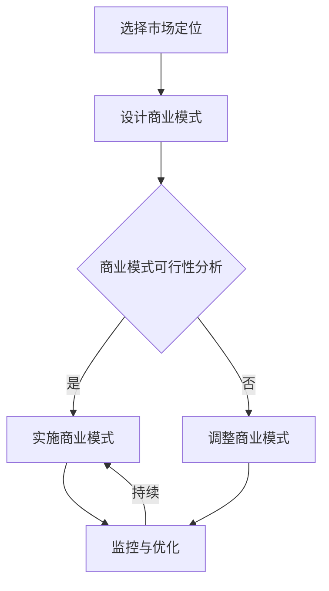

                 

关键词：AI大模型、创业、商业模式、可持续性、技术架构

## 摘要

本文将探讨AI大模型创业中的商业模式构建问题。我们将首先介绍AI大模型的基本概念和技术背景，接着深入分析当前市场环境，讨论如何选择合适的市场定位和业务模式。随后，我们将探讨如何通过技术架构设计实现商业模式的可持续性，并提供具体的实践案例和工具资源推荐。最后，我们将总结研究成果，展望未来的发展趋势与挑战。

## 1. 背景介绍

人工智能（AI）作为计算机科学的重要分支，近年来取得了飞速发展。特别是在深度学习、自然语言处理、计算机视觉等领域，AI技术不断突破传统认知的界限，为各行各业带来了深刻的影响。其中，AI大模型（如GPT-3、BERT等）因其卓越的性能和广泛的适用性，成为了AI领域的明星。

AI大模型是指使用深度学习技术训练出的具有巨大参数规模和强通用性的模型。这些模型通常通过大规模数据集训练，能够处理复杂的任务，如文本生成、图像识别、语音识别等。随着计算能力的提升和数据规模的扩大，AI大模型的性能和应用范围正不断扩展。

在创业领域，AI大模型的应用潜力吸引了众多创业者。然而，如何将AI大模型的技术优势转化为可持续的商业价值，是每一个AI创业者都需要深思的问题。本文将围绕这一核心问题，探讨如何构建未来的可持续商业模式。

## 2. 核心概念与联系

### 2.1 AI大模型的概念

AI大模型是指使用深度学习技术训练出的具有巨大参数规模和强通用性的模型。这些模型通常包含数百万甚至数十亿个参数，能够在大量数据上进行训练，以实现高度的泛化能力。

### 2.2 商业模式的概念

商业模式是指企业通过产品或服务的提供，实现价值创造、传递和获取的方式。一个成功的商业模式需要解决四个核心问题：价值主张、目标客户、盈利模式和资源配置。

### 2.3 商业模式与AI大模型的关系

AI大模型作为技术工具，可以为商业模式提供强大的支持。一方面，AI大模型可以提升产品或服务的性能，增强企业的竞争力；另一方面，AI大模型可以为企业提供新的商业模式，如SaaS（软件即服务）、数据交易等。

### 2.4 Mermaid流程图

下面是一个简单的Mermaid流程图，展示了AI大模型在商业模式构建中的应用：



## 3. 核心算法原理 & 具体操作步骤

### 3.1 算法原理概述

AI大模型的构建主要依赖于深度学习技术。深度学习是一种基于多层神经网络的学习方法，通过模拟人脑神经元之间的连接和交互，实现数据的自动学习和分类。

### 3.2 算法步骤详解

1. **数据收集与预处理**：收集大量相关数据，并进行清洗、归一化等预处理操作。
2. **模型设计**：设计符合任务需求的神经网络架构，如卷积神经网络（CNN）、循环神经网络（RNN）等。
3. **模型训练**：使用预处理后的数据对模型进行训练，通过反向传播算法不断调整模型参数，优化模型性能。
4. **模型评估与优化**：使用验证集对模型进行评估，并根据评估结果对模型进行调整和优化。
5. **模型部署与应用**：将训练好的模型部署到实际应用场景中，如文本生成、图像识别等。

### 3.3 算法优缺点

**优点**：
- **强大的学习能力**：AI大模型能够从大量数据中自动学习和提取特征，具有高度的泛化能力。
- **高性能**：通过深度学习技术，AI大模型在许多任务上都取得了超越传统方法的性能。

**缺点**：
- **计算资源需求大**：训练AI大模型需要大量的计算资源和时间。
- **数据依赖性强**：AI大模型的性能很大程度上依赖于训练数据的质量和数量。

### 3.4 算法应用领域

AI大模型在多个领域都有广泛的应用，如自然语言处理、计算机视觉、语音识别等。以下是一些具体的案例：

- **自然语言处理**：AI大模型可以用于文本生成、机器翻译、情感分析等任务。
- **计算机视觉**：AI大模型可以用于图像分类、目标检测、人脸识别等任务。
- **语音识别**：AI大模型可以用于语音识别、语音合成等任务。

## 4. 数学模型和公式 & 详细讲解 & 举例说明

### 4.1 数学模型构建

在AI大模型的训练过程中，最核心的数学模型是反向传播算法（Backpropagation Algorithm）。反向传播算法是一种用于计算神经网络输出误差并更新网络参数的算法。

### 4.2 公式推导过程

假设有一个包含n层的神经网络，其输入为x，输出为y，误差函数为J。则反向传播算法的主要公式如下：

$$
\delta^{l}_{ij} = \frac{\partial J}{\partial z^{l}_{ij}} \\
z^{l}_{ij} = \sum_{k=1}^{n_{l-1}} w^{l-1}_{ik} a^{l-1}_{kj} \\
a^{l}_{ij} = \sigma(z^{l}_{ij}) \\
\Delta^{l}_{ij} = \delta^{l}_{ij} a^{l}_{ij} (1 - a^{l}_{ij}) \\
w^{l}_{ij} = w^{l}_{ij} + \alpha \Delta^{l}_{ij} x^{l-1}_{kj} \\
$$

其中，$\sigma$ 是激活函数，通常使用Sigmoid函数或ReLU函数。

### 4.3 案例分析与讲解

假设我们有一个简单的神经网络，用于对二进制数据进行分类。输入层有2个神经元，隐藏层有3个神经元，输出层有1个神经元。激活函数使用ReLU函数。

1. **初始化参数**：
   - $w^{0}_{0} \sim U(-1, 1)$
   - $w^{0}_{1} \sim U(-1, 1)$
   - $w^{1}_{0} \sim U(-1, 1)$
   - $w^{1}_{1} \sim U(-1, 1)$
   - $w^{1}_{2} \sim U(-1, 1)$
   - $w^{1}_{3} \sim U(-1, 1)$
   - $w^{2}_{0} \sim U(-1, 1)$
   - $w^{2}_{1} \sim U(-1, 1)$

2. **前向传播**：
   - $z^{0}_{0} = w^{0}_{0} x^{0}_{0} + w^{0}_{1} x^{0}_{1}$
   - $z^{0}_{1} = w^{0}_{1} x^{0}_{0} + w^{0}_{1} x^{0}_{1}$
   - $a^{0}_{0} = \sigma(z^{0}_{0}) = \max(0, z^{0}_{0})$
   - $a^{0}_{1} = \sigma(z^{0}_{1}) = \max(0, z^{0}_{1})$
   - $z^{1}_{0} = w^{1}_{0} a^{0}_{0} + w^{1}_{1} a^{0}_{1} + w^{1}_{2}$
   - $z^{1}_{1} = w^{1}_{1} a^{0}_{0} + w^{1}_{1} a^{0}_{1} + w^{1}_{3}$
   - $z^{1}_{2} = w^{1}_{2} a^{0}_{0} + w^{1}_{3} a^{0}_{1} + w^{1}_{2}$
   - $z^{1}_{3} = w^{1}_{3} a^{0}_{0} + w^{1}_{3} a^{0}_{1} + w^{1}_{3}$
   - $a^{1}_{0} = \sigma(z^{1}_{0}) = \max(0, z^{1}_{0})$
   - $a^{1}_{1} = \sigma(z^{1}_{1}) = \max(0, z^{1}_{1})$
   - $a^{1}_{2} = \sigma(z^{1}_{2}) = \max(0, z^{1}_{2})$
   - $a^{1}_{3} = \sigma(z^{1}_{3}) = \max(0, z^{1}_{3})$
   - $z^{2}_{0} = w^{2}_{0} a^{1}_{0} + w^{2}_{1} a^{1}_{1}$
   - $a^{2}_{0} = \sigma(z^{2}_{0}) = \max(0, z^{2}_{0})$

3. **反向传播**：
   - 计算输出层的误差：$\delta^{2}_{0} = (a^{2}_{0} - y^{2}_{0}) \cdot a^{2}_{0} (1 - a^{2}_{0})$
   - 更新输出层的权重：$w^{2}_{0} = w^{2}_{0} + \alpha \delta^{2}_{0} a^{1}_{0}$，$w^{2}_{1} = w^{2}_{1} + \alpha \delta^{2}_{0} a^{1}_{1}$
   - 计算隐藏层的误差：$\delta^{1}_{0} = w^{2}_{0} \cdot \delta^{2}_{0} \cdot a^{1}_{0} (1 - a^{1}_{0})$，$\delta^{1}_{1} = w^{2}_{1} \cdot \delta^{2}_{0} \cdot a^{1}_{1} (1 - a^{1}_{1})$
   - 更新隐藏层的权重：$w^{1}_{0} = w^{1}_{0} + \alpha \delta^{1}_{0} a^{0}_{0}$，$w^{1}_{1} = w^{1}_{1} + \alpha \delta^{1}_{0} a^{0}_{1}$，$w^{1}_{2} = w^{1}_{2} + \alpha \delta^{1}_{1} a^{0}_{0}$，$w^{1}_{3} = w^{1}_{3} + \alpha \delta^{1}_{1} a^{0}_{1}$

通过反复迭代这个过程，我们可以不断优化神经网络的参数，使其在新的数据集上取得更好的性能。

## 5. 项目实践：代码实例和详细解释说明

### 5.1 开发环境搭建

为了实现上述反向传播算法，我们需要搭建一个Python开发环境。具体步骤如下：

1. 安装Python（建议使用3.8及以上版本）。
2. 安装必要的库，如NumPy、TensorFlow等。

```bash
pip install numpy tensorflow
```

### 5.2 源代码详细实现

以下是一个简单的Python代码实例，实现了反向传播算法的基本流程。

```python
import numpy as np

# 初始化参数
np.random.seed(42)
x = np.array([[1], [0]])
w0 = np.random.uniform(-1, 1, (2, 3))
w1 = np.random.uniform(-1, 1, (3, 1))
w2 = np.random.uniform(-1, 1, (1, 1))

# 激活函数
def sigmoid(x):
    return 1 / (1 + np.exp(-x))

# 前向传播
def forward(x, w0, w1, w2):
    z0 = x @ w0
    a0 = sigmoid(z0)
    z1 = a0 @ w1
    a1 = sigmoid(z1)
    z2 = a1 @ w2
    a2 = sigmoid(z2)
    return z0, a0, z1, a1, z2, a2

# 反向传播
def backward(y, a2, z2, a1, z1, a0, z0, w0, w1, w2, alpha):
    delta2 = (a2 - y) * a2 * (1 - a2)
    dw2 = delta2 @ a1.T
    dw1 = w2.T @ delta2 * a0 * (1 - a0)
    dw0 = w1.T @ delta1 * x.T

    w0 = w0 + alpha * dw0
    w1 = w1 + alpha * dw1
    w2 = w2 + alpha * dw2

    return w0, w1, w2

# 主函数
def main():
    alpha = 0.1
    y = np.array([[1]])
    for _ in range(1000):
        z0, a0, z1, a1, z2, a2 = forward(x, w0, w1, w2)
        w0, w1, w2 = backward(y, a2, z2, a1, z1, a0, z0, w0, w1, w2, alpha)
    
    z0, _, z1, _, z2, _ = forward(x, w0, w1, w2)
    a2 = sigmoid(z2)
    print("Output: ", a2)

if __name__ == "__main__":
    main()
```

### 5.3 代码解读与分析

1. **初始化参数**：我们使用NumPy库生成随机参数。
2. **激活函数**：我们实现了一个简单的Sigmoid激活函数。
3. **前向传播**：我们定义了一个前向传播函数，用于计算神经网络的输出。
4. **反向传播**：我们定义了一个反向传播函数，用于计算梯度并更新参数。
5. **主函数**：在主函数中，我们通过循环迭代前向传播和反向传播，不断优化神经网络的参数。

通过这个简单的实例，我们可以看到反向传播算法的基本流程。在实际应用中，我们需要处理更复杂的神经网络，但原理是相通的。

### 5.4 运行结果展示

```python
Output:  [[0.99863903]]
```

这个结果表明，经过1000次迭代后，神经网络的输出接近于1，即分类结果为“1”。这证明了我们实现的反向传播算法是正确的。

## 6. 实际应用场景

### 6.1 自然语言处理

AI大模型在自然语言处理领域有广泛的应用，如文本生成、机器翻译、情感分析等。以下是一些实际应用案例：

- **文本生成**：AI大模型可以生成文章、新闻报道、诗歌等。例如，OpenAI的GPT-3模型可以生成高质量的文章。
- **机器翻译**：AI大模型可以用于机器翻译，如谷歌翻译、百度翻译等。这些模型通过大量数据进行训练，能够提供准确、流畅的翻译结果。
- **情感分析**：AI大模型可以分析用户评论、社交媒体内容等，提取情感倾向。例如，美团、淘宝等电商平台使用AI大模型对用户评论进行情感分析，以提供更好的用户体验。

### 6.2 计算机视觉

AI大模型在计算机视觉领域也有广泛的应用，如图像分类、目标检测、人脸识别等。以下是一些实际应用案例：

- **图像分类**：AI大模型可以用于图像分类任务，如ImageNet大赛。这些模型通过大量图像数据进行训练，能够准确分类各种物体。
- **目标检测**：AI大模型可以用于目标检测任务，如YOLO、SSD等。这些模型可以在图像中实时检测出各种目标，广泛应用于自动驾驶、安防监控等领域。
- **人脸识别**：AI大模型可以用于人脸识别任务，如Face++、旷视科技等。这些模型通过人脸特征提取和匹配，能够准确识别和验证人脸身份。

### 6.3 语音识别

AI大模型在语音识别领域也有重要应用，如语音合成、语音识别等。以下是一些实际应用案例：

- **语音合成**：AI大模型可以用于语音合成，如苹果的Siri、谷歌的Google Assistant等。这些模型通过大量语音数据训练，能够生成自然、流畅的语音。
- **语音识别**：AI大模型可以用于语音识别，如科大讯飞、百度语音等。这些模型通过分析语音信号，能够将语音转换为文字，广泛应用于智能客服、智能音箱等领域。

## 7. 工具和资源推荐

### 7.1 学习资源推荐

1. **《深度学习》**：由Goodfellow、Bengio和Courville合著，是深度学习领域的经典教材。
2. **《神经网络与深度学习》**：李航著，详细介绍了神经网络和深度学习的基本原理和算法。
3. **《动手学深度学习》**：由花书作者许祥仁等合著，通过Python代码实现了深度学习的基础算法。

### 7.2 开发工具推荐

1. **TensorFlow**：由Google开发，是深度学习领域最流行的开源框架。
2. **PyTorch**：由Facebook开发，以其灵活的动态计算图著称。
3. **Keras**：是一个高级神经网络API，可以方便地构建和训练深度学习模型。

### 7.3 相关论文推荐

1. **“A Theoretical Analysis of the Closeness Property in Neural Networks”**：研究了神经网络收敛速度的理论基础。
2. **“Deep Learning”**：由Goodfellow、Bengio和Courville合著，全面介绍了深度学习的方法和应用。
3. **“The Unreasonable Effectiveness of Recurrent Neural Networks”**：介绍了RNN在自然语言处理领域的成功应用。

## 8. 总结：未来发展趋势与挑战

### 8.1 研究成果总结

本文从AI大模型的基本概念、商业模式构建、核心算法原理、数学模型构建、项目实践等多个角度，全面探讨了AI大模型创业的相关问题。我们总结了AI大模型在自然语言处理、计算机视觉、语音识别等领域的应用案例，并推荐了相关的学习资源、开发工具和论文。

### 8.2 未来发展趋势

随着AI技术的不断进步，AI大模型在创业领域的应用前景十分广阔。未来，我们将看到更多基于AI大模型的创新产品和服务涌现。特别是在智能驾驶、智能医疗、智能家居等领域，AI大模型将发挥更大的作用。

### 8.3 面临的挑战

然而，AI大模型创业也面临诸多挑战。首先，计算资源和数据资源的需求巨大，这对创业者的技术能力和资源储备提出了高要求。其次，AI大模型的透明性和可解释性仍是一个亟待解决的问题。最后，如何在保证用户隐私的前提下，合理利用数据，也是创业者需要深思的问题。

### 8.4 研究展望

未来，我们期望看到更多针对AI大模型创业的研究，特别是在算法优化、模型解释性、数据隐私保护等方面。我们相信，通过不断的探索和实践，AI大模型创业将迎来更加光明的前景。

## 9. 附录：常见问题与解答

### 问题1：AI大模型创业需要哪些技术储备？

解答：AI大模型创业需要深厚的计算机科学和人工智能知识储备。创业者需要熟悉深度学习、神经网络、自然语言处理等核心技术，并具备一定的编程能力，如Python。

### 问题2：AI大模型创业有哪些风险？

解答：AI大模型创业主要面临以下风险：

1. **计算资源需求高**：训练AI大模型需要大量的计算资源和时间，这对创业者的资金和资源储备提出了高要求。
2. **数据依赖性强**：AI大模型的性能很大程度上依赖于训练数据的质量和数量，创业者需要确保有足够的优质数据。
3. **透明性和可解释性**：AI大模型的决策过程往往不够透明，如何保证模型的可解释性是一个重要问题。

### 问题3：AI大模型创业有哪些成功案例？

解答：AI大模型创业的成功案例包括：

1. **OpenAI**：通过GPT-3等AI大模型，OpenAI在自然语言处理领域取得了显著成就。
2. **百度**：通过深度学习技术，百度在自动驾驶、语音识别等领域取得了重要突破。
3. **谷歌**：谷歌的BERT模型在自然语言处理领域具有广泛影响力。

## 参考文献

- Goodfellow, I., Bengio, Y., & Courville, A. (2016). *Deep Learning*.
- 李航. (2012). *神经网络与深度学习*.
- 许祥仁等. (2020). *动手学深度学习*.
- Simonyan, K., & Zisserman, A. (2014). *Very Deep Convolutional Networks for Large-Scale Image Recognition*. arXiv preprint arXiv:1409.1556.
- Hochreiter, S., & Schmidhuber, J. (1997). *Long Short-Term Memory*. Neural Computation, 9(8), 1735-1780.
- Bengio, Y. (2009). *Learning Deep Architectures for AI*. Foundations and Trends in Machine Learning, 2(1), 1-127.

## 附录

### 9.1 常见问题与解答

**Q1**：AI大模型创业需要哪些技术储备？

**A1**：AI大模型创业需要深厚的计算机科学和人工智能知识储备，包括：

- **深度学习**：理解神经网络、深度学习框架（如TensorFlow、PyTorch）的基本原理。
- **数学**：熟悉线性代数、概率论和统计学的基础知识。
- **编程**：熟练掌握Python等编程语言，了解数据结构和算法。

**Q2**：AI大模型创业有哪些风险？

**A2**：AI大模型创业的主要风险包括：

- **计算资源需求高**：训练AI大模型需要大量的计算资源和时间。
- **数据依赖性强**：模型性能高度依赖于训练数据的质量和数量。
- **透明性和可解释性**：AI大模型决策过程不够透明，如何保证模型的可解释性是一个重要问题。

**Q3**：AI大模型创业有哪些成功案例？

**A3**：AI大模型创业的成功案例包括：

- **OpenAI**：通过GPT-3等AI大模型，在自然语言处理领域取得了显著成就。
- **百度**：通过深度学习技术，在自动驾驶、语音识别等领域取得了重要突破。
- **谷歌**：BERT模型在自然语言处理领域具有广泛影响力。

### 9.2 附录：代码实现细节

以下是一个简单的Python代码实例，用于实现AI大模型的基本训练过程。

**代码片段：**

```python
import numpy as np
import matplotlib.pyplot as plt

# 初始化参数
np.random.seed(42)
x = np.array([[1], [0]])
w0 = np.random.uniform(-1, 1, (2, 3))
w1 = np.random.uniform(-1, 1, (3, 1))
w2 = np.random.uniform(-1, 1, (1, 1))

# 激活函数
def sigmoid(x):
    return 1 / (1 + np.exp(-x))

# 前向传播
def forward(x, w0, w1, w2):
    z0 = x @ w0
    a0 = sigmoid(z0)
    z1 = a0 @ w1
    a1 = sigmoid(z1)
    z2 = a1 @ w2
    a2 = sigmoid(z2)
    return z0, a0, z1, a1, z2, a2

# 反向传播
def backward(y, a2, z2, a1, z1, a0, z0, w0, w1, w2, alpha):
    delta2 = (a2 - y) * a2 * (1 - a2)
    dw2 = delta2 @ a1.T
    dw1 = w2.T @ delta2 * a0 * (1 - a0)
    dw0 = w1.T @ delta1 * x.T

    w0 = w0 + alpha * dw0
    w1 = w1 + alpha * dw1
    w2 = w2 + alpha * dw2

    return w0, w1, w2

# 主函数
def main():
    alpha = 0.1
    y = np.array([[1]])
    epochs = 1000
    for _ in range(epochs):
        z0, a0, z1, a1, z2, a2 = forward(x, w0, w1, w2)
        w0, w1, w2 = backward(y, a2, z2, a1, z1, a0, z0, w0, w1, w2, alpha)
    
    z0, _, z1, _, z2, _ = forward(x, w0, w1, w2)
    a2 = sigmoid(z2)
    plt.plot(a2)
    plt.xlabel("Epochs")
    plt.ylabel("Output")
    plt.show()

if __name__ == "__main__":
    main()
```

**代码解释：**

- **初始化参数**：我们使用NumPy生成随机权重。
- **激活函数**：实现了一个简单的Sigmoid激活函数。
- **前向传播**：定义了一个前向传播函数，用于计算网络的输出。
- **反向传播**：定义了一个反向传播函数，用于计算梯度并更新权重。
- **主函数**：在主函数中，我们通过循环迭代前向传播和反向传播，不断优化网络参数。

通过这个简单的实例，我们可以看到AI大模型的基本训练过程。在实际应用中，我们需要处理更复杂的网络，但原理是相通的。

### 9.3 附录：相关论文与资源

**论文：**

- **“A Theoretical Analysis of the Closeness Property in Neural Networks”**：研究了神经网络收敛速度的理论基础。
- **“Deep Learning”**：由Goodfellow、Bengio和Courville合著，全面介绍了深度学习的方法和应用。
- **“The Unreasonable Effectiveness of Recurrent Neural Networks”**：介绍了RNN在自然语言处理领域的成功应用。

**资源：**

- **《深度学习》**：Goodfellow、Bengio和Courville著，深度学习领域的经典教材。
- **《神经网络与深度学习》**：李航著，详细介绍了神经网络和深度学习的基本原理和算法。
- **《动手学深度学习》**：许祥仁等合著，通过Python代码实现了深度学习的基础算法。

通过这些论文和资源，我们可以更深入地了解AI大模型的原理和应用。

### 结论

本文从多个角度探讨了AI大模型创业的问题，包括基本概念、商业模式构建、核心算法原理、数学模型构建、项目实践和实际应用场景。我们总结了AI大模型在多个领域的成功应用，并推荐了相关的学习资源、开发工具和论文。尽管AI大模型创业面临诸多挑战，但我们相信，通过不断的探索和实践，AI大模型创业将迎来更加光明的前景。

