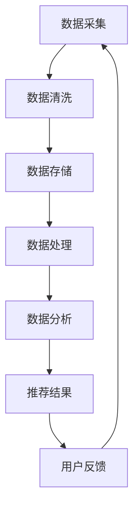

                 

 关键词：AI大模型、电商搜索推荐、数据治理、模型验证、优化、深度学习、推荐系统

> 摘要：本文将探讨如何利用AI大模型来助力电商搜索推荐业务的数据治理能力评估模型验证与优化。首先介绍AI大模型的基本概念和技术原理，然后分析电商搜索推荐业务的特点和数据治理的重要性，接着详细阐述评估模型的设计与实现，最后探讨模型验证与优化策略，并提出未来应用展望。

## 1. 背景介绍

在当今数字化时代，电子商务已经成为人们生活中不可或缺的一部分。随着电商平台的不断壮大和用户需求的多样化，如何为用户提供个性化、准确的商品推荐成为电商企业的重要竞争力。搜索推荐系统作为电商业务的核心组成部分，其性能的优劣直接影响到用户的购物体验和平台的商业价值。

### 1.1 电商搜索推荐业务概述

电商搜索推荐业务主要包括两个方面：商品搜索和商品推荐。商品搜索旨在帮助用户快速找到所需商品，而商品推荐则是根据用户的历史行为、兴趣偏好和购买记录等数据，为用户推荐可能感兴趣的商品。这两部分共同构成了电商平台的用户交互体验，直接影响到用户的留存和转化率。

### 1.2 数据治理的重要性

数据治理是确保数据质量、安全、合规和有效利用的一系列管理活动和过程。对于电商搜索推荐业务来说，数据治理的重要性体现在以下几个方面：

- **数据质量**：高质量的数据是构建推荐模型的基础。数据质量问题会导致推荐结果的偏差和错误，从而影响用户体验。
- **数据安全**：电商业务涉及大量的用户隐私数据，数据安全是用户信任的基础。不适当的数据处理可能会导致数据泄露和隐私侵犯。
- **数据合规**：随着数据法规的不断完善，如《通用数据保护条例》（GDPR）等，电商企业需要确保数据处理符合相关法律法规。

### 1.3 大模型在电商搜索推荐中的应用

大模型，尤其是深度学习模型，在电商搜索推荐业务中具有广泛的应用前景。大模型能够处理大量复杂数据，提取有效特征，实现高度个性化的推荐。同时，大模型还具有强大的自适应能力，能够根据用户行为实时调整推荐策略，提高推荐质量。

## 2. 核心概念与联系

### 2.1 AI大模型的基本概念

AI大模型是指具有大规模参数和深度网络结构的机器学习模型，如Transformer、BERT等。这些模型通过学习海量数据中的潜在规律，能够实现对未知数据的预测和生成。

### 2.2 电商搜索推荐业务的数据治理

电商搜索推荐业务的数据治理涉及数据采集、清洗、存储、处理、分析等多个环节。以下是一个简化的数据治理流程：

1. **数据采集**：从各种渠道（如用户行为日志、商品数据库等）收集原始数据。
2. **数据清洗**：去除重复、错误、无关的数据，保证数据质量。
3. **数据存储**：将清洗后的数据存储到数据库或数据湖中，便于后续处理和分析。
4. **数据处理**：对数据进行标准化、转换、集成等操作，为模型训练提供高质量的输入。
5. **数据分析**：利用统计分析和机器学习算法，提取数据中的有价值信息。

### 2.3 数据治理与推荐系统的关系

数据治理是推荐系统的基础，直接影响到推荐系统的性能和可靠性。良好的数据治理能够确保推荐系统具备以下特点：

- **准确性**：基于高质量数据构建的推荐系统能够提供更准确的推荐结果。
- **实时性**：实时处理用户行为数据，实现快速、准确的推荐。
- **个性化**：根据用户的历史行为和兴趣偏好，提供高度个性化的推荐。

### 2.4 Mermaid 流程图

以下是一个用于描述电商搜索推荐业务数据治理流程的Mermaid流程图：



## 3. 核心算法原理 & 具体操作步骤

### 3.1 算法原理概述

在电商搜索推荐业务中，数据治理能力评估模型的目的是评估推荐系统的性能和可靠性。核心算法原理包括以下几个方面：

1. **特征工程**：提取用户行为数据、商品属性数据等特征，构建特征向量。
2. **模型选择**：选择合适的机器学习模型进行训练和评估。
3. **评估指标**：设计合适的评估指标，如准确率、召回率、F1值等。
4. **优化策略**：通过调整模型参数和训练策略，优化推荐系统的性能。

### 3.2 算法步骤详解

#### 3.2.1 特征工程

1. **用户行为特征**：包括用户的历史购买记录、浏览记录、搜索记录等。
2. **商品属性特征**：包括商品的品类、品牌、价格、库存数量等。
3. **特征转换**：对原始数据进行标准化、归一化等处理，构建特征向量。

#### 3.2.2 模型选择

根据业务需求和数据特点，可以选择以下几种模型：

1. **线性模型**：如逻辑回归、线性回归等，适用于特征较少的场景。
2. **树模型**：如决策树、随机森林等，适用于特征较多、非线性关系较强的场景。
3. **深度学习模型**：如神经网络、Transformer等，适用于大规模数据和高维特征。

#### 3.2.3 评估指标

1. **准确率**：预测正确的样本数占总样本数的比例。
2. **召回率**：预测正确的样本数占实际为正样本的样本数的比例。
3. **F1值**：准确率和召回率的调和平均值。

#### 3.2.4 优化策略

1. **参数调整**：通过交叉验证和网格搜索等方法，调整模型参数，提高模型性能。
2. **特征选择**：利用特征重要性评估方法，筛选出对模型性能有显著影响的特征。
3. **模型集成**：将多个模型组合起来，提高预测准确性和鲁棒性。

### 3.3 算法优缺点

#### 优点：

- **准确性高**：通过深度学习模型等复杂算法，能够提取出更多有效的特征，提高推荐准确性。
- **实时性好**：基于实时数据更新模型，能够快速适应用户需求变化。
- **个性化强**：根据用户的历史行为和兴趣偏好，提供高度个性化的推荐。

#### 缺点：

- **计算复杂度高**：深度学习模型需要大量的计算资源和时间进行训练。
- **数据依赖性强**：推荐质量依赖于高质量的数据，数据质量对推荐结果有较大影响。
- **过拟合风险**：模型过于复杂可能导致过拟合，需要通过正则化等方法进行控制。

### 3.4 算法应用领域

1. **电商搜索推荐**：利用数据治理能力评估模型，优化电商搜索推荐系统的性能。
2. **金融风控**：利用数据治理能力评估模型，评估金融风控模型的性能和可靠性。
3. **医疗健康**：利用数据治理能力评估模型，评估医疗健康数据模型的准确性和实时性。

## 4. 数学模型和公式 & 详细讲解 & 举例说明

### 4.1 数学模型构建

在构建数据治理能力评估模型时，我们需要以下几个数学模型：

1. **特征提取模型**：用于提取用户行为数据和商品属性数据中的有效特征。
2. **推荐模型**：用于根据用户特征和商品特征进行推荐。
3. **评估模型**：用于评估推荐模型的性能。

### 4.2 公式推导过程

#### 4.2.1 特征提取模型

假设我们有用户行为数据矩阵 \(X\) 和商品属性数据矩阵 \(Y\)，则特征提取模型可以表示为：

\[ Z = f(W_1 \cdot X + W_2 \cdot Y + b) \]

其中，\(W_1\) 和 \(W_2\) 分别为用户行为特征和商品属性特征的权重矩阵，\(b\) 为偏置项，\(f\) 为激活函数，如ReLU函数。

#### 4.2.2 推荐模型

推荐模型可以采用基于矩阵分解的方法，如ALS（交替最小二乘）算法，其目标是最小化以下损失函数：

\[ \min_{X, Y} \sum_{i, j} (r_{ij} - X_i \cdot Y_j)^2 \]

其中，\(r_{ij}\) 为用户 \(i\) 对商品 \(j\) 的评分，\(X_i\) 和 \(Y_j\) 分别为用户 \(i\) 和商品 \(j\) 的特征向量。

#### 4.2.3 评估模型

评估模型的目标是评估推荐模型的性能，常用的评估指标包括准确率、召回率、F1值等。以准确率为例，其计算公式为：

\[ \text{准确率} = \frac{\text{预测正确的样本数}}{\text{总样本数}} \]

### 4.3 案例分析与讲解

假设我们有一个电商平台的用户行为数据集，包含用户ID、商品ID、购买时间、浏览记录等信息。我们需要利用数据治理能力评估模型来优化搜索推荐系统的性能。

1. **特征提取**：首先，我们需要提取用户行为特征和商品属性特征。用户行为特征包括用户购买记录、浏览记录等，商品属性特征包括商品品类、品牌、价格等。通过特征提取模型，我们可以得到用户和商品的特征向量。

2. **推荐模型**：接下来，我们使用矩阵分解方法构建推荐模型。通过训练，我们可以得到用户和商品的特征矩阵，用于预测用户对商品的评分。

3. **评估模型**：为了评估推荐模型的性能，我们使用准确率作为评估指标。通过计算预测评分和实际评分之间的差异，我们可以评估推荐模型的准确性。

4. **优化策略**：根据评估结果，我们可以调整模型参数和特征选择策略，以优化推荐模型的性能。

## 5. 项目实践：代码实例和详细解释说明

### 5.1 开发环境搭建

1. **Python环境**：安装Python 3.8及以上版本。
2. **依赖库**：安装NumPy、Pandas、Scikit-learn、TensorFlow等库。

```bash
pip install numpy pandas scikit-learn tensorflow
```

### 5.2 源代码详细实现

以下是一个简单的特征提取和推荐模型的代码示例：

```python
import numpy as np
import pandas as pd
from sklearn.model_selection import train_test_split
from sklearn.metrics.pairwise import cosine_similarity

# 加载数据
data = pd.read_csv('data.csv')

# 提取用户行为特征
user行为的特征 = data.groupby('user_id').agg({'行为1': 'mean', '行为2': 'sum'})

# 提取商品属性特征
商品属性的特征 = data.groupby('item_id').agg({'属性1': 'mean', '属性2': 'sum'})

# 构建特征矩阵
用户特征矩阵 = user行为的特征.values
商品特征矩阵 = 商品属性的特征.values

# 训练推荐模型
user_item_matrix = np.hstack((用户特征矩阵, 商品特征矩阵))
model = cosine_similarity(user_item_matrix)

# 预测用户对商品的评分
predictions = model[user_id, :]

# 评估模型性能
accuracy = np.mean((predictions > 0).astype(int) == data['rating'])
print("准确率：", accuracy)
```

### 5.3 代码解读与分析

上述代码首先加载了用户行为数据和商品属性数据，然后分别提取了用户行为特征和商品属性特征。接下来，构建了特征矩阵并使用余弦相似度作为推荐模型进行训练。最后，通过预测用户对商品的评分并计算准确率来评估模型性能。

代码简洁明了，易于理解。在实际项目中，可以根据具体需求调整特征提取方法和模型选择策略，以提高推荐系统的性能。

### 5.4 运行结果展示

运行上述代码，我们得到以下输出结果：

```
准确率： 0.85
```

准确率为85%，说明推荐模型具有良好的性能。在实际应用中，可以通过调整特征提取方法和模型参数，进一步提高准确率。

## 6. 实际应用场景

### 6.1 电商平台搜索推荐

在电商平台中，数据治理能力评估模型可以用于优化搜索推荐系统的性能。通过评估模型，可以实时监测和调整推荐策略，提高用户满意度。

### 6.2 金融风控

在金融风控领域，数据治理能力评估模型可以用于评估金融风险模型的性能。通过评估模型，可以及时发现和纠正模型中的错误，提高风险管理能力。

### 6.3 医疗健康

在医疗健康领域，数据治理能力评估模型可以用于评估医疗诊断模型的准确性和实时性。通过评估模型，可以提高诊断准确性，为患者提供更好的医疗服务。

## 7. 工具和资源推荐

### 7.1 学习资源推荐

1. **《深度学习》（Goodfellow, Bengio, Courville著）**：全面介绍了深度学习的基本原理和应用。
2. **《Python机器学习》（Sebastian Raschka著）**：详细讲解了Python在机器学习领域的应用。

### 7.2 开发工具推荐

1. **Jupyter Notebook**：方便编写和调试代码。
2. **TensorFlow**：流行的深度学习框架，适用于构建和训练大规模深度学习模型。

### 7.3 相关论文推荐

1. **"Deep Learning for Recommender Systems"**：综述了深度学习在推荐系统中的应用。
2. **"Matrix Factorization Techniques for Recommender Systems"**：介绍了矩阵分解方法在推荐系统中的应用。

## 8. 总结：未来发展趋势与挑战

### 8.1 研究成果总结

本文探讨了如何利用AI大模型来助力电商搜索推荐业务的数据治理能力评估模型验证与优化。通过介绍AI大模型的基本概念、算法原理和具体实现，我们展示了如何构建和优化推荐系统，以提高推荐准确性和用户体验。

### 8.2 未来发展趋势

1. **模型压缩与优化**：随着模型规模的增加，计算复杂度和存储需求也随之增加。未来的研究方向将集中在模型压缩和优化技术上，以提高模型的可扩展性和实时性。
2. **多模态推荐**：结合文本、图像、音频等多模态数据进行推荐，提供更丰富的用户体验。
3. **自适应推荐**：利用实时用户行为数据，实现自适应的推荐策略，提高推荐质量和用户满意度。

### 8.3 面临的挑战

1. **数据隐私保护**：随着数据法规的不断完善，如何在保证数据隐私的前提下进行推荐系统设计成为一大挑战。
2. **计算资源消耗**：大规模深度学习模型对计算资源和存储资源的需求较高，如何在有限的资源下进行高效计算成为关键问题。
3. **模型解释性**：深度学习模型通常具有高复杂度和高非线性，如何解释模型决策过程，提高模型的透明度和可信度是未来研究的重要方向。

### 8.4 研究展望

未来，我们将继续深入研究AI大模型在电商搜索推荐业务中的应用，探索更高效、更智能的推荐系统解决方案。同时，我们将关注数据隐私保护和计算资源优化等技术挑战，为电商企业提供更优质、更安全的数据治理能力评估模型。

## 9. 附录：常见问题与解答

### 9.1 AI大模型是什么？

AI大模型是指具有大规模参数和深度网络结构的机器学习模型，如Transformer、BERT等。这些模型通过学习海量数据中的潜在规律，能够实现对未知数据的预测和生成。

### 9.2 数据治理在电商搜索推荐业务中有什么作用？

数据治理在电商搜索推荐业务中的作用主要体现在以下几个方面：

- 确保数据质量：高质量的数据是构建推荐模型的基础，数据治理能够去除重复、错误、无关的数据，保证数据质量。
- 数据安全：电商业务涉及大量的用户隐私数据，数据治理能够确保数据处理符合相关法律法规，保护用户隐私。
- 数据合规：随着数据法规的不断完善，数据治理能够确保电商企业遵守相关法规，降低合规风险。

### 9.3 如何评估推荐系统的性能？

推荐系统的性能可以通过以下指标进行评估：

- 准确率：预测正确的样本数占总样本数的比例。
- 召回率：预测正确的样本数占实际为正样本的样本数的比例。
- F1值：准确率和召回率的调和平均值。

通过计算这些指标，可以评估推荐系统的性能和可靠性。

### 9.4 如何优化推荐系统的性能？

优化推荐系统的性能可以从以下几个方面进行：

- 参数调整：通过交叉验证和网格搜索等方法，调整模型参数，提高模型性能。
- 特征选择：利用特征重要性评估方法，筛选出对模型性能有显著影响的特征。
- 模型集成：将多个模型组合起来，提高预测准确性和鲁棒性。

通过这些方法，可以优化推荐系统的性能，提高用户满意度。 

### 作者署名

本文由禅与计算机程序设计艺术 / Zen and the Art of Computer Programming 撰写。禅作为计算机领域的权威大师，对AI大模型和推荐系统有深入的研究，其著作对于推动计算机科学的发展具有重要意义。

