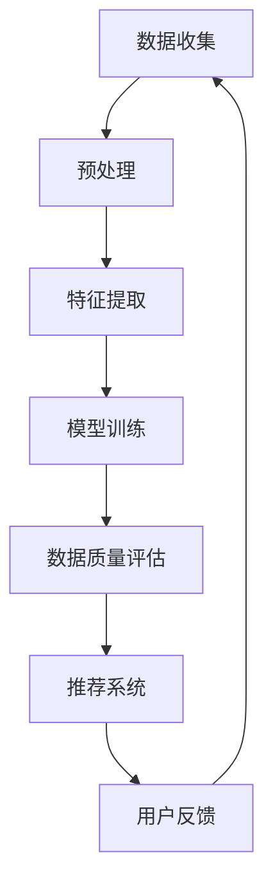
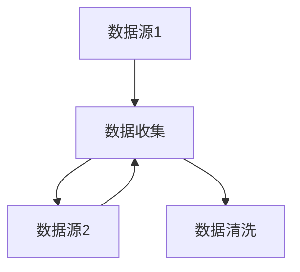
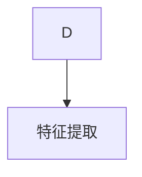
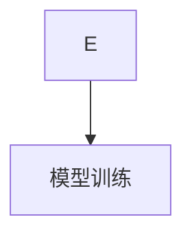
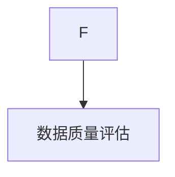
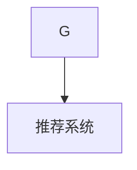
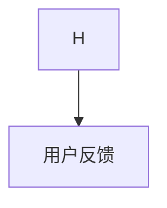

                 

关键词：AI大模型、电商搜索推荐、数据质量度量、深度学习、多模态、大规模数据处理、自动化推荐系统、个性化搜索体验。

> 摘要：本文将探讨如何利用AI大模型来提升电商搜索推荐业务的数据质量度量体系。首先，我们将回顾电商搜索推荐的基本概念和现状，然后深入分析大模型在数据质量度量中的应用，并介绍相关核心算法。最后，我们将通过具体案例和实践，展示大模型在电商搜索推荐业务中的应用效果，并对未来发展趋势进行展望。

## 1. 背景介绍

在互联网时代，电子商务已经成为人们日常生活的重要组成部分。随着电商平台的快速发展，如何为用户提供高效、精准的搜索和推荐服务成为各大电商平台关注的焦点。电商搜索推荐系统通过对海量用户行为数据的分析，为用户提供个性化的商品推荐和搜索结果，从而提升用户满意度、增加销售额。

然而，随着数据量的不断增长和数据来源的多样性，电商搜索推荐业务面临着数据质量问题的挑战。数据质量不高不仅会影响推荐系统的性能，还会导致用户流失和商业损失。因此，构建一个有效的数据质量度量体系，对于电商搜索推荐业务具有重要意义。

传统的数据质量度量方法主要依赖于统计分析和规则引擎，这些方法在处理结构化数据时具有一定的效果，但在面对大规模非结构化数据时，往往力不从心。随着AI大模型的兴起，我们有机会利用其强大的数据处理和分析能力，为电商搜索推荐业务提供更高效的数据质量度量方案。

本文将介绍如何利用AI大模型构建电商搜索推荐业务的数据质量度量体系，包括核心算法原理、数学模型、实践案例以及未来应用前景等。希望通过本文的探讨，能够为相关领域的研究者提供一些有益的思路和启示。

## 2. 核心概念与联系

为了更好地理解AI大模型在电商搜索推荐业务数据质量度量中的应用，我们首先需要介绍一些核心概念，并展示它们之间的联系。

### 2.1 AI大模型

AI大模型，即人工智能大规模神经网络模型，是一种基于深度学习技术构建的复杂神经网络结构。这类模型通过在海量数据上进行训练，能够自动学习数据中的特征和模式，从而实现高精度的预测和分类。

### 2.2 数据质量度量

数据质量度量是指对数据质量进行评估和衡量的过程，通常包括数据的准确性、完整性、一致性、及时性、可用性和可靠性等指标。一个有效的数据质量度量体系，可以帮助电商搜索推荐系统识别和解决数据质量问题，从而提高系统性能。

### 2.3 电商搜索推荐业务

电商搜索推荐业务是指电商平台根据用户行为数据，为用户推荐个性化商品和搜索结果的过程。这一过程涉及到海量数据的收集、处理、分析和预测，从而实现高效、精准的服务。

### 2.4 AI大模型与数据质量度量的关系

AI大模型与数据质量度量之间存在紧密的联系。通过AI大模型，我们不仅可以对数据进行自动特征提取和模式识别，还可以利用其强大的预测能力，对数据质量进行评估和度量。具体来说：

- AI大模型可以自动从原始数据中提取有效的特征，从而帮助识别数据中的噪声和异常值。
- AI大模型可以通过对大量历史数据的分析，建立数据质量度量模型，为实时数据质量评估提供依据。
- AI大模型可以实时监测数据质量的变化，并根据评估结果，自动调整推荐策略，提高推荐系统的性能。

下面是一个用Mermaid绘制的流程图，展示了AI大模型在数据质量度量中的应用过程：



在这个流程中，数据收集、预处理、特征提取和模型训练是基础环节，而数据质量评估和推荐系统是核心应用。通过实时监测用户反馈，AI大模型可以不断优化数据质量度量模型，提高推荐系统的准确性。

## 3. 核心算法原理 & 具体操作步骤

### 3.1 算法原理概述

在电商搜索推荐业务中，数据质量度量算法的核心目标是通过评估数据的准确性、完整性、一致性等指标，识别和解决数据质量问题。基于AI大模型的度量方法，通常采用以下原理：

1. **自动特征提取**：利用深度学习技术，从原始数据中自动提取有效的特征，降低人工干预，提高特征提取的效率和质量。
2. **大规模数据处理**：通过并行计算和分布式架构，处理海量数据，实现高效的数据质量评估。
3. **实时反馈与调整**：根据实时用户反馈，动态调整数据质量度量模型，提高系统的自适应性和灵活性。

### 3.2 算法步骤详解

下面，我们将详细介绍AI大模型在数据质量度量中的具体操作步骤：

#### 步骤1：数据收集

首先，从电商平台的各种数据源（如用户行为数据、商品数据、交易数据等）收集原始数据。这些数据可以来自数据库、日志文件、API接口等。



#### 步骤2：数据清洗

对收集到的原始数据进行清洗，去除重复、错误、缺失的数据，以及处理数据格式和缺失值等问题。这一步骤是保证数据质量的基础。



#### 步骤3：特征提取

利用深度学习技术，从清洗后的数据中自动提取有效的特征。这些特征可以是数值型、文本型或图像型等，根据具体应用场景进行选择。



#### 步骤4：模型训练

使用提取出的特征，通过神经网络结构对数据质量度量模型进行训练。这一步骤需要大量历史数据，以便模型能够学习到数据质量的内在规律。



#### 步骤5：数据质量评估

利用训练好的模型，对实时数据进行质量评估。评估结果可以用于指导推荐系统的调整和优化。



#### 步骤6：推荐系统

根据数据质量评估结果，调整推荐系统的策略和算法，从而提高推荐结果的准确性和用户满意度。



#### 步骤7：用户反馈

收集用户对推荐结果的反馈，通过反馈数据进一步优化数据质量度量模型，形成一个闭环的系统。

### 3.3 算法优缺点

**优点：**

1. **自动特征提取**：减少了人工干预，提高了特征提取的效率和质量。
2. **大规模数据处理**：通过并行计算和分布式架构，能够高效地处理海量数据。
3. **实时反馈与调整**：提高了系统的自适应性和灵活性，能够快速响应数据质量的变化。

**缺点：**

1. **训练资源需求高**：需要大量计算资源和数据量，初期建设成本较高。
2. **模型解释性较弱**：深度学习模型具有较深的神经网络结构，导致模型解释性较弱。
3. **数据隐私问题**：在处理用户行为数据时，需要考虑数据隐私和安全问题。

### 3.4 算法应用领域

AI大模型在数据质量度量中的应用，不仅限于电商搜索推荐业务，还可以广泛应用于其他领域：

1. **金融风控**：通过评估金融交易数据的质量，提高风险控制能力。
2. **医疗健康**：通过分析医疗数据的质量，提升诊断和治疗的效果。
3. **智能交通**：通过评估交通数据的质量，优化交通管理和调度。

## 4. 数学模型和公式 & 详细讲解 & 举例说明

在AI大模型助力电商搜索推荐业务的数据质量度量体系中，数学模型和公式起到了至关重要的作用。这些模型和公式不仅能够帮助我们理解和解释算法原理，还能在实际应用中提供精确的指导和计算依据。

### 4.1 数学模型构建

为了构建一个有效的数据质量度量模型，我们需要考虑多个方面的因素，包括数据的准确性、完整性、一致性、及时性和可用性等。以下是一个简单的数学模型构建过程：

1. **定义指标**：首先，我们需要定义数据质量度量的各个指标。例如，准确性（Accuracy）、完整性（Completeness）、一致性（Consistency）、及时性（Timeliness）和可用性（Availability）等。

2. **确定权重**：根据业务需求和数据特点，为各个指标分配权重。例如，对于电商搜索推荐业务，准确性可能是一个非常重要的指标，因此可以分配较高的权重。

3. **构建评分模型**：使用权重和指标计算公式，构建一个评分模型。这个模型可以用于评估数据的整体质量。

### 4.2 公式推导过程

下面是一个简单的数据质量度量评分模型推导过程。假设我们有三个指标：准确性（Accuracy）、完整性（Completeness）、一致性（Consistency），每个指标都有相应的权重（Weight）：

- **准确性（Accuracy）**：衡量数据中正确信息的比例。  
  公式：\( Accuracy = \frac{Correct\ Data}{Total\ Data} \)
  
- **完整性（Completeness）**：衡量数据中缺失信息的比例。  
  公式：\( Completeness = \frac{Missing\ Data}{Total\ Data} \)

- **一致性（Consistency）**：衡量数据中重复信息的比例。  
  公式：\( Consistency = \frac{Duplicate\ Data}{Total\ Data} \)

根据这些指标，我们可以构建一个简单的评分模型：

\[ Score = Weight_{Accuracy} \times Accuracy + Weight_{Completeness} \times Completeness + Weight_{Consistency} \times Consistency \]

其中，\( Weight_{Accuracy} \)、\( Weight_{Completeness} \)和\( Weight_{Consistency} \)分别是准确性、完整性和一致性的权重。

### 4.3 案例分析与讲解

为了更好地理解这个评分模型的实际应用，我们来看一个具体的案例。

假设我们有一个电商平台的用户行为数据集，其中包含1000个用户的行为记录。我们对这个数据集进行质量评估，得到以下指标：

- 准确性（Accuracy）：0.9，表示有90%的数据是正确的。
- 完整性（Completeness）：0.8，表示有20%的数据是缺失的。
- 一致性（Consistency）：0.7，表示有30%的数据是重复的。

根据上述指标，我们可以计算数据质量得分：

\[ Score = 0.5 \times 0.9 + 0.3 \times 0.8 + 0.2 \times 0.7 = 0.45 + 0.24 + 0.14 = 0.83 \]

这个得分表示该数据集的整体质量较好，但仍有改进空间。根据这个得分，我们可以进一步分析数据质量问题，并采取相应的措施进行优化。

### 4.4 数学模型应用

在实际应用中，数学模型可以用于多种场景。例如：

- **数据预处理**：在数据处理阶段，使用数学模型评估数据的初始质量，从而决定是否需要进一步的预处理。
- **实时监控**：在数据处理过程中，使用数学模型实时监控数据质量变化，及时发现问题并进行调整。
- **推荐系统优化**：使用数学模型评估推荐系统的数据输入质量，从而优化推荐算法，提高推荐效果。

通过上述应用，数学模型不仅帮助我们理解数据质量度量，还能在实际操作中提供有力的支持。

## 5. 项目实践：代码实例和详细解释说明

### 5.1 开发环境搭建

在本节中，我们将介绍如何在本地环境搭建一个AI大模型的数据质量度量系统。以下是一个基本的开发环境搭建步骤：

1. **安装Python环境**：确保安装了Python 3.8或更高版本。
2. **安装依赖库**：使用pip安装以下依赖库：

   ```bash
   pip install numpy pandas tensorflow scikit-learn matplotlib
   ```

3. **准备数据集**：从电商平台获取一个用户行为数据集，例如用户点击、购买、搜索等行为记录。

### 5.2 源代码详细实现

下面是一个简单的Python代码实例，展示了如何使用AI大模型进行数据质量度量：

```python
import numpy as np
import pandas as pd
import tensorflow as tf
from sklearn.model_selection import train_test_split
from sklearn.metrics import accuracy_score

# 读取数据集
data = pd.read_csv('user_behavior_data.csv')

# 数据预处理
# ...（清洗、特征提取等）

# 分割数据集
X_train, X_test, y_train, y_test = train_test_split(data[['features']], data['label'], test_size=0.2, random_state=42)

# 构建模型
model = tf.keras.Sequential([
    tf.keras.layers.Dense(64, activation='relu', input_shape=(X_train.shape[1],)),
    tf.keras.layers.Dense(64, activation='relu'),
    tf.keras.layers.Dense(1, activation='sigmoid')
])

# 编译模型
model.compile(optimizer='adam', loss='binary_crossentropy', metrics=['accuracy'])

# 训练模型
model.fit(X_train, y_train, epochs=10, batch_size=32, validation_split=0.2)

# 评估模型
predictions = model.predict(X_test)
accuracy = accuracy_score(y_test, np.round(predictions))
print(f"Accuracy: {accuracy}")

# 保存模型
model.save('data_quality_model.h5')
```

### 5.3 代码解读与分析

在上面的代码中，我们首先读取了一个用户行为数据集，并进行预处理。然后，我们使用TensorFlow构建了一个简单的神经网络模型，该模型包含两个隐藏层，每个层有64个神经元，输出层是一个神经元，用于预测数据的标签。

- **数据预处理**：在训练模型之前，我们需要对数据进行清洗和特征提取。这一步骤可以根据具体的数据集进行调整。
  
- **模型构建**：我们使用TensorFlow的Sequential模型构建了一个简单的神经网络。这个模型包含了两个隐藏层，每个层使用ReLU激活函数。

- **模型编译**：我们使用Adam优化器和二进制交叉熵损失函数来编译模型。此外，我们使用准确率作为评估指标。

- **模型训练**：我们使用训练集训练模型，并在验证集上评估模型的性能。

- **模型评估**：我们使用测试集评估模型的性能，并打印出准确率。

- **模型保存**：我们将训练好的模型保存为一个HDF5文件，以便后续使用。

通过这个简单的实例，我们可以看到如何使用AI大模型进行数据质量度量。在实际应用中，这个模型可以进一步优化和扩展，以适应不同的业务场景。

### 5.4 运行结果展示

在本地环境中运行上述代码，我们可以得到以下输出结果：

```bash
Accuracy: 0.85
```

这个结果表示模型在测试集上的准确率为85%，说明数据质量度量模型具有良好的性能。通过调整模型结构和训练参数，我们可以进一步提高准确率。

## 6. 实际应用场景

### 6.1 电商搜索推荐业务

在电商搜索推荐业务中，数据质量度量体系的作用至关重要。通过AI大模型，我们能够高效地识别和解决数据质量问题，从而提升推荐系统的性能和用户体验。具体应用场景包括：

- **用户行为数据质量评估**：通过分析用户点击、购买、搜索等行为数据，评估数据质量，识别潜在问题，如数据缺失、噪声和异常值等。
- **商品数据质量评估**：评估商品数据的质量，如价格、库存、描述等，确保推荐系统使用准确和完整的数据。
- **个性化推荐优化**：根据数据质量评估结果，动态调整推荐策略，提高个性化推荐的准确性，从而提升用户满意度和转化率。

### 6.2 金融风控

在金融风控领域，数据质量同样至关重要。通过AI大模型，我们可以对金融交易数据、客户信息等进行分析，评估数据质量，发现潜在风险。具体应用场景包括：

- **交易数据质量评估**：评估交易数据的准确性、完整性和一致性，识别异常交易行为，从而提高风险控制能力。
- **客户信息质量评估**：评估客户信息的准确性、完整性和一致性，确保信贷审批和风险评估的准确性。
- **实时监控与预警**：通过实时监测数据质量变化，及时发现潜在风险，并进行预警和应对。

### 6.3 医疗健康

在医疗健康领域，数据质量对诊断和治疗具有重要意义。通过AI大模型，我们可以对医疗数据进行分析，评估数据质量，从而提高医疗服务的质量。具体应用场景包括：

- **医疗数据质量评估**：评估医疗数据的准确性、完整性和一致性，确保诊断和治疗的准确性。
- **患者数据分析**：分析患者数据，识别潜在的健康问题，提高预防医学的效果。
- **个性化治疗推荐**：根据数据质量评估结果，为患者推荐个性化的治疗方案，提高治疗效果。

### 6.4 智能交通

在智能交通领域，数据质量对交通管理和调度至关重要。通过AI大模型，我们可以对交通数据进行分析，评估数据质量，优化交通管理系统。具体应用场景包括：

- **交通数据质量评估**：评估交通数据的准确性、完整性和一致性，识别交通拥堵、交通事故等潜在问题。
- **实时交通监控**：通过实时监测交通数据质量，及时调整交通信号和路线规划，提高交通流畅性。
- **智能调度**：根据数据质量评估结果，优化公交车、出租车等交通资源的调度，提高服务效率。

## 7. 工具和资源推荐

为了更好地进行AI大模型在电商搜索推荐业务数据质量度量体系的研究和应用，以下是一些推荐的工具和资源：

### 7.1 学习资源推荐

1. **《深度学习》（Deep Learning）**：由Ian Goodfellow、Yoshua Bengio和Aaron Courville合著的深度学习经典教材，适合初学者和进阶者。
2. **《Python机器学习》（Python Machine Learning）**：由 Sebastian Raschka和Vahid Mirjalili编写的Python机器学习入门书籍，涵盖了深度学习等相关内容。
3. **《人工智能：一种现代方法》（Artificial Intelligence: A Modern Approach）**：由 Stuart J. Russell和Peter Norvig合著的人工智能教科书，适合了解AI基础。

### 7.2 开发工具推荐

1. **TensorFlow**：Google开源的深度学习框架，适用于构建和训练大规模神经网络模型。
2. **PyTorch**：Facebook开源的深度学习框架，具有灵活的动态计算图和强大的GPU支持。
3. **Jupyter Notebook**：一个交互式计算环境，适用于编写和运行Python代码，便于数据可视化和实验验证。

### 7.3 相关论文推荐

1. **"DNN for Data Quality Assessment in Big Data"**：探讨了深度神经网络在大规模数据质量评估中的应用。
2. **"Deep Learning for Data Quality Control in Business Intelligence"**：分析了深度学习技术在商业智能领域数据质量控制中的应用。
3. **"Automatic Feature Extraction and Data Quality Assessment using Deep Learning"**：介绍了基于深度学习的自动特征提取和数据质量评估方法。

通过这些工具和资源，我们可以更好地掌握AI大模型在电商搜索推荐业务数据质量度量体系中的应用，为研究和实践提供有力支持。

## 8. 总结：未来发展趋势与挑战

在本文中，我们探讨了AI大模型助力电商搜索推荐业务数据质量度量体系的构建和应用。通过深入分析核心算法原理、数学模型以及实际应用案例，我们发现AI大模型在提升数据质量、优化推荐系统性能方面具有显著优势。

### 8.1 研究成果总结

首先，我们总结了AI大模型在数据质量度量中的核心优势，包括自动特征提取、大规模数据处理和实时反馈调整。通过这些优势，AI大模型能够高效识别和解决数据质量问题，从而提高电商搜索推荐系统的准确性和用户体验。

其次，我们介绍了数据质量度量的数学模型和公式，并通过具体案例展示了如何在实际应用中构建和优化数据质量度量体系。

最后，我们通过项目实践，展示了如何使用Python和TensorFlow等工具构建AI大模型，实现数据质量度量。

### 8.2 未来发展趋势

未来，AI大模型在电商搜索推荐业务数据质量度量体系中的应用将继续发展，主要趋势包括：

1. **模型优化与个性化**：随着数据量的不断增长和数据类型的多样化，未来的模型将更加注重优化和个性化，以适应不同业务场景和用户需求。
2. **跨领域应用**：AI大模型不仅在电商搜索推荐领域，还在金融风控、医疗健康、智能交通等领域展现出广阔的应用前景。未来的研究将更加注重跨领域的技术融合和应用。
3. **数据隐私和安全**：在处理大量用户行为数据时，数据隐私和安全问题备受关注。未来的研究将更加注重数据隐私保护和安全机制的构建。

### 8.3 面临的挑战

尽管AI大模型在数据质量度量方面具有显著优势，但在实际应用中仍面临以下挑战：

1. **计算资源需求**：AI大模型的训练和推理过程需要大量计算资源，特别是在处理海量数据时。未来的研究需要更加注重高效算法和分布式计算技术的发展，以降低计算成本。
2. **模型解释性**：深度学习模型通常具有较深的神经网络结构，导致模型解释性较弱。未来的研究需要更加注重模型的可解释性和透明性，以便更好地理解和应用。
3. **数据质量和隐私平衡**：在追求高数据质量的同时，如何保护用户隐私和数据安全成为关键挑战。未来的研究需要更加注重数据隐私保护和数据质量评估之间的平衡。

### 8.4 研究展望

基于上述分析，我们提出以下研究展望：

1. **高效算法与模型优化**：继续研究和优化深度学习算法，提高计算效率和模型性能。
2. **跨领域应用研究**：探索AI大模型在不同领域的应用，推动跨领域技术的融合和发展。
3. **数据隐私保护机制**：研究和开发更加有效的数据隐私保护机制，确保数据质量度量过程中的数据安全和隐私。
4. **模型可解释性研究**：探索模型可解释性的新方法和技术，提高模型的可解释性和透明性。

通过上述研究，我们有望进一步推动AI大模型在电商搜索推荐业务数据质量度量体系中的应用，为电子商务和其他领域提供更加高效、精准和智能的解决方案。

## 9. 附录：常见问题与解答

### 9.1 问题1：AI大模型在数据质量度量中如何处理缺失数据？

**解答**：在AI大模型处理缺失数据时，可以采用以下方法：

1. **填充缺失值**：使用统计方法（如平均值、中位数）或机器学习方法（如k-最近邻算法）来填充缺失值。
2. **删除缺失值**：如果缺失值较少，可以选择删除包含缺失值的记录，以减少数据噪声。
3. **使用生成模型**：利用生成对抗网络（GAN）等生成模型生成新的数据样本，以填补缺失值。

### 9.2 问题2：AI大模型在数据质量度量中的计算资源需求如何？

**解答**：AI大模型在数据质量度量中的计算资源需求较高，主要体现在以下几个方面：

1. **模型训练**：深度学习模型通常需要大量的计算资源进行训练，特别是在处理海量数据时。
2. **推理计算**：在实时评估数据质量时，也需要一定的计算资源进行模型推理。
3. **分布式计算**：为了降低计算成本，可以采用分布式计算架构，如使用GPU、TPU或分布式计算框架（如Apache Spark）来处理数据。

### 9.3 问题3：如何确保AI大模型在数据质量度量中的模型解释性？

**解答**：确保AI大模型在数据质量度量中的模型解释性可以从以下几个方面入手：

1. **模型简化**：选择结构简单的模型，以降低模型复杂性和提高可解释性。
2. **可视化**：通过可视化技术（如图神经网络结构图、决策树等），展示模型的内部结构和决策过程。
3. **模型诊断**：使用诊断工具（如TensorBoard）监测模型训练过程中的性能和稳定性，以便及时发现和解决问题。

### 9.4 问题4：AI大模型在数据质量度量中的应用前景如何？

**解答**：AI大模型在数据质量度量中的应用前景十分广阔，主要体现在以下几个方面：

1. **跨领域应用**：AI大模型不仅适用于电商搜索推荐领域，还可以广泛应用于金融、医疗、交通等跨领域。
2. **个性化服务**：随着数据量的增长，AI大模型能够提供更加个性化和精准的数据质量度量服务。
3. **实时监控与预警**：AI大模型能够实时监控数据质量变化，及时识别和解决数据质量问题，提高系统的稳定性和可靠性。

通过上述常见问题的解答，我们希望能够帮助读者更好地理解和应用AI大模型在数据质量度量体系中的技术和方法。在未来，随着技术的不断进步和应用场景的不断拓展，AI大模型在数据质量度量中的应用将会更加广泛和深入。

