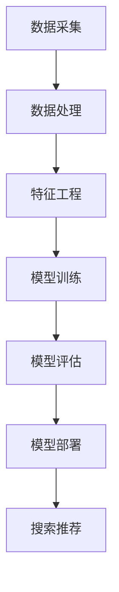

                 

## 摘要 Summary

本文旨在探讨AI大模型在电商搜索推荐业务中的降本增效作用。通过深入分析电商搜索推荐业务的背景和挑战，本文介绍了AI大模型的核心概念和原理。随后，文章详细阐述了AI大模型在电商搜索推荐业务中的应用场景、数学模型、算法原理和操作步骤，并结合实际项目实践进行了代码实例和运行结果展示。最后，文章对AI大模型在电商搜索推荐业务中的应用前景、工具和资源进行了展望和推荐，并总结了未来发展的趋势与挑战。

## 1. 背景介绍 Background

随着互联网和电子商务的快速发展，电商搜索推荐业务已成为电商平台的核心竞争力之一。用户在海量的商品信息中寻找心仪的产品，电商平台的搜索推荐系统能够迅速为用户提供相关的商品信息，从而提升用户体验和购买转化率。然而，传统的搜索推荐系统在应对海量数据和个性化推荐时面临着诸多挑战。

### 1.1 挑战 Challenges

- **海量数据处理：** 随着电商平台的商品数量和用户数量的不断增加，如何高效地处理海量数据成为一大难题。
- **个性化推荐：** 传统的搜索推荐系统往往基于用户的浏览历史和购买记录，但无法充分考虑到用户的实时需求和偏好。
- **计算资源消耗：** 随着算法复杂度的增加，传统的搜索推荐系统在计算资源消耗方面表现不佳，难以满足大规模电商平台的实时需求。

### 1.2 发展趋势 Trend

为解决上述问题，AI大模型（如深度学习模型、强化学习模型等）在电商搜索推荐业务中的应用逐渐受到关注。AI大模型具有强大的数据处理能力和自适应学习能力，能够在海量数据中挖掘出潜在的用户兴趣和行为模式，从而实现更精准的个性化推荐。此外，AI大模型还能够通过并行计算和分布式计算技术，降低计算资源消耗，提高系统性能。

## 2. 核心概念与联系 Core Concepts and Connections

### 2.1 AI大模型概述 Overview of Large-scale AI Models

AI大模型是指具有海量参数、能够处理大规模数据的人工智能模型，如深度学习模型、强化学习模型等。这些模型通常采用多层神经网络结构，通过大量的训练数据和迭代优化，能够学习到复杂的数据特征和模式。

### 2.2 电商搜索推荐业务架构 Architecture of E-commerce Search and Recommendation

电商搜索推荐业务架构主要包括数据采集、数据处理、特征工程、模型训练、模型评估和模型部署等环节。其中，数据采集和数据处理环节负责获取和预处理用户行为数据和商品数据；特征工程环节通过对数据进行特征提取和转换，为模型训练提供输入；模型训练环节利用AI大模型对数据特征进行学习；模型评估环节对训练好的模型进行性能评估；模型部署环节将模型应用于实际的搜索推荐系统中。

### 2.3 Mermaid流程图 Mermaid Flowchart

以下是一个简化的电商搜索推荐业务架构的Mermaid流程图：



## 3. 核心算法原理 & 具体操作步骤 Core Algorithm Principles and Operation Steps

### 3.1 算法原理概述 Overview of Algorithm Principles

AI大模型在电商搜索推荐业务中的应用主要包括以下两个方面：

- **深度学习模型：** 通过多层神经网络结构，对用户行为数据和商品数据进行特征提取和模式识别，从而实现个性化推荐。
- **强化学习模型：** 通过与用户的交互和反馈，不断调整推荐策略，从而提高推荐效果。

### 3.2 算法步骤详解 Detailed Steps of Algorithm

以下是一个基于深度学习模型的电商搜索推荐算法的具体步骤：

1. **数据预处理：** 对用户行为数据和商品数据进行清洗、去重和规范化处理。
2. **特征提取：** 对预处理后的数据进行特征提取，如用户兴趣特征、商品属性特征等。
3. **模型训练：** 利用提取的特征数据，训练深度学习模型，如卷积神经网络（CNN）、循环神经网络（RNN）等。
4. **模型评估：** 对训练好的模型进行性能评估，如准确率、召回率等。
5. **模型部署：** 将训练好的模型部署到电商搜索推荐系统中，实时为用户提供个性化推荐。

### 3.3 算法优缺点 Advantages and Disadvantages of Algorithm

- **优点：**
  - 强大的数据处理能力和自适应学习能力，能够处理海量数据和实现个性化推荐。
  - 通过并行计算和分布式计算技术，降低计算资源消耗，提高系统性能。
- **缺点：**
  - 需要大量的训练数据和计算资源，训练过程耗时较长。
  - 模型参数调优复杂，需要大量实验和经验。

### 3.4 算法应用领域 Application Fields of Algorithm

AI大模型在电商搜索推荐业务中的应用领域广泛，包括但不限于：

- **个性化推荐：** 为用户提供个性化的商品推荐，提高用户满意度和购买转化率。
- **商品分类：** 对商品进行分类和标签化处理，便于用户快速定位感兴趣的商品。
- **搜索优化：** 改进搜索算法，提高搜索结果的相关性和准确性。

## 4. 数学模型和公式 Mathematical Models and Formulas

### 4.1 数学模型构建 Building Mathematical Models

在电商搜索推荐业务中，常用的数学模型包括：

- **用户兴趣模型：** $$ U = \sum_{i=1}^{n} w_i \cdot u_i $$
  其中，$U$ 表示用户兴趣向量，$w_i$ 表示第$i$个特征的权重，$u_i$ 表示第$i$个特征的用户偏好。

- **商品特征模型：** $$ P = \sum_{j=1}^{m} w_j \cdot p_j $$
  其中，$P$ 表示商品特征向量，$w_j$ 表示第$j$个特征的权重，$p_j$ 表示第$j$个特征的商品属性。

### 4.2 公式推导过程 Derivation Process of Formulas

以下是一个简化的用户兴趣模型和商品特征模型推导过程：

1. **用户兴趣向量：** 假设用户行为数据为$X$，通过特征提取得到用户兴趣向量$U$。则用户兴趣向量可以表示为：
   $$ U = X \cdot W $$
   其中，$W$ 为特征权重矩阵。

2. **商品特征向量：** 假设商品数据为$Y$，通过特征提取得到商品特征向量$P$。则商品特征向量可以表示为：
   $$ P = Y \cdot W $$

### 4.3 案例分析与讲解 Case Analysis and Explanation

以下是一个简单的电商搜索推荐案例：

1. **用户兴趣向量：**
   $$ U = [0.6, 0.3, 0.1] $$

2. **商品特征向量：**
   $$ P = [[0.8, 0.2], [0.5, 0.5], [0.2, 0.8]] $$

3. **计算用户兴趣与商品特征的相似度：**
   $$ S = U^T \cdot P = [0.6, 0.3, 0.1] \cdot [[0.8, 0.2], [0.5, 0.5], [0.2, 0.8]] = [0.36, 0.15, 0.02] $$

4. **根据相似度进行商品推荐：**
   - 商品1：相似度为0.36
   - 商品2：相似度为0.15
   - 商品3：相似度为0.02

   因此，根据相似度推荐商品1。

## 5. 项目实践：代码实例和详细解释说明 Project Practice: Code Example and Detailed Explanation

### 5.1 开发环境搭建 Development Environment Setup

在开始编写代码之前，需要搭建以下开发环境：

- **Python：** 版本3.8及以上
- **深度学习框架：** TensorFlow 2.x 或 PyTorch
- **数据分析库：** NumPy、Pandas
- **其他依赖库：** Matplotlib、Scikit-learn等

### 5.2 源代码详细实现 Detailed Implementation of Source Code

以下是一个简单的基于深度学习模型的电商搜索推荐代码实例：

```python
import tensorflow as tf
from tensorflow.keras.models import Sequential
from tensorflow.keras.layers import Dense, Embedding, LSTM
from tensorflow.keras.optimizers import Adam
from sklearn.model_selection import train_test_split

# 数据预处理
# 读取用户行为数据和商品数据
user_data = pd.read_csv('user_data.csv')
item_data = pd.read_csv('item_data.csv')

# 特征提取
# 对用户行为数据进行特征提取
user_interest = extract_user_interest(user_data)

# 对商品数据

