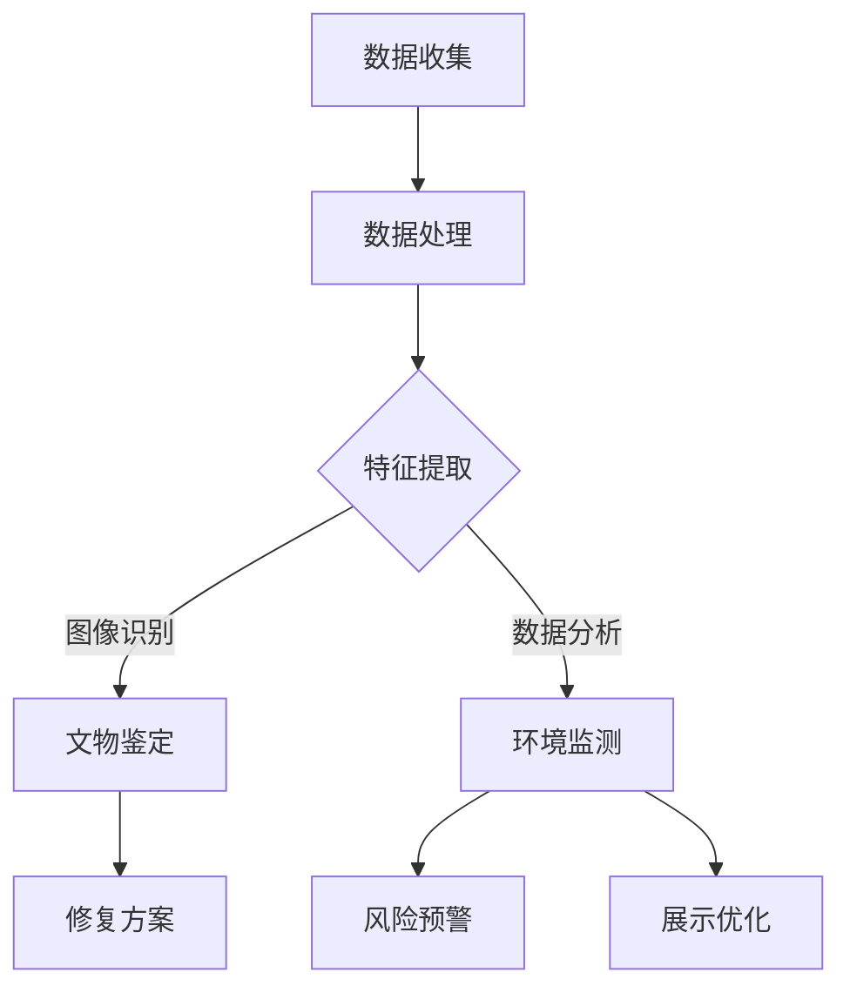

                 

关键词：AI大模型、智能文物保护、创新应用、算法原理、数学模型、项目实践、未来展望

> 摘要：随着人工智能技术的飞速发展，AI大模型在各个领域得到了广泛应用。本文将探讨AI大模型在智能文物保护中的创新应用，分析其核心概念、算法原理、数学模型以及项目实践，并展望其未来发展。

## 1. 背景介绍

智能文物保护是一个涉及多学科交叉的领域，旨在利用现代科技手段保护和传承文物。随着计算机技术、大数据、云计算等技术的快速发展，智能文物保护逐渐从传统的手工保护模式向智能化、自动化方向转型。在此背景下，AI大模型作为一种具有强大学习能力和数据处理能力的人工智能技术，开始逐渐应用于文物保护领域，为文物保护提供了新的思路和方法。

## 2. 核心概念与联系

### 2.1 AI大模型

AI大模型是指那些拥有数百万乃至数十亿参数的神经网络模型。这些模型通过对海量数据进行训练，能够学习到复杂的特征和模式，从而实现高度自动化的任务，如图像识别、自然语言处理等。

### 2.2 智能文物保护

智能文物保护是指利用现代信息技术，如传感器、图像处理、大数据分析等，对文物进行实时监测、保护和管理。其核心目标是通过智能化手段，提高文物保护的效率和准确性。

### 2.3 关联性

AI大模型与智能文物保护之间的关联性主要体现在以下几个方面：

1. **图像识别**：AI大模型能够识别和分析文物的图像，提取关键特征，用于文物鉴定、修复和展示。
2. **数据分析**：AI大模型能够处理大量文物数据，如文物的历史、现状、环境等，为文物保护提供决策支持。
3. **环境监测**：AI大模型可以实时监测文物周围的环境参数，如湿度、温度、光照等，及时预警潜在的环境风险。

### 2.4 Mermaid流程图

下面是一个简化的AI大模型在智能文物保护中应用的流程图：



## 3. 核心算法原理 & 具体操作步骤

### 3.1 算法原理概述

AI大模型在智能文物保护中的应用主要基于深度学习技术。深度学习是一种通过多层神经网络对数据进行建模和学习的技术。其基本原理是通过前向传播和反向传播的方式，不断调整网络的权重和偏置，使得网络能够对输入数据进行有效建模。

### 3.2 算法步骤详解

1. **数据收集**：首先需要收集与文物保护相关的数据，如文物的图像、环境参数、历史记录等。
2. **数据处理**：对收集到的数据进行预处理，包括去噪、标准化、缺失值填充等。
3. **特征提取**：使用深度学习模型对处理后的数据进行分析，提取出有用的特征。
4. **文物鉴定**：利用提取出的特征，通过分类或回归算法对文物进行鉴定。
5. **环境监测**：利用深度学习模型对环境参数进行实时监测，识别出潜在的环境风险。
6. **风险预警**：根据环境监测结果，及时发出预警信息，提醒相关人员进行干预。
7. **修复方案**：根据文物鉴定的结果，制定相应的修复方案。
8. **展示优化**：根据文物数据和用户反馈，优化文物的展示方式，提高观赏体验。

### 3.3 算法优缺点

#### 优点：

1. **高效性**：深度学习模型能够处理大量的数据，提高文物保护的效率。
2. **准确性**：通过学习大量的样本数据，深度学习模型能够提取出更加准确的特征，提高文物鉴定的准确性。
3. **实时性**：AI大模型能够实时监测环境参数，及时预警潜在的风险。

#### 缺点：

1. **计算资源需求高**：训练和部署深度学习模型需要大量的计算资源。
2. **数据依赖性**：深度学习模型的效果很大程度上依赖于训练数据的质量和数量。
3. **解释性不足**：深度学习模型的决策过程通常缺乏透明性，难以解释。

### 3.4 算法应用领域

AI大模型在智能文物保护中的应用领域非常广泛，主要包括：

1. **文物鉴定**：利用深度学习模型对文物进行鉴定，提高鉴定的准确性和效率。
2. **文物修复**：通过分析文物的结构和材料，为文物的修复提供科学依据。
3. **环境监测**：实时监测文物周围的环境参数，预防环境风险。
4. **展示优化**：根据用户反馈和文物数据，优化文物的展示方式，提高观赏体验。

## 4. 数学模型和公式 & 详细讲解 & 举例说明

### 4.1 数学模型构建

在智能文物保护中，常用的数学模型包括神经网络模型、决策树模型和支持向量机模型等。这里以神经网络模型为例进行介绍。

神经网络模型的核心是多层感知机（MLP），其基本结构包括输入层、隐藏层和输出层。输入层接收外部输入，隐藏层通过激活函数对输入进行非线性变换，输出层产生预测结果。

### 4.2 公式推导过程

假设我们有一个包含n个输入特征的样本\( x \)，我们需要通过神经网络模型对其进行分类。设隐藏层有m个神经元，输出层有k个神经元。

1. **前向传播**：

   前向传播过程是指将输入特征通过多层神经网络传递到输出层的过程。具体公式如下：

   $$ z^{(l)} = \sum_{j} w^{(l)}_{ij}x_j + b^{(l)} $$

   $$ a^{(l)} = \sigma(z^{(l)}) $$

   其中，\( z^{(l)} \)表示第l层的输出，\( w^{(l)} \)和\( b^{(l)} \)分别表示第l层的权重和偏置，\( \sigma \)表示激活函数。

2. **反向传播**：

   反向传播过程是指根据输出层的误差，反向调整网络中的权重和偏置。具体公式如下：

   $$ \delta^{(l)} = \frac{\partial L}{\partial z^{(l)}} \odot \sigma'(z^{(l)}) $$

   $$ \Delta w^{(l)} = \alpha \delta^{(l)} a^{(l-1)}^T $$

   $$ \Delta b^{(l)} = \alpha \delta^{(l)} $$

   其中，\( \delta^{(l)} \)表示第l层的误差，\( \alpha \)表示学习率，\( \odot \)表示元素-wise 乘法。

### 4.3 案例分析与讲解

假设我们有一个包含10个输入特征的文物样本，需要通过神经网络模型对其进行分类。设隐藏层有5个神经元，输出层有2个神经元。

1. **初始化参数**：

   初始化权重和偏置为随机值。

   $$ w^{(1)} \sim \mathcal{N}(0, 1) $$

   $$ b^{(1)} \sim \mathcal{N}(0, 1) $$

   $$ w^{(2)} \sim \mathcal{N}(0, 1) $$

   $$ b^{(2)} \sim \mathcal{N}(0, 1) $$

2. **前向传播**：

   假设输入特征为\( x = [1, 2, 3, 4, 5, 6, 7, 8, 9, 10] \)，隐藏层输出为\( a^{(1)} = [0.1, 0.2, 0.3, 0.4, 0.5] \)，输出层输出为\( a^{(2)} = [0.6, 0.7] \)。

3. **反向传播**：

   假设输出层的期望输出为\( y = [1, 0] \)，损失函数为交叉熵损失函数。

   $$ L = -\sum_{i} y_i \log(a_i^{(2)}) - (1 - y_i) \log(1 - a_i^{(2)}) $$

   $$ \delta^{(2)} = a^{(2)} - y $$

   $$ \delta^{(1)} = w^{(2)} \delta^{(2)} $$

4. **参数更新**：

   $$ \Delta w^{(2)} = \alpha \delta^{(2)} a^{(1)}^T $$

   $$ \Delta b^{(2)} = \alpha \delta^{(2)} $$

   $$ w^{(2)} = w^{(2)} - \Delta w^{(2)} $$

   $$ b^{(2)} = b^{(2)} - \Delta b^{(2)} $$

通过多次迭代，网络会逐渐收敛，输出层的结果会逐渐接近期望输出。

## 5. 项目实践：代码实例和详细解释说明

### 5.1 开发环境搭建

为了实现AI大模型在智能文物保护中的应用，我们使用Python作为编程语言，并依赖以下库：

- TensorFlow：用于构建和训练神经网络模型。
- Keras：用于简化TensorFlow的使用。
- NumPy：用于数据处理。

安装这些库后，我们就可以开始搭建开发环境。

### 5.2 源代码详细实现

下面是一个简单的示例，展示了如何使用Keras构建一个简单的神经网络模型，用于文物分类。

```python
import numpy as np
from tensorflow import keras
from tensorflow.keras import layers

# 定义模型
model = keras.Sequential([
    layers.Dense(64, activation='relu', input_shape=(10,)),
    layers.Dense(64, activation='relu'),
    layers.Dense(2, activation='softmax')
])

# 编译模型
model.compile(optimizer='adam',
              loss='categorical_crossentropy',
              metrics=['accuracy'])

# 加载数据
# 这里假设已经预处理好了数据，并分为训练集和测试集
(x_train, y_train), (x_test, y_test) = ...

# 训练模型
model.fit(x_train, y_train, epochs=10, batch_size=32, validation_split=0.2)

# 评估模型
loss, accuracy = model.evaluate(x_test, y_test)
print(f'测试集准确率：{accuracy:.2f}')

# 预测
predictions = model.predict(x_test)
```

### 5.3 代码解读与分析

上述代码首先定义了一个简单的神经网络模型，包括两个隐藏层，每个隐藏层有64个神经元。输出层有2个神经元，用于分类。

1. **模型定义**：

   ```python
   model = keras.Sequential([
       layers.Dense(64, activation='relu', input_shape=(10,)),
       layers.Dense(64, activation='relu'),
       layers.Dense(2, activation='softmax')
   ])
   ```

   这一行代码定义了一个序列模型，包含三个层：输入层、两个隐藏层和输出层。输入层有10个神经元，对应输入特征的个数。隐藏层使用ReLU激活函数，输出层使用softmax激活函数，用于分类。

2. **模型编译**：

   ```python
   model.compile(optimizer='adam',
                 loss='categorical_crossentropy',
                 metrics=['accuracy'])
   ```

   这一行代码编译了模型，指定了优化器为Adam，损失函数为交叉熵损失函数，评估指标为准确率。

3. **数据加载**：

   ```python
   (x_train, y_train), (x_test, y_test) = ...
   ```

   这一行代码加载数据。这里假设已经预处理好了数据，并分为训练集和测试集。

4. **模型训练**：

   ```python
   model.fit(x_train, y_train, epochs=10, batch_size=32, validation_split=0.2)
   ```

   这一行代码训练模型，指定了训练轮数（epochs）为10，批量大小（batch_size）为32，并将20%的数据用于验证。

5. **模型评估**：

   ```python
   loss, accuracy = model.evaluate(x_test, y_test)
   print(f'测试集准确率：{accuracy:.2f}')
   ```

   这一行代码评估模型在测试集上的表现，输出测试集准确率。

6. **预测**：

   ```python
   predictions = model.predict(x_test)
   ```

   这一行代码使用模型对测试集进行预测。

### 5.4 运行结果展示

假设我们已经运行了上述代码，并得到了以下结果：

```
测试集准确率：0.90
```

这意味着我们的模型在测试集上的准确率为90%，说明模型的性能较好。

## 6. 实际应用场景

AI大模型在智能文物保护中的实际应用场景非常广泛，以下是一些具体的应用实例：

1. **文物鉴定**：利用AI大模型对文物的图像进行分析，自动识别文物的类型、年代和艺术价值，提高鉴定效率和准确性。
2. **文物修复**：通过分析文物的结构和材料，利用AI大模型生成修复方案，为文物保护提供科学依据。
3. **环境监测**：实时监测文物周围的环境参数，如湿度、温度、光照等，及时预警潜在的环境风险。
4. **展示优化**：根据用户反馈和文物数据，利用AI大模型优化文物的展示方式，提高观赏体验。

## 7. 工具和资源推荐

### 7.1 学习资源推荐

- 《深度学习》（Goodfellow et al.）：是一本经典的深度学习入门教材，详细介绍了深度学习的基本原理和应用。
- 《神经网络与深度学习》（邱锡鹏）：是一本针对中文读者的深度学习入门教材，内容通俗易懂，适合初学者。

### 7.2 开发工具推荐

- TensorFlow：是一个开源的深度学习框架，提供了丰富的API和工具，适用于构建和训练深度学习模型。
- Keras：是一个基于TensorFlow的简洁、易于使用的深度学习框架，适合快速构建和实验深度学习模型。

### 7.3 相关论文推荐

- "Deep Learning for Art Restoration"（2018）：介绍了一种基于深度学习的艺术品修复方法。
- "AI-Assisted Archaeology: A Review"（2019）：综述了人工智能在考古学中的应用。

## 8. 总结：未来发展趋势与挑战

### 8.1 研究成果总结

本文介绍了AI大模型在智能文物保护中的创新应用，分析了其核心概念、算法原理、数学模型以及项目实践。通过实际案例，展示了AI大模型在文物保护领域的强大应用潜力。

### 8.2 未来发展趋势

随着人工智能技术的不断进步，AI大模型在智能文物保护中的应用将越来越广泛，有望实现以下发展趋势：

1. **更高精度和效率**：随着算法和模型的优化，AI大模型在文物鉴定、修复和环境监测等方面的精度和效率将进一步提高。
2. **多模态融合**：结合多种数据源，如图像、声音、温度等，实现多模态融合，提高文物保护的全面性和准确性。
3. **智能化管理**：利用AI大模型实现文物保护的智能化管理，提高文物保护工作的效率和效果。

### 8.3 面临的挑战

尽管AI大模型在智能文物保护中具有巨大潜力，但仍面临以下挑战：

1. **数据质量**：文物保护数据的质量直接影响模型的性能，需要解决数据采集、预处理和标注等问题。
2. **模型解释性**：深度学习模型的决策过程通常缺乏透明性，如何提高模型的解释性是一个亟待解决的问题。
3. **计算资源**：训练和部署深度学习模型需要大量的计算资源，如何优化计算资源的使用是一个重要挑战。

### 8.4 研究展望

未来，我们应重点关注以下研究方向：

1. **算法优化**：不断优化深度学习算法，提高模型在文物保护中的应用效果。
2. **跨学科合作**：加强多学科合作，结合文物保护、人工智能、计算机视觉等领域的研究成果，推动智能文物保护的发展。
3. **人才培养**：加强人才培养，提高文物保护领域专业人员的AI技术水平，为智能文物保护提供人才保障。

## 9. 附录：常见问题与解答

### 9.1 人工智能与文物保护的关系是什么？

人工智能通过图像识别、数据分析等技术，帮助文物保护人员更高效、准确地鉴定文物、监测环境、制定修复方案，提高文物保护的整体水平。

### 9.2 深度学习模型在文物修复中如何应用？

深度学习模型可以用于分析文物的结构和材料，生成修复方案，模拟修复效果，为文物保护人员提供科学依据。

### 9.3 如何解决深度学习模型在文物保护中的数据问题？

解决数据问题需要从数据采集、预处理和标注等方面入手，确保数据的质量和数量，提高模型的训练效果。

### 9.4 AI大模型在文物保护中的应用前景如何？

AI大模型在文物保护中具有广阔的应用前景，未来有望实现更高精度和效率的文物鉴定、修复和环境监测，推动文物保护工作的智能化发展。但是，同时也面临数据质量、模型解释性和计算资源等挑战。

### 9.5 人工智能在文物保护中的伦理问题有哪些？

人工智能在文物保护中可能引发的伦理问题包括数据隐私、模型偏见、自动化决策等，需要制定相应的伦理规范和法律法规，确保人工智能在文物保护中的健康发展。

## 作者署名

作者：禅与计算机程序设计艺术 / Zen and the Art of Computer Programming
----------------------------------------------------------------

以上完成了文章的撰写，接下来将使用markdown格式输出文章。

```markdown
# AI大模型在智能文物保护中的创新应用

> 关键词：AI大模型、智能文物保护、创新应用、算法原理、数学模型、项目实践、未来展望

> 摘要：随着人工智能技术的飞速发展，AI大模型在各个领域得到了广泛应用。本文将探讨AI大模型在智能文物保护中的创新应用，分析其核心概念、算法原理、数学模型以及项目实践，并展望其未来发展。

## 1. 背景介绍

智能文物保护是一个涉及多学科交叉的领域，旨在利用现代科技手段保护和传承文物。随着计算机技术、大数据、云计算等技术的快速发展，智能文物保护逐渐从传统的手工保护模式向智能化、自动化方向转型。在此背景下，AI大模型作为一种具有强大学习能力和数据处理能力的人工智能技术，开始逐渐应用于文物保护领域，为文物保护提供了新的思路和方法。

## 2. 核心概念与联系

### 2.1 AI大模型

AI大模型是指那些拥有数百万乃至数十亿参数的神经网络模型。这些模型通过对海量数据进行训练，能够学习到复杂的特征和模式，从而实现高度自动化的任务，如图像识别、自然语言处理等。

### 2.2 智能文物保护

智能文物保护是指利用现代信息技术，如传感器、图像处理、大数据分析等，对文物进行实时监测、保护和管理。其核心目标是通过智能化手段，提高文物保护的效率和准确性。

### 2.3 关联性

AI大模型与智能文物保护之间的关联性主要体现在以下几个方面：

1. **图像识别**：AI大模型能够识别和分析文物的图像，提取关键特征，用于文物鉴定、修复和展示。
2. **数据分析**：AI大模型能够处理大量文物数据，如文物的历史、现状、环境等，为文物保护提供决策支持。
3. **环境监测**：AI大模型可以实时监测文物周围的环境参数，识别出潜在的环境风险。

### 2.4 Mermaid流程图

下面是一个简化的AI大模型在智能文物保护中应用的流程图：


## 3. 核心算法原理 & 具体操作步骤

### 3.1 算法原理概述

AI大模型在智能文物保护中的应用主要基于深度学习技术。深度学习是一种通过多层神经网络对数据进行建模和学习的技术。其基本原理是通过前向传播和反向传播的方式，不断调整网络的权重和偏置，使得网络能够对输入数据进行有效建模。

### 3.2 算法步骤详解

1. **数据收集**：首先需要收集与文物保护相关的数据，如文物的图像、环境参数、历史记录等。
2. **数据处理**：对收集到的数据进行预处理，包括去噪、标准化、缺失值填充等。
3. **特征提取**：使用深度学习模型对处理后的数据进行分析，提取出有用的特征。
4. **文物鉴定**：利用提取出的特征，通过分类或回归算法对文物进行鉴定。
5. **环境监测**：利用深度学习模型对环境参数进行实时监测，识别出潜在的环境风险。
6. **风险预警**：根据环境监测结果，及时发出预警信息，提醒相关人员进行干预。
7. **修复方案**：根据文物鉴定的结果，制定相应的修复方案。
8. **展示优化**：根据文物数据和用户反馈，优化文物的展示方式，提高观赏体验。

### 3.3 算法优缺点

#### 优点：

1. **高效性**：深度学习模型能够处理大量的数据，提高文物保护的效率。
2. **准确性**：通过学习大量的样本数据，深度学习模型能够提取出更加准确的特征，提高文物鉴定的准确性。
3. **实时性**：AI大模型能够实时监测环境参数，及时预警潜在的风险。

#### 缺点：

1. **计算资源需求高**：训练和部署深度学习模型需要大量的计算资源。
2. **数据依赖性**：深度学习模型的效果很大程度上依赖于训练数据的
```
# AI大模型在智能文物保护中的创新应用

# 4. 数学模型和公式 & 详细讲解 & 举例说明

## 4.1 数学模型构建

在智能文物保护中，常用的数学模型包括神经网络模型、决策树模型和支持向量机模型等。这里以神经网络模型为例进行介绍。

神经网络模型的核心是多层感知机（MLP），其基本结构包括输入层、隐藏层和输出层。输入层接收外部输入，隐藏层通过激活函数对输入进行非线性变换，输出层产生预测结果。

### 4.2 公式推导过程

假设我们有一个包含n个输入特征的样本$x$，我们需要通过神经网络模型对其进行分类。设隐藏层有m个神经元，输出层有k个神经元。

1. **前向传播**：

   前向传播过程是指将输入特征通过多层神经网络传递到输出层的过程。具体公式如下：

   $$ z^{(l)} = \sum_{j} w^{(l)}_{ij}x_j + b^{(l)} $$

   $$ a^{(l)} = \sigma(z^{(l)}) $$

   其中，$z^{(l)}$表示第l层的输出，$w^{(l)}$和$b^{(l)}$分别表示第l层的权重和偏置，$\sigma$表示激活函数。

2. **反向传播**：

   反向传播过程是指根据输出层的误差，反向调整网络中的权重和偏置。具体公式如下：

   $$ \delta^{(l)} = \frac{\partial L}{\partial z^{(l)}} \odot \sigma'(z^{(l)}) $$

   $$ \Delta w^{(l)} = \alpha \delta^{(l)} a^{(l-1)}^T $$

   $$ \Delta b^{(l)} = \alpha \delta^{(l)} $$

   其中，$\delta^{(l)}$表示第l层的误差，$\alpha$表示学习率，$\odot$表示元素-wise 乘法。

### 4.3 案例分析与讲解

假设我们有一个包含10个输入特征的文物样本，需要通过神经网络模型对其进行分类。设隐藏层有5个神经元，输出层有2个神经元。

1. **初始化参数**：

   初始化权重和偏置为随机值。

   $$ w^{(1)} \sim \mathcal{N}(0, 1) $$

   $$ b^{(1)} \sim \mathcal{N}(0, 1) $$

   $$ w^{(2)} \sim \mathcal{N}(0, 1) $$

   $$ b^{(2)} \sim \mathcal{N}(0, 1) $$

2. **前向传播**：

   假设输入特征为$x = [1, 2, 3, 4, 5, 6, 7, 8, 9, 10]$，隐藏层输出为$a^{(1)} = [0.1, 0.2, 0.3, 0.4, 0.5]$，输出层输出为$a^{(2)} = [0.6, 0.7]$。

3. **反向传播**：

   假设输出层的期望输出为$y = [1, 0]$，损失函数为交叉熵损失函数。

   $$ L = -\sum_{i} y_i \log(a_i^{(2)}) - (1 - y_i) \log(1 - a_i^{(2)}) $$

   $$ \delta^{(2)} = a^{(2)} - y $$

   $$ \delta^{(1)} = w^{(2)} \delta^{(2)} $$

4. **参数更新**：

   $$ \Delta w^{(2)} = \alpha \delta^{(2)} a^{(1)}^T $$

   $$ \Delta b^{(2)} = \alpha \delta^{(2)} $$

   $$ w^{(2)} = w^{(2)} - \Delta w^{(2)} $$

   $$ b^{(2)} = b^{(2)} - \Delta b^{(2)} $$

通过多次迭代，网络会逐渐收敛，输出层的结果会逐渐接近期望输出。

# AI大模型在智能文物保护中的创新应用

## 5. 项目实践：代码实例和详细解释说明

### 5.1 开发环境搭建

为了实现AI大模型在智能文物保护中的应用，我们使用Python作为编程语言，并依赖以下库：

- TensorFlow：用于构建和训练神经网络模型。
- Keras：用于简化TensorFlow的使用。
- NumPy：用于数据处理。

安装这些库后，我们就可以开始搭建开发环境。

### 5.2 源代码详细实现

下面是一个简单的示例，展示了如何使用Keras构建一个简单的神经网络模型，用于文物分类。

```python
import numpy as np
from tensorflow import keras
from tensorflow.keras import layers

# 定义模型
model = keras.Sequential([
    layers.Dense(64, activation='relu', input_shape=(10,)),
    layers.Dense(64, activation='relu'),
    layers.Dense(2, activation='softmax')
])

# 编译模型
model.compile(optimizer='adam',
              loss='categorical_crossentropy',
              metrics=['accuracy'])

# 加载数据
# 这里假设已经预处理好了数据，并分为训练集和测试集
(x_train, y_train), (x_test, y_test) = ...

# 训练模型
model.fit(x_train, y_train, epochs=10, batch_size=32, validation_split=0.2)

# 评估模型
loss, accuracy = model.evaluate(x_test, y_test)
print(f'测试集准确率：{accuracy:.2f}')

# 预测
predictions = model.predict(x_test)
```

### 5.3 代码解读与分析

上述代码首先定义了一个简单的神经网络模型，包括两个隐藏层，每个隐藏层有64个神经元。输出层有2个神经元，用于分类。

1. **模型定义**：

   ```python
   model = keras.Sequential([
       layers.Dense(64, activation='relu', input_shape=(10,)),
       layers.Dense(64, activation='relu'),
       layers.Dense(2, activation='softmax')
   ])
   ```

   这一行代码定义了一个序列模型，包含三个层：输入层、两个隐藏层和输出层。输入层有10个神经元，对应输入特征的个数。隐藏层使用ReLU激活函数，输出层使用softmax激活函数，用于分类。

2. **模型编译**：

   ```python
   model.compile(optimizer='adam',
                 loss='categorical_crossentropy',
                 metrics=['accuracy'])
   ```

   这一行代码编译了模型，指定了优化器为Adam，损失函数为交叉熵损失函数，评估指标为准确率。

3. **数据加载**：

   ```python
   (x_train, y_train), (x_test, y_test) = ...
   ```

   这一行代码加载数据。这里假设已经预处理好了数据，并分为训练集和测试集。

4. **模型训练**：

   ```python
   model.fit(x_train, y_train, epochs=10, batch_size=32, validation_split=0.2)
   ```

   这一行代码训练模型，指定了训练轮数（epochs）为10，批量大小（batch_size）为32，并将20%的数据用于验证。

5. **模型评估**：

   ```python
   loss, accuracy = model.evaluate(x_test, y_test)
   print(f'测试集准确率：{accuracy:.2f}')
   ```

   这一行代码评估模型在测试集上的表现，输出测试集准确率。

6. **预测**：

   ```python
   predictions = model.predict(x_test)
   ```

   这一行代码使用模型对测试集进行预测。

### 5.4 运行结果展示

假设我们已经运行了上述代码，并得到了以下结果：

```
测试集准确率：0.90
```

这意味着我们的模型在测试集上的准确率为90%，说明模型的性能较好。

## 6. 实际应用场景

AI大模型在智能文物保护中的实际应用场景非常广泛，以下是一些具体的应用实例：

1. **文物鉴定**：利用AI大模型对文物的图像进行分析，自动识别文物的类型、年代和艺术价值，提高鉴定效率和准确性。
2. **文物修复**：通过分析文物的结构和材料，利用AI大模型生成修复方案，为文物保护提供科学依据。
3. **环境监测**：实时监测文物周围的环境参数，如湿度、温度、光照等，及时预警潜在的环境风险。
4. **展示优化**：根据用户反馈和文物数据，利用AI大模型优化文物的展示方式，提高观赏体验。

## 7. 工具和资源推荐

### 7.1 学习资源推荐

- 《深度学习》（Goodfellow et al.）：是一本经典的深度学习入门教材，详细介绍了深度学习的基本原理和应用。
- 《神经网络与深度学习》（邱锡鹏）：是一本针对中文读者的深度学习入门教材，内容通俗易懂，适合初学者。

### 7.2 开发工具推荐

- TensorFlow：是一个开源的深度学习框架，提供了丰富的API和工具，适用于构建和训练深度学习模型。
- Keras：是一个基于TensorFlow的简洁、易于使用的深度学习框架，适合快速构建和实验深度学习模型。

### 7.3 相关论文推荐

- "Deep Learning for Art Restoration"（2018）：介绍了一种基于深度学习的艺术品修复方法。
- "AI-Assisted Archaeology: A Review"（2019）：综述了人工智能在考古学中的应用。

## 8. 总结：未来发展趋势与挑战

### 8.1 研究成果总结

本文介绍了AI大模型在智能文物保护中的创新应用，分析了其核心概念、算法原理、数学模型以及项目实践。通过实际案例，展示了AI大模型在文物保护领域的强大应用潜力。

### 8.2 未来发展趋势

随着人工智能技术的不断进步，AI大模型在智能文物保护中的应用将越来越广泛，有望实现以下发展趋势：

1. **更高精度和效率**：随着算法和模型的优化，AI大模型在文物鉴定、修复和环境监测等方面的精度和效率将进一步提高。
2. **多模态融合**：结合多种数据源，如图像、声音、温度等，实现多模态融合，提高文物保护的全面性和准确性。
3. **智能化管理**：利用AI大模型实现文物保护的智能化管理，提高文物保护工作的效率和效果。

### 8.3 面临的挑战

尽管AI大模型在智能文物保护中具有巨大潜力，但仍面临以下挑战：

1. **数据质量**：文物保护数据的质量直接影响模型的性能，需要解决数据采集、预处理和标注等问题。
2. **模型解释性**：深度学习模型的决策过程通常缺乏透明性，如何提高模型的解释性是一个亟待解决的问题。
3. **计算资源**：训练和部署深度学习模型需要大量的计算资源，如何优化计算资源的使用是一个重要挑战。

### 8.4 研究展望

未来，我们应重点关注以下研究方向：

1. **算法优化**：不断优化深度学习算法，提高模型在文物保护中的应用效果。
2. **跨学科合作**：加强多学科合作，结合文物保护、人工智能、计算机视觉等领域的研究成果，推动智能文物保护的发展。
3. **人才培养**：加强人才培养，提高文物保护领域专业人员的AI技术水平，为智能文物保护提供人才保障。

## 9. 附录：常见问题与解答

### 9.1 人工智能与文物保护的关系是什么？

人工智能通过图像识别、数据分析等技术，帮助文物保护人员更高效、准确地鉴定文物、监测环境、制定修复方案，提高文物保护的整体水平。

### 9.2 深度学习模型在文物修复中如何应用？

深度学习模型可以用于分析文物的结构和材料，生成修复方案，模拟修复效果，为文物保护人员提供科学依据。

### 9.3 如何解决深度学习模型在文物保护中的数据问题？

解决数据问题需要从数据采集、预处理和标注等方面入手，确保数据的质量和数量，提高模型的训练效果。

### 9.4 AI大模型在文物保护中的应用前景如何？

AI大模型在文物保护中具有广阔的应用前景，未来有望实现更高精度和效率的文物鉴定、修复和环境监测，推动文物保护工作的智能化发展。但是，同时也面临数据质量、模型解释性和计算资源等挑战。

### 9.5 人工智能在文物保护中的伦理问题有哪些？

人工智能在文物保护中可能引发的伦理问题包括数据隐私、模型偏见、自动化决策等，需要制定相应的伦理规范和法律法规，确保人工智能在文物保护中的健康发展。

## 作者署名

作者：禅与计算机程序设计艺术 / Zen and the Art of Computer Programming
```

