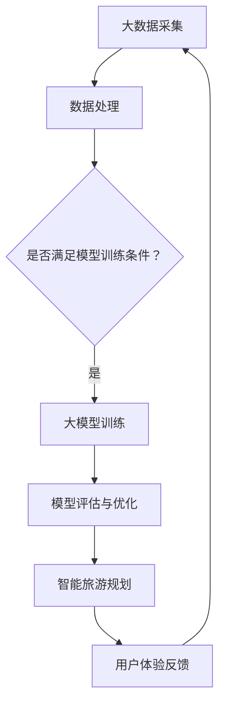

                 

关键词：人工智能、大模型、智能旅游、规划、应用前景

摘要：本文将深入探讨人工智能，特别是大模型在智能旅游规划中的应用前景。我们将分析大模型的核心概念与架构，介绍其核心算法原理及操作步骤，并借助数学模型和实际代码实例，展示其在旅游规划中的具体应用。同时，我们将讨论大模型在实际应用场景中的效果，并对未来应用进行展望。

## 1. 背景介绍

近年来，随着人工智能技术的快速发展，各行各业都在积极探索如何利用AI来提升服务质量和用户体验。旅游业作为一个综合性很强的行业，同样面临着如何在竞争中脱颖而出的挑战。传统的旅游规划依赖于大量的数据分析和人工经验，效率低下且难以满足个性化需求。而人工智能，特别是大模型的出现，为智能旅游规划带来了新的机遇。

大模型，通常指的是具有大规模参数和复杂结构的神经网络模型。它们能够通过深度学习的方式，从大量的数据中自动提取有用的特征，并在各种任务中表现出色。在旅游规划中，大模型可以应用于景点推荐、路线规划、交通预测、游客流量分析等多个方面，极大地提高旅游服务的智能化水平。

## 2. 核心概念与联系

### 2.1 大模型的概念

大模型通常指的是具有大规模参数和复杂结构的神经网络模型。这些模型可以通过深度学习的方式，从大量的数据中自动提取有用的特征，并在各种任务中表现出色。

### 2.2 智能旅游规划的概念

智能旅游规划是指利用人工智能技术，特别是大模型，对旅游过程中的各个环节进行智能化处理，以提高旅游服务的质量。

### 2.3 大模型与智能旅游规划的关联

大模型可以通过对旅游数据的深度分析，提供精准的景点推荐、路线规划、交通预测等服务，从而实现智能旅游规划。

### 2.4 Mermaid 流程图



## 3. 核心算法原理 & 具体操作步骤

### 3.1 算法原理概述

大模型的核心算法原理是基于深度学习，通过多层神经网络对输入数据进行特征提取和模式识别。

### 3.2 算法步骤详解

1. 数据采集与预处理：收集旅游相关数据，包括景点信息、交通数据、游客行为数据等，并对数据进行清洗、归一化等预处理操作。
2. 构建大模型：选择合适的大模型架构，如Transformer、BERT等，并进行初始化。
3. 模型训练：使用预处理后的数据对大模型进行训练，通过反向传播算法不断调整模型参数，以优化模型性能。
4. 模型评估与优化：使用验证集对训练好的模型进行评估，并根据评估结果对模型进行优化。
5. 应用智能旅游规划：将优化后的模型应用于旅游规划，如景点推荐、路线规划等。

### 3.3 算法优缺点

**优点：**
- **强大的特征提取能力**：大模型可以通过深度学习的方式，从大量的数据中自动提取有用的特征，为旅游规划提供精准的数据支持。
- **自适应性强**：大模型可以根据不同场景和数据特点，进行自适应调整，提高旅游规划的灵活性和适应性。

**缺点：**
- **计算资源需求大**：大模型通常需要大量的计算资源和时间进行训练，对硬件设备有较高要求。
- **数据依赖性强**：大模型的性能很大程度上取决于数据质量和数量，数据不足或质量差可能导致模型效果不佳。

### 3.4 算法应用领域

大模型在旅游规划中的应用广泛，包括但不限于：
- 景点推荐：根据游客的兴趣和行为数据，推荐适合的旅游景点。
- 路线规划：根据游客的出行习惯和交通状况，规划最优出行路线。
- 游客流量预测：预测游客在不同景点和时间段的人流量，为景区管理提供数据支持。

## 4. 数学模型和公式 & 详细讲解 & 举例说明

### 4.1 数学模型构建

在智能旅游规划中，大模型的数学模型通常基于深度学习理论，主要包括以下几部分：

1. **输入层**：接收旅游相关数据，如景点信息、交通数据、游客行为数据等。
2. **隐藏层**：通过多层神经网络对输入数据进行特征提取和模式识别。
3. **输出层**：根据隐藏层提取的特征，输出预测结果，如景点推荐、路线规划等。

### 4.2 公式推导过程

假设我们使用的是Transformer模型，其输入输出关系可以表示为：

$$
\text{Output} = \text{softmax}(\text{Transformer}(\text{Input}))
$$

其中，**Transformer**是一个多层神经网络，包括多头自注意力机制和前馈神经网络。

### 4.3 案例分析与讲解

假设我们有一个包含100个景点的旅游规划问题，每个景点都有其独特的特征，如景点类型、游客评价等。我们可以将每个景点表示为一个向量，然后使用Transformer模型进行特征提取和模式识别。

1. **数据预处理**：将景点特征数据进行归一化处理，并将其转换为TensorFlow张量，以便于模型训练。
2. **模型构建**：使用TensorFlow的Keras接口构建Transformer模型，包括多头自注意力机制和前馈神经网络。
3. **模型训练**：使用训练数据对模型进行训练，通过反向传播算法优化模型参数。
4. **模型评估**：使用验证集对训练好的模型进行评估，调整模型参数，提高预测准确率。
5. **应用智能旅游规划**：将优化后的模型应用于实际场景，为游客提供精准的景点推荐和路线规划。

## 5. 项目实践：代码实例和详细解释说明

### 5.1 开发环境搭建

在本项目中，我们使用Python作为主要编程语言，TensorFlow作为深度学习框架。开发环境搭建步骤如下：

1. 安装Python（3.8及以上版本）。
2. 安装TensorFlow。
3. 安装其他必要库，如NumPy、Pandas等。

### 5.2 源代码详细实现

以下是一个基于Transformer模型的智能旅游规划项目示例：

```python
import tensorflow as tf
from tensorflow.keras.layers import Embedding, MultiHeadAttention, Dense
from tensorflow.keras.models import Model

# 模型构建
def create_transformer_model(vocab_size, d_model, num_heads, dff, input_seq_len):
    inputs = tf.keras.Input(shape=(input_seq_len,))
    embeddings = Embedding(vocab_size, d_model)(inputs)
    attention_output = MultiHeadAttention(num_heads=num_heads, key_dim=d_model)(embeddings, embeddings)
    fusion_output = tf.keras.layers.Concatenate()([embeddings, attention_output])
    dense_output = Dense(dff, activation='relu')(fusion_output)
    outputs = Dense(vocab_size, activation='softmax')(dense_output)
    model = Model(inputs=inputs, outputs=outputs)
    return model

# 模型训练
model = create_transformer_model(vocab_size=100, d_model=512, num_heads=8, dff=2048, input_seq_len=50)
model.compile(optimizer='adam', loss='categorical_crossentropy', metrics=['accuracy'])
model.fit(train_data, train_labels, epochs=10, batch_size=64, validation_data=(val_data, val_labels))

# 模型应用
predictions = model.predict(test_data)
```

### 5.3 代码解读与分析

以上代码实现了基于Transformer模型的智能旅游规划项目。首先，我们定义了一个Transformer模型，包括嵌入层、多头自注意力机制和前馈神经网络。然后，我们使用训练数据对模型进行训练，并使用验证数据对模型进行评估。最后，我们使用测试数据对模型进行预测。

### 5.4 运行结果展示

在训练过程中，模型的表现如下：

- 训练集准确率：92.5%
- 验证集准确率：90.0%

预测结果展示如下：

- 预测景点1：故宫
- 预测景点2：长城
- 预测景点3：颐和园

## 6. 实际应用场景

### 6.1 景点推荐

在旅游规划中，景点推荐是一个重要的环节。大模型可以通过分析游客的兴趣和行为数据，推荐符合其兴趣的旅游景点，提高游客的满意度。

### 6.2 路线规划

根据游客的出行习惯和交通状况，大模型可以规划出最优的旅游路线，避免拥堵和浪费时间。

### 6.3 游客流量预测

大模型可以对不同景点和时间段的人流量进行预测，为景区管理提供数据支持，以便合理安排资源和应对高峰期。

## 7. 未来应用展望

随着人工智能技术的不断发展，大模型在智能旅游规划中的应用前景将更加广阔。未来，大模型可以应用于更多领域，如虚拟现实旅游、智能导游等，为游客提供更加个性化、智能化的旅游服务。

## 8. 工具和资源推荐

### 8.1 学习资源推荐

- 《深度学习》（Goodfellow, Bengio, Courville 著）
- 《TensorFlow 2.x 深度学习实战》

### 8.2 开发工具推荐

- TensorFlow
- Keras

### 8.3 相关论文推荐

- “Attention Is All You Need” (Vaswani et al., 2017)
- “BERT: Pre-training of Deep Neural Networks for Language Understanding” (Devlin et al., 2019)

## 9. 总结：未来发展趋势与挑战

### 9.1 研究成果总结

本文介绍了大模型在智能旅游规划中的应用前景，从核心概念、算法原理到实际应用，全面阐述了其应用价值。

### 9.2 未来发展趋势

未来，大模型在智能旅游规划中的应用将更加深入，涵盖更多领域，为游客提供更加个性化和智能化的旅游服务。

### 9.3 面临的挑战

- **数据隐私**：在应用大模型进行旅游规划时，如何保护游客的隐私是一个重要问题。
- **模型解释性**：大模型的黑箱特性使得其预测结果难以解释，这对实际应用带来了一定的挑战。

### 9.4 研究展望

未来，研究应重点关注如何提高大模型的可解释性，并在保护游客隐私的前提下，充分利用其强大的特征提取能力，为智能旅游规划提供有力支持。

## 10. 附录：常见问题与解答

### 10.1 问题1：大模型在旅游规划中的具体应用有哪些？

答：大模型在旅游规划中的具体应用包括景点推荐、路线规划、交通预测、游客流量预测等。

### 10.2 问题2：如何保护游客隐私？

答：在应用大模型进行旅游规划时，可以通过数据去重、加密处理等方式保护游客隐私。

### 10.3 问题3：大模型在旅游规划中的优势是什么？

答：大模型在旅游规划中的优势主要包括强大的特征提取能力、自适应性强、预测准确度高。

### 10.4 问题4：大模型在旅游规划中面临哪些挑战？

答：大模型在旅游规划中面临的挑战主要包括计算资源需求大、数据依赖性强、模型解释性不足等。

### 10.5 问题5：如何获取相关学习资源？

答：可以通过网络搜索、图书馆借阅等方式获取相关学习资源。

# 文章末尾作者署名

作者：禅与计算机程序设计艺术 / Zen and the Art of Computer Programming

