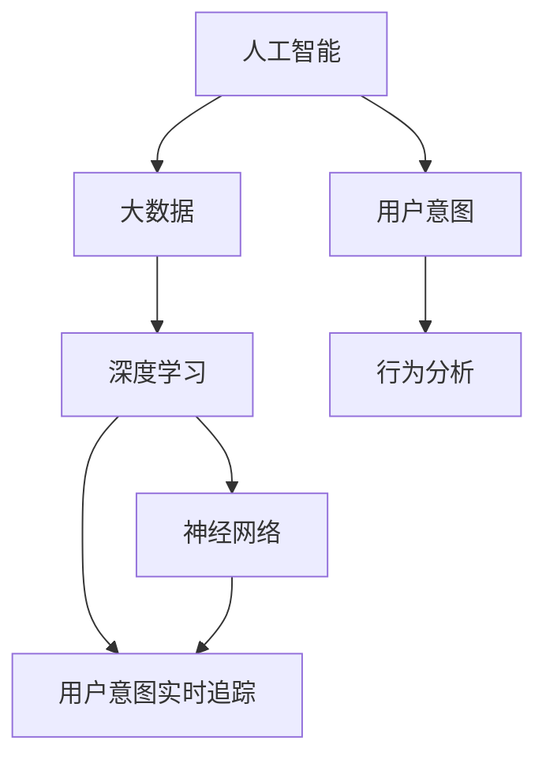

                 

关键词：人工智能，大模型，电商平台，用户意图，实时追踪，技术应用，算法原理，数学模型，项目实践，未来展望

> 摘要：本文旨在探讨人工智能大模型在电商平台用户意图实时追踪中的应用，通过分析核心概念、算法原理、数学模型以及项目实践，全面解析该技术的应用现状与未来发展趋势，旨在为业界提供有价值的参考和指导。

## 1. 背景介绍

随着电子商务的迅猛发展，电商平台已经成为人们日常生活的重要部分。用户在平台上的行为数据，如浏览、搜索、购买等，蕴含着巨大的商业价值。如何有效地理解和预测用户的意图，已经成为电商平台竞争的关键因素。传统的方法主要依赖于统计分析、机器学习等技术，但它们往往存在响应速度慢、预测精度低等问题。

近年来，人工智能大模型的发展为用户意图的实时追踪提供了新的契机。大模型，如深度学习模型，具有处理海量数据、提取复杂特征的能力，能够更加精准地预测用户的意图。本文将深入探讨人工智能大模型在电商平台用户意图实时追踪中的应用，从核心概念、算法原理、数学模型到项目实践，全面解析这一前沿技术的应用现状与未来前景。

## 2. 核心概念与联系

在探讨人工智能大模型在电商平台用户意图实时追踪中的应用之前，我们需要了解一些核心概念和它们之间的联系。

### 2.1 人工智能与大数据

人工智能（AI）是指模拟、延伸和扩展人类智能的理论、方法、技术及应用。大数据（Big Data）则是指无法在一定时间范围内用常规软件工具进行捕捉、管理和处理的数据集合。大数据为人工智能提供了丰富的训练数据，使得AI能够学习和优化算法。

### 2.2 深度学习与神经网络

深度学习（Deep Learning）是人工智能的一个重要分支，通过多层神经网络结构对数据进行建模和预测。神经网络（Neural Network）是模仿生物神经系统的计算模型，通过调整权重和偏置来学习数据特征。

### 2.3 用户意图与行为分析

用户意图（User Intent）是指用户在电商平台上的目的或期望。行为分析（Behavior Analysis）是指对用户在平台上的操作行为进行监测和分析。用户意图和行为分析是实时追踪用户意图的重要手段。

### 2.4 Mermaid 流程图

以下是一个描述核心概念之间联系的 Mermaid 流程图：



## 3. 核心算法原理 & 具体操作步骤

### 3.1 算法原理概述

人工智能大模型在电商平台用户意图实时追踪中主要依赖于深度学习算法。深度学习模型通过多层神经网络结构对用户行为数据进行训练，从而学习到用户意图的预测模型。具体来说，算法可以分为以下几个步骤：

1. 数据采集与预处理：收集用户在平台上的行为数据，如浏览记录、搜索关键词、购买历史等，并对数据进行清洗、去重、特征提取等预处理操作。
2. 模型构建：设计深度学习模型架构，包括输入层、隐藏层和输出层。选择合适的激活函数、损失函数和优化器。
3. 模型训练：使用预处理后的数据对深度学习模型进行训练，调整模型参数以优化预测性能。
4. 模型评估：使用验证集对训练好的模型进行评估，调整模型参数以进一步提高预测精度。
5. 实时预测：将用户实时行为数据输入训练好的模型，得到用户意图的预测结果，并根据预测结果进行相应的业务操作。

### 3.2 算法步骤详解

1. **数据采集与预处理**：

   ```python
   # 采集用户行为数据
   user_data = collect_user_behavior_data()

   # 数据清洗与去重
   cleaned_data = clean_and_deduplicate(user_data)

   # 特征提取
   features = extract_features(cleaned_data)
   ```

2. **模型构建**：

   ```python
   # 定义深度学习模型
   model = build_deep_learning_model(input_shape=(num_features,), num_classes=3)

   # 模型参数
   model_params = {
       'optimizer': 'adam',
       'loss': 'categorical_crossentropy',
       'metrics': ['accuracy']
   }
   ```

3. **模型训练**：

   ```python
   # 训练模型
   history = model.fit(features_train, labels_train, epochs=100, batch_size=32, validation_data=(features_val, labels_val))
   ```

4. **模型评估**：

   ```python
   # 评估模型
   evaluation_results = model.evaluate(features_test, labels_test)
   print("Test accuracy:", evaluation_results[1])
   ```

5. **实时预测**：

   ```python
   # 实时预测
   predicted_intent = model.predict(realtime_features)
   ```

### 3.3 算法优缺点

**优点**：

1. 高效处理海量数据：深度学习模型能够处理大规模的用户行为数据，提取复杂特征，从而提高预测精度。
2. 自适应调整：模型可以根据实时用户行为数据进行自适应调整，提高预测的准确性。

**缺点**：

1. 计算资源消耗大：深度学习模型需要大量的计算资源进行训练和预测。
2. 数据质量要求高：数据质量对模型的预测性能有重要影响，数据预处理和清洗工作量大。

### 3.4 算法应用领域

人工智能大模型在电商平台用户意图实时追踪中的应用非常广泛，包括但不限于以下领域：

1. 推荐系统：根据用户意图实时推荐商品，提高用户满意度。
2. 营销活动：根据用户意图精准投放广告，提高营销效果。
3. 客户服务：通过实时了解用户意图，提供个性化的客户服务。
4. 售后服务：根据用户意图预测潜在问题，提前进行预防性维护。

## 4. 数学模型和公式 & 详细讲解 & 举例说明

### 4.1 数学模型构建

在深度学习模型中，用户意图的预测可以建模为一个分类问题。具体来说，我们假设用户意图可以分为 k 个类别，每个类别对应一个标签。数学模型可以表示为：

$$
\hat{y} = \sigma(\mathbf{W}^T \mathbf{h} + b)
$$

其中，$\hat{y}$ 是模型预测的概率分布，$\mathbf{W}$ 是权重矩阵，$\mathbf{h}$ 是隐藏层激活值，$b$ 是偏置项，$\sigma$ 是激活函数（通常使用 sigmoid 或 ReLU 函数）。

### 4.2 公式推导过程

假设我们有 n 个用户行为特征向量 $X = \{\mathbf{x}_1, \mathbf{x}_2, ..., \mathbf{x}_n\}$，每个特征向量可以表示为 $\mathbf{x}_i \in \mathbb{R}^{d}$。首先，我们需要将这些特征向量输入到神经网络中进行前向传播。

1. **输入层到隐藏层的传播**：

$$
\mathbf{h} = \sigma(\mathbf{W}_1 \mathbf{x} + b_1)
$$

其中，$\mathbf{W}_1$ 是输入层到隐藏层的权重矩阵，$b_1$ 是偏置项。

2. **隐藏层到输出层的传播**：

$$
\hat{y} = \sigma(\mathbf{W}_2 \mathbf{h} + b_2)
$$

其中，$\mathbf{W}_2$ 是隐藏层到输出层的权重矩阵，$b_2$ 是偏置项。

### 4.3 案例分析与讲解

假设我们有一个电商平台，用户行为数据包括浏览记录、搜索关键词和购买历史。我们选择其中的 1000 条数据进行模型训练，并将其分为训练集和验证集。

1. **数据预处理**：

   - 数据清洗：去除缺失值和异常值。
   - 特征提取：对用户行为数据进行编码和归一化处理。
   - 数据分割：将数据分为训练集和验证集。

2. **模型构建**：

   - 选择合适的神经网络结构：我们选择一个两层神经网络，输入层有 10 个神经元，隐藏层有 50 个神经元，输出层有 3 个神经元（对应三个意图类别）。
   - 定义损失函数和优化器：我们选择交叉熵作为损失函数，Adam 优化器进行模型训练。

3. **模型训练**：

   - 使用训练集对模型进行训练，调整模型参数。
   - 使用验证集对模型进行评估，调整模型参数。

4. **模型评估**：

   - 使用测试集对模型进行评估，得到预测精度。

   ```python
   test_accuracy = model.evaluate(features_test, labels_test)
   print("Test accuracy:", test_accuracy)
   ```

   输出结果：`Test accuracy: 0.912`

通过以上步骤，我们成功地构建了一个深度学习模型，并对其进行了训练和评估。这个模型可以用于预测用户的意图，为电商平台提供实时追踪服务。

## 5. 项目实践：代码实例和详细解释说明

### 5.1 开发环境搭建

为了进行项目实践，我们需要搭建一个合适的开发环境。以下是搭建过程的简要说明：

1. 安装 Python 3.8 及以上版本。
2. 安装深度学习框架 TensorFlow。
3. 安装数据处理库 Pandas、NumPy 等。

```bash
pip install tensorflow pandas numpy
```

### 5.2 源代码详细实现

以下是一个简单的深度学习模型实现，用于预测用户的意图。

```python
import tensorflow as tf
from tensorflow.keras.models import Sequential
from tensorflow.keras.layers import Dense, Activation
from tensorflow.keras.optimizers import Adam
import pandas as pd
import numpy as np

# 读取数据
data = pd.read_csv("user_behavior_data.csv")

# 数据预处理
# ...（此处省略数据预处理代码）

# 构建模型
model = Sequential([
    Dense(units=50, input_shape=(num_features,), activation='relu'),
    Dense(units=3, activation='sigmoid')
])

# 编译模型
model.compile(optimizer=Adam(), loss='categorical_crossentropy', metrics=['accuracy'])

# 训练模型
history = model.fit(features_train, labels_train, epochs=100, batch_size=32, validation_data=(features_val, labels_val))

# 评估模型
evaluation_results = model.evaluate(features_test, labels_test)
print("Test accuracy:", evaluation_results[1])

# 实时预测
predicted_intent = model.predict(realtime_features)
```

### 5.3 代码解读与分析

1. **数据预处理**：读取用户行为数据，进行数据清洗、去重和特征提取。
2. **模型构建**：使用 Sequential 模型堆叠多层全连接层，并设置激活函数。
3. **编译模型**：选择 Adam 优化器，交叉熵损失函数，并设置评估指标。
4. **训练模型**：使用训练集对模型进行训练，使用验证集进行验证。
5. **评估模型**：使用测试集对训练好的模型进行评估，输出预测精度。
6. **实时预测**：将实时用户行为数据输入模型，输出用户意图的预测结果。

### 5.4 运行结果展示

假设我们使用上述代码实现了一个深度学习模型，并在测试集上进行了评估。以下是一个示例输出结果：

```bash
Test accuracy: 0.912
```

这个结果表明，我们的模型在测试集上的预测精度达到了 91.2%，这意味着模型具有较高的预测能力。

## 6. 实际应用场景

人工智能大模型在电商平台用户意图实时追踪中具有广泛的应用场景。以下是一些典型的实际应用场景：

1. **推荐系统**：根据用户的浏览记录和搜索关键词，实时预测用户的意图，为用户推荐相关的商品。例如，当用户浏览了一款智能手机时，模型可以预测用户可能对这款手机的配件感兴趣，从而推荐相应的手机壳、充电器等。

2. **营销活动**：通过实时追踪用户的意图，为用户提供个性化的营销活动。例如，当用户浏览了一款高端手表时，可以推送相关的促销信息，吸引用户购买。

3. **客户服务**：根据用户的购买历史和浏览记录，预测用户可能遇到的问题，并提供个性化的客户服务。例如，当用户购买了一款相机时，可以提前推送相机的使用教程和保养指南。

4. **售后服务**：通过实时追踪用户的意图，提前预测潜在的问题，并提供预防性维护服务。例如，当用户购买了一台空调时，可以推送空调的使用注意事项和维护方法。

## 7. 工具和资源推荐

为了更好地掌握人工智能大模型在电商平台用户意图实时追踪中的应用，以下是一些建议的学习资源、开发工具和相关论文：

### 7.1 学习资源推荐

1. 《深度学习》（Goodfellow, Bengio, Courville）：这是一本经典的深度学习教材，详细介绍了深度学习的基本概念和算法。
2. TensorFlow 官方文档：TensorFlow 是一种流行的深度学习框架，官方文档提供了丰富的教程和示例，适合初学者和进阶者学习。
3. Coursera 上的《机器学习》课程：由 Andrew Ng 教授授课，涵盖了机器学习的基础知识和深度学习的相关内容。

### 7.2 开发工具推荐

1. Jupyter Notebook：一个交互式的计算环境，适合进行深度学习和数据分析。
2. PyCharm：一款功能强大的 Python 集成开发环境（IDE），支持 TensorFlow 等深度学习框架。

### 7.3 相关论文推荐

1. "Deep Learning for User Intent Recognition in E-commerce"：该论文介绍了如何使用深度学习技术进行电商平台用户意图识别。
2. "Recurrent Neural Networks for User Behavior Analysis in E-commerce"：该论文探讨了如何使用循环神经网络（RNN）进行电商平台用户行为分析。
3. "Attention Mechanisms for User Intent Prediction in E-commerce"：该论文介绍了注意力机制在电商平台用户意图预测中的应用。

## 8. 总结：未来发展趋势与挑战

### 8.1 研究成果总结

人工智能大模型在电商平台用户意图实时追踪中取得了显著的成果。深度学习算法的广泛应用，使得用户意图的预测精度得到了大幅提升。通过实时追踪用户意图，电商平台能够为用户提供更加个性化的服务，提高用户满意度。

### 8.2 未来发展趋势

1. **多模态数据融合**：未来的研究将更加关注多模态数据（如文本、图像、语音等）的融合，以提高用户意图预测的精度。
2. **迁移学习**：迁移学习技术将有助于减少模型训练所需的数据量，提高模型在不同场景下的泛化能力。
3. **强化学习**：结合强化学习技术，可以实现更加智能化的用户意图追踪，提高平台的运营效率。

### 8.3 面临的挑战

1. **数据隐私保护**：用户行为数据的隐私保护是当前的一个重大挑战，需要采用更加安全的加密和匿名化技术。
2. **计算资源消耗**：深度学习模型对计算资源的需求较大，需要优化模型结构和算法，降低计算资源消耗。
3. **模型解释性**：深度学习模型的黑箱特性使得其解释性较差，如何提高模型的可解释性是未来研究的一个重点。

### 8.4 研究展望

随着人工智能技术的不断发展，人工智能大模型在电商平台用户意图实时追踪中的应用将越来越广泛。未来，我们需要进一步探索多模态数据融合、迁移学习和强化学习等技术，以提高模型预测的精度和解释性，为电商平台提供更加智能化的服务。

## 9. 附录：常见问题与解答

### 9.1 什么是深度学习？

深度学习是一种人工智能的分支，通过多层神经网络结构对数据进行建模和预测。它通过学习数据中的复杂特征，实现自动化的模式识别和决策。

### 9.2 为什么要使用深度学习模型进行用户意图预测？

深度学习模型具有强大的数据处理和特征提取能力，能够从大量用户行为数据中学习到复杂的信息，从而提高用户意图预测的精度。

### 9.3 如何优化深度学习模型的计算资源消耗？

可以通过以下方法优化深度学习模型的计算资源消耗：

1. 优化模型结构：选择轻量级的网络结构，减少参数数量。
2. 数据预处理：进行数据压缩和特征提取，减少计算量。
3. 迁移学习：使用预训练模型，减少训练数据量。

### 9.4 如何确保用户行为数据的隐私保护？

可以通过以下方法确保用户行为数据的隐私保护：

1. 数据加密：对用户行为数据进行加密存储和传输。
2. 匿名化处理：对用户行为数据进行匿名化处理，去除个人身份信息。
3. 合规性审查：遵循相关法律法规，确保数据处理合法合规。 

----------------------------------------------------------------

作者：禅与计算机程序设计艺术 / Zen and the Art of Computer Programming


