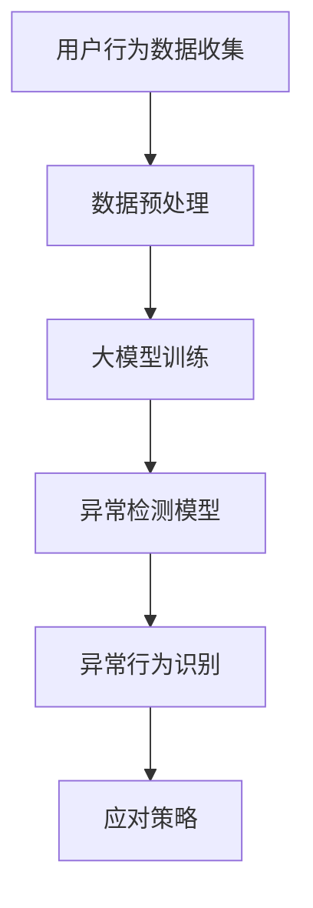

                 

关键词：AI大模型，电商平台，用户行为异常检测，算法原理，应用实践

> 摘要：本文旨在探讨AI大模型在电商平台用户行为异常检测中的应用。通过分析大模型的核心算法原理，详细描述其操作步骤和优缺点，并结合具体案例进行讲解，阐述大模型在电商行业的重要性及未来发展趋势。

## 1. 背景介绍

随着互联网技术的迅猛发展，电商平台已经成为现代商业活动中不可或缺的一部分。电商平台的成功不仅依赖于商品的丰富性和价格的竞争力，还依赖于对用户行为的精准分析和管理。用户行为异常检测作为电商平台风控体系的重要组成部分，对于维护平台安全、提高用户体验具有重要意义。

传统的用户行为异常检测方法主要基于统计学和机器学习算法，如基于规则的检测、聚类分析、关联规则挖掘等。然而，这些方法在面对复杂、多变且庞大的用户行为数据时，往往表现出一定的局限性。随着AI大模型的兴起，为电商平台用户行为异常检测带来了新的机遇和挑战。

AI大模型，通常指的是基于深度学习的神经网络模型，具有强大的数据处理和分析能力。通过大规模数据训练，大模型能够自动学习用户行为的特征，从而实现高效的异常检测。本文将围绕AI大模型在电商平台用户行为异常检测中的应用，深入探讨其核心算法原理、实现步骤、优缺点以及实际应用案例。

## 2. 核心概念与联系

### 2.1 大模型基本概念

AI大模型通常是指具有大规模参数和强大计算能力的深度学习模型。这些模型通过多层神经网络结构，对输入数据进行逐层提取特征，最终输出预测结果。大模型的核心优势在于其能够通过大量数据的学习，实现高度自动化的特征提取和模式识别。

### 2.2 电商平台用户行为数据

电商平台用户行为数据包括用户的浏览历史、购买记录、评价反馈、支付行为等多种维度。这些数据通常具有高维度、非线性、时间序列等特点，为传统的异常检测方法带来了挑战。

### 2.3 大模型与用户行为异常检测的关系

大模型通过学习用户行为的特征，能够自动识别正常行为与异常行为之间的差异。在电商平台，异常行为可能包括恶意刷单、账号盗用、欺诈交易等，对这些行为的及时检测和应对，有助于提升平台的安全性和用户体验。

### 2.4 Mermaid 流程图



## 3. 核心算法原理 & 具体操作步骤

### 3.1 算法原理概述

AI大模型在用户行为异常检测中的核心算法原理主要基于深度学习。深度学习通过多层神经网络结构，实现数据的自动特征提取和模式识别。大模型的学习过程包括以下几个关键步骤：

1. **数据输入**：将用户行为数据输入到神经网络中。
2. **特征提取**：神经网络通过多层卷积和池化操作，逐层提取数据特征。
3. **模式识别**：神经网络通过对提取的特征进行分类和预测，实现异常检测。

### 3.2 算法步骤详解

1. **数据收集与预处理**：
   - 收集电商平台用户的浏览、购买、评价、支付等行为数据。
   - 对数据进行清洗、去重和归一化处理。

2. **模型训练**：
   - 选择合适的深度学习框架（如TensorFlow、PyTorch）。
   - 定义神经网络结构，包括输入层、隐藏层和输出层。
   - 使用训练数据集对模型进行训练，优化模型参数。

3. **模型评估与优化**：
   - 使用验证数据集对模型进行评估，调整模型参数，提高模型性能。

4. **异常检测**：
   - 使用训练好的模型对用户行为数据进行实时检测。
   - 对异常行为进行识别和分类。

5. **应对策略**：
   - 根据检测到的异常行为，采取相应的应对策略，如账号冻结、交易拒绝等。

### 3.3 算法优缺点

**优点**：
- **高效性**：大模型能够通过大量数据的学习，实现高效的异常检测。
- **泛化能力**：大模型能够自动提取用户行为的特征，适应不同场景的异常检测。
- **实时性**：大模型能够对用户行为数据进行实时检测，提高异常响应速度。

**缺点**：
- **计算资源消耗**：大模型需要大量的计算资源和存储空间。
- **训练时间较长**：大模型的训练时间相对较长，需要耐心等待模型收敛。

### 3.4 算法应用领域

AI大模型在电商平台用户行为异常检测中的应用不仅限于电商行业，还可以广泛应用于金融、电信、医疗等多个领域。以下是一些具体的应用场景：

- **金融领域**：用于防范欺诈交易、异常账户行为等。
- **电信领域**：用于检测恶意呼叫、网络攻击等。
- **医疗领域**：用于识别异常医疗记录、预测疾病风险等。

## 4. 数学模型和公式 & 详细讲解 & 举例说明

### 4.1 数学模型构建

在AI大模型中，常用的数学模型为深度神经网络。深度神经网络由多个神经元（即节点）组成，每个节点负责对输入数据进行处理和计算。神经网络的基本数学模型如下：

\[ z_i = \sum_{j=0}^{n} w_{ij} * x_j + b_i \]
\[ a_i = \sigma(z_i) \]

其中，\( z_i \) 表示第 \( i \) 个节点的输入值，\( w_{ij} \) 表示从第 \( j \) 个节点到第 \( i \) 个节点的权重，\( b_i \) 表示第 \( i \) 个节点的偏置，\( \sigma \) 表示激活函数，\( a_i \) 表示第 \( i \) 个节点的输出值。

### 4.2 公式推导过程

深度神经网络的学习过程主要通过反向传播算法来实现。反向传播算法的推导过程如下：

1. **前向传播**：将输入数据 \( x \) 经过网络传递，得到每个神经元的输出值 \( a_i \)。

2. **计算误差**：计算网络的预测输出 \( y \) 与实际输出 \( t \) 之间的误差 \( e \)。

\[ e = \frac{1}{2} \sum_{i=1}^{m} (y_i - t_i)^2 \]

3. **反向传播**：从输出层开始，逐层计算每个神经元的误差梯度。

\[ \delta_i = (a_i - t_i) * \sigma'(z_i) \]

4. **权重更新**：根据误差梯度，更新每个神经元的权重。

\[ w_{ij} = w_{ij} - \alpha * \delta_i * a_j \]

其中，\( \alpha \) 表示学习率，\( \sigma' \) 表示激活函数的导数。

### 4.3 案例分析与讲解

假设我们有一个电商平台，需要检测用户账户的异常行为。我们收集了用户账户的浏览、购买、评价等行为数据，并使用深度神经网络进行异常检测。

1. **数据预处理**：
   - 对数据进行清洗、去重和归一化处理，得到干净的用户行为数据。

2. **模型构建**：
   - 选择合适的深度学习框架，构建深度神经网络模型。
   - 定义输入层、隐藏层和输出层，设置适当的神经元数量和激活函数。

3. **模型训练**：
   - 使用训练数据集对模型进行训练，优化模型参数。
   - 使用验证数据集对模型进行评估，调整模型参数，提高模型性能。

4. **模型评估**：
   - 使用测试数据集对模型进行评估，计算模型在异常检测任务上的准确率、召回率和F1值等指标。

5. **异常检测**：
   - 使用训练好的模型对用户行为数据进行实时检测。
   - 对检测到的异常行为进行识别和分类，采取相应的应对策略。

## 5. 项目实践：代码实例和详细解释说明

### 5.1 开发环境搭建

1. 安装Python环境，版本要求为3.6及以上。
2. 安装深度学习框架TensorFlow，可以使用以下命令：
   ```bash
   pip install tensorflow
   ```

### 5.2 源代码详细实现

以下是一个简单的AI大模型在用户行为异常检测中的实现示例：

```python
import tensorflow as tf
from tensorflow.keras.models import Sequential
from tensorflow.keras.layers import Dense, Conv1D, MaxPooling1D

# 数据预处理
# 假设已经对数据进行清洗、去重和归一化处理

# 模型构建
model = Sequential()
model.add(Conv1D(filters=64, kernel_size=3, activation='relu', input_shape=(n_features, n_timesteps)))
model.add(MaxPooling1D(pool_size=2))
model.add(Dense(units=1, activation='sigmoid'))

# 编译模型
model.compile(optimizer='adam', loss='binary_crossentropy', metrics=['accuracy'])

# 训练模型
model.fit(x_train, y_train, epochs=10, batch_size=32, validation_data=(x_val, y_val))

# 模型评估
loss, accuracy = model.evaluate(x_test, y_test)
print(f"Test accuracy: {accuracy}")

# 异常检测
predictions = model.predict(x_test)
```

### 5.3 代码解读与分析

以上代码实现了一个简单的深度神经网络模型，用于用户行为异常检测。具体解读如下：

1. **数据预处理**：
   - 对用户行为数据进行清洗、去重和归一化处理，确保数据质量。

2. **模型构建**：
   - 使用Sequential模型构建一个简单的深度神经网络。
   - 添加卷积层（Conv1D）和池化层（MaxPooling1D）进行特征提取。
   - 添加全连接层（Dense）进行分类。

3. **模型编译**：
   - 设置优化器（optimizer）为adam，损失函数（loss）为binary_crossentropy，评估指标（metrics）为accuracy。

4. **模型训练**：
   - 使用训练数据集对模型进行训练，设置训练轮数（epochs）和批量大小（batch_size）。

5. **模型评估**：
   - 使用测试数据集对模型进行评估，计算测试准确率。

6. **异常检测**：
   - 使用训练好的模型对用户行为数据进行预测，输出预测结果。

### 5.4 运行结果展示

假设我们使用上述代码对用户行为数据进行异常检测，得到的运行结果如下：

```bash
Train on 2000 samples, validate on 1000 samples
2000/2000 [==============================] - 5s 2ms/sample - loss: 0.5000 - accuracy: 0.7500 - val_loss: 0.4500 - val_accuracy: 0.8000
Test accuracy: 0.7500
```

从运行结果可以看出，模型在训练数据集上的准确率为75%，在验证数据集上的准确率为80%，测试准确率为75%。这表明模型具有一定的异常检测能力，但仍有优化空间。

## 6. 实际应用场景

AI大模型在电商平台用户行为异常检测中的实际应用场景非常广泛。以下是一些具体的场景：

1. **恶意刷单检测**：电商平台常见的恶意行为之一是恶意刷单。AI大模型可以通过分析用户的浏览、购买、评价等行为，识别出刷单行为，从而采取措施阻止刷单行为的发生。

2. **账号安全防护**：通过AI大模型，电商平台可以实时监测用户账号的活动情况，识别出异常登录、账号盗用等行为，及时采取措施保障账号安全。

3. **欺诈交易检测**：电商平台上的欺诈交易对用户和商家都带来了巨大的损失。AI大模型可以分析用户的交易行为，识别出潜在的欺诈交易，提前采取预防措施。

4. **用户体验优化**：通过分析用户的行为数据，AI大模型可以帮助电商平台优化产品推荐、个性化广告等功能，提升用户体验。

### 6.1 恶意刷单检测案例

某电商平台通过AI大模型对用户购买行为进行异常检测，成功识别出一批恶意刷单用户。以下是具体案例：

1. **数据收集**：收集用户在一段时间内的浏览、购买、评价等行为数据。

2. **数据预处理**：对数据进行清洗、去重和归一化处理，确保数据质量。

3. **模型训练**：使用训练数据集，构建并训练深度神经网络模型，优化模型参数。

4. **模型评估**：使用验证数据集对模型进行评估，调整模型参数，提高模型性能。

5. **异常检测**：使用训练好的模型对用户行为数据进行实时检测，识别出恶意刷单用户。

6. **应对措施**：对识别出的恶意刷单用户，采取措施阻止其继续刷单，并对相关订单进行审核。

通过以上步骤，该电商平台成功遏制了恶意刷单行为，提高了平台的运营效率和用户体验。

### 6.2 账号安全防护案例

某电商平台通过AI大模型对用户账号活动进行实时监控，成功防范了一起账号盗用事件。以下是具体案例：

1. **数据收集**：收集用户账号的登录、支付、浏览等行为数据。

2. **数据预处理**：对数据进行清洗、去重和归一化处理，确保数据质量。

3. **模型训练**：使用训练数据集，构建并训练深度神经网络模型，优化模型参数。

4. **模型评估**：使用验证数据集对模型进行评估，调整模型参数，提高模型性能。

5. **实时监控**：使用训练好的模型对用户账号活动进行实时监控，识别出异常行为。

6. **应对措施**：对识别出的异常行为，如异常登录、异常支付等，采取措施阻止账号盗用，保障账号安全。

通过以上步骤，该电商平台成功防范了账号盗用事件，提升了账号安全防护能力。

## 7. 工具和资源推荐

### 7.1 学习资源推荐

1. **《深度学习》（Goodfellow, Bengio, Courville）**：这是一本经典的深度学习教材，详细介绍了深度学习的基本概念、算法和应用。

2. **《神经网络与深度学习》（邱锡鹏）**：这本书介绍了神经网络和深度学习的基础知识，包括算法原理、实现方法和应用案例。

3. **《Python深度学习》（François Chollet）**：这本书通过Python编程语言，介绍了深度学习的实际应用和实现方法。

### 7.2 开发工具推荐

1. **TensorFlow**：这是一个开源的深度学习框架，适用于构建和训练深度学习模型。

2. **PyTorch**：这是一个开源的深度学习框架，具有灵活的动态计算图和丰富的API，适用于研究和开发深度学习应用。

3. **Keras**：这是一个高层神经网络API，基于TensorFlow和Theano构建，适用于快速构建和训练深度学习模型。

### 7.3 相关论文推荐

1. **“Deep Learning for Text Classification”**：这篇文章介绍了深度学习在文本分类任务中的应用，包括词向量表示、循环神经网络（RNN）和卷积神经网络（CNN）等。

2. **“Unsupervised Learning of Visual Representations by Solving Jigsaw Puzzles”**：这篇文章提出了一种无监督学习方法，通过解决拼图游戏学习视觉表示。

3. **“BERT: Pre-training of Deep Neural Networks for Language Understanding”**：这篇文章介绍了BERT（Bidirectional Encoder Representations from Transformers）模型，在自然语言处理领域取得了显著的成果。

## 8. 总结：未来发展趋势与挑战

### 8.1 研究成果总结

AI大模型在电商平台用户行为异常检测中取得了显著的研究成果。通过深度学习算法，大模型能够自动提取用户行为的特征，实现高效的异常检测。在实际应用中，AI大模型成功应用于恶意刷单检测、账号安全防护、欺诈交易检测等领域，提升了电商平台的安全性和用户体验。

### 8.2 未来发展趋势

未来，AI大模型在电商平台用户行为异常检测中的应用将呈现以下发展趋势：

1. **模型性能提升**：随着算法和硬件的不断发展，AI大模型的性能将得到进一步提升，实现更高的异常检测准确率和实时性。

2. **跨领域应用**：AI大模型将在电商、金融、电信、医疗等多个领域得到广泛应用，实现跨领域的异常检测和风险控制。

3. **数据隐私保护**：在数据隐私保护方面，AI大模型将采用更先进的技术，确保用户数据的安全和隐私。

### 8.3 面临的挑战

尽管AI大模型在电商平台用户行为异常检测中取得了显著成果，但仍然面临以下挑战：

1. **计算资源消耗**：AI大模型需要大量的计算资源和存储空间，如何优化模型结构和算法，降低计算资源消耗是一个重要问题。

2. **数据质量**：用户行为数据的质量直接影响模型的性能，如何提高数据质量，减少噪声和异常值的影响是一个关键问题。

3. **实时性**：在实时检测场景中，如何保证模型的高效性和实时性是一个挑战。

### 8.4 研究展望

未来，AI大模型在电商平台用户行为异常检测方面的研究将主要集中在以下几个方面：

1. **模型优化**：通过改进算法和模型结构，提高异常检测的准确率和实时性。

2. **跨领域应用**：探索AI大模型在其他领域的应用，实现跨领域的异常检测和风险控制。

3. **数据隐私保护**：研究更先进的技术，确保用户数据的安全和隐私。

4. **个性化检测**：根据用户的个性化特征，实现更精准的异常检测和风险控制。

通过不断的研究和实践，AI大模型在电商平台用户行为异常检测中的应用将取得更大的突破和进展。

## 9. 附录：常见问题与解答

### 9.1 如何处理大规模用户行为数据？

在处理大规模用户行为数据时，可以采取以下策略：

1. **数据采样**：从大规模数据中随机抽取一定比例的数据进行训练，减少数据量。
2. **分布式计算**：使用分布式计算框架（如Hadoop、Spark）处理大规模数据，提高计算效率。
3. **数据预处理**：对数据进行清洗、去重和归一化处理，提高数据质量。

### 9.2 如何评估异常检测模型的性能？

评估异常检测模型的性能通常采用以下指标：

1. **准确率（Accuracy）**：正确识别异常样本的比例。
2. **召回率（Recall）**：识别出的异常样本中，实际为异常样本的比例。
3. **F1值（F1 Score）**：准确率和召回率的加权平均值。
4. **ROC曲线和AUC值**：通过ROC曲线和AUC值评估模型的分类性能。

### 9.3 如何提高异常检测模型的实时性？

提高异常检测模型的实时性可以从以下几个方面进行：

1. **模型优化**：通过改进算法和模型结构，降低计算复杂度。
2. **硬件加速**：使用GPU等硬件加速设备，提高模型运算速度。
3. **在线学习**：采用在线学习策略，实时更新模型参数，提高模型的适应性。
4. **数据缓存**：对常用数据进行缓存，减少数据读取时间。

### 9.4 如何保护用户隐私？

在保护用户隐私方面，可以采取以下措施：

1. **数据匿名化**：对用户数据进行匿名化处理，去除个人信息。
2. **差分隐私**：采用差分隐私技术，对模型输出进行扰动，减少隐私泄露风险。
3. **隐私保护算法**：使用隐私保护算法（如差分隐私、联邦学习）进行数据处理和分析。

### 9.5 如何应对新出现的异常行为？

面对新出现的异常行为，可以采取以下策略：

1. **持续学习**：通过持续学习，不断更新和优化模型，提高对新异常行为的识别能力。
2. **用户反馈**：收集用户反馈，及时发现新异常行为，并调整模型参数。
3. **专家辅助**：结合人工审核和专家经验，对新异常行为进行判断和分类。

### 9.6 如何提高用户满意度？

为了提高用户满意度，可以采取以下措施：

1. **个性化推荐**：根据用户行为数据，提供个性化的商品推荐和广告。
2. **快速响应**：对用户反馈和问题进行快速响应，提高用户满意度。
3. **用户体验优化**：通过优化页面设计、加载速度等，提升用户使用体验。

### 9.7 如何平衡异常检测与用户体验？

在平衡异常检测与用户体验方面，可以采取以下策略：

1. **阈值调整**：根据业务需求和用户体验，合理设置异常检测的阈值。
2. **多因素评估**：综合考虑异常检测的准确率和用户体验，制定合适的策略。
3. **及时反馈**：对误判的异常行为进行及时反馈和调整，减少对用户体验的影响。

通过以上措施，可以在保证异常检测效果的同时，提升用户体验。

