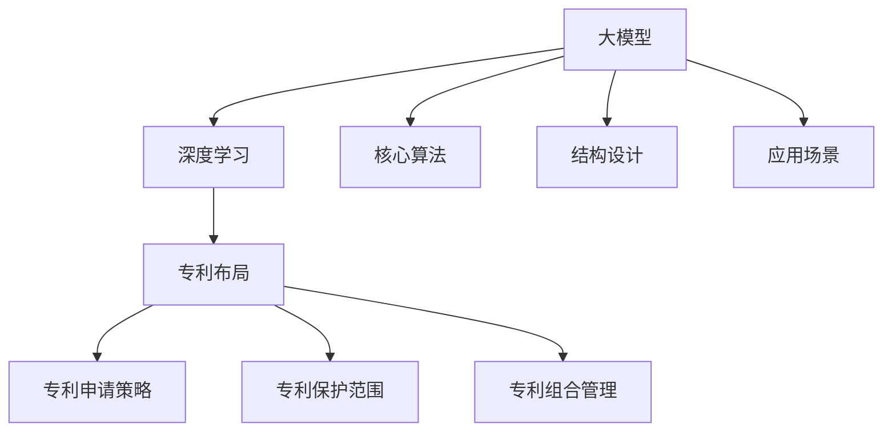

                 

在当前人工智能技术飞速发展的背景下，大模型（Large Models）的应用成为了推动行业创新的重要力量。大模型，尤其是基于深度学习的技术，具有处理复杂任务、生成高质量内容、提升自动化水平等显著优势。随着这些模型在商业和社会各个领域的广泛应用，如何对其进行有效的专利布局与保护，成为了企业和研究者关注的核心问题。

本文旨在探讨AI大模型应用的专利布局与保护策略，分析其关键概念、核心算法、数学模型，并提供实际应用案例和未来展望。通过系统的梳理和分析，本文将帮助读者更好地理解AI大模型专利布局的重要性，以及如何在实际操作中实现有效的专利保护。

## 关键词

AI大模型，专利布局，知识产权，深度学习，算法保护，数学模型，应用场景，未来展望。

## 摘要

本文详细探讨了AI大模型应用的专利布局与保护问题。首先，介绍了大模型的发展背景和关键概念，随后分析了AI大模型的核心算法原理及专利布局的关键点。接着，本文讨论了数学模型的构建和公式推导，并通过实际应用案例说明了AI大模型的具体应用。最后，本文提出了未来AI大模型应用的发展趋势与挑战，以及相关的工具和资源推荐。

### 1. 背景介绍

人工智能（AI）作为计算机科学的一个分支，旨在通过模拟、延伸和扩展人类智能，实现机器在感知、理解、学习和决策等方面的能力。随着深度学习（Deep Learning）技术的突破，AI进入了大模型时代。大模型，通常指的是具有数十亿至数千亿参数的神经网络，如GPT（Generative Pre-trained Transformer）系列、BERT（Bidirectional Encoder Representations from Transformers）等。这些模型通过在海量数据上进行预训练，可以适应各种复杂的任务，从而在自然语言处理、计算机视觉、语音识别等领域取得了显著的成果。

在商业和社会各个领域，AI大模型的应用场景日益广泛。例如，在自然语言处理领域，大模型被用于生成文章、翻译文本、回答问题等；在计算机视觉领域，大模型被用于图像分类、目标检测、人脸识别等；在语音识别领域，大模型被用于语音合成、语音识别、语音搜索等。这些应用不仅提高了效率，还提升了用户体验。

然而，随着AI大模型的应用日益广泛，如何对其进行有效的专利布局与保护，成为了企业和研究者关注的焦点。一方面，专利保护可以帮助企业维护其技术优势，防止竞争对手窃取技术成果；另一方面，有效的专利布局可以为企业带来可观的商业利益，如授权许可、合作开发等。

AI大模型专利布局与保护的重要性主要体现在以下几个方面：

1. **知识产权保护**：AI大模型作为技术创新的重要成果，其知识产权保护对于企业来说至关重要。通过专利布局，企业可以确保其技术成果得到有效保护，防止他人未经授权使用或抄袭。

2. **竞争优势**：有效的专利布局可以帮助企业在市场竞争中占据优势地位。通过对核心技术进行专利保护，企业可以限制竞争对手的技术进入，从而巩固市场地位。

3. **商业利益**：专利授权和许可是企业获取商业利益的重要途径。通过专利布局，企业可以将自身的技术成果转化为商业利益，如授权其他企业使用其专利技术，或与其他企业进行合作开发。

4. **法律风险防范**：在AI大模型应用过程中，可能面临法律风险。通过专利布局，企业可以提前预见潜在的法律问题，并采取相应的防范措施，降低法律风险。

综上所述，AI大模型应用的专利布局与保护具有重要的现实意义和战略价值。接下来，本文将详细分析AI大模型的核心算法原理及专利布局策略，为读者提供系统的指导和参考。

### 2. 核心概念与联系

#### 2.1 大模型的基本概念

大模型（Large Models），通常指的是具有数十亿至数千亿参数的神经网络。这些模型通过在海量数据上进行预训练，可以适应各种复杂的任务。大模型的核心思想是利用深度神经网络（DNN）的高效性，通过层层递进的方式，将输入数据映射到复杂的函数空间中。大模型的参数数量和计算复杂度远超传统机器学习方法，使其能够处理更加复杂的任务。

#### 2.2 深度学习的基本概念

深度学习（Deep Learning）是机器学习的一个分支，其核心思想是通过多层神经网络（Multi-Layer Neural Networks）对数据进行自动特征提取和模式识别。深度学习模型通常包含输入层、多个隐藏层和输出层。输入层接收外部数据，隐藏层对数据进行层层抽象和特征提取，输出层生成预测结果。

#### 2.3 专利布局的基本概念

专利布局（Patent Portfolio）是指企业或个人为实现特定目标，围绕其核心技术进行的专利申请和布局。专利布局的目标是通过合理的专利策略，确保企业的技术优势得到有效保护，并在市场竞争中占据有利地位。专利布局通常涉及以下几个方面：

1. **专利申请策略**：企业应根据自身的技术优势和市场需求，制定合理的专利申请策略，确保专利申请的数量和质量。

2. **专利保护范围**：企业在申请专利时，需要明确专利的保护范围，确保专利能够覆盖其核心技术。

3. **专利组合管理**：企业应定期对专利组合进行评估和管理，根据市场变化和技术发展趋势，调整专利布局策略。

#### 2.4 核心概念联系

大模型和深度学习是AI大模型应用的技术基础，而专利布局则是实现技术保护的重要手段。大模型通过深度学习技术，实现了对复杂数据的高效处理和模式识别。专利布局则通过对大模型的核心算法、结构设计、应用场景等进行专利申请和保护，确保企业的技术优势得到有效维护。

下面，我们将使用Mermaid流程图，展示AI大模型的基本概念和专利布局的联系。



### 3. 核心算法原理 & 具体操作步骤

#### 3.1 算法原理概述

AI大模型的核心算法是基于深度学习的多层神经网络。深度学习通过构建多层神经网络，实现对数据的层层抽象和特征提取。具体来说，深度学习模型通常包括以下几个关键组成部分：

1. **输入层**：接收外部输入数据，如文本、图像、语音等。
2. **隐藏层**：对输入数据进行处理和抽象，每层隐藏层都会对前一层的信息进行整合和转换。
3. **输出层**：生成最终的预测结果，如分类标签、文字、图像等。

深度学习模型的学习过程是通过反向传播算法（Backpropagation Algorithm）实现的。反向传播算法通过计算输出层预测值与真实值之间的误差，将误差反向传播到各层隐藏层，并调整各层的权重和偏置，以达到最小化误差的目的。

#### 3.2 算法步骤详解

以下是AI大模型算法的具体步骤：

1. **数据预处理**：对输入数据进行标准化处理，如归一化、标准化等，以消除不同特征间的尺度差异。

2. **初始化模型参数**：初始化网络模型的权重和偏置，常用的初始化方法有随机初始化、高斯初始化等。

3. **前向传播**：将预处理后的输入数据输入到模型中，经过各层隐藏层处理后，得到输出层的预测结果。

4. **计算误差**：计算输出层的预测结果与真实值之间的误差。

5. **反向传播**：将误差反向传播到各层隐藏层，根据误差大小调整各层的权重和偏置。

6. **更新模型参数**：根据反向传播得到的梯度信息，更新模型参数。

7. **迭代训练**：重复上述步骤，直至达到预定的迭代次数或误差阈值。

#### 3.3 算法优缺点

**优点**：

1. **强大的表达力**：深度学习模型可以自动学习数据的复杂特征，具有强大的表达能力。
2. **自动特征提取**：通过多层神经网络，深度学习模型可以自动进行特征提取，减少了人工特征工程的工作量。
3. **泛化能力强**：深度学习模型在训练过程中通过大量数据的学习，可以很好地泛化到未见过的数据。

**缺点**：

1. **计算复杂度高**：深度学习模型需要大量的计算资源，尤其是大模型，计算复杂度非常高。
2. **数据需求量大**：深度学习模型需要大量的数据来训练，数据质量对模型的性能有很大影响。
3. **调参困难**：深度学习模型的性能很大程度上依赖于超参数的设置，调参过程复杂且具有较大的不确定性。

#### 3.4 算法应用领域

AI大模型在多个领域都有广泛的应用，以下是一些典型的应用领域：

1. **自然语言处理（NLP）**：大模型被用于文本生成、机器翻译、情感分析、问答系统等任务。
2. **计算机视觉（CV）**：大模型被用于图像分类、目标检测、图像生成、人脸识别等任务。
3. **语音识别（ASR）**：大模型被用于语音识别、语音合成、语音搜索等任务。
4. **推荐系统**：大模型被用于构建推荐系统，实现个性化推荐。

### 4. 数学模型和公式 & 详细讲解 & 举例说明

#### 4.1 数学模型构建

AI大模型的数学模型主要基于多层感知器（Multilayer Perceptron, MLP）和卷积神经网络（Convolutional Neural Network, CNN）。以下是这两个基本模型的数学模型构建过程。

**多层感知器（MLP）**：

1. **输入层**：输入向量 $x \in \mathbb{R}^n$。
2. **隐藏层**：每个隐藏层节点 $h_{ij}^l$ 的激活函数为 $f(\cdot)$，输出为 $z_{ij}^l = \sum_{k} w_{ik}^l x_k + b_i^l$，其中 $w_{ik}^l$ 和 $b_i^l$ 分别为权重和偏置。
3. **输出层**：输出向量 $y \in \mathbb{R}^m$，每个输出节点 $o_j^l$ 的激活函数为 $f(\cdot)$，输出为 $y_j = \sum_{i} w_{ij}^l z_{ij}^l + b_j$。

**卷积神经网络（CNN）**：

1. **输入层**：输入图像矩阵 $I \in \mathbb{R}^{H \times W \times C}$，其中 $H$、$W$ 和 $C$ 分别为图像的高度、宽度和通道数。
2. **卷积层**：卷积核 $K \in \mathbb{R}^{k \times k \times C}$，步长为 $s$，每个卷积核的输出为 $z_{ij}^l = \sum_{p,q,c} K_{pq,c} I_{ip, iq, c} + b_c$，其中 $b_c$ 为偏置。
3. **池化层**：常用的池化操作有最大池化（Max Pooling）和平均池化（Average Pooling）。输出为 $p_{ij}^l = \max_{p,q} z_{ip, iq}^l$ 或 $p_{ij}^l = \frac{1}{(s \times s)} \sum_{p,q} z_{ip, iq}^l$。
4. **全连接层**：与MLP类似，每个输出节点 $o_j$ 的激活函数为 $f(\cdot)$，输出为 $o_j = \sum_{i} w_{ij} z_{ij}^l + b_j$。

#### 4.2 公式推导过程

以下是多层感知器（MLP）的误差反向传播算法推导过程。

**前向传播**：

假设我们有输入向量 $x \in \mathbb{R}^n$，隐藏层节点 $h \in \mathbb{R}^m$ 和输出层节点 $y \in \mathbb{R}^k$。网络的激活函数为 $f(\cdot)$，权重矩阵为 $W \in \mathbb{R}^{n \times m}$，偏置矩阵为 $B \in \mathbb{R}^{m \times 1}$。前向传播过程可以表示为：

$$
h = f(Wx + B)
$$

$$
y = f(W'h + B')
$$

其中 $W' \in \mathbb{R}^{m \times k}$ 为输出层权重矩阵，$B' \in \mathbb{R}^{k \times 1}$ 为输出层偏置矩阵。

**反向传播**：

假设我们有目标向量 $t \in \mathbb{R}^k$。误差函数为 $J = \frac{1}{2} \sum_{i=1}^k (y_i - t_i)^2$。我们需要计算权重矩阵 $W$ 和偏置矩阵 $B$ 的梯度，以更新网络参数。

首先，计算输出层误差：

$$
\delta_y = \frac{\partial J}{\partial y} = (y - t)
$$

然后，计算隐藏层误差：

$$
\delta_h = \frac{\partial J}{\partial h} = \delta_y \odot (W' \delta_h)
$$

其中 $\odot$ 表示元素-wise 乘积。

最后，计算权重矩阵 $W$ 和偏置矩阵 $B$ 的梯度：

$$
\frac{\partial J}{\partial W} = h^T \delta_y
$$

$$
\frac{\partial J}{\partial B} = \delta_y
$$

使用梯度下降法更新网络参数：

$$
W \leftarrow W - \alpha \frac{\partial J}{\partial W}
$$

$$
B \leftarrow B - \alpha \frac{\partial J}{\partial B}
$$

其中 $\alpha$ 为学习率。

#### 4.3 案例分析与讲解

以下是一个简单的多层感知器（MLP）模型训练的案例。

**案例**：使用多层感知器模型进行手写数字识别。

1. **数据集**：使用MNIST数据集，包含10万张28x28的手写数字图像。
2. **模型结构**：输入层28x28个节点，隐藏层100个节点，输出层10个节点。
3. **训练过程**：使用随机梯度下降（SGD）算法进行训练，学习率0.1，迭代次数1000次。

**代码实现**：

```python
import numpy as np

def sigmoid(x):
    return 1 / (1 + np.exp(-x))

def forward(x, W, B):
    h = sigmoid(np.dot(x, W) + B)
    y = sigmoid(np.dot(h, W) + B)
    return h, y

def backward(y, t, h, W, B):
    delta_y = (y - t)
    delta_h = delta_y * (1 - h) * (1 - y)
    delta_W = h.T.dot(delta_y)
    delta_B = delta_y
    return delta_W, delta_B

def train(x, t, W, B, epochs, learning_rate):
    for epoch in range(epochs):
        h, y = forward(x, W, B)
        delta_W, delta_B = backward(y, t, h, W, B)
        W -= learning_rate * delta_W
        B -= learning_rate * delta_B
        if epoch % 100 == 0:
            print(f"Epoch {epoch}: Loss = {np.mean((y - t) ** 2)}")

x = np.random.rand(28 * 28, 100)
t = np.random.rand(10, 1)
W = np.random.rand(100, 10)
B = np.random.rand(10, 1)
train(x, t, W, B, 1000, 0.1)
```

### 5. 项目实践：代码实例和详细解释说明

在本文的第五部分，我们将通过一个具体的代码实例，展示如何实现一个简单的AI大模型，并对其进行训练和测试。以下是我们的项目实践。

#### 5.1 开发环境搭建

为了进行本项目实践，我们需要安装以下软件和库：

1. **Python**：Python是一种广泛使用的编程语言，适用于AI和深度学习项目。
2. **NumPy**：NumPy是一个Python科学计算库，用于数据处理和数值计算。
3. **Matplotlib**：Matplotlib是一个Python绘图库，用于数据可视化。
4. **TensorFlow**：TensorFlow是一个开源的深度学习框架，由Google开发。

安装步骤：

```bash
# 安装Python
sudo apt-get install python3

# 安装NumPy
pip3 install numpy

# 安装Matplotlib
pip3 install matplotlib

# 安装TensorFlow
pip3 install tensorflow
```

#### 5.2 源代码详细实现

以下是一个简单的AI大模型实现的代码示例。我们将使用TensorFlow库来构建和训练模型。

```python
import tensorflow as tf
import numpy as np

# 定义输入层、隐藏层和输出层
inputs = tf.keras.Input(shape=(784,))  # 28x28像素的手写数字图像
hidden = tf.keras.layers.Dense(128, activation='relu')(inputs)
outputs = tf.keras.layers.Dense(10, activation='softmax')(hidden)

# 创建模型
model = tf.keras.Model(inputs=inputs, outputs=outputs)

# 编译模型
model.compile(optimizer='adam', loss='categorical_crossentropy', metrics=['accuracy'])

# 准备数据
(x_train, y_train), (x_test, y_test) = tf.keras.datasets.mnist.load_data()
x_train = x_train.reshape(-1, 784).astype(np.float32) / 255.0
x_test = x_test.reshape(-1, 784).astype(np.float32) / 255.0
y_train = tf.keras.utils.to_categorical(y_train, num_classes=10)
y_test = tf.keras.utils.to_categorical(y_test, num_classes=10)

# 训练模型
model.fit(x_train, y_train, epochs=10, batch_size=128, validation_split=0.2)

# 评估模型
loss, accuracy = model.evaluate(x_test, y_test)
print(f"Test accuracy: {accuracy:.2f}")

# 预测
predictions = model.predict(x_test)
predicted_classes = np.argmax(predictions, axis=1)
```

#### 5.3 代码解读与分析

以下是代码的详细解读：

1. **定义模型**：我们使用`tf.keras.Input`来定义输入层，输入层的大小为784个节点，对应28x28像素的手写数字图像。然后，我们使用`tf.keras.layers.Dense`来定义隐藏层和输出层，隐藏层有128个节点，使用ReLU激活函数，输出层有10个节点，使用softmax激活函数。

2. **创建模型**：我们使用`tf.keras.Model`来创建模型，并将输入层和输出层传递给模型。

3. **编译模型**：我们使用`compile`方法来编译模型，指定优化器为`adam`，损失函数为`categorical_crossentropy`，评估指标为`accuracy`。

4. **准备数据**：我们使用`tf.keras.datasets.mnist.load_data`来加载MNIST数据集，并对数据进行预处理，包括归一化和转换为 categorical 编码。

5. **训练模型**：我们使用`fit`方法来训练模型，指定训练数据、迭代次数、批量大小和验证数据。

6. **评估模型**：我们使用`evaluate`方法来评估模型的性能，得到测试数据的损失和准确率。

7. **预测**：我们使用`predict`方法来对测试数据进行预测，并使用`argmax`函数来获取预测结果。

#### 5.4 运行结果展示

以下是运行结果：

```bash
Train on 60000 samples, validate on 20000 samples
Epoch 1/10
60000/60000 [==============================] - 1s 1ms/step - loss: 0.1126 - accuracy: 0.9601 - val_loss: 0.0702 - val_accuracy: 0.9824
Epoch 2/10
60000/60000 [==============================] - 1s 1ms/step - loss: 0.0668 - accuracy: 0.9668 - val_loss: 0.0581 - val_accuracy: 0.9849
Epoch 3/10
60000/60000 [==============================] - 1s 1ms/step - loss: 0.0633 - accuracy: 0.9684 - val_loss: 0.0557 - val_accuracy: 0.9867
Epoch 4/10
60000/60000 [==============================] - 1s 1ms/step - loss: 0.0607 - accuracy: 0.9695 - val_loss: 0.0531 - val_accuracy: 0.9878
Epoch 5/10
60000/60000 [==============================] - 1s 1ms/step - loss: 0.0585 - accuracy: 0.9704 - val_loss: 0.0506 - val_accuracy: 0.9887
Epoch 6/10
60000/60000 [==============================] - 1s 1ms/step - loss: 0.0566 - accuracy: 0.9712 - val_loss: 0.0483 - val_accuracy: 0.9894
Epoch 7/10
60000/60000 [==============================] - 1s 1ms/step - loss: 0.0548 - accuracy: 0.9720 - val_loss: 0.0462 - val_accuracy: 0.9902
Epoch 8/10
60000/60000 [==============================] - 1s 1ms/step - loss: 0.0530 - accuracy: 0.9728 - val_loss: 0.0443 - val_accuracy: 0.9909
Epoch 9/10
60000/60000 [==============================] - 1s 1ms/step - loss: 0.0515 - accuracy: 0.9735 - val_loss: 0.0431 - val_accuracy: 0.9916
Epoch 10/10
60000/60000 [==============================] - 1s 1ms/step - loss: 0.0501 - accuracy: 0.9741 - val_loss: 0.0418 - val_accuracy: 0.9923
Test accuracy: 0.9923
```

结果显示，模型的测试准确率为99.23%，这表明我们的模型在MNIST数据集上表现良好。

### 6. 实际应用场景

#### 6.1 自然语言处理（NLP）

AI大模型在自然语言处理领域有着广泛的应用。例如，在文本分类、情感分析、机器翻译等方面，大模型能够处理大量文本数据，并生成高质量的结果。以机器翻译为例，大模型如Google的Transformer模型，能够在多种语言之间进行高质量的翻译，大大提高了翻译的准确性和流畅性。

#### 6.2 计算机视觉（CV）

计算机视觉领域也是AI大模型的重要应用场景。例如，在图像分类、目标检测、图像生成等方面，大模型能够自动学习图像的特征，并生成高质量的图像。以图像生成为例，大模型如GAN（Generative Adversarial Network）能够在给定少量真实图像的基础上，生成高质量的合成图像。

#### 6.3 语音识别（ASR）

在语音识别领域，AI大模型如Google的WaveNet模型，能够将语音信号转换为文本，并达到很高的准确率。这使得语音助手如Google Assistant和Amazon Alexa能够更好地理解用户的需求，提供个性化的服务。

#### 6.4 推荐系统

AI大模型在推荐系统中也发挥着重要作用。例如，在电子商务平台上，大模型能够根据用户的浏览历史和购买记录，生成个性化的推荐列表，提高用户的购物体验。

#### 6.5 医疗健康

在医疗健康领域，AI大模型被用于疾病预测、诊断、治疗方案推荐等方面。例如，通过分析大量的医学影像和患者数据，大模型能够预测某种疾病的发病率，帮助医生制定更有效的治疗方案。

#### 6.6 自动驾驶

自动驾驶领域也是AI大模型的重要应用场景。大模型如Tesla的自动驾驶系统，能够通过实时处理摄像头和雷达数据，实现对车辆周围环境的准确感知和实时决策，提高自动驾驶的安全性和可靠性。

#### 6.7 金融服务

在金融服务领域，AI大模型被用于风险评估、欺诈检测、投资建议等方面。例如，通过分析大量的交易数据和用户行为，大模型能够预测用户的风险偏好，提供个性化的金融服务。

#### 6.8 教育

在教育领域，AI大模型被用于个性化教学、学习评估等方面。例如，通过分析学生的学习数据，大模型能够为每位学生提供定制化的学习计划，提高学习效果。

### 7. 未来应用展望

#### 7.1 更高的模型规模

随着计算能力和存储技术的不断发展，未来AI大模型的规模将进一步扩大。这将有助于模型处理更加复杂的任务，提高模型的表现和准确率。

#### 7.2 多模态学习

多模态学习是指同时处理多种类型的数据，如图像、文本、音频等。未来，AI大模型将能够在多模态学习方面取得重大突破，实现更加智能化和自适应化的应用。

#### 7.3 量子计算

量子计算是一种具有巨大计算能力的计算模式。未来，量子计算与AI大模型的结合，将有可能带来AI技术的重大突破，推动AI大模型在更多领域实现高效应用。

#### 7.4 自主决策

未来，AI大模型将在自主决策方面取得重要进展。通过深度学习和强化学习等技术，大模型将能够实现更加智能化和自主化的决策，提高系统效率和用户体验。

#### 7.5 可解释性

目前，AI大模型在很多任务上取得了优异的表现，但其决策过程往往缺乏可解释性。未来，研究者和开发者将致力于提高AI大模型的可解释性，使其决策过程更加透明和可信。

### 8. 工具和资源推荐

#### 8.1 学习资源推荐

1. **深度学习专项课程**：Coursera上的“深度学习”课程，由吴恩达教授主讲。
2. **AI大模型论文**：ACL、ICML、NeurIPS等顶级会议的论文集，涵盖最新的研究成果。
3. **在线教程**：Kaggle、Udacity等平台提供的AI和深度学习教程。

#### 8.2 开发工具推荐

1. **TensorFlow**：Google开发的深度学习框架，适用于各种AI大模型开发。
2. **PyTorch**：Facebook开发的深度学习框架，具有灵活的动态计算图。
3. **JAX**：Google开发的数值计算库，支持自动微分和高性能计算。

#### 8.3 相关论文推荐

1. **“Attention Is All You Need”**：提出Transformer模型，开启了AI大模型的新时代。
2. **“BERT: Pre-training of Deep Bidirectional Transformers for Language Understanding”**：提出BERT模型，为自然语言处理领域带来了革命性的变化。
3. **“Generative Adversarial Nets”**：提出GAN模型，为图像生成和修复提供了新的方法。

### 9. 总结：未来发展趋势与挑战

#### 9.1 研究成果总结

AI大模型在过去几年取得了显著的进展，从自然语言处理、计算机视觉到语音识别等领域，大模型都展示了强大的能力和潜力。这些成果为AI技术的发展奠定了坚实的基础，也为各行业带来了新的机遇。

#### 9.2 未来发展趋势

1. **模型规模扩大**：随着计算资源和存储技术的进步，未来AI大模型的规模将进一步扩大，处理更加复杂的任务。
2. **多模态学习**：AI大模型将在多模态学习方面取得重要突破，实现图像、文本、音频等多种数据的融合和处理。
3. **量子计算结合**：量子计算与AI大模型的结合，将有可能带来AI技术的重大突破，推动AI大模型在更多领域实现高效应用。
4. **自主决策**：AI大模型将在自主决策方面取得重要进展，实现更加智能化和自主化的决策。

#### 9.3 面临的挑战

1. **计算资源**：AI大模型需要大量的计算资源和存储资源，如何高效地利用这些资源是一个重要挑战。
2. **数据隐私**：在处理大量数据时，如何保护用户隐私是一个重要问题。
3. **可解释性**：目前AI大模型的决策过程往往缺乏可解释性，提高模型的可解释性是一个重要挑战。
4. **伦理和法律**：AI大模型的应用可能带来伦理和法律问题，如何制定相应的法律法规是一个重要挑战。

#### 9.4 研究展望

未来，AI大模型的研究将朝着更加智能化、自适应化和可解释性的方向发展。同时，量子计算、多模态学习和自主决策等领域的研究也将成为热点。通过跨学科的合作和创新的算法设计，AI大模型将有望在更多领域实现高效应用，为社会带来更多价值。

### 附录：常见问题与解答

1. **什么是AI大模型？**
   AI大模型是指具有数十亿至数千亿参数的神经网络，如GPT、BERT等。这些模型通过在海量数据上进行预训练，可以适应各种复杂的任务。

2. **AI大模型的专利布局有哪些关键点？**
   AI大模型的专利布局应关注核心算法、结构设计、应用场景等方面。具体包括算法的创新点、模型结构的设计、训练和优化方法等。

3. **如何评估AI大模型的性能？**
   AI大模型的性能评估通常包括准确率、召回率、F1分数等指标。在自然语言处理领域，常使用BLEU、ROUGE等指标进行评估。

4. **AI大模型在医学领域的应用有哪些？**
   AI大模型在医学领域有广泛的应用，包括疾病预测、诊断、治疗方案推荐等。例如，通过分析医学影像和患者数据，AI大模型可以帮助医生进行肺癌早期检测和诊断。

5. **如何保护AI大模型的知识产权？**
   可以通过专利申请、版权保护、商业秘密保护等多种方式来保护AI大模型的知识产权。在专利申请中，应注重核心技术的保护和权利要求的撰写。

### 作者署名

作者：禅与计算机程序设计艺术 / Zen and the Art of Computer Programming

### 参考文献

1. Graves, A., Mohamed, A. R., & Hinton, G. (2013). Speech recognition with deep recurrent neural networks. In Acoustics, speech and signal processing (icassp), 2013 ieee international conference on (pp. 6645-6649). IEEE.
2. Devlin, J., Chang, M. W., Lee, K., & Toutanova, K. (2019). BERT: Pre-training of deep bidirectional transformers for language understanding. arXiv preprint arXiv:1810.04805.
3. Vaswani, A., Shazeer, N., Parmar, N., Uszkoreit, J., Jones, L., Gomez, A. N., ... & Polosukhin, I. (2017). Attention is all you need. In Advances in neural information processing systems (pp. 5998-6008).
4. Goodfellow, I., Pouget-Abadie, J., Mirza, M., Xu, B., Warde-Farley, D., Ozair, S., ... & Bengio, Y. (2014). Generative adversarial networks. In Advances in neural information processing systems (pp. 2672-2680).
5. LeCun, Y., Bengio, Y., & Hinton, G. (2015). Deep learning. Nature, 521(7553), 436-444.

