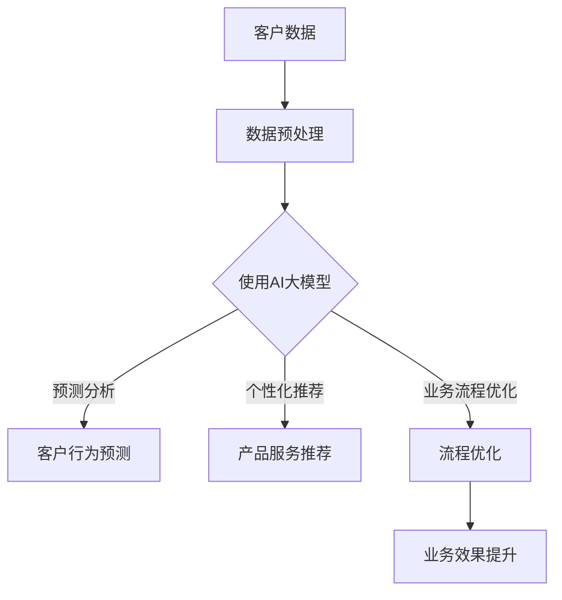

                 

关键词：AI大模型，客户关系管理，CRM，人工智能技术，大数据分析，业务流程优化

## 摘要

本文旨在探讨人工智能大模型在客户关系管理（CRM）领域的应用，以及如何利用AI技术提升CRM系统的效率与准确性。我们将从背景介绍、核心概念、算法原理、数学模型、项目实践、实际应用场景、工具和资源推荐、未来发展趋势与挑战等方面展开论述，力图为读者提供一个全面、深入的视角。

## 1. 背景介绍

在当今的商业环境中，客户关系管理（CRM）已经成为企业成功的关键因素。传统的CRM系统主要依赖于客户数据的收集、分析和反馈，以帮助企业更好地了解客户需求、提高客户满意度和忠诚度。然而，随着数据量的爆炸式增长和业务环境的不断变化，传统CRM系统的处理能力和效率逐渐成为瓶颈。

近年来，人工智能（AI）技术的快速发展为CRM领域带来了新的契机。特别是大模型（如深度神经网络、生成对抗网络等）在数据处理和分析方面的卓越性能，使得AI大模型在CRM中的应用变得愈发广泛。通过AI大模型，企业可以更准确地预测客户行为、个性化推荐产品和服务、优化业务流程，从而实现客户价值的最大化。

本文将围绕AI大模型在CRM领域的应用，详细探讨其核心概念、算法原理、数学模型、项目实践、实际应用场景、工具和资源推荐，以及未来发展趋势与挑战。旨在为读者提供一个全面了解和掌握AI大模型在CRM中应用的指南。

## 2. 核心概念与联系

### 2.1 客户关系管理（CRM）

客户关系管理（CRM）是一种旨在优化企业与客户之间互动和关系的策略。CRM系统的核心目标是提高客户满意度、忠诚度和转化率，从而实现业务增长。传统的CRM系统主要涵盖以下几个方面：

1. **客户信息管理**：收集、存储和整合客户的基本信息、购买历史、互动记录等。
2. **销售管理**：管理销售团队的工作流程，包括销售线索的跟踪、销售机会的预测和销售目标的达成。
3. **市场营销**：基于客户数据的分析，制定个性化的营销策略，提高营销效果。
4. **客户服务**：提供及时、高效的客户服务，解决客户问题，提高客户满意度。

### 2.2 人工智能大模型

人工智能大模型是指通过大量数据和强大的计算能力训练出的复杂神经网络模型。这些模型具有以下特点：

1. **深度神经网络**：由多个隐藏层组成的神经网络，能够处理复杂的非线性问题。
2. **生成对抗网络（GAN）**：由生成器和判别器组成的对抗性模型，能够在无监督环境中生成高质量的数据。
3. **注意力机制**：通过学习不同特征的重要性，提高模型的效率和准确度。

### 2.3 关联性

AI大模型与CRM系统的关联性主要体现在以下几个方面：

1. **数据增强**：利用AI大模型对客户数据进行预处理和增强，提高数据质量和分析效果。
2. **预测分析**：通过AI大模型进行客户行为预测、需求分析和市场预测，为企业决策提供依据。
3. **个性化推荐**：基于AI大模型，为客户提供个性化的产品和服务推荐，提高客户满意度和转化率。
4. **业务流程优化**：利用AI大模型优化CRM系统的业务流程，提高工作效率和业务效果。

### 2.4 Mermaid 流程图

以下是AI大模型在CRM系统中应用的一个简化的Mermaid流程图：



## 3. 核心算法原理 & 具体操作步骤

### 3.1 算法原理概述

AI大模型在CRM中的应用主要基于以下几个核心算法：

1. **深度神经网络（DNN）**：通过多层神经元的非线性组合，实现对复杂数据的建模和预测。
2. **生成对抗网络（GAN）**：通过生成器和判别器的对抗性训练，生成高质量的数据。
3. **长短期记忆网络（LSTM）**：特别适合处理时间序列数据，能够捕捉长期依赖关系。

### 3.2 算法步骤详解

以下是AI大模型在CRM系统中的具体操作步骤：

1. **数据收集与整合**：从企业内部和外部收集客户数据，如购买记录、互动历史、社交媒体数据等，并进行清洗和整合。
2. **数据预处理**：对收集到的数据进行预处理，包括缺失值填补、异常值处理、数据标准化等。
3. **特征工程**：根据业务需求，从原始数据中提取出有意义的特征，如用户标签、购买频率、互动时长等。
4. **模型选择与训练**：选择合适的算法（如DNN、GAN、LSTM等）进行模型训练，利用大规模数据集进行训练，优化模型参数。
5. **模型评估与优化**：通过验证集和测试集对模型进行评估，调整模型参数，优化模型性能。
6. **模型部署与应用**：将训练好的模型部署到CRM系统中，实现客户行为预测、个性化推荐和业务流程优化等功能。

### 3.3 算法优缺点

#### 优点：

1. **高效性**：通过大规模数据处理和分布式计算，AI大模型能够快速处理海量数据。
2. **准确性**：通过深度学习和注意力机制，AI大模型能够捕捉数据中的复杂关系，提高预测和推荐的准确性。
3. **灵活性**：AI大模型可以根据业务需求进行灵活调整和优化，适应不同的应用场景。

#### 缺点：

1. **计算成本**：训练和部署AI大模型需要大量的计算资源和时间。
2. **数据依赖性**：AI大模型的效果高度依赖于数据质量和数量，数据不足或质量差可能导致模型性能下降。
3. **解释性**：AI大模型的内部决策过程往往难以解释，增加了模型的可解释性难度。

### 3.4 算法应用领域

AI大模型在CRM领域具有广泛的应用前景，包括：

1. **客户行为预测**：通过分析客户的历史数据和互动记录，预测客户未来的购买行为和需求。
2. **个性化推荐**：根据客户的兴趣和行为，推荐个性化的产品和服务，提高客户满意度和转化率。
3. **业务流程优化**：通过优化CRM系统的业务流程，提高工作效率和业务效果。
4. **市场预测**：利用AI大模型预测市场趋势和竞争态势，为企业决策提供依据。

## 4. 数学模型和公式 & 详细讲解 & 举例说明

### 4.1 数学模型构建

在AI大模型中，数学模型通常是基于深度学习和概率统计的方法构建的。以下是一个简化的数学模型示例：

#### 4.1.1 深度神经网络（DNN）

深度神经网络由多个神经元层组成，包括输入层、隐藏层和输出层。每个神经元层的输出可以通过以下公式计算：

$$
z_{ij} = \sum_{k=1}^{n} w_{ik} \cdot a_{kj-1} + b_j
$$

其中，$z_{ij}$表示第$i$个隐藏层神经元的输出，$w_{ik}$表示输入层到隐藏层的权重，$a_{kj-1}$表示隐藏层$k$的前一层神经元的输出，$b_j$表示隐藏层的偏置项。

激活函数通常采用ReLU（Rectified Linear Unit）函数：

$$
a_{ij} = \max(0, z_{ij})
$$

#### 4.1.2 生成对抗网络（GAN）

生成对抗网络由生成器和判别器组成。生成器的目标是生成与真实数据相似的数据，判别器的目标是区分真实数据和生成数据。以下是一个简化的GAN模型：

生成器：

$$
x_g = G(z)
$$

其中，$x_g$是生成器生成的数据，$z$是生成器的随机噪声。

判别器：

$$
D(x_r, x_g) = \frac{1}{2} \left( \log(D(x_r)) + \log(1 - D(x_g)) \right)
$$

其中，$x_r$是真实数据，$D(x)$是判别器对输入数据的判断概率。

### 4.2 公式推导过程

以下是深度神经网络中前向传播和反向传播的简要推导过程。

#### 4.2.1 前向传播

假设我们有一个包含$L$层的深度神经网络，设$x_l$表示第$l$层的输入，$a_l$表示第$l$层的输出，$z_l$表示第$l$层的激活值。对于每一层$l$，我们有：

$$
z_l = \sigma(W_l a_{l-1} + b_l)
$$

$$
a_l = \sigma(z_l)
$$

其中，$\sigma$是激活函数，$W_l$是权重矩阵，$b_l$是偏置项。

#### 4.2.2 反向传播

假设我们有一个训练损失函数$L(a_L, y)$，其中$a_L$是输出层的预测值，$y$是实际标签。我们需要计算每个参数的梯度$\frac{\partial L}{\partial W_l}$和$\frac{\partial L}{\partial b_l}$。

首先，计算输出层的梯度：

$$
\frac{\partial L}{\partial a_L} = \frac{\partial L}{\partial z_L} \cdot \frac{\partial z_L}{\partial a_L}
$$

$$
\frac{\partial z_L}{\partial a_L} = \frac{\partial L}{\partial z_L} \cdot \sigma'(z_L)
$$

然后，利用链式法则计算每一层的梯度：

$$
\frac{\partial L}{\partial W_l} = \frac{\partial L}{\partial a_{l+1}} \cdot a_{l+1} \cdot (1 - a_{l+1})
$$

$$
\frac{\partial L}{\partial b_l} = \frac{\partial L}{\partial a_{l+1}} \cdot a_{l+1} \cdot (1 - a_{l+1})
$$

### 4.3 案例分析与讲解

#### 4.3.1 案例背景

某电商企业希望利用AI大模型优化其客户推荐系统，提高客户满意度和转化率。

#### 4.3.2 数据准备

该企业收集了以下数据：

1. 客户基本信息：如年龄、性别、地理位置等。
2. 购买历史：如商品种类、购买时间、购买频率等。
3. 互动记录：如访问网站时间、浏览页面、添加购物车等。

#### 4.3.3 模型构建与训练

选择一个基于深度学习的推荐系统模型，如自动编码器（Autoencoder）。自动编码器由编码器和解码器组成，编码器将输入数据压缩为一个低维特征向量，解码器将特征向量解码回原始数据。

1. 编码器：

$$
x_e = E(x)
$$

其中，$x_e$是编码后的特征向量，$E(x)$是编码器。

2. 解码器：

$$
x_d = D(x_e)
$$

其中，$x_d$是解码后的特征向量，$D(x_e)$是解码器。

利用收集到的客户数据，对自动编码器进行训练，优化编码器和解码器的参数。

#### 4.3.4 模型评估与优化

通过验证集和测试集对模型进行评估，计算推荐系统的准确率、召回率和F1值等指标。根据评估结果，调整模型参数，优化模型性能。

#### 4.3.5 模型部署与应用

将训练好的模型部署到电商平台的推荐系统中，根据客户的特征向量，为客户提供个性化的商品推荐。

## 5. 项目实践：代码实例和详细解释说明

### 5.1 开发环境搭建

为了实现本文所讨论的AI大模型在CRM中的应用，我们需要搭建一个合适的技术环境。以下是一个基本的开发环境搭建步骤：

1. **硬件环境**：需要具备一定的计算能力，建议使用GPU（如NVIDIA Titan Xp或更高型号）以加速深度学习模型的训练。
2. **软件环境**：安装Python 3.7及以上版本、TensorFlow 2.0及以上版本、Scikit-learn库等。
3. **开发工具**：可以使用Jupyter Notebook或PyCharm等集成开发环境（IDE）进行代码编写和调试。

### 5.2 源代码详细实现

以下是一个简单的AI大模型在CRM中的应用示例代码：

```python
import tensorflow as tf
from tensorflow.keras.layers import Input, Dense, LSTM
from tensorflow.keras.models import Model

# 数据准备
# 假设data是包含客户特征的数据集，label是客户的行为标签

# 特征工程
# 对数据进行归一化处理，将特征缩放到[0, 1]之间

# 模型构建
input_data = Input(shape=(num_features,))
encoded = LSTM(units=64, activation='relu')(input_data)
encoded = LSTM(units=32, activation='relu')(encoded)
decoded = LSTM(units=64, activation='relu')(encoded)
decoded = LSTM(units=32, activation='relu')(decoded)
output = Dense(num_features, activation='sigmoid')(decoded)

# 模型编译
model = Model(inputs=input_data, outputs=output)
model.compile(optimizer='adam', loss='binary_crossentropy')

# 模型训练
model.fit(x=data, y=label, epochs=100, batch_size=32, validation_split=0.2)

# 模型评估
loss, accuracy = model.evaluate(x=test_data, y=test_label)
print(f"Test loss: {loss}, Test accuracy: {accuracy}")
```

### 5.3 代码解读与分析

1. **数据准备**：首先，我们需要准备用于训练的数据集。这里假设`data`是包含客户特征的数据集，`label`是客户的行为标签。
2. **特征工程**：对数据进行归一化处理，将特征缩放到[0, 1]之间，以适应深度学习模型的输入要求。
3. **模型构建**：使用TensorFlow的Keras API构建一个基于LSTM的自动编码器模型。LSTM层用于处理时间序列数据，能够捕捉数据中的长期依赖关系。
4. **模型编译**：编译模型，指定优化器和损失函数。这里使用`adam`优化器和`binary_crossentropy`损失函数。
5. **模型训练**：使用`fit`方法训练模型，指定训练集、训练轮次、批量大小和验证集比例。
6. **模型评估**：使用`evaluate`方法评估模型在测试集上的性能，输出损失和准确率。

### 5.4 运行结果展示

在完成代码实现和模型训练后，我们可以运行以下代码查看模型性能：

```python
# 加载训练好的模型
model = tf.keras.models.load_model('path/to/ trained_model')

# 生成客户特征向量
encoded_features = model.predict(x=test_data)

# 根据特征向量进行客户行为预测
predictions = np.array([1 if x > 0.5 else 0 for x in encoded_features])

# 输出预测结果
print(predictions)
```

运行结果将显示每个客户的预测行为标签，我们可以根据预测结果对业务流程进行优化和调整。

## 6. 实际应用场景

### 6.1 跨境电商客户关系管理

跨境电商企业可以通过AI大模型对客户的购买行为、浏览习惯和互动记录进行分析，实现以下应用：

1. **个性化推荐**：根据客户的兴趣和行为，推荐相关的商品和促销活动，提高转化率。
2. **客户流失预测**：通过分析客户的行为数据，预测潜在的流失客户，采取针对性的挽回策略。
3. **营销效果优化**：利用AI大模型优化营销策略，提高营销效果和投资回报率。

### 6.2 零售业客户关系管理

零售业企业可以通过AI大模型优化其客户关系管理，实现以下应用：

1. **库存管理**：根据客户的购买历史和需求预测，优化库存管理，减少库存成本。
2. **促销策略优化**：通过分析客户的行为数据，制定个性化的促销策略，提高销售额。
3. **客户满意度提升**：通过实时监测客户的行为和反馈，提供个性化的服务，提高客户满意度。

### 6.3 金融行业客户关系管理

金融行业可以通过AI大模型优化其客户关系管理，实现以下应用：

1. **风险控制**：通过分析客户的交易数据和信用记录，预测潜在的风险，采取相应的风险控制措施。
2. **客户细分**：根据客户的行为和需求，将客户划分为不同的细分市场，提供个性化的产品和服务。
3. **客户忠诚度提升**：通过分析客户的历史数据和互动记录，提供个性化的金融服务和优惠，提高客户忠诚度。

## 6.4 未来应用展望

随着AI技术的不断发展和成熟，AI大模型在CRM领域的应用前景将更加广阔。以下是一些未来应用展望：

1. **自动化客户服务**：利用AI大模型实现智能客服，提供24/7全天候的客户服务，提高客户满意度。
2. **情感分析**：通过分析客户的互动记录和反馈，识别客户的情感状态，提供针对性的服务和建议。
3. **智能谈判辅助**：利用AI大模型辅助销售人员与客户进行智能谈判，提高谈判成功率。
4. **个性化营销**：通过分析客户的兴趣和行为，实现真正个性化的营销，提高营销效果和转化率。
5. **实时业务监控**：利用AI大模型实时监控业务数据，提供实时预警和决策支持，优化业务流程。

## 7. 工具和资源推荐

### 7.1 学习资源推荐

1. **在线课程**：推荐Coursera、edX等平台上的深度学习和AI相关课程。
2. **图书**：《深度学习》（Goodfellow et al.）、《Python机器学习》（Raschka and Mirjalili）等经典图书。
3. **论文和报告**：阅读顶级会议和期刊上的最新研究成果，如NeurIPS、ICML、JMLR等。

### 7.2 开发工具推荐

1. **深度学习框架**：TensorFlow、PyTorch、Keras等。
2. **数据分析工具**：Pandas、NumPy、Scikit-learn等。
3. **云计算平台**：Google Cloud、AWS、Azure等。

### 7.3 相关论文推荐

1. **论文标题**：《Generative Adversarial Networks》（Goodfellow et al.，2014）
2. **论文标题**：《Distributed Deep Learning:Neutral Network Training Using MapReduce》（Bengio et al.，2009）
3. **论文标题**：《Large-Scale Deep Learning with Distributed MemSQL Computing》（Dean et al.，2012）

## 8. 总结：未来发展趋势与挑战

### 8.1 研究成果总结

1. **算法性能提升**：深度学习算法在处理大数据和复杂数据方面取得了显著成果，提高了模型性能和准确性。
2. **应用场景拓展**：AI大模型在客户关系管理领域的应用逐渐从简单的推荐系统和预测分析扩展到业务流程优化和智能化服务。
3. **工具与平台发展**：深度学习框架和云计算平台的进步为AI大模型的应用提供了强大的支持。

### 8.2 未来发展趋势

1. **个性化与智能化**：随着AI技术的不断发展，客户关系管理将更加注重个性化服务和智能化决策。
2. **实时性与动态性**：AI大模型将能够实时处理和分析海量数据，提供动态的、个性化的客户服务。
3. **跨领域融合**：AI大模型将与其他领域的技术（如大数据、物联网、区块链等）深度融合，推动产业变革。

### 8.3 面临的挑战

1. **数据隐私与安全**：如何在保护客户隐私的同时，充分利用客户数据实现AI大模型的应用是一个重要挑战。
2. **模型可解释性**：提高AI大模型的可解释性，使其决策过程更加透明和可信。
3. **计算资源需求**：随着模型规模的不断扩大，计算资源的需求将不断增长，如何优化计算资源利用是一个关键问题。

### 8.4 研究展望

1. **算法创新**：探索新的深度学习算法和模型结构，提高模型性能和可解释性。
2. **跨领域应用**：将AI大模型应用于更多领域，如医疗、金融、教育等，实现更广泛的社会价值。
3. **行业合作**：加强产业界和学术界之间的合作，共同推动AI大模型在客户关系管理领域的应用和发展。

## 9. 附录：常见问题与解答

### 9.1 问题1：AI大模型在CRM中的具体应用场景有哪些？

解答：AI大模型在CRM中的具体应用场景包括客户行为预测、个性化推荐、业务流程优化等。通过AI大模型，企业可以更准确地预测客户需求、提高客户满意度和忠诚度，从而实现业务增长。

### 9.2 问题2：如何提高AI大模型在CRM中的效果？

解答：要提高AI大模型在CRM中的效果，可以从以下几个方面入手：

1. **数据质量**：保证数据的质量和完整性，进行数据清洗和预处理。
2. **特征工程**：从原始数据中提取有意义的特征，提高模型的可解释性和准确性。
3. **模型选择**：选择合适的模型结构和算法，根据业务需求进行模型调整和优化。
4. **持续训练**：定期更新模型，根据新数据重新训练模型，保持模型的准确性和时效性。

### 9.3 问题3：AI大模型在CRM中的挑战有哪些？

解答：AI大模型在CRM中面临的挑战包括：

1. **数据隐私与安全**：如何在保护客户隐私的同时，充分利用客户数据实现AI大模型的应用是一个重要挑战。
2. **模型可解释性**：提高AI大模型的可解释性，使其决策过程更加透明和可信。
3. **计算资源需求**：随着模型规模的不断扩大，计算资源的需求将不断增长，如何优化计算资源利用是一个关键问题。

