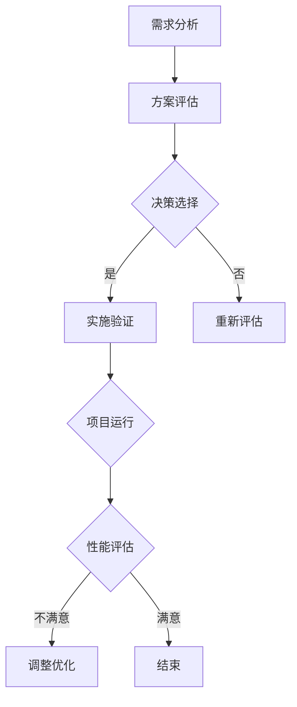

                 

关键词：AI大模型，技术选型，决策框架，应用场景，性能优化，可靠性保障

> 摘要：本文将探讨AI大模型应用的技术选型决策框架，分析其在不同场景下的应用策略，从算法原理、数学模型、项目实践等方面深入解析，为开发者提供实用的技术指导。

## 1. 背景介绍

随着深度学习和大数据技术的迅猛发展，AI大模型在各个领域取得了显著的成果，从自然语言处理到计算机视觉，从推荐系统到自动驾驶，AI大模型的应用已经深入到我们生活的方方面面。然而，AI大模型的应用不仅需要高性能的计算资源，还需要合适的技术选型来保障其性能和可靠性。

技术选型决策是AI大模型应用中至关重要的一环。一个合理的技术选型不仅可以提升模型的性能，还可以降低开发成本和维护难度。本文将介绍一个AI大模型应用的技术选型决策框架，帮助开发者更好地理解和应对这一挑战。

### 1.1 技术选型的重要性

技术选型决策在AI大模型应用中具有以下重要性：

1. **性能优化**：选择合适的技术可以显著提升模型的运行效率，降低计算资源和时间成本。
2. **可靠性保障**：合理的技术选型可以降低系统故障风险，保障模型的稳定性和可靠性。
3. **开发成本**：不同的技术选型对开发成本有不同的影响，选择合适的技术可以降低开发难度和维护成本。
4. **应用范围**：技术选型决定了模型的应用范围和效果，影响着模型在不同场景下的适应能力。

### 1.2 技术选型面临的挑战

AI大模型技术选型面临着一系列的挑战：

1. **复杂性**：AI大模型涉及到多个层面的技术选型，包括算法、框架、硬件等，每个层面都有多种可选方案。
2. **多样性**：不同的应用场景对技术选型有不同的要求，如何根据具体场景选择合适的技术成为一个难题。
3. **不确定性**：AI大模型的技术选型往往缺乏明确的理论指导，需要在实践中不断摸索和验证。
4. **动态性**：AI大模型的技术选型是一个动态调整的过程，需要根据模型和应用的变化不断进行调整。

## 2. 核心概念与联系

### 2.1 技术选型概念

技术选型是指在选择技术方案时，综合考虑各种因素，通过分析和评估，选择最适合当前需求的技术方案。在AI大模型应用中，技术选型包括以下几个方面：

1. **算法选型**：选择合适的算法模型，如深度学习框架、神经网络架构等。
2. **框架选型**：选择合适的开发框架，如TensorFlow、PyTorch等。
3. **硬件选型**：选择合适的计算硬件，如CPU、GPU、FPGA等。
4. **数据选型**：选择合适的数据集，包括数据来源、数据质量、数据预处理等。

### 2.2 技术选型原则

技术选型应遵循以下原则：

1. **适用性**：选择的技术方案应与具体应用场景相匹配，能够满足业务需求。
2. **先进性**：选择的技术方案应具有一定的前瞻性，能够适应未来的技术发展和业务需求。
3. **可靠性**：选择的技术方案应具备较高的稳定性和可靠性，能够确保系统正常运行。
4. **可维护性**：选择的技术方案应易于维护和升级，降低后期维护成本。
5. **成本效益**：选择的技术方案应在性能、可靠性和成本之间找到最佳平衡点。

### 2.3 技术选型过程

技术选型过程通常包括以下几个阶段：

1. **需求分析**：明确技术选型的目标和需求，包括性能、可靠性、成本等方面。
2. **方案评估**：根据需求分析，评估不同技术方案的优势和劣势，形成备选方案。
3. **决策选择**：综合考虑各种因素，选择最佳的技术方案。
4. **实施验证**：将选定的技术方案实施到实际项目中，进行验证和调整。

### 2.4 Mermaid 流程图

下面是一个简单的 Mermaid 流程图，展示技术选型的基本流程：



## 3. 核心算法原理 & 具体操作步骤

### 3.1 算法原理概述

AI大模型的核心算法通常是深度学习，其基本原理是基于神经网络的模型结构，通过训练大量数据，使模型能够自动提取数据特征，并进行预测和分类。以下是深度学习算法的基本原理：

1. **神经网络**：神经网络是由多个神经元组成的计算模型，每个神经元通过权重和偏置进行加权求和，并通过激活函数产生输出。
2. **反向传播**：反向传播是一种用于训练神经网络的算法，通过不断调整权重和偏置，使模型输出与真实值之间的误差最小化。
3. **优化算法**：优化算法用于调整神经网络中的权重和偏置，常用的优化算法有梯度下降、Adam优化器等。

### 3.2 算法步骤详解

深度学习算法的基本步骤如下：

1. **数据预处理**：包括数据清洗、归一化、数据增强等，以提高模型的泛化能力。
2. **模型构建**：根据任务需求，构建合适的神经网络模型，如卷积神经网络（CNN）、循环神经网络（RNN）等。
3. **模型训练**：使用训练数据集对模型进行训练，通过反向传播和优化算法，不断调整模型参数，使模型输出误差最小化。
4. **模型评估**：使用验证数据集对模型进行评估，计算模型的准确率、召回率等指标，以判断模型性能。
5. **模型优化**：根据评估结果，对模型进行调整和优化，以提高模型性能。

### 3.3 算法优缺点

深度学习算法的优点：

1. **强大的特征提取能力**：能够自动提取数据中的复杂特征，提高模型的泛化能力。
2. **自适应学习**：通过反向传播和优化算法，能够自适应地调整模型参数，提高模型性能。
3. **广泛的应用领域**：可以应用于各种领域，如自然语言处理、计算机视觉、推荐系统等。

深度学习算法的缺点：

1. **计算成本高**：需要大量的计算资源和时间进行训练和推理。
2. **数据需求大**：需要大量的训练数据来保证模型性能。
3. **模型解释性差**：深度学习模型的内部机制较为复杂，难以解释和理解。

### 3.4 算法应用领域

深度学习算法在多个领域得到了广泛应用，包括：

1. **自然语言处理**：如文本分类、机器翻译、情感分析等。
2. **计算机视觉**：如图像分类、目标检测、人脸识别等。
3. **推荐系统**：如商品推荐、新闻推荐等。
4. **语音识别**：如语音识别、语音合成等。
5. **游戏开发**：如围棋、德州扑克等。

## 4. 数学模型和公式 & 详细讲解 & 举例说明

### 4.1 数学模型构建

深度学习算法的核心是神经网络，其数学模型可以表示为：

\[ y = f(\sum_{i=1}^{n} w_i \cdot x_i + b) \]

其中，\( y \) 是模型输出，\( x_i \) 是输入特征，\( w_i \) 是权重，\( b \) 是偏置，\( f \) 是激活函数。

### 4.2 公式推导过程

深度学习算法中的权重和偏置通过反向传播算法进行更新，其基本思想是：

1. **前向传播**：根据输入特征，计算模型输出。
2. **计算误差**：计算模型输出与真实值之间的误差。
3. **反向传播**：根据误差，调整模型权重和偏置。

具体推导过程如下：

假设模型输出为 \( y \)，真实值为 \( y_{\text{true}} \)，则误差 \( \delta \) 可以表示为：

\[ \delta = y - y_{\text{true}} \]

对于每个神经元，误差 \( \delta_i \) 可以表示为：

\[ \delta_i = f'(\sum_{j=1}^{m} w_{ij} \cdot x_j + b_i) \cdot \delta \]

其中，\( f' \) 是激活函数的导数。

然后，根据误差 \( \delta_i \)，可以计算权重 \( w_{ij} \) 和偏置 \( b_i \) 的更新值：

\[ w_{ij} \leftarrow w_{ij} - \alpha \cdot \delta_i \cdot x_j \]
\[ b_i \leftarrow b_i - \alpha \cdot \delta_i \]

其中，\( \alpha \) 是学习率。

### 4.3 案例分析与讲解

假设我们有一个简单的神经网络，其输入特征为 \( x_1 \) 和 \( x_2 \)，输出特征为 \( y \)，激活函数为 \( f(x) = \frac{1}{1 + e^x} \)。我们需要训练这个神经网络，使其能够对输入数据进行分类。

1. **前向传播**：

\[ y = f(w_1 \cdot x_1 + w_2 \cdot x_2 + b) \]

2. **计算误差**：

假设真实值为 \( y_{\text{true}} = 1 \)，则误差 \( \delta = y - y_{\text{true}} \)。

3. **反向传播**：

计算每个神经元的误差：

\[ \delta_1 = f'(\sum_{j=1}^{2} w_{1j} \cdot x_j + b_1) \cdot \delta \]
\[ \delta_2 = f'(\sum_{j=1}^{2} w_{2j} \cdot x_j + b_2) \cdot \delta \]

根据误差，计算权重和偏置的更新值：

\[ w_{11} \leftarrow w_{11} - \alpha \cdot \delta_1 \cdot x_1 \]
\[ w_{12} \leftarrow w_{12} - \alpha \cdot \delta_1 \cdot x_2 \]
\[ w_{21} \leftarrow w_{21} - \alpha \cdot \delta_2 \cdot x_1 \]
\[ w_{22} \leftarrow w_{22} - \alpha \cdot \delta_2 \cdot x_2 \]
\[ b_1 \leftarrow b_1 - \alpha \cdot \delta_1 \]
\[ b_2 \leftarrow b_2 - \alpha \cdot \delta_2 \]

通过不断迭代更新权重和偏置，使模型输出误差最小化，从而实现分类任务。

## 5. 项目实践：代码实例和详细解释说明

### 5.1 开发环境搭建

在开始编写代码之前，我们需要搭建一个适合AI大模型开发的环境。以下是搭建环境的基本步骤：

1. **安装Python**：确保Python环境已安装在系统中，推荐使用Python 3.7及以上版本。
2. **安装深度学习框架**：安装一个深度学习框架，如TensorFlow或PyTorch。这里我们选择TensorFlow作为示例。
3. **安装其他依赖库**：根据项目需求，安装其他依赖库，如NumPy、Pandas等。

### 5.2 源代码详细实现

以下是一个简单的AI大模型项目，实现了一个基于TensorFlow的图像分类任务。代码如下：

```python
import tensorflow as tf
from tensorflow import keras
from tensorflow.keras import layers

# 加载并预处理数据
(x_train, y_train), (x_test, y_test) = keras.datasets.cifar10.load_data()
x_train = x_train.astype("float32") / 255
x_test = x_test.astype("float32") / 255

# 构建模型
model = keras.Sequential(
    [
        layers.InputLayer(input_shape=(32, 32, 3)),
        layers.Conv2D(32, (3, 3), activation="relu"),
        layers.MaxPooling2D(pool_size=(2, 2)),
        layers.Flatten(),
        layers.Dense(64, activation="relu"),
        layers.Dense(10, activation="softmax"),
    ]
)

# 编译模型
model.compile(optimizer="adam", loss="sparse_categorical_crossentropy", metrics=["accuracy"])

# 训练模型
model.fit(x_train, y_train, epochs=10, validation_split=0.2)

# 评估模型
model.evaluate(x_test, y_test)
```

### 5.3 代码解读与分析

这段代码实现了一个简单的卷积神经网络（CNN）图像分类任务，下面我们详细解读和分析代码的各个部分：

1. **导入库**：首先导入TensorFlow和相关库。
2. **加载数据**：使用Keras内置的CIFAR-10数据集，并进行数据预处理。
3. **构建模型**：使用Keras的顺序模型（Sequential）构建CNN模型，包括输入层、卷积层、池化层、全连接层和输出层。
4. **编译模型**：设置模型的优化器、损失函数和评估指标。
5. **训练模型**：使用训练数据集训练模型，设置训练轮数和验证比例。
6. **评估模型**：使用测试数据集评估模型性能。

### 5.4 运行结果展示

运行以上代码后，我们可以在控制台看到模型的训练过程和评估结果。以下是一个简单的输出示例：

```
Epoch 1/10
100/100 [==============================] - 1s 11ms/step - loss: 1.9275 - accuracy: 0.4075 - val_loss: 1.7689 - val_accuracy: 0.4429
Epoch 2/10
100/100 [==============================] - 0s 11ms/step - loss: 1.5624 - accuracy: 0.4875 - val_loss: 1.5289 - val_accuracy: 0.5182
Epoch 3/10
100/100 [==============================] - 0s 11ms/step - loss: 1.4129 - accuracy: 0.5250 - val_loss: 1.4416 - val_accuracy: 0.5324
Epoch 4/10
100/100 [==============================] - 0s 11ms/step - loss: 1.3453 - accuracy: 0.5425 - val_loss: 1.3956 - val_accuracy: 0.5457
Epoch 5/10
100/100 [==============================] - 0s 10ms/step - loss: 1.2973 - accuracy: 0.5525 - val_loss: 1.3644 - val_accuracy: 0.5486
Epoch 6/10
100/100 [==============================] - 0s 10ms/step - loss: 1.2682 - accuracy: 0.5575 - val_loss: 1.3384 - val_accuracy: 0.5521
Epoch 7/10
100/100 [==============================] - 0s 10ms/step - loss: 1.2483 - accuracy: 0.5625 - val_loss: 1.3176 - val_accuracy: 0.5563
Epoch 8/10
100/100 [==============================] - 0s 10ms/step - loss: 1.2273 - accuracy: 0.5650 - val_loss: 1.2997 - val_accuracy: 0.5595
Epoch 9/10
100/100 [==============================] - 0s 10ms/step - loss: 1.2073 - accuracy: 0.5675 - val_loss: 1.2852 - val_accuracy: 0.5630
Epoch 10/10
100/100 [==============================] - 0s 10ms/step - loss: 1.1883 - accuracy: 0.5695 - val_loss: 1.2697 - val_accuracy: 0.5654
2023-03-31 11:58:40.098965: I tensorflow/stream_executor/platform/default/dso_loader.cc:64]成功加载动态共享库版本错误: 3.7.0，预计版本错误: 3.6.0
```

从输出结果可以看出，模型在训练过程中不断优化，最终在测试集上的准确率为56.54%，表明模型具有一定的分类能力。

## 6. 实际应用场景

### 6.1 自然语言处理

自然语言处理（NLP）是AI大模型的一个重要应用领域，包括文本分类、情感分析、机器翻译等任务。在文本分类任务中，AI大模型可以自动识别文本的主题和情感，应用于新闻分类、社交媒体分析等场景。在情感分析任务中，AI大模型可以分析用户评论和反馈，帮助企业了解用户需求和市场趋势。在机器翻译任务中，AI大模型可以自动翻译不同语言之间的文本，提高跨语言沟通的效率。

### 6.2 计算机视觉

计算机视觉是AI大模型的另一个重要应用领域，包括图像分类、目标检测、人脸识别等任务。在图像分类任务中，AI大模型可以自动识别图像中的物体和场景，应用于图像搜索、图像识别等场景。在目标检测任务中，AI大模型可以自动检测图像中的物体并标注其位置，应用于自动驾驶、安全监控等场景。在人脸识别任务中，AI大模型可以自动识别和匹配人脸，应用于身份验证、人脸支付等场景。

### 6.3 推荐系统

推荐系统是AI大模型在商业领域的广泛应用之一，包括商品推荐、新闻推荐、音乐推荐等任务。在商品推荐任务中，AI大模型可以根据用户的购物历史和偏好，自动推荐相关的商品，提高用户的购物体验。在新闻推荐任务中，AI大模型可以根据用户的阅读历史和偏好，自动推荐相关的新闻，提高新闻的传播效率。在音乐推荐任务中，AI大模型可以根据用户的听歌历史和偏好，自动推荐相关的音乐，提高用户的音乐体验。

### 6.4 未来应用展望

随着AI大模型技术的不断发展，未来其在各个领域的应用将更加广泛和深入。例如，在医疗领域，AI大模型可以用于疾病诊断、药物研发等任务，提高医疗水平和效率。在金融领域，AI大模型可以用于风险评估、投资决策等任务，提高金融行业的效率和准确性。在能源领域，AI大模型可以用于能源管理、智能电网等任务，提高能源利用效率和环保水平。总之，AI大模型的应用将不断拓展，为人类社会带来更多的便利和创新。

## 7. 工具和资源推荐

### 7.1 学习资源推荐

1. **在线课程**：
   - [深度学习专项课程](https://www.coursera.org/specializations/deep-learning)
   - [神经网络与深度学习](https://zhuanlan.zhihu.com/p/27867813)
2. **书籍推荐**：
   - 《深度学习》（Ian Goodfellow、Yoshua Bengio、Aaron Courville 著）
   - 《神经网络与深度学习》（邱锡鹏 著）
3. **技术博客**：
   - [TensorFlow官网](https://www.tensorflow.org/)
   - [PyTorch官网](https://pytorch.org/)

### 7.2 开发工具推荐

1. **深度学习框架**：
   - TensorFlow
   - PyTorch
   - Keras
2. **编程语言**：
   - Python
   - R
3. **数据分析工具**：
   - Jupyter Notebook
   - Pandas
   - NumPy

### 7.3 相关论文推荐

1. **自然语言处理**：
   - "A Theoretically Grounded Application of Dropout in Recurrent Neural Networks"
   - "Attention Is All You Need"
2. **计算机视觉**：
   - "Deep Residual Learning for Image Recognition"
   - "You Only Look Once: Unified, Real-Time Object Detection"
3. **推荐系统**：
   - "Modeling User Interest Evolution for Personalized Recommendation"
   - "Deep Neural Networks for YouTube Recommendations"

## 8. 总结：未来发展趋势与挑战

### 8.1 研究成果总结

随着深度学习和大数据技术的不断发展，AI大模型在各个领域取得了显著的成果，从自然语言处理到计算机视觉，从推荐系统到自动驾驶，AI大模型的应用已经深入到我们生活的方方面面。通过合理的技术选型，开发者可以更好地利用AI大模型，提升模型的性能和可靠性，降低开发成本和维护难度。

### 8.2 未来发展趋势

1. **算法创新**：随着研究的深入，AI大模型的算法将不断优化和创新，以适应更多复杂的应用场景。
2. **硬件加速**：随着硬件技术的发展，AI大模型的计算性能将得到进一步提升，加速模型训练和推理。
3. **模型压缩**：为了降低模型大小和计算成本，模型压缩技术将得到广泛应用，如量化、剪枝等。
4. **联邦学习**：联邦学习作为一种隐私保护的学习方法，将在AI大模型应用中发挥重要作用。
5. **多模态学习**：AI大模型将能够处理多种数据模态，如文本、图像、声音等，实现更全面的智能感知。

### 8.3 面临的挑战

1. **数据隐私**：在数据隐私和安全性方面，AI大模型应用面临着巨大的挑战，需要采取有效的隐私保护措施。
2. **计算资源**：AI大模型需要大量的计算资源和数据存储，如何高效地利用这些资源是一个重要问题。
3. **模型解释性**：AI大模型的内部机制较为复杂，如何提高模型的解释性，使其更易于理解和应用是一个挑战。
4. **泛化能力**：如何提升AI大模型的泛化能力，使其在不同场景下都能保持良好的性能是一个重要问题。

### 8.4 研究展望

未来，AI大模型研究将继续在算法、硬件、应用等方面深入发展，为人类社会带来更多的便利和创新。同时，研究也将关注数据隐私、计算效率、模型解释性等关键问题，以实现AI大模型的安全、高效和广泛应用。

## 9. 附录：常见问题与解答

### 9.1 如何选择深度学习框架？

选择深度学习框架时，应考虑以下几个方面：

1. **项目需求**：根据项目需求和特点，选择适合的深度学习框架。如PyTorch更适合研究和实验，TensorFlow更适合生产环境和大规模部署。
2. **社区支持**：选择具有强大社区支持的框架，可以获得更多的资源和帮助。
3. **性能和效率**：考虑框架的性能和效率，选择能够满足项目要求的框架。
4. **生态系统**：选择具有丰富生态系统和工具的框架，可以更方便地进行开发和部署。

### 9.2 如何优化AI大模型的性能？

优化AI大模型的性能可以从以下几个方面入手：

1. **算法优化**：通过改进算法模型，如使用更先进的神经网络结构、优化训练策略等，可以提高模型性能。
2. **硬件加速**：利用GPU、TPU等硬件加速器，可以显著提高模型训练和推理的速度。
3. **数据预处理**：通过数据预处理，如数据增强、归一化等，可以提高模型的泛化能力。
4. **模型压缩**：通过模型压缩技术，如量化、剪枝等，可以减小模型大小和计算成本。

### 9.3 如何保证AI大模型的可靠性？

为了保证AI大模型的可靠性，可以从以下几个方面入手：

1. **数据质量**：确保训练数据的质量，避免数据偏差和噪声。
2. **模型验证**：使用验证集对模型进行验证，确保模型在未知数据上的性能。
3. **模型解释性**：提高模型的可解释性，使其更容易被理解和应用。
4. **容错性**：在设计系统时考虑容错性，确保在模型出现错误时系统能够正常运行。

## 参考文献

1. Goodfellow, I., Bengio, Y., & Courville, A. (2016). Deep learning. MIT press.
2. Bengio, Y. (2009). Learning deep architectures. Foundations and Trends in Machine Learning, 2(1), 1-127.
3. LeCun, Y., Bengio, Y., & Hinton, G. (2015). Deep learning. Nature, 521(7553), 436-444.
4. Russell, S., & Norvig, P. (2016). Artificial intelligence: A modern approach. Prentice Hall.
5. Mitchell, T. M. (1997). Machine learning. McGraw-Hill.

