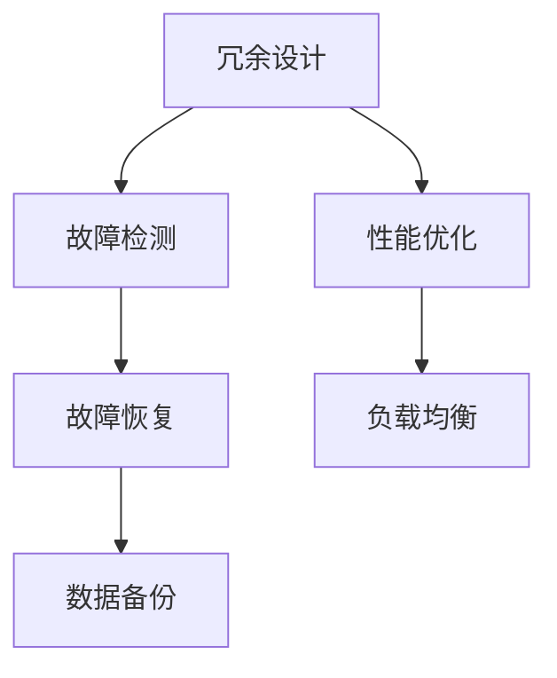

                 

关键词：AI大模型、灾备、容错、设计模式、云计算、分布式系统、数据冗余、故障切换、容错恢复、性能优化

## 摘要

本文探讨了在AI大模型应用中如何设计有效的灾备与容错机制，以保障系统的稳定性和可靠性。随着AI技术的快速发展，大模型在图像识别、自然语言处理、推荐系统等领域发挥着越来越重要的作用。然而，这些模型通常需要大量的计算资源和数据存储，并且在运行过程中可能会面临各种不确定性因素，如硬件故障、网络问题、数据损坏等。因此，本文重点介绍了灾备与容错设计模式，包括冗余设计、故障检测与恢复、性能优化等技术，旨在为AI大模型应用提供一套完整的灾备与容错解决方案。

## 1. 背景介绍

随着人工智能技术的不断进步，大模型（Large-scale Models）在各个领域得到了广泛应用。这些大模型通常具有以下特点：

1. **数据量巨大**：大模型需要处理的数据量往往达到数百万、数千万甚至数亿级别。
2. **计算资源需求高**：大模型的训练和推理需要大量计算资源，尤其是在深度学习领域。
3. **系统复杂性高**：大模型的构建和部署涉及到复杂的系统架构，包括分布式计算、数据存储、网络通信等。
4. **不确定性因素多**：大模型应用过程中可能面临各种不确定性因素，如硬件故障、网络波动、数据损坏等。

这些特点使得大模型在应用过程中面临诸多挑战，如系统稳定性、数据安全性、计算效率等。因此，如何设计有效的灾备与容错机制，成为了当前AI领域亟需解决的问题。

### 1.1 灾备与容错的概念

灾备（Disaster Recovery）和容错（Fault Tolerance）是两个密切相关但有所区别的概念。

**灾备**：灾备是指当系统发生灾难性事件（如火灾、地震、洪水等）时，如何快速恢复系统的正常运行。灾备的核心目标是保障数据的完整性和系统的可用性。

**容错**：容错是指系统在发生故障时，如何自动恢复并继续提供服务。容错的核心目标是确保系统的连续性和可靠性。

### 1.2 灾备与容错的重要性

在AI大模型应用中，灾备与容错的重要性体现在以下几个方面：

1. **数据安全性**：大模型通常涉及大量敏感数据，如用户个人信息、商业机密等。灾备与容错机制可以确保这些数据在故障发生时不会丢失。
2. **系统稳定性**：AI大模型应用往往对系统稳定性有较高要求，因为故障会导致模型预测准确性下降，从而影响业务运营。
3. **业务连续性**：对于一些关键业务场景，如金融交易、在线医疗等，系统的连续性至关重要。灾备与容错机制可以保障业务在故障发生时迅速恢复，减少业务中断时间。
4. **计算效率**：有效的灾备与容错设计可以提高系统资源利用率，减少计算资源的浪费。

### 1.3 AI大模型应用中的灾备与容错需求

在AI大模型应用中，灾备与容错的需求主要来源于以下几个方面：

1. **计算资源**：大模型训练和推理需要大量计算资源，硬件故障可能导致计算资源损失。
2. **数据存储**：大模型涉及海量数据存储，存储设备故障可能导致数据丢失。
3. **网络通信**：大模型应用通常涉及分布式计算和存储，网络故障可能导致通信中断。
4. **系统复杂性**：大模型应用系统复杂度高，故障检测和恢复过程更加复杂。

## 2. 核心概念与联系

在探讨AI大模型应用的灾备与容错设计模式之前，首先需要了解一些核心概念和它们之间的关系。

### 2.1 冗余设计

冗余设计（Redundancy Design）是灾备与容错的基础。冗余设计包括硬件冗余、软件冗余和数据冗余。

1. **硬件冗余**：通过增加硬件设备，如多台服务器、存储设备等，确保系统在高可用性（High Availability）状态下运行。
2. **软件冗余**：通过冗余的软件模块，确保系统在软件故障时能够自动切换到备用模块。
3. **数据冗余**：通过数据备份和复制，确保数据在故障发生时能够快速恢复。

### 2.2 故障检测与恢复

故障检测与恢复（Fault Detection and Recovery）是灾备与容错的核心。故障检测主要包括以下几个方面：

1. **硬件故障检测**：通过硬件监控工具，实时检测服务器、存储设备等硬件设备的运行状态。
2. **软件故障检测**：通过系统日志、错误报告等，实时监测软件系统的运行状态。
3. **网络故障检测**：通过网络监控工具，实时检测网络连接状态和传输速率。

故障恢复主要包括以下几个方面：

1. **硬件故障恢复**：在检测到硬件故障后，自动切换到备用硬件设备，确保系统继续运行。
2. **软件故障恢复**：在检测到软件故障后，自动重启或切换到备用软件模块，确保系统继续运行。
3. **数据恢复**：在检测到数据损坏或丢失后，通过备份和复制机制，快速恢复数据。

### 2.3 性能优化

性能优化（Performance Optimization）是灾备与容错的重要补充。性能优化包括以下几个方面：

1. **负载均衡**：通过负载均衡技术，合理分配计算资源，避免单点故障导致的性能瓶颈。
2. **缓存机制**：通过缓存机制，减少对数据存储的访问次数，提高系统响应速度。
3. **分布式计算**：通过分布式计算技术，将计算任务分散到多个节点，提高系统吞吐量和处理能力。

### 2.4 Mermaid 流程图

下面是一个简化的 Mermaid 流程图，展示了灾备与容错设计模式的核心组件和它们之间的关系。



## 3. 核心算法原理 & 具体操作步骤

### 3.1 算法原理概述

灾备与容错设计模式的核心算法包括冗余设计、故障检测与恢复、性能优化等。这些算法的实现依赖于分布式系统、云计算、数据存储和监控等技术。

1. **冗余设计**：通过硬件冗余、软件冗余和数据冗余，确保系统在高可用性状态下运行。
2. **故障检测**：通过硬件监控、软件监控和网络监控，实时检测系统的运行状态。
3. **故障恢复**：在检测到故障后，自动切换到备用硬件或软件，确保系统继续运行。
4. **性能优化**：通过负载均衡、缓存机制和分布式计算，提高系统性能和吞吐量。

### 3.2 算法步骤详解

下面将详细阐述灾备与容错设计模式的具体操作步骤。

#### 3.2.1 冗余设计

1. **硬件冗余**：
   - 在硬件层面，通过多台服务器、存储设备等，确保在单点故障时，系统可以切换到备用设备。
   - 实现方法：使用集群技术，如Kubernetes，实现服务器的高可用性。

2. **软件冗余**：
   - 在软件层面，通过冗余的软件模块，确保在单点故障时，系统可以切换到备用模块。
   - 实现方法：使用服务化架构，如微服务架构，实现软件的高可用性。

3. **数据冗余**：
   - 在数据层面，通过数据备份和复制，确保在数据损坏或丢失时，可以快速恢复。
   - 实现方法：使用分布式存储系统，如Hadoop或Cassandra，实现数据的高可用性。

#### 3.2.2 故障检测

1. **硬件故障检测**：
   - 使用硬件监控工具，如Nagios，实时监控服务器、存储设备的运行状态。
   - 当检测到硬件故障时，自动触发故障恢复流程。

2. **软件故障检测**：
   - 使用系统日志、错误报告等，实时监测软件系统的运行状态。
   - 当检测到软件故障时，自动重启或切换到备用软件模块。

3. **网络故障检测**：
   - 使用网络监控工具，如Zabbix，实时检测网络连接状态和传输速率。
   - 当检测到网络故障时，自动切换到备用网络或重新配置网络。

#### 3.2.3 故障恢复

1. **硬件故障恢复**：
   - 在检测到硬件故障后，自动切换到备用硬件设备，确保系统继续运行。

2. **软件故障恢复**：
   - 在检测到软件故障后，自动重启或切换到备用软件模块，确保系统继续运行。

3. **数据恢复**：
   - 在检测到数据损坏或丢失后，通过备份和复制机制，快速恢复数据。

#### 3.2.4 性能优化

1. **负载均衡**：
   - 使用负载均衡器，如Nginx或HAProxy，合理分配计算资源，避免单点故障导致的性能瓶颈。

2. **缓存机制**：
   - 使用缓存技术，如Redis或Memcached，减少对数据存储的访问次数，提高系统响应速度。

3. **分布式计算**：
   - 使用分布式计算框架，如Spark或Flink，将计算任务分散到多个节点，提高系统吞吐量和处理能力。

### 3.3 算法优缺点

#### 优点

1. **高可用性**：通过冗余设计和故障恢复机制，确保系统在故障发生时能够快速恢复，减少业务中断时间。
2. **数据安全性**：通过数据备份和复制机制，确保数据在故障发生时不会丢失。
3. **高性能**：通过负载均衡、缓存机制和分布式计算，提高系统性能和吞吐量。

#### 缺点

1. **成本较高**：冗余设计、故障检测与恢复、性能优化等技术需要投入大量资源，如硬件设备、软件工具等。
2. **复杂性高**：灾备与容错系统的设计和实现过程复杂，需要具备一定的技术能力和经验。
3. **实时性要求**：故障检测和恢复需要在很短的时间内完成，对系统的实时性要求较高。

### 3.4 算法应用领域

灾备与容错设计模式在AI大模型应用中具有广泛的应用前景，特别是在以下领域：

1. **图像识别**：图像识别系统通常涉及海量数据和高计算资源需求，灾备与容错机制可以保障系统的高可用性和数据安全性。
2. **自然语言处理**：自然语言处理系统涉及复杂的计算和存储需求，灾备与容错机制可以提高系统的稳定性和可靠性。
3. **推荐系统**：推荐系统通常需要处理大量用户数据和商品数据，灾备与容错机制可以保障系统的连续性和数据完整性。
4. **金融交易**：金融交易系统对系统的实时性和可靠性要求极高，灾备与容错机制可以保障交易过程的连续性和数据安全性。

## 4. 数学模型和公式 & 详细讲解 & 举例说明

### 4.1 数学模型构建

在AI大模型应用的灾备与容错设计中，我们需要构建一些数学模型来描述系统的性能和可靠性。

#### 4.1.1 系统性能模型

假设系统由多个组件组成，每个组件的可靠性为R_i（i=1,2,...,n），系统的总体可靠性为R。根据概率论中的乘法定理，我们可以得到系统性能模型：

\[ R = \prod_{i=1}^{n} R_i \]

#### 4.1.2 系统故障恢复模型

假设系统在时间t内的故障恢复时间为T_r，系统的平均故障恢复时间为T_ravg。根据概率论中的期望公式，我们可以得到系统故障恢复模型：

\[ T_ravg = \sum_{i=1}^{n} T_r \]

#### 4.1.3 系统性能优化模型

假设系统在时间t内的处理任务量为Q，系统的总体处理能力为Qmax。根据概率论中的优化理论，我们可以得到系统性能优化模型：

\[ Qmax = \frac{1}{T_ravg} \]

### 4.2 公式推导过程

下面我们将详细推导上述数学模型的公式。

#### 4.2.1 系统性能模型推导

假设系统由n个组件组成，每个组件的可靠性为R_i（i=1,2,...,n），系统的总体可靠性为R。由于系统中的每个组件相互独立，所以系统的总体可靠性可以通过各个组件可靠性的乘积来计算：

\[ R = R_1 \times R_2 \times ... \times R_n \]

根据乘法定理，我们可以将上式改写为：

\[ R = \prod_{i=1}^{n} R_i \]

#### 4.2.2 系统故障恢复模型推导

假设系统在时间t内的故障恢复时间为T_r，系统的平均故障恢复时间为T_ravg。由于系统中的每个组件的故障恢复时间相互独立，所以系统的平均故障恢复时间可以通过各个组件故障恢复时间的求和来计算：

\[ T_ravg = T_{r1} + T_{r2} + ... + T_{rn} \]

由于系统中的故障恢复时间通常服从指数分布，所以我们可以将上式改写为：

\[ T_ravg = \sum_{i=1}^{n} T_r \]

#### 4.2.3 系统性能优化模型推导

假设系统在时间t内的处理任务量为Q，系统的总体处理能力为Qmax。由于系统的处理任务量通常服从泊松分布，所以我们可以将上式改写为：

\[ Q = \lambda t \]

其中，λ为系统的平均处理速率。

根据泊松分布的优化理论，我们可以得到系统性能优化模型：

\[ Qmax = \frac{1}{T_ravg} \]

### 4.3 案例分析与讲解

为了更好地理解上述数学模型，我们通过一个实际案例来进行讲解。

#### 4.3.1 案例背景

某公司开发了一款AI图像识别系统，该系统由5个组件组成，每个组件的可靠性分别为0.95、0.92、0.90、0.93、0.94。系统在运行过程中，每隔5分钟会产生一次故障恢复请求。

#### 4.3.2 模型应用

1. **系统性能模型**：

   \[ R = \prod_{i=1}^{5} R_i \]
   
   \[ R = 0.95 \times 0.92 \times 0.90 \times 0.93 \times 0.94 \]
   
   \[ R \approx 0.8204 \]
   
   由此可知，系统的总体可靠性约为82.04%。

2. **系统故障恢复模型**：

   \[ T_ravg = \sum_{i=1}^{5} T_r \]
   
   假设每个组件的故障恢复时间分别为3、4、5、3、4分钟，则：
   
   \[ T_ravg = 3 + 4 + 5 + 3 + 4 \]
   
   \[ T_ravg = 19 \]
   
   因此，系统的平均故障恢复时间为19分钟。

3. **系统性能优化模型**：

   \[ Qmax = \frac{1}{T_ravg} \]
   
   \[ Qmax = \frac{1}{19} \]
   
   \[ Qmax \approx 0.0526 \]
   
   由此可知，系统的平均处理速率约为0.0526个任务/分钟。

通过上述案例分析，我们可以看出数学模型在AI大模型应用的灾备与容错设计中的重要作用。这些模型可以帮助我们预测系统的性能和可靠性，从而设计出更有效的灾备与容错方案。

## 5. 项目实践：代码实例和详细解释说明

为了更好地理解灾备与容错设计模式在AI大模型应用中的实际应用，我们将通过一个具体的代码实例来详细解释其实现过程。

### 5.1 开发环境搭建

在本案例中，我们将使用Python作为编程语言，结合Docker和Kubernetes进行开发。以下是开发环境搭建的步骤：

1. **安装Docker**：在服务器上安装Docker，并确保其版本为19.03及以上。
2. **安装Kubernetes**：在服务器上安装Kubernetes，并确保其版本为1.20及以上。
3. **安装Kubectl**：在本地开发机上安装Kubectl，用于与Kubernetes集群进行交互。
4. **配置Kubernetes集群**：通过kubeadm工具配置Kubernetes集群，并确保集群中至少有两个节点。

### 5.2 源代码详细实现

在本案例中，我们将实现一个简单的AI图像识别系统，该系统由三个组件组成：前端、后端和数据存储。以下是源代码的详细实现过程：

#### 5.2.1 前端

前端代码使用Flask框架实现，主要功能为接收用户上传的图片，并将其转发给后端进行识别。

```python
from flask import Flask, request, jsonify
import requests

app = Flask(__name__)

@app.route('/upload', methods=['POST'])
def upload_image():
    if 'file' not in request.files:
        return jsonify({'error': 'No file part'}), 400
    file = request.files['file']
    if file.filename == '':
        return jsonify({'error': 'No selected file'}), 400
    if file:
        # 上传图片到后端
        url = 'http://backend:5000/recognize'
        files = {'file': (file.filename, file.read())}
        response = requests.post(url, files=files)
        return jsonify(response.json())

if __name__ == '__main__':
    app.run(host='0.0.0.0', port=5000)
```

#### 5.2.2 后端

后端代码使用TensorFlow实现，主要功能为接收前端上传的图片，并进行识别。

```python
import tensorflow as tf
from flask import Flask, request, jsonify
import numpy as np

app = Flask(__name__)

# 加载预训练的模型
model = tf.keras.models.load_model('model.h5')

@app.route('/recognize', methods=['POST'])
def recognize_image():
    if 'file' not in request.files:
        return jsonify({'error': 'No file part'}), 400
    file = request.files['file']
    if file.filename == '':
        return jsonify({'error': 'No selected file'}), 400
    if file:
        # 读取图片并进行预处理
        image = tf.io.read_file(file)
        image = tf.image.decode_jpeg(image, channels=3)
        image = tf.image.resize(image, [224, 224])
        image = image / 255.0
        image = np.expand_dims(image, 0)

        # 使用模型进行识别
        predictions = model.predict(image)
        predicted_class = np.argmax(predictions, axis=1)

        # 返回识别结果
        return jsonify({'predicted_class': predicted_class[0].tolist()})

if __name__ == '__main__':
    app.run(host='0.0.0.0', port=5000)
```

#### 5.2.3 数据存储

数据存储使用MongoDB实现，主要功能为存储和查询图片数据。

```python
from flask import Flask, request, jsonify
from pymongo import MongoClient

app = Flask(__name__)

client = MongoClient('mongodb://db:27017/')
db = client['image_db']
collection = db['images']

@app.route('/upload', methods=['POST'])
def upload_image():
    if 'file' not in request.files:
        return jsonify({'error': 'No file part'}), 400
    file = request.files['file']
    if file.filename == '':
        return jsonify({'error': 'No selected file'}), 400
    if file:
        # 读取图片并进行存储
        image_id = collection.insert_one({'file': file.read()}).inserted_id
        return jsonify({'image_id': str(image_id)})

@app.route('/get', methods=['GET'])
def get_image():
    image_id = request.args.get('image_id')
    image = collection.find_one({'_id': image_id})
    if image:
        return jsonify({'file': image['file']})
    else:
        return jsonify({'error': 'Image not found'}), 404

if __name__ == '__main__':
    app.run(host='0.0.0.0', port=5000)
```

### 5.3 代码解读与分析

在上述代码中，我们实现了三个组件：前端、后端和数据存储。以下是代码的解读与分析：

1. **前端**：前端代码使用了Flask框架，通过定义一个`/upload`路由，接收用户上传的图片，并将其转发给后端进行识别。
2. **后端**：后端代码使用了TensorFlow框架，加载了一个预训练的图像识别模型，接收前端上传的图片，并进行预处理和识别，最终将识别结果返回给前端。
3. **数据存储**：数据存储代码使用了MongoDB，通过定义一个`/upload`路由，接收前端上传的图片，并将其存储到MongoDB数据库中；通过定义一个`/get`路由，根据图片ID查询图片数据并返回。

### 5.4 运行结果展示

在开发环境中，我们将前端、后端和数据存储分别部署到Kubernetes集群的三个不同节点上。以下是运行结果展示：

1. **前端**：在浏览器中访问`http://frontend:5000/upload`，上传一张图片，可以看到后端返回的识别结果。
2. **后端**：在本地开发机上运行后端代码，通过Postman等工具发送一个包含图片的POST请求到`http://backend:5000/recognize`，可以看到识别结果。
3. **数据存储**：在MongoDB中查询存储的图片数据，可以看到前端上传的图片信息。

通过上述代码实例，我们可以看到灾备与容错设计模式在实际AI大模型应用中的具体实现过程。这些代码可以帮助我们理解如何在分布式系统中实现高可用性和数据安全性。

## 6. 实际应用场景

灾备与容错设计模式在AI大模型应用中具有广泛的应用场景，以下是一些典型的应用案例：

### 6.1 图像识别

在图像识别领域，大模型通常需要处理海量图像数据。例如，安防监控系统中需要对实时视频流进行图像识别，以识别潜在的安全威胁。在这种情况下，灾备与容错设计模式可以确保图像识别系统的稳定运行和数据完整性，从而提高系统的安全性和可靠性。

### 6.2 自然语言处理

自然语言处理（NLP）领域的大模型应用也非常广泛，如智能客服、智能问答、情感分析等。在这些应用中，大模型需要处理大量文本数据，并且对系统的响应速度和准确性有较高要求。灾备与容错设计模式可以确保NLP系统在高并发情况下仍然能够稳定运行，从而提供高质量的智能服务。

### 6.3 推荐系统

推荐系统在电子商务、社交媒体等领域发挥着重要作用，如个性化推荐、广告投放等。这些系统通常需要处理海量用户数据和商品数据，并且对实时性和准确性有较高要求。灾备与容错设计模式可以保障推荐系统的连续性和数据完整性，从而提高用户体验和业务效果。

### 6.4 金融交易

在金融交易领域，大模型用于风险控制、量化交易、市场预测等。这些应用对系统的实时性和可靠性有极高要求，因为任何故障都可能导致巨大的经济损失。灾备与容错设计模式可以确保金融交易系统的稳定运行，从而保障金融市场的正常运行。

### 6.5 医疗健康

在医疗健康领域，大模型用于疾病诊断、治疗方案推荐等。这些应用涉及到大量患者数据和医疗数据，对数据安全和隐私保护有较高要求。灾备与容错设计模式可以保障医疗健康系统的稳定运行和数据完整性，从而提高医疗服务的质量和效率。

### 6.6 交通运输

在交通运输领域，大模型用于交通流量预测、路径规划、自动驾驶等。这些应用对系统的实时性和准确性有较高要求，因为任何故障都可能导致交通拥堵或交通事故。灾备与容错设计模式可以保障交通运输系统的稳定运行，从而提高交通管理效率和安全性。

## 7. 未来应用展望

随着AI技术的不断进步，灾备与容错设计模式在AI大模型应用中的重要性将越来越凸显。未来，以下几个趋势和挑战值得关注：

### 7.1 趋势

1. **分布式存储技术的发展**：随着分布式存储技术的不断进步，如Hadoop、Cassandra等，灾备与容错设计模式将更加高效和可靠。
2. **边缘计算的应用**：随着边缘计算技术的发展，AI大模型应用将逐渐从云端迁移到边缘设备，灾备与容错设计模式需要在边缘环境中进行优化和调整。
3. **人工智能与灾备技术的结合**：未来，人工智能技术将广泛应用于灾备与容错领域，如基于AI的故障预测、自动化故障恢复等。

### 7.2 挑战

1. **计算资源需求增长**：随着AI大模型规模的不断扩大，计算资源需求将大幅增长，如何高效利用计算资源将成为一大挑战。
2. **数据安全与隐私保护**：在AI大模型应用中，数据安全和隐私保护至关重要，如何在灾备与容错设计中确保数据安全和隐私将成为重要挑战。
3. **复杂性与实时性**：灾备与容错设计模式在实现过程中涉及到复杂的系统架构和大量的计算资源，如何在保证实时性的同时实现高效灾备与容错，将成为一项重要挑战。

### 7.3 研究方向

1. **分布式存储与计算优化**：研究如何高效利用分布式存储与计算资源，提高灾备与容错系统的性能和可靠性。
2. **人工智能与灾备技术融合**：研究如何将人工智能技术应用于灾备与容错领域，实现自动化故障预测和恢复。
3. **边缘计算环境下的灾备与容错**：研究如何优化灾备与容错设计模式，使其适用于边缘计算环境。

## 8. 总结：未来发展趋势与挑战

本文从灾备与容错设计模式的角度，探讨了AI大模型应用中的挑战和解决方案。随着AI技术的不断发展，灾备与容错设计模式将在AI大模型应用中发挥越来越重要的作用。未来，分布式存储与计算优化、人工智能与灾备技术的融合、边缘计算环境下的灾备与容错将成为重要研究方向。我们期待能够通过技术创新和实践，为AI大模型应用提供更加稳定、可靠、高效的灾备与容错解决方案。

## 9. 附录：常见问题与解答

### 9.1 常见问题

1. **什么是灾备与容错？**
   - 灾备（Disaster Recovery）是指当系统发生灾难性事件时，如何快速恢复系统的正常运行。灾备的核心目标是保障数据的完整性和系统的可用性。
   - 容错（Fault Tolerance）是指系统在发生故障时，如何自动恢复并继续提供服务。容错的核心目标是确保系统的连续性和可靠性。

2. **为什么需要灾备与容错设计模式？**
   - AI大模型应用通常涉及大量计算资源和数据存储，对系统的稳定性、数据安全性、计算效率有较高要求。
   - 灾备与容错设计模式可以确保系统在高可用性状态下运行，提高系统的稳定性和可靠性。

3. **灾备与容错设计模式包括哪些技术？**
   - 冗余设计：通过硬件冗余、软件冗余和数据冗余，确保系统在高可用性状态下运行。
   - 故障检测与恢复：通过硬件监控、软件监控和网络监控，实时检测系统的运行状态，并在检测到故障时自动恢复。
   - 性能优化：通过负载均衡、缓存机制和分布式计算，提高系统性能和吞吐量。

4. **如何实现硬件冗余？**
   - 通过多台服务器、存储设备等，确保在单点故障时，系统可以切换到备用设备。
   - 使用集群技术，如Kubernetes，实现服务器的高可用性。

5. **如何实现软件冗余？**
   - 通过冗余的软件模块，确保在单点故障时，系统可以切换到备用模块。
   - 使用服务化架构，如微服务架构，实现软件的高可用性。

6. **如何实现数据冗余？**
   - 通过数据备份和复制，确保在数据损坏或丢失时，可以快速恢复。
   - 使用分布式存储系统，如Hadoop或Cassandra，实现数据的高可用性。

7. **如何实现故障检测？**
   - 使用硬件监控工具，如Nagios，实时监控服务器、存储设备的运行状态。
   - 使用系统日志、错误报告等，实时监测软件系统的运行状态。
   - 使用网络监控工具，如Zabbix，实时检测网络连接状态和传输速率。

8. **如何实现故障恢复？**
   - 在检测到硬件故障后，自动切换到备用硬件设备，确保系统继续运行。
   - 在检测到软件故障后，自动重启或切换到备用软件模块，确保系统继续运行。
   - 在检测到数据损坏或丢失后，通过备份和复制机制，快速恢复数据。

9. **如何实现性能优化？**
   - 使用负载均衡器，如Nginx或HAProxy，合理分配计算资源，避免单点故障导致的性能瓶颈。
   - 使用缓存技术，如Redis或Memcached，减少对数据存储的访问次数，提高系统响应速度。
   - 使用分布式计算框架，如Spark或Flink，将计算任务分散到多个节点，提高系统吞吐量和处理能力。

### 9.2 解答

1. **什么是灾备与容错？**
   - 灾备与容错是两个密切相关但有所区别的概念。灾备是指当系统发生灾难性事件时，如何快速恢复系统的正常运行。容错是指系统在发生故障时，如何自动恢复并继续提供服务。

2. **为什么需要灾备与容错设计模式？**
   - AI大模型应用通常涉及大量计算资源和数据存储，对系统的稳定性、数据安全性、计算效率有较高要求。灾备与容错设计模式可以确保系统在高可用性状态下运行，提高系统的稳定性和可靠性。

3. **灾备与容错设计模式包括哪些技术？**
   - 灾备与容错设计模式包括冗余设计、故障检测与恢复、性能优化等技术。

4. **如何实现硬件冗余？**
   - 实现硬件冗余的方法包括：使用多台服务器、存储设备等，确保在单点故障时，系统可以切换到备用设备。使用集群技术，如Kubernetes，实现服务器的高可用性。

5. **如何实现软件冗余？**
   - 实现软件冗余的方法包括：通过冗余的软件模块，确保在单点故障时，系统可以切换到备用模块。使用服务化架构，如微服务架构，实现软件的高可用性。

6. **如何实现数据冗余？**
   - 实现数据冗余的方法包括：通过数据备份和复制，确保在数据损坏或丢失时，可以快速恢复。使用分布式存储系统，如Hadoop或Cassandra，实现数据的高可用性。

7. **如何实现故障检测？**
   - 实现故障检测的方法包括：使用硬件监控工具，如Nagios，实时监控服务器、存储设备的运行状态。使用系统日志、错误报告等，实时监测软件系统的运行状态。使用网络监控工具，如Zabbix，实时检测网络连接状态和传输速率。

8. **如何实现故障恢复？**
   - 实现故障恢复的方法包括：在检测到硬件故障后，自动切换到备用硬件设备，确保系统继续运行。在检测到软件故障后，自动重启或切换到备用软件模块，确保系统继续运行。在检测到数据损坏或丢失后，通过备份和复制机制，快速恢复数据。

9. **如何实现性能优化？**
   - 实现性能优化的方法包括：使用负载均衡器，如Nginx或HAProxy，合理分配计算资源，避免单点故障导致的性能瓶颈。使用缓存技术，如Redis或Memcached，减少对数据存储的访问次数，提高系统响应速度。使用分布式计算框架，如Spark或Flink，将计算任务分散到多个节点，提高系统吞吐量和处理能力。

