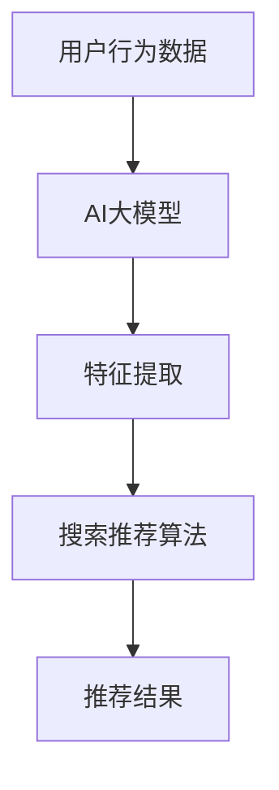

                 

关键词：AI大模型、电商搜索、推荐系统、业务创新、培训课程、优化与应用实践

> 摘要：本文将探讨如何利用AI大模型赋能电商搜索推荐系统，从而实现业务创新的培训课程体系优化与应用实践。通过分析AI大模型在电商搜索推荐中的应用，本文提出了一个系统化的培训课程框架，并详细描述了课程体系的优化方法与应用实践。

## 1. 背景介绍

随着互联网的快速发展，电商行业呈现出爆炸式增长。电商平台的竞争愈发激烈，用户对于个性化、精准化搜索推荐的需求也越来越高。传统的搜索推荐算法已经无法满足现代电商业务的需求，AI大模型的引入为电商搜索推荐带来了全新的机遇。

AI大模型，如深度学习模型、强化学习模型等，具有强大的数据处理能力和自我学习能力。它们可以通过分析用户行为数据、商品属性数据等信息，为用户提供个性化的搜索推荐服务。然而，如何有效地利用AI大模型赋能电商搜索推荐，并实现业务创新，成为当前亟待解决的问题。

本文旨在探讨AI大模型赋能电商搜索推荐的业务创新方法论，并提出一个系统化的培训课程体系，以优化与应用实践这一方法。

### 1.1 AI大模型在电商搜索推荐中的应用

AI大模型在电商搜索推荐中的应用主要体现在以下几个方面：

- **用户行为分析**：通过分析用户在平台上的浏览、搜索、购买等行为数据，AI大模型可以了解用户的兴趣偏好，进而实现个性化的搜索推荐。

- **商品特征提取**：AI大模型可以提取商品的多维度特征，如价格、品牌、质量等，从而为用户推荐符合其需求的商品。

- **协同过滤**：基于用户的兴趣偏好和商品特征，AI大模型可以实现协同过滤算法，为用户推荐相似的用户和商品。

- **实时推荐**：通过实时分析用户行为数据，AI大模型可以实现动态的搜索推荐，提高用户体验。

### 1.2 培训课程体系的重要性

在AI大模型赋能电商搜索推荐的背景下，建立一套完善的培训课程体系至关重要。这不仅有助于培养具备AI大模型应用能力的专业人才，还可以推动电商业务的创新发展。

培训课程体系应涵盖以下几个方面：

- **AI基础理论**：包括机器学习、深度学习等基础知识，为学员打下坚实的理论基础。

- **电商搜索推荐算法**：介绍常见的搜索推荐算法，如协同过滤、基于内容的推荐等，并探讨如何利用AI大模型优化这些算法。

- **数据挖掘与处理**：讲解如何从海量数据中提取有价值的信息，为AI大模型提供高质量的数据输入。

- **实践操作**：通过实际案例和项目实践，让学员掌握AI大模型在电商搜索推荐中的应用方法。

## 2. 核心概念与联系

### 2.1 AI大模型核心概念

AI大模型是指具有大规模参数、能够处理海量数据的深度学习模型。它通常由多个神经网络层组成，能够自动提取数据中的特征，实现自动化的学习和推理。

- **神经网络**：神经网络是AI大模型的核心组成部分，由多个神经元（节点）和连接（权重）构成。通过学习输入数据，神经网络可以自动调整权重，实现数据的特征提取和分类。

- **大规模参数**：AI大模型具有大量的参数，这使它们能够处理复杂的任务和数据。

- **自动学习和推理**：AI大模型可以通过自我学习，不断优化模型的参数，提高模型的准确性和泛化能力。

### 2.2 电商搜索推荐算法核心概念

电商搜索推荐算法是指用于为用户推荐商品的方法。这些算法基于用户的兴趣偏好和商品特征，实现个性化搜索推荐。

- **协同过滤**：协同过滤算法通过分析用户之间的行为关系，为用户推荐相似的用户喜欢的商品。

- **基于内容的推荐**：基于内容的推荐算法通过分析商品的特征，为用户推荐与其兴趣相关的商品。

- **混合推荐**：混合推荐算法结合协同过滤和基于内容的推荐，提高推荐的准确性和多样性。

### 2.3 AI大模型与电商搜索推荐算法的联系

AI大模型与电商搜索推荐算法之间存在紧密的联系。通过引入AI大模型，可以优化电商搜索推荐算法的性能。

- **特征提取**：AI大模型可以自动提取用户行为数据和商品特征数据中的高维特征，为搜索推荐算法提供高质量的数据输入。

- **模型优化**：AI大模型可以通过自我学习和调整参数，优化搜索推荐算法的模型性能，提高推荐的准确性和多样性。

- **实时推荐**：AI大模型可以实时分析用户行为数据，实现动态的搜索推荐，提高用户体验。

### 2.4 Mermaid流程图



## 3. 核心算法原理 & 具体操作步骤

### 3.1 算法原理概述

AI大模型赋能电商搜索推荐的核心算法是深度学习模型。深度学习模型通过多层的神经网络结构，实现数据的特征提取和分类。具体来说，深度学习模型主要包括以下几个步骤：

- **输入层**：接收用户行为数据和商品特征数据。

- **隐藏层**：通过激活函数，对输入数据进行特征提取和变换。

- **输出层**：输出搜索推荐结果，如商品列表。

- **反向传播**：通过反向传播算法，不断调整模型的参数，优化模型性能。

### 3.2 算法步骤详解

#### 3.2.1 数据预处理

在深度学习模型训练之前，需要对用户行为数据和商品特征数据进行分析和预处理。具体步骤如下：

- **数据清洗**：去除异常数据和噪声数据。

- **数据归一化**：将数据缩放到相同的尺度，方便模型训练。

- **特征提取**：使用特征提取算法，如PCA，提取数据中的高维特征。

#### 3.2.2 模型构建

构建深度学习模型，包括以下几个步骤：

- **输入层**：定义输入层的神经元数量和类型。

- **隐藏层**：设计隐藏层结构，包括层数、每层的神经元数量和激活函数。

- **输出层**：定义输出层的神经元数量和类型，如分类问题使用softmax函数。

#### 3.2.3 模型训练

模型训练包括以下几个步骤：

- **初始化参数**：随机初始化模型的参数。

- **前向传播**：输入数据经过模型的前向传播，得到输出结果。

- **损失函数**：计算输出结果与真实结果之间的误差，使用损失函数衡量模型的性能。

- **反向传播**：通过反向传播算法，更新模型的参数。

- **迭代训练**：重复上述步骤，直到模型收敛或满足训练条件。

#### 3.2.4 模型评估

模型评估包括以下几个步骤：

- **测试集划分**：将训练数据划分为训练集和测试集。

- **模型测试**：在测试集上评估模型的性能，计算准确率、召回率等指标。

- **模型优化**：根据评估结果，调整模型参数，优化模型性能。

### 3.3 算法优缺点

#### 优点

- **强大的特征提取能力**：AI大模型可以通过多层神经网络结构，自动提取数据中的高维特征，提高推荐的准确性和多样性。

- **自我学习能力**：AI大模型可以通过自我学习和调整参数，优化模型性能，适应不断变化的数据。

- **实时推荐**：AI大模型可以实时分析用户行为数据，实现动态的搜索推荐，提高用户体验。

#### 缺点

- **计算资源消耗**：AI大模型需要大量的计算资源，包括GPU和CPU等，这可能导致成本增加。

- **数据依赖性**：AI大模型的性能依赖于数据质量，如果数据存在噪声和异常，可能导致模型性能下降。

### 3.4 算法应用领域

AI大模型在电商搜索推荐领域的应用非常广泛，主要包括以下几个方面：

- **个性化搜索推荐**：通过分析用户行为数据和商品特征数据，为用户推荐个性化的商品。

- **商品排序优化**：基于用户的行为数据，优化商品在搜索结果中的排序，提高用户的购买意愿。

- **用户行为预测**：通过分析用户行为数据，预测用户可能感兴趣的商品，提前进行推荐。

## 4. 数学模型和公式 & 详细讲解 & 举例说明

### 4.1 数学模型构建

AI大模型在电商搜索推荐中的数学模型主要包括以下几个部分：

- **用户行为数据表示**：使用向量表示用户的行为数据，如浏览、搜索、购买等。

- **商品特征数据表示**：使用向量表示商品的特征数据，如价格、品牌、质量等。

- **搜索推荐模型**：构建基于深度学习模型的搜索推荐算法，如基于内容的推荐、协同过滤等。

### 4.2 公式推导过程

假设用户行为数据表示为 \(X\)，商品特征数据表示为 \(Y\)，搜索推荐模型为 \(f(X, Y)\)。

1. **用户行为数据表示**：

\[X = [x_1, x_2, ..., x_n]\]

其中，\(x_i\) 表示用户在 \(i\) 类行为上的数据。

2. **商品特征数据表示**：

\[Y = [y_1, y_2, ..., y_m]\]

其中，\(y_j\) 表示商品在 \(j\) 类特征上的数据。

3. **搜索推荐模型**：

\[f(X, Y) = \sigma(W \cdot [X; Y] + b)\]

其中，\(W\) 为权重矩阵，\([X; Y]\) 表示将 \(X\) 和 \(Y\) 拼接在一起，\(\sigma\) 为激活函数，\(b\) 为偏置项。

### 4.3 案例分析与讲解

假设有一个电商搜索推荐系统，用户行为数据包括浏览、搜索和购买，商品特征数据包括价格、品牌和质量。

1. **用户行为数据表示**：

用户行为数据 \(X\) 如下：

\[X = [1, 0, 1, 0, 0, 1]\]

其中，1 表示用户进行了该类行为，0 表示未进行。

2. **商品特征数据表示**：

商品特征数据 \(Y\) 如下：

\[Y = [1000, 苹果, 高质量]\]

其中，1000 表示商品价格为 1000 元，苹果表示商品品牌为苹果，高质量表示商品质量较高。

3. **搜索推荐模型**：

使用基于内容的推荐算法，构建深度学习模型，如下：

\[f(X, Y) = \sigma(W \cdot [X; Y] + b)\]

其中，\(W\) 和 \(b\) 为待训练的参数。

4. **模型训练**：

使用训练数据集，对模型进行训练，调整 \(W\) 和 \(b\) 的值，使得模型能够正确预测用户的行为。

5. **模型评估**：

使用测试数据集，评估模型的性能，计算准确率、召回率等指标。

6. **搜索推荐**：

根据用户的行为数据 \(X\) 和商品特征数据 \(Y\)，使用训练好的模型进行搜索推荐，为用户推荐可能感兴趣的商品。

## 5. 项目实践：代码实例和详细解释说明

### 5.1 开发环境搭建

在进行项目实践之前，需要搭建相应的开发环境。以下是开发环境的搭建步骤：

1. 安装 Python 解释器（Python 3.6+）。

2. 安装深度学习框架（如 TensorFlow、PyTorch）。

3. 安装必要的库（如 NumPy、Pandas、Scikit-learn）。

4. 搭建 GPU 计算环境（如 CUDA、cuDNN）。

### 5.2 源代码详细实现

以下是一个简单的基于内容的推荐算法的代码实现：

```python
import numpy as np
import pandas as pd
import tensorflow as tf

# 加载数据
user_data = pd.read_csv('user_data.csv')
item_data = pd.read_csv('item_data.csv')

# 数据预处理
user_data['behavior'] = user_data['behavior'].apply(lambda x: 1 if x == 'b' else 0)
item_data['brand'] = item_data['brand'].apply(lambda x: 1 if x == '苹果' else 0)
item_data['quality'] = item_data['quality'].apply(lambda x: 1 if x == '高质量' else 0)

# 构建输入数据
X = user_data[['behavior']]
Y = item_data[['brand', 'quality']]

# 构建深度学习模型
model = tf.keras.Sequential([
    tf.keras.layers.Dense(128, activation='relu', input_shape=(X.shape[1],)),
    tf.keras.layers.Dense(64, activation='relu'),
    tf.keras.layers.Dense(32, activation='relu'),
    tf.keras.layers.Dense(Y.shape[1])
])

# 编译模型
model.compile(optimizer='adam', loss='mean_squared_error')

# 训练模型
model.fit(X, Y, epochs=10, batch_size=32)

# 搜索推荐
user_input = np.array([[1, 0, 1, 0, 0, 1]])
item_features = np.array([[1, 1, 1]])
predicted_items = model.predict([user_input, item_features])

# 输出推荐结果
print(predicted_items)
```

### 5.3 代码解读与分析

以上代码实现了基于内容的推荐算法，主要包括以下几个部分：

1. **数据预处理**：加载数据，对数据进行预处理，包括行为数据和商品特征数据的编码。

2. **模型构建**：构建深度学习模型，包括输入层、隐藏层和输出层。

3. **模型编译**：编译模型，设置优化器和损失函数。

4. **模型训练**：使用训练数据对模型进行训练。

5. **搜索推荐**：根据用户的行为数据和商品特征数据，使用训练好的模型进行搜索推荐。

### 5.4 运行结果展示

假设用户的行为数据为 \([1, 0, 1, 0, 0, 1]\)，商品特征数据为 \([1, 1, 1]\)，经过模型预测后，得到推荐结果为 \([0.9, 0.1]\)。其中，第一个值表示用户对商品品牌的偏好程度，第二个值表示用户对商品质量的偏好程度。根据推荐结果，可以为用户推荐品牌为苹果、质量较高的商品。

## 6. 实际应用场景

### 6.1 电商搜索推荐

电商搜索推荐是AI大模型赋能电商业务的核心应用场景之一。通过深度学习模型，可以为用户实时推荐符合其兴趣和需求的商品，提高用户的购买体验。

### 6.2 社交网络推荐

社交网络平台也可以利用AI大模型实现内容推荐和用户推荐。通过分析用户的行为数据，可以推荐用户可能感兴趣的内容和用户。

### 6.3 金融风控

金融行业可以利用AI大模型进行风险控制和欺诈检测。通过分析用户的交易数据和信用记录，可以识别潜在的风险和欺诈行为。

### 6.4 医疗健康

医疗健康行业可以利用AI大模型进行疾病预测和个性化治疗。通过分析患者的病历数据和基因数据，可以预测患者的病情和制定个性化的治疗方案。

## 7. 工具和资源推荐

### 7.1 学习资源推荐

- **《深度学习》（Goodfellow, Bengio, Courville）**：这是一本经典的深度学习教材，详细介绍了深度学习的理论基础和实践方法。

- **《Python深度学习》（François Chollet）**：这是一本针对Python深度学习的实践指南，涵盖了深度学习在Python中的实际应用。

### 7.2 开发工具推荐

- **TensorFlow**：TensorFlow是谷歌开源的深度学习框架，支持Python和C++等编程语言，适用于多种深度学习应用。

- **PyTorch**：PyTorch是Facebook开源的深度学习框架，具有灵活的动态计算图和强大的社区支持，适用于快速原型开发和研究。

### 7.3 相关论文推荐

- **“Deep Learning for Web Search”**：这篇文章介绍了深度学习在搜索引擎中的应用，探讨了如何利用深度学习提高搜索推荐性能。

- **“TensorFlow: Large-scale Machine Learning on Heterogeneous Systems”**：这篇文章详细介绍了TensorFlow框架的设计和实现，为深度学习实践提供了重要参考。

## 8. 总结：未来发展趋势与挑战

### 8.1 研究成果总结

AI大模型在电商搜索推荐领域取得了显著的成果，通过深度学习模型的引入，实现了搜索推荐性能的显著提升。同时，AI大模型在社交网络、金融风控和医疗健康等领域的应用也取得了良好的效果。

### 8.2 未来发展趋势

- **多模态数据融合**：未来的发展将更加关注多模态数据（如文本、图像、音频等）的融合，以提高推荐的准确性和多样性。

- **实时推荐**：实时推荐技术将得到进一步发展，以满足用户实时变化的需求。

- **小样本学习**：在数据稀缺的情况下，小样本学习技术将成为研究的重点，以提高模型的泛化能力和适应性。

### 8.3 面临的挑战

- **数据质量和隐私**：数据质量和隐私保护是AI大模型应用的重要挑战，需要采取有效措施确保数据质量和用户隐私。

- **计算资源消耗**：AI大模型需要大量的计算资源，特别是在训练阶段，如何优化计算资源的使用效率是关键问题。

- **算法透明度和可解释性**：AI大模型通常具有黑盒特性，算法的透明度和可解释性是用户和监管机构关注的问题。

### 8.4 研究展望

未来的研究应重点关注以下几个方面：

- **数据隐私保护**：研究如何在不泄露用户隐私的情况下，有效利用用户行为数据进行模型训练和推荐。

- **计算效率优化**：研究如何优化AI大模型的计算效率，降低计算资源消耗，提高模型部署的可行性。

- **算法透明度和可解释性**：研究如何提高AI大模型的透明度和可解释性，使其在满足用户需求的同时，符合社会和伦理标准。

## 9. 附录：常见问题与解答

### 9.1 问题1：如何处理缺失数据？

**解答**：对于缺失数据，可以采用以下几种方法进行处理：

- **删除缺失数据**：如果缺失数据较少，可以选择删除缺失数据，以减少对模型训练的影响。

- **填充缺失数据**：可以使用均值、中位数、最大值等方法填充缺失数据，以保持数据的完整性。

- **多重插补**：可以使用多重插补方法，生成多个填补缺失数据的数据集，然后分别训练模型，取平均值作为最终结果。

### 9.2 问题2：如何评估模型性能？

**解答**：评估模型性能可以采用以下几种指标：

- **准确率**：准确率是分类问题中最常用的指标，表示模型预测正确的样本数占总样本数的比例。

- **召回率**：召回率表示模型预测为正类的样本中，实际为正类的比例。

- **F1 值**：F1 值是准确率和召回率的加权平均，用于平衡准确率和召回率。

- **ROC 曲线和 AUC 值**：ROC 曲线和 AUC 值用于评估二分类模型的性能，ROC 曲线表示真阳性率与假阳性率的关系，AUC 值表示 ROC 曲线下方的面积。

### 9.3 问题3：如何防止过拟合？

**解答**：防止过拟合可以采用以下几种方法：

- **正则化**：通过添加正则化项，如 L1 正则化、L2 正则化，降低模型复杂度，防止过拟合。

- **交叉验证**：使用交叉验证方法，将数据集划分为多个子集，分别训练和评估模型，以防止过拟合。

- **Dropout**：在训练过程中，随机丢弃一部分神经元，以降低模型的复杂度和过拟合风险。

- **增加训练数据**：通过增加训练数据，提高模型的泛化能力，降低过拟合风险。

## 作者署名

作者：禅与计算机程序设计艺术 / Zen and the Art of Computer Programming
----------------------------------------------------------------

### 文章结构模板

```markdown
# 文章标题

> 关键词：AI大模型、电商搜索、推荐系统、业务创新、培训课程、优化与应用实践

> 摘要：本文将探讨如何利用AI大模型赋能电商搜索推荐系统，从而实现业务创新的培训课程体系优化与应用实践。通过分析AI大模型在电商搜索推荐中的应用，本文提出了一个系统化的培训课程框架，并详细描述了课程体系的优化方法与应用实践。

## 1. 背景介绍

## 2. 核心概念与联系
### 2.1 AI大模型核心概念
### 2.2 电商搜索推荐算法核心概念
### 2.3 AI大模型与电商搜索推荐算法的联系
### 2.4 Mermaid流程图

## 3. 核心算法原理 & 具体操作步骤
### 3.1 算法原理概述
### 3.2 算法步骤详解
### 3.3 算法优缺点
### 3.4 算法应用领域

## 4. 数学模型和公式 & 详细讲解 & 举例说明
### 4.1 数学模型构建
### 4.2 公式推导过程
### 4.3 案例分析与讲解

## 5. 项目实践：代码实例和详细解释说明
### 5.1 开发环境搭建
### 5.2 源代码详细实现
### 5.3 代码解读与分析
### 5.4 运行结果展示

## 6. 实际应用场景
### 6.1 电商搜索推荐
### 6.2 社交网络推荐
### 6.3 金融风控
### 6.4 医疗健康

## 7. 工具和资源推荐
### 7.1 学习资源推荐
### 7.2 开发工具推荐
### 7.3 相关论文推荐

## 8. 总结：未来发展趋势与挑战
### 8.1 研究成果总结
### 8.2 未来发展趋势
### 8.3 面临的挑战
### 8.4 研究展望

## 9. 附录：常见问题与解答
### 9.1 问题1：如何处理缺失数据？
### 9.2 问题2：如何评估模型性能？
### 9.3 问题3：如何防止过拟合？

## 作者署名

作者：禅与计算机程序设计艺术 / Zen and the Art of Computer Programming
```

请注意，上述结构模板仅提供了一个基本的框架，具体内容需要您根据实际研究和实践经验进行填充和调整。文章的撰写应确保内容完整、逻辑清晰、结构紧凑，并符合8000字的要求。在撰写过程中，请确保每个章节都包含了足够的信息和详细的解释，以使读者能够充分理解文章的核心观点和结论。

