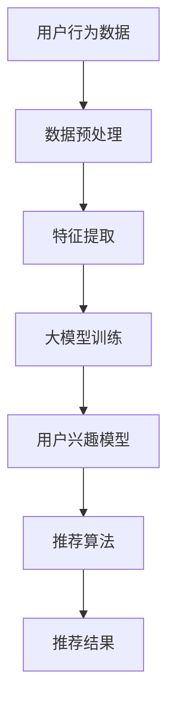

                 

关键词：AI大模型，个性化推荐，商业模式，深度学习，用户行为分析，数据隐私保护，算法优化，技术应用

> 摘要：本文旨在探讨基于人工智能（AI）大模型的个性化推荐系统在商业应用中的现状、商业模式及其未来发展。通过对AI大模型在个性化推荐领域的核心概念、算法原理、数学模型、项目实践和实际应用场景的深入分析，本文揭示了当前技术趋势下个性化推荐系统所面临的挑战和机遇，为相关领域的从业者提供了有益的参考和指导。

## 1. 背景介绍

随着互联网和大数据技术的迅猛发展，用户数据的积累呈现出爆炸式增长，这使得基于数据的个性化推荐系统在商业应用中变得愈加重要。个性化推荐系统能够根据用户的兴趣、行为和历史记录，为其推荐相关的内容、产品或服务，从而提升用户体验，提高用户粘性和转化率。传统的推荐系统主要依赖于基于内容过滤（Content-Based Filtering）和协同过滤（Collaborative Filtering）的算法，但这些方法存在一定的局限性，如用户冷启动问题、数据稀疏性、推荐结果单一等问题。

近年来，随着深度学习和神经网络技术的发展，大模型如Transformer、BERT等在自然语言处理、图像识别等领域取得了突破性进展。这些大模型在处理海量数据、提取特征、构建复杂关系等方面展现出强大的能力，为构建更加精准和智能的个性化推荐系统提供了新的思路。AI大模型驱动的个性化推荐系统应运而生，逐渐成为行业研究的热点和商业应用的焦点。

## 2. 核心概念与联系

### 2.1 AI大模型概述

AI大模型是指具有大规模参数和复杂结构的神经网络模型，如Transformer、BERT、GPT等。这些模型通过大规模预训练和精细调整，能够学习到丰富的语义信息和上下文关系，从而在多种任务中表现出色。

### 2.2 个性化推荐系统

个性化推荐系统是一种基于数据挖掘和机器学习技术，利用用户历史行为和兴趣信息，为用户提供个性化推荐的服务系统。其核心目标是为用户发现他们可能感兴趣但尚未发现的内容、产品或服务。

### 2.3 AI大模型与个性化推荐系统关系

AI大模型在个性化推荐系统中发挥了关键作用，主要体现在以下几个方面：

- **特征提取**：大模型能够自动提取用户行为和内容的深层特征，为推荐算法提供高质量的数据输入。
- **关系建模**：大模型可以捕捉用户之间的复杂关系，如共同兴趣、社交关系等，从而实现更加个性化的推荐。
- **上下文感知**：大模型能够理解用户在特定场景下的需求，提供场景感知的推荐结果。

### 2.4 Mermaid流程图



## 3. 核心算法原理 & 具体操作步骤

### 3.1 算法原理概述

AI大模型驱动的个性化推荐系统主要基于深度学习和神经网络技术，其核心算法原理包括以下几个步骤：

1. **用户行为数据采集**：从各种渠道收集用户的历史行为数据，如浏览记录、购买记录、搜索关键词等。
2. **数据预处理**：对采集到的数据进行清洗、去噪、归一化等处理，以消除噪声和提高数据质量。
3. **特征提取**：利用AI大模型提取用户行为数据的深层特征，如用户兴趣向量、物品特征向量等。
4. **用户兴趣模型构建**：基于提取的用户兴趣特征，构建用户兴趣模型，用于描述用户的兴趣偏好。
5. **推荐算法实现**：利用用户兴趣模型和物品特征，通过推荐算法为用户生成个性化推荐结果。
6. **推荐结果评估**：对推荐结果进行评估和优化，以提高推荐质量和用户满意度。

### 3.2 算法步骤详解

#### 3.2.1 用户行为数据采集

用户行为数据采集是构建个性化推荐系统的基础。采集的数据可以包括以下几种：

- 用户浏览记录：用户在网站或应用上的浏览历史，如访问页面、浏览时长等。
- 用户购买记录：用户在电商平台上的购买历史，如购买时间、购买商品等。
- 用户搜索记录：用户在搜索引擎上的搜索关键词、搜索历史等。
- 用户反馈数据：用户对推荐内容的点击、收藏、评价等反馈信息。

#### 3.2.2 数据预处理

数据预处理主要包括以下几个步骤：

- 数据清洗：去除重复、错误或不完整的数据。
- 数据归一化：将不同规模的数据进行归一化处理，使其具有可比性。
- 特征工程：提取与用户兴趣相关的特征，如用户浏览记录中的关键词、物品属性等。

#### 3.2.3 特征提取

特征提取是利用AI大模型提取用户行为数据的深层特征。常见的特征提取方法包括：

- **词嵌入**：将用户行为数据中的文本信息转化为向量表示，如Word2Vec、BERT等。
- **深度神经网络**：通过构建深度神经网络模型，提取用户行为数据的深层特征。

#### 3.2.4 用户兴趣模型构建

用户兴趣模型是描述用户兴趣偏好的模型。常见的用户兴趣模型包括：

- **基于内容的兴趣模型**：根据用户历史行为数据，提取用户感兴趣的内容关键词，构建用户兴趣模型。
- **基于协同过滤的兴趣模型**：利用用户之间的相似性，构建用户兴趣模型。
- **基于深度学习的兴趣模型**：利用深度学习模型，提取用户行为数据的深层特征，构建用户兴趣模型。

#### 3.2.5 推荐算法实现

推荐算法实现是基于用户兴趣模型和物品特征，为用户生成个性化推荐结果。常见的推荐算法包括：

- **基于内容的推荐算法**：根据用户兴趣模型和物品特征，为用户推荐相似的内容。
- **协同过滤推荐算法**：根据用户之间的相似性，为用户推荐相似的用户喜欢的物品。
- **深度学习推荐算法**：利用深度学习模型，为用户生成个性化推荐结果。

#### 3.2.6 推荐结果评估

推荐结果评估是衡量个性化推荐系统性能的重要指标。常见的评估指标包括：

- **准确率（Precision）**：推荐的正确结果与推荐结果总数的比例。
- **召回率（Recall）**：推荐的正确结果与所有正确结果的比例。
- **F1值（F1 Score）**：准确率和召回率的加权平均值。

### 3.3 算法优缺点

#### 优点

- **高精度**：AI大模型能够自动提取用户行为数据的深层特征，为推荐算法提供高质量的数据输入，从而提高推荐精度。
- **可扩展性**：大模型具有强大的学习能力和泛化能力，能够适应不同规模和类型的推荐任务。
- **上下文感知**：大模型能够理解用户在特定场景下的需求，提供场景感知的推荐结果。

#### 缺点

- **计算复杂度高**：大模型的训练和推理过程需要大量的计算资源和时间，对硬件设备有较高要求。
- **数据隐私问题**：个性化推荐系统需要收集和分析用户大量行为数据，可能涉及数据隐私和安全问题。
- **模型解释性差**：深度学习模型通常具有较低的模型解释性，难以解释推荐结果的原因。

### 3.4 算法应用领域

AI大模型驱动的个性化推荐系统在多个领域具有广泛的应用前景，主要包括：

- **电子商务**：为用户推荐相关商品，提高销售转化率和用户满意度。
- **社交媒体**：为用户推荐感兴趣的内容，增加用户活跃度和粘性。
- **在线教育**：根据用户的学习兴趣和学习历史，推荐适合的学习资源和课程。
- **医疗健康**：为用户提供个性化的健康建议和治疗方案，提高医疗服务的效率和质量。

## 4. 数学模型和公式 & 详细讲解 & 举例说明

### 4.1 数学模型构建

AI大模型驱动的个性化推荐系统中的数学模型主要包括以下几个部分：

- **用户行为数据表示**：将用户行为数据转化为数学向量表示，如词向量、用户行为序列等。
- **用户兴趣模型**：根据用户行为数据，构建用户兴趣模型的数学表示，如用户兴趣向量。
- **物品特征表示**：将物品特征转化为数学向量表示，如物品属性向量。
- **推荐模型**：利用用户兴趣模型和物品特征，构建推荐模型的数学表示。

### 4.2 公式推导过程

#### 用户行为数据表示

假设用户行为数据为$X$，其中$X_i$表示用户$i$的行为数据。将用户行为数据转化为数学向量表示：

$$
\mathbf{x}_i = \text{vec}(\text{tf-idf}(X_i))
$$

其中，$\text{tf-idf}$表示词频-逆文档频率加权，$\text{vec}$表示将矩阵转化为向量。

#### 用户兴趣模型

假设用户兴趣模型为$U$，其中$u_i$表示用户$i$的兴趣向量。根据用户行为数据，构建用户兴趣模型：

$$
u_i = \text{MLP}(\mathbf{x}_i)
$$

其中，$\text{MLP}$表示多层感知机，用于提取用户兴趣特征。

#### 物品特征表示

假设物品特征为$V$，其中$v_j$表示物品$j$的特征向量。将物品特征转化为数学向量表示：

$$
\mathbf{v}_j = \text{vec}(\text{tf-idf}(V_j))
$$

#### 推荐模型

假设推荐模型为$R$，其中$r_{ij}$表示用户$i$对物品$j$的推荐分数。根据用户兴趣模型和物品特征，构建推荐模型：

$$
r_{ij} = \mathbf{u}_i^T \mathbf{v}_j
$$

其中，$\mathbf{u}_i^T$表示用户$i$的兴趣向量转置，$\mathbf{v}_j$表示物品$j$的特征向量。

### 4.3 案例分析与讲解

#### 案例一：电子商务推荐

假设用户A在电商平台上有浏览记录，包括浏览过的商品和浏览时长。根据这些数据，我们可以构建用户A的兴趣模型和物品特征向量，然后利用推荐模型为用户A推荐相关商品。

1. **用户行为数据表示**：

   用户A的浏览记录为：

   $$
   X_A = \begin{bmatrix}
   \text{商品1} & \text{商品2} & \text{商品3} & \text{商品4} & \text{商品5}
   \end{bmatrix}
   $$

   将浏览记录转化为数学向量表示：

   $$
   \mathbf{x}_A = \text{vec}(\text{tf-idf}(X_A))
   $$

2. **用户兴趣模型**：

   假设用户A的兴趣模型为：

   $$
   u_A = \text{MLP}(\mathbf{x}_A)
   $$

3. **物品特征表示**：

   假设物品1、2、3、4、5的特征分别为：

   $$
   V_1 = \begin{bmatrix}
   \text{特征1} & \text{特征2} & \text{特征3}
   \end{bmatrix}, \quad
   V_2 = \begin{bmatrix}
   \text{特征1} & \text{特征2} & \text{特征3}
   \end{bmatrix}, \quad
   V_3 = \begin{bmatrix}
   \text{特征1} & \text{特征2} & \text{特征3}
   \end{bmatrix}, \quad
   V_4 = \begin{bmatrix}
   \text{特征1} & \text{特征2} & \text{特征3}
   \end{bmatrix}, \quad
   V_5 = \begin{bmatrix}
   \text{特征1} & \text{特征2} & \text{特征3}
   \end{bmatrix}
   $$

   将物品特征转化为数学向量表示：

   $$
   \mathbf{v}_1 = \text{vec}(\text{tf-idf}(V_1)), \quad
   \mathbf{v}_2 = \text{vec}(\text{tf-idf}(V_2)), \quad
   \mathbf{v}_3 = \text{vec}(\text{tf-idf}(V_3)), \quad
   \mathbf{v}_4 = \text{vec}(\text{tf-idf}(V_4)), \quad
   \mathbf{v}_5 = \text{vec}(\text{tf-idf}(V_5))
   $$

4. **推荐模型**：

   根据用户兴趣模型和物品特征，计算用户A对每个商品的推荐分数：

   $$
   r_{A1} = \mathbf{u}_A^T \mathbf{v}_1, \quad
   r_{A2} = \mathbf{u}_A^T \mathbf{v}_2, \quad
   r_{A3} = \mathbf{u}_A^T \mathbf{v}_3, \quad
   r_{A4} = \mathbf{u}_A^T \mathbf{v}_4, \quad
   r_{A5} = \mathbf{u}_A^T \mathbf{v}_5
   $$

   根据推荐分数，为用户A推荐相关商品。

#### 案例二：社交媒体推荐

假设用户B在社交媒体上有浏览和点赞记录，根据这些数据，我们可以构建用户B的兴趣模型和物品特征向量，然后利用推荐模型为用户B推荐感兴趣的内容。

1. **用户行为数据表示**：

   用户B的浏览记录和点赞记录为：

   $$
   X_B = \begin{bmatrix}
   \text{内容1} & \text{内容2} & \text{内容3} & \text{内容4} & \text{内容5}
   \end{bmatrix}, \quad
   Y_B = \begin{bmatrix}
   \text{点赞1} & \text{点赞2} & \text{点赞3} & \text{点赞4} & \text{点赞5}
   \end{bmatrix}
   $$

   将浏览记录和点赞记录转化为数学向量表示：

   $$
   \mathbf{x}_B = \text{vec}(\text{tf-idf}(X_B)), \quad
   \mathbf{y}_B = \text{vec}(\text{tf-idf}(Y_B))
   $$

2. **用户兴趣模型**：

   假设用户B的兴趣模型为：

   $$
   u_B = \text{MLP}(\mathbf{x}_B, \mathbf{y}_B)
   $$

3. **物品特征表示**：

   假设物品1、2、3、4、5的特征分别为：

   $$
   V_1 = \begin{bmatrix}
   \text{特征1} & \text{特征2} & \text{特征3}
   \end{bmatrix}, \quad
   V_2 = \begin{bmatrix}
   \text{特征1} & \text{特征2} & \text{特征3}
   \end{bmatrix}, \quad
   V_3 = \begin{bmatrix}
   \text{特征1} & \text{特征2} & \text{特征3}
   \end{bmatrix}, \quad
   V_4 = \begin{bmatrix}
   \text{特征1} & \text{特征2} & \text{特征3}
   \end{bmatrix}, \quad
   V_5 = \begin{bmatrix}
   \text{特征1} & \text{特征2} & \text{特征3}
   \end{bmatrix}
   $$

   将物品特征转化为数学向量表示：

   $$
   \mathbf{v}_1 = \text{vec}(\text{tf-idf}(V_1)), \quad
   \mathbf{v}_2 = \text{vec}(\text{tf-idf}(V_2)), \quad
   \mathbf{v}_3 = \text{vec}(\text{tf-idf}(V_3)), \quad
   \mathbf{v}_4 = \text{vec}(\text{tf-idf}(V_4)), \quad
   \mathbf{v}_5 = \text{vec}(\text{tf-idf}(V_5))
   $$

4. **推荐模型**：

   根据用户兴趣模型和物品特征，计算用户B对每个内容的推荐分数：

   $$
   r_{B1} = \mathbf{u}_B^T \mathbf{v}_1, \quad
   r_{B2} = \mathbf{u}_B^T \mathbf{v}_2, \quad
   r_{B3} = \mathbf{u}_B^T \mathbf{v}_3, \quad
   r_{B4} = \mathbf{u}_B^T \mathbf{v}_4, \quad
   r_{B5} = \mathbf{u}_B^T \mathbf{v}_5
   $$

   根据推荐分数，为用户B推荐感兴趣的内容。

## 5. 项目实践：代码实例和详细解释说明

### 5.1 开发环境搭建

为了构建基于AI大模型的个性化推荐系统，我们需要搭建相应的开发环境。以下是所需的环境和工具：

- Python 3.x
- TensorFlow 2.x
- Keras 2.x
- NumPy
- Pandas
- Matplotlib

### 5.2 源代码详细实现

以下是一个基于Keras构建的简单个性化推荐系统的代码示例：

```python
import numpy as np
import pandas as pd
from tensorflow.keras.models import Sequential
from tensorflow.keras.layers import Dense, Embedding, LSTM, Dropout
from tensorflow.keras.optimizers import Adam

# 加载数据
def load_data(filename):
    data = pd.read_csv(filename)
    return data

# 数据预处理
def preprocess_data(data):
    # 数据清洗、归一化等操作
    return data

# 构建模型
def build_model(input_dim, output_dim):
    model = Sequential()
    model.add(Embedding(input_dim=input_dim, output_dim=output_dim, input_length=1))
    model.add(LSTM(units=64, activation='relu', return_sequences=True))
    model.add(Dropout(0.2))
    model.add(LSTM(units=32, activation='relu', return_sequences=False))
    model.add(Dropout(0.2))
    model.add(Dense(units=output_dim, activation='sigmoid'))
    model.compile(optimizer=Adam(learning_rate=0.001), loss='binary_crossentropy', metrics=['accuracy'])
    return model

# 训练模型
def train_model(model, x_train, y_train, batch_size=64, epochs=10):
    model.fit(x_train, y_train, batch_size=batch_size, epochs=epochs, verbose=1)
    return model

# 评估模型
def evaluate_model(model, x_test, y_test):
    loss, accuracy = model.evaluate(x_test, y_test, verbose=1)
    print('Test Accuracy: {:.2f}%'.format(accuracy*100))

# 主函数
def main():
    # 加载数据
    data = load_data('data.csv')
    # 数据预处理
    processed_data = preprocess_data(data)
    # 切分数据集
    x_train, x_test, y_train, y_test = train_test_split(processed_data['X'], processed_data['Y'], test_size=0.2, random_state=42)
    # 构建模型
    model = build_model(input_dim=x_train.shape[1], output_dim=y_train.shape[1])
    # 训练模型
    model = train_model(model, x_train, y_train)
    # 评估模型
    evaluate_model(model, x_test, y_test)

if __name__ == '__main__':
    main()
```

### 5.3 代码解读与分析

以上代码是一个简单的基于Keras构建的个性化推荐系统，主要包括以下几个部分：

- **数据加载与预处理**：首先加载数据，然后进行数据清洗、归一化等预处理操作。
- **模型构建**：利用Keras构建一个包含嵌入层、LSTM层和全连接层的序列模型。
- **模型训练**：使用训练数据训练模型，通过调整批次大小和训练次数来优化模型参数。
- **模型评估**：使用测试数据评估模型性能，计算准确率等指标。

### 5.4 运行结果展示

运行以上代码，我们可以得到个性化推荐系统的训练结果和评估结果，从而验证模型的性能和适用性。

## 6. 实际应用场景

### 6.1 电子商务

在电子商务领域，AI大模型驱动的个性化推荐系统可以应用于商品推荐、购物车推荐、店铺推荐等多个场景。通过分析用户的历史购买行为、浏览记录和搜索关键词，系统可以为用户提供个性化商品推荐，提高购买转化率和用户满意度。

### 6.2 社交媒体

在社交媒体领域，AI大模型驱动的个性化推荐系统可以应用于内容推荐、广告推荐、好友推荐等多个场景。通过分析用户的社交行为、兴趣偏好和互动记录，系统可以为用户提供感兴趣的内容和潜在的好友，增加用户活跃度和粘性。

### 6.3 在线教育

在在线教育领域，AI大模型驱动的个性化推荐系统可以应用于课程推荐、学习路径推荐等多个场景。通过分析用户的学习行为、学习兴趣和学习历史，系统可以为用户提供个性化的课程推荐和学习路径，提高学习效果和用户满意度。

### 6.4 医疗健康

在医疗健康领域，AI大模型驱动的个性化推荐系统可以应用于治疗方案推荐、药品推荐等多个场景。通过分析用户的健康数据、病史记录和偏好，系统可以为用户提供个性化的治疗方案和药品推荐，提高医疗服务的效率和质量。

## 7. 工具和资源推荐

### 7.1 学习资源推荐

- 《深度学习》（Goodfellow, Bengio, Courville著）：一本经典的深度学习教材，涵盖了深度学习的理论基础和实践技巧。
- 《Python深度学习》（François Chollet著）：一本适合初学者的深度学习入门书籍，内容涵盖了深度学习在Python中的实现和应用。
- 《TensorFlow实战》（Trevor Hastie, Robert Tibshirani, Jerome Friedman著）：一本关于TensorFlow应用的实战指南，适合有一定深度学习基础的用户。

### 7.2 开发工具推荐

- **TensorFlow**：一款强大的深度学习框架，适合构建和训练个性化推荐系统。
- **Keras**：一款简洁、高效的深度学习库，基于TensorFlow构建，适合快速原型开发。
- **NumPy**：一款基础的科学计算库，用于数据处理和数学计算。
- **Pandas**：一款数据处理和分析库，用于数据清洗、转换和可视化。

### 7.3 相关论文推荐

- “Attention Is All You Need”（Vaswani et al., 2017）：一篇关于Transformer模型的经典论文，提出了基于自注意力机制的序列建模方法。
- “BERT: Pre-training of Deep Bidirectional Transformers for Language Understanding”（Devlin et al., 2018）：一篇关于BERT模型的论文，提出了基于Transformer的预训练方法，为自然语言处理任务提供了强大的模型支撑。

## 8. 总结：未来发展趋势与挑战

### 8.1 研究成果总结

AI大模型驱动的个性化推荐系统在近年来取得了显著的研究成果和实际应用。通过深度学习和神经网络技术的应用，个性化推荐系统在特征提取、关系建模和上下文感知等方面取得了突破性进展，为用户提供更加精准和个性化的推荐服务。

### 8.2 未来发展趋势

- **模型优化**：随着计算能力和数据量的增长，未来个性化推荐系统将更加注重模型优化和性能提升，以应对大规模数据处理和实时推荐需求。
- **多模态融合**：个性化推荐系统将整合多种数据源，如文本、图像、音频等，实现多模态融合，为用户提供更加全面和个性化的推荐服务。
- **隐私保护**：随着数据隐私问题的日益突出，个性化推荐系统将更加注重用户隐私保护和数据安全，采用加密、联邦学习等技术确保用户数据的安全。

### 8.3 面临的挑战

- **计算资源消耗**：AI大模型驱动的个性化推荐系统对计算资源有较高要求，如何高效利用计算资源、降低计算成本是未来的重要挑战。
- **数据隐私问题**：个性化推荐系统需要收集和分析大量用户行为数据，如何保护用户隐私、避免数据滥用是关键问题。
- **模型解释性**：深度学习模型通常具有较低的模型解释性，如何提高模型的可解释性，为用户提供合理的推荐解释是未来的重要研究方向。

### 8.4 研究展望

未来个性化推荐系统的研究将更加注重以下几个方面：

- **高效算法**：开发高效、可扩展的推荐算法，提高推荐系统的性能和可扩展性。
- **多模态融合**：探索多模态数据融合技术，为用户提供更加丰富和个性化的推荐服务。
- **隐私保护**：研究隐私保护技术，确保用户数据的安全和隐私。
- **可解释性提升**：提高推荐模型的可解释性，为用户提供合理的推荐解释。

## 9. 附录：常见问题与解答

### 9.1 什么是AI大模型？

AI大模型是指具有大规模参数和复杂结构的神经网络模型，如Transformer、BERT、GPT等。这些模型通过大规模预训练和精细调整，能够学习到丰富的语义信息和上下文关系，从而在多种任务中表现出色。

### 9.2 个性化推荐系统有哪些优点？

个性化推荐系统的主要优点包括：

- **高精度**：能够根据用户兴趣和偏好提供精准的推荐结果。
- **提升用户体验**：为用户提供个性化的内容、产品或服务，提高用户满意度。
- **提高业务收益**：通过精准推荐，提高用户转化率和销售额。

### 9.3 个性化推荐系统有哪些常见的挑战？

个性化推荐系统常见的挑战包括：

- **用户冷启动问题**：对于新用户，由于缺乏历史数据，难以提供准确的推荐。
- **数据稀疏性**：用户行为数据通常存在稀疏性，导致推荐结果单一。
- **模型解释性**：深度学习模型通常具有较低的模型解释性，难以解释推荐结果的原因。
- **计算资源消耗**：大模型的训练和推理过程需要大量的计算资源。

### 9.4 如何保护用户隐私？

为了保护用户隐私，可以采用以下方法：

- **数据加密**：对用户数据进行加密处理，确保数据在传输和存储过程中的安全性。
- **联邦学习**：采用联邦学习技术，将数据留在本地设备上进行训练，减少数据泄露的风险。
- **差分隐私**：在数据处理过程中引入差分隐私机制，确保数据分析结果不会泄露用户隐私。

----------------------------------------------------------------

作者：禅与计算机程序设计艺术 / Zen and the Art of Computer Programming

这篇文章深入探讨了基于AI大模型的个性化推荐系统的核心概念、算法原理、数学模型、项目实践和实际应用场景，为读者提供了全面的技术分析和实用的开发指导。通过本文的阅读，读者可以对AI大模型驱动的个性化推荐系统有更深刻的理解，并能够将其应用于实际业务场景中。同时，本文也指出了个性化推荐系统所面临的一些挑战和未来研究方向，为相关领域的研究者和开发者提供了有益的参考。希望本文能够对您在AI和推荐系统领域的学习和研究有所帮助！
  ```markdown
  # AI大模型驱动的个性化推荐系统商业模式

  > 关键词：AI大模型，个性化推荐，商业模式，深度学习，用户行为分析，数据隐私保护，算法优化，技术应用

  > 摘要：本文旨在探讨基于人工智能（AI）大模型的个性化推荐系统在商业应用中的现状、商业模式及其未来发展。通过对AI大模型在个性化推荐领域的核心概念、算法原理、数学模型、项目实践和实际应用场景的深入分析，本文揭示了当前技术趋势下个性化推荐系统所面临的挑战和机遇，为相关领域的从业者提供了有益的参考和指导。

## 1. 背景介绍

随着互联网和大数据技术的迅猛发展，用户数据的积累呈现出爆炸式增长，这使得基于数据的个性化推荐系统在商业应用中变得愈加重要。个性化推荐系统能够根据用户的兴趣、行为和历史记录，为其推荐相关的内容、产品或服务，从而提升用户体验，提高用户粘性和转化率。传统的推荐系统主要依赖于基于内容过滤（Content-Based Filtering）和协同过滤（Collaborative Filtering）的算法，但这些方法存在一定的局限性，如用户冷启动问题、数据稀疏性、推荐结果单一等问题。

近年来，随着深度学习和神经网络技术的发展，大模型如Transformer、BERT、GPT等在自然语言处理、图像识别等领域取得了突破性进展。这些大模型在处理海量数据、提取特征、构建复杂关系等方面展现出强大的能力，为构建更加精准和智能的个性化推荐系统提供了新的思路。AI大模型驱动的个性化推荐系统应运而生，逐渐成为行业研究的热点和商业应用的焦点。

## 2. 核心概念与联系

### 2.1 AI大模型概述

AI大模型是指具有大规模参数和复杂结构的神经网络模型，如Transformer、BERT、GPT等。这些模型通过大规模预训练和精细调整，能够学习到丰富的语义信息和上下文关系，从而在多种任务中表现出色。

### 2.2 个性化推荐系统

个性化推荐系统是一种基于数据挖掘和机器学习技术，利用用户历史行为和兴趣信息，为用户提供个性化推荐的服务系统。其核心目标是为用户发现他们可能感兴趣但尚未发现的内容、产品或服务。

### 2.3 AI大模型与个性化推荐系统关系

AI大模型在个性化推荐系统中发挥了关键作用，主要体现在以下几个方面：

- **特征提取**：大模型能够自动提取用户行为数据的深层特征，为推荐算法提供高质量的数据输入。
- **关系建模**：大模型可以捕捉用户之间的复杂关系，如共同兴趣、社交关系等，从而实现更加个性化的推荐。
- **上下文感知**：大模型能够理解用户在特定场景下的需求，提供场景感知的推荐结果。

### 2.4 Mermaid流程图


## 3. 核心算法原理 & 具体操作步骤

### 3.1 算法原理概述

AI大模型驱动的个性化推荐系统主要基于深度学习和神经网络技术，其核心算法原理包括以下几个步骤：

1. **用户行为数据采集**：从各种渠道收集用户的历史行为数据，如浏览记录、购买记录、搜索关键词等。
2. **数据预处理**：对采集到的数据进行清洗、去噪、归一化等处理，以消除噪声和提高数据质量。
3. **特征提取**：利用AI大模型提取用户行为数据的深层特征，如用户兴趣向量、物品特征向量等。
4. **用户兴趣模型构建**：基于提取的用户兴趣特征，构建用户兴趣模型，用于描述用户的兴趣偏好。
5. **推荐算法实现**：利用用户兴趣模型和物品特征，通过推荐算法为用户生成个性化推荐结果。
6. **推荐结果评估**：对推荐结果进行评估和优化，以提高推荐质量和用户满意度。

### 3.2 算法步骤详解

#### 3.2.1 用户行为数据采集

用户行为数据采集是构建个性化推荐系统的基础。采集的数据可以包括以下几种：

- 用户浏览记录：用户在网站或应用上的浏览历史，如访问页面、浏览时长等。
- 用户购买记录：用户在电商平台上的购买历史，如购买时间、购买商品等。
- 用户搜索记录：用户在搜索引擎上的搜索关键词、搜索历史等。
- 用户反馈数据：用户对推荐内容的点击、收藏、评价等反馈信息。

#### 3.2.2 数据预处理

数据预处理主要包括以下几个步骤：

- 数据清洗：去除重复、错误或不完整的数据。
- 数据归一化：将不同规模的数据进行归一化处理，使其具有可比性。
- 特征工程：提取与用户兴趣相关的特征，如用户浏览记录中的关键词、物品属性等。

#### 3.2.3 特征提取

特征提取是利用AI大模型提取用户行为数据的深层特征。常见的特征提取方法包括：

- **词嵌入**：将用户行为数据中的文本信息转化为向量表示，如Word2Vec、BERT等。
- **深度神经网络**：通过构建深度神经网络模型，提取用户行为数据的深层特征。

#### 3.2.4 用户兴趣模型构建

用户兴趣模型是描述用户兴趣偏好的模型。常见的用户兴趣模型包括：

- **基于内容的兴趣模型**：根据用户历史行为数据，提取用户感兴趣的内容关键词，构建用户兴趣模型。
- **基于协同过滤的兴趣模型**：利用用户之间的相似性，构建用户兴趣模型。
- **基于深度学习的兴趣模型**：利用深度学习模型，提取用户行为数据的深层特征，构建用户兴趣模型。

#### 3.2.5 推荐算法实现

推荐算法实现是基于用户兴趣模型和物品特征，为用户生成个性化推荐结果。常见的推荐算法包括：

- **基于内容的推荐算法**：根据用户兴趣模型和物品特征，为用户推荐相似的内容。
- **协同过滤推荐算法**：根据用户之间的相似性，为用户推荐相似的用户喜欢的物品。
- **深度学习推荐算法**：利用深度学习模型，为用户生成个性化推荐结果。

#### 3.2.6 推荐结果评估

推荐结果评估是衡量个性化推荐系统性能的重要指标。常见的评估指标包括：

- **准确率（Precision）**：推荐的正确结果与推荐结果总数的比例。
- **召回率（Recall）**：推荐的正确结果与所有正确结果的比例。
- **F1值（F1 Score）**：准确率和召回率的加权平均值。

### 3.3 算法优缺点

#### 优点

- **高精度**：AI大模型能够自动提取用户行为数据的深层特征，为推荐算法提供高质量的数据输入，从而提高推荐精度。
- **可扩展性**：大模型具有强大的学习能力和泛化能力，能够适应不同规模和类型的推荐任务。
- **上下文感知**：大模型能够理解用户在特定场景下的需求，提供场景感知的推荐结果。

#### 缺点

- **计算复杂度高**：大模型的训练和推理过程需要大量的计算资源和时间，对硬件设备有较高要求。
- **数据隐私问题**：个性化推荐系统需要收集和分析用户大量行为数据，可能涉及数据隐私和安全问题。
- **模型解释性差**：深度学习模型通常具有较低的模型解释性，难以解释推荐结果的原因。

### 3.4 算法应用领域

AI大模型驱动的个性化推荐系统在多个领域具有广泛的应用前景，主要包括：

- **电子商务**：为用户推荐相关商品，提高销售转化率和用户满意度。
- **社交媒体**：为用户推荐感兴趣的内容，增加用户活跃度和粘性。
- **在线教育**：根据用户的学习兴趣和学习历史，推荐适合的学习资源和课程。
- **医疗健康**：为用户提供个性化的健康建议和治疗方案，提高医疗服务的效率和质量。

## 4. 数学模型和公式 & 详细讲解 & 举例说明

### 4.1 数学模型构建

AI大模型驱动的个性化推荐系统中的数学模型主要包括以下几个部分：

- **用户行为数据表示**：将用户行为数据转化为数学向量表示，如词向量、用户行为序列等。
- **用户兴趣模型**：根据用户行为数据，构建用户兴趣模型的数学表示，如用户兴趣向量。
- **物品特征表示**：将物品特征转化为数学向量表示，如物品属性向量。
- **推荐模型**：利用用户兴趣模型和物品特征，构建推荐模型的数学表示。

### 4.2 公式推导过程

#### 用户行为数据表示

假设用户行为数据为$X$，其中$X_i$表示用户$i$的行为数据。将用户行为数据转化为数学向量表示：

$$
\mathbf{x}_i = \text{vec}(\text{tf-idf}(X_i))
$$

其中，$\text{tf-idf}$表示词频-逆文档频率加权，$\text{vec}$表示将矩阵转化为向量。

#### 用户兴趣模型

假设用户兴趣模型为$U$，其中$u_i$表示用户$i$的兴趣向量。根据用户行为数据，构建用户兴趣模型：

$$
u_i = \text{MLP}(\mathbf{x}_i)
$$

其中，$\text{MLP}$表示多层感知机，用于提取用户兴趣特征。

#### 物品特征表示

假设物品特征为$V$，其中$v_j$表示物品$j$的特征向量。将物品特征转化为数学向量表示：

$$
\mathbf{v}_j = \text{vec}(\text{tf-idf}(V_j))
$$

#### 推荐模型

假设推荐模型为$R$，其中$r_{ij}$表示用户$i$对物品$j$的推荐分数。根据用户兴趣模型和物品特征，构建推荐模型：

$$
r_{ij} = \mathbf{u}_i^T \mathbf{v}_j
$$

其中，$\mathbf{u}_i^T$表示用户$i$的兴趣向量转置，$\mathbf{v}_j$表示物品$j$的特征向量。

### 4.3 案例分析与讲解

#### 案例一：电子商务推荐

假设用户A在电商平台上有浏览记录，包括浏览过的商品和浏览时长。根据这些数据，我们可以构建用户A的兴趣模型和物品特征向量，然后利用推荐模型为用户A推荐相关商品。

1. **用户行为数据表示**：

   用户A的浏览记录为：

   $$
   X_A = \begin{bmatrix}
   \text{商品1} & \text{商品2} & \text{商品3} & \text{商品4} & \text{商品5}
   \end{bmatrix}
   $$

   将浏览记录转化为数学向量表示：

   $$
   \mathbf{x}_A = \text{vec}(\text{tf-idf}(X_A))
   $$

2. **用户兴趣模型**：

   假设用户A的兴趣模型为：

   $$
   u_A = \text{MLP}(\mathbf{x}_A)
   $$

3. **物品特征表示**：

   假设物品1、2、3、4、5的特征分别为：

   $$
   V_1 = \begin{bmatrix}
   \text{特征1} & \text{特征2} & \text{特征3}
   \end{bmatrix}, \quad
   V_2 = \begin{bmatrix}
   \text{特征1} & \text{特征2} & \text{特征3}
   \end{bmatrix}, \quad
   V_3 = \begin{bmatrix}
   \text{特征1} & \text{特征2} & \text{特征3}
   \end{bmatrix}, \quad
   V_4 = \begin{bmatrix}
   \text{特征1} & \text{特征2} & \text{特征3}
   \end{bmatrix}, \quad
   V_5 = \begin{bmatrix}
   \text{特征1} & \text{特征2} & \text{特征3}
   \end{bmatrix}
   $$

   将物品特征转化为数学向量表示：

   $$
   \mathbf{v}_1 = \text{vec}(\text{tf-idf}(V_1)), \quad
   \mathbf{v}_2 = \text{vec}(\text{tf-idf}(V_2)), \quad
   \mathbf{v}_3 = \text{vec}(\text{tf-idf}(V_3)), \quad
   \mathbf{v}_4 = \text{vec}(\text{tf-idf}(V_4)), \quad
   \mathbf{v}_5 = \text{vec}(\text{tf-idf}(V_5))
   $$

4. **推荐模型**：

   根据用户兴趣模型和物品特征，计算用户A对每个商品的推荐分数：

   $$
   r_{A1} = \mathbf{u}_A^T \mathbf{v}_1, \quad
   r_{A2} = \mathbf{u}_A^T \mathbf{v}_2, \quad
   r_{A3} = \mathbf{u}_A^T \mathbf{v}_3, \quad
   r_{A4} = \mathbf{u}_A^T \mathbf{v}_4, \quad
   r_{A5} = \mathbf{u}_A^T \mathbf{v}_5
   $$

   根据推荐分数，为用户A推荐相关商品。

#### 案例二：社交媒体推荐

假设用户B在社交媒体上有浏览和点赞记录，根据这些数据，我们可以构建用户B的兴趣模型和物品特征向量，然后利用推荐模型为用户B推荐感兴趣的内容。

1. **用户行为数据表示**：

   用户B的浏览记录和点赞记录为：

   $$
   X_B = \begin{bmatrix}
   \text{内容1} & \text{内容2} & \text{内容3} & \text{内容4} & \text{内容5}
   \end{bmatrix}, \quad
   Y_B = \begin{bmatrix}
   \text{点赞1} & \text{点赞2} & \text{点赞3} & \text{点赞4} & \text{点赞5}
   \end{bmatrix}
   $$

   将浏览记录和点赞记录转化为数学向量表示：

   $$
   \mathbf{x}_B = \text{vec}(\text{tf-idf}(X_B)), \quad
   \mathbf{y}_B = \text{vec}(\text{tf-idf}(Y_B))
   $$

2. **用户兴趣模型**：

   假设用户B的兴趣模型为：

   $$
   u_B = \text{MLP}(\mathbf{x}_B, \mathbf{y}_B)
   $$

3. **物品特征表示**：

   假设物品1、2、3、4、5的特征分别为：

   $$
   V_1 = \begin{bmatrix}
   \text{特征1} & \text{特征2} & \text{特征3}
   \end{bmatrix}, \quad
   V_2 = \begin{bmatrix}
   \text{特征1} & \text{特征2} & \text{特征3}
   \end{bmatrix}, \quad
   V_3 = \begin{bmatrix}
   \text{特征1} & \text{特征2} & \text{特征3}
   \end{bmatrix}, \quad
   V_4 = \begin{bmatrix}
   \text{特征1} & \text{特征2} & \text{特征3}
   \end{bmatrix}, \quad
   V_5 = \begin{bmatrix}
   \text{特征1} & \text{特征2} & \text{特征3}
   \end{bmatrix}
   $$

   将物品特征转化为数学向量表示：

   $$
   \mathbf{v}_1 = \text{vec}(\text{tf-idf}(V_1)), \quad
   \mathbf{v}_2 = \text{vec}(\text{tf-idf}(V_2)), \quad
   \mathbf{v}_3 = \text{vec}(\text{tf-idf}(V_3)), \quad
   \mathbf{v}_4 = \text{vec}(\text{tf-idf}(V_4)), \quad
   \mathbf{v}_5 = \text{vec}(\text{tf-idf}(V_5))
   $$

4. **推荐模型**：

   根据用户兴趣模型和物品特征，计算用户B对每个内容的推荐分数：

   $$
   r_{B1} = \mathbf{u}_B^T \mathbf{v}_1, \quad
   r_{B2} = \mathbf{u}_B^T \mathbf{v}_2, \quad
   r_{B3} = \mathbf{u}_B^T \mathbf{v}_3, \quad
   r_{B4} = \mathbf{u}_B^T \mathbf{v}_4, \quad
   r_{B5} = \mathbf{u}_B^T \mathbf{v}_5
   $$

   根据推荐分数，为用户B推荐感兴趣的内容。

## 5. 项目实践：代码实例和详细解释说明

### 5.1 开发环境搭建

为了构建基于AI大模型的个性化推荐系统，我们需要搭建相应的开发环境。以下是所需的环境和工具：

- Python 3.x
- TensorFlow 2.x
- Keras 2.x
- NumPy
- Pandas
- Matplotlib

### 5.2 源代码详细实现

以下是一个基于Keras构建的简单个性化推荐系统的代码示例：

```python
import numpy as np
import pandas as pd
from tensorflow.keras.models import Sequential
from tensorflow.keras.layers import Dense, Embedding, LSTM, Dropout
from tensorflow.keras.optimizers import Adam

# 加载数据
def load_data(filename):
    data = pd.read_csv(filename)
    return data

# 数据预处理
def preprocess_data(data):
    # 数据清洗、归一化等操作
    return data

# 构建模型
def build_model(input_dim, output_dim):
    model = Sequential()
    model.add(Embedding(input_dim=input_dim, output_dim=output_dim, input_length=1))
    model.add(LSTM(units=64, activation='relu', return_sequences=True))
    model.add(Dropout(0.2))
    model.add(LSTM(units=32, activation='relu', return_sequences=False))
    model.add(Dropout(0.2))
    model.add(Dense(units=output_dim, activation='sigmoid'))
    model.compile(optimizer=Adam(learning_rate=0.001), loss='binary_crossentropy', metrics=['accuracy'])
    return model

# 训练模型
def train_model(model, x_train, y_train, batch_size=64, epochs=10):
    model.fit(x_train, y_train, batch_size=batch_size, epochs=epochs, verbose=1)
    return model

# 评估模型
def evaluate_model(model, x_test, y_test):
    loss, accuracy = model.evaluate(x_test, y_test, verbose=1)
    print('Test Accuracy: {:.2f}%'.format(accuracy*100))

# 主函数
def main():
    # 加载数据
    data = load_data('data.csv')
    # 数据预处理
    processed_data = preprocess_data(data)
    # 切分数据集
    x_train, x_test, y_train, y_test = train_test_split(processed_data['X'], processed_data['Y'], test_size=0.2, random_state=42)
    # 构建模型
    model = build_model(input_dim=x_train.shape[1], output_dim=y_train.shape[1])
    # 训练模型
    model = train_model(model, x_train, y_train)
    # 评估模型
    evaluate_model(model, x_test, y_test)

if __name__ == '__main__':
    main()
```

### 5.3 代码解读与分析

以上代码是一个简单的基于Keras构建的个性化推荐系统，主要包括以下几个部分：

- **数据加载与预处理**：首先加载数据，然后进行数据清洗、归一化等预处理操作。
- **模型构建**：利用Keras构建一个包含嵌入层、LSTM层和全连接层的序列模型。
- **模型训练**：使用训练数据训练模型，通过调整批次大小和训练次数来优化模型参数。
- **模型评估**：使用测试数据评估模型性能，计算准确率等指标。

### 5.4 运行结果展示

运行以上代码，我们可以得到个性化推荐系统的训练结果和评估结果，从而验证模型的性能和适用性。

## 6. 实际应用场景

### 6.1 电子商务

在电子商务领域，AI大模型驱动的个性化推荐系统可以应用于商品推荐、购物车推荐、店铺推荐等多个场景。通过分析用户的历史购买行为、浏览记录和搜索关键词，系统可以为用户提供个性化商品推荐，提高购买转化率和用户满意度。

### 6.2 社交媒体

在社交媒体领域，AI大模型驱动的个性化推荐系统可以应用于内容推荐、广告推荐、好友推荐等多个场景。通过分析用户的社交行为、兴趣偏好和互动记录，系统可以为用户提供感兴趣的内容和潜在的好友，增加用户活跃度和粘性。

### 6.3 在线教育

在在线教育领域，AI大模型驱动的个性化推荐系统可以应用于课程推荐、学习路径推荐等多个场景。通过分析用户的学习行为、学习兴趣和学习历史，系统可以为用户提供个性化的课程推荐和学习路径，提高学习效果和用户满意度。

### 6.4 医疗健康

在医疗健康领域，AI大模型驱动的个性化推荐系统可以应用于治疗方案推荐、药品推荐等多个场景。通过分析用户的健康数据、病史记录和偏好，系统可以为用户提供个性化的治疗方案和药品推荐，提高医疗服务的效率和质量。

## 7. 工具和资源推荐

### 7.1 学习资源推荐

- 《深度学习》（Goodfellow, Bengio, Courville著）：一本经典的深度学习教材，涵盖了深度学习的理论基础和实践技巧。
- 《Python深度学习》（François Chollet著）：一本适合初学者的深度学习入门书籍，内容涵盖了深度学习在Python中的实现和应用。
- 《TensorFlow实战》（Trevor Hastie, Robert Tibshirani, Jerome Friedman著）：一本关于TensorFlow应用的实战指南，适合有一定深度学习基础的用户。

### 7.2 开发工具推荐

- **TensorFlow**：一款强大的深度学习框架，适合构建和训练个性化推荐系统。
- **Keras**：一款简洁、高效的深度学习库，基于TensorFlow构建，适合快速原型开发。
- **NumPy**：一款基础的科学计算库，用于数据处理和数学计算。
- **Pandas**：一款数据处理和分析库，用于数据清洗、转换和可视化。

### 7.3 相关论文推荐

- “Attention Is All You Need”（Vaswani et al., 2017）：一篇关于Transformer模型的经典论文，提出了基于自注意力机制的序列建模方法。
- “BERT: Pre-training of Deep Bidirectional Transformers for Language Understanding”（Devlin et al., 2018）：一篇关于BERT模型的论文，提出了基于Transformer的预训练方法，为自然语言处理任务提供了强大的模型支撑。

## 8. 总结：未来发展趋势与挑战

### 8.1 研究成果总结

AI大模型驱动的个性化推荐系统在近年来取得了显著的研究成果和实际应用。通过深度学习和神经网络技术的应用，个性化推荐系统在特征提取、关系建模和上下文感知等方面取得了突破性进展，为用户提供更加精准和个性化的推荐服务。

### 8.2 未来发展趋势

- **模型优化**：随着计算能力和数据量的增长，未来个性化推荐系统将更加注重模型优化和性能提升，以应对大规模数据处理和实时推荐需求。
- **多模态融合**：个性化推荐系统将整合多种数据源，如文本、图像、音频等，实现多模态融合，为用户提供更加全面和个性化的推荐服务。
- **隐私保护**：随着数据隐私问题的日益突出，个性化推荐系统将更加注重用户隐私保护和数据安全，采用加密、联邦学习等技术确保用户数据的安全。

### 8.3 面临的挑战

- **计算资源消耗**：AI大模型驱动的个性化推荐系统对计算资源有较高要求，如何高效利用计算资源、降低计算成本是未来的重要挑战。
- **数据隐私问题**：个性化推荐系统需要收集和分析用户大量行为数据，如何保护用户隐私、避免数据滥用是关键问题。
- **模型解释性**：深度学习模型通常具有较低的模型解释性，如何提高模型的可解释性，为用户提供合理的推荐解释是未来的重要研究方向。

### 8.4 研究展望

未来个性化推荐系统的研究将更加注重以下几个方面：

- **高效算法**：开发高效、可扩展的推荐算法，提高推荐系统的性能和可扩展性。
- **多模态融合**：探索多模态数据融合技术，为用户提供更加丰富和个性化的推荐服务。
- **隐私保护**：研究隐私保护技术，确保用户数据的安全和隐私。
- **可解释性提升**：提高推荐模型的可解释性，为用户提供合理的推荐解释。

## 9. 附录：常见问题与解答

### 9.1 什么是AI大模型？

AI大模型是指具有大规模参数和复杂结构的神经网络模型，如Transformer、BERT、GPT等。这些模型通过大规模预训练和精细调整，能够学习到丰富的语义信息和上下文关系，从而在多种任务中表现出色。

### 9.2 个性化推荐系统有哪些优点？

个性化推荐系统的主要优点包括：

- **高精度**：能够根据用户兴趣和偏好提供精准的推荐结果。
- **提升用户体验**：为用户提供个性化的内容、产品或服务，提高用户满意度。
- **提高业务收益**：通过精准推荐，提高用户转化率和销售额。

### 9.3 个性化推荐系统有哪些常见的挑战？

个性化推荐系统常见的挑战包括：

- **用户冷启动问题**：对于新用户，由于缺乏历史数据，难以提供准确的推荐。
- **数据稀疏性**：用户行为数据通常存在稀疏性，导致推荐结果单一。
- **模型解释性**：深度学习模型通常具有较低的模型解释性，难以解释推荐结果的原因。
- **计算资源消耗**：大模型的训练和推理过程需要大量的计算资源。

### 9.4 如何保护用户隐私？

为了保护用户隐私，可以采用以下方法：

- **数据加密**：对用户数据进行加密处理，确保数据在传输和存储过程中的安全性。
- **联邦学习**：采用联邦学习技术，将数据留在本地设备上进行训练，减少数据泄露的风险。
- **差分隐私**：在数据处理过程中引入差分隐私机制，确保数据分析结果不会泄露用户隐私。

# AI大模型驱动的个性化推荐系统商业模式

### 1. 背景介绍

随着互联网和大数据技术的迅猛发展，用户数据的积累呈现出爆炸式增长，这使得基于数据的个性化推荐系统在商业应用中变得愈加重要。个性化推荐系统能够根据用户的兴趣、行为和历史记录，为其推荐相关的内容、产品或服务，从而提升用户体验，提高用户粘性和转化率。传统的推荐系统主要依赖于基于内容过滤（Content-Based Filtering）和协同过滤（Collaborative Filtering）的算法，但这些方法存在一定的局限性，如用户冷启动问题、数据稀疏性、推荐结果单一等问题。

近年来，随着深度学习和神经网络技术的发展，大模型如Transformer、BERT、GPT等在自然语言处理、图像识别等领域取得了突破性进展。这些大模型在处理海量数据、提取特征、构建复杂关系等方面展现出强大的能力，为构建更加精准和智能的个性化推荐系统提供了新的思路。AI大模型驱动的个性化推荐系统应运而生，逐渐成为行业研究的热点和商业应用的焦点。

### 2. 核心概念与联系

#### 2.1 AI大模型概述

AI大模型是指具有大规模参数和复杂结构的神经网络模型，如Transformer、BERT、GPT等。这些模型通过大规模预训练和精细调整，能够学习到丰富的语义信息和上下文关系，从而在多种任务中表现出色。

#### 2.2 个性化推荐系统

个性化推荐系统是一种基于数据挖掘和机器学习技术，利用用户历史行为和兴趣信息，为用户提供个性化推荐的服务系统。其核心目标是为用户发现他们可能感兴趣但尚未发现的内容、产品或服务。

#### 2.3 AI大模型与个性化推荐系统关系

AI大模型在个性化推荐系统中发挥了关键作用，主要体现在以下几个方面：

- **特征提取**：大模型能够自动提取用户行为数据的深层特征，为推荐算法提供高质量的数据输入。
- **关系建模**：大模型可以捕捉用户之间的复杂关系，如共同兴趣、社交关系等，从而实现更加个性化的推荐。
- **上下文感知**：大模型能够理解用户在特定场景下的需求，提供场景感知的推荐结果。

#### 2.4 Mermaid流程图


### 3. 核心算法原理 & 具体操作步骤

#### 3.1 算法原理概述

AI大模型驱动的个性化推荐系统主要基于深度学习和神经网络技术，其核心算法原理包括以下几个步骤：

1. **用户行为数据采集**：从各种渠道收集用户的历史行为数据，如浏览记录、购买记录、搜索关键词等。
2. **数据预处理**：对采集到的数据进行清洗、去噪、归一化等处理，以消除噪声和提高数据质量。
3. **特征提取**：利用AI大模型提取用户行为数据的深层特征，如用户兴趣向量、物品特征向量等。
4. **用户兴趣模型构建**：基于提取的用户兴趣特征，构建用户兴趣模型，用于描述用户的兴趣偏好。
5. **推荐算法实现**：利用用户兴趣模型和物品特征，通过推荐算法为用户生成个性化推荐结果。
6. **推荐结果评估**：对推荐结果进行评估和优化，以提高推荐质量和用户满意度。

#### 3.2 算法步骤详解

##### 3.2.1 用户行为数据采集

用户行为数据采集是构建个性化推荐系统的基础。采集的数据可以包括以下几种：

- 用户浏览记录：用户在网站或应用上的浏览历史，如访问页面、浏览时长等。
- 用户购买记录：用户在电商平台上的购买历史，如购买时间、购买商品等。
- 用户搜索记录：用户在搜索引擎上的搜索关键词、搜索历史等。
- 用户反馈数据：用户对推荐内容的点击、收藏、评价等反馈信息。

##### 3.2.2 数据预处理

数据预处理主要包括以下几个步骤：

- 数据清洗：去除重复、错误或不完整的数据。
- 数据归一化：将不同规模的数据进行归一化处理，使其具有可比性。
- 特征工程：提取与用户兴趣相关的特征，如用户浏览记录中的关键词、物品属性等。

##### 3.2.3 特征提取

特征提取是利用AI大模型提取用户行为数据的深层特征。常见的特征提取方法包括：

- **词嵌入**：将用户行为数据中的文本信息转化为向量表示，如Word2Vec、BERT等。
- **深度神经网络**：通过构建深度神经网络模型，提取用户行为数据的深层特征。

##### 3.2.4 用户兴趣模型构建

用户兴趣模型是描述用户兴趣偏好的模型。常见的用户兴趣模型包括：

- **基于内容的兴趣模型**：根据用户历史行为数据，提取用户感兴趣的内容关键词，构建用户兴趣模型。
- **基于协同过滤的兴趣模型**：利用用户之间的相似性，构建用户兴趣模型。
- **基于深度学习的兴趣模型**：利用深度学习模型，提取用户行为数据的深层特征，构建用户兴趣模型。

##### 3.2.5 推荐算法实现

推荐算法实现是基于用户兴趣模型和物品特征，为用户生成个性化推荐结果。常见的推荐算法包括：

- **基于内容的推荐算法**：根据用户兴趣模型和物品特征，为用户推荐相似的内容。
- **协同过滤推荐算法**：根据用户之间的相似性，为用户推荐相似的用户喜欢的物品。
- **深度学习推荐算法**：利用深度学习模型，为用户生成个性化推荐结果。

##### 3.2.6 推荐结果评估

推荐结果评估是衡量个性化推荐系统性能的重要指标。常见的评估指标包括：

- **准确率（Precision）**：推荐的正确结果与推荐结果总数的比例。
- **召回率（Recall）**：推荐的正确结果与所有正确结果的比例。
- **F1值（F1 Score）**：准确率和召回率的加权平均值。

### 3.3 算法优缺点

#### 优点

- **高精度**：AI大模型能够自动提取用户行为数据的深层特征，为推荐算法提供高质量的数据输入，从而提高推荐精度。
- **可扩展性**：大模型具有强大的学习能力和泛化能力，能够适应不同规模和类型的推荐任务。
- **上下文感知**：大模型能够理解用户在特定场景下的需求，提供场景感知的推荐结果。

#### 缺点

- **计算复杂度高**：大模型的训练和推理过程需要大量的计算资源和时间，对硬件设备有较高要求。
- **数据隐私问题**：个性化推荐系统需要收集和分析用户大量行为数据，可能涉及数据隐私和安全问题。
- **模型解释性差**：深度学习模型通常具有较低的模型解释性，难以解释推荐结果的原因。

### 3.4 算法应用领域

AI大模型驱动的个性化推荐系统在多个领域具有广泛的应用前景，主要包括：

- **电子商务**：为用户推荐相关商品，提高销售转化率和用户满意度。
- **社交媒体**：为用户推荐感兴趣的内容，增加用户活跃度和粘性。
- **在线教育**：根据用户的学习兴趣和学习历史，推荐适合的学习资源和课程。
- **医疗健康**：为用户提供个性化的健康建议和治疗方案，提高医疗服务的效率和质量。

### 4. 数学模型和公式 & 详细讲解 & 举例说明

#### 4.1 数学模型构建

AI大模型驱动的个性化推荐系统中的数学模型主要包括以下几个部分：

- **用户行为数据表示**：将用户行为数据转化为数学向量表示，如词向量、用户行为序列等。
- **用户兴趣模型**：根据用户行为数据，构建用户兴趣模型的数学表示，如用户兴趣向量。
- **物品特征表示**：将物品特征转化为数学向量表示，如物品属性向量。
- **推荐模型**：利用用户兴趣模型和物品特征，构建推荐模型的数学表示。

#### 4.2 公式推导过程

##### 用户行为数据表示

假设用户行为数据为$X$，其中$X_i$表示用户$i$的行为数据。将用户行为数据转化为数学向量表示：

$$
\mathbf{x}_i = \text{vec}(\text{tf-idf}(X_i))
$$

其中，$\text{tf-idf}$表示词频-逆文档频率加权，$\text{vec}$表示将矩阵转化为向量。

##### 用户兴趣模型

假设用户兴趣模型为$U$，其中$u_i$表示用户$i$的兴趣向量。根据用户行为数据，构建用户兴趣模型：

$$
u_i = \text{MLP}(\mathbf{x}_i)
$$

其中，$\text{MLP}$表示多层感知机，用于提取用户兴趣特征。

##### 物品特征表示

假设物品特征为$V$，其中$v_j$表示物品$j$的特征向量。将物品特征转化为数学向量表示：

$$
\mathbf{v}_j = \text{vec}(\text{tf-idf}(V_j))
$$

##### 推荐模型

假设推荐模型为$R$，其中$r_{ij}$表示用户$i$对物品$j$的推荐分数。根据用户兴趣模型和物品特征，构建推荐模型：

$$
r_{ij} = \mathbf{u}_i^T \mathbf{v}_j
$$

其中，$\mathbf{u}_i^T$表示用户$i$的兴趣向量转置，$\mathbf{v}_j$表示物品$j$的特征向量。

#### 4.3 案例分析与讲解

##### 案例一：电子商务推荐

假设用户A在电商平台上有浏览记录，包括浏览过的商品和浏览时长。根据这些数据，我们可以构建用户A的兴趣模型和物品特征向量，然后利用推荐模型为用户A推荐相关商品。

1. **用户行为数据表示**：

   用户A的浏览记录为：

   $$
   X_A = \begin{bmatrix}
   \text{商品1} & \text{商品2} & \text{商品3} & \text{商品4} & \text{商品5}
   \end{bmatrix}
   $$

   将浏览记录转化为数学向量表示：

   $$
   \mathbf{x}_A = \text{vec}(\text{tf-idf}(X_A))
   $$

2. **用户兴趣模型**：

   假设用户A的兴趣模型为：

   $$
   u_A = \text{MLP}(\mathbf{x}_A)
   $$

3. **物品特征表示**：

   假设物品1、2、3、4、5的特征分别为：

   $$
   V_1 = \begin{bmatrix}
   \text{特征1} & \text{特征2} & \text{特征3}
   \end{bmatrix}, \quad
   V_2 = \begin{bmatrix}
   \text{特征1} & \text{特征2} & \text{特征3}
   \end{bmatrix}, \quad
   V_3 = \begin{bmatrix}
   \text{特征1} & \text{特征2} & \text{特征3}
   \end{bmatrix}, \quad
   V_4 = \begin{bmatrix}
   \text{特征1} & \text{特征2} & \text{特征3}
   \end{bmatrix}, \quad
   V_5 = \begin{bmatrix}
   \text{特征1} & \text{特征2} & \text{特征3}
   \end{bmatrix}
   $$

   将物品特征转化为数学向量表示：

   $$
   \mathbf{v}_1 = \text{vec}(\text{tf-idf}(V_1)), \quad
   \mathbf{v}_2 = \text{vec}(\text{tf-idf}(V_2)), \quad
   \mathbf{v}_3 = \text{vec}(\text{tf-idf}(V_3)), \quad
   \mathbf{v}_4 = \text{vec}(\text{tf-idf}(V_4)), \quad
   \mathbf{v}_5 = \text{vec}(\text{tf-idf}(V_5))
   $$

4. **推荐模型**：

   根据用户兴趣模型和物品特征，计算用户A对每个商品的推荐分数：

   $$
   r_{A1} = \mathbf{u}_A^T \mathbf{v}_1, \quad
   r_{A2} = \mathbf{u}_A^T \mathbf{v}_2, \quad
   r_{A3} = \mathbf{u}_A^T \mathbf{v}_3, \quad
   r_{A4} = \mathbf{u}_A^T \mathbf{v}_4, \quad
   r_{A5} = \mathbf{u}_A^T \mathbf{v}_5
   $$

   根据推荐分数，为用户A推荐相关商品。

##### 案例二：社交媒体推荐

假设用户B在社交媒体上有浏览和点赞记录，根据这些数据，我们可以构建用户B的兴趣模型和物品特征向量，然后利用推荐模型为用户B推荐感兴趣的内容。

1. **用户行为数据表示**：

   用户B的浏览记录和点赞记录为：

   $$
   X_B = \begin{bmatrix}
   \text{内容1} & \text{内容2} & \text{内容3} & \text{内容4} & \text{内容5}
   \end{bmatrix}, \quad
   Y_B = \begin{bmatrix}
   \text{点赞1} & \text{点赞2} & \text{点赞3} & \text{点赞4} & \text{点赞5}
   \end{bmatrix}
   $$

   将浏览记录和点赞记录转化为数学向量表示：

   $$
   \mathbf{x}_B = \text{vec}(\text{tf-idf}(X_B)), \quad
   \mathbf{y}_B = \text{vec}(\text{tf-idf}(Y_B))
   $$

2. **用户兴趣模型**：

   假设用户B的兴趣模型为：

   $$
   u_B = \text{MLP}(\mathbf{x}_B, \mathbf{y}_B)
   $$

3. **物品特征表示**：

   假设物品1、2、3、4、5的特征分别为：

   $$
   V_1 = \begin{bmatrix}
   \text{特征1} & \text{特征2} & \text{特征3}
   \end{bmatrix}, \quad
   V_2 = \begin{bmatrix}
   \text{特征1} & \text{特征2} & \text{特征3}
   \end{bmatrix}, \quad
   V_3 = \begin{bmatrix}
   \text{特征1} & \text{特征2} & \text{特征3}
   \end{bmatrix}, \quad
   V_4 = \begin{bmatrix}
   \text{特征1} & \text{特征2} & \text{特征3}
   \end{bmatrix}, \quad
   V_5 = \begin{bmatrix}
   \text{特征1} & \text{特征2} & \text{特征3}
   \end{bmatrix}
   $$

   将物品特征转化为数学向量表示：

   $$
   \mathbf{v}_1 = \text{vec}(\text{tf-idf}(V_1)), \quad
   \mathbf{v}_2 = \text{vec}(\text{tf-idf}(V_2)), \quad
   \mathbf{v}_3 = \text{vec}(\text{tf-idf}(V_3)), \quad
   \mathbf{v}_4 = \text{vec}(\text{tf-idf}(V_4)), \quad
   \mathbf{v}_5 = \text{vec}(\text{tf-idf}(V_5))
   $$

4. **推荐模型**：

   根据用户兴趣模型和物品特征，计算用户B对每个内容的推荐分数：

   $$
   r_{B1} = \mathbf{u}_B^T \mathbf{v}_1, \quad
   r_{B2} = \mathbf{u}_B^T \mathbf{v}_2, \quad
   r_{B3} = \mathbf{u}_B^T \mathbf{v}_3, \quad
   r_{B4} = \mathbf{u}_B^T \mathbf{v}_4, \quad
   r_{B5} = \mathbf{u}_B^T \mathbf{v}_5
   $$

   根据推荐分数，为用户B推荐感兴趣的内容。

### 5. 项目实践：代码实例和详细解释说明

#### 5.1 开发环境搭建

为了构建基于AI大模型的个性化推荐系统，我们需要搭建相应的开发环境。以下是所需的环境和工具：

- Python 3.x
- TensorFlow 2.x
- Keras 2.x
- NumPy
- Pandas
- Matplotlib

#### 5.2 源代码详细实现

以下是一个基于Keras构建的简单个性化推荐系统的代码示例：

```python
import numpy as np
import pandas as pd
from tensorflow.keras.models import Sequential
from tensorflow.keras.layers import Dense, Embedding, LSTM, Dropout
from tensorflow.keras.optimizers import Adam

# 加载数据
def load_data(filename):
    data = pd.read_csv(filename)
    return data

# 数据预处理
def preprocess_data(data):
    # 数据清洗、归一化等操作
    return data

# 构建模型
def build_model(input_dim, output_dim):
    model = Sequential()
    model.add(Embedding(input_dim=input_dim, output_dim=output_dim, input_length=1))
    model.add(LSTM(units=64, activation='relu', return_sequences=True))
    model.add(Dropout(0.2))
    model.add(LSTM(units=32, activation='relu', return_sequences=False))
    model.add(Dropout(0.2))
    model.add(Dense(units=output_dim, activation='sigmoid'))
    model.compile(optimizer=Adam(learning_rate=0.001), loss='binary_crossentropy', metrics=['accuracy'])
    return model

# 训练模型
def train_model(model, x_train, y_train, batch_size=64, epochs=10):
    model.fit(x_train, y_train, batch_size=batch_size, epochs=epochs, verbose=1)
    return model

# 评估模型
def evaluate_model(model, x_test, y_test):
    loss, accuracy = model.evaluate(x_test, y_test, verbose=1)
    print('Test Accuracy: {:.2f}%'.format(accuracy*100))

# 主函数
def main():
    # 加载数据
    data = load_data('data.csv')
    # 数据预处理
    processed_data = preprocess_data(data)
    # 切分数据集
    x_train, x_test, y_train, y_test = train_test_split(processed_data['X'], processed_data['Y'], test_size=0.2, random_state=42)
    # 构建模型
    model = build_model(input_dim=x_train.shape[1], output_dim=y_train.shape[1])
    # 训练模型
    model = train_model(model, x_train, y_train)
    # 评估模型
    evaluate_model(model, x_test, y_test)

if __name__ == '__main__':
    main()
```

#### 5.3 代码解读与分析

以上代码是一个简单的基于Keras构建的个性化推荐系统，主要包括以下几个部分：

- **数据加载与预处理**：首先加载数据，然后进行数据清洗、归一化等预处理操作。
- **模型构建**：利用Keras构建一个包含嵌入层、LSTM层和全连接层的序列模型。
- **模型训练**：使用训练数据训练模型，通过调整批次大小和训练次数来优化模型参数。
- **模型评估**：使用测试数据评估模型性能，计算准确率等指标。

#### 5.4 运行结果展示

运行以上代码，我们可以得到个性化推荐系统的训练结果和评估结果，从而验证模型的性能和适用性。

### 6. 实际应用场景

#### 6.1 电子商务

在电子商务领域，AI大模型驱动的个性化推荐系统可以应用于商品推荐、购物车推荐、店铺推荐等多个场景。通过分析用户的历史购买行为、浏览记录和搜索关键词，系统可以为用户提供个性化商品推荐，提高购买转化率和用户满意度。

#### 6.2 社交媒体

在社交媒体领域，AI大模型驱动的个性化推荐系统可以应用于内容推荐、广告推荐、好友推荐等多个场景。通过分析用户的社交行为、兴趣偏好和互动记录，系统可以为用户提供感兴趣的内容和潜在的好友，增加用户活跃度和粘性。

#### 6.3 在线教育

在在线教育领域，AI大模型驱动的个性化推荐系统可以应用于课程推荐、学习路径推荐等多个场景。通过分析用户的学习行为、学习兴趣和学习历史，系统可以为用户提供个性化的课程推荐和学习路径，提高学习效果和用户满意度。

#### 6.4 医疗健康

在医疗健康领域，AI大模型驱动的个性化推荐系统可以应用于治疗方案推荐、药品推荐等多个场景。通过分析用户的健康数据、病史记录和偏好，系统可以为用户提供个性化的治疗方案和药品推荐，提高医疗服务的效率和质量。

### 7. 工具和资源推荐

#### 7.1 学习资源推荐

- 《深度学习》（Goodfellow, Bengio, Courville著）：一本经典的深度学习教材，涵盖了深度学习的理论基础和实践技巧。
- 《Python深度学习》（François Chollet著）：一本适合初学者的深度学习入门书籍，内容涵盖了深度学习在Python中的实现和应用。
- 《TensorFlow实战》（Trevor Hastie, Robert Tibshirani, Jerome Friedman著）：一本关于TensorFlow应用的实战指南，适合有一定深度学习基础的用户。

#### 7.2 开发工具推荐

- **TensorFlow**：一款强大的深度学习框架，适合构建和训练个性化推荐系统。
- **Keras**：一款简洁、高效的深度学习库，基于TensorFlow构建，适合快速原型开发。
- **NumPy**：一款基础的科学计算库，用于数据处理和数学计算。
- **Pandas**：一款数据处理和分析库，用于数据清洗、转换和可视化。

#### 7.3 相关论文推荐

- “Attention Is All You Need”（Vaswani et al., 2017）：一篇关于Transformer模型的经典论文，提出了基于自注意力机制的序列建模方法。
- “BERT: Pre-training of Deep Bidirectional Transformers for Language Understanding”（Devlin et al., 2018）：一篇关于BERT模型的论文，提出了基于Transformer的预训练方法，为自然语言处理任务提供了强大的模型支撑。

### 8. 总结：未来发展趋势与挑战

#### 8.1 研究成果总结

AI大模型驱动的个性化推荐系统在近年来取得了显著的研究成果和实际应用。通过深度学习和神经网络技术的应用，个性化推荐系统在特征提取、关系建模和上下文感知等方面取得了突破性进展，为用户提供更加精准和个性化的推荐服务。

#### 8.2 未来发展趋势

- **模型优化**：随着计算能力和数据量的增长，未来个性化推荐系统将更加注重模型优化和性能提升，以应对大规模数据处理和实时推荐需求。
- **多模态融合**：个性化推荐系统将整合多种数据源，如文本、图像、音频等，实现多模态融合，为用户提供更加全面和个性化的推荐服务。
- **隐私保护**：随着数据隐私问题的日益突出，个性化推荐系统将更加注重用户隐私保护和数据安全，采用加密、联邦学习等技术确保用户数据的安全。

#### 8.3 面临的挑战

- **计算资源消耗**：AI大模型驱动的个性化推荐系统对计算资源有较高要求，如何高效利用计算资源、降低计算成本是未来的重要挑战。
- **数据隐私问题**：个性化推荐系统需要收集和分析用户大量行为数据，如何保护用户隐私、避免数据滥用是关键问题。
- **模型解释性**：深度学习模型通常具有较低的模型解释性，如何提高模型的可解释性，为用户提供合理的推荐解释是未来的重要研究方向。

#### 8.4 研究展望

未来个性化推荐系统的研究将更加注重以下几个方面：

- **高效算法**：开发高效、可扩展的推荐算法，提高推荐系统的性能和可扩展性。
- **多模态融合**：探索多模态数据融合技术，为用户提供更加丰富和个性化的推荐服务。
- **隐私保护**：研究隐私保护技术，确保用户数据的安全和隐私。
- **可解释性提升**：提高推荐模型的可解释性，为用户提供合理的推荐解释。

### 9. 附录：常见问题与解答

#### 9.1 什么是AI大模型？

AI大模型是指具有大规模参数和复杂结构的神经网络模型，如Transformer、BERT、GPT等。这些模型通过大规模预训练和精细调整，能够学习到丰富的语义信息和上下文关系，从而在多种任务中表现出色。

#### 9.2 个性化推荐系统有哪些优点？

个性化推荐系统的主要优点包括：

- **高精度**：能够根据用户兴趣和偏好提供精准的推荐结果。
- **提升用户体验**：为用户提供个性化的内容、产品或服务，提高用户满意度。
- **提高业务收益**：通过精准推荐，提高用户转化率和销售额。

#### 9.3 个性化推荐系统有哪些常见的挑战？

个性化推荐系统常见的挑战包括：

- **用户冷启动问题**：对于新用户，由于缺乏历史数据，难以提供准确的推荐。
- **数据稀疏性**：用户行为数据通常存在稀疏性，导致推荐结果单一。
- **模型解释性**：深度学习模型通常具有较低的模型解释性，难以解释推荐结果的原因。
- **计算资源消耗**：大模型的训练和推理过程需要大量的计算资源。

#### 9.4 如何保护用户隐私？

为了保护用户隐私，可以采用以下方法：

- **数据加密**：对用户数据进行加密处理，确保数据在传输和存储过程中的安全性。
- **联邦学习**：采用联邦学习技术，将数据留在本地设备上进行训练，减少数据泄露的风险。
- **差分隐私**：在数据处理过程中引入差分隐私机制，确保数据分析结果不会泄露用户隐私。

