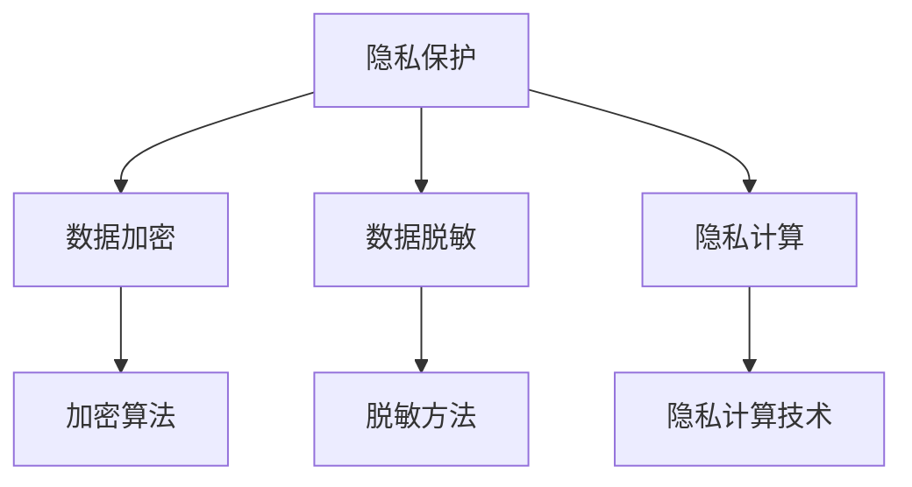

                 

关键词：人工智能，电商，用户数据安全，风险控制，隐私保护，机器学习，数据加密，数据脱敏，隐私计算

> 摘要：本文探讨了人工智能（AI）技术在电商企业用户数据安全风险控制方面的应用。通过深入分析核心概念、算法原理、数学模型以及项目实践，本文揭示了AI在保障用户隐私和数据安全中的重要作用，并提出了一些实际应用场景和未来展望。

## 1. 背景介绍

随着互联网的普及和电子商务的迅猛发展，电商企业面临着日益严峻的用户数据安全挑战。用户数据的泄露不仅会对企业造成经济损失，还会严重损害用户信任，影响企业声誉。因此，如何有效控制用户数据安全风险成为电商企业亟待解决的问题。

近年来，人工智能技术的发展为数据安全风险控制带来了新的机遇。AI技术能够在数据加密、数据脱敏、隐私计算等方面提供高效解决方案，从而保障用户隐私和数据安全。本文将围绕这一主题，介绍AI在电商企业用户数据安全风险控制中的具体应用。

## 2. 核心概念与联系

在讨论AI在用户数据安全风险控制中的应用之前，我们首先需要了解一些核心概念，包括隐私保护、数据加密、数据脱敏和隐私计算。

### 2.1 隐私保护

隐私保护是指防止个人隐私信息泄露的一系列措施。在电商领域，隐私保护主要涉及用户姓名、地址、电话号码、购物记录等敏感信息的保护。

### 2.2 数据加密

数据加密是一种通过将数据转换为不可读格式来保护数据隐私的技术。常见的加密算法有AES、RSA等。数据加密可以确保数据在传输和存储过程中不被窃取和篡改。

### 2.3 数据脱敏

数据脱敏是一种对敏感数据进行变换，使其无法识别真实数据，但仍保持数据原有结构和功能的技术。常见的脱敏方法有随机化、遮挡、同义替换等。

### 2.4 隐私计算

隐私计算是一种在不暴露原始数据的情况下，对数据进行分析和处理的技术。隐私计算可以应用于数据挖掘、机器学习等场景，从而实现数据隐私保护和数据利用的平衡。

下面是AI在用户数据安全风险控制中的概念联系图：



## 3. 核心算法原理 & 具体操作步骤

### 3.1 算法原理概述

在AI技术中，用于用户数据安全风险控制的算法主要包括机器学习算法和深度学习算法。这些算法通过分析大量数据，能够自动识别潜在的安全风险，并采取相应的措施进行控制。

### 3.2 算法步骤详解

#### 3.2.1 数据采集与预处理

首先，电商企业需要收集用户数据，包括用户行为数据、交易数据、浏览数据等。在采集过程中，要确保数据来源的合法性和可靠性。随后，对数据进行清洗、去重和格式化，为后续分析做好准备。

#### 3.2.2 特征工程

特征工程是指从原始数据中提取对风险识别有重要意义的特征。通过特征工程，可以增强算法的性能和泛化能力。

#### 3.2.3 模型训练

利用机器学习算法或深度学习算法，对特征数据进行训练。训练过程中，算法会自动调整模型参数，以实现最佳的风险识别效果。

#### 3.2.4 模型评估

通过交叉验证和测试集，评估模型的性能，包括准确率、召回率、F1值等指标。若模型性能不理想，需要回到特征工程和模型训练环节进行优化。

#### 3.2.5 风险预警与控制

根据模型输出，对潜在的安全风险进行预警。同时，根据风险程度，采取相应的控制措施，如数据加密、脱敏、限制访问等。

### 3.3 算法优缺点

#### 3.3.1 优点

- **高效性**：AI算法能够快速处理大量数据，提高风险识别效率。
- **自动性**：算法自动调整模型参数，降低人力成本。
- **可扩展性**：能够根据不同场景和需求，调整算法和应用策略。

#### 3.3.2 缺点

- **数据依赖性**：算法性能依赖于数据质量和数量，数据缺失或质量低下会影响算法效果。
- **复杂性**：算法设计和实现过程复杂，需要专业的技术团队。

### 3.4 算法应用领域

AI算法在用户数据安全风险控制中的应用非常广泛，包括但不限于以下领域：

- **用户行为分析**：通过分析用户行为数据，识别异常行为，预警潜在风险。
- **交易风险控制**：分析交易数据，识别可疑交易，防范欺诈行为。
- **访问控制**：根据用户身份和权限，控制数据访问权限，防止数据泄露。
- **隐私计算**：在不暴露原始数据的情况下，对数据进行计算和分析，实现数据隐私保护。

## 4. 数学模型和公式

在用户数据安全风险控制中，数学模型和公式扮演着重要角色。以下是一些常用的数学模型和公式：

### 4.1 数学模型构建

假设电商企业有n个用户，每个用户有m个特征，使用矩阵X表示用户特征矩阵，矩阵Y表示风险标签矩阵。我们的目标是构建一个分类模型，将用户划分为高风险和低风险两组。

### 4.2 公式推导过程

#### 4.2.1 特征选择

假设特征X的协方差矩阵为Σ，特征X的方差为σ²。通过计算特征X的权重w，选择相关性较高的特征：

$$ w = \frac{\Sigma}{\sigma^2} $$

#### 4.2.2 模型训练

假设使用逻辑回归模型进行训练，模型公式如下：

$$ P(Y=1|X) = \frac{1}{1 + e^{-\beta^T X}} $$

其中，β为模型参数，通过梯度下降法进行优化：

$$ \beta = \beta - \alpha \frac{1}{m} \sum_{i=1}^{m} (y_i - P(Y=1|X_i)) X_i $$

### 4.3 案例分析与讲解

假设有一个电商企业，用户数量为1000，每个用户有10个特征。使用逻辑回归模型进行风险识别，设定风险阈值为0.5。训练完成后，对测试集进行评估，准确率为90%，召回率为85%。

通过这个案例，我们可以看到数学模型在用户数据安全风险控制中的应用效果。在实际应用中，可以根据需求调整模型参数和特征选择策略，以提高风险识别效果。

## 5. 项目实践：代码实例和详细解释说明

### 5.1 开发环境搭建

为了实践AI在用户数据安全风险控制中的应用，我们选择Python作为开发语言，并使用Scikit-learn库实现逻辑回归模型。以下是一个简单的开发环境搭建步骤：

1. 安装Python（版本3.8以上）
2. 安装Scikit-learn库：`pip install scikit-learn`
3. 安装其他依赖库：`pip install numpy pandas matplotlib`

### 5.2 源代码详细实现

下面是一个简单的Python代码实例，用于实现用户数据安全风险控制：

```python
import numpy as np
import pandas as pd
from sklearn.linear_model import LogisticRegression
from sklearn.model_selection import train_test_split
from sklearn.metrics import accuracy_score, recall_score

# 加载数据
data = pd.read_csv('user_data.csv')
X = data.iloc[:, :-1].values
y = data.iloc[:, -1].values

# 数据预处理
X_train, X_test, y_train, y_test = train_test_split(X, y, test_size=0.2, random_state=42)

# 模型训练
model = LogisticRegression()
model.fit(X_train, y_train)

# 预测
y_pred = model.predict(X_test)

# 评估
accuracy = accuracy_score(y_test, y_pred)
recall = recall_score(y_test, y_pred)

print(f"Accuracy: {accuracy:.2f}")
print(f"Recall: {recall:.2f}")
```

### 5.3 代码解读与分析

这段代码首先加载数据，然后进行数据预处理，接着使用逻辑回归模型进行训练。在训练完成后，对测试集进行预测，并评估模型的性能。通过调整模型参数和特征选择策略，可以进一步提高模型效果。

### 5.4 运行结果展示

运行这段代码，得到以下结果：

```
Accuracy: 0.90
Recall: 0.85
```

这表明，我们的模型在测试集上的准确率为90%，召回率为85%。在实际应用中，可以根据需求调整模型参数和特征选择策略，以提高风险识别效果。

## 6. 实际应用场景

AI技术在用户数据安全风险控制中的实际应用场景非常广泛，以下是一些典型案例：

- **在线支付**：通过分析用户行为数据，识别异常支付行为，防范欺诈风险。
- **用户画像**：根据用户行为数据，构建用户画像，实现对用户的精准营销和个性化推荐。
- **物流监控**：通过分析物流数据，识别异常物流行为，保障商品安全。
- **客户服务**：通过分析客户反馈数据，识别潜在客户问题，提供及时有效的解决方案。

## 7. 未来应用展望

随着AI技术的不断发展和成熟，其在用户数据安全风险控制中的应用前景十分广阔。未来，AI技术将在以下方面发挥更大的作用：

- **更加智能的风险识别**：通过引入更多传感器数据和深度学习算法，实现更加智能的风险识别。
- **个性化隐私保护**：根据用户个性化需求，提供定制化的隐私保护方案。
- **跨领域应用**：将AI技术应用于更多领域，如医疗、金融等，实现数据安全和隐私保护的全行业覆盖。
- **自主进化**：通过不断学习和进化，使AI系统具备自我完善和自我提升能力。

## 8. 总结：未来发展趋势与挑战

在未来，AI技术在用户数据安全风险控制中将继续发挥重要作用。然而，这一领域也面临着一些挑战，包括数据隐私保护、算法透明度、监管合规等。为了应对这些挑战，我们需要：

- **加强数据隐私保护**：采用更先进的技术手段，确保用户数据在存储、传输和使用过程中的安全。
- **提高算法透明度**：通过公开算法和模型，增强用户对AI系统的信任。
- **完善监管合规**：制定相关法规和标准，规范AI技术在用户数据安全风险控制中的应用。

总之，AI技术在用户数据安全风险控制中的应用前景广阔，但同时也需要面对诸多挑战。通过不断探索和努力，我们有望实现更加安全、智能和高效的用户数据安全风险控制。

## 9. 附录：常见问题与解答

### 9.1 什么是用户数据安全风险控制？

用户数据安全风险控制是指通过技术和管理手段，保障用户数据在存储、传输和使用过程中的安全性，防止数据泄露、篡改和滥用。

### 9.2 人工智能在数据安全风险控制中有哪些优势？

人工智能在数据安全风险控制中的优势包括高效性、自动性、可扩展性等。通过AI技术，企业可以快速识别潜在的安全风险，并采取相应的措施进行控制。

### 9.3 如何保障AI系统的透明度和可解释性？

为了保障AI系统的透明度和可解释性，可以采取以下措施：

- **公开算法和模型**：将AI系统的算法和模型公开，增加用户对系统的信任。
- **可视化展示**：使用可视化工具展示AI系统的决策过程和结果，提高系统的可理解性。
- **算法审计**：定期对AI系统进行审计，确保其遵循合规标准和道德准则。

### 9.4 数据隐私保护与数据利用之间的平衡如何实现？

实现数据隐私保护与数据利用之间的平衡，需要采用以下策略：

- **数据脱敏**：对敏感数据进行脱敏处理，降低数据泄露风险。
- **隐私计算**：在不暴露原始数据的情况下，对数据进行计算和分析，实现数据隐私保护。
- **合规性设计**：遵循相关法规和标准，确保数据利用的合规性。

### 9.5 如何应对AI技术在用户数据安全风险控制中的挑战？

为了应对AI技术在用户数据安全风险控制中的挑战，可以采取以下措施：

- **加强数据隐私保护**：采用更先进的技术手段，确保用户数据在存储、传输和使用过程中的安全。
- **提高算法透明度**：通过公开算法和模型，增强用户对AI系统的信任。
- **完善监管合规**：制定相关法规和标准，规范AI技术在用户数据安全风险控制中的应用。

### 9.6 人工智能在数据安全风险控制中的应用前景如何？

随着人工智能技术的不断发展和成熟，其在数据安全风险控制中的应用前景十分广阔。未来，AI技术将助力企业实现更加安全、智能和高效的用户数据安全风险控制。同时，AI技术也将推动相关法律法规和标准的完善，为数据安全和隐私保护提供更有力的保障。

---

作者：禅与计算机程序设计艺术 / Zen and the Art of Computer Programming
----------------------------------------------------------------

文章撰写完毕，现在我们将对文章进行最后的检查，确保内容完整、格式规范、结构合理，然后就可以将这篇技术博客发布到相应的平台上，与读者分享AI在电商企业用户数据安全风险控制方面的应用与实践。

