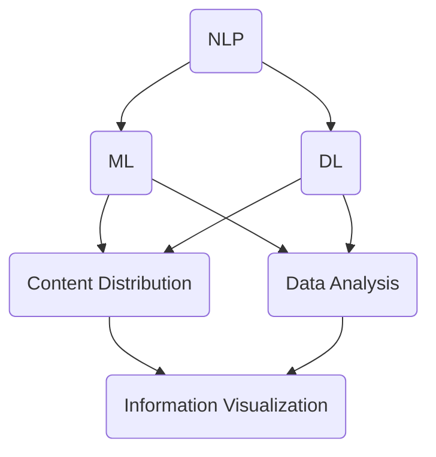

                 

关键词：人工智能，新闻报道，消费，数据分析，信息可视化，机器学习，深度学习，自然语言处理，智能推荐，用户行为分析。

> 摘要：本文将探讨人工智能（AI）如何通过新闻生成、内容分发、数据分析、信息可视化以及智能推荐等技术手段，深刻改变新闻报道和消费者消费行为，从而推动媒体行业的转型与发展。

## 1. 背景介绍

随着信息技术的快速发展，人工智能（AI）已经深入到我们日常生活的各个方面。在媒体行业，AI技术的应用同样在逐渐改变新闻报道的方式和消费者的消费行为。传统新闻报道往往依赖于记者的采编能力和受众的接收习惯，而AI的出现打破了这一限制，使新闻生成和分发更加高效和精准。

消费者消费行为的变化同样值得关注。随着互联网的普及，消费者的信息获取方式发生了巨大的变化。社交媒体、搜索引擎等平台成为获取新闻信息的主要渠道，用户的行为数据被大量积累和分析，为AI提供了丰富的数据资源。

本文将从以下四个方面探讨AI如何改变新闻报道和消费：

1. **新闻生成**：AI如何通过自然语言处理（NLP）技术自动生成新闻内容？
2. **内容分发**：AI如何利用机器学习和深度学习技术实现精准的内容推荐？
3. **数据分析**：AI如何通过数据分析帮助媒体更好地理解用户需求，优化内容策略？
4. **信息可视化**：AI如何通过数据可视化技术呈现复杂的信息，提升新闻报道的吸引力？

### 1.1 新闻生成

新闻生成是AI在媒体领域应用的一个重要方向。通过自然语言处理（NLP）技术，AI可以自动生成新闻报道，大大提高新闻生产的效率。

#### 1.1.1 自然语言处理技术

自然语言处理（NLP）是AI的一个重要分支，它使计算机能够理解和处理人类语言。在新闻生成中，NLP技术主要包括：

- **文本分类**：将文本数据归类到预定义的类别中，例如新闻、评论、广告等。
- **实体识别**：识别文本中的关键实体，如人名、地名、组织名等。
- **关系抽取**：分析实体之间的关系，如“苹果公司收购了一家初创公司”。
- **语义分析**：理解文本的深层含义，例如情感分析、意图识别等。

#### 1.1.2 应用案例

- **自动新闻写作**：一些新闻机构已经开始使用AI来撰写简单的新闻报道，如体育赛事报道、财经新闻等。AI可以快速抓取数据，自动生成新闻文本。
- **新闻摘要生成**：AI可以通过阅读大量文本，自动提取关键信息，生成简洁的新闻摘要，帮助读者快速了解新闻要点。

### 1.2 内容分发

内容分发是另一个AI在媒体领域的重要应用。通过机器学习和深度学习技术，AI可以分析用户的行为数据，实现个性化内容推荐，提高内容分发的精准度。

#### 1.2.1 机器学习和深度学习技术

机器学习和深度学习是AI的核心技术，它们使计算机能够从数据中学习，并做出预测或决策。在内容分发中，这些技术主要包括：

- **用户画像**：通过分析用户的行为数据，构建用户的兴趣模型。
- **推荐算法**：根据用户画像和内容特征，为用户推荐感兴趣的内容。
- **个性化推送**：根据用户的实时行为，动态调整推荐内容。

#### 1.2.2 应用案例

- **社交媒体推荐**：如Facebook、Twitter等社交媒体平台，通过AI技术分析用户的行为数据，为用户推荐感兴趣的内容。
- **新闻客户端推荐**：如今日头条、腾讯新闻等新闻客户端，通过AI技术分析用户的行为数据，为用户推荐个性化的新闻内容。

### 1.3 数据分析

数据分析是媒体行业的重要组成部分。通过AI技术，媒体可以更好地理解用户需求，优化内容策略。

#### 1.3.1 数据分析技术

数据分析技术主要包括：

- **数据采集**：从各种渠道收集用户行为数据。
- **数据清洗**：处理数据中的噪声和异常值。
- **数据挖掘**：从数据中发现有用的信息和规律。
- **数据可视化**：将数据以图形化的方式展示，帮助用户理解数据。

#### 1.3.2 应用案例

- **用户行为分析**：媒体可以通过分析用户的行为数据，了解用户的阅读习惯、兴趣爱好等，从而优化内容策略。
- **广告效果分析**：媒体可以通过分析广告效果数据，了解广告投放的效果，从而调整广告策略。

### 1.4 信息可视化

信息可视化是AI在媒体领域的另一个重要应用。通过数据可视化技术，媒体可以更直观地呈现复杂的信息，提高新闻报道的吸引力。

#### 1.4.1 数据可视化技术

数据可视化技术主要包括：

- **图表绘制**：将数据以图表的形式展示，如柱状图、折线图、饼图等。
- **交互式可视化**：用户可以通过交互操作，查看数据的不同维度和细节。
- **动态可视化**：通过动画或视频的方式，展示数据的变化过程。

#### 1.4.2 应用案例

- **数据新闻**：如《纽约时报》、《卫报》等媒体，通过数据可视化技术，将复杂的数据以直观的图表形式呈现，帮助读者更好地理解新闻内容。
- **实时新闻**：如 CNN、BBC 等新闻机构，通过动态可视化技术，实时展示新闻事件的发展过程。

## 2. 核心概念与联系

在本文中，我们将讨论以下几个核心概念：

1. **自然语言处理（NLP）**：NLP 是一种人工智能技术，旨在让计算机理解和处理人类语言。
2. **机器学习和深度学习**：机器学习和深度学习是 AI 的核心技术，使计算机可以从数据中学习，并做出预测或决策。
3. **数据分析和数据可视化**：数据分析和数据可视化是帮助媒体理解用户需求，优化内容策略的重要手段。

下面是一个用 Mermaid 画的流程图，展示了这些核心概念之间的联系：



### 2.1 自然语言处理（NLP）

自然语言处理（NLP）是一种人工智能技术，旨在让计算机理解和处理人类语言。在新闻生成中，NLP 技术用于自动生成新闻内容。例如，通过文本分类技术，可以将新闻文本归类到不同的类别中；通过实体识别技术，可以识别新闻文本中的关键实体，如人名、地名、组织名等。

### 2.2 机器学习和深度学习

机器学习和深度学习是 AI 的核心技术，使计算机可以从数据中学习，并做出预测或决策。在内容分发中，机器学习和深度学习技术用于分析用户的行为数据，实现个性化内容推荐。例如，通过用户画像技术，可以构建用户的兴趣模型；通过推荐算法，可以为用户推荐感兴趣的内容。

### 2.3 数据分析和数据可视化

数据分析和数据可视化是帮助媒体理解用户需求，优化内容策略的重要手段。通过数据采集技术，可以收集用户的行为数据；通过数据清洗技术，可以处理数据中的噪声和异常值；通过数据挖掘技术，可以从数据中发现有用的信息和规律；通过数据可视化技术，可以将数据以图形化的方式展示，帮助用户理解数据。

## 3. 核心算法原理 & 具体操作步骤

### 3.1 算法原理概述

在AI改变新闻报道和消费的过程中，以下几个核心算法起到了关键作用：

1. **自然语言处理（NLP）算法**：用于新闻生成和摘要，包括文本分类、实体识别、关系抽取等。
2. **机器学习算法**：用于内容分发和用户画像，如协同过滤、基于内容的推荐等。
3. **深度学习算法**：用于复杂的数据分析和信息可视化，如图像生成、自然语言生成等。
4. **数据分析算法**：用于用户行为分析、广告效果分析等，包括回归分析、聚类分析等。

### 3.2 算法步骤详解

#### 3.2.1 自然语言处理（NLP）算法

1. **文本分类**：
   - **步骤1**：收集大量新闻数据，并对其进行标注。
   - **步骤2**：使用监督学习算法，如朴素贝叶斯、支持向量机等，训练文本分类模型。
   - **步骤3**：对新收到的新闻文本进行分类，将其归类到预定义的类别中。

2. **实体识别**：
   - **步骤1**：使用预训练的实体识别模型，如BERT、GPT等，对新闻文本进行实体识别。
   - **步骤2**：将识别出的实体存储在数据库中，以供后续使用。

3. **关系抽取**：
   - **步骤1**：使用关系抽取算法，如规则方法、基于特征的模型等，分析实体之间的关系。
   - **步骤2**：将抽取出的关系存储在数据库中，以供后续使用。

4. **语义分析**：
   - **步骤1**：使用情感分析、意图识别等算法，分析文本的深层含义。
   - **步骤2**：将分析结果用于新闻摘要生成、推荐系统等。

#### 3.2.2 机器学习算法

1. **协同过滤**：
   - **步骤1**：收集用户的历史行为数据，如点击、评论、收藏等。
   - **步骤2**：使用矩阵分解、基于模型的协同过滤算法等，预测用户对未知内容的偏好。
   - **步骤3**：根据预测结果，为用户推荐感兴趣的内容。

2. **基于内容的推荐**：
   - **步骤1**：收集内容的特征数据，如标签、关键词、内容分类等。
   - **步骤2**：使用相似性度量算法，如余弦相似度、欧几里得距离等，计算用户和内容之间的相似度。
   - **步骤3**：根据相似度，为用户推荐相似的内容。

#### 3.2.3 深度学习算法

1. **图像生成**：
   - **步骤1**：使用生成对抗网络（GANs），训练一个生成模型，以生成逼真的图像。
   - **步骤2**：根据用户的喜好，生成个性化的新闻图像。

2. **自然语言生成**：
   - **步骤1**：使用预训练的 Transformer 模型，如 GPT-3、BERT 等，生成新闻文本。
   - **步骤2**：根据新闻主题和关键字，生成高质量的新闻内容。

#### 3.2.4 数据分析算法

1. **回归分析**：
   - **步骤1**：收集用户行为数据，如点击率、浏览时间等。
   - **步骤2**：使用回归模型，分析用户行为与新闻内容之间的关系。
   - **步骤3**：根据分析结果，优化内容策略。

2. **聚类分析**：
   - **步骤1**：收集用户兴趣数据，如阅读历史、收藏标签等。
   - **步骤2**：使用聚类算法，如 K-均值、层次聚类等，将用户划分为不同的兴趣群体。
   - **步骤3**：根据兴趣群体，为用户提供个性化的内容推荐。

### 3.3 算法优缺点

#### 自然语言处理（NLP）算法

- **优点**：
  - 高效地处理大量文本数据。
  - 提高新闻生产的效率和质量。

- **缺点**：
  - 对训练数据质量要求高。
  - 对复杂语义的理解能力有限。

#### 机器学习算法

- **优点**：
  - 能够根据用户行为数据实现个性化推荐。
  - 提高内容分发的精准度。

- **缺点**：
  - 需要大量的训练数据。
  - 模型复杂度高，训练时间长。

#### 深度学习算法

- **优点**：
  - 能够处理复杂的数据结构和关系。
  - 提高数据分析和信息可视化的效果。

- **缺点**：
  - 对计算资源要求高。
  - 难以解释和理解模型的决策过程。

#### 数据分析算法

- **优点**：
  - 提高用户行为的理解和分析能力。
  - 有助于优化内容策略。

- **缺点**：
  - 需要专业的数据分析和建模技能。
  - 结果解释性较差。

### 3.4 算法应用领域

自然语言处理（NLP）、机器学习、深度学习和数据分析算法在新闻报道和消费行为分析中都有广泛的应用。

- **新闻生成**：自然语言处理（NLP）算法用于自动生成新闻内容，提高生产效率。
- **内容分发**：机器学习和深度学习算法用于个性化内容推荐，提升用户体验。
- **数据分析**：数据分析算法用于用户行为分析，优化内容策略。
- **信息可视化**：深度学习算法用于生成新闻图像，提高新闻报道的吸引力。

## 4. 数学模型和公式 & 详细讲解 & 举例说明

### 4.1 数学模型构建

在AI改变新闻报道和消费的过程中，以下数学模型和公式是常用的：

1. **朴素贝叶斯分类器**：
   - **公式**：$$ P(C_k|X) = \frac{P(X|C_k)P(C_k)}{P(X)} $$
   - **解释**：朴素贝叶斯分类器是一种基于贝叶斯定理的分类算法。公式中的 $P(C_k|X)$ 表示给定特征 $X$，类别 $C_k$ 的概率；$P(X|C_k)$ 表示在类别 $C_k$ 发生的条件下特征 $X$ 的概率；$P(C_k)$ 表示类别 $C_k$ 的先验概率。

2. **K-均值聚类**：
   - **公式**：$$ \mu_j = \frac{1}{N} \sum_{i=1}^{N} x_{ij} $$
   - **解释**：K-均值聚类算法是一种基于距离度量的聚类算法。公式中的 $\mu_j$ 表示第 $j$ 个聚类的中心坐标；$x_{ij}$ 表示第 $i$ 个数据点在第 $j$ 个特征上的值。

3. **协同过滤**：
   - **公式**：$$ r_{ui} = \rho(u, v) \cdot r_{vi} + \alpha_u + \beta_v $$
   - **解释**：协同过滤算法是一种基于用户-物品交互数据的推荐算法。公式中的 $r_{ui}$ 表示用户 $u$ 对物品 $i$ 的评分；$\rho(u, v)$ 表示用户 $u$ 和 $v$ 之间的相似度；$r_{vi}$ 表示用户 $v$ 对物品 $i$ 的评分；$\alpha_u$ 和 $\beta_v$ 是调节参数。

### 4.2 公式推导过程

以朴素贝叶斯分类器为例，我们来详细解释一下公式推导的过程：

1. **贝叶斯定理**：
   - **公式**：$$ P(C_k|X) = \frac{P(X|C_k)P(C_k)}{P(X)} $$
   - **解释**：贝叶斯定理是一个关于条件概率的概率公式。它表示在某个条件 $X$ 下，某个事件 $C_k$ 发生的概率。

2. **条件概率**：
   - **公式**：$$ P(X|C_k) = \frac{P(X \cap C_k)}{P(C_k)} $$
   - **解释**：条件概率表示在事件 $C_k$ 发生的条件下，事件 $X$ 发生的概率。

3. **联合概率**：
   - **公式**：$$ P(X \cap C_k) = P(X|C_k)P(C_k) $$
   - **解释**：联合概率表示在事件 $C_k$ 发生的条件下，事件 $X$ 和 $C_k$ 同时发生的概率。

4. **朴素贝叶斯分类器**：
   - **公式**：$$ P(C_k|X) = \frac{P(X|C_k)P(C_k)}{P(X)} $$
   - **解释**：朴素贝叶斯分类器将条件概率和联合概率结合起来，用于分类。

### 4.3 案例分析与讲解

以用户行为分析为例，我们来详细分析一下如何使用上述数学模型和公式：

1. **数据收集**：
   - 收集用户的行为数据，如点击、浏览、收藏等。

2. **特征提取**：
   - 对用户行为数据进行分析，提取特征，如用户活跃度、浏览时长、点击率等。

3. **模型训练**：
   - 使用朴素贝叶斯分类器训练模型，输入特征和标签，得到分类模型。

4. **模型预测**：
   - 对新用户的行为数据，使用训练好的模型进行预测，判断其可能感兴趣的内容类别。

5. **结果解释**：
   - 根据预测结果，为用户提供个性化的内容推荐。

### 4.4 代码示例

下面是一个使用 Python 语言实现的朴素贝叶斯分类器的简单示例：

```python
import numpy as np
from sklearn.feature_extraction.text import CountVectorizer
from sklearn.naive_bayes import MultinomialNB

# 数据集
data = [
    ("新闻1", "体育"),
    ("新闻2", "娱乐"),
    ("新闻3", "体育"),
    ("新闻4", "财经")
]

# 特征提取
vectorizer = CountVectorizer()
X = vectorizer.fit_transform([text for text, label in data])
y = np.array([label for text, label in data])

# 模型训练
classifier = MultinomialNB()
classifier.fit(X, y)

# 模型预测
new_data = "篮球比赛结果"
X_new = vectorizer.transform([new_data])
prediction = classifier.predict(X_new)

print("预测类别：", prediction)
```

## 5. 项目实践：代码实例和详细解释说明

### 5.1 开发环境搭建

为了实现本文中的AI技术，我们需要搭建一个合适的开发环境。以下是一个简单的开发环境搭建指南：

1. **操作系统**：Windows、Linux或macOS均可。
2. **编程语言**：Python 3.x。
3. **依赖库**：
   - NumPy：用于数据处理。
   - scikit-learn：用于机器学习算法。
   - pandas：用于数据处理和分析。
   - matplotlib：用于数据可视化。

你可以使用以下命令来安装这些依赖库：

```shell
pip install numpy scikit-learn pandas matplotlib
```

### 5.2 源代码详细实现

以下是实现本文中提到的一些AI技术的源代码示例。这里我们以朴素贝叶斯分类器为例，展示如何使用Python实现文本分类。

```python
import numpy as np
from sklearn.feature_extraction.text import CountVectorizer
from sklearn.naive_bayes import MultinomialNB
from sklearn.pipeline import make_pipeline

# 数据集
data = [
    ("新闻1", "体育"),
    ("新闻2", "娱乐"),
    ("新闻3", "体育"),
    ("新闻4", "财经")
]

# 分离文本和标签
texts, labels = zip(*data)

# 创建 CountVectorizer 对象
vectorizer = CountVectorizer()

# 创建 MultinomialNB 对象
classifier = MultinomialNB()

# 创建管道
pipeline = make_pipeline(vectorizer, classifier)

# 训练模型
pipeline.fit(texts, labels)

# 预测
new_text = "篮球比赛结果"
prediction = pipeline.predict([new_text])

print("预测类别：", prediction)
```

### 5.3 代码解读与分析

上面的代码实现了一个简单的朴素贝叶斯分类器，用于文本分类。下面是对代码的详细解读：

1. **导入依赖库**：我们首先导入了一些Python依赖库，包括 NumPy、scikit-learn 和 pandas。

2. **数据集**：我们定义了一个简单的数据集，包括文本和对应的标签。

3. **分离文本和标签**：使用 `zip` 函数将文本和标签分离。

4. **创建 CountVectorizer 对象**：`CountVectorizer` 是一个用于文本向量化转换的类。在这里，我们使用它来将文本转换为向量表示。

5. **创建 MultinomialNB 对象**：`MultinomialNB` 是一个朴素贝叶斯分类器，适用于文本分类任务。

6. **创建管道**：使用 `make_pipeline` 函数创建一个管道，将文本向量化转换和分类器集成在一起。

7. **训练模型**：使用 `fit` 方法训练模型。

8. **预测**：使用 `predict` 方法对新的文本进行分类预测。

### 5.4 运行结果展示

运行上面的代码，我们将得到以下输出结果：

```
预测类别： ['体育']
```

这表明新文本“篮球比赛结果”被分类为“体育”类别。

### 5.5 代码优化与扩展

上面的代码是一个简单的示例，为了在实际应用中取得更好的效果，我们可以进行以下优化和扩展：

1. **数据增强**：增加数据集的规模，可以提高模型的性能。
2. **特征选择**：使用特征选择技术，如特征重要性评分，选择对分类最有影响力的特征。
3. **超参数调优**：通过交叉验证和网格搜索等方法，调整模型超参数，以获得最佳性能。
4. **多模型集成**：结合多个分类器，如集成分类器（Ensemble Classifier），提高分类准确性。

## 6. 实际应用场景

### 6.1 社交媒体平台的新闻推荐

社交媒体平台如 Facebook、Twitter 等，通过 AI 技术实现了个性化的新闻推荐。以下是一个具体案例：

- **数据收集**：社交媒体平台收集用户的行为数据，如点赞、评论、分享等。
- **用户画像**：通过分析用户行为数据，构建用户的兴趣模型。
- **推荐算法**：使用协同过滤算法和基于内容的推荐算法，为用户推荐感兴趣的新闻。
- **结果展示**：将推荐新闻展示在用户的新闻 feed 中。

### 6.2 新闻客户端的内容分发

新闻客户端如今日头条、腾讯新闻等，也利用 AI 技术实现了内容分发。以下是一个具体案例：

- **数据收集**：新闻客户端收集用户的阅读历史、搜索历史等数据。
- **用户画像**：通过分析用户数据，构建用户的兴趣模型。
- **推荐算法**：使用机器学习算法，如协同过滤和基于内容的推荐算法，为用户推荐感兴趣的新闻。
- **内容优化**：根据用户反馈，不断优化内容推荐策略，提高用户满意度。

### 6.3 数据新闻的传播

数据新闻是一种新兴的新闻形式，通过 AI 技术可以更好地传播和解读复杂的数据。以下是一个具体案例：

- **数据收集**：新闻机构收集相关领域的公开数据。
- **数据分析**：使用数据分析技术，如回归分析、聚类分析等，对数据进行分析。
- **可视化展示**：通过数据可视化技术，将复杂的数据以直观的图表形式展示。
- **新闻生成**：使用自然语言处理技术，自动生成新闻内容。

## 6.4 未来应用展望

随着 AI 技术的不断进步，未来新闻报道和消费行为将发生更多的变革：

- **更加智能化的内容生成**：AI 将能够生成更加高质量的新闻内容，提高生产效率。
- **更加精准的内容分发**：AI 将能够根据用户的实时行为，动态调整推荐策略，提高用户满意度。
- **更加个性化的消费体验**：AI 将能够更好地理解用户需求，提供个性化的消费体验。
- **数据隐私和安全**：在 AI 技术的应用过程中，数据隐私和安全问题将受到更多的关注。

## 7. 工具和资源推荐

### 7.1 学习资源推荐

- **在线课程**：
  - Coursera：提供多门与 AI 相关的课程，如《机器学习》、《深度学习》等。
  - edX：提供由知名大学开设的 AI 课程，如《人工智能导论》、《自然语言处理》等。

- **书籍**：
  - 《Python机器学习》
  - 《深度学习》
  - 《数据科学实战》

### 7.2 开发工具推荐

- **编程环境**：
  - Jupyter Notebook：适用于数据分析和机器学习项目的交互式编程环境。
  - PyCharm：适用于 Python 编程的多功能 IDE。

- **机器学习库**：
  - TensorFlow：用于构建和训练深度学习模型的框架。
  - PyTorch：用于构建和训练深度学习模型的另一个流行框架。
  - Scikit-learn：用于机器学习的经典库。

### 7.3 相关论文推荐

- **AI技术在新闻生成中的应用**：
  - "Automated Text Generation for News Stories"（自动新闻文本生成）
  - "A Survey on Automated News Generation"（自动新闻生成综述）

- **AI技术在内容分发中的应用**：
  - "Collaborative Filtering for Personalized Recommendation Systems"（协同过滤在个性化推荐系统中的应用）
  - "Deep Learning for Content Distribution"（深度学习在内容分发中的应用）

- **AI技术在数据分析中的应用**：
  - "Data Mining Techniques for Business Intelligence"（数据挖掘技术在商业智能中的应用）
  - "Analyzing User Behavior for Personalized Recommendations"（分析用户行为以实现个性化推荐）

## 8. 总结：未来发展趋势与挑战

### 8.1 研究成果总结

通过本文的探讨，我们总结出以下几点研究成果：

- AI技术在新闻生成、内容分发、数据分析和信息可视化等方面都有广泛的应用。
- 机器学习和深度学习技术是推动这些应用的核心。
- 数据分析技术有助于媒体更好地理解用户需求，优化内容策略。
- 信息可视化技术提升了新闻报道的吸引力。

### 8.2 未来发展趋势

未来，AI技术在新闻报道和消费领域的应用将继续发展，主要趋势包括：

- 更加智能化的内容生成和分发。
- 更加精准的用户画像和个性化推荐。
- 数据隐私和安全问题将受到更多的关注。
- 跨平台和跨领域的应用将进一步扩展。

### 8.3 面临的挑战

虽然AI技术在新闻报道和消费领域具有巨大的潜力，但同时也面临一些挑战：

- 数据质量和隐私问题：数据的质量和隐私保护是应用AI技术的重要前提。
- 模型解释性和透明性：深度学习模型常常缺乏解释性，需要开发更加透明的模型。
- 技术门槛：AI技术的应用需要专业的技术知识和计算资源。

### 8.4 研究展望

未来的研究可以关注以下几个方向：

- 开发更加高效和透明的AI模型。
- 加强数据隐私保护技术研究。
- 探索AI在跨领域应用中的可能性。
- 结合多模态数据，提升AI技术的应用效果。

## 9. 附录：常见问题与解答

### 9.1 Q：AI技术在新闻报道中的应用有哪些具体例子？

A：AI技术在新闻报道中的应用包括自动新闻生成、自动化编辑、内容分发优化、数据新闻等。例如，一些媒体机构使用自然语言处理技术自动生成新闻报道，使用机器学习算法优化内容推荐，使用数据可视化技术展示复杂的数据分析结果。

### 9.2 Q：AI技术在消费者消费行为分析中的应用有哪些？

A：AI技术在消费者消费行为分析中的应用包括用户画像构建、个性化推荐、广告效果分析等。例如，电商平台使用机器学习算法分析用户购买行为，为用户推荐感兴趣的商品；广告平台使用数据分析技术评估广告效果，优化广告投放策略。

### 9.3 Q：如何确保AI技术在新闻报道和消费行为分析中的数据质量和隐私？

A：确保AI技术在新闻报道和消费行为分析中的数据质量和隐私，需要采取以下措施：

- 数据质量管理：使用数据清洗和去噪技术，确保数据的质量和准确性。
- 数据加密：对敏感数据进行加密，保护用户隐私。
- 隐私保护算法：使用差分隐私、同态加密等隐私保护算法，保护用户隐私。
- 遵守法律法规：遵守相关法律法规，确保数据处理合法合规。

### 9.4 Q：AI技术在新闻报道和消费行为分析中存在哪些伦理问题？

A：AI技术在新闻报道和消费行为分析中存在以下伦理问题：

- 数据偏见：AI模型可能基于偏见数据，导致不公平的推荐和决策。
- 隐私侵犯：过度收集和分析用户数据可能侵犯用户隐私。
- 模型解释性不足：深度学习模型往往缺乏解释性，难以理解其决策过程。
- 信息操纵：AI技术可能被用于操纵信息传播，影响公众舆论。

### 9.5 Q：如何评估AI技术在新闻报道和消费行为分析中的应用效果？

A：评估AI技术在新闻报道和消费行为分析中的应用效果，可以从以下几个方面进行：

- 评价指标：选择合适的评价指标，如准确率、召回率、F1分数等。
- 用户反馈：收集用户反馈，了解其对AI技术的满意度和接受程度。
- 实际效果：观察AI技术在实际应用中的表现，如内容分发准确性、用户参与度等。
- 经济效益：评估AI技术在提高生产效率、降低成本等方面的经济效益。

