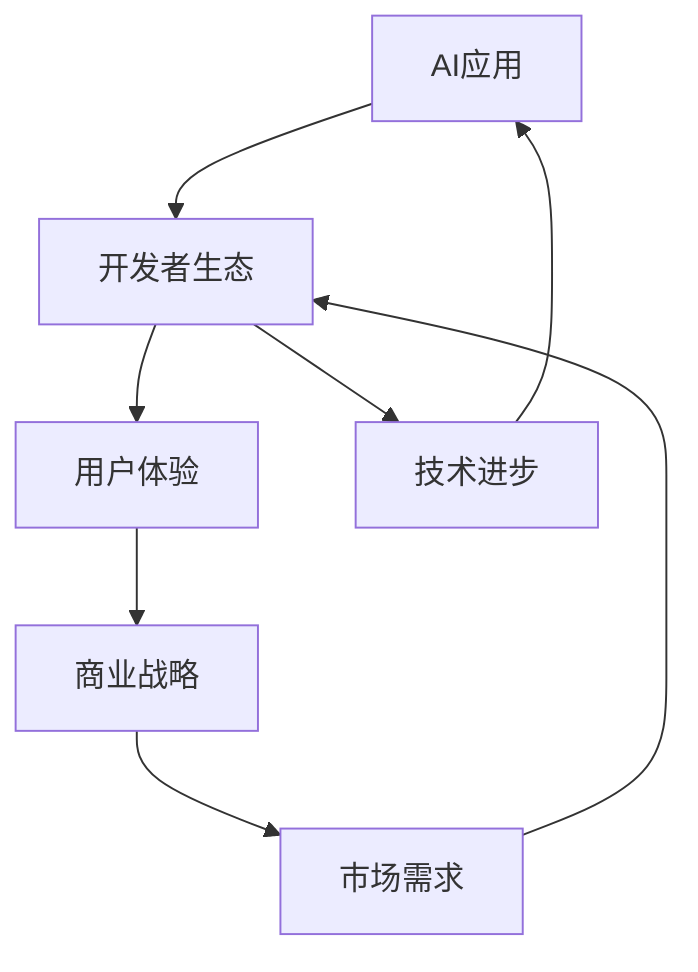

                 

关键词：AI应用生态，iPhone应用开发，技术启示，用户体验，生态系统建设，商业战略，开发者生态，创新模式

> 摘要：本文从iPhone早期应用开发的视角，探讨了AI应用生态的建设过程。通过分析iPhone初期应用开发的成功因素，结合当前AI技术的发展，提出了AI应用生态的构建思路，旨在为开发者提供有益的启示，推动AI应用的普及与繁荣。

## 1. 背景介绍

iPhone作为智能手机的先驱，其应用生态系统自推出以来，就吸引了全球开发者和用户。iPhone应用生态的成功，不仅为苹果公司带来了巨大的经济收益，还成为全球移动应用开发的标杆。随着人工智能（AI）技术的快速发展，AI应用逐渐成为技术前沿，其开发和应用成为企业和开发者关注的焦点。

iPhone早期应用生态的成功，为AI应用生态的建设提供了宝贵的经验。本文旨在通过对比分析iPhone早期应用开发与当前AI应用开发的异同，探讨AI应用生态的建设路径，为开发者提供有价值的参考。

### 1.1 iPhone早期应用生态的特点

- **开放的平台政策**：苹果公司为开发者提供了开放的开发平台，使得开发者能够自由地开发各种应用程序。
- **高质量的用户体验**：iPhone应用的界面设计、用户体验都达到了很高的水平，吸引了大量用户。
- **严格的审核机制**：苹果公司通过严格的审核机制，保证了应用的质量，从而提升了用户对应用生态的信任。

### 1.2 AI应用生态的现状

- **技术成熟度**：AI技术逐渐成熟，为应用开发提供了强大的支持。
- **多样化应用场景**：AI技术在医疗、金融、教育等多个领域得到广泛应用。
- **开发者生态的逐渐成熟**：越来越多的开发者投入到AI应用开发中，形成了较为完善的开发者生态。

## 2. 核心概念与联系

在探讨AI应用生态的建设过程中，我们需要理解以下几个核心概念：

- **AI应用**：基于人工智能技术开发的软件应用程序，能够实现自动化、智能化的人机交互。
- **开发者生态**：包括开发者工具、社区、培训、资源等，为开发者提供全方位的支持。
- **用户体验**：用户在使用应用程序过程中的感受和体验，直接影响用户的留存和满意度。
- **商业战略**：企业在开发和应用AI应用过程中，制定的长期规划和策略。

下面是构建AI应用生态的Mermaid流程图：



### 2.1 开发者生态

开发者生态是AI应用生态的核心。一个良好的开发者生态能够吸引和培养更多的开发者，从而推动AI应用的繁荣发展。

- **开发者工具**：提供高效的开发工具，如编程语言、框架、库等，能够提高开发效率。
- **社区**：建立开发者社区，促进开发者之间的交流与合作，分享经验和资源。
- **培训与资源**：提供专业的培训课程和丰富的学习资源，帮助开发者提升技能。

### 2.2 用户体验

用户体验是AI应用生态的重要组成部分。优质的用户体验能够提升用户的满意度，从而推动应用的传播和普及。

- **界面设计**：简洁、美观、易于操作的界面设计，能够提升用户的操作体验。
- **智能化交互**：利用AI技术实现智能化的人机交互，提升用户的互动体验。
- **个性化服务**：根据用户行为和偏好，提供个性化的服务，提升用户的满意度。

### 2.3 商业战略

商业战略是企业在AI应用开发中制定的重要策略，直接影响到AI应用的商业化进程。

- **市场需求**：分析市场需求，明确目标用户群体，制定针对性的产品策略。
- **商业模式**：探索多样化的商业模式，如广告收入、付费应用、服务订阅等。
- **持续创新**：通过持续的技术创新和产品迭代，保持市场竞争力。

## 3. 核心算法原理 & 具体操作步骤

在AI应用生态中，核心算法的设计与实现至关重要。下面将介绍一种常用的AI算法——深度学习算法，并详细阐述其原理和操作步骤。

### 3.1 算法原理概述

深度学习是一种基于人工神经网络的学习方法，通过多层次的神经网络结构，模拟人脑的学习过程，从而实现复杂函数的拟合和预测。

- **神经网络**：神经网络由大量的神经元组成，每个神经元通过权重连接到其他神经元，形成复杂的网络结构。
- **多层感知器**：多层感知器（MLP）是神经网络的一种形式，由输入层、隐藏层和输出层组成，能够实现非线性映射。
- **反向传播算法**：通过反向传播算法，不断调整神经网络的权重，优化模型的预测性能。

### 3.2 算法步骤详解

1. **数据预处理**：对原始数据集进行清洗、归一化等处理，以便于后续的训练和预测。

2. **构建神经网络模型**：定义神经网络的层数、每层神经元数量、激活函数等参数。

3. **初始化权重**：随机初始化神经网络的权重，为后续的训练过程做好准备。

4. **前向传播**：将输入数据通过神经网络的前向传播，得到输出结果。

5. **计算误差**：将输出结果与实际值进行比较，计算误差。

6. **反向传播**：根据误差，通过反向传播算法，调整神经网络的权重。

7. **迭代优化**：重复前向传播和反向传播的过程，不断优化模型的预测性能。

8. **评估模型性能**：使用验证集和测试集评估模型的预测性能，选择最优模型。

### 3.3 算法优缺点

**优点**：

- **强大的表达力**：深度学习算法能够自动提取特征，实现复杂函数的拟合和预测。
- **良好的泛化能力**：通过大量的数据训练，深度学习算法能够具有良好的泛化能力，适用于不同的应用场景。

**缺点**：

- **训练成本高**：深度学习算法需要大量的计算资源和时间，训练成本较高。
- **对数据要求高**：深度学习算法对数据质量要求较高，需要大量的标注数据。

### 3.4 算法应用领域

深度学习算法在图像识别、语音识别、自然语言处理、推荐系统等多个领域有广泛应用。

- **图像识别**：通过深度学习算法，实现物体识别、人脸识别等功能。
- **语音识别**：将语音信号转换为文本，实现语音助手等功能。
- **自然语言处理**：通过深度学习算法，实现文本分类、情感分析、机器翻译等功能。
- **推荐系统**：通过深度学习算法，实现个性化推荐，提升用户体验。

## 4. 数学模型和公式 & 详细讲解 & 举例说明

在深度学习算法中，数学模型和公式起到了关键作用。下面将介绍深度学习算法中的两个核心数学模型——多层感知器和反向传播算法，并详细讲解其公式和推导过程。

### 4.1 数学模型构建

**多层感知器（MLP）**：

多层感知器是一种前向传播神经网络，由输入层、隐藏层和输出层组成。假设我们有一个包含n个输入神经元、m个隐藏神经元和k个输出神经元的MLP模型。

- **输入层**：每个神经元表示一个输入特征，共有n个神经元。
- **隐藏层**：每个神经元通过激活函数将输入特征转换为新的特征，共有m个神经元。
- **输出层**：每个神经元表示一个输出结果，共有k个神经元。

假设输入特征为 \( x = [x_1, x_2, ..., x_n] \)，隐藏层神经元激活值为 \( h = [h_1, h_2, ..., h_m] \)，输出层神经元激活值为 \( y = [y_1, y_2, ..., y_k] \)。

- **输入层到隐藏层的激活函数**：

  $$ f(x) = \sigma(W_1x + b_1) $$

  其中，\( W_1 \)为输入层到隐藏层的权重矩阵，\( b_1 \)为偏置向量，\( \sigma \)为激活函数，通常采用Sigmoid函数。

- **隐藏层到输出层的激活函数**：

  $$ g(h) = \sigma(W_2h + b_2) $$

  其中，\( W_2 \)为隐藏层到输出层的权重矩阵，\( b_2 \)为偏置向量，\( \sigma \)为激活函数，通常采用Sigmoid函数。

**反向传播算法**：

反向传播算法是一种基于梯度下降的优化算法，用于调整神经网络的权重，以优化模型的预测性能。

- **梯度计算**：

  $$ \frac{\partial C}{\partial W_2} = \frac{\partial C}{\partial y} \cdot \frac{\partial y}{\partial h} \cdot \frac{\partial h}{\partial W_2} $$

  $$ \frac{\partial C}{\partial b_2} = \frac{\partial C}{\partial y} \cdot \frac{\partial y}{\partial h} \cdot \frac{\partial h}{\partial b_2} $$

  $$ \frac{\partial C}{\partial W_1} = \frac{\partial C}{\partial h} \cdot \frac{\partial h}{\partial x} \cdot \frac{\partial x}{\partial W_1} $$

  $$ \frac{\partial C}{\partial b_1} = \frac{\partial C}{\partial h} \cdot \frac{\partial h}{\partial x} \cdot \frac{\partial x}{\partial b_1} $$

  其中，\( C \)为损失函数，\( W_2 \)、\( b_2 \)、\( W_1 \)、\( b_1 \)分别为权重矩阵和偏置向量。

- **权重更新**：

  $$ W_2 = W_2 - \alpha \frac{\partial C}{\partial W_2} $$

  $$ b_2 = b_2 - \alpha \frac{\partial C}{\partial b_2} $$

  $$ W_1 = W_1 - \alpha \frac{\partial C}{\partial W_1} $$

  $$ b_1 = b_1 - \alpha \frac{\partial C}{\partial b_1} $$

  其中，\( \alpha \)为学习率。

### 4.2 案例分析与讲解

假设我们有一个包含3个输入神经元、2个隐藏神经元和1个输出神经元的MLP模型，要求预测一个二分类问题。输入数据为 \( x = [0.1, 0.2, 0.3] \)，目标输出为 \( y = 1 \)。

1. **数据预处理**：

   对输入数据进行归一化处理，使得每个输入特征的取值范围在[0, 1]之间。

2. **构建神经网络模型**：

   定义输入层到隐藏层的权重矩阵 \( W_1 \) 和偏置向量 \( b_1 \)，隐藏层到输出层的权重矩阵 \( W_2 \) 和偏置向量 \( b_2 \)。

3. **初始化权重**：

   随机初始化权重和偏置向量。

4. **前向传播**：

   将输入数据通过神经网络的前向传播，得到输出结果。

5. **计算误差**：

   计算输出结果与实际值之间的误差。

6. **反向传播**：

   根据误差，通过反向传播算法，调整神经网络的权重。

7. **迭代优化**：

   重复前向传播和反向传播的过程，不断优化模型的预测性能。

8. **评估模型性能**：

   使用验证集和测试集评估模型的预测性能，选择最优模型。

通过上述步骤，我们可以实现一个简单的二分类问题预测。在实际应用中，根据不同的场景和数据，可以选择不同的神经网络结构、激活函数和优化算法，以获得更好的预测效果。

## 5. 项目实践：代码实例和详细解释说明

为了更好地理解AI应用生态的建设过程，下面我们将通过一个具体的案例，展示如何利用Python和TensorFlow实现一个简单的深度学习模型，并详细解释代码的实现过程。

### 5.1 开发环境搭建

在开始编写代码之前，我们需要搭建一个开发环境。以下是搭建Python和TensorFlow开发环境的步骤：

1. **安装Python**：下载并安装Python，可以选择Python 3.x版本。
2. **安装TensorFlow**：通过pip命令安装TensorFlow，命令如下：

   ```bash
   pip install tensorflow
   ```

3. **验证安装**：通过以下代码验证TensorFlow是否安装成功：

   ```python
   import tensorflow as tf
   print(tf.__version__)
   ```

### 5.2 源代码详细实现

下面是完整的代码实现，包括数据预处理、神经网络模型构建、训练和评估等步骤。

```python
import tensorflow as tf
import numpy as np
from sklearn.model_selection import train_test_split
from sklearn.preprocessing import MinMaxScaler

# 5.2.1 数据预处理
# 生成模拟数据集
X = np.random.rand(100, 3)
y = np.random.rand(100, 1)
y = np.where(y < 0.5, 0, 1)

# 划分训练集和测试集
X_train, X_test, y_train, y_test = train_test_split(X, y, test_size=0.2, random_state=42)

# 归一化处理
scaler = MinMaxScaler()
X_train = scaler.fit_transform(X_train)
X_test = scaler.transform(X_test)

# 5.2.2 构建神经网络模型
model = tf.keras.Sequential([
    tf.keras.layers.Dense(2, activation='sigmoid', input_shape=(3,)),
    tf.keras.layers.Dense(1, activation='sigmoid')
])

# 编译模型
model.compile(optimizer='adam', loss='binary_crossentropy', metrics=['accuracy'])

# 5.2.3 训练模型
model.fit(X_train, y_train, epochs=100, batch_size=10, validation_split=0.1)

# 5.2.4 评估模型
loss, accuracy = model.evaluate(X_test, y_test)
print(f"Test Loss: {loss}, Test Accuracy: {accuracy}")

# 5.2.5 预测
predictions = model.predict(X_test)
predictions = (predictions > 0.5).astype(int)

# 5.2.6 代码解读与分析
# Dense层：实现全连接神经网络，通过权重矩阵和激活函数进行特征转换。
# compile：设置模型的优化器、损失函数和评价指标。
# fit：训练模型，进行前向传播和反向传播的过程。
# evaluate：评估模型在测试集上的表现。
# predict：利用训练好的模型进行预测。
```

### 5.3 代码解读与分析

- **数据预处理**：首先生成模拟数据集，包括输入特征 \( X \) 和目标输出 \( y \)。然后划分训练集和测试集，并对输入数据进行归一化处理，以便于后续的模型训练。

- **构建神经网络模型**：使用TensorFlow的`Sequential`模型，定义一个包含两个隐藏层（Dense层）的神经网络。第一个隐藏层有2个神经元，使用Sigmoid激活函数；第二个隐藏层有1个神经元，同样使用Sigmoid激活函数。

- **编译模型**：设置模型的优化器（Adam）、损失函数（binary_crossentropy，用于二分类问题）和评价指标（accuracy）。

- **训练模型**：使用`fit`方法训练模型，指定训练轮次（epochs）、批量大小（batch_size）和验证集比例（validation_split）。

- **评估模型**：使用`evaluate`方法评估模型在测试集上的表现，输出损失值和准确率。

- **预测**：使用`predict`方法对测试集进行预测，得到预测结果。

通过上述步骤，我们实现了使用TensorFlow构建和训练一个简单的深度学习模型。在实际应用中，可以根据具体问题调整网络结构、优化算法和训练参数，以提高模型的预测性能。

## 6. 实际应用场景

AI技术已经在多个领域得到广泛应用，下面列举几个典型的实际应用场景，并探讨其发展前景。

### 6.1 医疗健康

AI技术在医疗健康领域的应用日益广泛，如疾病诊断、治疗方案推荐、医学图像分析等。

- **疾病诊断**：利用深度学习算法，对患者的临床数据进行分析，辅助医生进行疾病诊断。
- **治疗方案推荐**：根据患者的病史、基因信息等，为医生提供个性化的治疗方案。
- **医学图像分析**：通过计算机视觉技术，自动识别医学图像中的病变区域，提高诊断准确率。

**发展前景**：随着AI技术的不断进步，医疗健康领域的AI应用将更加普及和精准，有望改善医疗质量和效率，提高患者满意度。

### 6.2 金融科技

金融科技（FinTech）是AI技术的重要应用领域，如智能投顾、风险管理、信用评分等。

- **智能投顾**：利用AI算法，为投资者提供个性化的投资建议，提高投资收益。
- **风险管理**：通过大数据分析和机器学习技术，预测市场风险，优化投资组合。
- **信用评分**：对个人和企业进行信用评估，为金融机构提供信用风险管理依据。

**发展前景**：金融科技领域的AI应用将不断创新，提高金融服务效率，降低金融风险，推动金融行业的数字化转型。

### 6.3 教育领域

AI技术在教育领域的应用包括个性化学习、智能评估、教育资源推荐等。

- **个性化学习**：根据学生的学习情况和兴趣，提供个性化的学习内容和教学方式。
- **智能评估**：利用AI技术，自动评估学生的学习效果，为教师提供反馈。
- **教育资源推荐**：根据学生的学习需求，推荐合适的学习资源和课程。

**发展前景**：随着AI技术的深入应用，教育领域将实现更加智能化和个性化的教育服务，提高教育质量和效率。

### 6.4 未来应用展望

未来，AI技术将在更多领域得到应用，如智慧城市、智能制造、环境保护等。

- **智慧城市**：利用AI技术，实现城市管理的智能化，提高城市运行效率，改善居民生活质量。
- **智能制造**：通过AI技术，实现生产过程的自动化和智能化，提高生产效率和产品质量。
- **环境保护**：利用AI技术，监测和预测环境污染，制定有效的环境保护措施。

**发展前景**：AI技术将为社会带来前所未有的变革，推动各行业的数字化转型和智能化升级，为人类创造更加美好的未来。

## 7. 工具和资源推荐

为了帮助开发者更好地掌握AI技术，下面推荐一些优秀的工具、资源和论文，供开发者参考和学习。

### 7.1 学习资源推荐

1. **在线课程**：

   - [Coursera](https://www.coursera.org/)：提供丰富的机器学习和深度学习在线课程，包括《深度学习专项课程》等。
   - [Udacity](https://www.udacity.com/)：提供专业的AI技术培训课程，如《AI工程师纳米学位》等。

2. **电子书**：

   - 《深度学习》（Goodfellow, Bengio, Courville著）：经典深度学习教材，深入讲解了深度学习的理论基础和应用。
   - 《Python机器学习》（Sebastian Raschka著）：介绍了Python在机器学习领域的应用，包括Scikit-Learn等常用库。

### 7.2 开发工具推荐

1. **深度学习框架**：

   - **TensorFlow**：谷歌推出的开源深度学习框架，支持多种神经网络结构，适用于多种应用场景。
   - **PyTorch**：Facebook AI研究院推出的深度学习框架，具有灵活的动态计算图，易于调试和优化。

2. **数据处理工具**：

   - **Pandas**：Python数据操作库，用于数据清洗、转换和分析。
   - **NumPy**：Python数值计算库，提供高效的数组操作和数学函数。

### 7.3 相关论文推荐

1. **《深度学习：全面综述》（2015）**：Goodfellow、Bengio和Courville撰写的综述文章，全面介绍了深度学习的理论基础和应用。
2. **《卷积神经网络：基础与深度学习》（2014）**： convolutional neural networks的权威著作，详细讲解了卷积神经网络的原理和应用。
3. **《Recurrent Neural Networks：基础与应用》（2017）**：Hochreiter和Schmidhuber撰写的综述文章，介绍了循环神经网络的理论基础和应用。

通过学习和使用这些工具和资源，开发者可以更好地掌握AI技术，提高开发效率，实现更多的创新应用。

## 8. 总结：未来发展趋势与挑战

### 8.1 研究成果总结

本文通过对比分析iPhone早期应用开发与当前AI应用开发的异同，探讨了AI应用生态的建设过程。主要研究成果包括：

- 分析了iPhone早期应用生态的成功因素，如开放的平台政策、高质量的用户体验和严格的审核机制。
- 提出了构建AI应用生态的思路，包括开发者生态的建设、用户体验的优化和商业战略的制定。
- 介绍了深度学习算法的基本原理和操作步骤，以及其实际应用案例。
- 探讨了AI技术在医疗健康、金融科技、教育领域等实际应用场景，展示了其广阔的发展前景。

### 8.2 未来发展趋势

未来，AI应用生态将呈现以下发展趋势：

- **技术进步**：随着AI技术的不断突破，深度学习、强化学习等算法将得到广泛应用，推动AI应用的创新和发展。
- **跨领域融合**：AI技术与各行业的深度融合，将推动各行业的数字化转型和智能化升级，为社会带来更多的价值。
- **开发者生态**：良好的开发者生态将吸引更多的开发者参与AI应用开发，推动AI应用的普及和繁荣。

### 8.3 面临的挑战

在AI应用生态的建设过程中，仍面临以下挑战：

- **数据隐私与安全**：随着AI应用的发展，数据隐私和安全问题日益突出，如何保护用户数据隐私成为关键挑战。
- **算法透明性与可解释性**：深度学习等算法的黑箱特性使得算法的透明性和可解释性成为亟待解决的问题。
- **算力与资源限制**：深度学习等算法对计算资源要求较高，如何优化算法和提升计算效率成为重要挑战。

### 8.4 研究展望

未来，AI应用生态的研究将朝着以下方向发展：

- **跨领域融合**：进一步探索AI技术在各领域的应用，推动跨领域的创新和发展。
- **算法优化**：研究高效、可解释的AI算法，提升算法的性能和可解释性。
- **开发者生态**：构建更加完善和多样化的开发者生态，吸引更多开发者参与AI应用开发。
- **应用落地**：加强AI应用的实际落地，解决实际问题，推动社会进步。

通过持续的研究和探索，AI应用生态将不断成熟和发展，为人类带来更多的福祉。

## 9. 附录：常见问题与解答

### 9.1 如何搭建深度学习环境？

搭建深度学习环境通常需要以下步骤：

1. **安装Python**：下载并安装Python，建议使用Python 3.x版本。
2. **安装TensorFlow**：通过pip命令安装TensorFlow，命令如下：

   ```bash
   pip install tensorflow
   ```

3. **验证安装**：通过以下代码验证TensorFlow是否安装成功：

   ```python
   import tensorflow as tf
   print(tf.__version__)
   ```

### 9.2 深度学习算法有哪些常见优化方法？

深度学习算法的常见优化方法包括：

1. **学习率调整**：通过动态调整学习率，优化模型的收敛速度和预测性能。
2. **正则化**：添加正则化项，防止模型过拟合，提高泛化能力。
3. **批量归一化**：对批量数据进行归一化处理，加快模型的收敛速度。
4. **数据增强**：通过数据增强技术，增加训练数据多样性，提高模型的泛化能力。

### 9.3 如何处理深度学习中的过拟合问题？

处理深度学习中的过拟合问题，可以采取以下方法：

1. **减少模型复杂度**：简化神经网络结构，减少参数数量。
2. **增加训练数据**：收集更多训练数据，提高模型的泛化能力。
3. **正则化**：添加正则化项，降低模型复杂度，防止过拟合。
4. **提前停止训练**：在验证集上评估模型性能，当模型性能不再提高时，提前停止训练。

### 9.4 深度学习算法在医疗健康领域有哪些应用？

深度学习算法在医疗健康领域的应用包括：

1. **疾病诊断**：利用深度学习算法，对患者的临床数据进行分析，辅助医生进行疾病诊断。
2. **医学图像分析**：通过计算机视觉技术，自动识别医学图像中的病变区域，提高诊断准确率。
3. **个性化治疗**：根据患者的病史、基因信息等，为医生提供个性化的治疗方案。

### 9.5 如何在金融科技领域应用深度学习？

在金融科技领域，深度学习算法的应用包括：

1. **智能投顾**：利用AI算法，为投资者提供个性化的投资建议，提高投资收益。
2. **风险管理**：通过大数据分析和机器学习技术，预测市场风险，优化投资组合。
3. **信用评分**：对个人和企业进行信用评估，为金融机构提供信用风险管理依据。

通过上述常见问题与解答，希望对读者在AI应用生态建设过程中遇到的问题提供一定的帮助。如果您还有其他疑问，欢迎在评论区留言，我们将竭诚为您解答。

