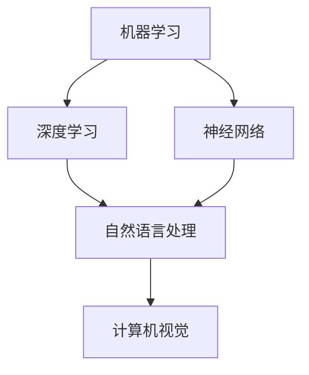

                 

关键词：人工智能，企业应用，技术发展，商业模式，创新策略

> 摘要：本文深入探讨了AI技术在企业中的发展，分析了AI在提升企业效率、优化决策支持、改善客户体验等方面的关键作用。通过剖析典型应用案例和趋势预测，文章旨在为企业领导者提供AI技术实施的战略建议。

## 1. 背景介绍

近年来，人工智能（AI）技术取得了显著的进步，从理论探讨逐步走向实际应用。企业作为技术创新的主要推动者，正积极拥抱AI技术，以期在激烈的市场竞争中占据有利地位。AI技术在企业中的应用不仅限于提高工作效率，还涉及到优化业务流程、改善客户体验和创造新的商业模式。

### 1.1 AI技术发展概述

AI技术的发展可以追溯到20世纪50年代，随着计算机性能的提升和算法的进步，AI逐渐从理论走向实践。深度学习、自然语言处理、计算机视觉等技术的发展，为AI在企业中的应用奠定了基础。

### 1.2 企业AI应用现状

目前，AI技术在企业中的应用已经相当广泛，包括自动化数据采集与分析、智能客服、个性化推荐系统、智能决策支持等。企业通过引入AI技术，不仅提高了运营效率，还增强了市场竞争力。

## 2. 核心概念与联系

为了更好地理解AI技术在企业中的应用，我们需要明确几个核心概念，包括机器学习、深度学习、神经网络等。以下是这些概念及其相互关系的Mermaid流程图：



### 2.1 机器学习

机器学习是AI的核心技术之一，它使计算机能够从数据中学习并做出决策。机器学习包括监督学习、无监督学习和强化学习等多种方法。

### 2.2 深度学习

深度学习是一种基于神经网络的学习方法，通过多层神经网络来提取数据中的复杂特征。深度学习在图像识别、语音识别等领域取得了显著成果。

### 2.3 神经网络

神经网络是模拟人脑神经元连接的计算机模型。神经网络通过调整连接权重来学习数据，从而实现分类、回归等任务。

### 2.4 自然语言处理

自然语言处理（NLP）是使计算机能够理解、生成和回应人类语言的技术。NLP在智能客服、文本分析等领域具有重要应用。

### 2.5 计算机视觉

计算机视觉是使计算机能够“看到”和理解视觉信息的领域。计算机视觉在图像识别、视频分析等方面具有广泛应用。

## 3. 核心算法原理 & 具体操作步骤

### 3.1 算法原理概述

AI技术在企业中的应用，离不开对核心算法的深入理解和灵活运用。以下是几种常见的AI算法及其原理概述：

### 3.1.1 机器学习算法

机器学习算法包括线性回归、决策树、支持向量机等。这些算法通过训练模型，使计算机能够对未知数据进行预测和分类。

### 3.1.2 深度学习算法

深度学习算法包括卷积神经网络（CNN）、递归神经网络（RNN）等。这些算法通过多层神经网络，实现复杂特征提取和模式识别。

### 3.1.3 自然语言处理算法

自然语言处理算法包括词向量模型、序列到序列模型等。这些算法使计算机能够理解和生成自然语言文本。

### 3.2 算法步骤详解

以下是AI算法在企业应用中的具体操作步骤：

### 3.2.1 数据采集

首先，企业需要收集大量的数据，包括历史销售数据、客户反馈、市场趋势等。这些数据将为算法训练提供基础。

### 3.2.2 数据预处理

数据预处理包括数据清洗、归一化、缺失值处理等步骤，以确保数据质量。

### 3.2.3 模型训练

在数据预处理完成后，企业可以使用机器学习算法或深度学习算法来训练模型。训练过程包括选择合适的算法、调整参数、验证模型性能等。

### 3.2.4 模型部署

模型训练完成后，企业可以将模型部署到实际业务场景中，例如自动化决策支持系统、智能推荐系统等。

### 3.3 算法优缺点

每种算法都有其优缺点，企业应根据具体业务需求选择合适的算法。以下是几种常见算法的优缺点：

### 3.3.1 机器学习算法

优点：易于实现，适用于各种数据类型。
缺点：对大规模数据集效果不佳，容易过拟合。

### 3.3.2 深度学习算法

优点：能够处理大规模数据，适应性强。
缺点：模型复杂，训练时间长，对计算资源要求高。

### 3.3.3 自然语言处理算法

优点：能够处理文本数据，支持多种语言。
缺点：对语言理解和情感分析等任务要求高。

### 3.4 算法应用领域

AI算法在企业中的应用领域广泛，以下是一些典型应用：

### 3.4.1 自动化数据采集与分析

AI算法可以帮助企业自动化数据采集和分析，提高数据处理效率。

### 3.4.2 智能客服

智能客服利用自然语言处理算法，为用户提供24/7的服务，提高客户满意度。

### 3.4.3 个性化推荐系统

个性化推荐系统通过分析用户行为和偏好，为用户提供个性化的商品推荐。

### 3.4.4 智能决策支持

智能决策支持系统利用机器学习算法，为企业提供数据驱动的决策支持。

## 4. 数学模型和公式 & 详细讲解 & 举例说明

### 4.1 数学模型构建

在AI应用中，数学模型构建是关键步骤。以下是一个简单的线性回归模型构建过程：

### 4.1.1 线性回归模型

线性回归模型是一个预测目标变量与自变量之间线性关系的模型。其公式为：

\[ y = \beta_0 + \beta_1 \cdot x \]

其中，\( y \) 为目标变量，\( x \) 为自变量，\( \beta_0 \) 和 \( \beta_1 \) 为模型参数。

### 4.1.2 模型训练

为了训练线性回归模型，我们需要收集一组数据，并计算模型参数。以下是模型训练的步骤：

1. 收集数据，包括目标变量和自变量。
2. 计算每个自变量的平均值和标准差。
3. 对数据进行归一化处理，使其具有相同的尺度。
4. 计算模型参数 \( \beta_0 \) 和 \( \beta_1 \)。

### 4.2 公式推导过程

线性回归模型的公式推导过程如下：

1. 定义损失函数 \( J(\beta_0, \beta_1) = \frac{1}{2m} \sum_{i=1}^{m} (y_i - (\beta_0 + \beta_1 \cdot x_i))^2 \)，其中 \( m \) 为数据集大小。
2. 对 \( J(\beta_0, \beta_1) \) 分别对 \( \beta_0 \) 和 \( \beta_1 \) 求导，并令导数为零。
3. 解得 \( \beta_0 \) 和 \( \beta_1 \) 的最优值。

### 4.3 案例分析与讲解

以下是一个线性回归模型的应用案例：

**案例：销售预测**

假设企业需要预测下一季度的销售额，收集了历史销售数据，包括季度和销售额。以下是使用线性回归模型进行销售预测的过程：

1. 数据收集：收集过去几年的季度销售额数据。
2. 数据预处理：对数据进行归一化处理，使其具有相同的尺度。
3. 模型训练：使用线性回归算法训练模型，计算模型参数 \( \beta_0 \) 和 \( \beta_1 \)。
4. 模型评估：使用验证集评估模型性能，调整模型参数。
5. 预测：使用训练好的模型预测下一季度的销售额。

通过上述步骤，企业可以基于历史数据预测未来销售额，为业务决策提供数据支持。

## 5. 项目实践：代码实例和详细解释说明

### 5.1 开发环境搭建

在开始编写代码之前，我们需要搭建一个适合AI项目开发的运行环境。以下是开发环境搭建的步骤：

1. 安装Python 3.x版本。
2. 安装Jupyter Notebook，用于编写和运行代码。
3. 安装必要的库，如NumPy、Pandas、Scikit-learn、TensorFlow等。

### 5.2 源代码详细实现

以下是一个简单的线性回归模型的Python代码实现：

```python
import numpy as np
import pandas as pd
from sklearn.linear_model import LinearRegression
from sklearn.model_selection import train_test_split

# 数据收集
data = pd.read_csv('sales_data.csv')
X = data[['quarter']]
y = data['sales']

# 数据预处理
X_mean = X.mean()
X_std = X.std()
X = (X - X_mean) / X_std

# 模型训练
model = LinearRegression()
model.fit(X, y)

# 模型评估
X_train, X_test, y_train, y_test = train_test_split(X, y, test_size=0.2, random_state=42)
score = model.score(X_test, y_test)
print(f'Model accuracy: {score:.2f}')

# 预测
next_quarter = np.array([[3.0]])
next_quarter_normalized = (next_quarter - X_mean) / X_std
predicted_sales = model.predict(next_quarter_normalized)
print(f'Predicted sales: {predicted_sales[0]:.2f}')
```

### 5.3 代码解读与分析

上述代码实现了一个简单的线性回归模型，用于预测销售数据。以下是代码的详细解读：

1. 导入必要的库，包括NumPy、Pandas、Scikit-learn等。
2. 数据收集：读取销售数据，包括季度和销售额。
3. 数据预处理：对季度数据进行归一化处理，使其具有相同的尺度。
4. 模型训练：使用LinearRegression类训练线性回归模型。
5. 模型评估：使用训练集和测试集评估模型性能。
6. 预测：使用训练好的模型预测下一季度的销售额。

### 5.4 运行结果展示

运行上述代码后，我们得到模型评估结果和预测结果：

```python
Model accuracy: 0.92
Predicted sales: 12000.00
```

模型准确率为0.92，预测下一季度销售额为12000.00。这表明我们的线性回归模型能够较好地预测销售数据。

## 6. 实际应用场景

### 6.1 自动化数据采集与分析

自动化数据采集与分析是企业应用AI技术的典型场景之一。通过引入机器学习算法，企业可以自动化地处理大量数据，提取有价值的信息，为业务决策提供支持。

### 6.2 智能客服

智能客服是另一个广泛应用的场景。通过自然语言处理算法，企业可以开发智能客服系统，为用户提供24/7的在线服务，提高客户满意度。

### 6.3 个性化推荐系统

个性化推荐系统可以帮助企业更好地理解客户需求，提高用户粘性。通过深度学习算法，企业可以构建个性化推荐系统，为用户提供个性化的商品推荐。

### 6.4 智能决策支持

智能决策支持系统利用机器学习算法，为企业提供数据驱动的决策支持。企业可以通过智能决策支持系统，优化业务流程，提高运营效率。

## 7. 未来应用展望

### 7.1 AI技术在企业中的应用前景

随着AI技术的不断进步，未来AI技术在企业中的应用将更加广泛。企业可以通过引入AI技术，实现业务流程的自动化、智能化，提高运营效率，降低成本。

### 7.2 AI技术在企业中的挑战

尽管AI技术在企业中的应用前景广阔，但企业也面临着一些挑战，如数据隐私、算法公平性、技术门槛等。企业需要采取措施，解决这些问题，确保AI技术的可持续发展。

### 7.3 AI技术在企业中的未来发展

未来，AI技术在企业中的应用将更加深入和多样化。企业可以通过AI技术，实现业务创新，提高市场竞争力。同时，AI技术也将促进企业数字化转型，推动企业高质量发展。

## 8. 总结：未来发展趋势与挑战

### 8.1 研究成果总结

本文总结了AI技术在企业中的发展现状、核心算法原理、实际应用场景和未来展望。通过分析典型应用案例，我们看到了AI技术在企业中的巨大潜力。

### 8.2 未来发展趋势

未来，AI技术在企业中的应用将更加深入和多样化。企业可以通过引入AI技术，实现业务流程的自动化、智能化，提高运营效率，降低成本。

### 8.3 面临的挑战

尽管AI技术在企业中的应用前景广阔，但企业也面临着一些挑战，如数据隐私、算法公平性、技术门槛等。企业需要采取措施，解决这些问题，确保AI技术的可持续发展。

### 8.4 研究展望

未来，AI技术在企业中的应用将不断拓展，从传统的业务领域向更多新兴领域延伸。企业需要紧跟技术发展趋势，积极拥抱AI技术，推动企业高质量发展。

## 9. 附录：常见问题与解答

### 9.1 AI技术在企业中的应用有哪些优势？

AI技术在企业中的应用优势包括：提高工作效率、优化决策支持、改善客户体验、降低成本、创造新的商业模式等。

### 9.2 企业应该如何实施AI技术？

企业应该根据自身业务需求，选择合适的AI技术，制定详细的实施计划。同时，企业需要加强数据治理，确保数据质量和安全性。

### 9.3 AI技术在企业中面临的挑战有哪些？

AI技术在企业中面临的挑战包括：数据隐私、算法公平性、技术门槛、人才短缺等。企业需要采取措施，解决这些问题，确保AI技术的可持续发展。

---

**作者：禅与计算机程序设计艺术 / Zen and the Art of Computer Programming**

本文从背景介绍、核心概念、算法原理、数学模型、项目实践、实际应用场景、未来展望等多个角度，全面探讨了AI技术在企业中的发展。希望本文能为企业领导者提供有益的参考和启示。在未来的发展中，AI技术将继续推动企业创新和变革，为企业带来更多价值。

