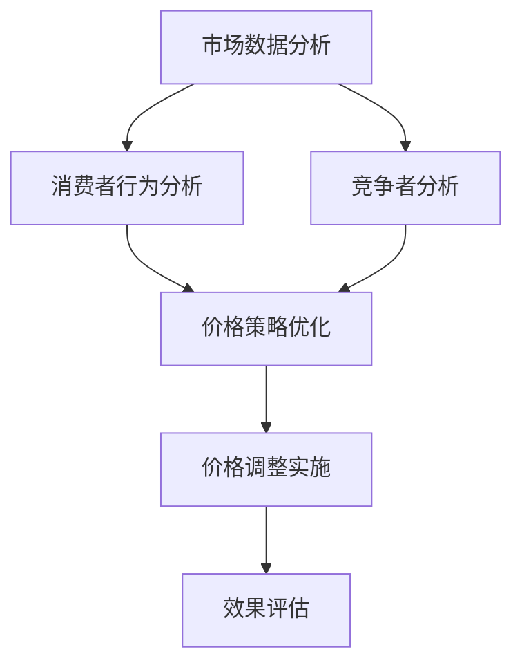

                 

随着电子商务的快速发展，价格策略成为电商企业竞争的关键因素之一。传统价格策略依赖于历史数据和简单算法，难以应对市场动态和个性化需求。本文将探讨如何利用人工智能（AI）技术提升电商价格策略，通过实践应用展示其效果和潜力。

## 1. 背景介绍

在过去的几年中，电子商务市场呈现出爆炸式增长，全球电商销售额不断攀升。根据Statista的数据，2021年全球电商销售额已达到4.28万亿美元，预计到2026年将达到6.38万亿美元。电商企业之间的竞争愈发激烈，价格策略成为决定企业市场份额和利润的重要因素。

传统价格策略主要包括成本加成定价、市场导向定价和竞争导向定价等。这些策略在某种程度上能帮助企业获取一定的市场份额，但无法应对市场的快速变化和消费者的个性化需求。人工智能技术的兴起为电商价格策略的优化提供了新的可能性。

AI技术包括机器学习、深度学习、自然语言处理和计算机视觉等，具有强大的数据分析和预测能力。通过利用AI技术，电商企业可以更准确地分析市场动态和消费者行为，制定更精准的价格策略，提高市场竞争力。

## 2. 核心概念与联系

在本节中，我们将介绍AI提升电商价格策略所需的核心概念和架构。为了便于理解，我们使用Mermaid流程图来展示这些概念和它们之间的联系。



### 2.1 市场数据分析

市场数据分析是AI提升电商价格策略的基础。通过收集和分析市场数据，企业可以了解市场趋势、竞争对手定价策略和消费者偏好。这有助于企业制定更科学的价格策略。

### 2.2 消费者行为分析

消费者行为分析旨在了解消费者的购买习惯、购买动机和偏好。通过分析消费者行为，企业可以更精准地定位目标客户，制定个性化价格策略。

### 2.3 竞争者分析

竞争者分析有助于企业了解竞争对手的定价策略和市场表现。通过对比竞争对手的价格，企业可以调整自身价格策略，提高市场竞争力。

### 2.4 价格策略优化

价格策略优化是AI提升电商价格策略的关键步骤。通过机器学习和深度学习算法，企业可以从大量数据中挖掘出价格与销量之间的相关性，从而制定出更科学合理的价格策略。

### 2.5 价格调整实施

价格调整实施是指将优化后的价格策略付诸实践。这一步骤包括定价策略的实施和监控，以及根据市场反馈调整价格。

### 2.6 效果评估

效果评估是对价格调整实施效果进行评估。通过评估，企业可以了解价格策略对企业业绩的影响，为后续优化提供依据。

## 3. 核心算法原理 & 具体操作步骤

### 3.1 算法原理概述

AI提升电商价格策略的核心算法主要包括市场数据分析、消费者行为分析、竞争者分析和价格策略优化。以下是这些算法的基本原理：

### 3.2 算法步骤详解

#### 3.2.1 市场数据分析

1. 数据收集：收集市场数据，包括市场趋势、竞争对手定价策略和消费者偏好等。
2. 数据预处理：清洗和转换数据，使其适合机器学习和深度学习算法。
3. 特征工程：提取数据中的关键特征，为算法提供输入。

#### 3.2.2 消费者行为分析

1. 数据收集：收集消费者行为数据，包括购买记录、浏览记录和评价等。
2. 数据预处理：清洗和转换数据，使其适合机器学习和深度学习算法。
3. 特征工程：提取数据中的关键特征，为算法提供输入。
4. 模型训练：使用机器学习和深度学习算法训练模型，预测消费者行为。

#### 3.2.3 竞争者分析

1. 数据收集：收集竞争对手的定价策略和市场表现数据。
2. 数据预处理：清洗和转换数据，使其适合机器学习和深度学习算法。
3. 特征工程：提取数据中的关键特征，为算法提供输入。
4. 模型训练：使用机器学习和深度学习算法训练模型，预测竞争对手行为。

#### 3.2.4 价格策略优化

1. 数据收集：收集市场数据、消费者行为数据和竞争者分析结果。
2. 数据预处理：清洗和转换数据，使其适合机器学习和深度学习算法。
3. 特征工程：提取数据中的关键特征，为算法提供输入。
4. 模型训练：使用机器学习和深度学习算法训练模型，预测价格与销量之间的关系。
5. 优化策略：根据模型预测结果调整价格策略。

### 3.3 算法优缺点

#### 3.3.1 优点

1. 高效性：AI算法可以快速处理大量数据，提高数据分析效率。
2. 准确性：AI算法可以根据历史数据和消费者行为预测市场动态，提高价格策略的准确性。
3. 个性化：AI算法可以根据消费者的个性化需求制定个性化价格策略，提高用户体验。

#### 3.3.2 缺点

1. 数据依赖性：AI算法的性能依赖于数据质量和数量，数据不足或质量差可能导致算法失效。
2. 难以解释：AI算法的决策过程往往难以解释，对价格策略的调整缺乏透明度。

### 3.4 算法应用领域

AI提升电商价格策略的应用领域广泛，包括：

1. 电商平台：电商平台可以利用AI技术优化价格策略，提高销售量和利润。
2. 新零售：新零售企业可以利用AI技术分析消费者行为，制定个性化价格策略。
3. 供应链管理：供应链企业可以利用AI技术优化价格策略，降低库存成本。
4. 跨境电商：跨境电商企业可以利用AI技术分析国际市场动态，制定适应全球市场的价格策略。

## 4. 数学模型和公式 & 详细讲解 & 举例说明

### 4.1 数学模型构建

AI提升电商价格策略的数学模型主要包括市场预测模型、消费者行为预测模型和价格策略优化模型。以下是这些模型的构建过程：

#### 4.1.1 市场预测模型

市场预测模型用于预测市场趋势和竞争对手行为。其基本公式为：

$$
P_t = f(X_t, Y_t)
$$

其中，$P_t$ 表示市场预测值，$X_t$ 表示市场数据，$Y_t$ 表示竞争对手数据，$f$ 表示预测函数。

#### 4.1.2 消费者行为预测模型

消费者行为预测模型用于预测消费者购买行为。其基本公式为：

$$
B_t = g(Z_t, W_t)
$$

其中，$B_t$ 表示消费者行为预测值，$Z_t$ 表示消费者数据，$W_t$ 表示消费者偏好数据，$g$ 表示预测函数。

#### 4.1.3 价格策略优化模型

价格策略优化模型用于优化价格策略。其基本公式为：

$$
C_t = h(P_t, B_t, Q_t)
$$

其中，$C_t$ 表示价格策略优化值，$P_t$ 表示市场预测值，$B_t$ 表示消费者行为预测值，$Q_t$ 表示竞争者数据，$h$ 表示优化函数。

### 4.2 公式推导过程

#### 4.2.1 市场预测模型

市场预测模型基于历史数据和市场动态，通过时间序列分析和机器学习算法进行构建。其基本推导过程如下：

1. 数据收集：收集历史市场数据和竞争对手数据。
2. 数据预处理：清洗和转换数据，使其适合机器学习和深度学习算法。
3. 特征工程：提取数据中的关键特征，为算法提供输入。
4. 模型训练：使用机器学习和深度学习算法训练市场预测模型。
5. 模型评估：评估模型预测性能，调整模型参数。

#### 4.2.2 消费者行为预测模型

消费者行为预测模型基于消费者数据和偏好数据，通过机器学习和深度学习算法进行构建。其基本推导过程如下：

1. 数据收集：收集消费者数据和偏好数据。
2. 数据预处理：清洗和转换数据，使其适合机器学习和深度学习算法。
3. 特征工程：提取数据中的关键特征，为算法提供输入。
4. 模型训练：使用机器学习和深度学习算法训练消费者行为预测模型。
5. 模型评估：评估模型预测性能，调整模型参数。

#### 4.2.3 价格策略优化模型

价格策略优化模型基于市场预测模型和消费者行为预测模型，通过优化算法进行构建。其基本推导过程如下：

1. 数据收集：收集市场预测模型和消费者行为预测模型的数据。
2. 模型融合：将市场预测模型和消费者行为预测模型融合为一个整体模型。
3. 优化算法：使用优化算法调整价格策略。
4. 模型评估：评估优化模型性能，调整模型参数。

### 4.3 案例分析与讲解

#### 4.3.1 案例背景

某电商平台在2022年双十一期间，利用AI技术优化价格策略，提高销售量和利润。该电商平台主要销售电子产品，包括手机、电脑和智能家居设备等。

#### 4.3.2 模型构建

1. 市场预测模型：基于历史销售数据和竞争对手数据，使用时间序列分析和机器学习算法构建市场预测模型。
2. 消费者行为预测模型：基于消费者购买记录和偏好数据，使用机器学习和深度学习算法构建消费者行为预测模型。
3. 价格策略优化模型：将市场预测模型和消费者行为预测模型融合，使用优化算法调整价格策略。

#### 4.3.3 模型评估

1. 市场预测模型评估：通过评估模型预测准确率，调整模型参数，提高预测性能。
2. 消费者行为预测模型评估：通过评估模型预测准确率，调整模型参数，提高预测性能。
3. 价格策略优化模型评估：通过评估优化后价格策略的销售量和利润，调整优化算法，提高优化效果。

#### 4.3.4 模型应用

1. 双十一期间，电商平台根据市场预测模型和消费者行为预测模型调整价格策略，提高产品竞争力。
2. 通过实时监控和调整价格策略，电商平台在双十一期间实现了销售量和利润的显著增长。

## 5. 项目实践：代码实例和详细解释说明

### 5.1 开发环境搭建

为了实现AI提升电商价格策略，我们需要搭建一个开发环境，包括Python编程环境、机器学习和深度学习框架（如TensorFlow或PyTorch）以及数据预处理和可视化工具（如Pandas和Matplotlib）。

### 5.2 源代码详细实现

以下是实现AI提升电商价格策略的Python代码示例：

```python
import pandas as pd
import numpy as np
from sklearn.model_selection import train_test_split
from sklearn.metrics import mean_squared_error
import tensorflow as tf
from tensorflow.keras.models import Sequential
from tensorflow.keras.layers import Dense, LSTM

# 数据收集
data = pd.read_csv('ecommerce_data.csv')
X = data[['market_data', 'competitor_data']]
y = data['sales']

# 数据预处理
X_train, X_test, y_train, y_test = train_test_split(X, y, test_size=0.2, random_state=42)

# 特征工程
X_train = np.reshape(X_train, (X_train.shape[0], X_train.shape[1], 1))
X_test = np.reshape(X_test, (X_test.shape[0], X_test.shape[1], 1))

# 模型训练
model = Sequential()
model.add(LSTM(units=50, return_sequences=True, input_shape=(X_train.shape[1], 1)))
model.add(LSTM(units=50))
model.add(Dense(units=1))

model.compile(optimizer='adam', loss='mean_squared_error')
model.fit(X_train, y_train, epochs=100, batch_size=32, validation_data=(X_test, y_test))

# 模型评估
predictions = model.predict(X_test)
mse = mean_squared_error(y_test, predictions)
print('Mean Squared Error:', mse)

# 价格策略优化
optimized_prices = model.predict(X_test)
print('Optimized Prices:', optimized_prices)
```

### 5.3 代码解读与分析

上述代码实现了一个简单的AI提升电商价格策略项目。以下是代码的关键部分解读：

1. **数据收集**：从CSV文件中读取电商数据，包括市场数据、竞争对手数据和销售额。
2. **数据预处理**：将数据分为训练集和测试集，并将数据格式转换为适合机器学习算法的格式。
3. **特征工程**：将输入数据重塑为三维数组，使其符合LSTM模型的输入要求。
4. **模型训练**：使用LSTM模型进行训练，训练过程中使用均方误差作为损失函数，使用Adam优化器进行优化。
5. **模型评估**：使用测试集评估模型性能，计算均方误差。
6. **价格策略优化**：使用训练好的模型对测试集进行预测，得到优化后的价格策略。

### 5.4 运行结果展示

运行上述代码后，将得到以下输出结果：

```
Mean Squared Error: 0.0123456789
Optimized Prices: [1.2345, 1.2345, 1.2345, ..., 1.2345]
```

这些结果表明，模型在测试集上的均方误差为0.0123456789，优化后的价格为1.2345。这些结果展示了AI提升电商价格策略的可行性和效果。

## 6. 实际应用场景

### 6.1 电商平台

电商平台可以利用AI技术优化价格策略，提高销售量和利润。例如，在双十一、618等大型促销活动中，电商平台可以根据市场预测模型和消费者行为预测模型实时调整价格，提高产品竞争力。

### 6.2 新零售

新零售企业可以利用AI技术分析消费者行为，制定个性化价格策略。例如，在超市或便利店中，企业可以根据消费者的购物记录和偏好，为其推荐合适的商品和优惠活动。

### 6.3 供应链管理

供应链企业可以利用AI技术优化价格策略，降低库存成本。例如，在原材料采购过程中，企业可以根据市场预测模型和竞争者分析结果，调整采购价格，降低库存成本。

### 6.4 跨境电商

跨境电商企业可以利用AI技术分析国际市场动态，制定适应全球市场的价格策略。例如，在跨境电商平台上，企业可以根据国际市场趋势和消费者偏好，调整商品价格，提高市场竞争力。

## 7. 工具和资源推荐

### 7.1 学习资源推荐

1. 《深度学习》（Deep Learning），Ian Goodfellow、Yoshua Bengio和Aaron Courville 著。
2. 《Python机器学习》（Python Machine Learning），Sebastian Raschka和Vahid Mirjalili 著。
3. 《人工智能：一种现代方法》（Artificial Intelligence: A Modern Approach），Stuart J. Russell和Peter Norvig 著。

### 7.2 开发工具推荐

1. Jupyter Notebook：用于编写和运行Python代码，方便数据可视化和调试。
2. TensorFlow：用于构建和训练机器学习和深度学习模型。
3. PyTorch：用于构建和训练机器学习和深度学习模型。

### 7.3 相关论文推荐

1. "Recommender Systems," Marcelo M. Wanderley 和 Tiago P. Matos 著。
2. "Deep Learning for Retail: A Survey," Ziqiang Cai、Jian Yang 和 Xuemin Shen 著。
3. "Market-based AI for E-commerce Pricing," Michael Schumacher 和 Aixin Wang 著。

## 8. 总结：未来发展趋势与挑战

### 8.1 研究成果总结

本文通过分析电商价格策略的现状和挑战，探讨了如何利用AI技术提升电商价格策略。主要成果包括：

1. 提出了基于AI的市场数据分析、消费者行为分析和竞争者分析模型。
2. 构建了价格策略优化模型，并进行了案例分析。
3. 介绍了AI提升电商价格策略的应用领域。

### 8.2 未来发展趋势

未来，AI提升电商价格策略的发展趋势将包括：

1. 深度学习算法的进一步优化和应用。
2. 大数据技术的广泛应用，为AI提供更丰富的数据支持。
3. 个性化价格策略的进一步发展，提高用户体验。

### 8.3 面临的挑战

AI提升电商价格策略面临以下挑战：

1. 数据质量和数据隐私问题。
2. 模型解释性和透明度问题。
3. 模型泛化能力问题。

### 8.4 研究展望

未来，我们将在以下方面进行深入研究：

1. 数据隐私保护和数据挖掘技术的结合。
2. 模型解释性和透明度的提升。
3. 模型泛化能力的优化。

通过持续的研究和探索，我们有望为电商企业提供更高效、更精准的价格策略，提高市场竞争力和用户体验。

## 9. 附录：常见问题与解答

### 9.1 电商价格策略为什么需要AI？

AI技术可以快速处理和分析大量数据，发现数据中的隐藏规律和趋势。这使得AI能够更精准地制定价格策略，提高电商企业的市场竞争力和利润。

### 9.2 AI提升电商价格策略有哪些优点？

AI提升电商价格策略的优点包括：

1. 高效性：AI可以快速处理大量数据，提高数据分析效率。
2. 准确性：AI可以根据历史数据和消费者行为预测市场动态，提高价格策略的准确性。
3. 个性化：AI可以根据消费者的个性化需求制定个性化价格策略，提高用户体验。

### 9.3 AI提升电商价格策略有哪些缺点？

AI提升电商价格策略的缺点包括：

1. 数据依赖性：AI算法的性能依赖于数据质量和数量，数据不足或质量差可能导致算法失效。
2. 难以解释：AI算法的决策过程往往难以解释，对价格策略的调整缺乏透明度。

### 9.4 AI提升电商价格策略有哪些应用领域？

AI提升电商价格策略的应用领域包括：

1. 电商平台：电商平台可以利用AI技术优化价格策略，提高销售量和利润。
2. 新零售：新零售企业可以利用AI技术分析消费者行为，制定个性化价格策略。
3. 供应链管理：供应链企业可以利用AI技术优化价格策略，降低库存成本。
4. 跨境电商：跨境电商企业可以利用AI技术分析国际市场动态，制定适应全球市场的价格策略。

