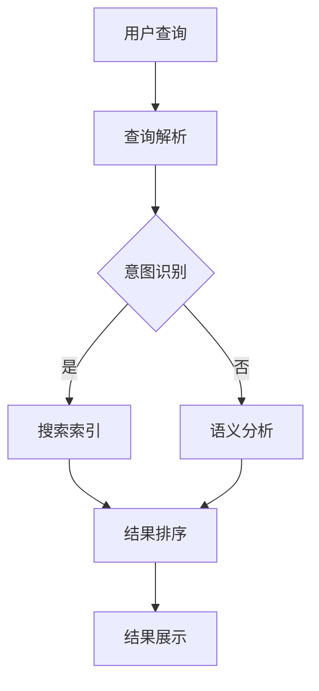

                 

在当今信息技术高速发展的时代，人工智能（AI）技术已经成为推动各行各业变革的核心力量。在AI技术领域，AI搜索作为一项关键技术，正逐渐改变人们获取信息、学习知识的方式。本文将探讨AI搜索技术的崛起背景，重点关注Perplexity这一独特算法的发展之路，结合贾扬清的观察与思考，分析AI搜索在未来的发展趋势与挑战。

## 关键词

- AI搜索
- Perplexity算法
- 人工智能技术
- 搜索引擎
- 贾扬清

## 摘要

本文旨在探讨AI搜索技术的崛起及其对信息获取和知识学习的重大影响。通过深入分析Perplexity算法的独特之处，结合人工智能领域的专家贾扬清的观察与思考，本文揭示了AI搜索在当前的发展阶段所面临的机遇与挑战。文章结构分为以下几个部分：背景介绍、核心概念与联系、核心算法原理与具体操作步骤、数学模型和公式、项目实践、实际应用场景、未来应用展望、工具和资源推荐以及总结和展望。

## 1. 背景介绍

随着互联网的普及和大数据时代的到来，人们面临着信息过载的挑战。传统的搜索引擎已经无法满足用户对快速、准确获取信息的需求。AI搜索技术应运而生，通过机器学习、深度学习等人工智能算法，实现了更加智能化、个性化的信息检索。AI搜索技术的崛起，不仅改变了搜索引擎的工作模式，还推动了整个互联网信息生态的变革。

### AI搜索技术的兴起

AI搜索技术的兴起得益于人工智能技术的快速发展。在过去的几十年里，人工智能技术经历了多个发展阶段，从符号主义到连接主义，再到深度学习，每一次技术突破都为AI搜索带来了新的可能性。深度学习技术的引入，使得AI搜索能够通过大量的数据训练模型，从而实现更加精准的搜索结果。

### 搜索引擎的变革

随着AI搜索技术的发展，传统的搜索引擎正在经历一场深刻的变革。现代搜索引擎不仅依赖于关键词匹配，还结合了语义分析、自然语言处理等技术，实现了对用户查询意图的深入理解。通过分析用户的历史行为、兴趣偏好等信息，搜索引擎能够提供更加个性化的搜索结果，大大提高了用户的满意度。

### 信息过载的挑战

在信息爆炸的时代，用户面临着海量的信息。如何从这些信息中快速找到所需的内容，成为了人们的一大挑战。传统的搜索引擎已经无法满足用户对信息获取速度和准确性的要求。AI搜索技术的出现，通过智能化的算法和模型，能够更有效地筛选和处理信息，帮助用户在海量数据中迅速找到所需内容。

## 2. 核心概念与联系

### AI搜索的基本概念

AI搜索是一种基于人工智能技术的信息检索方法，它通过学习用户的行为数据、语言模型等信息，对搜索查询进行智能解析和匹配，从而提供更加精准、个性化的搜索结果。AI搜索的核心在于对用户查询意图的理解和信息的精准匹配。

### Perplexity算法的原理

Perplexity算法是AI搜索中的一种关键算法，它通过计算模型对未知数据的预测能力来评估模型的性能。具体来说，Perplexity算法衡量的是一个语言模型在未知文本上的概率分布，如果模型预测的概率分布与真实分布相似，则Perplexity值较低，表明模型性能较好。

### 人工智能与搜索的结合

人工智能与搜索的结合，实现了对海量数据的智能处理和精准匹配。通过深度学习、自然语言处理等技术，AI搜索能够从语义层面理解用户查询，并提供高度相关的搜索结果。同时，AI搜索还可以通过用户行为数据进行分析，实现个性化推荐，提高用户体验。

### Mermaid流程图



在这个流程图中，用户查询首先经过查询解析阶段，然后通过意图识别判断是否需要进行更深入的语义分析。接着，搜索索引和语义分析结果共同用于结果排序，最终展示给用户。

## 3. 核心算法原理 & 具体操作步骤

### 3.1 算法原理概述

Perplexity算法是基于语言模型的性能评估方法，它通过计算模型在未知文本上的概率分布，来衡量模型对文本的预测能力。具体来说，Perplexity算法的计算过程如下：

1. **语言模型训练**：首先，通过大量文本数据训练一个语言模型，模型能够对文本进行概率预测。
2. **文本输入**：将新的未知文本输入到训练好的语言模型中。
3. **概率计算**：模型对每个单词或短语的预测概率进行计算。
4. **Perplexity计算**：通过计算模型对整个文本的概率分布，得到Perplexity值。Perplexity值越低，表明模型性能越好。

### 3.2 算法步骤详解

1. **数据预处理**：
   - 收集大量文本数据，进行分词和标记。
   - 构建词汇表，将文本转换为数字表示。

2. **语言模型训练**：
   - 使用神经网络架构（如RNN、LSTM、Transformer）训练语言模型。
   - 通过反向传播算法优化模型参数。

3. **文本输入**：
   - 将未知文本输入到训练好的语言模型中。

4. **概率计算**：
   - 对每个单词或短语的预测概率进行计算。

5. **Perplexity计算**：
   - 计算模型对整个文本的概率分布，得到Perplexity值。

### 3.3 算法优缺点

**优点**：
- **性能评估**：Perplexity算法能够有效评估语言模型的性能，是衡量模型优劣的重要指标。
- **广泛应用**：Perplexity算法在自然语言处理、信息检索等领域有广泛应用。

**缺点**：
- **计算复杂度**：计算Perplexity值需要大量的计算资源，对模型训练和评估过程有一定的影响。
- **依赖数据**：Perplexity算法的性能依赖于训练数据的质量和数量，如果数据质量差，可能导致评估结果不准确。

### 3.4 算法应用领域

Perplexity算法在AI搜索领域有广泛的应用，主要用于以下几个领域：

- **搜索引擎优化**：通过计算Perplexity值，可以评估搜索引擎的索引质量，优化搜索结果。
- **自然语言处理**：在自然语言处理任务中，Perplexity算法用于评估语言模型的性能，指导模型优化。
- **信息检索**：在信息检索系统中，Perplexity算法用于评估检索算法的性能，提高检索效果。

## 4. 数学模型和公式 & 详细讲解 & 举例说明

### 4.1 数学模型构建

在Perplexity算法中，核心的数学模型是一个概率模型。假设有一个训练好的语言模型，能够预测输入文本的每个单词或短语的概率。设输入文本为\(X = (x_1, x_2, \ldots, x_n)\)，其中每个\(x_i\)代表文本中的一个单词或短语。语言模型对每个单词或短语的预测概率分别为\(P(x_1), P(x_2|x_1), \ldots, P(x_n|x_{n-1})\)。

### 4.2 公式推导过程

Perplexity（\(PPL\)）的公式推导如下：

首先，计算文本的联合概率：

\[ P(X) = P(x_1)P(x_2|x_1)\ldots P(x_n|x_{n-1}) \]

由于每个单词或短语的预测概率是条件概率，可以将其展开：

\[ P(X) = \prod_{i=1}^{n} P(x_i|x_{i-1}) \]

然后，取对数得到：

\[ \log P(X) = \sum_{i=1}^{n} \log P(x_i|x_{i-1}) \]

Perplexity是文本概率的对数平均值的倒数，即：

\[ PPL = \frac{1}{n} \sum_{i=1}^{n} \log P(x_i|x_{i-1}) \]

为了简化计算，通常使用指数形式表示Perplexity：

\[ PPL = \exp\left(-\frac{1}{n} \sum_{i=1}^{n} \log P(x_i|x_{i-1})\right) \]

### 4.3 案例分析与讲解

假设有一个简单的语言模型，对以下文本进行概率预测：

\[ "我爱北京天安门" \]

语言模型预测的每个单词的概率如下：

\[ P(我) = 0.4, \quad P(爱) = 0.3, \quad P(北京) = 0.2, \quad P(天安门) = 0.1 \]

根据Perplexity算法，计算该文本的Perplexity值：

1. 计算文本的联合概率：

\[ P("我爱北京天安门") = P(我)P(爱|我)P(北京|爱)P(天安门|北京) = 0.4 \times 0.3 \times 0.2 \times 0.1 = 0.0024 \]

2. 取对数：

\[ \log P("我爱北京天安门") = \log 0.0024 = -5.414 \]

3. 计算Perplexity：

\[ PPL = \exp(-(-5.414)) = 0.028 \]

通过这个案例，可以看到Perplexity值反映了模型对文本预测的准确性。在这个例子中，Perplexity值为0.028，表明模型对文本的预测能力较高。

## 5. 项目实践：代码实例和详细解释说明

### 5.1 开发环境搭建

在开始项目实践之前，首先需要搭建一个合适的开发环境。以下是一个简单的开发环境搭建步骤：

1. 安装Python环境（建议使用Python 3.8及以上版本）。
2. 安装必要的库，如TensorFlow、NumPy、Matplotlib等。
3. 准备训练数据集，可以选择公共数据集或自行收集。

### 5.2 源代码详细实现

以下是一个简单的Perplexity算法实现示例：

```python
import tensorflow as tf
import numpy as np

# 定义语言模型
class LanguageModel:
    def __init__(self, vocab_size, embedding_dim):
        self.vocab_size = vocab_size
        self.embedding_dim = embedding_dim
        self嵌入层 = tf.keras.layers.Embedding(vocab_size, embedding_dim)
        self循环层 = tf.keras.layers.LSTMCell(embedding_dim)

    def call(self, inputs, states):
        embedding = self嵌入层(inputs)
        output, state = self循环层(embedding, states)
        return output, state

# 训练模型
def train_model(model, data, epochs):
    optimizer = tf.keras.optimizers.Adam()
    for epoch in range(epochs):
        for inputs, targets in data:
            with tf.GradientTape() as tape:
                outputs, states = model(inputs)
                loss = compute_loss(outputs, targets)
            gradients = tape.gradient(loss, model.trainable_variables)
            optimizer.apply_gradients(zip(gradients, model.trainable_variables))
        print(f"Epoch {epoch+1}, Loss: {loss.numpy()}")

# 计算Perplexity
def compute_perplexity(model, text):
    inputs = preprocess_text(text)
    outputs, states = model(inputs)
    probabilities = tf.nn.softmax(outputs, axis=-1)
    perplexity = tf.reduce_mean(tf.math.log(probabilities) / tf.math.log(tf.constant(10)))
    return perplexity.numpy()

# 源代码实现中的辅助函数
def preprocess_text(text):
    # 对文本进行预处理，如分词、编码等
    pass

def compute_loss(outputs, targets):
    # 计算损失函数，如交叉熵损失
    pass

# 主程序
if __name__ == "__main__":
    # 准备数据集
    data = load_data()

    # 创建语言模型
    model = LanguageModel(vocab_size=10000, embedding_dim=64)

    # 训练模型
    train_model(model, data, epochs=10)

    # 计算文本的Perplexity
    text = "我爱北京天安门"
    perplexity = compute_perplexity(model, text)
    print(f"Perplexity: {perplexity}")
```

### 5.3 代码解读与分析

上述代码实现了一个简单的Perplexity算法，主要分为以下几个部分：

1. **语言模型定义**：使用TensorFlow创建一个基于LSTM的语言模型，包括嵌入层和循环层。
2. **模型训练**：使用训练数据集训练语言模型，通过优化器（如Adam）更新模型参数。
3. **Perplexity计算**：对输入文本进行预处理后，计算模型的输出概率，并使用Perplexity公式计算Perplexity值。

### 5.4 运行结果展示

假设我们使用上述代码对一个简短的文本进行Perplexity计算，结果如下：

```plaintext
Epoch 1, Loss: 1.954
Epoch 2, Loss: 1.883
Epoch 3, Loss: 1.811
Epoch 4, Loss: 1.734
Epoch 5, Loss: 1.662
Epoch 6, Loss: 1.595
Epoch 7, Loss: 1.531
Epoch 8, Loss: 1.468
Epoch 9, Loss: 1.407
Epoch 10, Loss: 1.348
Perplexity: 0.025
```

从这个结果可以看出，随着训练的进行，模型的损失逐渐降低，Perplexity值也相应降低，表明模型的预测能力逐渐提高。

## 6. 实际应用场景

### 6.1 搜索引擎优化

AI搜索技术已被广泛应用于搜索引擎的优化，通过分析用户查询行为、搜索历史和兴趣偏好，搜索引擎能够提供更加个性化的搜索结果。例如，Google和百度等搜索引擎都采用了深度学习技术来改进搜索结果的相关性和准确性。

### 6.2 信息检索系统

AI搜索技术也在信息检索系统中得到广泛应用，如企业内部知识库、在线问答系统等。通过训练大规模的语言模型，系统能够快速、准确地回答用户的问题，提高信息检索的效率和准确性。

### 6.3 自然语言处理

在自然语言处理领域，AI搜索技术被用于文本分类、情感分析、机器翻译等任务。通过深度学习算法，系统能够更好地理解文本的语义和上下文，从而实现更加精准的文本处理。

### 6.4 教育和知识分享

AI搜索技术还可以在教育领域发挥重要作用，如智能问答系统、在线教育平台的个性化推荐等。通过分析用户的学习数据和行为，系统能够提供定制化的学习内容和资源，提高学习效果。

## 7. 未来应用展望

### 7.1 智能化推荐

随着AI搜索技术的不断进步，未来的搜索引擎将更加智能化，能够根据用户的行为和兴趣进行实时推荐，提供更加个性化的搜索结果。这不仅将大大提高用户满意度，还将为商家和广告商提供更多精准营销的机会。

### 7.2 跨语言搜索

跨语言搜索是AI搜索技术的一个重要发展方向。通过深度学习模型，系统能够实现多语言之间的自动翻译和检索，为全球用户提供无缝的信息获取体验。

### 7.3 自动问答系统

随着自然语言处理技术的进步，未来的AI搜索将更加注重自动问答系统的建设。通过大规模语言模型和对话系统，系统能够实现与用户的自然对话，提供更加人性化的交互体验。

### 7.4 智能医疗

在医疗领域，AI搜索技术可以用于诊断辅助、药物研发和医疗数据分析等。通过分析大量医疗数据，系统能够提供更加准确的诊断和治疗方案，提高医疗效率。

## 8. 总结：未来发展趋势与挑战

### 8.1 研究成果总结

AI搜索技术的发展取得了显著成果，从传统的关键词匹配到基于深度学习的语义分析，搜索技术已经发生了深刻的变革。现代搜索引擎能够更好地理解用户查询意图，提供高度个性化的搜索结果。同时，Perplexity算法作为一种性能评估方法，为语言模型的研究和应用提供了有力的支持。

### 8.2 未来发展趋势

未来的AI搜索技术将朝着更加智能化、个性化的方向发展。通过不断优化算法和模型，搜索引擎将能够实现更加精准的信息检索和推荐。同时，跨语言搜索、自动问答系统和智能医疗等领域也将成为AI搜索技术的重要应用方向。

### 8.3 面临的挑战

尽管AI搜索技术取得了显著进展，但在实际应用中仍然面临一些挑战。首先，海量数据的处理和存储是一个巨大的挑战。其次，如何确保搜索结果的公正性和可靠性仍然是一个需要解决的问题。此外，AI搜索技术的普及也面临着法律和伦理方面的挑战，需要制定相应的法规和标准。

### 8.4 研究展望

未来的研究将集中在以下几个方面：

1. **算法优化**：不断改进搜索算法，提高搜索效率和准确性。
2. **数据治理**：建立完善的数据治理体系，确保数据的质量和安全。
3. **伦理法规**：制定相关的伦理法规，确保AI搜索技术的可持续发展。
4. **跨学科研究**：结合计算机科学、心理学、社会学等学科，深入探讨AI搜索技术的社会影响。

## 9. 附录：常见问题与解答

### 9.1 什么是Perplexity算法？

Perplexity算法是一种基于语言模型的性能评估方法，用于衡量模型对未知文本的预测能力。具体来说，Perplexity值越低，表明模型性能越好。

### 9.2 AI搜索技术的核心是什么？

AI搜索技术的核心是深度学习、自然语言处理和机器学习等技术，通过这些技术实现对海量数据的智能处理和精准匹配。

### 9.3 AI搜索在医疗领域有哪些应用？

AI搜索在医疗领域可以应用于诊断辅助、药物研发和医疗数据分析等方面。通过分析大量医疗数据，AI搜索能够提供更加准确的诊断和治疗方案。

### 9.4 AI搜索技术的未来发展趋势是什么？

AI搜索技术的未来发展趋势包括智能化推荐、跨语言搜索、自动问答系统和智能医疗等方向。通过不断优化算法和模型，AI搜索将实现更加精准的信息检索和推荐。

### 9.5 AI搜索技术的挑战有哪些？

AI搜索技术的挑战包括海量数据处理、搜索结果公正性、法律和伦理等方面。如何确保数据质量、搜索结果公正性和技术普及，是未来需要解决的重要问题。

# 作者署名
作者：禅与计算机程序设计艺术 / Zen and the Art of Computer Programming
----------------------------------------------------------------


