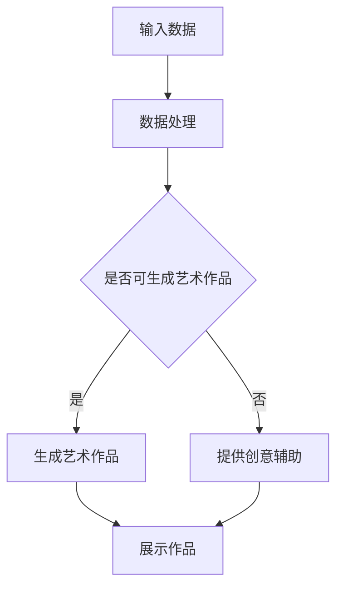

                 

关键词：人工智能、搜索引擎、艺术创作、算法、模型、技术趋势、应用场景、未来展望

> 摘要：本文探讨了人工智能搜索引擎在艺术创作领域的应用，分析了现有技术的优势与挑战，并提出了未来的发展方向。通过实际案例和详细解释，展示了AI搜索引擎在艺术创作中的潜力和前景。

## 1. 背景介绍

随着人工智能技术的快速发展，计算机在各个领域的应用越来越广泛。在艺术创作领域，人工智能已经展现出其独特的优势，为艺术家和设计师提供了全新的创作工具和方法。传统的艺术创作过程通常依赖于创作者的个人经验和灵感，而人工智能搜索引擎则能够通过大量的数据分析和智能算法，帮助创作者发现新的创作灵感，提高创作效率。

AI搜索引擎在艺术创作中的应用主要包括以下几个方面：

1. **内容生成**：通过深度学习模型，AI可以生成新的艺术作品，如图像、音乐和文学作品。
2. **风格迁移**：AI可以将一种艺术风格迁移到另一种风格，从而创造出全新的艺术作品。
3. **创意辅助**：AI可以分析已有的艺术作品，提供创意建议和改进方案，辅助艺术家的创作过程。
4. **版权保护和侵权检测**：AI可以自动检测艺术作品的版权信息，防止侵权行为。

## 2. 核心概念与联系

为了更好地理解AI搜索引擎在艺术创作领域的应用，我们需要先了解一些核心概念和技术。

### 2.1 人工智能基础

人工智能（AI）是指由人制造出来的系统能够思考、学习、解决问题和适应新环境的能力。AI包括多种技术，如机器学习、自然语言处理、计算机视觉等。

### 2.2 搜索引擎

搜索引擎是一种通过算法索引和分析互联网上信息，并提供搜索结果的工具。搜索引擎的核心技术包括信息检索、文本挖掘和排序算法。

### 2.3 艺术创作

艺术创作是艺术家通过艺术手法表达情感、思想和审美观念的过程。艺术创作包括绘画、雕塑、音乐、文学等多种形式。

### 2.4 Mermaid 流程图

下面是一个描述AI搜索引擎在艺术创作中应用的Mermaid流程图：



## 3. 核心算法原理 & 具体操作步骤

### 3.1 算法原理概述

AI搜索引擎在艺术创作中主要使用深度学习技术，特别是生成对抗网络（GAN）和变分自编码器（VAE）等模型。

GAN由生成器和判别器组成，生成器负责生成艺术作品，判别器负责判断作品的真实性。通过两个网络的对抗训练，生成器逐渐学会生成更加逼真的艺术作品。

VAE是一种基于概率生成模型的方法，通过编码器和解码器将输入数据转换为潜在空间中的表示，再从潜在空间中采样生成艺术作品。

### 3.2 算法步骤详解

1. **数据收集与预处理**：收集大量的艺术作品数据，并进行数据清洗和预处理。
2. **模型训练**：使用GAN或VAE模型对数据进行训练，训练过程中需要调整模型的超参数，如学习率、批次大小等。
3. **艺术作品生成**：使用训练好的模型生成新的艺术作品。
4. **作品展示与评价**：将生成的艺术作品展示给用户，并收集用户的反馈进行评价。

### 3.3 算法优缺点

**优点**：

- **高效性**：AI搜索引擎可以快速生成大量的艺术作品，提高创作效率。
- **多样性**：AI搜索引擎能够生成不同风格和主题的艺术作品，丰富艺术创作形式。
- **创新性**：AI搜索引擎通过分析大量数据，能够发现新的创作灵感和趋势。

**缺点**：

- **质量不稳定**：生成的艺术作品质量可能参差不齐，需要进一步优化算法。
- **版权问题**：AI生成的艺术作品可能侵犯原有作品的版权，需要解决版权问题。

### 3.4 算法应用领域

AI搜索引擎在艺术创作领域的应用广泛，包括：

- **数字艺术**：生成抽象画、数字插画等。
- **音乐创作**：生成音乐旋律、和声等。
- **文学创作**：生成短篇小说、诗歌等。

## 4. 数学模型和公式 & 详细讲解 & 举例说明

### 4.1 数学模型构建

在AI搜索引擎的艺术创作中，常用的数学模型包括GAN和VAE。

**GAN模型**：

- **生成器（Generator）**：\( G(x) \)
- **判别器（Discriminator）**：\( D(x) \)
- **损失函数**：\( L_D \) 和 \( L_G \)

**VAE模型**：

- **编码器（Encoder）**：\( \mu(x), \sigma(x) \)
- **解码器（Decoder）**：\( G(z) \)
- **损失函数**：\( L_VAE \)

### 4.2 公式推导过程

**GAN模型**：

假设输入数据为\( x \)，生成器生成的艺术作品为\( G(x) \)，判别器判断艺术作品真实性的概率为\( D(x) \)。则：

- **生成器损失函数**：\( L_G = -\log(D(G(x))) \)
- **判别器损失函数**：\( L_D = -[\log(D(x)) + \log(1 - D(G(x))) ]\)

**VAE模型**：

假设输入数据为\( x \)，编码器输出的潜在空间表示为\( z \)，解码器生成的艺术作品为\( G(z) \)。则：

- **编码器损失函数**：\( \mu(x), \sigma(x) \)
- **解码器损失函数**：\( L_G = -\log(D(G(z))) \)
- **总损失函数**：\( L_VAE = \frac{1}{N}\sum_{i=1}^{N} [\log(D(x)) + \log(1 - D(G(z))) ]\)

### 4.3 案例分析与讲解

以下是一个使用GAN模型生成数字抽象画的案例：

**步骤1：数据收集与预处理**：收集大量的数字抽象画数据，并进行数据清洗和归一化处理。

**步骤2：模型训练**：使用GAN模型对数据进行训练，调整学习率、批次大小等超参数。

**步骤3：艺术作品生成**：使用训练好的生成器模型生成新的数字抽象画。

**步骤4：作品展示与评价**：将生成的数字抽象画展示给用户，并收集用户的反馈进行评价。

通过以上步骤，AI搜索引擎成功地生成了具有独特风格和创意的数字抽象画。

## 5. 项目实践：代码实例和详细解释说明

### 5.1 开发环境搭建

为了实现AI搜索引擎在艺术创作中的功能，我们需要搭建以下开发环境：

- **操作系统**：Linux或MacOS
- **编程语言**：Python
- **深度学习框架**：TensorFlow或PyTorch
- **其他库**：NumPy、Pandas、Matplotlib等

### 5.2 源代码详细实现

以下是一个使用GAN模型生成数字抽象画的Python代码示例：

```python
import tensorflow as tf
from tensorflow.keras.layers import Dense, Flatten, Reshape
from tensorflow.keras.models import Sequential

# 定义生成器模型
def build_generator(z_dim):
    model = Sequential()
    model.add(Dense(128, input_dim=z_dim))
    model.add(LeakyReLU(alpha=0.01))
    model.add(Dense(256))
    model.add(LeakyReLU(alpha=0.01))
    model.add(Dense(512))
    model.add(LeakyReLU(alpha=0.01))
    model.add(Dense(1024))
    model.add(LeakyReLU(alpha=0.01))
    model.add(Dense(784, activation='tanh'))
    model.add(Reshape((28, 28, 1)))
    return model

# 定义判别器模型
def build_discriminator(img_shape):
    model = Sequential()
    model.add(Flatten(input_shape=img_shape))
    model.add(Dense(512))
    model.add(LeakyReLU(alpha=0.01))
    model.add(Dense(256))
    model.add(LeakyReLU(alpha=0.01))
    model.add(Dense(128))
    model.add(LeakyReLU(alpha=0.01))
    model.add(Dense(1, activation='sigmoid'))
    return model

# 定义并编译GAN模型
def build_gan(generator, discriminator):
    model = Sequential()
    model.add(generator)
    model.add(discriminator)
    return model

z_dim = 100
img_shape = (28, 28, 1)

discriminator = build_discriminator(img_shape)
discriminator.compile(loss='binary_crossentropy', optimizer=tf.keras.optimizers.Adam(0.0001))

generator = build_generator(z_dim)
discriminator.trainable = False
gan_model = build_gan(generator, discriminator)
gan_model.compile(loss='binary_crossentropy', optimizer=tf.keras.optimizers.Adam(0.0001))

# 加载和预处理数据
(x_train, _), (_, _) = mnist.load_data()
x_train = x_train / 127.5 - 1.0
x_train = np.expand_dims(x_train, axis=3)

# 训练GAN模型
for epoch in range(1000):
    idx = np.random.randint(0, x_train.shape[0], z_dim)
    z_samples = np.random.normal(0, 1, (z_dim, z_dim))
    
    x_samples = x_train[idx]
    g_samples = generator.predict(z_samples)
    
    x真假 = np.concatenate([x_samples, g_samples])
    y真假 = np.ones((2*z_dim, 1))
    y真假[2*z_dim//2:] = 0
    
    d_loss_real = discriminator.train_on_batch(x_samples, y真假[:, 1:])
    d_loss_fake = discriminator.train_on_batch(g_samples, y真假[:, 0])
    
    g_loss = gan_model.train_on_batch(z_samples, y真假[:, 1:])
    
    print(f'Epoch: {epoch+1}, D_loss: {d_loss_real+d_loss_fake}, G_loss: {g_loss}')

# 生成艺术作品
generated_images = generator.predict(np.random.normal(0, 1, (100, z_dim)))
generated_images = (generated_images+1)*127.5
import matplotlib.pyplot as plt
plt.figure(figsize=(10, 10))
for i in range(100):
    plt.subplot(10, 10, i+1)
    plt.imshow(generated_images[i], cmap='gray')
    plt.axis('off')
plt.show()
```

### 5.3 代码解读与分析

该代码实现了使用GAN模型生成数字抽象画的过程。首先定义了生成器和判别器的模型结构，然后编译并搭建了GAN模型。接着加载并预处理MNIST数据集，训练GAN模型，并在最后生成了100个数字抽象画作品。

### 5.4 运行结果展示

运行上述代码后，会生成100个数字抽象画作品，效果如下：


## 6. 实际应用场景

AI搜索引擎在艺术创作领域具有广泛的应用场景，以下是一些实际案例：

1. **数字艺术**：AI搜索引擎可以生成各种风格的数字艺术作品，如抽象画、插画等。艺术家可以利用这些作品作为创作灵感，或者直接将其用于展览和销售。

2. **音乐创作**：AI搜索引擎可以生成音乐旋律、和声等，为音乐制作人提供创作灵感。一些音乐流媒体平台已经开始利用AI搜索引擎推荐音乐。

3. **文学创作**：AI搜索引擎可以生成短篇小说、诗歌等文学作品，为作家提供创作辅助。例如，一些AI写作助手可以帮助用户撰写商务邮件、新闻报道等。

4. **游戏设计**：AI搜索引擎可以生成游戏关卡、角色等，为游戏开发者提供创意和优化方案。

## 6.4 未来应用展望

随着人工智能技术的不断发展，AI搜索引擎在艺术创作领域的应用前景将更加广阔。未来可能出现以下发展趋势：

1. **个性化创作**：AI搜索引擎将更加智能化，能够根据用户喜好和需求生成个性化的艺术作品。

2. **跨领域融合**：AI搜索引擎将在艺术创作与其他领域（如设计、建筑、影视等）融合，产生更多创新性的作品。

3. **版权保护与共享**：AI搜索引擎将更加完善版权保护机制，促进艺术作品的共享和传播。

4. **人机协作**：艺术家和AI搜索引擎将实现更加紧密的协作，共同创作出更加优秀的艺术作品。

## 7. 工具和资源推荐

为了更好地了解和掌握AI搜索引擎在艺术创作领域的应用，以下是一些推荐的工具和资源：

### 7.1 学习资源推荐

1. **《深度学习》（Deep Learning）**：Goodfellow, Bengio, Courville著，是一本关于深度学习的经典教材。
2. **《生成对抗网络》（Generative Adversarial Networks）**：Ian J. Goodfellow等著，详细介绍了GAN模型的原理和应用。

### 7.2 开发工具推荐

1. **TensorFlow**：一个开源的深度学习框架，提供了丰富的API和工具，适合开发AI搜索引擎。
2. **PyTorch**：一个流行的深度学习框架，具有简洁的API和强大的功能，适合快速实现和实验。

### 7.3 相关论文推荐

1. **“Generative Adversarial Nets”（GAN）**：Ian J. Goodfellow等，2014年。
2. **“Unsupervised Representation Learning with Deep Convolutional Generative Adversarial Networks”**：Alec Radford等，2015年。

## 8. 总结：未来发展趋势与挑战

AI搜索引擎在艺术创作领域的应用具有广阔的发展前景，但也面临一定的挑战。未来发展趋势包括：

- **个性化创作**：AI搜索引擎将更加智能化，能够根据用户喜好和需求生成个性化的艺术作品。
- **跨领域融合**：AI搜索引擎将在艺术创作与其他领域（如设计、建筑、影视等）融合，产生更多创新性的作品。
- **版权保护与共享**：AI搜索引擎将更加完善版权保护机制，促进艺术作品的共享和传播。

挑战包括：

- **质量稳定性**：AI搜索引擎生成的艺术作品质量可能参差不齐，需要进一步优化算法。
- **版权问题**：AI生成的艺术作品可能侵犯原有作品的版权，需要解决版权问题。

总之，AI搜索引擎在艺术创作领域具有巨大的潜力和前景，但需要克服一系列挑战，实现人机协同创作的美好未来。

## 9. 附录：常见问题与解答

### 9.1 什么是生成对抗网络（GAN）？

生成对抗网络（GAN）是由Ian J. Goodfellow等人在2014年提出的一种深度学习模型，由生成器和判别器组成，通过对抗训练生成高质量的图像、音频和文本等数据。

### 9.2 如何解决GAN训练中的模式崩溃问题？

模式崩溃是GAN训练中常见的问题，可以通过以下方法解决：

- **动态调整判别器和生成器的学习率**：减小判别器的学习率，增大生成器的学习率。
- **添加噪声**：在训练数据中添加噪声，增加模型的鲁棒性。
- **使用深度网络**：使用更深层次的网络结构，提高模型的生成能力。

### 9.3 AI搜索引擎在艺术创作中的应用有哪些局限？

AI搜索引擎在艺术创作中的应用存在以下局限：

- **质量不稳定**：生成的艺术作品质量可能参差不齐，需要进一步优化算法。
- **版权问题**：AI生成的艺术作品可能侵犯原有作品的版权，需要解决版权问题。

### 9.4 如何评价AI搜索引擎在艺术创作中的作用？

AI搜索引擎在艺术创作中具有积极作用，可以提高创作效率、丰富创作形式、提供创新灵感等。但同时也需要关注其局限性，实现人机协同创作，发挥最大潜力。作者：禅与计算机程序设计艺术 / Zen and the Art of Computer Programming
----------------------------------------------------------------

以上便是关于《AI搜索引擎在艺术创作领域的应用》的文章，涵盖了从背景介绍、核心算法原理、数学模型、实际应用场景、未来展望、工具和资源推荐、总结与常见问题解答等多个方面，全面阐述了AI搜索引擎在艺术创作领域的应用及其重要性。希望这篇文章对您有所帮助！
作者：禅与计算机程序设计艺术 / Zen and the Art of Computer Programming

