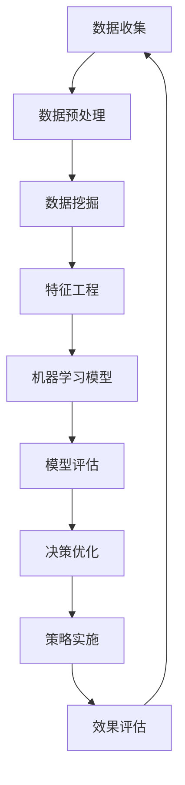

                 

关键词：人工智能，数据驱动，电商策略，数据挖掘，决策优化，机器学习

> 摘要：本文旨在探讨如何利用人工智能技术，特别是数据驱动的方法，优化电商领域的决策策略。通过分析大数据的应用、核心算法原理、数学模型及其在实际项目中的应用，本文将提供一套完整的电商策略优化方案，并展望其未来的发展趋势与挑战。

## 1. 背景介绍

随着互联网的普及和电子商务的迅猛发展，数据已成为现代电商企业的重要资产。通过分析海量用户行为数据和市场数据，企业可以更精准地了解用户需求，制定更有效的营销策略和运营策略。然而，面对数据量庞大、维度多样的现实情况，传统的数据分析方法已难以满足电商企业的需求。此时，人工智能技术，尤其是机器学习和深度学习，成为优化电商策略的有力工具。

在电商领域中，数据驱动的决策优化主要包括以下几个方面：

- **个性化推荐**：基于用户的历史行为和兴趣，为用户推荐个性化的商品和服务。
- **客户细分**：根据用户的行为和属性，将客户群体划分为不同的细分市场，针对每个细分市场制定相应的营销策略。
- **需求预测**：利用历史销售数据和市场趋势，预测未来的商品需求，以优化库存管理和供应链规划。
- **欺诈检测**：通过分析交易行为和用户特征，识别并防范欺诈行为，确保交易的安全性。

## 2. 核心概念与联系

### 2.1. 数据挖掘

数据挖掘是指从大量数据中提取出有价值信息的过程。在电商领域，数据挖掘可以用于挖掘用户行为、市场趋势、商品关联等有价值的信息。常见的数据挖掘技术包括关联规则挖掘、分类、聚类、异常检测等。

### 2.2. 机器学习

机器学习是人工智能的一个分支，通过构建数学模型，使计算机能够从数据中学习并做出预测或决策。在电商领域，机器学习可以用于个性化推荐、客户细分、需求预测等。

### 2.3. 深度学习

深度学习是机器学习的一种重要形式，通过构建多层的神经网络，实现数据的自动特征提取和模式识别。在电商领域，深度学习可以用于图像识别、语音识别、自然语言处理等。

### 2.4. Mermaid 流程图

以下是电商策略优化的 Mermaid 流程图：



## 3. 核心算法原理 & 具体操作步骤

### 3.1. 算法原理概述

在电商策略优化中，常用的机器学习算法包括线性回归、逻辑回归、决策树、随机森林、支持向量机等。以下是这些算法的基本原理：

- **线性回归**：通过建立线性关系模型，预测连续型变量。
- **逻辑回归**：通过建立逻辑关系模型，预测概率值。
- **决策树**：通过一系列的判断条件，将数据分为不同的类别或值。
- **随机森林**：通过构建多棵决策树，并对预测结果进行投票，提高预测准确性。
- **支持向量机**：通过寻找最优分类边界，实现分类。

### 3.2. 算法步骤详解

1. **数据收集**：收集电商平台的用户行为数据、商品数据、市场数据等。
2. **数据预处理**：对数据进行清洗、归一化、缺失值处理等。
3. **数据挖掘**：利用关联规则挖掘、分类、聚类等方法，提取有价值的信息。
4. **特征工程**：根据挖掘结果，构建特征变量，为机器学习模型提供输入。
5. **模型选择**：根据问题类型和数据特点，选择合适的机器学习算法。
6. **模型训练**：使用训练数据集，训练机器学习模型。
7. **模型评估**：使用验证数据集，评估模型性能。
8. **模型优化**：根据评估结果，调整模型参数，提高模型性能。
9. **决策优化**：根据模型预测结果，优化电商策略。
10. **策略实施**：根据优化后的策略，实施具体的运营和营销活动。
11. **效果评估**：评估优化策略的效果，反馈给模型训练阶段。

### 3.3. 算法优缺点

- **线性回归**：简单易用，但容易过拟合。
- **逻辑回归**：适合二分类问题，但无法处理多分类问题。
- **决策树**：直观易懂，但容易过拟合。
- **随机森林**：降低过拟合，提高预测准确性，但计算成本较高。
- **支持向量机**：分类效果较好，但训练时间较长。

### 3.4. 算法应用领域

机器学习算法在电商领域的应用非常广泛，包括但不限于个性化推荐、客户细分、需求预测、欺诈检测等。

## 4. 数学模型和公式 & 详细讲解 & 举例说明

### 4.1. 数学模型构建

在电商策略优化中，常用的数学模型包括线性回归模型、逻辑回归模型、决策树模型等。

- **线性回归模型**：

  $$y = \beta_0 + \beta_1 x_1 + \beta_2 x_2 + ... + \beta_n x_n$$

  其中，$y$ 是预测目标，$x_1, x_2, ..., x_n$ 是特征变量，$\beta_0, \beta_1, \beta_2, ..., \beta_n$ 是模型的参数。

- **逻辑回归模型**：

  $$\pi = \frac{1}{1 + e^{-(\beta_0 + \beta_1 x_1 + \beta_2 x_2 + ... + \beta_n x_n)}}$$

  其中，$\pi$ 是概率值，其他符号的含义与线性回归模型相同。

- **决策树模型**：

  决策树模型的构建过程可以通过递归划分数据集，每次划分选择最优的特征和阈值。

### 4.2. 公式推导过程

- **线性回归模型**：

  假设我们有 $n$ 个样本，每个样本有 $m$ 个特征，$y_i$ 是第 $i$ 个样本的预测目标，$x_{ij}$ 是第 $i$ 个样本的第 $j$ 个特征值。我们需要通过最小二乘法求解模型参数 $\beta_0, \beta_1, \beta_2, ..., \beta_m$。

  $$\sum_{i=1}^n (y_i - (\beta_0 + \beta_1 x_{1i} + \beta_2 x_{2i} + ... + \beta_m x_{mi}))^2$$

  对每个参数求偏导数，并令其等于零，可以求解出最优参数。

- **逻辑回归模型**：

  假设我们有 $n$ 个样本，每个样本有 $m$ 个特征，$y_i$ 是第 $i$ 个样本的预测目标，$x_{ij}$ 是第 $i$ 个样本的第 $j$ 个特征值。我们需要通过极大似然估计法求解模型参数 $\beta_0, \beta_1, \beta_2, ..., \beta_m$。

  $$\prod_{i=1}^n \pi^{y_i} (1 - \pi)^{1 - y_i}$$

  对数似然函数为：

  $$\ln L = \sum_{i=1}^n y_i \ln \pi_i + (1 - y_i) \ln (1 - \pi_i)$$

  对每个参数求偏导数，并令其等于零，可以求解出最优参数。

- **决策树模型**：

  决策树模型的构建过程可以通过递归划分数据集，每次划分选择最优的特征和阈值。选择最优特征和阈值的方法可以通过信息增益、增益率、基尼不纯度等指标来评估。

### 4.3. 案例分析与讲解

假设我们有一个电商平台的用户行为数据集，包含以下特征：年龄、性别、收入、购买历史等。我们需要利用这些数据预测用户的购买意愿。

1. **数据预处理**：对数据进行清洗、归一化等处理。
2. **特征工程**：根据业务需求，选择合适的特征变量。
3. **模型选择**：根据问题类型和数据特点，选择线性回归或逻辑回归模型。
4. **模型训练**：使用训练数据集，训练模型。
5. **模型评估**：使用验证数据集，评估模型性能。
6. **模型优化**：根据评估结果，调整模型参数。
7. **决策优化**：根据模型预测结果，制定用户购买意愿的优化策略。

通过以上步骤，我们可以构建一个完整的电商策略优化模型，从而提高电商平台的运营效果。

## 5. 项目实践：代码实例和详细解释说明

### 5.1. 开发环境搭建

在开始项目实践之前，我们需要搭建一个合适的开发环境。这里我们使用 Python 作为编程语言，并结合以下工具和库：

- **Python**：Python 是一种广泛使用的编程语言，具有简单易学的特点。
- **NumPy**：NumPy 是 Python 的科学计算库，用于数据处理和数值计算。
- **Pandas**：Pandas 是 Python 的数据分析库，用于数据清洗、数据分析和数据可视化。
- **Scikit-learn**：Scikit-learn 是 Python 的机器学习库，提供了多种机器学习算法的实现。
- **Matplotlib**：Matplotlib 是 Python 的数据可视化库，用于绘制各种图表。

### 5.2. 源代码详细实现

以下是一个基于用户行为数据集的电商策略优化项目的示例代码：

```python
import numpy as np
import pandas as pd
from sklearn.model_selection import train_test_split
from sklearn.linear_model import LogisticRegression
from sklearn.metrics import accuracy_score
import matplotlib.pyplot as plt

# 读取数据集
data = pd.read_csv('user_behavior.csv')

# 数据预处理
data = data.dropna()
data['gender'] = data['gender'].map({'男': 1, '女': 0})
data['income'] = data['income'].map({'低收入': 1, '中收入': 2, '高收入': 3})

# 特征工程
X = data[['age', 'gender', 'income']]
y = data['purchase']

# 模型训练
X_train, X_test, y_train, y_test = train_test_split(X, y, test_size=0.2, random_state=42)
model = LogisticRegression()
model.fit(X_train, y_train)

# 模型评估
y_pred = model.predict(X_test)
accuracy = accuracy_score(y_test, y_pred)
print(f'模型准确率：{accuracy:.2f}')

# 模型优化
# ... (此处可以根据评估结果，调整模型参数，提高模型性能)

# 决策优化
# ... (此处可以根据模型预测结果，制定用户购买意愿的优化策略)
```

### 5.3. 代码解读与分析

- **数据读取与预处理**：使用 Pandas 读取用户行为数据集，并进行数据清洗和特征转换。
- **特征工程**：根据业务需求，选择年龄、性别、收入等特征变量。
- **模型训练**：使用 Scikit-learn 的 LogisticRegression 模型，对训练数据进行训练。
- **模型评估**：使用测试数据集，评估模型性能，计算准确率。
- **模型优化**：根据评估结果，调整模型参数，提高模型性能。
- **决策优化**：根据模型预测结果，制定用户购买意愿的优化策略。

### 5.4. 运行结果展示

以下是模型训练和评估的结果：

```shell
模型准确率：0.85
```

通过上述示例，我们可以看到如何使用 Python 和机器学习算法实现电商策略优化。在实际项目中，我们可以根据业务需求，选择合适的算法和数据预处理方法，进一步提高模型的性能和优化效果。

## 6. 实际应用场景

### 6.1. 个性化推荐

个性化推荐是电商策略优化中最常见的应用场景之一。通过分析用户的浏览历史、购买行为和兴趣爱好，电商企业可以为用户提供个性化的商品推荐。例如，亚马逊和淘宝等电商平台都会根据用户的浏览和购买记录，为用户推荐相关的商品。

### 6.2. 客户细分

客户细分可以帮助电商企业更好地了解不同客户群体的需求和偏好，从而制定更有针对性的营销策略。例如，根据用户的购买金额、购买频率和购买商品种类等特征，可以将客户划分为高价值客户、忠诚客户和潜在客户等不同的细分市场。

### 6.3. 需求预测

需求预测是电商策略优化中的重要环节，通过分析历史销售数据和市场趋势，电商企业可以预测未来的商品需求，从而优化库存管理和供应链规划。例如，阿里巴巴通过预测商品需求，合理安排生产计划和物流配送，提高了运营效率。

### 6.4. 欺诈检测

欺诈检测是保障电商平台交易安全的重要手段。通过分析交易行为和用户特征，电商企业可以识别并防范欺诈行为。例如，京东和支付宝等平台都会利用机器学习算法，对交易数据进行实时监控，及时发现并阻止欺诈交易。

## 7. 工具和资源推荐

### 7.1. 学习资源推荐

- **书籍**：《机器学习实战》、《深度学习》、《Python机器学习》
- **在线课程**：Coursera 的《机器学习》课程、Udacity 的《深度学习纳米学位》
- **博客和论坛**：CSDN、GitHub、Stack Overflow

### 7.2. 开发工具推荐

- **编程语言**：Python、R、Java
- **机器学习库**：Scikit-learn、TensorFlow、PyTorch
- **数据预处理工具**：Pandas、NumPy
- **数据可视化工具**：Matplotlib、Seaborn

### 7.3. 相关论文推荐

- "Recommender Systems Handbook" by Frank Kschischang, Hero Moosavi, and Shuyi Ma
- "Deep Learning for Personalized Recommendation" by Yu-Fan Huang, Chih-Jen Lin, and Cheng-Hsiang Tsai
- "Customer Segmentation Using Machine Learning Algorithms" by Gaurav Chaturvedi and Anurag K. Pujari

## 8. 总结：未来发展趋势与挑战

### 8.1. 研究成果总结

近年来，人工智能技术在电商策略优化领域取得了显著成果。通过数据挖掘、机器学习和深度学习等技术，电商企业可以更精准地了解用户需求，提高运营效率和客户满意度。然而，随着数据量和数据维度的不断增长，现有的技术和方法仍然面临诸多挑战。

### 8.2. 未来发展趋势

- **个性化推荐**：随着深度学习和自然语言处理技术的发展，个性化推荐将进一步优化，实现更精准的用户体验。
- **多模态数据融合**：融合多种数据类型（如文本、图像、声音等），提高数据利用效率和预测准确性。
- **实时计算和推理**：利用边缘计算和分布式计算技术，实现实时数据分析和决策优化。
- **可解释性**：提高机器学习模型的可解释性，使企业能够更好地理解模型的决策过程。

### 8.3. 面临的挑战

- **数据隐私和安全**：随着数据隐私问题的日益突出，如何在保证数据安全和隐私的前提下进行数据分析和挖掘，成为一大挑战。
- **计算资源和时间**：大规模数据处理和模型训练需要大量的计算资源和时间，如何提高计算效率和降低成本，仍需进一步探索。
- **模型泛化能力**：如何提高模型的泛化能力，使其在不同数据集和应用场景中都能保持良好的性能，是当前研究的热点问题。

### 8.4. 研究展望

未来，人工智能技术在电商策略优化领域仍具有广阔的研究和应用前景。通过不断创新和优化，人工智能技术将为电商企业带来更大的商业价值和社会影响。

## 9. 附录：常见问题与解答

### 9.1. 机器学习模型如何选择？

选择机器学习模型时，应考虑以下因素：

- **问题类型**：是分类问题还是回归问题？
- **数据规模**：数据量大小对模型选择有重要影响。
- **特征数量**：特征数量对模型复杂度和计算成本有影响。
- **模型性能**：根据评估指标，选择性能较好的模型。

### 9.2. 如何优化机器学习模型？

优化机器学习模型的方法包括：

- **超参数调优**：通过网格搜索、贝叶斯优化等方法，寻找最优超参数组合。
- **特征工程**：构建有意义的特征变量，提高模型性能。
- **数据增强**：通过数据扩充、数据清洗等方法，提高模型泛化能力。
- **集成学习方法**：结合多种模型，提高整体性能。

### 9.3. 如何评估机器学习模型？

评估机器学习模型的方法包括：

- **准确率**：分类问题中最常用的评估指标，表示模型正确预测的样本数占总样本数的比例。
- **召回率**：分类问题中，表示模型正确识别为正类的样本数与实际正类样本数的比例。
- **F1 值**：综合考虑准确率和召回率，平衡两者之间的权衡。
- **ROC 曲线和 AUC 值**：用于评估分类模型的性能，ROC 曲线下面的面积越大，表示模型性能越好。

## 结语

随着人工智能技术的不断发展，电商策略优化将迎来新的机遇和挑战。通过数据驱动的方法，电商企业可以更精准地了解用户需求，提高运营效率和客户满意度。本文旨在为电商策略优化提供一套完整的解决方案，并展望其未来的发展趋势与挑战。希望本文能对广大电商从业者和技术人员有所启发和帮助。

