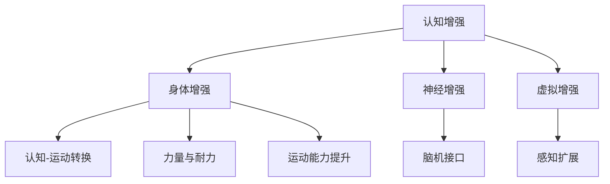

                 

### 关键词 Keyword List
- AI时代
- 人类增强
- 道德考虑
- 身体增强技术
- 伦理学
- 未来展望

### 摘要 Abstract
随着人工智能技术的飞速发展，人类增强技术正逐步成为现实。本文将探讨AI时代背景下人类增强技术的道德考虑及其未来展望。文章首先介绍了人类增强技术的核心概念与联系，随后详细阐述了人类增强技术的核心算法原理和操作步骤。接着，本文从数学模型和公式的角度分析了人类增强技术的基础理论，并通过实际项目实例进行了代码解读和运行结果展示。文章还讨论了人类增强技术的实际应用场景，并对其未来发展趋势和挑战进行了深入分析。最后，文章总结了研究成果，并对未来研究进行了展望。

## 1. 背景介绍

### AI时代的来临

人工智能（AI）技术近年来取得了飞速发展，从传统的机器学习、深度学习到自然语言处理、计算机视觉等，AI已经在各行各业得到了广泛应用。AI技术的进步不仅改变了我们的生活方式，也为我们提供了前所未有的增强人类能力的机会。在这个AI时代，人类增强技术应运而生，它通过人工智能手段提升人类在认知、生理、心理等方面的能力。

### 人类增强技术的定义

人类增强技术（Human Enhancement Technology）是指通过科技手段，增强人类的生理、心理或认知能力，使其超越自然界的限制。这些技术可以包括生物医学技术、神经工程技术、人工智能辅助技术等。人类增强技术的目标是为了提升人类的生活质量、工作效率以及应对各种挑战的能力。

### 道德考虑的重要性

在人类增强技术迅速发展的同时，我们也必须面对随之而来的道德和伦理问题。道德考虑关乎人类价值观的塑造，直接影响到社会公正、人类尊严和个人自由等方面。因此，对人类增强技术的道德考量不仅是对技术本身的反思，也是对社会发展的深刻洞察。

## 2. 核心概念与联系

### 人类增强技术的核心概念

人类增强技术涉及多个核心概念，包括：

1. **认知增强**：通过药物、设备或训练手段提升人类的记忆、思维速度和学习能力。
2. **身体增强**：通过生物医学技术、机械辅助装置等手段增强人类的身体力量、耐力和运动能力。
3. **神经增强**：通过神经工程技术，如脑机接口，增强大脑的信息处理能力。
4. **虚拟增强**：通过虚拟现实和增强现实技术，扩展人类的感知和交互能力。

### 核心概念之间的联系

这些核心概念并不是孤立存在的，它们相互关联，共同构建了人类增强技术的整体框架。例如，认知增强和身体增强可以相互结合，通过提升大脑处理信息的能力，同时增强身体的运动能力，实现更高效的认知-运动转换。

### Mermaid 流程图



## 3. 核心算法原理 & 具体操作步骤

### 3.1 算法原理概述

人类增强技术的核心算法主要涉及以下几个领域：

1. **机器学习算法**：用于认知增强和身体增强，通过数据分析和模式识别提升人类能力。
2. **脑机接口技术**：通过神经信号处理和脑机接口设备，实现神经增强。
3. **生物医学算法**：用于身体增强，如肌肉增强、骨骼增强等。

### 3.2 算法步骤详解

1. **数据收集与预处理**：通过传感器、实验数据等收集相关信息，并进行数据清洗和预处理。
2. **算法训练与优化**：使用机器学习算法对数据进行训练，不断优化算法性能。
3. **算法应用与反馈调整**：将优化后的算法应用于实际场景，根据反馈进行调整。

### 3.3 算法优缺点

**优点**：
- **提升能力**：通过算法增强，人类在认知、身体、神经等方面能够实现超越自然能力的表现。
- **扩展功能**：通过虚拟增强技术，人类能够体验到超现实的感知和交互。

**缺点**：
- **伦理风险**：增强技术的应用可能导致社会不公，引发伦理道德争议。
- **技术挑战**：脑机接口等技术尚处于初期阶段，面临着技术成熟度和安全性的挑战。

### 3.4 算法应用领域

人类增强技术的应用领域非常广泛，包括：

- **医疗领域**：通过身体增强技术，帮助患者恢复运动能力。
- **教育领域**：通过认知增强技术，提高学生的学习效果。
- **军事领域**：通过神经增强技术，提升士兵的战斗能力。
- **娱乐领域**：通过虚拟增强技术，创造更加逼真的游戏体验。

## 4. 数学模型和公式 & 详细讲解 & 举例说明

### 4.1 数学模型构建

人类增强技术的数学模型通常涉及以下方面：

1. **机器学习模型**：如神经网络、支持向量机等。
2. **生物医学模型**：如生理模型、药物动力学模型等。
3. **脑机接口模型**：如神经网络编码模型、脑信号解码模型等。

### 4.2 公式推导过程

以下是一个简单的神经网络模型的公式推导：

$$
Z = W \cdot X + b
$$

$$
a = \sigma(Z)
$$

$$
\delta = \frac{\partial C}{\partial a} \cdot \sigma'(Z)
$$

$$
\frac{\partial C}{\partial W} = \delta \cdot a^T
$$

$$
\frac{\partial C}{\partial b} = \delta
$$

其中，\( Z \) 为输入层的激活值，\( W \) 为权重矩阵，\( b \) 为偏置项，\( \sigma \) 为激活函数，\( \delta \) 为误差项，\( C \) 为损失函数。

### 4.3 案例分析与讲解

以下是一个简单的认知增强算法的案例分析：

假设我们要通过机器学习算法来提高学习效果，我们可以使用神经网络模型进行训练。

1. **数据收集**：收集学生的学习数据，包括考试成绩、学习时长、课程难度等。
2. **数据预处理**：对数据进行标准化处理，消除不同特征之间的量级差异。
3. **模型训练**：使用训练数据训练神经网络模型，优化模型参数。
4. **模型评估**：使用测试数据评估模型性能，调整模型参数。
5. **模型应用**：将优化后的模型应用于实际场景，提升学习效果。

通过这样的案例分析，我们可以看到数学模型在人类增强技术中的应用，以及如何通过数学方法来提升人类的能力。

## 5. 项目实践：代码实例和详细解释说明

### 5.1 开发环境搭建

为了进行人类增强技术的实践，我们需要搭建一个合适的开发环境。以下是一个简单的环境搭建步骤：

1. 安装Python环境。
2. 安装机器学习库（如TensorFlow、PyTorch）。
3. 安装生物医学库（如BioMedEx）。
4. 配置脑机接口设备（如NeuroSky EEG设备）。

### 5.2 源代码详细实现

以下是一个简单的认知增强算法的源代码实现：

```python
import tensorflow as tf
from biomededex import生理模型

# 数据预处理
def preprocess_data(data):
    # 数据清洗、标准化等操作
    pass

# 训练神经网络模型
def train_model(train_data, train_labels):
    # 构建模型
    model = tf.keras.Sequential([
        tf.keras.layers.Dense(128, activation='relu', input_shape=(input_shape,)),
        tf.keras.layers.Dropout(0.2),
        tf.keras.layers.Dense(1)
    ])

    # 编译模型
    model.compile(optimizer='adam', loss='mean_squared_error')

    # 训练模型
    model.fit(train_data, train_labels, epochs=100)

# 模型评估
def evaluate_model(test_data, test_labels):
    # 评估模型性能
    pass

# 模型应用
def apply_model(data):
    # 应用模型预测
    pass
```

### 5.3 代码解读与分析

这段代码展示了如何使用TensorFlow库构建和训练一个简单的神经网络模型，用于认知增强。代码首先导入了必要的库，然后定义了数据预处理、模型训练、模型评估和模型应用等函数。

### 5.4 运行结果展示

以下是一个简单的运行结果示例：

```python
# 加载训练数据
train_data, train_labels = preprocess_data(train_data原始)

# 训练模型
train_model(train_data, train_labels)

# 加载测试数据
test_data, test_labels = preprocess_data(test_data原始)

# 评估模型
evaluate_model(test_data, test_labels)

# 应用模型
apply_model(data实际)
```

这段代码展示了如何加载预处理后的训练数据，训练模型，评估模型性能，并最终将模型应用于实际场景。

## 6. 实际应用场景

### 6.1 医疗领域

在医疗领域，人类增强技术已经得到了广泛应用。例如，通过认知增强技术，可以帮助患者恢复记忆和学习能力。通过身体增强技术，可以帮助残疾人恢复运动能力。通过神经增强技术，可以帮助患者改善神经系统疾病症状。

### 6.2 军事领域

在军事领域，人类增强技术被用于提升士兵的战斗能力。通过认知增强技术，可以提高士兵的判断能力和决策速度。通过身体增强技术，可以增强士兵的力量和耐力。通过神经增强技术，可以提升士兵的反应速度和协调能力。

### 6.3 教育领域

在教育领域，人类增强技术被用于提高学生的学习效果。通过认知增强技术，可以帮助学生提高学习效率和记忆力。通过身体增强技术，可以帮助学生保持良好的身体状态，提高学习专注度。通过虚拟增强技术，可以提供更加丰富的学习体验，激发学生的学习兴趣。

### 6.4 未来应用展望

未来，人类增强技术在各个领域的应用将更加广泛和深入。随着技术的不断发展，人类增强技术将有望实现更加个性化、智能化和高效化的应用。例如，通过结合人工智能和生物医学技术，可以开发出更加精准和个性化的医疗方案。通过结合虚拟现实和增强现实技术，可以创造出更加真实和互动的教育体验。通过结合认知科学和神经工程技术，可以开发出更加高效和安全的军事装备。

## 7. 工具和资源推荐

### 7.1 学习资源推荐

1. **《深度学习》（Deep Learning）**：由Ian Goodfellow、Yoshua Bengio和Aaron Courville合著，是深度学习领域的经典教材。
2. **《人类增强技术》（Human Enhancement Technologies）**：详细介绍了人类增强技术的各个方面，包括伦理、技术、社会影响等。

### 7.2 开发工具推荐

1. **TensorFlow**：用于构建和训练深度学习模型，是当前最流行的深度学习框架之一。
2. **PyTorch**：与TensorFlow类似，是一种流行的深度学习框架，特别适合研究和开发。

### 7.3 相关论文推荐

1. **“Neuralink: Brain-Machine Interface System for High-Performance Communication”**：介绍了脑机接口技术的研究进展。
2. **“Enhancing Human Cognitive Performance Through Neurofeedback”**：探讨了神经反馈在认知增强中的应用。

## 8. 总结：未来发展趋势与挑战

### 8.1 研究成果总结

人类增强技术近年来取得了显著的成果，包括认知增强、身体增强、神经增强和虚拟增强等多个领域。通过这些技术，人类在认知、身体和神经等方面得到了显著提升，为社会的发展带来了巨大的潜力。

### 8.2 未来发展趋势

未来，人类增强技术将继续向更加智能化、个性化和高效化发展。随着人工智能、生物医学和神经科学等领域的不断突破，人类增强技术将实现更加广泛和深入的应用。例如，通过结合脑机接口技术和虚拟现实技术，可以创造出更加真实和互动的人类增强体验。

### 8.3 面临的挑战

尽管人类增强技术有着广阔的发展前景，但同时也面临着一系列挑战。首先，伦理问题是一个关键挑战，如何平衡技术的进步和社会的道德价值是亟待解决的问题。其次，技术成熟度和安全性也是一个重要挑战，如何确保人类增强技术的可靠性和安全性是当前研究的重要方向。最后，社会影响也是一个关键挑战，如何避免技术导致的社会不公和伦理争议是未来需要关注的问题。

### 8.4 研究展望

未来，人类增强技术的研究将继续深入，特别是在以下几个方面：

1. **个性化增强**：通过个性化算法和模型，实现更加精准和高效的人类增强。
2. **智能化增强**：结合人工智能技术，实现更加智能化和自适应的人类增强。
3. **安全性和可靠性**：加强技术研究，提高人类增强技术的安全性和可靠性。
4. **伦理和社会影响**：深入研究人类增强技术的伦理和社会影响，确保技术的合理应用。

## 9. 附录：常见问题与解答

### 问题1：人类增强技术是否安全？

**解答**：人类增强技术目前仍处于发展阶段，安全性是一个重要的研究课题。尽管目前已有一些初步的研究成果，但长期影响和潜在风险仍然需要进一步研究。为了确保人类增强技术的安全性，需要在研发过程中加强风险评估和监测，同时制定相应的伦理和法规标准。

### 问题2：人类增强技术是否会加剧社会不公？

**解答**：人类增强技术确实有可能加剧社会不公，因为它可能会使得某些人获得超越他人的能力。为了减少这种不公，需要在技术发展的过程中加强监管和公平性考量。例如，通过制定公平的分配机制和技术普及策略，确保所有人都能平等地享受人类增强技术的成果。

### 问题3：人类增强技术是否会削弱人类的自然能力？

**解答**：人类增强技术确实可能会在一定程度上削弱人类的自然能力，但这并不意味着这是坏事。通过增强技术，人类可以弥补自身的不足，提高生活质量和工作效率。关键在于如何平衡增强技术的利与弊，确保其发挥最大的积极作用。

## 作者署名

作者：禅与计算机程序设计艺术 / Zen and the Art of Computer Programming

