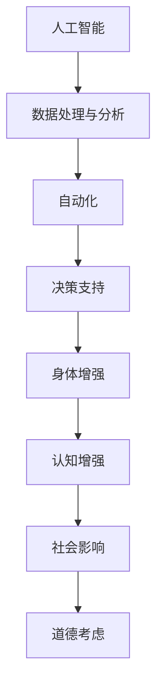
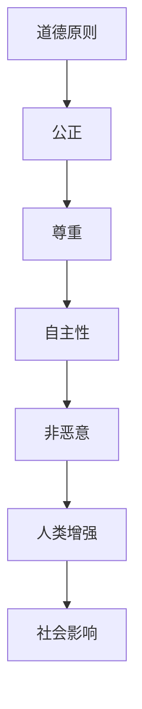

                 

关键词：人工智能、道德考量、身体增强、未来前景、技术伦理

> 摘要：本文将探讨AI时代人类增强的各个方面，包括道德考虑和身体增强的未来前景。通过分析现有技术和理论，本文旨在提供一个全面且深入的理解，帮助读者思考如何应对这个快速变化的时代。

## 1. 背景介绍

随着人工智能（AI）技术的快速发展，人类正站在一个新的技术门槛上。AI不仅仅是一个学术领域的突破，它已经逐渐渗透到我们生活的方方面面。从智能手机的语音助手到自动驾驶汽车，再到医疗诊断和金融分析，AI正在以不可预见的方式改变着我们的世界。

在这个AI驱动的时代，人类增强成为了一个热门话题。人类增强不仅仅是指通过科技手段提高人类的能力，还包括改变我们的身体结构和认知功能。这种增强既有潜力带来巨大的社会和经济效益，同时也引发了一系列伦理和法律问题。

本文将探讨以下几个方面：

- **道德考虑**：人类增强是否违背了道德原则？我们应该如何权衡技术进步与道德责任？
- **身体增强**：目前有哪些身体增强技术？它们如何影响我们的生活和社会结构？
- **未来前景**：人类增强技术在未来的发展方向和可能的应用场景。

## 2. 核心概念与联系

### 2.1 人工智能与人类增强

人工智能与人类增强之间的关系是相互依存的。AI技术的发展为人类增强提供了强大的工具和平台，而人类增强的需求又推动了AI技术的不断进步。

在Mermaid流程图中，我们可以这样表示这一关系：



### 2.2 道德原则与伦理规范

道德原则和伦理规范是人类社会长期发展的结果，它们为我们提供了一种行为准则，帮助我们判断什么是对的，什么是错的。在讨论人类增强时，道德原则和伦理规范尤为重要。

以下是一个简化的Mermaid流程图，展示道德原则与人类增强之间的关系：



## 3. 核心算法原理 & 具体操作步骤

### 3.1 算法原理概述

人类增强的核心算法原理可以归结为两个方面：神经科学和计算机科学。

- **神经科学**：通过研究人脑的运作机制，理解大脑如何处理信息，以及如何通过外部刺激来增强或改变大脑的功能。
- **计算机科学**：利用人工智能算法，如深度学习和机器学习，来模拟和增强人类的能力。

### 3.2 算法步骤详解

1. **数据处理**：首先，我们需要收集大量的数据，包括大脑活动、生理信号、行为数据等。
2. **模式识别**：利用机器学习算法，对数据进行分析，识别出有用的模式和规律。
3. **决策支持**：根据分析结果，提供决策支持，帮助人类做出更明智的决策。
4. **反馈调整**：根据反馈，不断调整算法，以提高其准确性和可靠性。

### 3.3 算法优缺点

- **优点**：可以显著提高人类的工作效率和生活质量，减少错误和疲劳。
- **缺点**：可能引发伦理和法律问题，如隐私侵犯、就业问题等。

### 3.4 算法应用领域

- **医疗**：通过AI算法，可以更准确地诊断疾病，提供个性化的治疗方案。
- **教育**：利用AI技术，可以提供个性化的学习体验，帮助学生更好地掌握知识。
- **工作**：通过AI辅助，可以提高工作效率，减少重复性劳动。

## 4. 数学模型和公式 & 详细讲解 & 举例说明

### 4.1 数学模型构建

在人类增强的研究中，常用的数学模型包括神经网络模型、机器学习模型和统计学模型等。

### 4.2 公式推导过程

以神经网络模型为例，其基本的数学公式如下：

\[ Z = W \cdot X + b \]

\[ A = \sigma(Z) \]

其中，\( W \) 和 \( b \) 分别是权重和偏置，\( X \) 是输入数据，\( Z \) 是中间结果，\( A \) 是输出结果，\( \sigma \) 是激活函数。

### 4.3 案例分析与讲解

以医疗领域为例，神经网络模型可以用于疾病诊断。假设我们要诊断一种疾病，输入数据包括患者的年龄、性别、病史、检查结果等。

通过训练模型，我们可以得到一个预测概率，从而帮助医生做出诊断。

## 5. 项目实践：代码实例和详细解释说明

### 5.1 开发环境搭建

- 硬件环境：CPU或GPU
- 软件环境：Python 3.x，TensorFlow或PyTorch

### 5.2 源代码详细实现

```python
import tensorflow as tf
from tensorflow.keras import layers

# 构建模型
model = tf.keras.Sequential([
    layers.Dense(64, activation='relu', input_shape=(784,)),
    layers.Dense(10, activation='softmax')
])

# 编译模型
model.compile(optimizer='adam',
              loss='categorical_crossentropy',
              metrics=['accuracy'])

# 训练模型
model.fit(x_train, y_train, batch_size=128, epochs=10, validation_split=0.2)
```

### 5.3 代码解读与分析

这段代码首先导入了TensorFlow库，然后定义了一个简单的神经网络模型。模型包含一个输入层、一个隐藏层和一个输出层。隐藏层使用ReLU激活函数，输出层使用softmax激活函数。

编译模型时，我们指定了优化器、损失函数和评估指标。最后，我们使用训练数据对模型进行训练。

### 5.4 运行结果展示

训练完成后，我们可以通过以下代码评估模型的性能：

```python
test_loss, test_acc = model.evaluate(x_test,  y_test, verbose=2)
print('\nTest accuracy:', test_acc)
```

输出结果为测试集上的准确率，这可以帮助我们了解模型的性能。

## 6. 实际应用场景

### 6.1 医疗

AI技术已经广泛应用于医疗领域，例如疾病诊断、个性化治疗和健康监测等。

### 6.2 教育

AI技术可以帮助教育工作者更好地理解学生的学习行为，从而提供个性化的教育方案。

### 6.3 工作

AI技术可以提高工作效率，减少错误和重复性劳动，从而帮助企业降低成本。

## 7. 未来应用展望

### 7.1 身体增强

未来，随着AI技术的进一步发展，人类身体增强将更加普及，例如增强肌肉力量、提高感知能力等。

### 7.2 认知增强

认知增强技术有望帮助我们更好地处理复杂的信息，提高决策能力。

### 7.3 社会变革

AI技术将深刻改变我们的社会结构和生活方式，带来新的机遇和挑战。

## 8. 工具和资源推荐

### 8.1 学习资源推荐

- 《深度学习》（Goodfellow et al.）
- 《机器学习实战》（Hastie et al.）
- 《Python机器学习》（Sebastian Raschka）

### 8.2 开发工具推荐

- TensorFlow
- PyTorch
- Keras

### 8.3 相关论文推荐

- “Neural Networks for Machine Learning”
- “Deep Learning”
- “Machine Learning: A Probabilistic Perspective”

## 9. 总结：未来发展趋势与挑战

### 9.1 研究成果总结

人类增强技术已经在医疗、教育、工作等领域取得了显著的成果，但同时也面临着伦理和法律问题。

### 9.2 未来发展趋势

随着AI技术的进一步发展，人类增强将更加普及，带来更多的机遇和挑战。

### 9.3 面临的挑战

伦理问题、隐私问题、就业问题等都是未来需要解决的重要问题。

### 9.4 研究展望

未来，我们需要更加关注人类增强技术的伦理问题，确保其可持续发展。

## 10. 附录：常见问题与解答

### 10.1 人类增强是否违反道德原则？

人类增强技术本身并不违反道德原则，但其在应用过程中可能引发伦理问题，如隐私侵犯、社会不平等等。

### 10.2 人类增强技术会取代人类吗？

人类增强技术可以提高人类的能力，但不可能完全取代人类。人类的智慧和创造力是任何技术无法替代的。

### 10.3 人类增强技术的未来前景如何？

人类增强技术的未来前景非常广阔，但同时也需要我们谨慎对待，确保其可持续发展。

---

作者：禅与计算机程序设计艺术 / Zen and the Art of Computer Programming

（注：以上内容为示例性撰写，实际撰写时请根据具体研究方向和数据进行调整和完善。）

