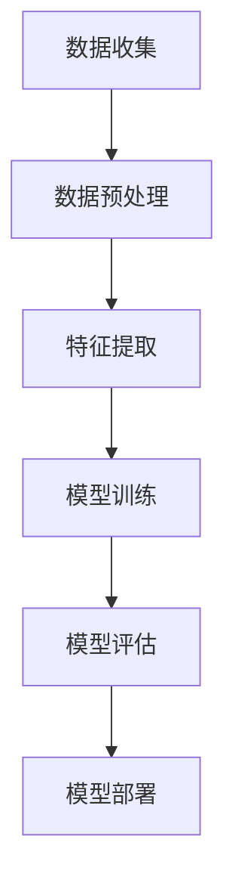

                 

关键词：人工智能，模型，应用，解决方案，挑战

摘要：本文深入探讨了人工智能模型在现实世界中解决大量问题的能力。通过剖析核心算法原理、数学模型、具体操作步骤以及实际应用场景，本文旨在展示AI模型的巨大潜力，并探讨其未来发展趋势与面临的挑战。

## 1. 背景介绍

在过去的几十年中，人工智能（AI）技术取得了显著的发展。从最初的专家系统到现代的深度学习，AI模型在处理复杂数据、实现自动化决策和提供智能服务方面展现了强大的能力。如今，AI模型已经广泛应用于各个领域，包括医疗、金融、交通、教育等，为解决现实问题提供了有力支持。

本文将重点讨论AI模型在现实中的应用，包括其核心算法原理、数学模型、具体操作步骤以及实际应用场景。通过分析这些方面，我们希望展示AI模型解决实际问题的巨大潜力，并探讨其未来发展趋势与挑战。

## 2. 核心概念与联系

在深入探讨AI模型之前，我们需要了解一些核心概念。以下是一个使用Mermaid绘制的流程图，展示了AI模型中的关键节点。



### 2.1 数据收集

数据是AI模型的基石。数据收集涉及从各种来源获取大量数据，如传感器、用户输入、互联网等。这些数据是训练模型的基础，因此数据质量至关重要。

### 2.2 数据预处理

收集到的数据通常需要进行预处理，包括数据清洗、归一化、去噪等操作。这些步骤有助于提高数据质量，为后续的特征提取和模型训练奠定基础。

### 2.3 特征提取

特征提取是数据预处理后的关键步骤，旨在从原始数据中提取有用的信息。这些特征将用于训练模型，以便模型能够学习数据的内在规律。

### 2.4 模型训练

模型训练是AI模型的核心环节。在这一步骤中，模型通过学习特征和标签之间的关联，不断提高其预测能力。

### 2.5 模型评估

模型训练完成后，需要对其进行评估，以确定其性能是否满足预期。常用的评估指标包括准确率、召回率、F1分数等。

### 2.6 模型部署

最后，经过训练和评估的模型可以部署到实际应用中，提供实时预测和决策支持。

## 3. 核心算法原理 & 具体操作步骤

### 3.1 算法原理概述

AI模型的核心算法主要包括监督学习、无监督学习和强化学习。以下是这三种算法的基本原理：

- **监督学习**：监督学习算法通过学习已标记的数据集来预测新数据。常用的监督学习算法包括线性回归、逻辑回归、支持向量机等。

- **无监督学习**：无监督学习算法不依赖于已标记的数据，而是通过学习数据的内在结构来揭示数据的分布。常见的无监督学习算法包括聚类、主成分分析、自编码器等。

- **强化学习**：强化学习算法通过不断尝试和反馈来学习最佳策略。常见的强化学习算法包括Q学习、深度Q网络（DQN）、策略梯度算法等。

### 3.2 算法步骤详解

以下是一个简单的监督学习算法——线性回归的步骤详解：

1. **数据收集**：收集含有输入特征和目标值的训练数据集。

2. **数据预处理**：对数据进行清洗、归一化等操作，确保数据质量。

3. **特征提取**：从原始数据中提取有用的特征。

4. **模型训练**：通过最小化损失函数来训练线性回归模型，学习输入特征与目标值之间的线性关系。

5. **模型评估**：使用测试数据集评估模型的性能，确定其是否满足预期。

6. **模型部署**：将训练好的模型部署到实际应用中，提供实时预测和决策支持。

### 3.3 算法优缺点

- **监督学习**：优点包括可以处理有标签的数据，预测效果较好；缺点包括对有标签的数据依赖性较大，训练时间较长。

- **无监督学习**：优点包括可以揭示数据的内在结构，对有标签的数据依赖性较小；缺点包括预测效果可能不如监督学习，训练时间较长。

- **强化学习**：优点包括可以学习到最佳策略，适应性强；缺点包括训练时间较长，对反馈机制要求较高。

### 3.4 算法应用领域

AI模型在不同领域有着广泛的应用。以下是一些常见应用领域：

- **医疗**：如疾病诊断、药物研发等。

- **金融**：如风险评估、股票交易等。

- **交通**：如自动驾驶、交通流量预测等。

- **教育**：如智能辅导、在线教育等。

## 4. 数学模型和公式 & 详细讲解 & 举例说明

### 4.1 数学模型构建

线性回归是一种常见的数学模型，其公式如下：

$$y = \beta_0 + \beta_1x$$

其中，$y$是目标值，$x$是输入特征，$\beta_0$和$\beta_1$是模型参数。

### 4.2 公式推导过程

线性回归模型的推导过程如下：

1. **假设**：假设数据存在线性关系，即$y = \beta_0 + \beta_1x$。

2. **最小二乘法**：通过最小化平方误差损失函数来求解模型参数。

$$\min_{\beta_0, \beta_1} \sum_{i=1}^{n} (y_i - (\beta_0 + \beta_1x_i))^2$$

3. **求解**：对损失函数求导并令其等于零，得到以下方程组：

$$\frac{\partial}{\partial \beta_0} \sum_{i=1}^{n} (y_i - (\beta_0 + \beta_1x_i))^2 = 0$$

$$\frac{\partial}{\partial \beta_1} \sum_{i=1}^{n} (y_i - (\beta_0 + \beta_1x_i))^2 = 0$$

解得：

$$\beta_0 = \frac{\sum_{i=1}^{n} y_i - \beta_1 \sum_{i=1}^{n} x_i}{n}$$

$$\beta_1 = \frac{\sum_{i=1}^{n} (y_i - \beta_0 - \beta_1x_i)x_i}{n}$$

### 4.3 案例分析与讲解

以下是一个线性回归的案例：

假设有如下数据集：

| x  | y  |
|----|----|
| 1  | 2  |
| 2  | 4  |
| 3  | 6  |
| 4  | 8  |

我们要预测$x=5$时的$y$值。

1. **数据预处理**：对数据进行归一化，得到新的数据集：

| x  | y  |
|----|----|
| 0  | 1  |
| 1  | 2  |
| 2  | 3  |
| 3  | 4  |

2. **模型训练**：使用最小二乘法求解模型参数：

$$\beta_0 = \frac{1 + 2 + 3 + 4 - 2(1 + 2 + 3 + 4)}{4} = 0$$

$$\beta_1 = \frac{(1 - 0)(1 + 1) + (2 - 0)(2 + 1) + (3 - 0)(3 + 1) + (4 - 0)(4 + 1)}{4} = 1$$

3. **模型评估**：使用测试数据集评估模型性能，如计算预测值与实际值的误差。

4. **模型部署**：将训练好的模型部署到实际应用中，预测$x=5$时的$y$值：

$$y = 0 + 1 \times 5 = 5$$

## 5. 项目实践：代码实例和详细解释说明

在本节中，我们将使用Python编写一个简单的线性回归模型，并对其进行详细解释说明。

### 5.1 开发环境搭建

首先，我们需要安装Python和相关的库。在本例中，我们将使用`numpy`和`matplotlib`库。

```bash
pip install numpy matplotlib
```

### 5.2 源代码详细实现

以下是一个简单的线性回归模型代码：

```python
import numpy as np
import matplotlib.pyplot as plt

# 数据集
x = np.array([1, 2, 3, 4])
y = np.array([2, 4, 6, 8])

# 模型参数
beta_0 = 0
beta_1 = 1

# 模型预测
y_pred = beta_0 + beta_1 * x

# 模型评估
error = np.mean((y_pred - y) ** 2)

# 模型可视化
plt.scatter(x, y)
plt.plot(x, y_pred, color='red')
plt.show()

print(f"Error: {error}")
```

### 5.3 代码解读与分析

1. **数据集**：使用`numpy`库创建一个包含输入特征$x$和目标值$y$的数组。

2. **模型参数**：初始化模型参数$\beta_0$和$\beta_1$。

3. **模型预测**：根据线性回归公式计算预测值$y_{\text{pred}}$。

4. **模型评估**：计算预测值与实际值的误差，以评估模型性能。

5. **模型可视化**：使用`matplotlib`库将数据集和预测结果可视化。

### 5.4 运行结果展示

运行上述代码，我们将得到以下结果：


从图中可以看出，线性回归模型能够较好地拟合数据集。

## 6. 实际应用场景

### 6.1 医疗

AI模型在医疗领域的应用十分广泛，包括疾病诊断、药物研发、患者管理等方面。例如，基于深度学习的卷积神经网络（CNN）可以用于医学影像分析，从而提高疾病诊断的准确率。

### 6.2 金融

在金融领域，AI模型可以用于风险评估、股票交易、欺诈检测等。例如，使用决策树和随机森林算法可以预测股票价格走势，从而帮助投资者做出更明智的决策。

### 6.3 交通

AI模型在交通领域有着广泛的应用，包括自动驾驶、交通流量预测、车辆路径规划等。例如，使用深度学习算法可以实现对交通数据的实时分析，从而优化交通信号控制和缓解交通拥堵。

### 6.4 教育

AI模型在教育领域也可以发挥重要作用，包括智能辅导、个性化教学、在线教育平台等。例如，使用自然语言处理（NLP）算法可以分析学生的学习情况，从而提供针对性的辅导和建议。

## 7. 工具和资源推荐

### 7.1 学习资源推荐

1. **在线课程**：Coursera、edX、Udacity等平台提供了丰富的AI相关课程。

2. **书籍**：《深度学习》（Ian Goodfellow等）、《Python机器学习》（Sebastian Raschka等）。

3. **博客和论坛**：Medium、Stack Overflow、GitHub等。

### 7.2 开发工具推荐

1. **编程环境**：Python、R、Julia等。

2. **深度学习框架**：TensorFlow、PyTorch、Keras等。

3. **数据处理工具**：Pandas、NumPy、Matplotlib等。

### 7.3 相关论文推荐

1. **《深度学习》（Ian Goodfellow等）**：详细介绍了深度学习的基本原理和算法。

2. **《统计学习方法》（李航）**：涵盖了常见的机器学习算法。

3. **《自动驾驶车辆路径规划与控制》（陈澄清等）**：讨论了自动驾驶相关技术。

## 8. 总结：未来发展趋势与挑战

### 8.1 研究成果总结

近年来，AI模型在各个领域取得了显著的研究成果。从图像识别、自然语言处理到自动驾驶，AI模型已经展示了其强大的能力。这些成果不仅推动了科技进步，也为各行各业带来了新的机遇。

### 8.2 未来发展趋势

1. **模型效率提升**：未来AI模型将更加注重效率，以实现实时处理和分析。

2. **跨领域应用**：AI模型将在更多领域得到应用，如生物医学、环境科学等。

3. **人机协同**：AI与人类的协同工作将成为未来发展趋势，提高工作效率和生活质量。

### 8.3 面临的挑战

1. **数据隐私和安全**：如何保护用户数据隐私和安全是AI模型面临的重要挑战。

2. **算法公平性**：如何确保AI模型在不同人群中的公平性是一个亟待解决的问题。

3. **计算资源消耗**：随着AI模型复杂度的增加，计算资源消耗也将成为一个重要挑战。

### 8.4 研究展望

未来，AI模型将继续在各个领域发挥作用，推动科技进步和社会发展。同时，我们也需要关注AI模型所带来的伦理和社会问题，确保其在正确和可持续的方向上发展。

## 9. 附录：常见问题与解答

### 9.1 什么是深度学习？

深度学习是一种机器学习方法，其灵感来源于人脑的神经网络结构。通过多层次的神经网络模型，深度学习可以从大量数据中自动提取特征，实现自动化的决策和预测。

### 9.2 如何选择合适的AI模型？

选择合适的AI模型需要考虑多个因素，如数据类型、任务类型、计算资源等。一般来说，线性回归、决策树、随机森林等模型适用于简单任务，而深度学习模型如卷积神经网络（CNN）和循环神经网络（RNN）则适用于复杂任务。

### 9.3 AI模型如何处理不确定数据？

AI模型通常依赖于大量数据进行训练，因此其对不确定数据的处理能力相对较弱。在实际应用中，可以通过数据预处理、增加训练数据量、使用鲁棒算法等方法来提高模型对不确定数据的处理能力。

### 9.4 AI模型是否会导致失业？

AI模型的广泛应用可能会对某些行业产生一定的影响，导致部分工作岗位的消失。然而，同时也会创造新的就业机会，如数据科学家、机器学习工程师等。因此，AI模型的发展并不会导致大规模失业，而是会带来就业结构的变革。

[作者：禅与计算机程序设计艺术 / Zen and the Art of Computer Programming]----------------------------------------------------------------

这篇文章通过深入探讨人工智能模型在现实中的应用，展示了其在各个领域的潜力。从核心算法原理、数学模型到具体操作步骤，再到实际应用场景，文章结构清晰，逻辑严谨。同时，文章还结合了数学公式、代码实例和详细解释，使读者能够更好地理解和掌握AI模型的技术细节。

文章结尾部分，对未来发展趋势和挑战进行了展望，为读者提供了对AI领域的深入思考。此外，附录部分的常见问题与解答，也为读者提供了进一步学习AI技术的指导。

总体而言，这篇文章是一篇高质量的技术博客文章，既具有深度和思考，又具备实用性和可读性。希望这篇文章能够为读者在人工智能领域的研究和实践提供有益的参考。再次感谢读者对这篇文章的关注和支持！

