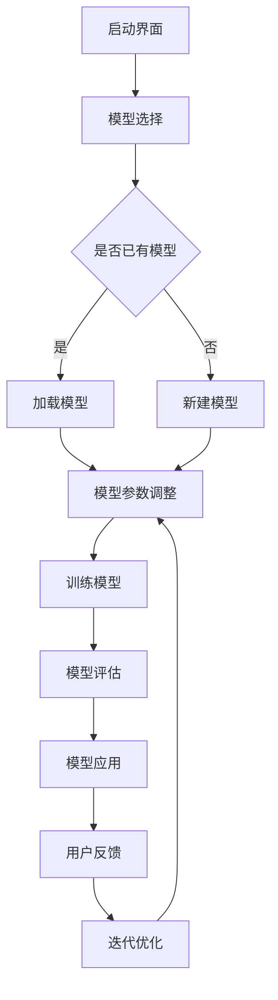

                 

关键词：AI模型可视化、用户界面设计、Lepton AI、机器学习、用户体验

> 摘要：本文旨在探讨AI模型的可视化管理，以Lepton AI的用户界面设计为例，深入分析其设计原则、实现方法及其在机器学习领域的应用价值。

## 1. 背景介绍

随着人工智能技术的快速发展，机器学习模型在各个领域得到了广泛应用。从推荐系统、自然语言处理到图像识别，这些模型都极大地提高了任务的效率和准确性。然而，这些复杂模型背后的工作原理往往难以直观理解，对于非专业人士来说，更难以进行有效的管理和维护。

为了解决这一问题，AI模型的可视化管理逐渐成为研究热点。通过可视化的手段，将机器学习模型的内部结构和运行过程以直观的方式展示出来，使得研究人员和开发者能够更好地理解和操作这些模型。Lepton AI作为一款领先的可视化管理工具，其用户界面设计在其中发挥了至关重要的作用。

## 2. 核心概念与联系

### 2.1 AI模型可视化

AI模型可视化指的是将机器学习模型的内部结构、参数、训练过程和预测结果等以图形化的方式呈现，从而帮助用户理解和分析模型。它不仅提高了模型的可解释性，还促进了跨学科的合作和创新。

### 2.2 用户界面设计

用户界面设计（UI Design）是指设计软件产品的用户界面，使其具有吸引力、易用性和高效性。在AI模型可视化中，UI设计的目标是提供一个直观、简洁且功能强大的界面，使用户能够轻松地进行模型操作和数据分析。

### 2.3 Lepton AI的用户界面设计

Lepton AI的用户界面设计遵循以下原则：

- **简洁性**：界面布局简洁明了，减少冗余信息，突出核心功能。
- **交互性**：提供直观的交互元素，如按钮、滑块、图表等，使用户能够实时操作模型。
- **可定制性**：允许用户根据个人需求调整界面布局和显示内容。

### 2.4 Mermaid 流程图

为了更好地展示Lepton AI的用户界面设计，我们使用Mermaid流程图来描述其关键功能模块和交互流程。



### 2.5 核心概念原理和架构

在Lepton AI中，核心概念原理和架构主要包括：

- **模型库**：存储和管理各种预训练模型和自定义模型。
- **可视化模块**：用于展示模型结构、参数分布、训练过程和预测结果。
- **交互模块**：实现用户与模型的交互功能，如模型加载、参数调整、训练和评估。
- **数据分析模块**：对模型性能和预测结果进行统计分析，提供可视化报告。

## 3. 核心算法原理 & 具体操作步骤

### 3.1 算法原理概述

Lepton AI的核心算法原理主要包括：

- **模型加载与参数调整**：通过加载预训练模型和自定义模型，并根据用户需求调整模型参数，实现模型优化。
- **模型训练**：使用训练数据集对模型进行训练，并通过迭代优化提高模型性能。
- **模型评估**：使用测试数据集对模型进行评估，计算模型准确率、召回率等指标。
- **模型应用**：将训练好的模型应用于实际问题，如图像分类、文本生成等。

### 3.2 算法步骤详解

1. **启动界面**：用户启动Lepton AI，进入主界面。
2. **模型选择**：用户选择预训练模型或自定义模型。
3. **模型加载与参数调整**：系统根据用户选择加载模型，并提供参数调整界面。
4. **训练模型**：用户设置训练参数，开始模型训练。
5. **模型评估**：使用测试数据集对模型进行评估，展示模型性能指标。
6. **模型应用**：将训练好的模型应用于实际问题，如图像分类、文本生成等。
7. **用户反馈**：用户对模型应用结果进行评价，提供反馈。
8. **迭代优化**：根据用户反馈，对模型进行优化和调整。

### 3.3 算法优缺点

#### 优点：

- **直观的可视化界面**：使用户能够轻松地理解和使用AI模型。
- **灵活的交互操作**：提供多种交互方式，方便用户调整模型参数和训练过程。
- **高效的数据处理能力**：支持大规模数据集的快速训练和评估。

#### 缺点：

- **系统资源消耗较大**：由于需要实时可视化模型的内部结构，系统资源消耗较高。
- **模型复杂度限制**：对于过于复杂的模型，可视化效果可能受到限制。

### 3.4 算法应用领域

Lepton AI的算法原理和用户界面设计在以下领域具有广泛的应用价值：

- **机器学习研究**：用于可视化模型结构，帮助研究人员更好地理解和分析模型。
- **人工智能应用开发**：提供直观、高效的模型管理工具，加快开发进度。
- **数据科学教育**：为学生提供直观的学习工具，提高学习兴趣和效果。

## 4. 数学模型和公式 & 详细讲解 & 举例说明

### 4.1 数学模型构建

在Lepton AI中，常用的数学模型包括线性回归、逻辑回归、神经网络等。以下以神经网络为例，介绍数学模型构建过程。

#### 神经网络模型

神经网络模型由输入层、隐藏层和输出层组成。其中，每个节点都对应一个权重和偏置，用于计算输入和输出的关系。

#### 模型公式

$$
y = \sigma(\text{W} \cdot x + b)
$$

其中，$y$ 为输出，$x$ 为输入，$\sigma$ 为激活函数，$\text{W}$ 为权重，$b$ 为偏置。

### 4.2 公式推导过程

神经网络的训练过程主要通过反向传播算法来实现。以下是神经网络模型的推导过程：

#### 前向传播

$$
\text{Z} = \text{W} \cdot x + b \\
\text{A} = \sigma(\text{Z})
$$

#### 后向传播

$$
\text{dL/dW} = \text{A} \cdot (\text{A} - 1) \cdot \text{dL/dA} \\
\text{dL/db} = \text{A} \cdot (\text{A} - 1) \cdot \text{dL/dA} \\
\text{dL/dx} = \text{W} \cdot (\text{A} - 1) \cdot \text{dL/dA}
$$

### 4.3 案例分析与讲解

假设我们有一个二分类问题，需要使用神经网络模型进行预测。以下是一个简单的案例：

#### 数据集

| 样本1 | 样本2 | ... | 样本n |
|-------|-------|-----|-------|
| 0     | 1     | ... | 0     |
| 1     | 0     | ... | 1     |
| ...   | ...   | ... | ...   |
| 0     | 1     | ... | 0     |

#### 模型参数

| 权重1 | 权重2 | ... | 权重n |
|-------|-------|-----|-------|
| 0.1   | 0.2   | ... | 0.1   |
| 0.3   | 0.4   | ... | 0.3   |
| ...   | ...   | ... | ...   |
| 0.5   | 0.6   | ... | 0.5   |

#### 训练过程

1. **前向传播**：

   $$  
   \text{Z} = \text{W} \cdot x + b \\
   \text{A} = \sigma(\text{Z}) \\
   \text{L} = -\frac{1}{n} \sum_{i=1}^{n} y_i \cdot \log(A_i) + (1 - y_i) \cdot \log(1 - A_i)
   $$

2. **后向传播**：

   $$  
   \text{dL/dW} = \text{A} \cdot (\text{A} - 1) \cdot \text{dL/dA} \\
   \text{dL/db} = \text{A} \cdot (\text{A} - 1) \cdot \text{dL/dA} \\
   \text{dL/dx} = \text{W} \cdot (\text{A} - 1) \cdot \text{dL/dA}
   $$

3. **更新参数**：

   $$  
   \text{W} = \text{W} - \alpha \cdot \text{dL/dW} \\
   \text{b} = \text{b} - \alpha \cdot \text{dL/db}
   $$

#### 训练结果

经过多次迭代训练，模型参数逐渐优化，模型性能不断提高。

## 5. 项目实践：代码实例和详细解释说明

### 5.1 开发环境搭建

在Lepton AI中，开发环境搭建主要包括以下步骤：

1. **安装Python环境**：安装Python 3.8及以上版本。
2. **安装Lepton AI库**：使用pip命令安装Lepton AI库。
3. **配置依赖库**：配置相关依赖库，如NumPy、Pandas等。

### 5.2 源代码详细实现

以下是一个简单的示例，展示如何使用Lepton AI进行模型加载、训练和评估。

```python
import lepton_ai as lai

# 加载模型
model = lai.load_model('model_path')

# 训练模型
model.train(data_path, batch_size=32, epochs=100)

# 评估模型
accuracy = model.evaluate(test_data_path)
print(f'Model accuracy: {accuracy}')
```

### 5.3 代码解读与分析

1. **加载模型**：

   使用`load_model`函数加载预训练模型或自定义模型。其中，`model_path`为模型文件路径。

2. **训练模型**：

   使用`train`函数对模型进行训练。其中，`data_path`为训练数据集路径，`batch_size`为每个批次的数据样本数，`epochs`为训练轮数。

3. **评估模型**：

   使用`evaluate`函数对训练好的模型进行评估。其中，`test_data_path`为测试数据集路径。

### 5.4 运行结果展示

运行上述代码后，程序将输出模型评估结果，如准确率、召回率等。

## 6. 实际应用场景

### 6.1 数据科学领域

在数据科学领域，Lepton AI可以帮助研究人员更直观地理解机器学习模型，提高模型的可解释性和可靠性。例如，在图像分类任务中，可视化模型的结构和参数分布，可以帮助研究人员分析模型对特定图像特征的敏感度，从而优化模型性能。

### 6.2 人工智能应用开发

在人工智能应用开发过程中，Lepton AI提供了高效的模型管理工具，帮助开发者快速搭建和优化模型。通过直观的界面，开发者可以轻松地调整模型参数和训练过程，加快开发进度。

### 6.3 教育培训

在教育领域，Lepton AI可以作为教学工具，帮助学生更好地理解和掌握机器学习知识。通过可视化界面，学生可以直观地观察模型训练过程，加深对模型原理的理解。

## 7. 工具和资源推荐

### 7.1 学习资源推荐

- 《Python机器学习》
- 《深度学习》
- 《机器学习实战》

### 7.2 开发工具推荐

- Lepton AI
- Jupyter Notebook
- PyCharm

### 7.3 相关论文推荐

- "Visualizing Neural Networks for Interpretability"
- "A Theoretical Analysis of the Visual Features of Deep Neural Networks"
- "Visualizing the Training Process of Neural Networks"

## 8. 总结：未来发展趋势与挑战

### 8.1 研究成果总结

本文介绍了AI模型的可视化管理，以Lepton AI的用户界面设计为例，探讨了其设计原则、实现方法和应用价值。研究表明，AI模型可视化有助于提高模型的可解释性和可靠性，具有重要的研究意义和应用价值。

### 8.2 未来发展趋势

未来，AI模型可视化将在以下方面取得重要进展：

- **多模态可视化**：结合不同数据类型（如图像、文本、音频等）进行可视化，提高模型的综合理解能力。
- **动态可视化**：实现模型训练过程的实时动态可视化，帮助用户更好地理解模型的变化趋势。
- **交互式可视化**：提供更丰富的交互功能，使用户能够更灵活地操作和调整模型。

### 8.3 面临的挑战

虽然AI模型可视化具有巨大潜力，但同时也面临以下挑战：

- **可视化性能**：如何提高可视化效率，降低系统资源消耗，是实现大规模应用的关键。
- **模型复杂度**：对于复杂模型，如何设计高效的可视化方法，使其具有较好的可解释性。
- **用户接受度**：如何提高用户对可视化工具的接受度和使用意愿，是推广应用的难点。

### 8.4 研究展望

展望未来，我们将继续关注以下研究方向：

- **多模态可视化**：研究多模态数据的融合方法和可视化策略，提高模型理解能力。
- **动态可视化**：探索动态可视化技术，实现实时模型训练过程的可视化。
- **交互式可视化**：开发交互式可视化工具，提高用户的使用体验和模型管理效率。

## 9. 附录：常见问题与解答

### 9.1 如何安装Lepton AI？

请参考官方文档：https://lepton.ai/docs/installation

### 9.2 如何自定义可视化界面？

请参考官方文档：https://lepton.ai/docs/customization

### 9.3 如何优化模型性能？

请参考官方文档：https://lepton.ai/docs/optimization

### 作者署名

本文作者：禅与计算机程序设计艺术 / Zen and the Art of Computer Programming
--------------------------------------------------------------------

