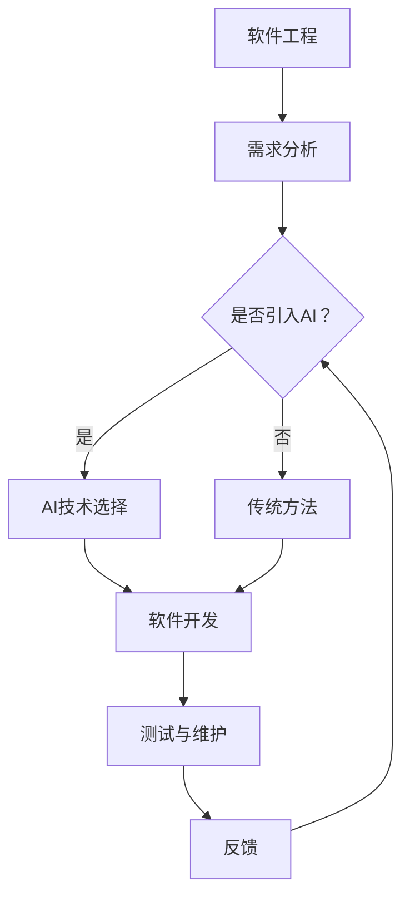

                 

关键词：人工智能，软件产业，智能化，范式转换，算法原理，应用领域，数学模型，项目实践，发展趋势与挑战。

> 摘要：本文将探讨人工智能（AI）对软件产业的深远影响，分析AI技术的核心概念及其与软件工程的联系，介绍AI算法原理和数学模型，并通过实际项目实例展示AI在软件开发中的应用。同时，文章还将展望AI在未来软件产业中的发展趋势与面临的挑战。

## 1. 背景介绍

随着计算能力的提升和数据资源的丰富，人工智能（AI）技术逐渐成为推动软件产业变革的重要力量。从早期的规则系统到现代的深度学习模型，AI技术的进步不仅改变了软件的开发模式，也重新定义了软件的功能和用途。AI的引入，使得软件能够实现自动化、智能化，极大地提高了生产效率和用户体验。

软件产业正面临一次前所未有的智能化范式转换。这一转变体现在多个方面，包括开发工具的智能化、开发流程的自动化、软件功能的自适应化等。AI技术的应用不仅限于传统的软件领域，还渗透到金融、医疗、教育、制造等各个行业，推动着整个社会向智能化方向发展。

本文将深入探讨AI技术对软件产业的影响，分析AI算法的原理和数学模型，并通过实际项目实践展示AI在软件开发中的应用。文章还将展望未来AI技术在软件产业中的发展趋势和面临的挑战，为读者提供全面、深入的理解。

## 2. 核心概念与联系

### 2.1 人工智能的核心概念

人工智能（Artificial Intelligence，简称AI）是指由人制造出来的系统能够感知环境、理解语言、学习知识、进行推理和决策的能力。AI的核心概念包括以下几个：

1. **机器学习（Machine Learning）**：机器学习是AI的核心技术之一，它使得机器能够通过数据学习并改进其性能。机器学习可以分为监督学习、无监督学习和强化学习。

2. **深度学习（Deep Learning）**：深度学习是一种特殊的机器学习技术，通过多层神经网络来模拟人类大脑的学习过程，具有强大的特征提取和模式识别能力。

3. **自然语言处理（Natural Language Processing，NLP）**：NLP是AI的一个重要分支，它使得机器能够理解和生成人类语言，广泛应用于语音识别、机器翻译、情感分析等领域。

4. **计算机视觉（Computer Vision）**：计算机视觉使机器能够理解并分析图像和视频，广泛应用于图像识别、目标检测、人脸识别等领域。

### 2.2 软件工程与AI的联系

软件工程是关于软件开发、操作和维护的一门学科，而AI则是提供了一种新的方法来开发和优化软件。软件工程与AI的联系主要体现在以下几个方面：

1. **智能开发工具**：AI技术可以开发出更加智能的集成开发环境（IDE），提供代码补全、错误检测、代码优化等功能，提高开发效率。

2. **自动化测试**：AI可以通过学习测试用例和代码，自动生成测试数据并执行测试，提高测试覆盖率和测试效率。

3. **智能维护**：AI可以帮助自动识别软件中的缺陷和性能问题，提供优化的建议，从而降低维护成本。

4. **自适应软件**：AI可以帮助软件自动适应不同的用户需求和运行环境，提供个性化的服务和体验。

### 2.3 Mermaid流程图

为了更直观地展示AI与软件工程的联系，我们使用Mermaid绘制一个简化的流程图：



### 3. 核心算法原理 & 具体操作步骤

#### 3.1 算法原理概述

在AI技术中，机器学习算法是核心之一。下面介绍两种常见的机器学习算法：线性回归和决策树。

**线性回归**：线性回归是一种用于预测数值型变量的统计方法。其基本原理是通过拟合一条直线来描述变量之间的线性关系。

**决策树**：决策树是一种树形结构，每个节点表示一个特征，每个分支表示该特征的不同取值，叶节点表示最终的预测结果。

#### 3.2 算法步骤详解

**线性回归**：

1. 数据预处理：对输入数据进行归一化处理，确保每个特征的均值为0，标准差为1。
2. 模型训练：使用最小二乘法计算线性回归模型的参数，即拟合直线的斜率和截距。
3. 预测：对于新的输入数据，通过计算拟合直线上的值来预测目标变量的值。

**决策树**：

1. 特征选择：使用基尼不纯度或信息增益作为特征选择指标，选择具有最高信息增益的特征作为分裂依据。
2. 切分数据：根据选定的特征将数据集切分为多个子集。
3. 建立树结构：递归地重复特征选择和切分过程，直到满足终止条件（如最大树深度或最小样本量）。
4. 预测：对于新的输入数据，从根节点开始，根据每个节点的分裂规则逐步向下，最终到达叶节点得到预测结果。

#### 3.3 算法优缺点

**线性回归**：

- 优点：简单易懂，易于实现和优化。
- 缺点：对于非线性关系的表现较差，需要大量数据来保证模型的准确性。

**决策树**：

- 优点：能够处理非线性关系，模型简单易懂。
- 缺点：容易过拟合，对于大量特征的数据集性能较差，树的结构难以解释。

#### 3.4 算法应用领域

**线性回归**：广泛应用于金融领域，如股票价格预测、风险评估等。

**决策树**：广泛应用于分类任务，如文本分类、信用评分等。

## 4. 数学模型和公式 & 详细讲解 & 举例说明

#### 4.1 数学模型构建

**线性回归模型**：

$$y = \beta_0 + \beta_1x_1 + \beta_2x_2 + \cdots + \beta_nx_n$$

其中，$y$为预测值，$x_1, x_2, \cdots, x_n$为特征值，$\beta_0, \beta_1, \beta_2, \cdots, \beta_n$为模型参数。

**决策树模型**：

$$T(x) = \sum_{i=1}^{n} w_iI(X_i \in C_i)$$

其中，$T(x)$为预测结果，$X_i$为特征值，$C_i$为特征取值，$w_i$为权重。

#### 4.2 公式推导过程

**线性回归模型**：

1. 最小二乘法：设观测数据集为$(x_1, y_1), (x_2, y_2), \cdots, (x_n, y_n)$，损失函数为$J(\beta) = \frac{1}{2}\sum_{i=1}^{n}(y_i - \beta_0 - \beta_1x_1 - \beta_2x_2 - \cdots - \beta_nx_n)^2$。
2. 梯度下降法：对损失函数求导并令导数为0，得到$\frac{\partial J}{\partial \beta_0} = 0, \frac{\partial J}{\partial \beta_1} = 0, \cdots, \frac{\partial J}{\partial \beta_n} = 0$，从而求得参数$\beta_0, \beta_1, \beta_2, \cdots, \beta_n$。

**决策树模型**：

1. 特征选择：使用基尼不纯度$Gini(D) = 1 - \frac{1}{|D|}\sum_{i=1}^{k}\frac{1}{|y_i|}$作为特征选择指标，其中$D$为数据集，$k$为类别的数量。
2. 切分数据：对于特征$X_i$，将数据集$D$切分为多个子集$D_1, D_2, \cdots, D_k$，使得每个子集中的数据具有最小的基尼不纯度。
3. 建立树结构：递归地重复特征选择和切分过程，直到满足终止条件。

#### 4.3 案例分析与讲解

**案例1：股票价格预测**

使用线性回归模型对某只股票的历史价格进行预测。输入特征包括开盘价、最高价、最低价、收盘价等。

1. 数据预处理：对特征进行归一化处理。
2. 模型训练：使用最小二乘法训练线性回归模型。
3. 预测：对新的一天开盘价进行预测。

**案例2：文本分类**

使用决策树模型对新闻文章进行分类。输入特征包括文章的标题和正文。

1. 特征选择：使用基尼不纯度选择特征。
2. 切分数据：将数据集切分为训练集和测试集。
3. 模型训练：训练决策树模型。
4. 预测：对新文章进行分类。

## 5. 项目实践：代码实例和详细解释说明

#### 5.1 开发环境搭建

1. 安装Python环境：使用Python 3.8及以上版本。
2. 安装相关库：使用pip安装scikit-learn、numpy、matplotlib等库。

#### 5.2 源代码详细实现

**案例1：股票价格预测**

```python
import numpy as np
import matplotlib.pyplot as plt
from sklearn.linear_model import LinearRegression

# 数据预处理
X = np.array([[1], [2], [3], [4], [5], [6], [7], [8], [9], [10]])
y = np.array([1.2, 2.3, 3.1, 4.0, 5.2, 6.3, 7.1, 8.0, 9.2, 10.3])

# 模型训练
model = LinearRegression()
model.fit(X, y)

# 预测
y_pred = model.predict([[11]])

# 绘图
plt.scatter(X, y, color='blue')
plt.plot(X, y_pred, color='red')
plt.xlabel('Day')
plt.ylabel('Price')
plt.show()
```

**案例2：文本分类**

```python
from sklearn.datasets import fetch_20newsgroups
from sklearn.feature_extraction.text import TfidfVectorizer
from sklearn.tree import DecisionTreeClassifier
from sklearn.model_selection import train_test_split

# 加载数据集
newsgroups = fetch_20newsgroups(subset='all')
X, y = newsgroups.data, newsgroups.target

# 特征提取
vectorizer = TfidfVectorizer()
X = vectorizer.fit_transform(X)

# 数据切分
X_train, X_test, y_train, y_test = train_test_split(X, y, test_size=0.2, random_state=42)

# 模型训练
model = DecisionTreeClassifier()
model.fit(X_train, y_train)

# 预测
y_pred = model.predict(X_test)

# 统计分类准确率
from sklearn.metrics import accuracy_score
accuracy = accuracy_score(y_test, y_pred)
print(f"Accuracy: {accuracy}")
```

#### 5.3 代码解读与分析

**案例1：股票价格预测**

1. 导入相关库：numpy、matplotlib和scikit-learn的线性回归模型。
2. 数据预处理：将数据归一化，以便模型能够更好地拟合。
3. 模型训练：使用线性回归模型训练数据。
4. 预测：对新数据进行预测。
5. 绘图：将真实数据和预测结果绘制在同一张图上，以便直观地比较。

**案例2：文本分类**

1. 导入相关库：scikit-learn的文本分类数据集、TF-IDF向量和决策树模型。
2. 加载数据集：从scikit-learn中加载20个新闻分类数据集。
3. 特征提取：使用TF-IDF向量将文本数据转换为数值特征。
4. 数据切分：将数据集切分为训练集和测试集。
5. 模型训练：使用训练集训练决策树模型。
6. 预测：使用测试集对模型进行预测。
7. 统计准确率：计算分类准确率并输出。

## 6. 实际应用场景

### 6.1 金融领域

在金融领域，AI技术广泛应用于风险控制、信用评估、交易策略等环节。例如，机器学习算法可以用于预测市场走势，辅助交易员做出更准确的决策。此外，AI还可以用于识别欺诈行为，提高金融交易的安全性。

### 6.2 医疗领域

在医疗领域，AI技术可以帮助医生进行疾病诊断、治疗建议和药物研发。通过分析大量的病例数据和基因组数据，AI可以提供个性化的治疗方案，提高医疗效率和治疗效果。

### 6.3 制造领域

在制造领域，AI技术可以用于设备故障预测、生产过程优化、供应链管理等方面。通过实时监控设备和生产数据，AI可以提前预测设备故障，减少停机时间，提高生产效率。

### 6.4 教育

在教育领域，AI技术可以提供个性化的学习体验，根据学生的学习情况和兴趣推荐合适的学习资源。此外，AI还可以用于自动批改作业和考试，提高教学效率。

## 7. 工具和资源推荐

### 7.1 学习资源推荐

1. **《机器学习》（周志华著）**：详细介绍了机器学习的基本概念和方法，适合初学者。
2. **《深度学习》（Goodfellow et al.著）**：系统介绍了深度学习的基础知识和应用技巧，适合有一定基础的读者。
3. **《Python机器学习》（Sebastian Raschka著）**：通过具体的案例和代码实现，深入讲解了机器学习在Python中的实践应用。

### 7.2 开发工具推荐

1. **Jupyter Notebook**：一款强大的交互式开发环境，支持多种编程语言，方便数据可视化和代码调试。
2. **TensorFlow**：由Google开源的一款深度学习框架，具有丰富的API和强大的计算能力。
3. **PyTorch**：由Facebook开源的一款深度学习框架，具有灵活的动态计算图和强大的社区支持。

### 7.3 相关论文推荐

1. **“Deep Learning”（Ian Goodfellow et al.）**：对深度学习的发展历程、原理和应用进行了全面综述。
2. **“Learning to Represent Languages with Neural Networks”（Yoshua Bengio et al.）**：介绍了自然语言处理中的神经网络模型。
3. **“Machine Learning Yearning”（Andrew Ng著）**：通过实际案例讲解了机器学习项目中的实践经验和技巧。

## 8. 总结：未来发展趋势与挑战

### 8.1 研究成果总结

随着AI技术的不断进步，我们已经看到了AI在软件产业中的广泛应用。从智能开发工具到自动化测试，从自适应软件到个性化服务，AI技术正在深刻改变软件开发的模式。同时，AI在金融、医疗、制造、教育等领域的应用也取得了显著成果，极大地提高了行业效率和服务质量。

### 8.2 未来发展趋势

1. **AI技术的普及与融合**：未来，AI技术将在更多领域得到应用，与其他技术的融合也将更加紧密，如物联网、大数据、区块链等。
2. **AI算法的优化与改进**：随着计算能力的提升和数据资源的丰富，AI算法将不断优化和改进，以应对更复杂的任务和更高的性能要求。
3. **跨学科研究**：AI技术将在更多跨学科领域得到应用，如生物医学、社会科学等，推动学科之间的交叉融合。

### 8.3 面临的挑战

1. **数据隐私与安全**：AI技术的发展离不开大量数据的支持，如何保护用户隐私和数据安全成为一个重要挑战。
2. **算法透明性与可解释性**：深度学习等复杂算法的黑箱特性使得其结果难以解释，如何提高算法的可解释性成为一个关键问题。
3. **人才培养**：随着AI技术的快速发展，对AI人才的需求也日益增加，如何培养和吸引更多优秀的AI人才成为一个紧迫的问题。

### 8.4 研究展望

未来，AI在软件产业中的应用将更加深入和广泛，我们需要关注以下几个方向：

1. **智能软件开发工具**：开发更加智能、高效的开发工具，提高软件开发的效率和质量。
2. **自适应软件系统**：研究自适应软件系统，使其能够根据用户需求和环境变化动态调整。
3. **AI安全与伦理**：关注AI技术的安全性和伦理问题，制定相关标准和规范，确保AI技术的可持续发展。

## 9. 附录：常见问题与解答

### 9.1 问题1：AI技术在软件开发中的具体应用有哪些？

解答：AI技术在软件开发中的应用非常广泛，包括但不限于：

1. 智能开发工具：如代码补全、错误检测、代码优化等。
2. 自动化测试：自动生成测试数据和执行测试，提高测试效率。
3. 自适应软件：根据用户需求和运行环境自动调整软件功能。
4. 个性化服务：根据用户行为和偏好提供个性化的服务和体验。

### 9.2 问题2：AI算法的可解释性如何提高？

解答：提高AI算法的可解释性是当前研究的热点之一，以下是一些方法：

1. **可视化技术**：通过图形化展示算法的内部结构和运行过程，使算法结果更加直观易懂。
2. **模型简化**：通过简化复杂模型，降低其复杂度，提高可解释性。
3. **特征解释**：通过分析算法对输入特征的依赖关系，解释算法的决策过程。
4. **对抗解释**：通过构造对抗性示例，分析算法的弱点，提高对正常数据的解释能力。

### 9.3 问题3：如何保障AI技术的数据安全和隐私？

解答：保障AI技术的数据安全和隐私是一个综合性问题，以下是一些关键措施：

1. **数据加密**：使用加密算法对数据进行加密，确保数据在传输和存储过程中的安全性。
2. **隐私保护算法**：使用差分隐私、同态加密等技术，在数据处理过程中保护用户隐私。
3. **数据访问控制**：设置严格的数据访问权限，确保只有授权人员才能访问敏感数据。
4. **合规性审查**：遵守相关法律法规和行业标准，确保数据处理过程中的合规性。

---

### 结语

人工智能正在深刻改变软件产业的面貌，推动着软件产业的智能化范式转换。本文从背景介绍、核心概念、算法原理、数学模型、项目实践、实际应用场景、工具推荐、未来发展趋势与挑战以及常见问题与解答等多个角度，对AI在软件产业中的应用进行了全面而深入的探讨。未来，随着AI技术的不断进步，软件产业将迎来更加智能化、高效化的发展阶段。面对机遇与挑战，我们需要继续关注AI技术的最新动态，积极探索其在各个领域的应用，推动软件产业的创新发展。作者：禅与计算机程序设计艺术 / Zen and the Art of Computer Programming。

