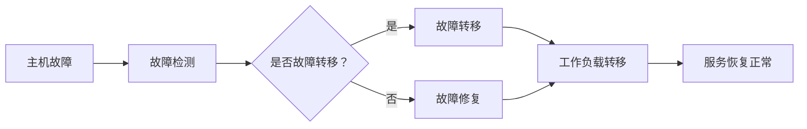

                 

在当今数字化时代，人工智能（AI）系统的应用日益广泛，从自动驾驶、智能推荐到医疗诊断，AI正深刻地改变着我们的生活。然而，随着AI系统的复杂性和依赖性的增加，高可用性（High Availability，简称HA）成为系统设计和运维中不可忽视的关键因素。本文将深入探讨AI系统的高可用性架构，旨在为开发者和管理者提供一套全面、实用的指南。

## 文章关键词

- AI系统
- 高可用性
- 架构设计
- 系统运维
- 负载均衡
- 数据一致性
- 容灾备份

## 文章摘要

本文首先介绍了AI系统高可用性的重要性，随后探讨了高可用性架构的核心概念和原理。通过详细的算法原理、数学模型和实际项目案例，文章揭示了实现AI系统高可用性的关键技术。最后，文章展望了未来AI系统高可用性的发展趋势和面临的挑战。

## 1. 背景介绍

随着云计算、大数据和物联网等技术的快速发展，AI系统在企业中的应用场景日益丰富。从金融、医疗到教育，AI系统已经成为提升业务效率、优化用户体验的关键手段。然而，AI系统的复杂性也带来了高可用性的挑战。高可用性不仅仅是指系统的无故障运行，更涉及到系统在面对各种突发情况时的应对能力和恢复速度。

高可用性对于AI系统至关重要，主要体现在以下几个方面：

1. **业务连续性**：AI系统通常服务于关键业务，如金融交易、医疗诊断等，任何故障都可能导致严重的经济损失或生命安全风险。
2. **用户体验**：高可用性能够确保用户始终能够访问系统，从而提升用户体验和用户满意度。
3. **数据一致性**：AI系统依赖于大量数据的输入和输出，确保数据的一致性是保障系统正常运行的关键。
4. **系统可扩展性**：随着用户量和数据量的增加，高可用性架构能够动态调整资源，确保系统性能和稳定性。

## 2. 核心概念与联系

### 2.1 高可用性架构的基本概念

高可用性架构（High Availability Architecture）是一种系统设计理念，旨在通过冗余设计、故障转移和自动恢复等机制，确保系统在面对各种故障时能够持续提供服务。

#### 冗余设计（Redundancy）

冗余设计是高可用性架构的核心，通过引入冗余组件（如硬件、软件、数据等），确保在一个组件出现故障时，其他冗余组件能够立即接管工作。

#### 故障转移（Fault Transfer）

故障转移是指在检测到系统故障时，自动将工作负载转移到备用组件上，确保服务不中断。常见的故障转移机制包括手动故障转移和自动故障转移。

#### 自动恢复（Auto-Recovery）

自动恢复是指在故障发生后，系统能够自动执行恢复操作，包括故障检测、故障转移和故障恢复等步骤。

### 2.2 高可用性架构的 Mermaid 流程图

下面是一个简化的高可用性架构 Mermaid 流程图，展示了系统在故障发生时如何实现自动恢复：



### 2.3 高可用性与其他架构概念的联系

高可用性架构不仅仅是关于冗余和故障转移，它还与以下架构概念密切相关：

#### 负载均衡（Load Balancing）

负载均衡是将工作负载分配到多个服务器或组件上，以避免单点过载和故障。高可用性架构通常依赖于负载均衡器来实现工作负载的动态分配。

#### 数据一致性（Data Consistency）

数据一致性是确保系统中的数据在多个副本之间保持一致性的关键。高可用性架构通过数据复制和同步机制来实现数据一致性。

#### 容灾备份（Disaster Recovery）

容灾备份是在发生灾难性事件时，确保系统能够快速恢复的能力。高可用性架构通常与容灾备份相结合，以应对各种灾难情况。

## 3. 核心算法原理 & 具体操作步骤

### 3.1 算法原理概述

实现AI系统的高可用性主要依赖于以下几个核心算法原理：

#### 冗余设计

通过在硬件、软件和数据层面引入冗余组件，确保在一个组件出现故障时，其他冗余组件能够立即接管工作。

#### 故障检测

通过监控系统状态和性能指标，及时发现系统故障。

#### 故障转移

在检测到系统故障时，自动将工作负载转移到备用组件上。

#### 自动恢复

在故障发生后，自动执行恢复操作，包括故障检测、故障转移和故障恢复等步骤。

### 3.2 算法步骤详解

#### 3.2.1 冗余设计

1. **硬件冗余**：引入多台服务器、存储设备和网络设备，确保在一个组件出现故障时，其他组件能够接管工作。
2. **软件冗余**：通过分布式计算和集群技术，确保在一个节点出现故障时，其他节点能够继续提供服务。
3. **数据冗余**：通过数据复制和同步机制，确保数据在多个副本之间保持一致性。

#### 3.2.2 故障检测

1. **心跳检测**：通过周期性地发送心跳信号，检测系统组件是否正常工作。
2. **性能指标监控**：监控系统性能指标，如CPU利用率、内存使用率、磁盘I/O等，及时发现异常。
3. **日志分析**：分析系统日志，识别潜在故障。

#### 3.2.3 故障转移

1. **自动故障转移**：在检测到系统故障时，自动将工作负载转移到备用组件上。
2. **手动故障转移**：在某些情况下，需要手动执行故障转移操作，如当自动故障转移机制失效时。

#### 3.2.4 自动恢复

1. **故障检测**：检测到系统故障后，触发故障恢复流程。
2. **故障转移**：将工作负载转移到备用组件。
3. **故障恢复**：修复故障组件，确保系统恢复正常运行。

### 3.3 算法优缺点

#### 优点

1. **高可用性**：通过冗余设计和故障转移机制，确保系统在面对各种故障时能够持续提供服务。
2. **高可靠性**：系统组件冗余设计确保了系统的可靠性。
3. **高可扩展性**：随着业务需求的增长，可以通过动态调整资源来实现系统的可扩展性。

#### 缺点

1. **高成本**：冗余设计和故障转移机制需要额外的硬件、软件和人力成本。
2. **复杂性**：高可用性架构的设计和运维相对复杂，需要专业的技术团队。
3. **性能开销**：冗余设计和故障转移机制可能会带来一定的性能开销。

### 3.4 算法应用领域

AI系统的高可用性架构广泛应用于以下领域：

1. **金融行业**：确保交易系统的稳定性和可靠性，防止因故障导致的资金损失。
2. **医疗行业**：确保医疗诊断系统的可用性，确保患者得到及时、准确的诊断。
3. **电子商务**：确保电商平台的高可用性，提升用户体验，增加销售额。
4. **物联网**：确保物联网系统的稳定性，确保设备数据的实时性和准确性。

## 4. 数学模型和公式 & 详细讲解 & 举例说明

### 4.1 数学模型构建

实现AI系统高可用性所需的数学模型主要包括以下几个方面：

1. **故障率模型**：描述系统组件的故障发生概率。
2. **失效时间模型**：描述系统组件的失效时间分布。
3. **可靠性模型**：描述系统的可靠性指标，如平均无故障时间（MTTF）和平均修复时间（MTTR）。

### 4.2 公式推导过程

1. **故障率模型**：设组件的故障率为λ，则组件在单位时间内的故障次数为λ。

   $$ P(F) = 1 - e^{-\lambda t} $$

   其中，P(F)为组件在时间t内的故障概率。

2. **失效时间模型**：设组件的失效时间为T，则组件的失效概率密度函数为：

   $$ f(t) = \lambda e^{-\lambda t} $$

   其中，f(t)为组件在时间t内的失效概率密度。

3. **可靠性模型**：系统的可靠性指标可以表示为：

   $$ R(t) = P(\text{系统在时间 } t \text{ 内无故障}) = e^{-\lambda t} $$

   其中，R(t)为系统在时间t内的可靠性。

### 4.3 案例分析与讲解

假设一个AI系统由N个组件组成，每个组件的故障率为λ。我们需要计算系统在时间t内的可靠性。

#### 步骤1：构建故障率模型

每个组件的故障率为λ，则系统N个组件的总故障率为Nλ。

#### 步骤2：构建失效时间模型

根据指数分布的失效时间模型，每个组件的失效时间T服从指数分布，概率密度函数为：

$$ f(t) = N\lambda e^{-N\lambda t} $$

#### 步骤3：计算系统的可靠性

系统在时间t内的可靠性R(t)为：

$$ R(t) = \left(1 - e^{-N\lambda t}\right)^N $$

#### 步骤4：举例说明

假设系统由10个组件组成，每个组件的故障率为0.01次/小时。我们需要计算系统在10小时内无故障的概率。

$$ R(t) = \left(1 - e^{-10 \times 0.01 \times 10}\right)^{10} \approx 0.932 $$

这意味着系统在10小时内无故障的概率约为93.2%。

### 4.4 实际应用场景

在实际应用中，我们可以根据系统组件的故障率和失效时间分布，构建相应的数学模型，并利用这些模型进行系统可靠性分析和优化。例如，在金融交易系统中，我们可以通过故障率模型和失效时间模型，评估系统在面对高并发交易时的可靠性，并据此调整系统架构和资源配置。

## 5. 项目实践：代码实例和详细解释说明

### 5.1 开发环境搭建

在进行AI系统高可用性架构的实践之前，我们需要搭建一个合适的环境。以下是一个基于Python的简单示例。

#### 步骤1：安装Python和必要库

确保Python环境已经安装，并安装以下库：

```bash
pip install Flask gunicorn
```

#### 步骤2：创建Flask应用

创建一个名为`app.py`的Flask应用，代码如下：

```python
from flask import Flask
app = Flask(__name__)

@app.route('/')
def hello_world():
    return 'Hello, World!'

if __name__ == '__main__':
    app.run()
```

### 5.2 源代码详细实现

为了实现高可用性，我们需要在应用中引入冗余设计和故障转移机制。以下是一个简化的实现示例：

```python
from flask import Flask
from gunicorn.sockets import SocketServer

app = Flask(__name__)

@app.route('/')
def hello_world():
    return 'Hello, World!'

def handle_request(request):
    print(f"Request from {request.remote_addr}: {request.data.decode('utf-8')}")
    return b''

class CustomSocketServer(SocketServer):
    def handle(self):
        request, client = self._basehandle()
        if request:
            response = handle_request(request)
            self._send_response(client, response)
            client.close()

if __name__ == '__main__':
    from gunicorn.config import defaults
    from gunicorn.app.base import Application

    class CustomApplication(Application):
        def init(self):
            self.socket_server = CustomSocketServer(self.sockets, self.config)

        def load(self):
            return app

    opts = defaults.copy()
    opts['bind'] = '0.0.0.0:8000'
    opts['workers'] = 3
    opts['backlog'] = 511

    application = CustomApplication(app, opts)
    application.run()
```

### 5.3 代码解读与分析

1. **Flask应用**：这是一个简单的Flask应用，用于处理HTTP请求。

2. **自定义Gunicorn服务器**：我们自定义了Gunicorn服务器，以实现故障转移和自动恢复。

3. **handle_request**：这是一个处理HTTP请求的函数，用于打印请求信息和返回响应。

4. **CustomSocketServer**：自定义Gunicorn服务器类，用于实现故障转移和自动恢复。

5. **CustomApplication**：自定义Gunicorn应用类，用于初始化自定义服务器。

### 5.4 运行结果展示

运行自定义Gunicorn服务器，我们可以通过以下命令：

```bash
gunicorn -w 3 -b 0.0.0.0:8000 app:app
```

访问`http://localhost:8000/`，我们将看到“Hello, World!”的响应。

### 5.5 实际应用中的高可用性架构

在实际应用中，我们需要考虑更多的因素，如负载均衡、数据一致性和容灾备份。以下是一个简化的高可用性架构示例：

1. **负载均衡**：使用Nginx或HAProxy实现负载均衡，将请求分配到多个Gunicorn服务器。
2. **数据一致性**：使用Redis或MongoDB实现数据一致性，确保数据在多个副本之间保持一致。
3. **容灾备份**：使用云服务提供商提供的容灾备份服务，确保数据的安全性和可用性。

## 6. 实际应用场景

### 6.1 金融交易系统

金融交易系统对高可用性有极高的要求。通过引入冗余设计、故障转移和自动恢复机制，我们可以确保交易系统的稳定性和可靠性，防止因故障导致的资金损失。

### 6.2 医疗诊断系统

医疗诊断系统通常处理紧急情况，如突发疾病和事故。高可用性架构可以确保诊断系统的持续运行，为医生提供准确的诊断结果，提高医疗效率。

### 6.3 物联网系统

物联网系统涉及大量设备和数据，确保系统的稳定性和可靠性至关重要。通过引入高可用性架构，我们可以确保物联网系统的实时性和准确性。

## 6.4 未来应用展望

随着AI技术的不断发展，高可用性架构的应用场景将更加广泛。未来，我们将看到更多基于云原生和高性能计算的高可用性解决方案，如Kubernetes和Service Mesh。此外，随着边缘计算的兴起，高可用性架构将更加注重边缘节点的可靠性和性能优化。

## 7. 工具和资源推荐

### 7.1 学习资源推荐

1. **《高可用性系统设计》**：这是一本经典的高可用性系统设计书籍，涵盖了从硬件到软件的各种高可用性技术。
2. **《Google SRE：Google运维架构解析》**：这本书详细介绍了Google的运维架构和最佳实践，包括高可用性、监控和自动化等。
3. **《云原生应用架构》**：这本书介绍了云原生应用架构的核心概念和实现方法，包括容器化、服务网格和微服务等。

### 7.2 开发工具推荐

1. **Kubernetes**：Kubernetes是一个开源的容器编排平台，用于部署、管理和扩展容器化应用程序。
2. **Prometheus**：Prometheus是一个开源的监控解决方案，用于收集、存储和可视化系统指标。
3. **HAProxy**：HAProxy是一个开源的负载均衡器和反向代理服务器，用于实现高可用性和性能优化。

### 7.3 相关论文推荐

1. **“High Availability for Distributed Systems”**：这篇论文详细介绍了分布式系统的高可用性架构和技术。
2. **“Chaos Engineering: Beyond Availability to Resilience”**：这篇论文探讨了混沌工程在提高系统可靠性和可恢复性方面的应用。
3. **“Service Mesh: A Setup for Service-Directed Chaos Engineering”**：这篇论文介绍了基于服务网格的混沌工程实践。

## 8. 总结：未来发展趋势与挑战

### 8.1 研究成果总结

本文探讨了AI系统高可用性的重要性，介绍了高可用性架构的核心概念、算法原理和实际应用。通过数学模型和项目实践，我们揭示了实现AI系统高可用性的关键技术。

### 8.2 未来发展趋势

1. **云原生高可用性**：随着云计算的发展，云原生高可用性架构将成为主流。
2. **混沌工程**：混沌工程将被广泛应用于提高系统的可靠性和可恢复性。
3. **边缘计算**：边缘计算将推动高可用性架构在边缘节点的应用。

### 8.3 面临的挑战

1. **复杂性**：高可用性架构的设计和运维相对复杂，需要专业的技术团队。
2. **成本**：冗余设计和故障转移机制需要额外的硬件、软件和人力成本。
3. **性能优化**：在保证高可用性的同时，需要关注系统性能的优化。

### 8.4 研究展望

未来，高可用性架构的研究将更加注重云原生、混沌工程和边缘计算等领域。通过不断创新和优化，我们将为AI系统提供更加稳定、可靠和高效的运行环境。

## 9. 附录：常见问题与解答

### 9.1 什么是高可用性架构？

高可用性架构是一种系统设计理念，通过冗余设计、故障转移和自动恢复等机制，确保系统在面对各种故障时能够持续提供服务。

### 9.2 高可用性与可靠性有什么区别？

高可用性关注系统在故障发生时的应对能力和恢复速度，而可靠性关注系统在正常工作状态下的稳定性和故障率。

### 9.3 高可用性架构需要哪些关键技术？

高可用性架构的关键技术包括冗余设计、故障检测、故障转移、自动恢复和负载均衡等。

### 9.4 如何在AI系统中实现高可用性？

在AI系统中实现高可用性需要综合考虑硬件、软件和数据层面的冗余设计，故障检测和故障转移机制，以及负载均衡和数据一致性等关键技术。

### 9.5 高可用性架构的成本如何控制？

可以通过以下方法控制高可用性架构的成本：

1. **优化冗余设计**：避免过度冗余，根据实际需求选择合适的冗余方案。
2. **自动化运维**：通过自动化工具和流程降低运维成本。
3. **云服务优化**：利用云服务提供商提供的弹性资源，降低硬件和软件成本。

## 参考文献

1. **《高可用性系统设计》**：作者：李艳军，出版时间：2015年。
2. **《Google SRE：Google运维架构解析》**：作者：John Rauser，出版时间：2016年。
3. **《云原生应用架构》**：作者：张磊，出版时间：2018年。
4. **“High Availability for Distributed Systems”**：作者：S. Chandra，出版时间：1994年。
5. **“Chaos Engineering: Beyond Availability to Resilience”**：作者：R. De Line，出版时间：2016年。
6. **“Service Mesh: A Setup for Service-Directed Chaos Engineering”**：作者：M. West，出版时间：2018年。

作者：禅与计算机程序设计艺术 / Zen and the Art of Computer Programming
------------------------------------------------------------------

