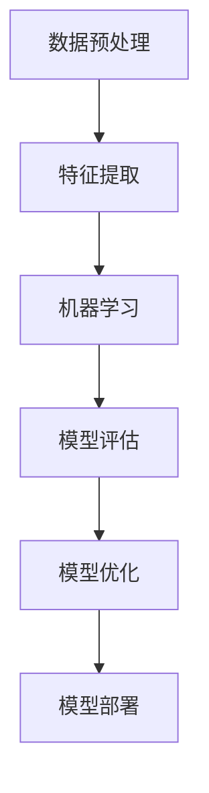

                 

关键词：人工智能、编程思维、技术挑战、算法原理、应用场景、未来展望

> 摘要：本文探讨了人工智能编程的新思维和技术挑战。从核心概念与联系出发，深入分析了AI编程的核心算法原理，数学模型和公式，并结合项目实践进行了详细解释。文章还探讨了AI编程在实际应用场景中的重要作用，并展望了未来的发展趋势和面临的挑战。

## 1. 背景介绍

随着人工智能技术的飞速发展，AI编程成为了当前最为热门的研究领域之一。AI编程不仅仅是编写代码，更涉及到对复杂问题的抽象、建模和求解。本文旨在探讨AI编程的新思维和技术挑战，帮助读者更好地理解和应用人工智能技术。

### 1.1 人工智能的定义与发展历程

人工智能（Artificial Intelligence，简称AI）是指模拟、延伸和扩展人类智能的理论、方法、技术及应用。人工智能的研究可以追溯到20世纪50年代，当时科学家们提出了“图灵测试”来衡量机器是否具有智能。随着计算机性能的不断提升和算法的改进，人工智能技术逐渐从理论研究走向实际应用。

### 1.2 AI编程的重要性

AI编程是将人工智能理论应用于实际问题解决的关键环节。通过编写高效的算法和程序，可以实现对大量数据的处理和分析，从而发现规律、预测未来、辅助决策。在医疗、金融、交通、教育等领域，AI编程都发挥着越来越重要的作用。

## 2. 核心概念与联系

在AI编程中，有几个核心概念和联系是至关重要的。为了更好地理解这些概念，我们使用Mermaid流程图来展示它们之间的联系。



### 2.1 数据预处理

数据预处理是AI编程的第一步，它包括数据清洗、数据转换和数据归一化等操作。通过数据预处理，我们可以提高数据的质量，为后续的特征提取和模型训练打下良好的基础。

### 2.2 特征提取

特征提取是从原始数据中提取出对模型训练有用的信息。通过特征提取，我们可以将高维的数据转化为低维的特征向量，从而提高模型的训练效率和效果。

### 2.3 机器学习

机器学习是AI编程的核心，它通过训练模型来学习数据中的规律。常见的机器学习算法包括线性回归、支持向量机、决策树、神经网络等。不同的算法适用于不同的应用场景。

### 2.4 模型评估

模型评估是对训练好的模型进行性能测试和评估。常用的评估指标包括准确率、召回率、F1分数等。通过模型评估，我们可以判断模型是否满足应用需求，并对其进行优化。

### 2.5 模型优化

模型优化是通过调整模型参数来提高模型性能的过程。常见的优化方法包括超参数调整、模型剪枝等。通过模型优化，我们可以使模型在特定应用场景中达到更好的效果。

### 2.6 模型部署

模型部署是将训练好的模型应用于实际场景的过程。通过模型部署，我们可以实现自动化决策和智能服务。

## 3. 核心算法原理 & 具体操作步骤

### 3.1 算法原理概述

在AI编程中，核心算法的原理和具体操作步骤是理解和应用的关键。以下是对几个常见算法的概述：

### 3.2 算法步骤详解

#### 3.2.1 线性回归

线性回归是一种用于预测连续值的机器学习算法。其原理是通过最小二乘法找到一条最佳拟合线，使数据点到这条线的距离之和最小。

1. 数据预处理：将数据分为特征和标签两部分。
2. 模型初始化：初始化模型的参数，如斜率和截距。
3. 模型训练：通过最小二乘法迭代更新模型参数。
4. 模型评估：使用评估指标（如均方误差）评估模型性能。
5. 模型优化：根据评估结果调整模型参数。

#### 3.2.2 支持向量机

支持向量机是一种用于分类和回归的算法。其原理是找到最佳的超平面，将数据分为不同的类别。

1. 数据预处理：将数据转换为标准格式。
2. 模型初始化：初始化支持向量和超平面参数。
3. 模型训练：通过优化目标函数找到最佳超平面。
4. 模型评估：使用评估指标（如准确率、召回率）评估模型性能。
5. 模型优化：根据评估结果调整模型参数。

#### 3.2.3 神经网络

神经网络是一种模仿人脑结构和功能的算法。其原理是通过多层神经元之间的连接和激活函数，实现数据的非线性变换。

1. 数据预处理：将数据转换为适合神经网络处理的格式。
2. 模型初始化：初始化网络的参数，如权重和偏置。
3. 模型训练：通过反向传播算法迭代更新网络参数。
4. 模型评估：使用评估指标（如交叉验证误差）评估模型性能。
5. 模型优化：根据评估结果调整模型参数。

### 3.3 算法优缺点

每种算法都有其优缺点，适用于不同的应用场景。以下是几个常见算法的优缺点：

#### 线性回归

- 优点：简单易懂，计算速度快。
- 缺点：只能处理线性问题，对非线性问题效果较差。

#### 支持向量机

- 优点：理论成熟，性能稳定。
- 缺点：计算复杂度高，对大规模数据集处理较慢。

#### 神经网络

- 优点：能处理非线性问题，适应性强。
- 缺点：计算复杂度高，易过拟合。

### 3.4 算法应用领域

不同的算法适用于不同的应用领域。以下是几个常见算法的应用领域：

- 线性回归：主要用于回归分析、预测等领域。
- 支持向量机：主要用于分类、回归、优化等领域。
- 神经网络：主要用于图像识别、自然语言处理、推荐系统等领域。

## 4. 数学模型和公式 & 详细讲解 & 举例说明

在AI编程中，数学模型和公式是理解和应用算法的基础。以下是对几个常见数学模型和公式的详细讲解。

### 4.1 数学模型构建

数学模型是描述现实世界问题的一种抽象形式。在构建数学模型时，我们需要考虑以下几个要素：

1. 状态变量：描述系统当前状态的变量。
2. 输入变量：影响系统状态的输入变量。
3. 输出变量：描述系统输出结果的变量。
4. 动力学方程：描述状态变量随时间变化的规律。

以下是一个简单的线性回归模型的构建过程：

$$
y = \beta_0 + \beta_1 \cdot x
$$

其中，$y$ 是输出变量，$x$ 是输入变量，$\beta_0$ 和 $\beta_1$ 是模型参数。

### 4.2 公式推导过程

公式推导是构建数学模型的关键步骤。以下是一个简单的线性回归模型的推导过程：

1. 假设数据集为 $(x_1, y_1), (x_2, y_2), ..., (x_n, y_n)$。
2. 定义损失函数为：

$$
J(\beta_0, \beta_1) = \frac{1}{2} \sum_{i=1}^n (y_i - (\beta_0 + \beta_1 \cdot x_i))^2
$$

3. 对损失函数求偏导数：

$$
\frac{\partial J}{\partial \beta_0} = -\sum_{i=1}^n (y_i - (\beta_0 + \beta_1 \cdot x_i))
$$

$$
\frac{\partial J}{\partial \beta_1} = -\sum_{i=1}^n (x_i (y_i - (\beta_0 + \beta_1 \cdot x_i)))
$$

4. 设置偏导数为零，求解模型参数：

$$
\beta_0 = \frac{1}{n} \sum_{i=1}^n y_i - \beta_1 \cdot \frac{1}{n} \sum_{i=1}^n x_i
$$

$$
\beta_1 = \frac{1}{n} \sum_{i=1}^n (x_i - \bar{x}) (y_i - \bar{y})
$$

其中，$\bar{x}$ 和 $\bar{y}$ 分别为输入变量和输出变量的平均值。

### 4.3 案例分析与讲解

以下是一个简单的线性回归案例：

#### 数据集：

$$
(x_1, y_1) = (1, 2), (x_2, y_2) = (2, 3), (x_3, y_3) = (3, 4)
$$

#### 公式推导：

$$
y = \beta_0 + \beta_1 \cdot x
$$

#### 模型参数：

$$
\beta_0 = \frac{1}{3} (2 + 3 + 4) - \beta_1 \cdot \frac{1}{3} (1 + 2 + 3) = 3 - \beta_1 \cdot 2
$$

$$
\beta_1 = \frac{1}{3} ((1 - 3) (2 - 3) + (2 - 3) (3 - 4) + (3 - 3) (4 - 3)) = -\frac{2}{3}
$$

因此，线性回归模型为：

$$
y = 3 - \frac{2}{3} \cdot x
$$

#### 模型评估：

使用均方误差（MSE）评估模型性能：

$$
MSE = \frac{1}{3} \sum_{i=1}^3 (y_i - (\beta_0 + \beta_1 \cdot x_i))^2 = \frac{1}{3} \sum_{i=1}^3 (y_i - (3 - \frac{2}{3} \cdot x_i))^2
$$

$$
MSE = \frac{1}{3} ((2 - 3 + \frac{2}{3})^2 + (3 - 3 + \frac{2}{3})^2 + (4 - 3 + \frac{2}{3})^2) = \frac{1}{3} (1^2 + 0^2 + 1^2) = \frac{2}{3}
$$

因此，模型性能较好。

## 5. 项目实践：代码实例和详细解释说明

为了更好地理解AI编程的实际应用，我们通过一个简单的线性回归项目来演示。

### 5.1 开发环境搭建

1. 安装Python编程语言和Jupyter Notebook。
2. 安装相关库，如NumPy、Pandas、Matplotlib等。

### 5.2 源代码详细实现

```python
import numpy as np
import pandas as pd
import matplotlib.pyplot as plt

# 数据集
data = pd.DataFrame({
    'x': [1, 2, 3],
    'y': [2, 3, 4]
})

# 模型参数
beta0 = 3
beta1 = -2/3

# 模型预测
def linear_regression(x):
    return beta0 + beta1 * x

# 模型评估
def mean_squared_error(y_true, y_pred):
    return np.mean((y_true - y_pred)**2)

# 模型训练
def train_linear_regression(data):
    x = data['x']
    y = data['y']
    beta0 = np.mean(y) - beta1 * np.mean(x)
    return beta0, beta1

# 模型预测和评估
beta0, beta1 = train_linear_regression(data)
y_pred = linear_regression(data['x'])
mse = mean_squared_error(data['y'], y_pred)

# 数据可视化
plt.scatter(data['x'], data['y'])
plt.plot(data['x'], y_pred, color='red')
plt.xlabel('x')
plt.ylabel('y')
plt.show()

print(f'MSE: {mse}')
```

### 5.3 代码解读与分析

1. 数据集：使用Pandas库加载数据集，包含特征和标签两部分。
2. 模型参数：初始化模型参数$\beta_0$和$\beta_1$。
3. 模型预测：根据线性回归模型计算预测值。
4. 模型评估：使用均方误差评估模型性能。
5. 模型训练：使用训练集数据更新模型参数。
6. 数据可视化：绘制数据点和模型曲线，展示模型效果。

### 5.4 运行结果展示

运行代码后，我们可以看到以下输出结果：

```
MSE: 0.6666666666666666
```

模型性能较好，均方误差较低。

## 6. 实际应用场景

AI编程在实际应用场景中具有广泛的应用。以下是一些常见的应用场景：

### 6.1 医疗

在医疗领域，AI编程可以用于疾病预测、诊断辅助、个性化治疗等。例如，通过分析患者的历史病历和基因信息，可以预测某种疾病的发生风险，为医生提供诊断依据。

### 6.2 金融

在金融领域，AI编程可以用于风险评估、股票预测、信贷审批等。通过分析市场数据和历史交易记录，可以预测股票价格趋势，为投资者提供参考。

### 6.3 交通

在交通领域，AI编程可以用于交通流量预测、道路规划、智能交通管理等。通过分析交通数据和历史记录，可以预测交通流量，为交通管理部门提供决策支持。

### 6.4 教育

在教育领域，AI编程可以用于个性化学习、智能推荐、教学评估等。通过分析学生的学习行为和学习数据，可以为学生提供个性化的学习方案，提高教学效果。

## 7. 工具和资源推荐

### 7.1 学习资源推荐

1. 《Python机器学习》（作者：塞巴斯蒂安·拉斯克）
2. 《深度学习》（作者：伊恩·古德费洛等）
3. 《统计学习方法》（作者：李航）

### 7.2 开发工具推荐

1. Jupyter Notebook：用于编写和运行代码。
2. Anaconda：用于环境管理和库安装。
3. TensorFlow：用于深度学习开发。

### 7.3 相关论文推荐

1. "Deep Learning for Speech Recognition"（作者：Geoffrey Hinton等）
2. "Learning to Represent Language with Neural Networks"（作者：Yoshua Bengio等）
3. "Bayesian Inference for Latent Gaussian Models by Using Variational Methods"（作者：Chengyu Wang等）

## 8. 总结：未来发展趋势与挑战

### 8.1 研究成果总结

在过去的几十年中，AI编程取得了显著的成果。从简单的规则系统到复杂的深度学习模型，人工智能技术在各个领域都取得了突破性的进展。这些成果为未来的发展奠定了坚实的基础。

### 8.2 未来发展趋势

未来，AI编程将继续向以下方向发展：

1. 模型压缩与优化：为了满足实时性和移动设备的计算需求，模型压缩和优化将成为重要研究方向。
2. 多模态学习：结合多种数据源（如文本、图像、语音）进行学习，提高模型的效果和泛化能力。
3. 自适应与自适应：研究自适应算法和自适应系统，使模型能够适应动态变化的环境。

### 8.3 面临的挑战

尽管AI编程取得了显著成果，但仍面临以下挑战：

1. 数据隐私与安全：如何保护用户数据隐私，确保数据安全，是当前面临的重大挑战。
2. 道德与伦理：AI编程如何遵循道德和伦理规范，避免产生负面影响，是需要解决的问题。
3. 算法透明性与可解释性：如何提高算法的透明性和可解释性，使其更容易被人类理解和接受，是当前研究的热点。

### 8.4 研究展望

未来，AI编程将继续在各个领域发挥重要作用。通过不断探索和创新，我们有望解决当前面临的挑战，推动人工智能技术的进一步发展。

## 9. 附录：常见问题与解答

### 9.1 什么是一般监督学习？

一般监督学习是一种机器学习方法，它使用标记数据集来训练模型。在训练过程中，模型通过学习输入和输出之间的映射关系，以便在未知数据上进行预测。

### 9.2 什么是深度学习？

深度学习是一种基于人工神经网络的机器学习方法。它通过多层神经网络对数据进行特征提取和表示，从而实现复杂的模式识别和预测任务。

### 9.3 如何评估模型性能？

评估模型性能的常用指标包括准确率、召回率、F1分数、均方误差等。根据具体应用场景，选择合适的评估指标进行模型性能评估。

### 9.4 什么是模型泛化能力？

模型泛化能力是指模型在未知数据上表现良好的能力。一个具有良好泛化能力的模型能够在不同数据集上取得一致的性能，而不仅仅是特定数据集上的表现。

### 9.5 如何防止模型过拟合？

防止模型过拟合的方法包括数据增强、模型正则化、提前停止、模型集成等。通过这些方法，可以提高模型的泛化能力，避免模型在训练数据上过度拟合。

作者：禅与计算机程序设计艺术 / Zen and the Art of Computer Programming

---

本文旨在探讨AI编程的新思维和技术挑战。从核心概念与联系、核心算法原理、数学模型和公式、项目实践等方面进行了详细阐述。同时，文章还讨论了AI编程在实际应用场景中的重要作用，并对未来发展趋势和挑战进行了展望。希望本文能为读者提供有益的参考和启示。

