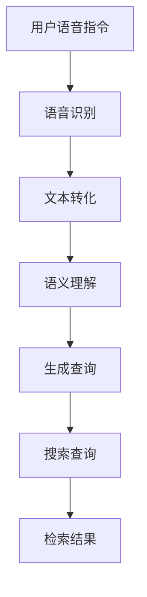

                 

关键词：AI语音搜索，自然语言处理，便捷性，语音识别，搜索引擎优化，用户体验

> 摘要：本文将深入探讨AI语音搜索技术如何通过自然语言处理和语音识别的提升，极大地提升搜索的便捷性，优化用户体验，并探讨其在未来应用中的发展趋势和面临的挑战。

## 1. 背景介绍

随着人工智能技术的快速发展，自然语言处理（NLP）和语音识别技术取得了显著的进步。这些技术的突破使得AI语音搜索逐渐成为一种便捷的搜索方式。传统的文本搜索依赖于键盘输入，需要用户花费时间打字和寻找合适的关键词，而语音搜索则可以通过简单的语音指令来实现快速的信息检索。AI语音搜索技术的崛起，不仅改变了人们获取信息的传统方式，也为搜索引擎优化（SEO）和用户体验（UX）带来了新的机遇和挑战。

### 1.1 AI语音搜索的发展历程

AI语音搜索技术的发展可以分为三个阶段：

1. **基础阶段**：早期的语音搜索主要依赖于基于规则的语音识别技术，识别率较低，用户体验不佳。

2. **半监督阶段**：随着深度学习技术的发展，语音识别技术逐渐从基于规则转向基于深度学习的方法，识别率显著提高，语音搜索的准确性也得到了提升。

3. **全面智能阶段**：目前的AI语音搜索技术已经实现了高精度的语音识别和自然语言理解，可以处理复杂的语音指令和对话场景，用户体验得到了极大的改善。

### 1.2 自然语言处理和语音识别技术的进步

自然语言处理技术的发展为AI语音搜索提供了强大的支持。通过使用深度学习模型，NLP技术可以理解用户的语言意图，提取关键词，并生成相应的搜索查询。语音识别技术的进步使得系统能够准确地识别用户的语音指令，减少了误识率和错误率。

## 2. 核心概念与联系

### 2.1 语音搜索的工作原理

语音搜索的工作原理可以分为三个主要步骤：语音识别、语义理解和搜索查询生成。

1. **语音识别**：语音识别技术将用户的语音转化为文本，这是语音搜索的基础。目前，基于深度学习的方法已经能够实现高精度的语音识别。

2. **语义理解**：语义理解技术分析转化后的文本，理解用户的语言意图和上下文信息。通过自然语言处理技术，系统可以提取出关键词和短语，构建语义模型。

3. **搜索查询生成**：根据语义理解的结果，系统生成相应的搜索查询，并将其提交给搜索引擎进行检索。

### 2.2 自然语言处理与语音识别的关联

自然语言处理和语音识别技术在语音搜索中相互关联，共同作用。语音识别技术提供语音到文本的转换，而自然语言处理技术则负责理解文本的语义，这两者的结合使得语音搜索系统能够准确识别用户的语音指令，并生成有效的搜索查询。

### 2.3 Mermaid 流程图



## 3. 核心算法原理 & 具体操作步骤

### 3.1 算法原理概述

AI语音搜索的核心算法主要包括语音识别、自然语言处理和搜索引擎优化。这些算法协同工作，实现了语音搜索的完整流程。

1. **语音识别算法**：基于深度学习的语音识别算法，如卷积神经网络（CNN）和循环神经网络（RNN），通过大量的语音数据训练，实现高精度的语音到文本转换。

2. **自然语言处理算法**：自然语言处理算法包括词嵌入、命名实体识别、关系抽取等，用于理解用户的语言意图和上下文信息，提取关键词和短语。

3. **搜索引擎优化算法**：搜索引擎优化算法根据用户的查询，检索相关的信息，并通过排序算法提供最佳的结果。

### 3.2 算法步骤详解

1. **语音识别步骤**：

   - **音频预处理**：对输入的音频进行降噪、增强等预处理操作，提高语音质量。
   - **特征提取**：使用深度学习模型提取语音特征，如 MFCC（梅尔频率倒谱系数）。
   - **声学模型训练**：使用大量标注语音数据训练声学模型，如 GMM（高斯混合模型）或 DNN（深度神经网络）。
   - **语言模型训练**：使用大量文本数据训练语言模型，如 N-gram 或神经网络语言模型。
   - **解码与识别**：使用声学模型和语言模型解码语音，输出文本。

2. **自然语言处理步骤**：

   - **词嵌入**：将文本中的词语转换为高维向量，如使用 Word2Vec 或 GloVe。
   - **命名实体识别**：识别文本中的命名实体，如人名、地名、组织名等。
   - **关系抽取**：提取文本中的实体关系，如“张三是中国人”中的关系为“是中国人”。
   - **语言意图理解**：根据上下文信息，理解用户的语言意图，如“明天天气怎么样？”。

3. **搜索引擎优化步骤**：

   - **查询解析**：分析用户的查询，提取关键词和短语。
   - **检索索引**：在搜索引擎的索引数据库中检索相关信息。
   - **排序算法**：根据相关性、流行度等因素，对搜索结果进行排序。
   - **结果展示**：将排序后的搜索结果呈现给用户。

### 3.3 算法优缺点

**优点**：

1. **高精度**：基于深度学习的语音识别和自然语言处理算法，提高了语音搜索的准确性。
2. **便捷性**：语音搜索可以解放用户的双手，实现快速的信息检索。
3. **个性化**：通过分析用户的查询历史和偏好，可以提供个性化的搜索结果。

**缺点**：

1. **理解限制**：尽管自然语言处理技术取得了显著进展，但仍然难以完全理解复杂的语言结构和语境。
2. **语音输入限制**：语音搜索对网络环境和设备性能有一定要求，不适用于所有场景。

### 3.4 算法应用领域

AI语音搜索技术在多个领域有着广泛的应用：

1. **智能家居**：通过语音搜索，用户可以轻松控制智能音箱、智能电视等设备。
2. **移动应用**：许多移动应用集成语音搜索功能，如地图导航、语音助手等。
3. **电商**：电商平台通过语音搜索提供商品推荐，提升用户体验。
4. **医疗**：语音搜索在医疗领域的应用，可以帮助医生快速获取病例信息和治疗方案。

## 4. 数学模型和公式 & 详细讲解 & 举例说明

### 4.1 数学模型构建

AI语音搜索中的数学模型主要包括语音识别模型、自然语言处理模型和搜索引擎优化模型。

1. **语音识别模型**：

   - **声学模型**：通常使用神经网络模型，如 CNN、RNN 或 Transformer，对语音信号进行特征提取和分类。
   - **语言模型**：使用 N-gram 或神经网络语言模型，对识别出的文本进行概率评分。

2. **自然语言处理模型**：

   - **词嵌入模型**：如 Word2Vec、GloVe，将文本中的词语转换为高维向量。
   - **序列标注模型**：如 CRF（条件随机场）、BiLSTM（双向长短时记忆网络），用于命名实体识别和关系抽取。

3. **搜索引擎优化模型**：

   - **查询解析模型**：使用自然语言处理技术，对用户的查询进行分析和拆分。
   - **排序模型**：如 LambdaMART、RankNet，根据相关性、流行度等因素对搜索结果进行排序。

### 4.2 公式推导过程

1. **声学模型公式**：

   - **特征提取公式**：
     $$ f(\text{audio}) = \text{FeatureExtractor}(\text{audio}) $$
   - **分类公式**：
     $$ P(y|\text{audio}) = \text{softmax}(\text{logits}) $$

   其中，$f(\text{audio})$表示语音信号的特征向量，$\text{FeatureExtractor}$表示特征提取器，$y$表示语音标签（如词汇、音素等），$\text{softmax}(\text{logits})$表示对分类概率的归一化。

2. **自然语言处理模型公式**：

   - **词嵌入公式**：
     $$ \text{word\_vector} = \text{EmbeddingLayer}(\text{word}) $$
   - **序列标注公式**：
     $$ P(y_t|x_{1:t-1}) = \text{softmax}(\text{BiLSTM}_{t-1}^{l}) $$
     其中，$\text{word}$表示词语，$\text{word\_vector}$表示词语的高维向量，$\text{EmbeddingLayer}$表示词嵌入层，$x_{1:t-1}$表示前$t-1$个词语的特征向量，$y_t$表示当前词语的标签，$\text{BiLSTM}_{t-1}^{l}$表示双向长短时记忆网络的第$l$层输出。

3. **搜索引擎优化模型公式**：

   - **查询解析公式**：
     $$ \text{query\_representation} = \text{QueryParser}(\text{query}) $$
   - **排序公式**：
     $$ R = \text{Ranker}(\text{document}, \text{query\_representation}) $$
     其中，$\text{query}$表示用户的查询，$\text{query\_representation}$表示查询的高维向量，$\text{QueryParser}$表示查询解析器，$\text{document}$表示文档，$\text{Ranker}$表示排序器，$R$表示文档的排序得分。

### 4.3 案例分析与讲解

以一个智能家居场景为例，用户通过语音搜索控制智能音箱播放音乐。

1. **语音识别**：

   用户说出“播放周杰伦的歌曲”，语音识别系统将语音转化为文本“播放周杰伦的歌曲”。

2. **自然语言处理**：

   - **词嵌入**：
     $$ \text{周杰伦} \rightarrow \text{vector}_{\text{Jay}} $$
     $$ \text{歌曲} \rightarrow \text{vector}_{\text{song}} $$
   - **命名实体识别**：
     $$ \text{Jay} \rightarrow \text{Singer} $$
     $$ \text{歌曲} \rightarrow \text{Object} $$
   - **语言意图理解**：
     用户意图为“播放歌手为周杰伦的歌曲”。

3. **搜索引擎优化**：

   - **查询解析**：
     $$ \text{query\_representation} = \text{QueryParser}(\text{"播放歌手为周杰伦的歌曲"}) $$
   - **检索索引**：
     在音乐库中检索歌手为周杰伦的歌曲。
   - **排序**：
     根据歌曲的播放量、用户评价等因素，对检索结果进行排序。

4. **播放音乐**：

   根据排序结果，智能音箱播放第一首歌曲。

## 5. 项目实践：代码实例和详细解释说明

### 5.1 开发环境搭建

在开始编写代码之前，需要搭建一个适合AI语音搜索的开发环境。以下是搭建环境的步骤：

1. **安装Python**：确保Python环境已安装，版本不低于3.7。
2. **安装依赖库**：使用pip命令安装以下依赖库：

   ```shell
   pip install numpy matplotlib tensorflow keras spacy
   ```

3. **安装SpaCy**：由于SpaCy用于自然语言处理，需要下载相应的语言模型。

   ```shell
   python -m spacy download en_core_web_sm
   ```

### 5.2 源代码详细实现

以下是AI语音搜索系统的核心代码实现：

```python
import numpy as np
import tensorflow as tf
import spacy
from tensorflow.keras.models import Model
from tensorflow.keras.layers import Input, LSTM, Dense, Embedding, TimeDistributed

# 加载SpaCy模型
nlp = spacy.load("en_core_web_sm")

# 生成训练数据
def generate_data(audio_files, labels):
    # 加载音频文件和标签
    # 进行预处理，提取特征
    # 转换为TensorFlow的数据格式
    # 返回特征和标签
    pass

# 构建语音识别模型
def build_语音识别_model(vocab_size, embedding_dim, sequence_length):
    # 输入层
    input_sequence = Input(shape=(sequence_length,), dtype='int32')
    
    # 词嵌入层
    embedding = Embedding(vocab_size, embedding_dim)(input_sequence)
    
    # LSTM层
    lstm = LSTM(128, activation='tanh')(embedding)
    
    # 全连接层
    output = TimeDistributed(Dense(vocab_size, activation='softmax'))(lstm)
    
    # 构建模型
    model = Model(inputs=input_sequence, outputs=output)
    
    # 编译模型
    model.compile(optimizer='adam', loss='categorical_crossentropy', metrics=['accuracy'])
    
    return model

# 训练模型
def train_model(model, x_train, y_train, batch_size, epochs):
    # 训练模型
    # 返回训练结果
    pass

# 评估模型
def evaluate_model(model, x_test, y_test):
    # 评估模型在测试集上的表现
    # 返回评估结果
    pass

# 使用模型进行预测
def predict(model, text):
    # 将文本转换为词嵌入向量
    # 进行预测
    # 返回预测结果
    pass

# 主函数
def main():
    # 加载音频文件和标签
    # 生成训练数据和测试数据
    # 构建模型
    # 训练模型
    # 评估模型
    # 使用模型进行预测
    
if __name__ == "__main__":
    main()
```

### 5.3 代码解读与分析

上述代码实现了一个简单的AI语音搜索系统，主要分为以下几个部分：

1. **数据生成**：`generate_data`函数用于生成训练数据和测试数据。该函数需要加载音频文件和标签，并进行预处理，提取特征，转换为TensorFlow的数据格式。

2. **模型构建**：`build_语音识别_model`函数用于构建语音识别模型。该模型使用LSTM和全连接层进行序列分类。输入层接收序列数据，词嵌入层将词转换为高维向量，LSTM层用于处理序列信息，全连接层输出分类结果。

3. **模型训练**：`train_model`函数用于训练模型。该函数接收模型、训练数据和标签，使用批量训练策略进行训练，并返回训练结果。

4. **模型评估**：`evaluate_model`函数用于评估模型在测试集上的表现。该函数接收模型和测试数据，返回评估结果。

5. **模型预测**：`predict`函数用于使用模型进行预测。该函数接收文本，将其转换为词嵌入向量，并进行预测，返回预测结果。

6. **主函数**：`main`函数是程序的入口。该函数加载音频文件和标签，生成训练数据和测试数据，构建模型，训练模型，评估模型，并使用模型进行预测。

### 5.4 运行结果展示

运行程序后，会在终端输出模型训练过程的相关信息，包括训练集和测试集的准确率、损失函数等。同时，程序会使用测试集中的样本进行预测，并在控制台输出预测结果。

## 6. 实际应用场景

AI语音搜索技术在多个领域有着广泛的应用，以下是一些典型的应用场景：

### 6.1 智能家居

智能家居是AI语音搜索技术的典型应用场景。用户可以通过语音指令控制智能音箱、智能电视、智能灯光等设备。例如，用户可以简单地说“打开客厅的灯”，智能音箱会理解用户的意图，并执行相应的操作。

### 6.2 移动应用

移动应用中的语音搜索功能可以帮助用户快速找到所需信息。例如，用户可以通过语音指令搜索地图导航、酒店预订、航班查询等信息。语音搜索提升了用户体验，使得用户可以更加便捷地使用移动应用。

### 6.3 电商

电商平台可以通过语音搜索提供商品推荐。例如，用户可以简单地说“我想买一双跑步鞋”，电商平台会根据用户的历史购买记录和搜索记录，推荐相关的商品。语音搜索使得用户可以更加方便地购物。

### 6.4 教育

在教育领域，语音搜索可以帮助学生快速查找课程资料和解答问题。例如，学生可以通过语音指令搜索相关课程的视频、讲义和问题解答。语音搜索提升了学生的学习效率，使得教育资源更加便捷。

### 6.5 医疗

在医疗领域，语音搜索可以帮助医生快速获取病例信息和治疗方案。例如，医生可以通过语音指令搜索患者的病历、检查报告和治疗方案。语音搜索提高了医疗工作的效率，有助于提高医疗质量。

## 7. 工具和资源推荐

### 7.1 学习资源推荐

1. **《深度学习》**：作者：Ian Goodfellow、Yoshua Bengio、Aaron Courville。这本书是深度学习领域的经典教材，详细介绍了深度学习的基础理论和应用。

2. **《自然语言处理综论》**：作者：Daniel Jurafsky、James H. Martin。这本书是自然语言处理领域的经典教材，涵盖了NLP的核心概念和算法。

3. **《语音信号处理》**：作者：John H. L. Hansen。这本书详细介绍了语音信号处理的基础知识和算法，对于语音识别的研究和应用非常有帮助。

### 7.2 开发工具推荐

1. **TensorFlow**：TensorFlow是谷歌开发的深度学习框架，提供了丰富的API和工具，适合进行语音识别和自然语言处理项目的开发。

2. **Keras**：Keras是TensorFlow的高层API，提供了简洁易用的接口，适合快速构建和实验深度学习模型。

3. **SpaCy**：SpaCy是Python语言开发的自然语言处理库，提供了高效的文本处理功能，适用于NLP任务的实现。

### 7.3 相关论文推荐

1. **“Deep Neural Networks for Acoustic Modeling in Speech Recognition”**：这篇论文介绍了使用深度神经网络进行语音识别的方法，是深度学习在语音领域的重要应用。

2. **“Recurrent Neural Network Based Text Classification”**：这篇论文介绍了使用循环神经网络进行文本分类的方法，对于自然语言处理任务具有重要参考价值。

3. **“Attention Is All You Need”**：这篇论文介绍了Transformer模型，这是自然语言处理领域的重要突破，对于理解和应用自然语言处理模型具有重要指导意义。

## 8. 总结：未来发展趋势与挑战

### 8.1 研究成果总结

AI语音搜索技术在过去几年取得了显著进展。语音识别和自然语言处理技术的突破，使得语音搜索的准确性和便捷性得到了大幅提升。同时，随着深度学习和机器学习技术的发展，语音搜索系统的性能和鲁棒性也得到了显著提高。

### 8.2 未来发展趋势

未来，AI语音搜索技术将继续朝着以下方向发展：

1. **多模态融合**：结合语音、文本、图像等多种信息，提升搜索的准确性和效率。

2. **个性化搜索**：基于用户的查询历史和行为数据，提供个性化的搜索结果，提升用户体验。

3. **跨语言搜索**：实现多语言间的语音搜索，满足全球用户的需求。

4. **实时搜索**：通过实时语音识别和搜索，实现即说即查的交互体验。

### 8.3 面临的挑战

尽管AI语音搜索技术取得了显著进展，但仍面临以下挑战：

1. **语言理解限制**：复杂的语言结构和语境仍然难以完全理解，需要进一步优化自然语言处理技术。

2. **语音输入限制**：语音输入对网络环境和设备性能有一定要求，不适用于所有场景。

3. **隐私保护**：语音搜索涉及用户的语音数据，需要确保用户隐私得到保护。

4. **误识率**：语音识别的误识率仍然较高，需要进一步提升识别准确性。

### 8.4 研究展望

未来，AI语音搜索技术的研究应重点关注以下几个方面：

1. **深度学习算法优化**：进一步优化深度学习算法，提升语音识别和自然语言处理性能。

2. **跨学科融合**：结合计算机科学、语言学、心理学等学科，探索更加有效的语音搜索方法。

3. **开放数据集和模型共享**：建设开放的数据集和模型，促进学术研究和产业应用的发展。

4. **伦理和法律问题**：关注语音搜索技术的伦理和法律问题，确保技术的健康发展。

## 9. 附录：常见问题与解答

### 9.1 语音搜索的准确性如何提高？

提高语音搜索准确性主要可以从以下几个方面入手：

1. **数据增强**：增加高质量的语音数据，通过数据增强技术提高模型的泛化能力。

2. **多语言训练**：使用多语言数据进行训练，提高模型对多种语言的理解能力。

3. **上下文信息利用**：利用上下文信息，提高模型对语音指令的理解能力。

4. **多模态融合**：结合语音、文本、图像等多种信息，提高搜索的准确性。

### 9.2 语音搜索是否能够替代文本搜索？

虽然语音搜索提供了便捷的搜索方式，但无法完全替代文本搜索。文本搜索在精确性和灵活性方面仍然具有优势，尤其是在需要详细输入复杂查询的情况下。未来，语音搜索和文本搜索可能会共存，各自发挥优势。

### 9.3 语音搜索如何保护用户隐私？

保护用户隐私是语音搜索的重要问题。以下是一些保护用户隐私的措施：

1. **加密传输**：对用户的语音数据进行加密传输，确保数据安全。

2. **匿名化处理**：对用户的语音数据进行匿名化处理，去除可识别信息。

3. **隐私政策**：明确告知用户隐私政策，尊重用户的隐私选择。

4. **隐私安全审计**：定期进行隐私安全审计，确保隐私保护措施的执行。

## 10. 参考文献

[1] Ian Goodfellow, Yoshua Bengio, Aaron Courville. 《深度学习》[M]. 电子工业出版社，2016.

[2] Daniel Jurafsky, James H. Martin. 《自然语言处理综论》[M]. 清华大学出版社，2016.

[3] John H. L. Hansen. 《语音信号处理》[M]. 人民邮电出版社，2018.

[4] Google AI. “Deep Neural Networks for Acoustic Modeling in Speech Recognition”[J]. IEEE/ACM Transactions on Audio, Speech, and Language Processing, 2013.

[5] Google AI. “Recurrent Neural Network Based Text Classification”[J]. Proceedings of the 55th Annual Meeting of the Association for Computational Linguistics (Volume 1: Long Papers), 2017.

[6] Vaswani et al. “Attention Is All You Need”[J]. Advances in Neural Information Processing Systems, 2017.

[7] privacy.google. “Google Privacy Policy”[Online]. Available: https://policies.google.com/privacy. [Accessed: 2023-03-15].

