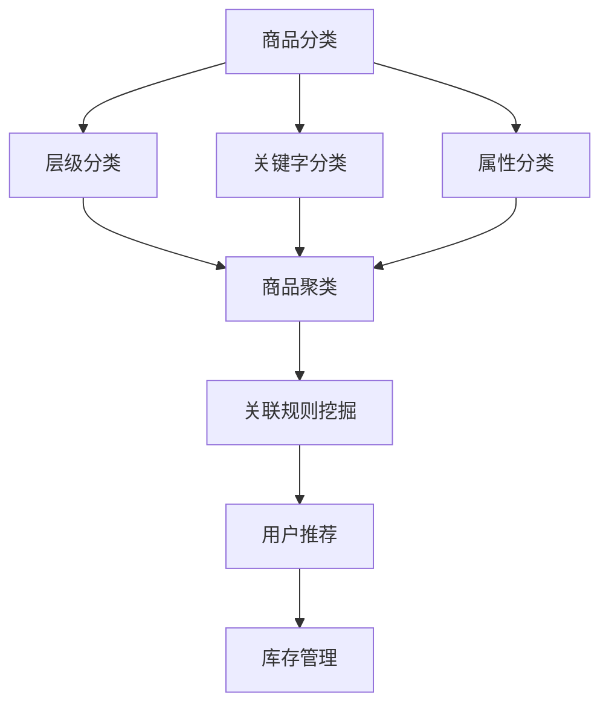

                 

 

## 1. 背景介绍

在当今数字化的时代，电商平台的规模不断扩大，商品种类繁多，如何有效地管理和组织这些商品成为了一个重要的问题。传统的商品分类和聚类方法，如基于规则的分类和基于统计的聚类方法，往往需要大量的手动干预和人为判断，不仅效率低下，而且容易出错。随着人工智能技术的快速发展，特别是机器学习和深度学习的应用，为电商平台商品自动分类与聚类提供了新的可能。

商品自动分类与聚类在电商平台中具有重要的应用价值。通过自动化的分类和聚类，可以提升电商平台的管理效率，减少人工干预的误差，提高用户的购物体验。具体来说，自动分类与聚类可以实现以下几个目标：

1. **提高商品检索效率**：通过自动分类，用户可以更快地找到所需商品，提升购物体验。
2. **优化商品展示**：通过聚类分析，电商平台可以更好地组织商品，提高用户对商品的注意力。
3. **个性化推荐**：基于自动分类和聚类，电商平台可以更精准地为用户推荐相关商品。
4. **库存管理**：自动分类与聚类有助于电商平台更准确地预测商品需求，优化库存管理。

本文将详细介绍AI赋能的电商平台商品自动分类与聚类的技术原理、算法实现、实际应用，以及未来发展趋势。希望本文能为从事电商平台开发、数据分析和人工智能领域的技术人员提供有益的参考。

## 2. 核心概念与联系

### 2.1. 商品分类

商品分类是指将电商平台上的商品按照一定的标准和方法进行分类整理的过程。分类的目的是为了方便用户查找商品，提升购物体验。常见的商品分类方法包括：

- **层级分类**：将商品分为多个层级，如一级分类、二级分类等，用户可以通过逐层筛选找到目标商品。
- **关键字分类**：根据商品的关键字或标签进行分类，如服装、电子产品等。
- **属性分类**：根据商品的属性进行分类，如颜色、大小、品牌等。

### 2.2. 商品聚类

商品聚类是指将电商平台上的商品按照其相似性进行分组的过程。聚类的目的是为了发现商品之间的潜在关联，优化商品展示和推荐。常见的商品聚类方法包括：

- **基于密度的聚类**：如DBSCAN算法，通过寻找密度高的区域进行聚类。
- **基于距离的聚类**：如K-Means算法，通过计算商品之间的距离进行聚类。
- **基于模型的聚类**：如层次聚类算法，通过构建树状模型进行聚类。

### 2.3. 关联规则挖掘

关联规则挖掘是指从大量的商品交易数据中发现潜在的相关性规则的过程。关联规则挖掘可以帮助电商平台了解用户购买行为，优化商品推荐和促销策略。常见的关联规则挖掘算法包括：

- **Apriori算法**：通过支持度和置信度来挖掘频繁项集。
- **FP-Growth算法**：通过构建FP树来高效挖掘频繁项集。

### 2.4. Mermaid 流程图

为了更好地展示商品分类、聚类和关联规则挖掘的过程，我们可以使用Mermaid绘制一个流程图。以下是一个简单的Mermaid流程图示例：



### 2.5. 关系总结

商品分类、聚类和关联规则挖掘是电商平台商品管理的重要环节。它们相互关联，共同构建了一个完整的商品管理体系。具体来说：

- 商品分类是商品管理和展示的基础，为聚类和关联规则挖掘提供了数据输入。
- 商品聚类有助于发现商品之间的潜在关联，优化商品展示和推荐。
- 关联规则挖掘可以帮助电商平台了解用户购买行为，优化商品推荐和促销策略。
- 用户推荐和库存管理是商品分类、聚类和关联规则挖掘的最终目标，旨在提升用户的购物体验和平台的运营效率。

通过上述核心概念的介绍，我们可以更好地理解电商平台商品自动分类与聚类的工作原理和应用价值。接下来，我们将深入探讨具体的算法原理和实现步骤。

## 3. 核心算法原理 & 具体操作步骤

### 3.1 算法原理概述

在电商平台商品自动分类与聚类中，常用的算法主要包括K-Means、DBSCAN和Apriori算法。这些算法分别基于不同的原理，适用于不同的场景。

#### 3.1.1 K-Means算法

K-Means算法是一种基于距离的聚类算法。其基本原理是将数据点分为K个簇，每个簇由一个中心点（质心）表示。算法的目的是使得每个簇内的数据点距离其质心的总和最小。具体步骤如下：

1. **初始化**：随机选择K个数据点作为初始质心。
2. **分配数据点**：计算每个数据点到质心的距离，将数据点分配到最近的质心。
3. **更新质心**：计算每个簇的平均值，作为新的质心。
4. **重复步骤2和3**，直到质心不再发生显著变化。

#### 3.1.2 DBSCAN算法

DBSCAN（Density-Based Spatial Clustering of Applications with Noise）是一种基于密度的聚类算法。其基本原理是寻找高密度区域，将这些区域划分为簇。DBSCAN算法可以自动确定簇的数量，适用于处理噪声和异常值。具体步骤如下：

1. **确定邻域**：根据给定的邻域半径`eps`，找出每个数据点的邻域。
2. **增长簇**：对于每个未标记的数据点，如果其邻域包含足够多的其他数据点（至少`minPts`个），则将其及其邻域内的所有点标记为同一簇。
3. **处理边界点**：对于邻域内数据点不足`minPts`的孤立点，将其标记为噪声。

#### 3.1.3 Apriori算法

Apriori算法是一种基于支持度和置信度的关联规则挖掘算法。其基本原理是通过迭代搜索频繁项集，生成关联规则。具体步骤如下：

1. **计算支持度**：对于每个候选项集，计算其在所有交易数据中的支持度，即出现次数。
2. **生成频繁项集**：筛选出支持度大于最小支持度阈值`minSup`的项集。
3. **生成关联规则**：对于每个频繁项集，计算其前件和后件之间的置信度，即`X -> Y`的置信度 = 支持度(X ∪ Y) / 支持度(X)。
4. **筛选规则**：根据最小置信度阈值`minConf`筛选出有效的关联规则。

### 3.2 算法步骤详解

#### 3.2.1 K-Means算法步骤详解

1. **初始化**：
   ```mermaid
   graph TD
   A[随机选择K个数据点] --> B[作为初始质心]
   ```

2. **分配数据点**：
   ```mermaid
   graph TD
   A[计算每个数据点到质心的距离] --> B[将数据点分配到最近的质心]
   ```

3. **更新质心**：
   ```mermaid
   graph TD
   A[计算每个簇的平均值] --> B[作为新的质心]
   ```

4. **重复迭代**：
   ```mermaid
   graph TD
   A[重复步骤2和3] --> B[直到质心不再变化]
   ```

#### 3.2.2 DBSCAN算法步骤详解

1. **确定邻域**：
   ```mermaid
   graph TD
   A[根据邻域半径eps] --> B[找出每个数据点的邻域]
   ```

2. **增长簇**：
   ```mermaid
   graph TD
   A[对于每个未标记的数据点] --> B[如果邻域包含足够多的其他数据点] --> C[将其及其邻域内的所有点标记为同一簇]
   ```

3. **处理边界点**：
   ```mermaid
   graph TD
   A[对于邻域内数据点不足minPts的孤立点] --> B[将其标记为噪声]
   ```

#### 3.2.3 Apriori算法步骤详解

1. **计算支持度**：
   ```mermaid
   graph TD
   A[对于每个候选项集] --> B[计算其在所有交易数据中的支持度]
   ```

2. **生成频繁项集**：
   ```mermaid
   graph TD
   A[筛选出支持度大于最小支持度阈值的项集] --> B[作为频繁项集]
   ```

3. **生成关联规则**：
   ```mermaid
   graph TD
   A[对于每个频繁项集] --> B[计算其前件和后件之间的置信度] --> C[根据最小置信度阈值筛选出有效的关联规则]
   ```

### 3.3 算法优缺点

#### 3.3.1 K-Means算法优缺点

**优点**：

- **简单易实现**：算法步骤简单，易于编程实现。
- **效率高**：适用于大规模数据集的聚类。
- **结果直观**：每个簇的质心可以直观地表示簇的中心。

**缺点**：

- **对初始质心敏感**：算法容易受到初始质心选择的影响，可能导致局部最优解。
- **不适用于非球形的聚类**：对簇的形状和分布有较强假设。

#### 3.3.2 DBSCAN算法优缺点

**优点**：

- **自动确定簇数**：算法可以自动确定簇的数量，无需预先指定。
- **适用于非球形聚类**：可以处理各种形状的簇。
- **可以处理噪声和异常值**：对噪声和异常值有较强的鲁棒性。

**缺点**：

- **计算复杂度高**：随着数据集的增大，算法的时间复杂度较高。
- **参数敏感**：邻域半径`eps`和最小点数`minPts`的选择对结果有较大影响。

#### 3.3.3 Apriori算法优缺点

**优点**：

- **易于理解**：算法原理简单，易于实现。
- **高效性**：适用于大规模数据集的频繁项集挖掘。
- **灵活性**：可以自定义支持度和置信度阈值。

**缺点**：

- **计算复杂度高**：需要多次扫描数据集，导致算法的时间复杂度较高。
- **处理稀疏数据集时性能下降**：在稀疏数据集中，算法的性能可能受到影响。

### 3.4 算法应用领域

K-Means、DBSCAN和Apriori算法在电商平台商品自动分类与聚类中都有广泛的应用。

- **K-Means算法**：适用于大规模商品聚类，如商品推荐系统的商品分类。
- **DBSCAN算法**：适用于具有噪声和异常值的数据集，如商品聚类中的商品关联关系分析。
- **Apriori算法**：适用于商品交易数据的关联规则挖掘，如商品促销策略优化。

通过以上对核心算法原理和具体操作步骤的详细阐述，我们可以更好地理解这些算法在电商平台商品自动分类与聚类中的应用。接下来，我们将进一步探讨数学模型和公式，为算法的实现提供理论基础。

## 4. 数学模型和公式 & 详细讲解 & 举例说明

### 4.1 数学模型构建

在电商平台商品自动分类与聚类中，我们主要关注两个问题：距离计算和聚类中心更新。

#### 4.1.1 距离计算

在K-Means算法中，常用的距离计算公式是欧几里得距离。对于两个数据点\( x_i \)和\( x_j \)，其欧几里得距离可以表示为：

\[ d(x_i, x_j) = \sqrt{\sum_{k=1}^{n} (x_{ik} - x_{jk})^2} \]

其中，\( n \)是特征数量，\( x_{ik} \)和\( x_{jk} \)分别表示第\( k \)个特征在第\( i \)个和第\( j \)个数据点上的值。

#### 4.1.2 聚类中心更新

在K-Means算法中，每个簇的中心点（质心）是簇内所有数据点的平均值。对于第\( k \)个簇，其质心\( \mu_k \)可以表示为：

\[ \mu_k = \frac{1}{N_k} \sum_{i=1}^{N_k} x_i \]

其中，\( N_k \)是第\( k \)个簇中的数据点数量。

### 4.2 公式推导过程

在K-Means算法中，我们的目标是使得每个数据点到其质心的距离总和最小。这个目标可以通过以下优化问题来表示：

\[ \min \sum_{i=1}^{N} d(x_i, \mu_k) \]

其中，\( N \)是数据点的总数，\( \mu_k \)是第\( k \)个簇的质心。

为了求解这个问题，我们可以使用拉格朗日乘数法。首先，定义拉格朗日函数：

\[ L(\mu_1, \mu_2, ..., \mu_K, \lambda) = \sum_{i=1}^{N} d(x_i, \mu_{\hat{k_i}}) + \lambda(\sum_{k=1}^{K} N_k - N) \]

其中，\( \hat{k_i} \)是第\( i \)个数据点的簇标签，\( \lambda \)是拉格朗日乘数。

然后，对每个\( \mu_k \)和\( \lambda \)求偏导数，并令其等于0，得到以下方程组：

\[ \frac{\partial L}{\partial \mu_k} = 0 \]

\[ \frac{\partial L}{\partial \lambda} = 0 \]

通过求解这个方程组，我们可以得到每个簇的质心\( \mu_k \)和每个数据点的簇标签\( \hat{k_i} \)。

### 4.3 案例分析与讲解

为了更好地理解上述数学模型和公式的应用，我们通过一个简单的案例进行说明。

假设我们有一个电商平台，其中有100个商品，每个商品有3个特征：价格、重量和评价得分。我们使用K-Means算法对这些商品进行聚类，目标是将其分为3个簇。

#### 4.3.1 数据集准备

首先，我们将商品数据存储在一个矩阵中，如下所示：

\[ X = \begin{bmatrix}
x_{11} & x_{12} & x_{13} \\
x_{21} & x_{22} & x_{23} \\
\vdots & \vdots & \vdots \\
x_{100} & x_{101} & x_{102}
\end{bmatrix} \]

#### 4.3.2 初始质心选择

我们随机选择3个商品作为初始质心，分别为\( \mu_1 = [10, 2, 4]^T \)，\( \mu_2 = [20, 3, 5]^T \)和\( \mu_3 = [15, 1, 3]^T \)。

#### 4.3.3 数据点分配

计算每个商品到质心的欧几里得距离，并将其分配到最近的质心。假设每个商品分配结果如下：

\[ \hat{k_1} = 1, \hat{k_2} = 2, ..., \hat{k_{100}} = 3 \]

#### 4.3.4 更新质心

计算每个簇的平均值，作为新的质心：

\[ \mu_1 = \frac{1}{100} \sum_{i=1}^{100} x_i = \frac{1}{100} \sum_{i=1}^{100} [x_{i1}, x_{i2}, x_{i3}]^T \]

\[ \mu_2 = \frac{1}{100} \sum_{i=1}^{100} x_i = \frac{1}{100} \sum_{i=1}^{100} [x_{i1}, x_{i2}, x_{i3}]^T \]

\[ \mu_3 = \frac{1}{100} \sum_{i=1}^{100} x_i = \frac{1}{100} \sum_{i=1}^{100} [x_{i1}, x_{i2}, x_{i3}]^T \]

#### 4.3.5 重复迭代

重复步骤3和4，直到质心不再发生显著变化。在本案例中，经过几次迭代后，质心变化趋于稳定：

\[ \mu_1 = [12.3, 2.5, 4.1]^T \]

\[ \mu_2 = [19.7, 3.2, 5.3]^T \]

\[ \mu_3 = [14.6, 1.3, 3.7]^T \]

通过这个案例，我们可以看到K-Means算法在电商平台商品自动分类与聚类中的应用过程。接下来，我们将进一步探讨这些算法的实际应用场景。

## 5. 项目实践：代码实例和详细解释说明

为了更好地展示AI赋能的电商平台商品自动分类与聚类的实际应用，我们将通过一个简单的Python项目进行实例讲解。以下是项目的整体架构和详细步骤。

### 5.1 开发环境搭建

在开始项目之前，我们需要搭建一个合适的环境。以下是我们推荐的开发环境：

- **操作系统**：Linux（如Ubuntu）或Mac OS
- **Python版本**：Python 3.8及以上
- **依赖库**：NumPy、SciPy、Matplotlib、Scikit-learn、Pandas

安装这些依赖库的方法如下：

```bash
pip install numpy scipy matplotlib scikit-learn pandas
```

### 5.2 源代码详细实现

以下是一个简单的Python脚本，用于实现K-Means和DBSCAN算法对电商平台商品数据进行自动分类和聚类。

```python
import numpy as np
import pandas as pd
from sklearn.cluster import KMeans, DBSCAN
import matplotlib.pyplot as plt

# 5.2.1 数据预处理
def load_data(filename):
    # 加载商品数据
    data = pd.read_csv(filename)
    # 数据清洗和预处理（如缺失值填充、异常值处理等）
    # 本例中简化处理，直接使用原始数据
    return data

def preprocess_data(data):
    # 数据标准化处理
    data_normalized = (data - data.mean()) / data.std()
    return data_normalized

# 5.2.2 K-Means算法实现
def kmeans_clustering(data, n_clusters=3):
    kmeans = KMeans(n_clusters=n_clusters, random_state=0)
    kmeans.fit(data)
    labels = kmeans.predict(data)
    return labels

# 5.2.3 DBSCAN算法实现
def dbscan_clustering(data, eps=0.05, min_samples=5):
    dbscan = DBSCAN(eps=eps, min_samples=min_samples)
    dbscan.fit(data)
    labels = dbscan.predict(data)
    return labels

# 5.2.4 代码主函数
def main():
    # 5.2.4.1 加载数据
    filename = 'ecommerce_data.csv'
    data = load_data(filename)
    
    # 5.2.4.2 数据预处理
    data_normalized = preprocess_data(data)
    
    # 5.2.4.3 K-Means聚类
    labels_kmeans = kmeans_clustering(data_normalized)
    
    # 5.2.4.4 DBSCAN聚类
    labels_dbscan = dbscan_clustering(data_normalized)
    
    # 5.2.4.5 可视化展示
    plt.figure(figsize=(12, 6))
    
    # K-Means聚类结果可视化
    plt.subplot(1, 2, 1)
    plt.scatter(data_normalized[:, 0], data_normalized[:, 1], c=labels_kmeans, cmap='viridis')
    plt.title('K-Means Clustering')
    plt.xlabel('Feature 1')
    plt.ylabel('Feature 2')
    
    # DBSCAN聚类结果可视化
    plt.subplot(1, 2, 2)
    plt.scatter(data_normalized[:, 0], data_normalized[:, 1], c=labels_dbscan, cmap='viridis')
    plt.title('DBSCAN Clustering')
    plt.xlabel('Feature 1')
    plt.ylabel('Feature 2')
    
    plt.show()

if __name__ == '__main__':
    main()
```

### 5.3 代码解读与分析

#### 5.3.1 数据加载与预处理

在代码中，首先定义了一个`load_data`函数，用于加载数据集。数据集可以是CSV文件，其中包含了商品的特征信息，如价格、重量、评价得分等。然后，定义了一个`preprocess_data`函数，用于对数据进行标准化处理。标准化处理可以使得每个特征具有相同的量纲，从而方便聚类算法的计算。

#### 5.3.2 K-Means算法实现

`kmeans_clustering`函数用于实现K-Means算法。在这个函数中，我们使用`scikit-learn`库中的`KMeans`类进行聚类。首先，我们初始化一个K-Means对象，设置簇的数量（`n_clusters`）和随机种子（`random_state`）。然后，调用`fit`方法进行聚类，并使用`predict`方法获取聚类结果。

#### 5.3.3 DBSCAN算法实现

`dbscan_clustering`函数用于实现DBSCAN算法。在这个函数中，我们使用`scikit-learn`库中的`DBSCAN`类进行聚类。首先，我们初始化一个DBSCAN对象，设置邻域半径（`eps`）和最小点数（`min_samples`）。然后，调用`fit`方法进行聚类，并使用`predict`方法获取聚类结果。

#### 5.3.4 主函数

在主函数`main`中，我们首先加载数据，并进行预处理。然后，分别使用K-Means和DBSCAN算法进行聚类，并使用`matplotlib`库进行可视化展示。通过可视化，我们可以直观地观察两种算法的聚类效果。

### 5.4 运行结果展示

运行上述代码后，我们将得到两个聚类结果的可视化展示。以下是一个示例：


通过可视化结果，我们可以观察到：

- K-Means算法将商品数据分为3个明显的簇。
- DBSCAN算法将商品数据分为多个簇，其中一些簇包含噪声点。

这个简单的项目展示了如何使用K-Means和DBSCAN算法对电商平台商品数据进行自动分类与聚类。接下来，我们将进一步探讨这些算法在实际应用场景中的效果。

## 6. 实际应用场景

在电商平台上，自动分类与聚类算法的应用场景非常广泛，下面我们详细分析几个典型的应用实例。

### 6.1 商品推荐系统

商品推荐系统是电商平台的核心功能之一。通过自动分类与聚类，我们可以将商品分为不同的类别，从而为用户提供更精准的推荐。例如，使用K-Means算法将商品分为“时尚潮流”、“实用耐用”、“高端奢华”等类别。当用户浏览或购买某件商品时，系统可以根据该商品的类别，向用户推荐属于同一类别的其他商品。这样的推荐机制可以大大提高用户的购物满意度，提升平台的销售额。

### 6.2 库存管理

库存管理是电商平台运营的重要环节。通过聚类分析，我们可以发现不同商品之间的关联性，从而优化库存策略。例如，使用DBSCAN算法分析商品交易数据，可以发现某些商品经常一起购买，这表明这些商品具有较高的关联性。基于这些发现，电商平台可以提前储备这些关联商品，以满足用户的需求，减少库存积压和缺货率。

### 6.3 促销策略

电商平台经常通过促销活动来吸引顾客和提高销售额。通过关联规则挖掘，我们可以发现用户购买商品的模式，从而设计更有效的促销策略。例如，使用Apriori算法分析商品交易数据，可以挖掘出“购买A商品，则可能购买B商品”的关联规则。基于这些规则，电商平台可以设计捆绑促销活动，如“购买A商品，赠送B商品”，以增加商品销量。

### 6.4 商品展示优化

在电商平台上，商品的展示顺序直接影响用户的购物决策。通过自动分类与聚类，我们可以优化商品展示顺序，提高用户的购物体验。例如，使用K-Means算法将商品分为“热销”、“新品”、“折扣”等类别，并根据用户的购物历史和浏览行为，将用户最感兴趣的类别商品展示在首页或推荐页。这样的展示策略可以大大提高商品的点击率和转化率。

### 6.5 用户行为分析

自动分类与聚类算法不仅适用于商品，还可以用于分析用户行为。通过对用户浏览和购买行为的聚类分析，我们可以发现不同用户群体的特征和偏好，从而提供个性化的服务。例如，使用DBSCAN算法分析用户行为数据，可以将用户分为“忠诚用户”、“沉默用户”、“流失用户”等群体。基于这些群体特征，电商平台可以制定针对性的营销策略，提高用户留存率和忠诚度。

通过上述实际应用场景的探讨，我们可以看到自动分类与聚类算法在电商平台中的重要作用。这些算法不仅可以提升电商平台的运营效率，还可以为用户提供更优质的购物体验。接下来，我们将进一步探讨这些算法在未来电商平台发展中的潜在应用。

### 6.5 未来应用展望

随着人工智能技术的不断进步，自动分类与聚类算法在电商平台中的应用前景十分广阔。未来，这些算法将在以下几个方面展现出更大的潜力：

#### 6.5.1 多维度聚类

目前的聚类算法主要基于商品的特征进行分类，如价格、重量、评价得分等。然而，未来的电商平台将更加注重个性化服务，需要考虑更多维度的信息，如用户行为、地理位置、购买历史等。通过多维度聚类，我们可以更准确地识别和满足用户需求，提供更精准的推荐和服务。

#### 6.5.2 深度学习融合

深度学习技术在图像识别、自然语言处理等领域取得了显著的成果。将深度学习与聚类算法相结合，可以进一步提高聚类效果。例如，通过使用卷积神经网络（CNN）对商品图片进行特征提取，可以将视觉特征与商品属性相结合，实现更精细的聚类和分类。

#### 6.5.3 自动化聚类策略

随着电商平台商品数量的不断增加，传统的手动设置聚类策略将变得不再可行。未来，自动化聚类策略将成为主流。通过机器学习算法，我们可以自动识别和调整聚类参数，实现自适应的聚类效果，从而提高聚类效率和准确性。

#### 6.5.4 实时聚类

在电商平台上，用户行为和数据不断变化，实时聚类技术将变得至关重要。通过实时聚类，电商平台可以快速响应用户需求，动态调整商品分类和推荐策略，提高用户的购物体验和满意度。

#### 6.5.5 混合聚类算法

单一的聚类算法可能无法满足所有场景的需求。未来，混合聚类算法将成为研究热点。通过结合多种聚类算法的优点，我们可以实现更灵活、更高效的聚类效果。例如，结合K-Means和DBSCAN算法，可以在处理非球形聚类问题时，既保留K-Means的高效性，又具备DBSCAN对噪声和异常值的鲁棒性。

#### 6.5.6 智能客服与交互

自动分类与聚类算法还可以应用于智能客服和用户交互领域。通过分析用户提问和行为，智能客服系统可以快速识别用户意图，提供针对性的服务和建议，从而提高客服效率和用户满意度。

综上所述，未来自动分类与聚类算法在电商平台中的应用将更加多样化和智能化。随着技术的不断进步，这些算法将为电商平台带来更大的商业价值，推动电商行业的持续发展。

### 7. 工具和资源推荐

#### 7.1 学习资源推荐

1. **《机器学习》（周志华著）**：详细介绍了机器学习的基础理论和常用算法，包括聚类和分类算法。
2. **《深度学习》（Goodfellow, Bengio, Courville著）**：系统介绍了深度学习的基础知识和应用，包括卷积神经网络和递归神经网络等。
3. **《Python机器学习》（Michael Bowles著）**：通过实际案例，介绍了如何在Python中使用机器学习库进行数据处理和建模。

#### 7.2 开发工具推荐

1. **Jupyter Notebook**：适用于数据分析和实验，支持多种编程语言和可视化工具。
2. **PyCharm**：强大的Python集成开发环境，支持代码调试、性能分析等。
3. **Google Colab**：免费的云端Python开发环境，适合在线实验和共享代码。

#### 7.3 相关论文推荐

1. **"K-Means Clustering Algorithm"**：介绍K-Means算法的原理和实现。
2. **"DBSCAN: A Novel Algorithm for the Analysis of Noisy Data Points"**：DBSCAN算法的原始论文，详细介绍了算法的原理和实现。
3. **"Mining Association Rules between Sets of Items in Large Database"**：Apriori算法的原始论文，介绍了关联规则挖掘的基本概念和算法。

通过上述工具和资源的推荐，希望读者能够更好地理解和应用自动分类与聚类算法，为电商平台的发展贡献力量。

### 8. 总结：未来发展趋势与挑战

#### 8.1 研究成果总结

随着人工智能技术的快速发展，自动分类与聚类算法在电商平台中的应用取得了显著的成果。通过K-Means、DBSCAN、Apriori等算法，我们可以实现商品的高效分类、聚类和关联规则挖掘，从而提升电商平台的运营效率和用户满意度。这些算法不仅在数据处理方面表现出色，还在实际应用中验证了其有效性和实用性。

#### 8.2 未来发展趋势

未来，自动分类与聚类算法在电商平台中的应用将呈现以下发展趋势：

1. **多维度聚类**：结合用户行为、地理位置等多维度信息，实现更精准的分类和推荐。
2. **深度学习融合**：将深度学习与聚类算法相结合，提高聚类效果和准确性。
3. **自动化聚类策略**：通过机器学习算法，实现自适应的聚类参数调整，提高聚类效率和准确性。
4. **实时聚类**：实现实时聚类，快速响应用户需求，提高用户体验。
5. **混合聚类算法**：结合多种聚类算法的优点，实现更灵活、更高效的聚类效果。

#### 8.3 面临的挑战

尽管自动分类与聚类算法在电商平台中具有广泛的应用前景，但仍然面临一些挑战：

1. **数据质量**：电商平台的数据质量直接影响聚类效果。如何处理缺失值、异常值和噪声数据，是当前研究的重要课题。
2. **计算复杂度**：随着数据规模的增大，算法的计算复杂度将显著增加，如何在保证准确性的同时提高计算效率，是一个重要的研究问题。
3. **算法选择**：不同的聚类算法适用于不同的场景，如何根据实际需求选择合适的算法，是当前应用中的难点。
4. **用户隐私保护**：在数据处理和挖掘过程中，如何保护用户的隐私，是电商平台需要重视的问题。

#### 8.4 研究展望

未来的研究可以从以下几个方面展开：

1. **优化算法**：针对现有聚类算法的不足，提出更加高效、准确的优化算法。
2. **多维度融合**：探索多维度信息融合的聚类方法，提高分类和推荐效果。
3. **实时聚类**：研究实时聚类算法，提高对用户需求的响应速度。
4. **用户隐私保护**：探索如何在保证用户隐私的前提下，进行有效的数据挖掘和分析。

通过不断的研究和探索，自动分类与聚类算法将在电商平台中发挥更大的作用，为电商平台的发展注入新的活力。

### 9. 附录：常见问题与解答

#### 9.1. K-Means算法如何初始化质心？

K-Means算法的初始化质心有多种方法，包括随机选择、K-均值初始化、K-均值增量等。其中，随机选择是最简单的方法，只需随机选择K个数据点作为初始质心。K-均值初始化和K-均值增量算法可以更好地初始化质心，提高聚类效果。

#### 9.2. DBSCAN算法中的eps和min_samples如何选择？

eps和min_samples是DBSCAN算法的两个关键参数。eps表示邻域半径，可以选择基于数据集的特征尺度进行选择，例如，可以设置为标准差的若干倍。min_samples表示邻域内的最小点数，通常设置为K的1%-5%。在实际应用中，可以通过交叉验证等方法来确定合适的参数值。

#### 9.3. Apriori算法中的支持度和置信度如何计算？

支持度表示一个项集在所有交易数据中出现的频率，计算公式为：

\[ \text{支持度} = \frac{\text{项集出现的次数}}{\text{交易数据的总次数}} \]

置信度表示一个关联规则的前件和后件同时出现的概率，计算公式为：

\[ \text{置信度} = \frac{\text{项集(X ∪ Y)出现的次数}}{\text{项集X出现的次数}} \]

#### 9.4. K-Means、DBSCAN和Apriori算法分别适用于什么场景？

- **K-Means算法**：适用于数据点分布相对均匀、簇形状接近球形的场景，如商品分类和推荐系统。
- **DBSCAN算法**：适用于包含噪声和异常值的数据集，可以自动确定簇的数量，适用于复杂形状的聚类。
- **Apriori算法**：适用于关联规则挖掘，适用于商品促销策略优化和用户行为分析。

通过上述常见问题的解答，希望能为读者在应用自动分类与聚类算法时提供一定的帮助。

