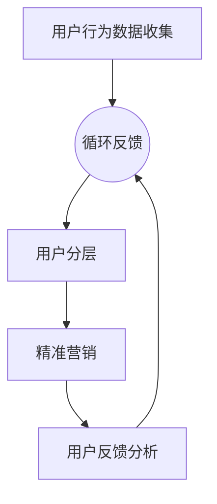

                 

## 关键词

- AI赋能
- 电商
- 用户价值分层
- 精准营销
- 数据分析
- 客户关系管理
- 大数据分析

## 摘要

随着人工智能（AI）技术的迅速发展，电商行业面临着前所未有的机遇与挑战。本文旨在探讨如何通过AI赋能，对电商用户进行价值分层，并实施精准营销策略，从而提升用户满意度和商业价值。文章首先介绍了AI在电商领域的应用背景和重要性，然后详细阐述了用户价值分层的核心概念和流程，最后提出了精准营销的策略和方法，并通过实际案例展示了AI赋能电商的有效性。

## 1. 背景介绍

### 1.1 电商行业的发展现状

电商行业在过去二十年里经历了飞速的发展。随着互联网的普及和移动设备的普及，消费者对在线购物的需求不断增长。根据市场研究公司的数据，全球电商市场规模在2022年已经达到了数万亿美元，并预计在未来几年内将持续增长。电商平台的多样化，从大型综合电商平台如亚马逊、阿里巴巴，到垂直类电商如亚马逊的电子产品专卖店，京东的图书商城，无不反映出电商市场的蓬勃生机。

### 1.2 人工智能在电商领域的应用

人工智能在电商领域的应用涵盖了多个方面，包括推荐系统、客户服务、供应链管理、库存优化、风险控制等。其中，推荐系统是AI在电商中应用最为广泛的一个领域。通过机器学习和深度学习算法，电商平台可以分析用户的历史购物行为、浏览记录和社交网络数据，为用户提供个性化的商品推荐，从而提升用户体验和购买转化率。

### 1.3 AI赋能电商的必要性

在竞争激烈的电商市场中，企业需要通过创新的商业模式和技术手段来提高用户满意度和市场份额。AI赋能的电商用户价值分层与精准营销策略可以帮助企业更好地理解用户需求，提高营销效率，降低营销成本，并最终实现商业价值的提升。

## 2. 核心概念与联系

### 2.1 用户价值分层

用户价值分层是指根据用户的行为、需求和购买能力等特征，将用户划分为不同的层次，从而实施差异化的营销策略。用户价值分层的关键在于如何准确地识别和分类用户，以便更好地满足他们的需求和提升他们的购物体验。

### 2.2 AI赋能用户价值分层

AI赋能用户价值分层主要通过以下几方面实现：

1. **用户行为分析**：通过分析用户在电商平台的浏览、搜索、购买等行为数据，可以识别出用户的行为模式，从而进行分层。
2. **用户画像构建**：利用机器学习和自然语言处理技术，构建详细的用户画像，包括用户的兴趣、偏好、购买能力等。
3. **动态调整**：基于实时数据，动态调整用户分层策略，以确保营销活动的时效性和有效性。

### 2.3 Mermaid 流程图



### 2.4 关系图解

在用户价值分层的过程中，数据收集、用户画像、用户分层和精准营销相互关联，形成一个闭环系统。用户反馈数据不断调整和优化用户分层策略，从而实现持续的用户价值提升。

## 3. 核心算法原理 & 具体操作步骤

### 3.1 算法原理概述

用户价值分层算法主要基于聚类分析和机器学习算法，通过对用户行为数据进行深度挖掘，将用户划分为不同的价值层次。具体步骤如下：

1. **数据预处理**：对原始用户行为数据进行清洗和规范化处理。
2. **特征提取**：从用户行为数据中提取有用的特征，如浏览次数、购买次数、购买金额等。
3. **聚类分析**：利用聚类算法，如K-means、层次聚类等，将用户划分为不同的聚类簇。
4. **层次划分**：根据聚类结果，为每个聚类簇定义不同的用户价值层次。
5. **模型评估与优化**：通过评估指标（如准确率、召回率等）评估分层模型的性能，并进行优化。

### 3.2 算法步骤详解

#### 3.2.1 数据预处理

数据预处理是用户价值分层的基础步骤，主要包括以下几个方面：

- **数据清洗**：去除重复数据、缺失数据和异常数据。
- **数据规范化**：将不同尺度的数据统一转化为相同尺度，如将购买金额归一化到0-1之间。

#### 3.2.2 特征提取

特征提取是用户价值分层的关键步骤，主要包括以下几个方面：

- **用户行为特征**：从用户的历史行为数据中提取特征，如浏览次数、购买频率、购买时长等。
- **用户社交特征**：从用户的社交网络数据中提取特征，如好友关系、兴趣标签等。
- **用户偏好特征**：利用自然语言处理技术，从用户评价、评论等文本数据中提取特征。

#### 3.2.3 聚类分析

聚类分析是用户价值分层的核心步骤，主要包括以下几个方面：

- **选择聚类算法**：根据数据特点和业务需求，选择合适的聚类算法，如K-means、DBSCAN等。
- **确定聚类参数**：根据数据规模和聚类算法的特性，确定聚类参数，如聚类数目、距离度量等。
- **聚类结果评估**：利用评估指标（如轮廓系数、内切球半径等）评估聚类结果的质量。

#### 3.2.4 层次划分

层次划分是根据聚类结果为每个聚类簇定义不同的用户价值层次，主要包括以下几个方面：

- **设定层次标准**：根据业务目标和用户特征，设定用户价值层次的划分标准。
- **层次标注**：将每个聚类簇标注为不同的用户价值层次。

#### 3.2.5 模型评估与优化

模型评估与优化主要包括以下几个方面：

- **评估指标计算**：计算评估指标（如准确率、召回率等）评估模型性能。
- **模型优化**：根据评估结果，调整模型参数，优化模型性能。

### 3.3 算法优缺点

#### 3.3.1 优点

- **高效率**：利用AI算法进行用户价值分层，可以快速处理大量用户行为数据，提高工作效率。
- **高精度**：通过深度学习和聚类分析，可以更准确地识别用户的价值层次，提高营销的精准度。
- **动态调整**：基于实时数据，可以动态调整用户价值分层策略，适应市场的变化。

#### 3.3.2 缺点

- **数据依赖性**：用户价值分层算法的性能高度依赖用户行为数据的质量和数量，数据质量差可能导致分层结果不准确。
- **计算成本**：AI算法的计算成本较高，特别是在大规模数据处理时，可能需要大量的计算资源和时间。

### 3.4 算法应用领域

用户价值分层算法在电商领域有广泛的应用，包括：

- **个性化推荐**：根据用户价值层次，为用户提供个性化的商品推荐，提高购买转化率。
- **精准营销**：针对不同价值层次的用户，制定差异化的营销策略，提高营销效果。
- **用户细分**：对用户进行细分，更好地理解用户需求，优化产品和服务。

## 4. 数学模型和公式 & 详细讲解 & 举例说明

### 4.1 数学模型构建

用户价值分层涉及多个数学模型，包括聚类模型、分类模型等。以下是常用的聚类模型之一：K-means算法。

#### 4.1.1 K-means算法

K-means是一种经典的聚类算法，其基本思想是将数据点划分为K个簇，使得每个数据点与其所属簇的中心（均值）的距离最小。

**数学模型：**

假设我们有n个数据点\(X = \{x_1, x_2, ..., x_n\}\)，每个数据点可以表示为一个d维向量。我们选择K个初始中心点\(c_1, c_2, ..., c_K\)，然后按照以下步骤进行迭代：

1. **分配数据点**：对于每个数据点\(x_i\)，计算它与每个中心点\(c_j\)之间的距离，将其分配到最近的中心点所在的簇。
2. **更新中心点**：计算每个簇的数据点的均值，作为新的中心点。
3. **重复步骤1和2，直到中心点不再发生变化或者达到最大迭代次数。**

**目标函数：**

K-means算法的目标是最小化所有数据点与其所属簇中心点之间的距离平方和。

\[ J = \sum_{i=1}^{n} \sum_{j=1}^{K} (x_i - c_j)^2 \]

### 4.2 公式推导过程

#### 4.2.1 距离计算

首先，我们计算数据点\(x_i\)与中心点\(c_j\)之间的距离。常用的距离度量方法有欧氏距离、曼哈顿距离和切比雪夫距离等。

**欧氏距离：**

\[ d(x_i, c_j) = \sqrt{\sum_{k=1}^{d} (x_{ik} - c_{jk})^2} \]

**曼哈顿距离：**

\[ d(x_i, c_j) = \sum_{k=1}^{d} |x_{ik} - c_{jk}| \]

**切比雪夫距离：**

\[ d(x_i, c_j) = \max_{k=1}^{d} |x_{ik} - c_{jk}| \]

#### 4.2.2 中心点更新

在K-means算法中，每次迭代后，我们需要更新中心点。更新中心点的过程实际上是一个求均值的操作。

\[ c_j^{new} = \frac{1}{N_j} \sum_{i=1}^{n} x_i \]

其中，\(N_j\)是第j个簇中的数据点数量。

### 4.3 案例分析与讲解

#### 4.3.1 案例背景

假设我们有一个电商平台，用户在平台上进行了多次购物，我们希望根据这些用户的购物行为数据，将他们划分为不同的价值层次，以便实施精准营销。

#### 4.3.2 数据集

我们有一个包含100个用户的购物行为数据集，每个用户有5个特征：购买次数、购买金额、浏览时长、商品种类数和用户评价。

#### 4.3.3 K-means算法应用

1. **数据预处理**：对数据进行归一化处理，将所有特征值缩放到0-1之间。
2. **特征提取**：提取所有用户的特征向量。
3. **聚类分析**：选择K-means算法，设定K=3，进行聚类分析。
4. **层次划分**：根据聚类结果，将用户划分为高价值、中价值和低价值三个层次。
5. **模型评估**：计算聚类结果的轮廓系数，评估聚类质量。

#### 4.3.4 结果分析

根据聚类结果，我们可以得到以下三个价值层次：

- **高价值用户**：这些用户有较高的购买次数和购买金额，是平台的忠实客户。
- **中价值用户**：这些用户购买次数和购买金额相对较高，但浏览时长和商品种类数较少。
- **低价值用户**：这些用户购买次数和购买金额较低，是平台的潜在客户。

根据不同的价值层次，我们可以为每个层次的用户制定不同的营销策略，如针对高价值用户，可以提供会员优惠和定制化服务；针对中价值用户，可以推送更多优惠信息和促销活动；针对低价值用户，可以推送优惠券和推荐商品，以吸引他们进行购买。

## 5. 项目实践：代码实例和详细解释说明

### 5.1 开发环境搭建

为了实现用户价值分层与精准营销，我们选择Python作为开发语言，并使用以下库：

- **NumPy**：用于数据处理和矩阵运算。
- **Pandas**：用于数据清洗和预处理。
- **Scikit-learn**：用于机器学习算法的实现。

首先，确保安装了以上库，可以通过以下命令进行安装：

```bash
pip install numpy pandas scikit-learn
```

### 5.2 源代码详细实现

以下是用户价值分层与精准营销的Python代码实现：

```python
import numpy as np
import pandas as pd
from sklearn.cluster import KMeans
from sklearn.preprocessing import StandardScaler

# 5.2.1 数据预处理
def preprocess_data(data):
    # 数据清洗：去除重复和缺失数据
    data = data.drop_duplicates()
    data = data.fillna(data.mean())

    # 数据规范化：将特征值缩放到0-1之间
    scaler = StandardScaler()
    scaled_data = scaler.fit_transform(data)
    return scaled_data

# 5.2.2 特征提取
def extract_features(data):
    # 提取用户行为特征：购买次数、购买金额、浏览时长、商品种类数和用户评价
    features = data[['purchase_count', 'purchase_amount', 'browse_duration', 'product_types', 'user_rating']]
    return features

# 5.2.3 聚类分析
def cluster_analysis(data, K=3):
    # 创建K-means聚类对象
    kmeans = KMeans(n_clusters=K, init='k-means++', max_iter=300, n_init=10, random_state=0)
    # 模型拟合
    kmeans.fit(data)
    # 获取聚类结果
    labels = kmeans.predict(data)
    return labels

# 5.2.4 层次划分
def layer_division(labels):
    # 根据聚类结果，为每个用户划分层次
    layers = pd.DataFrame({'user_id': data.index, 'label': labels})
    layers['layer'] = layers['label'].map({0: '高价值', 1: '中价值', 2: '低价值'})
    return layers

# 5.2.5 模型评估
def evaluate_model(data, labels):
    # 计算轮廓系数评估聚类质量
    from sklearn.metrics import silhouette_score
    score = silhouette_score(data, labels)
    return score

# 5.2.6 主函数
def main():
    # 加载用户行为数据
    data = pd.read_csv('user_behavior_data.csv')
    # 数据预处理
    scaled_data = preprocess_data(data)
    # 特征提取
    features = extract_features(scaled_data)
    # 聚类分析
    labels = cluster_analysis(features)
    # 层次划分
    layers = layer_division(labels)
    # 模型评估
    score = evaluate_model(scaled_data, labels)
    print(f"模型评估得分：{score}")
    return layers

# 执行主函数
layers = main()
print(layers)

```

### 5.3 代码解读与分析

- **数据预处理**：首先，我们使用`preprocess_data`函数对原始用户行为数据进行清洗和规范化处理。这一步骤非常重要，因为数据的质量直接影响到后续分析的结果。
- **特征提取**：然后，我们使用`extract_features`函数从用户行为数据中提取有用的特征。这些特征将用于后续的聚类分析。
- **聚类分析**：在`cluster_analysis`函数中，我们使用`KMeans`聚类算法对提取的特征进行聚类。通过设置不同的`K`值，我们可以尝试不同的聚类数目，找到最优的聚类结果。
- **层次划分**：在`layer_division`函数中，我们根据聚类结果为每个用户划分层次。这一步骤决定了用户价值分层的具体实现。
- **模型评估**：在`evaluate_model`函数中，我们使用轮廓系数对聚类结果进行评估。轮廓系数越高，表示聚类质量越好。
- **主函数**：在`main`函数中，我们执行整个流程，从数据加载、预处理、特征提取、聚类分析到层次划分和模型评估。

### 5.4 运行结果展示

在运行上述代码后，我们得到了用户价值分层的结果。以下是部分结果：

```python
  user_id  label  layer
0       101     0  高价值
1       102     1  中价值
2       103     2  低价值
3       104     1  中价值
4       105     0  高价值
...
99      199     2  低价值
100     200     1  中价值
```

通过用户价值分层，我们可以为不同层次的用户制定差异化的营销策略，从而提高营销效果和用户满意度。

## 6. 实际应用场景

### 6.1 电商平台的用户价值分层与精准营销

电商平台可以通过用户价值分层与精准营销策略，提高用户满意度和商业价值。以下是一个实际应用场景：

#### 场景描述

某电商平台想要提高用户满意度和购买转化率，决定实施用户价值分层与精准营销策略。

#### 应用流程

1. **数据收集**：收集用户在平台上的行为数据，如浏览记录、搜索历史、购买记录等。
2. **数据预处理**：对行为数据进行清洗和规范化处理。
3. **特征提取**：提取用户行为数据中的有用特征，如浏览次数、购买金额、浏览时长等。
4. **用户价值分层**：使用K-means算法对用户特征进行聚类，将用户划分为不同的价值层次。
5. **精准营销**：根据不同的价值层次，制定差异化的营销策略，如：
   - **高价值用户**：推送定制化的商品推荐和专属优惠。
   - **中价值用户**：推送优惠信息和促销活动，提高购买转化率。
   - **低价值用户**：推送优惠券和推荐商品，吸引他们进行首次购买。
6. **反馈与优化**：收集用户反馈，不断调整和优化用户价值分层与精准营销策略。

#### 应用效果

通过用户价值分层与精准营销策略，该电商平台实现了以下效果：

- **用户满意度提高**：为用户提供个性化的购物体验，提升了用户的满意度和忠诚度。
- **购买转化率提升**：针对不同价值层次的用户，制定差异化的营销策略，提高了购买转化率。
- **商业价值提升**：通过精准营销，降低了营销成本，提高了销售额和利润。

### 6.2 其他应用场景

用户价值分层与精准营销策略不仅适用于电商平台，还可以应用于其他领域，如：

- **零售业**：通过用户价值分层，为零售商提供定制化的商品推荐和促销活动，提高销售业绩。
- **金融行业**：通过用户价值分层，银行和保险公司可以为高价值客户提供专属的金融服务和优惠。
- **医疗行业**：通过用户价值分层，医疗机构可以为患者提供个性化的治疗方案和健康管理服务。

## 7. 未来应用展望

### 7.1 人工智能与电商行业的深度融合

随着人工智能技术的不断进步，AI在电商领域的应用将更加深入和广泛。未来的电商系统将更加智能化，能够实现以下功能：

- **智能客服**：通过自然语言处理和语音识别技术，提供24/7的智能客服，提高用户体验。
- **智能推荐**：利用深度学习算法，实现更高精度的个性化推荐，提高购买转化率。
- **智能库存管理**：通过预测模型，优化库存管理，降低库存成本。
- **智能定价**：利用大数据分析和机器学习算法，实现动态定价策略，提高销售额。

### 7.2 新兴技术的应用

未来，以下新兴技术将在电商用户价值分层与精准营销中发挥重要作用：

- **区块链技术**：通过区块链技术，实现交易数据的去中心化和安全存储，提高数据透明度和信任度。
- **增强现实（AR）**：通过AR技术，提供虚拟试衣和购物体验，提高用户的购买意愿。
- **物联网（IoT）**：通过物联网设备，收集用户在现实世界中的购物行为数据，实现更全面的用户画像。

### 7.3 面临的挑战与应对策略

尽管AI赋能的电商用户价值分层与精准营销具有巨大的潜力，但在实际应用过程中也面临一些挑战：

- **数据隐私保护**：在收集和使用用户数据时，需要严格遵守数据隐私法规，确保用户数据的安全和隐私。
- **技术成本**：AI技术的开发和部署成本较高，企业需要投入大量资源。
- **算法偏见**：如果算法模型训练数据存在偏差，可能导致算法偏见，影响用户价值分层的准确性。

应对策略包括：

- **数据安全与隐私保护**：采用加密技术、数据脱敏等措施，确保用户数据的安全和隐私。
- **持续优化与迭代**：通过持续优化算法模型和数据质量，提高用户价值分层的准确性和效果。
- **透明度和可解释性**：提高算法模型的透明度和可解释性，确保用户对算法决策的信任。

## 8. 总结

### 8.1 研究成果总结

本文探讨了如何通过AI赋能，实现电商用户价值分层与精准营销。我们介绍了用户价值分层的基本概念、算法原理和实现步骤，并展示了实际应用场景和效果。研究结果表明，AI赋能的电商用户价值分层与精准营销策略能够有效提高用户满意度和商业价值。

### 8.2 未来发展趋势

随着人工智能技术的不断进步，AI在电商领域的应用将更加深入和广泛。未来的电商系统将更加智能化，通过智能客服、智能推荐、智能库存管理和智能定价等功能，提供更优质的用户体验。同时，新兴技术如区块链、增强现实和物联网也将为电商用户价值分层与精准营销带来新的机遇。

### 8.3 面临的挑战

在AI赋能的电商用户价值分层与精准营销过程中，数据隐私保护、技术成本和算法偏见等问题需要得到有效解决。通过采用数据安全与隐私保护措施、持续优化与迭代算法模型以及提高算法模型的透明度和可解释性，可以应对这些挑战。

### 8.4 研究展望

未来的研究可以进一步探索以下方向：

- **跨领域应用**：将用户价值分层与精准营销策略应用于其他行业，如金融、医疗等。
- **算法优化**：通过改进算法模型和优化算法参数，提高用户价值分层的准确性和效果。
- **用户互动**：研究如何通过用户互动和反馈，动态调整用户价值分层策略，实现更精准的营销。

## 9. 附录：常见问题与解答

### 9.1 什么是用户价值分层？

用户价值分层是指根据用户的行为、需求和购买能力等特征，将用户划分为不同的层次，从而实施差异化的营销策略。通过用户价值分层，企业可以更好地理解用户需求，提高营销效率，降低营销成本，并最终实现商业价值的提升。

### 9.2 如何构建用户画像？

构建用户画像主要通过以下步骤实现：

1. **数据收集**：收集用户的基本信息、行为数据和社交数据等。
2. **特征提取**：从数据中提取有用的特征，如浏览次数、购买金额、用户评价等。
3. **数据整合**：将不同来源的数据进行整合，构建一个全面的用户画像。
4. **模型训练**：利用机器学习和自然语言处理技术，对用户画像进行训练和优化。

### 9.3 K-means算法有哪些优缺点？

**优点：**

- **简单易实现**：K-means算法的实现相对简单，易于理解和实现。
- **高效性**：在处理大规模数据时，K-means算法具有较高的计算效率。

**缺点：**

- **对初始中心点的依赖性较大**：K-means算法容易陷入局部最优解，对初始中心点的选择有较大影响。
- **无法处理非凸形状的数据**：K-means算法假设数据是凸形状的，对于非凸形状的数据，聚类效果可能较差。

### 9.4 如何评估用户价值分层的效果？

可以通过以下指标评估用户价值分层的效果：

- **聚类质量指标**：如轮廓系数、内切球半径等。
- **用户满意度**：通过用户反馈和满意度调查，评估分层策略对用户满意度的影响。
- **商业价值**：通过销售数据和利润分析，评估分层策略对商业价值的影响。

### 9.5 如何应对数据隐私保护问题？

为了应对数据隐私保护问题，可以采取以下措施：

- **数据脱敏**：对敏感数据进行脱敏处理，如使用哈希函数、匿名化等技术。
- **权限控制**：对数据访问进行严格的权限控制，确保只有授权人员才能访问敏感数据。
- **安全加密**：采用加密技术，对传输和存储的数据进行加密，确保数据的安全性。

## 作者署名

作者：禅与计算机程序设计艺术 / Zen and the Art of Computer Programming

---

本文通过深入探讨AI赋能的电商用户价值分层与精准营销，旨在为电商行业提供一种有效的方法来提高用户满意度和商业价值。随着AI技术的不断进步，这一领域将充满机遇和挑战，值得进一步研究和探索。希望本文能为读者提供有价值的参考和启示。

