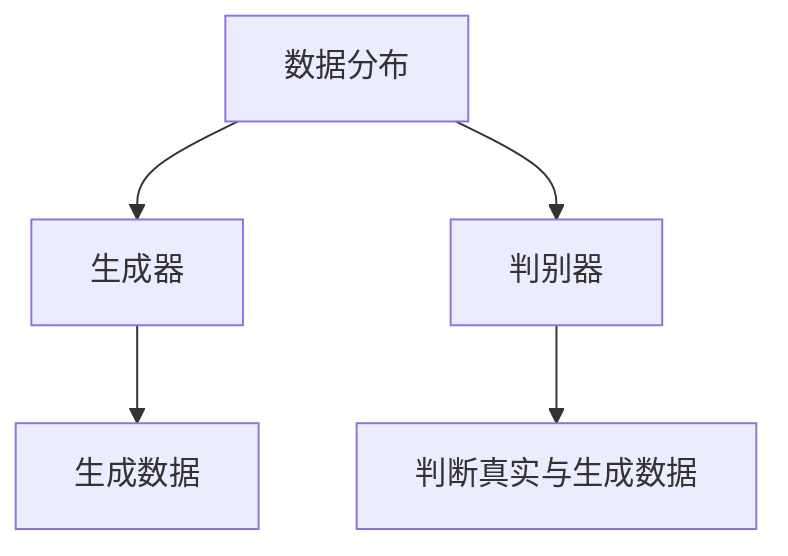
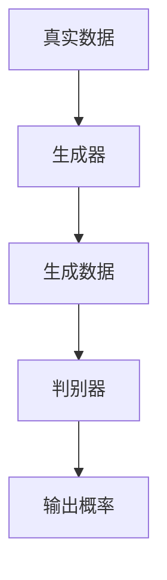

                 

关键词：生成式AI，生成模型，生活应用，未来趋势，挑战

> 摘要：生成式AI正迅速改变我们的生活，从创造数字内容到自动化任务，其潜在影响无处不在。本文将探讨生成式AI的核心概念、算法原理、数学模型、实际应用和未来趋势。

## 1. 背景介绍

在信息技术飞速发展的今天，人工智能（AI）已经成为推动创新和变革的关键力量。生成式AI，作为AI的一个重要分支，旨在通过学习数据生成新的、有创意的内容。生成式AI的核心目标是模仿人类创造力和决策过程，从而实现自动化内容和数据的生成。

生成式AI的应用场景非常广泛，包括但不限于：图像生成、音乐创作、自然语言处理、游戏开发等。随着技术的进步，生成式AI的能力也在不断扩展，其潜力令人瞩目。

## 2. 核心概念与联系

### 2.1 生成模型

生成模型是一类特殊的机器学习模型，其主要目的是学习数据分布并生成新的数据。生成模型分为两类：概率生成模型和确定生成模型。

#### 2.1.1 概率生成模型

概率生成模型（如变分自编码器（VAE））通过学习数据分布的参数来生成数据。其核心思想是生成器（Generator）和判别器（Discriminator）之间的博弈。



#### 2.1.2 确定生成模型

确定生成模型（如生成对抗网络（GAN））通过生成器和判别器之间的竞争来生成高质量的数据。生成器试图生成与真实数据难以区分的样本，而判别器则试图区分真实数据和生成数据。



### 2.2 生成式AI与生活应用

生成式AI的应用正在不断扩展，其已经在多个领域显示出巨大的潜力。

#### 2.2.1 图像生成

图像生成是生成式AI最直接的应用之一。通过生成模型，我们可以生成逼真的图像、动画甚至视频。这在游戏开发、电影特效和艺术创作中都有广泛应用。

#### 2.2.2 音乐创作

生成式AI可以生成新的音乐作品，从简单的旋律到复杂的交响乐。这对于音乐创作者和爱好者来说都是一个革命性的变化。

#### 2.2.3 自然语言处理

自然语言处理（NLP）是生成式AI的另一个重要应用领域。通过生成模型，我们可以生成文章、对话和翻译等。

## 3. 核心算法原理 & 具体操作步骤

### 3.1 算法原理概述

生成式AI的核心算法主要包括生成器和判别器。生成器通过学习数据分布生成新数据，判别器则通过区分真实数据和生成数据来评估生成器的性能。

### 3.2 算法步骤详解

1. **数据准备**：收集大量真实数据，用于训练生成器和判别器。
2. **生成器训练**：生成器通过学习数据分布生成新数据。
3. **判别器训练**：判别器通过区分真实数据和生成数据来评估生成器的性能。
4. **迭代**：生成器和判别器交替训练，优化模型参数。

### 3.3 算法优缺点

#### 优点

- **强大的生成能力**：生成式AI能够生成高质量、多样化的数据。
- **自动化**：生成式AI可以自动化许多数据生成任务，减少人工干预。

#### 缺点

- **计算成本高**：生成式AI的训练和推理过程需要大量计算资源。
- **数据质量要求高**：生成式AI的性能很大程度上取决于训练数据的质量。

### 3.4 算法应用领域

- **娱乐行业**：图像生成、音乐创作、虚拟现实等。
- **医疗领域**：医学图像生成、药物发现等。
- **工业制造**：自动化产品设计、生产优化等。

## 4. 数学模型和公式 & 详细讲解 & 举例说明

### 4.1 数学模型构建

生成式AI的数学模型通常基于概率分布。例如，生成对抗网络（GAN）中的生成器和判别器分别对应概率分布的生成过程和评估过程。

### 4.2 公式推导过程

生成对抗网络（GAN）的数学公式如下：

$$
\begin{align*}
& \text{生成器：} G(z) = x \\
& \text{判别器：} D(x) > D(G(z))
\end{align*}
$$

其中，$z$ 是噪声向量，$x$ 是生成器生成的数据，$D$ 是判别器的输出概率。

### 4.3 案例分析与讲解

#### 4.3.1 图像生成

假设我们使用GAN生成人脸图像。首先，我们收集大量人脸图像作为训练数据。然后，我们使用生成器和判别器进行训练。在训练过程中，生成器的目标是生成逼真的人脸图像，而判别器的目标是区分真实人脸图像和生成人脸图像。通过交替训练，我们可以优化生成器和判别器的性能。

## 5. 项目实践：代码实例和详细解释说明

### 5.1 开发环境搭建

我们需要安装Python和TensorFlow等依赖库。可以使用以下命令进行安装：

```bash
pip install tensorflow
```

### 5.2 源代码详细实现

以下是使用生成对抗网络（GAN）生成人脸图像的Python代码：

```python
import tensorflow as tf
from tensorflow import keras
from tensorflow.keras import layers

# 定义生成器和判别器
def make_generator_model():
    model = keras.Sequential()
    model.add(layers.Dense(128, activation='relu', input_shape=(100,)))
    model.add(layers.Dense(128, activation='relu'))
    model.add(layers.Dense(784, activation='tanh'))
    return model

def make_discriminator_model():
    model = keras.Sequential()
    model.add(layers.Flatten(input_shape=(28, 28)))
    model.add(layers.Dense(1, activation='sigmoid'))
    return model

# 定义损失函数
def discriminator_loss(real_output, fake_output):
    real_loss = tf.reduce_mean(tf.nn.sigmoid_cross_entropy_with_logits(logits=real_output, labels=tf.ones_like(real_output)))
    fake_loss = tf.reduce_mean(tf.nn.sigmoid_cross_entropy_with_logits(logits=fake_output, labels=tf.zeros_like(fake_output)))
    total_loss = real_loss + fake_loss
    return total_loss

# 定义优化器
generator_optimizer = keras.optimizers.Adam(1e-4)
discriminator_optimizer = keras.optimizers.Adam(1e-4)

# 训练模型
@tf.function
def train_step(images, noise):
    with tf.GradientTape() as gen_tape, tf.GradientTape() as disc_tape:
        generated_images = generator(noise, training=True)

        real_output = discriminator(images, training=True)
        fake_output = discriminator(generated_images, training=True)

        gen_loss = generator_loss(fake_output)
        disc_loss = discriminator_loss(real_output, fake_output)

    gradients_of_generator = gen_tape.gradient(gen_loss, generator.trainable_variables)
    gradients_of_discriminator = disc_tape.gradient(disc_loss, discriminator.trainable_variables)

    generator_optimizer.apply_gradients(zip(gradients_of_generator, generator.trainable_variables))
    discriminator_optimizer.apply_gradients(zip(gradients_of_discriminator, discriminator.trainable_variables))

def train(dataset, epochs):
    for epoch in range(epochs):
        for image_batch, _ in dataset:
            noise = tf.random.normal([image_batch.shape[0], 100])

            train_step(image_batch, noise)

# 加载数据集
BUFFER_SIZE = 60000
BATCH_SIZE = 256

# 将MNIST数据集加载到内存中
(train_images, train_labels), (_, _) = keras.datasets.mnist.load_data()

train_images = train_images.reshape(train_images.shape[0], 28, 28, 1).astype('float32')
train_images = (train_images - 127.5) / 127.5  # Normalize the images to [-1, 1]

# 创建一个数据集对象
train_dataset = tf.data.Dataset.from_tensor_slices(train_images).shuffle(BUFFER_SIZE).batch(BATCH_SIZE)

# 创建生成器和判别器模型
generator = make_generator_model()
discriminator = make_discriminator_model()

# 开始训练模型
EPOCHS = 50
train(train_dataset, EPOCHS)
```

### 5.3 代码解读与分析

这段代码首先定义了生成器和判别器的模型结构。然后，我们定义了损失函数和优化器，用于在训练过程中更新模型参数。在训练过程中，我们使用真实数据和生成数据来训练判别器，并使用生成数据来训练生成器。通过交替训练，我们可以优化生成器和判别器的性能。

### 5.4 运行结果展示

通过运行这段代码，我们可以看到生成器生成的人脸图像。这些图像的质量取决于训练数据的质量和模型的性能。通常，随着训练的进行，生成图像的质量会逐渐提高。

## 6. 实际应用场景

生成式AI已经在多个实际应用场景中显示出巨大的潜力。以下是一些典型的应用场景：

- **娱乐行业**：图像生成、音乐创作、虚拟现实等。
- **医疗领域**：医学图像生成、药物发现等。
- **工业制造**：自动化产品设计、生产优化等。

## 7. 工具和资源推荐

### 7.1 学习资源推荐

- 《生成对抗网络（GAN）深度学习》（作者：Ian J. Goodfellow等）
- 《深度学习》（作者：Ian J. Goodfellow、Yoshua Bengio和Aaron Courville）

### 7.2 开发工具推荐

- TensorFlow
- PyTorch

### 7.3 相关论文推荐

- “Generative Adversarial Nets”（作者：Ian J. Goodfellow等）
- “Unsupervised Representation Learning with Deep Convolutional Generative Adversarial Networks”（作者：Alec Radford等）

## 8. 总结：未来发展趋势与挑战

### 8.1 研究成果总结

生成式AI已经取得了显著的成果，其在图像生成、音乐创作、自然语言处理等领域都有广泛应用。随着算法的进步和计算资源的增加，生成式AI的能力将不断扩展。

### 8.2 未来发展趋势

- **更高质量的生成**：随着算法的进步，生成式AI将能够生成更高质量、更逼真的内容。
- **跨领域应用**：生成式AI将在更多领域得到应用，如医学、金融等。

### 8.3 面临的挑战

- **数据质量**：生成式AI的性能很大程度上取决于训练数据的质量。
- **计算资源**：生成式AI的训练和推理过程需要大量计算资源。

### 8.4 研究展望

随着技术的进步，生成式AI将在未来发挥更大的作用，为我们的生活带来更多创新和变革。

## 9. 附录：常见问题与解答

### 9.1 生成式AI是什么？

生成式AI是一类特殊的机器学习模型，旨在通过学习数据分布生成新的、有创意的内容。其核心目标是模仿人类创造力和决策过程。

### 9.2 生成式AI有哪些应用？

生成式AI的应用非常广泛，包括图像生成、音乐创作、自然语言处理、游戏开发等。

### 9.3 生成式AI的优缺点是什么？

生成式AI的优点包括强大的生成能力和自动化，但缺点包括计算成本高和数据质量要求高。

### 9.4 生成式AI的未来发展趋势是什么？

生成式AI的未来发展趋势包括更高质量的生成和跨领域应用。

---

作者：禅与计算机程序设计艺术 / Zen and the Art of Computer Programming
----------------------------------------------------------------

请注意，本文提供了一个框架，您可以根据需要进一步完善和扩展内容。所有公式、代码示例和具体的应用场景都需要根据实际情况进行调整和补充。文章的撰写是一个迭代过程，可以根据反馈不断改进。祝您写作顺利！

